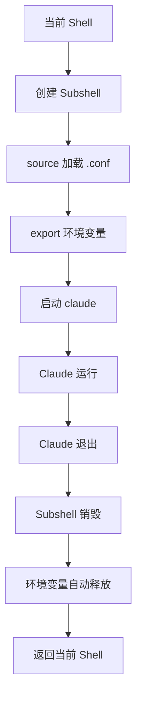
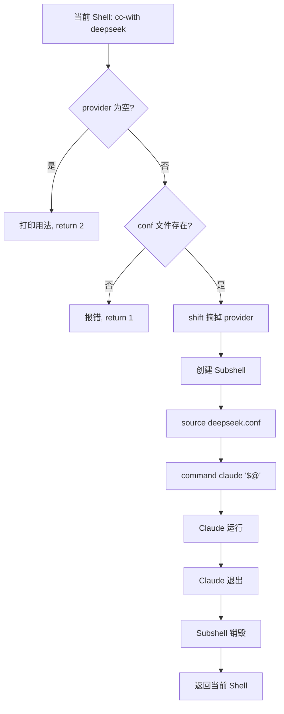
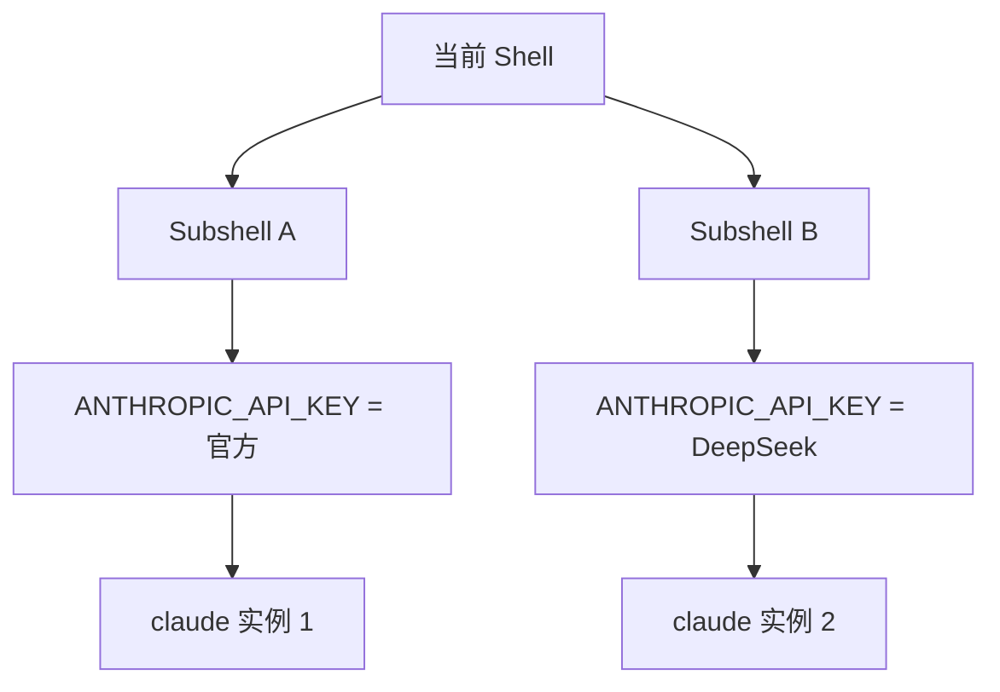

# 1. 背景与目标

## 1.1 问题场景

在同一台机器上需要灵活切换不同的 Claude Provider（如官方 Claude、DeepSeek 等）。由于 Claude Code 只能识别一种 `ANTHROPIC_API_KEY` 环境变量，直接在当前 Shell 中 `source` 不同配置会导致：

- 当前 Shell 环境变量被反复污染；
- 退出后旧变量仍残留，需要手动 `unset`；
- 多 Provider 共存困难，无法并行运行。

## 1.2 设计目标

| 目标 | 说明 |
|---|---|
| 环境隔离 | Provider 配置不污染当前 Shell |
| 自动清理 | 退出 Claude 后环境变量自动释放 |
| 多 Provider 共存 | 支持同时启动多个不同 Provider 的实例 |
| 零 unset | 无需手动维护 `unset` 列表 |
| 模块化配置 | 配置文件按 Provider 拆分，互不干扰 |

## 1.3 核心思路

将不同 Provider 的 API 配置拆分为独立 `.conf` 文件，通过 Bash 函数在 **subshell（子 Shell）** 中临时加载对应配置后启动 `claude`，借助 subshell 的生命周期实现环境变量的自动回收。

> [!summary]
> **核心方案**：`subshell + source + command claude` 三段式启动，实现环境隔离、自动清理、多 Provider 共存。

---

# 2. 核心概念

## 2.1 Subshell 环境隔离

括号 `(...)` 会在 Bash 中创建一个新的子进程（subshell）：

```bash
(
    source xxx.conf
    command claude
)
```

其生命周期如下：



因此退出 Claude 后，在当前 Shell 执行：

```bash
echo $ANTHROPIC_API_KEY
```

仍然为空，无需 `unset`。

> [!info]
> Subshell 中的 `export` 仅作用于该子进程及其子进程，对父 Shell 不可见。

## 2.2 command 内建命令

推荐使用：

```bash
command claude
```

而非直接：

```bash
claude
```

`command` 会忽略：

- alias
- shell function

直接执行 `PATH` 中真正的 `claude` 可执行文件，避免递归调用自己的包装函数。

> [!warning]
> 若不使用 `command` 且当前 Shell 中存在同名函数或 alias，可能导致函数递归调用自身，引发栈溢出。

## 2.3 source 的行为特性

`source` 只会执行当前文件中的命令，**不会撤销**之前已经执行过的命令。

```bash
source claude.conf      # 当前 Shell 拥有 ANTHROPIC_API_KEY
source deepseek.conf    # 同名变量被覆盖，但仍是"设置"动作
```

即使后续：

```bash
source ~/.bashrc
```

旧变量仍然存在。这是因为 **Bash 不会自动删除已存在的环境变量**，必须显式：

```bash
unset ANTHROPIC_API_KEY
```

才能恢复。

> [!tip]
> 把 `source` 想成"只增不减"的命令：它只会执行配置中的赋值语句，不会因为重新加载就清空旧值。

---

# 3. 架构设计

## 3.1 目录结构

建议将 Bash 配置拆分管理，而不是全部写在 `.bashrc` 中：

```text
~/.config/bash/
├── env.sh
├── aliases.sh
├── functions.sh
└── agent-key/
    ├── claude.conf
    ├── deepseek.conf
    └── ...
```

## 3.2 模块职责

| 文件 | 职责 |
|---|---|
| `env.sh` | 通用环境变量 |
| `aliases.sh` | alias 定义 |
| `functions.sh` | Bash 函数（含 `cc-with`） |
| `agent-key/*.conf` | Provider API 配置，一个文件对应一个 Provider |

## 3.3 Provider 配置文件

每个 Provider 一个独立 `.conf` 文件，仅导出该 Provider 所需的环境变量。

### 3.3.1 claude.conf

```bash
export ANTHROPIC_API_KEY="..."
```

### 3.3.2 deepseek.conf

```bash
export ANTHROPIC_API_KEY="..."
```

> [!info]
> 即使两个文件使用了相同的变量名 `ANTHROPIC_API_KEY` 也没有关系，因为最终只会加载其中一个配置文件，且运行在独立的 subshell 中。

---

# 4. 关键实现

## 4.1 cc-with 启动函数

将以下实现放入 `~/.config/bash/functions.sh`：

```bash
cc-with() {
    local provider="$1"

    if [[ -z "$provider" ]]; then
        echo "用法: cc-with <provider> [claude 参数...]"
        echo
        echo "可用 provider:"
        echo "  - claude"
        echo "  - deepseek"
        return 2
    fi

    shift

    local conf="$HOME/.config/bash/agent-key/${provider}.conf"

    if [[ ! -f "$conf" ]]; then
        echo "未知 provider: $provider"
        return 1
    fi

    (
        source "$conf"
        command claude "$@"
    )
}
```

## 4.2 调用方式

| 场景 | 命令 |
|---|---|
| 启动官方 Claude | `cc-with claude` |
| 启动 DeepSeek | `cc-with deepseek` |
| 传递 `--continue` | `cc-with deepseek --continue` |
| 跳过权限确认 | `cc-with claude --dangerously-skip-permissions` |

所有 `claude` 参数都会通过 `"$@"` 正确透传，不会把 `provider` 名泄漏给 `claude`。

## 4.3 shift 参数处理

以 `cc-with deepseek --continue` 为例：

```text
函数入口:  $1 = deepseek    $2 = --continue
执行 shift: $1 = --continue
command claude "$@"  →  claude --continue
```

> [!tip]
> `provider` 仅用于决定加载哪个 `.conf`，不应传递给 `claude`。`shift` 的作用就是把它从参数列表中"摘掉"。

## 4.4 完整执行流程



整个过程中，`ANTHROPIC_API_KEY` 始终只存在于 subshell 内，不会污染当前 Shell。

---

# 5. 易错点与避坑

## 5.1 source 污染当前 Shell

错误做法：

```bash
source claude.conf
claude
source deepseek.conf
claude
```

后果：

- 当前 Shell 环境变量不断被修改；
- 删除配置后，重新 `source ~/.bashrc` 旧变量仍然存在；
- 必须手动 `unset` 才能恢复。

## 5.2 手动 unset 的脆弱性

例如：

```bash
source deepseek.conf
claude
unset ANTHROPIC_API_KEY
```

存在三类风险：

| 风险 | 说明 |
|---|---|
| 异常退出 | Claude 异常退出（如 `Ctrl+C`）可能导致 `unset` 不执行 |
| 维护成本 | Provider 增多后，需要维护越来越多的 `unset` |
| 容易遗漏 | 新增变量时容易忘记补充对应的 `unset` |

相比之下，subshell 会在退出时直接销毁整个环境，无需关心变量清理。

## 5.3 函数递归调用

若 `functions.sh` 中定义了与 `claude` 同名的函数，直接调用 `claude` 会触发递归。使用 `command claude` 可绕过函数与 alias，直接命中可执行文件。

## 5.4 subshell 的本质

subshell 并不是"设置变量 → 清理变量"，而是：


> [!tip]
> 这种机制类似于 C++ 的 RAII：
> ```cpp
> {
>     std::lock_guard lock(mutex);
>     // ...
> }   // 离开作用域，lock 自动释放
> ```
> subshell 退出括号 `)` 时，整个运行环境自动销毁，思想完全一致。

---

# 6. 最佳实践

## 6.1 多 Provider 并行运行

由于每次 `cc-with xxx` 都会创建独立 subshell，因此可以同时运行多个实例：

```bash
cc-with claude &
cc-with deepseek &
```

实际运行结构：



两者互不影响，环境变量完全隔离。

## 6.2 推荐整体结构

```text
~/.config/bash/
├── env.sh
├── aliases.sh
├── functions.sh
└── agent-key/
    ├── claude.conf
    ├── deepseek.conf
    └── ...
```

| 模块 | 职责 |
|---|---|
| `agent-key/*.conf` | 仅维护 Provider API 配置 |
| `functions.sh` | 封装 `cc-with` 启动函数 |
| 启动方式 | 统一通过 `subshell + source + command claude` |

