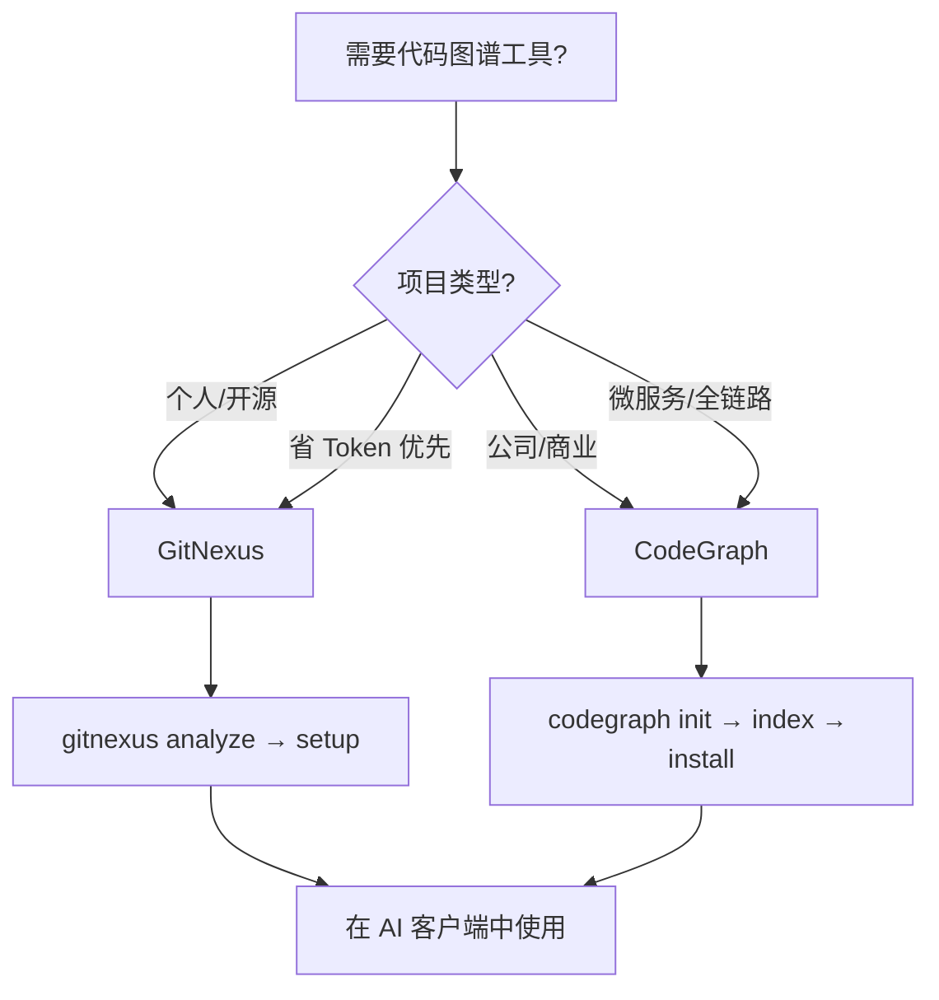
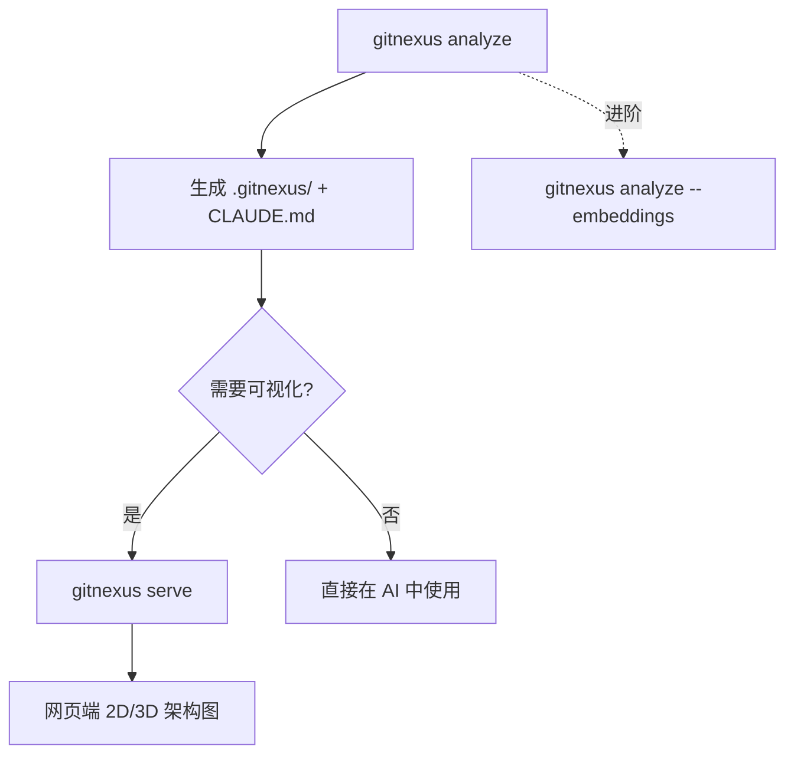
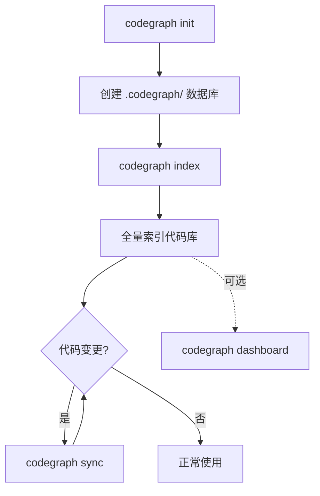

# 1. 背景与动机

AI 编程助手（Claude Code、Open Code 等）在理解大型代码库时面临核心瓶颈：**缺乏项目级结构化上下文**。单文件分析无法回答“修改这个函数会影响哪些模块”这类跨文件问题。

**代码图谱工具**通过预构建调用关系图，将代码架构以结构化数据提供给 AI，使其具备：

- 爆炸半径分析能力
- 全链路调用追踪能力
- 精准测试定位能力

当前主流的两款本地代码图谱工具均基于 **MCP_概念|MCP** 协议，本笔记覆盖其选型、安装、使用、接入与避坑全流程。

---

# 2. 工具选型：GitNexus vs CodeGraph

| 维度 | GitNexus | CodeGraph |
|:-----|:---------|:----------|
| **设计哲学** | 预计算关系型智能 | 全链路无死角追踪 |
| **开源协议** | PolyForm 非商业限制 | MIT / Apache-2.0 自由商用 |
| **核心优势** | 一次分析，AI 单次查询即获完整爆炸半径，极省 Token | 横跨前端→后端→数据库全链路追踪 |
| **适用场景** | 个人项目、开源贡献 | 大工程、微服务架构 |
| **可视化** | 网页端 2D/3D 架构图 | 本地力导向图大盘 |
| **增量同步** | 重新 `analyze` | `sync` 增量同步 |
| **卸载命令** | `gitnexus remove --all` | `codegraph uninstall` |

> [!warning] 协议选择易错点
> GitNexus 采用 **PolyForm 非商业限制协议**，不可用于公司闭源商业项目。若工作场景涉及商业闭源代码，必须选择 CodeGraph。

### 快速决策



---

# 3. GitNexus

## 3.1 设计哲学

采用 **预计算（Precomputed Relational Intelligence）** 技术：一次分析预先算好所有调用链，AI 后续单次查询即可获取完整爆炸半径，无需反复遍历代码树，**极省 Token**。

## 3.2 安装

推荐全局安装。若国内直连官方源受阻，先切换镜像源：

```bash
# 切换至国内阿里镜像源
npm config set registry https://npmmirror.com

# 全局安装
npm install -g gitnexus
```

将 gitnexus 的 MCP 配置写入到本地已安装的 claude code（`~/.claude.json`）、opencode（`~/.config/opencode/opencode.json`） 和 codex 等一系列 AI Agent 中：

```bash
gitnexus setup
```

## 3.3 标准工作流



进入项目根目录后执行：

```bash
# 1. 深度全量分析，生成本地图谱 .gitnexus/ 隐藏目录及 CLAUDE.md
gitnexus analyze

# 1.5 (进阶) 开启语义向量搜索
gitnexus analyze --embeddings

# 2. 启动本地服务器，配合网页端渲染 2D/3D 架构图
gitnexus serve
```

## 3.4 命令字典

| 命令 | 用途 | 备注 |
|:-----|:-----|:-----|
| `gitnexus setup` | 一键为所有 AI 工具配置全局 MCP | 支持 Cursor、Claude Code 等 |
| `gitnexus analyze` | 深度全量分析，生成本地图谱 | 产出 `.gitnexus/` + `CLAUDE.md` |
| `gitnexus analyze --embeddings` | 开启语义向量搜索 | 进阶模式 |
| `gitnexus serve` | 启动本地服务器 | 配合网页端可视化 |
| `gitnexus wiki` | 根据图谱自动生成 Markdown 架构说明书 | 亮点功能 |
| `gitnexus context <函数名>` | 查看符号 360° 全景视图 | Callers / Callees |
| `gitnexus impact <函数名>` | 分析修改某函数后的爆炸半径 | — |
| `gitnexus clean` | 删除 `.gitnexus/` 缓存与 AI 上下文 | 安全删除 |
| `gitnexus remove --all` | 从所有 AI 工具配置中移除 MCP 节点 | 卸载器 |

## 3.5 卸载

完整卸载分两步：

```bash
# 1. 从所有 AI 工具配置中移除 MCP 节点
gitnexus remove --all

# 2. 卸载 npm 全局包
npm uninstall -g gitnexus
```

若还需清理项目级缓存：

```bash
# 在项目根目录执行
gitnexus clean
```

---

# 4. CodeGraph

## 4.1 设计哲学

核心强在 **全链路、无死角追踪**：能横跨“前端 Fetch → 后端路由 → 数据库 SQL”进行追踪，适合大工程与微服务架构。

## 4.2 安装

CodeGraph 提供交互式一键安装脚本：

```bash
npx @colbymchenry/codegraph
```

将 gitnexus 的 MCP 配置写入到本地已安装的 claude code（`~/.claude.json`）、opencode（`~/.config/opencode/opencode.json`） 和 codex 等一系列 AI Agent 中：

```bash
codegraph install --yes                              # 自动检测，全局安装
codegraph install --target=cursor,claude --yes       # 指定目标列表
codegraph install --target=auto --location=local     # 检测到的 agents，项目本地安装
codegraph install --print-config codex               # 打印配置片段，不写入文件
```

## 4.3 标准工作流



进入项目根目录后执行：

```bash
# 1. 初始化项目（创建 .codegraph/ 隐藏数据库）
codegraph init

# 2. 全量索引代码库
codegraph index

# 3. 后续代码变更后进行增量同步
codegraph sync
```

## 4.4 命令字典

| 命令 | 用途 | 备注 |
|:-----|:-----|:-----|
| `codegraph init` | 初始化项目，创建 `.codegraph/` 数据库 | — |
| `codegraph index` | 全量索引代码库 | — |
| `codegraph sync` | 增量同步代码变更 | 极快 |
| `codegraph install` | 一键集成 MCP 到 Claude Code、Open Code 等 | — |
| `codegraph uninstall` | 从所有 AI 工具中移除该 MCP | 卸载器 |
| `codegraph uninit` | 删除 `.codegraph/` 本地数据库 | — |
| `codegraph callers <符号>` | 抓出全项目内调用该函数的位置 | — |
| `codegraph impact <符号>` | 重构影响分析，计算间接破坏的上游模块 | — |
| `codegraph affected [文件路径]` | 根据代码改动反向查找应运行的测试文件 | — |
| `codegraph dashboard` | 启动本地前端大盘 | `localhost:3000` |

## 4.5 卸载

完整卸载分两步：

```bash
# 1. 从所有 AI 工具配置中移除 MCP 节点
codegraph uninstall

# 2. 清理项目级数据库（在项目根目录执行）
codegraph uninit
```

---

# 6. 避坑指南：fnm 动态路径陷阱

如果使用的是 fnm 的 nodejs 安装 gitnexus，使用 `type -a gitnexus` 时可能会发现其路径指向类似：

```bash
/run/user/1000/fnm_multishells/509_1779893283210/bin/gitnexus
```

> [!danger] 核心陷阱
> 路径后半部分的数字由 ==当前终端 PID + 启动时间戳== 组合而成。每次重启系统或新建终端窗口，该路径都会 **彻底改变并销毁旧路径**。

> [!warning] 常见错误
> 在 `mcp.json` 中填写 fnm 动态绝对路径 → 重启后 AI 报错找不到可执行文件。这是 fnm 用户最常踩的坑。

**正确做法**：在配置中绝不写死绝对路径，直接隐式调用命令名 `gitnexus` / `codegraph`，或使用 `npx` 动态拉取。系统会通过当前 PATH 自动寻找最新生效的二进制文件。

| 做法 | 结果 |
|:-----|:-----|
| 填写 fnm 动态绝对路径 | 重启后 AI 报错 |
| 直接使用命令名 | 系统自动通过 PATH 查找 |
| 使用 `npx` 动态拉取 | 无需全局安装，自动获取最新版 |

---

# 7. 总结

> [!summary] 本笔记核心要点
> 1. **GitNexus** 适合个人/开源项目，预计算省 Token，但协议禁止商业使用
> 2. **CodeGraph** 适合商业/微服务项目，MIT 协议自由商用，支持全链路追踪与增量同步
> 3. 两款工具均支持一键安装/卸载 MCP 配置，接入 Claude Code 后自动管理服务生命周期
> 4. **fnm 用户必须避免写死绝对路径**，使用命令名或 npx 动态调用
> 5. MCP 协议原理详见 [[01_MCP_概念]]
