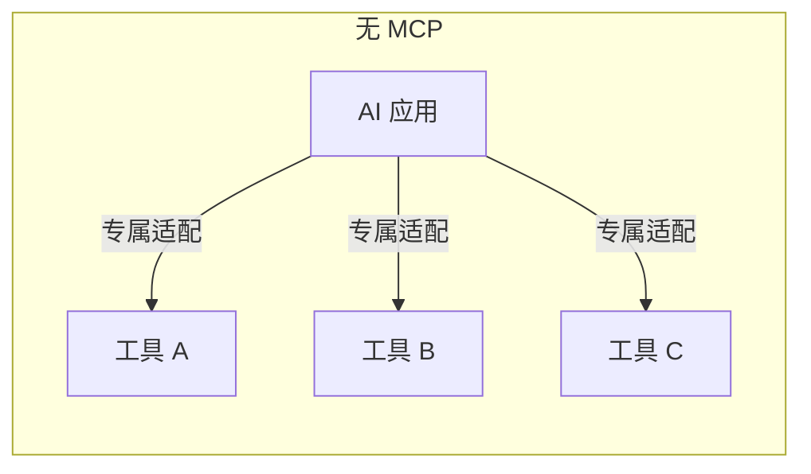
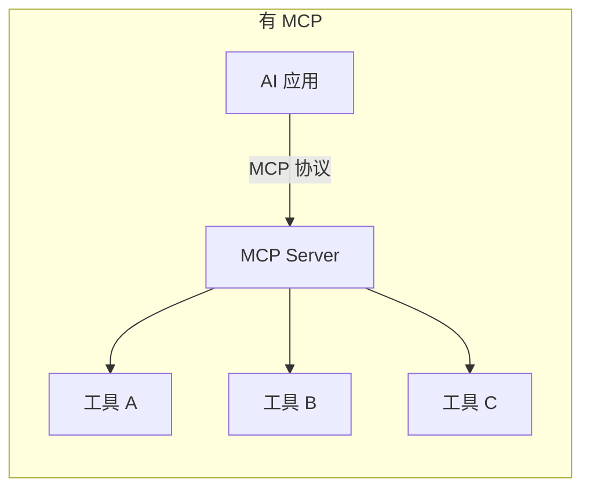
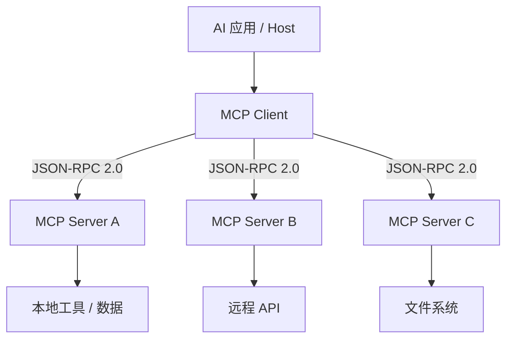
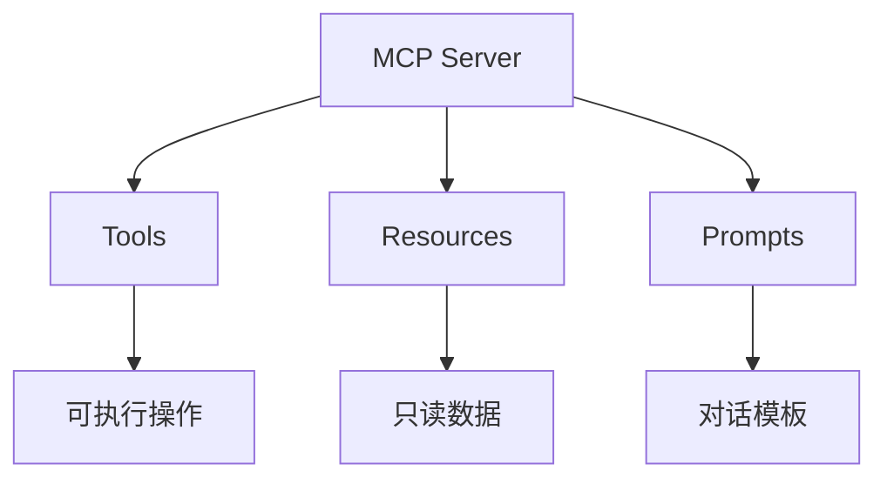
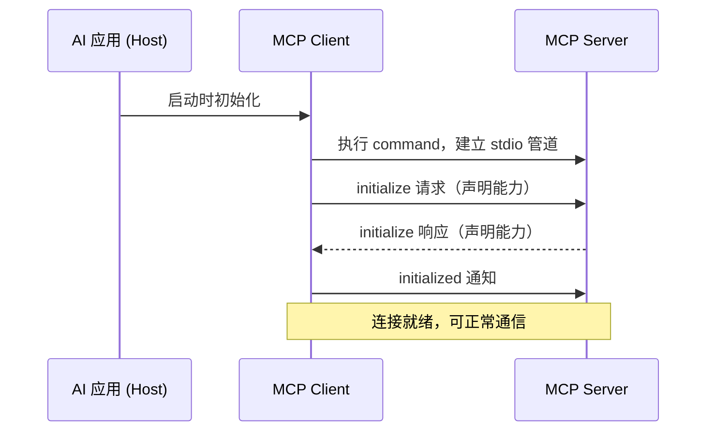
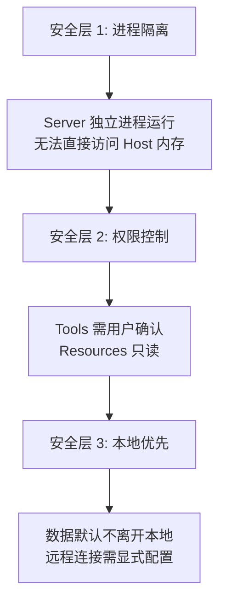

# 1. MCP 是什么

**MCP（Model Context Protocol，模型上下文协议）** 是 Anthropic 于 2024 年 11 月推出的开源开放标准，旨在统一 AI 模型与外部工具、数据源之间的通信方式。

> [!abstract] 一句话定义
> MCP 是 AI 时代的 “USB 接口协议”——USB 统一了外设与计算机的连接方式，MCP 统一了工具与 AI 模型的连接方式。

在 MCP 出现之前，每接入一个新工具，AI 应用都需要单独编写适配代码（类似每个外设都需要专属驱动）。MCP 将这种“一对一”的适配模式，转变为“一对多”的标准协议模式：





---

# 2. 为什么需要 MCP

## 2.1 现有痛点

| 痛点 | 具体表现 |
|:-----|:---------|
| **适配成本高** | 每个工具需要为每个 AI 应用单独开发集成，$N$ 个工具 $\times$ $M$ 个应用 = $N \times M$ 种适配 |
| **接口不统一** | 各工具的调用方式、参数格式、返回结构各不相同，AI 应用无法复用集成逻辑 |
| **安全边界模糊** | 工具直接嵌入 AI 应用进程，缺乏权限隔离与访问控制 |
| **上下文割裂** | AI 无法同时访问多个数据源（代码库、数据库、日志等），只能逐个手动喂入 |

## 2.2 MCP 的解决思路

MCP 通过 **标准化协议 + 客户端-服务器架构** 解决上述问题：

| 问题 | MCP 方案 |
|:-----|:---------|
| 适配成本高 | 工具只需实现一次 MCP Server，所有 MCP Client 均可接入 |
| 接口不统一 | 统一的三要素模型（Tools / Resources / Prompts） |
| 安全边界模糊 | Server 独立进程运行，Client 通过协议通信，天然隔离 |
| 上下文割裂 | 一个 Client 可同时连接多个 Server，聚合多源上下文 |

---

# 3. 核心架构

## 3.1 客户端-服务器模型

MCP 采用经典的 **Client-Server** 架构：



| 角色 | 职责 | 示例 |
|:-----|:-----|:-----|
| **Host** | 承载 AI 模型的应用程序 | Claude Desktop、VS Code + Cline |
| **Client** | 在 Host 内部运行，与 Server 建立连接 | Claude Code 内置的 MCP Client |
| **Server** | 独立进程，暴露工具和数据供 AI 调用 | GitNexus MCP Server、CodeGraph MCP Server |

> [!tip] 记忆技巧
> 可类比为浏览器架构：Host = 浏览器，Client = 渲染进程，Server = 后端服务。Client 向 Server 请求数据，Server 返回结果，但 Server 不知道也不关心 Client 是谁。

## 3.2 通信协议

MCP 使用 **JSON-RPC 2.0** 作为底层通信协议，支持两种传输方式：

| 传输方式 | 机制 | 适用场景 |
|:---------|:-----|:---------|
| **stdio** | 通过标准输入/输出通信 | 本地 MCP Server（同一台机器） |
| **SSE (Server-Sent Events)** | 通过 HTTP 长连接通信 | 远程 MCP Server（跨网络） |

典型的 stdio 通信配置：

```json
{
  "mcpServers": {
    "gitnexus": {
      "command": "gitnexus",
      "args": ["mcp"]
    }
  }
}
```

> [!info] stdio 通信流程
> 1. AI 应用启动时，根据配置执行 `command`，将子进程的 stdin/stdout 作为通信管道
> 2. Client 通过 stdin 向 Server 发送 JSON-RPC 请求
> 3. Server 通过 stdout 向 Client 返回 JSON-RPC 响应
> 4. AI 应用退出时，子进程自动终止

---

# 4. 三要素详解

MCP Server 通过三种能力原语（primitives）向 AI 暴露功能：



## 4.1 Tools（工具）

**定义**：允许 AI 模型 **执行操作** 的可调用函数。

| 属性 | 说明 |
|:-----|:-----|
| **权限** | 可执行写操作（修改文件、运行命令等） |
| **调用方式** | AI 主动发起，需用户确认（可配置白名单免确认） |
| **输入** | JSON Schema 定义的结构化参数 |
| **输出** | 文本、图片或嵌入式资源 |

**典型示例**：

| 工具名 | 功能 | 参数 |
|:-------|:-----|:-----|
| `get_call_graph` | 获取函数调用图 | `symbol: string` |
| `analyze_impact` | 分析修改爆炸半径 | `symbol: string` |
| `run_test` | 执行指定测试 | `test_path: string` |

> [!warning] 安全提示
> Tools 具有 **执行能力**，AI 可通过 Tools 修改文件、运行命令。务必在 AI 工具中配置确认策略，避免误操作。

## 4.2 Resources（资源）

**定义**：向 AI 模型提供 **只读数据** 的上下文源。

| 属性 | 说明 |
|:-----|:-----|
| **权限** | 只读，AI 无法通过 Resources 修改任何数据 |
| **访问方式** | AI 按需读取，或由应用主动附加到上下文 |
| **格式** | 文本、二进制（图片、PDF 等） |
| **URI 标识** | 每个资源有唯一 URI（如 `codegraph://project/structure`） |

**典型示例**：

| 资源 URI | 内容 |
|:---------|:-----|
| `file:///project/src/main.ts` | 源代码文件 |
| `codegraph://project/dependencies` | 项目依赖关系图 |
| `gitnexus://project/architecture` | 项目架构概览 |

## 4.3 Prompts（提示词模板）

**定义**：预设的 **快捷对话模板**，封装常用交互模式。

| 属性 | 说明 |
|:-----|:-----|
| **用途** | 将高频操作封装为一键触发的对话模板 |
| **参数化** | 支持动态参数，模板可复用 |
| **触发方式** | 用户在 AI 界面中选择并触发 |

**典型示例**：

| 模板名 | 功能 | 参数 |
|:-------|:-----|:-----|
| `analyze_blast_radius` | 分析某函数的爆炸半径 | `function_name: string` |
| `explain_architecture` | 解释项目架构 | `depth: number` |

## 4.4 三要素对比

| 维度 | Tools | Resources | Prompts |
|:-----|:------|:----------|:--------|
| **读写性** | 可读可写 | 只读 | — |
| **触发方** | AI 主动调用 | AI 按需读取 | 用户主动触发 |
| **副作用** | 有（执行操作） | 无 | 无 |
| **安全级别** | 高（需确认） | 低（只读） | 低（仅文本） |
| **类比** | API 的 POST/PUT | API 的 GET | 快捷指令 |

---

# 5. 生命周期与连接管理

## 5.1 连接建立流程



## 5.2 能力协商

连接建立时，Client 和 Server 通过 `initialize` 消息互相声明支持的能力：

- **Client 告知 Server**：我支持采样（sampling）、根目录列表等
- **Server 告知 Client**：我提供哪些 Tools、Resources、Prompts

这种协商机制确保双方只使用对方支持的功能，避免兼容性问题。

## 5.3 连接关闭

- **正常关闭**：AI 应用退出时，Client 发送关闭通知，Server 优雅退出
- **异常关闭**：进程被杀死时，stdio 管道断开，Server 自动检测并退出

---

# 6. 安全模型

MCP 的安全设计遵循 **最小权限 + 显式授权** 原则：



| 安全机制 | 说明 |
|:---------|:-----|
| **进程隔离** | Server 以独立子进程运行，与 Host 内存隔离 |
| **用户确认** | Tools 调用默认需用户确认，可配置白名单免确认 |
| **只读保证** | Resources 只提供数据，AI 无法通过 Resources 修改任何内容 |
| **本地优先** | 默认 stdio 本地通信，数据不经过网络 |
| **无隐式访问** | Server 只能访问用户显式授权的资源 |

> [!tip] 记忆技巧
> MCP 的安全模型可类比为手机 App 权限机制：App（Server）需要权限才能访问相机（Tool），照片库只读（Resource），快捷指令一键触发（Prompt），且所有权限需用户授权。

---

# 7. 生态与工具链

## 7.1 MCP Server 生态

MCP Server 按功能可分为以下类别：

| 类别 | 典型 Server | 功能 |
|:-----|:-----------|:-----|
| **代码智能** | GitNexus、CodeGraph | 代码图谱、调用分析、爆炸半径 |
| **文件系统** | filesystem | 读写本地文件 |
| **数据库** | sqlite、postgres | 查询数据库 |
| **开发工具** | github、gitlab | Issue、PR 管理 |
| **搜索** | brave-search、google | 网络搜索 |
| **通信** | slack、discord | 消息收发 |

## 7.2 MCP Client 生态

| Client | 类型 | 说明 |
|:-------|:-----|:-----|
| Claude Desktop | 桌面应用 | Anthropic 官方客户端 |
| Claude Code | CLI 工具 | 终端内 AI 编程助手 |
| VS Code + Cline | IDE 插件 | VS Code 内 AI 编程 |
| Cursor | IDE | 内置 MCP 支持 |
| Open Code | IDE 插件 | VS Code 架构 AI 编程 |

---

# 8. MCP 配置文件结构

MCP 的配置以 JSON 格式声明 Server 连接信息，通常位于 AI 工具的配置目录中：

```json
{
  "mcpServers": {
    "server-name": {
      "command": "可执行文件名或路径",
      "args": ["参数1", "参数2"],
      "env": {
        "ENV_VAR": "value"
      }
    }
  }
}
```

| 字段 | 必填 | 说明 |
|:-----|:-----|:-----|
| `command` | 是 | 启动 Server 的命令 |
| `args` | 否 | 命令参数列表 |
| `env` | 否 | 传递给 Server 的环境变量 |

> [!warning] fnm 用户注意
> 若使用 fnm 管理 Node.js 版本，`command` 字段 **切勿填写 fnm 的动态绝对路径**（路径随终端重启而变化）。应直接使用命令名（如 `gitnexus`），让系统通过 PATH 自动解析。详见 [[代码图谱#7. 避坑指南：fnm 动态路径陷阱]]

---

# 9. 总结

> [!summary] 本笔记核心要点
> 1. **MCP 是 AI 与工具的统一通信协议**，解决"一对一适配"到"一对多标准"的问题
> 2. **架构**：Client-Server 模型，通过 JSON-RPC 2.0 通信，支持 stdio 和 SSE 两种传输
> 3. **三要素**：Tools（可执行操作）、Resources（只读数据）、Prompts（对话模板）
> 4. **安全**：进程隔离 + 用户确认 + 只读保证 + 本地优先
> 5. **生态**：Server 提供能力，Client 消费能力，配置文件声明连接信息
