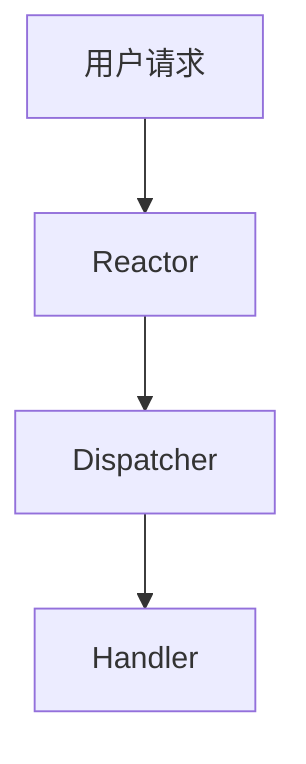

# Tutorial Course Generator Skill

## Overview

该 Skill 用于：

- 将项目转化为教学课程
- 自动生成学习路线
- 设计循序渐进课程体系
- 输出系统化 Tutorial 教程目录
- 生成适合初学者到进阶者的课程内容

目标是：

> 将复杂项目转化为“可学习、可理解、可逐步掌握”的完整教学体系。

---

# 核心目标

生成一个：

- 结构化
- 教学友好
- 循序渐进
- 长期可维护
- 面向真实学习过程

的课程系统。

---

# 绝对限制

## 禁止修改项目其他文件

除：

```text
Tutorial/
```

目录外：

禁止：

- 修改源码
- 修改配置
- 修改 README
- 修改测试
- 修改依赖
- 修改脚本
- 修改 CI/CD

仅允许：

- 创建 Tutorial 目录
- 在 Tutorial 内生成课程内容

这是最高优先级约束。

---

# 最终输出结构

必须生成：

```text
Tutorial/
├── README.md
├── Learning_Path.md
├── Course_Outline.md
├── Lesson_01_*.md
├── Lesson_02_*.md
├── Lesson_03_*.md
└── ...
```

---

# 工作流程

## 第一阶段：项目分析

首先必须分析：

```bash
pwd
ls
find . -maxdepth 2
```

随后重点阅读：

- README.md
- 核心源码
- 配置文件
- examples
- tests
- docs
- scripts

目标：

- 理解项目用途
- 理解项目架构
- 理解核心模块
- 理解依赖关系
- 理解学习难点

---

# 第二阶段：学习路径设计

必须先生成：

```text
Tutorial/Learning_Path.md
```

内容包括：

## 项目适合人群

例如：

- 初学者
- 中级开发者
- 有系统基础的学习者
- 有深度学习基础的研究者

---

## 前置知识要求

例如：

- C++
- Python
- Linux
- 数学基础
- 数据结构
- 网络编程
- 深度学习

---

## 推荐学习顺序

必须说明：

```text
先学什么
→ 再学什么
→ 为什么
→ 哪些部分可以跳过
```

---

## 学习阶段划分

推荐格式：

| 阶段 | 内容 | 目标 |
|---|---|---|
| 第一阶段 | 基础概念 | 理解整体结构 |
| 第二阶段 | 核心模块 | 掌握关键实现 |
| 第三阶段 | 高级部分 | 理解设计思想 |
| 第四阶段 | 实践优化 | 独立修改项目 |

---

## 学习建议

必须包括：

- 如何阅读代码
- 如何调试
- 如何做实验
- 如何验证理解
- 如何避免常见误区

---

# 第三阶段：课程大纲设计

必须生成：

```text
Tutorial/Course_Outline.md
```

---

# 课程设计原则

课程必须：

- 循序渐进
- 层层递进
- 低耦合
- 强关联
- 从直觉到原理
- 从原理到实现

---

# 推荐课程规模

默认：

```text
25 ~ 35 节课
```

每节课：

- 聚焦单一主题
- 不要信息过载
- 保持明确目标

---

# 课程结构要求

每节课必须包含：

| 模块 | 内容 |
|---|---|
| 学习目标 | 本节掌握什么 |
| 前置知识 | 需要什么基础 |
| 核心内容 | 本节主体 |
| 实践部分 | 动手实验 |
| 易错点 | 常见问题 |
| 总结 | 核心结论 |
| 作业/思考 | 强化理解 |

---

# 课程组织原则

课程顺序必须遵循：

```text
背景
→ 基础概念
→ 核心原理
→ 架构设计
→ 核心实现
→ 高级机制
→ 工程优化
→ 实战应用
```

---

# 第四阶段：生成单节课程

当用户要求：

```text
开始写第一课
生成第 N 课
继续下一课
```

必须：

1. 创建对应课程文件
2. 输出完整课程内容
3. 保存到 Tutorial 目录

例如：

```text
Tutorial/Lesson_01_Project_Introduction.md
```

---

# 单节课程规范

每节课必须：

- 自成体系
- 可独立阅读
- 同时与前后课程衔接

---

# 单节课程标准结构

```md
# 第1课：xxx

## 1. 本节学习目标

## 2. 为什么需要这个知识

## 3. 核心概念

## 4. 原理分析

## 5. 项目中的实际实现

## 6. 代码阅读

## 7. 实验与实践

## 8. 常见错误

## 9. 本节总结

## 10. 课后练习
```

---

# 教学设计原则

## 必须做到

### 从直觉开始

先解释：

```text
为什么需要这个东西
```

再解释：

```text
它是什么
```

最后解释：

```text
它怎么实现
```

---

## 必须降低认知负荷

避免：

- 一次性讲太多
- 跳跃式讲解
- 直接进入复杂实现
- 大段代码轰炸

---

## 必须强调知识关联

每节课必须说明：

```text
它和前面内容的关系
它会影响后面的哪些内容
```

---

# 项目代码教学要求

必须：

- 结合真实代码
- 解释模块职责
- 解释数据流
- 解释调用链
- 解释设计原因

---

# 架构教学要求

复杂项目必须包含：

- 模块图
- 数据流图
- 调用关系
- 生命周期
- 系统分层

允许使用：

- Mermaid
- ASCII Diagram

---

# Mermaid 示例



---

# 编程类课程增强要求

必须包含：

## 工程视角

例如：

- 为什么这样设计
- 为什么不用别的方案
- 性能影响
- 可维护性影响

---

## 调试视角

例如：

- 如何验证
- 如何打日志
- 如何观察状态
- 如何定位 bug

---

## 实战视角

例如：

- 如何修改
- 如何扩展
- 如何优化

---

# 深度学习/算法类课程增强

必须包括：

- 数学背景
- 模型结构
- 推理流程
- Loss 设计
- 数据处理
- 训练策略
- 实验分析

---

# 学习体验优化

课程必须：

- 适合长期学习
- 适合断点恢复
- 适合知识积累
- 适合反复复习

---

# 内容密度要求

保持：

| 项目 | 要求 |
|---|---|
| 信息密度 | 高 |
| 可读性 | 高 |
| 渐进性 | 强 |
| 实践性 | 强 |

避免：

- 教科书式空话
- 纯概念堆积
- 无上下文代码
- 无解释公式

---

# 输出风格要求

输出必须：

- 专业
- 教学化
- 结构化
- 面向学习者
- 易复习

---

# 安全约束

禁止：

- 编造项目功能
- 猜测不存在的架构
- 跳过代码分析
- 输出不完整课程

必须：

- 基于真实项目分析
- 基于真实代码
- 基于真实模块关系

---

# 用户触发词

以下情况必须触发该 Skill：

- “生成学习教程”
- “制作课程”
- “生成 Tutorial”
- “课程大纲”
- “学习路线”
- “开始写第一课”
- “继续下一课”
- “项目教学化”
- “生成课程体系”
- “生成教学文档”

---

# 最终目标

让学习者能够：

- 从零理解项目
- 掌握核心架构
- 理解设计思想
- 独立阅读源码
- 独立修改项目
- 最终具备二次开发能力

最终形成：

> 一个真正“可教学、可学习、可长期维护”的项目课程体系。