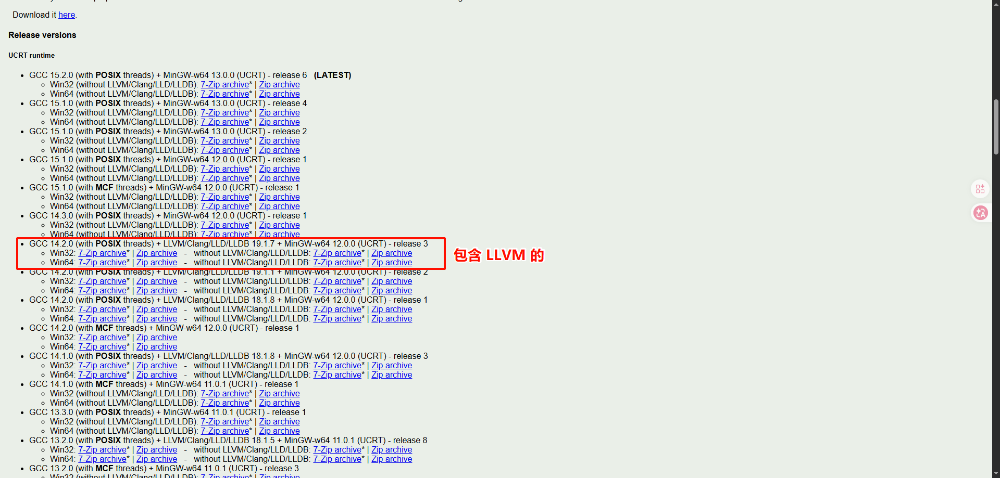
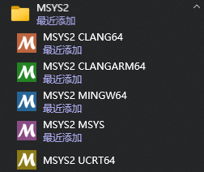
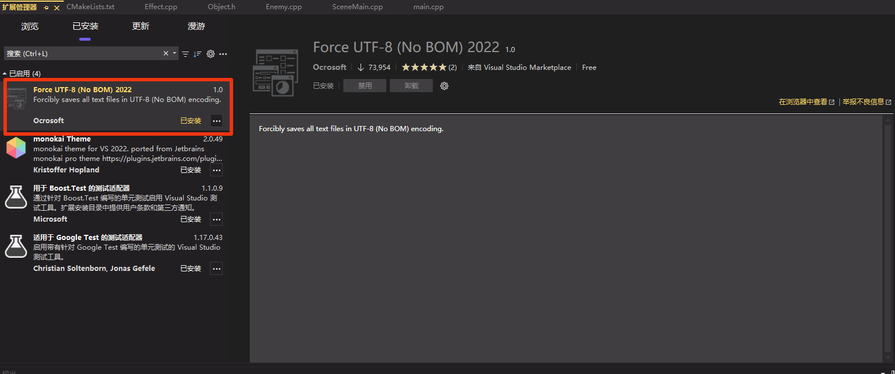

# 1. 方式一：使用 WinLibs

> [WinLibs 下载](https://winlibs.com/)。根据自己系统架构（32 位或者 64 位）选择对应版本。

选择 **UCRT runtime** 版并且包含有 **LLVM/Clang/LLD/LLDB** 的下载。如下所示：



然后解压并把 `bin` 目录添加到环境变量的 `Path` 中即可。

> 这种方式最简单，但是 mingw-llvm 版更新太慢了，如果要用较新的工具链，建议使用 MSYS2。

---

# 2. 方式二：使用 MSYS2（推荐）

> [MSYS2 下载](https://www.msys2.org/)。根据自己系统架构（32 位或者 64 位）选择对应版本。**不建议把 MSYS2 工具链的 `bin` 目录添加到系统环境变量 Path 中**！

MSYS2 是一个用于 Windows 的**软件发行版和构建平台**，它提供了一个完整的 Unix-like 环境。特点如下：

- 使用 **pacman** 包管理器（和 Arch Linux 一样）安装软件
- 编译和运行原本为 Linux/Unix 设计的开源项目
- 获得一个功能强大的 Shell 环境（Bash、Zsh 等）
- 使用 GCC、Clang 等编译器开发原生 Windows 程序

## 2.1 不同环境说明

下载安装好 MSYS2 后，开始菜单会出现多个不同环境的快捷方式：



主要区别在于**编译器工具链**和**C运行时库（CRT）**的不同：

| 环境名称 | 编译器 | C运行时库 | 适用场景 | 特点 |
|---------|--------|----------|---------|------|
| **CLANG64** | Clang/LLVM | UCRT | 需要 Clang 编译器的项目 | 编译速度通常更快，诊断信息更清晰，支持更多 C++ 现代标准特性  |
| **CLANGARM64** | Clang/LLVM | UCRT | ARM64 架构 Windows 设备 | 专门用于编译 ARM64 架构的 Windows 程序（如 Surface Pro X 等） |
| **MINGW64** | GCC | MSVCRT (Microsoft Visual C++ Runtime) | 兼容性优先的 Windows 应用 | 传统的 MinGW-w64 环境，兼容性好但较旧，适合维护遗留项目  |
| **MSYS** | GCC | MSYS2 运行时 | 类 Unix 环境/系统维护 | 提供 POSIX 兼容性层（类似 Cygwin），用于运行 Unix 脚本和 MSYS2 系统维护，**不用于编译原生 Windows 程序**  |
| **UCRT64** | GCC | UCRT (Universal C Runtime) | **现代 Windows 应用开发（推荐）** | 使用 Windows 10/11 自带的通用C运行时，更好的 Unicode 支持，与 Visual Studio 更好的互操作性，是 MSYS2 官方目前推荐的环境  |

对于大多数用户，强烈推荐选择 UCRT64：

1. **官方推荐**：MSYS2 官方自 2022 年起推荐优先使用 UCRT64。
2. **现代化**：使用 Windows 10/11 原生的 UCRT 运行时库，无需额外依赖。
3. **更好的 Unicode 支持**：对 UTF-8 语言环境支持更好。
4. **未来趋势**：微软和 MSYS2 社区都在推动 UCRT 成为标准。

## 2.2 安装工具链

更换镜像源：[MSYS2 软件仓库镜像使用帮助](https://help.mirror.nju.edu.cn/msys2/)。

比如选择南京大学的镜像源，打开自己要用的环境终端直接运行：

```bash
sed -i "s#https\?://mirror.msys2.org/#https://mirror.nju.edu.cn/msys2/#g" /etc/pacman.d/mirrorlist*
```

>安装后记得先更新系统：`pacman -Syu`，然后通过对应环境的终端（这里选择 UCRT64）安装工具链。

安装 gcc：

```bash
pacman -S mingw-w64-ucrt-x86_64-gcc
```

安装 clangd：

```bash
pacman -S mingw-w64-ucrt-x86_64-clang-tools-extra
```

安装 cmake：

```bash
pacman -S mingw-w64-ucrt-x86_64-cmake
```

## 2.3 配置 zsh（可选）

安装 zsh：

```bash
pacman -S zsh
```

安装 starship（美化终端的软件）：

```bash
pacman -S mingw-w64-ucrt-x86_64-starship
```

在 `~/.bashrc` 中添加：

```bash
# 自动切换到 zsh
if [ -t 1 ]; then
  exec zsh
fi
```

> 这种方法的优点是“无痛”，无论你从哪个入口进，只要加载了 bash 就会自动转入 zsh。

也可以通过修改快捷方式目标来更改。如果你想从底层直接启动 zsh，可以修改 UCRT64 快捷方式的属性：

1. 右键点击 **UCRT64** 的快捷方式 -> **属性**。
2. 在“目标”一栏中，你会看到类似： `C:\Apps\msys64\ucrt64.exe`
3. 改为： `C:\msys64\msys2_shell.cmd -ucrt64 -shell zsh`

然后再安装 zimfw，用于管理 zsh 插件：

```bash
# 通过 curl
curl -fsSL https://raw.githubusercontent.com/zimfw/install/master/install.zsh | zsh

# 或者通过 wget
wget -nv -O - https://raw.githubusercontent.com/zimfw/install/master/install.zsh | zsh
```

2. 配置插件。在 `~/.zimrc` 中添加：

```zsh
zmodule zdharma-continuum/fast-syntax-highlighting
```

> 需要把原来的 syntax highlighting 插件删了，再执行 `zimfw uninstall` 进行卸载。

执行 `zimfw install` 安装好并重启终端后即可使用。


## 2.4 添加代码编辑器指令

打开 `~/.zshrc`（如果用的是 zsh）或者 `~/.bashrc`（如果用的是 bash），添加：

```bash
# code editor
alias zed="C:/Apps/Zed/bin/zed"
alias code="C:/Apps/Microsoft\ VS\ Code/bin/code"
alias trae="C:/Apps/Trae\ CN/bin/trae"
```

里面填你安装的代码编辑器的路径，在空格前需要加 `\`（转义字符）。

## 2.5 安装第三方库

通过 msys2 安装第三方库是比较简单的，一般常见的库都可以用 pacman 直接安装，比如：OpenCV，Boost，Eigen 等。这里进行说明时，环境仍然是 MSYS2 UCRT64。

安装 OpenCV 库：

```bash
pacman -S mingw-w64-ucrt-x86_64-opencv

# qt6 作为依赖项安装
pacman -S mingw-w64-ucrt-x86_64-qt6-base
```

有动态库的第三方库（比如 `mingw-w64-ucrt-x86_64-opencv`），相关的 DLL 文件存放在 `/ucrt64/bin` 目录下。

如果你直接在 UCRT64 的终端（那个蓝色的窗口）里执行在 MSYS2 环境下编译好的程序，通常是可以运行的，因为该终端会自动将 `/ucrt64/bin` 加入 PATH；如果你想在在 Windows CMD 或 PowerShell 中运行，你需要将 MSYS2 的 bin 目录（通常是 `C:\msys64\ucrt64\bin`）添加到 Windows 的**系统环境变量**中。

## 2.6 常见问题

> 1. 第三方库的依赖项不全的问题。

用这种方式查找缺失的依赖：

```bash
ldd your_program.exe | grep "not found"
```

使用 strace 追踪程序启动时的加载过程：

```bash
strace your_program.exe 2>&1 | grep ".dll"
```

这能看到程序在哪个文件夹尝试找哪个 DLL，以及到底是“找到但拒绝加载”还是“压根没找到”。

`2>&1` 是是一个 Shell 重定向操作符，它的作用是**把“错误输出”合并到“标准输出”中**。

在 Linux/Unix/MSYS2 系统中，程序有两个输出流：
1. **stdout (1)**：标准输出（正常的程序运行结果）。
2. **stderr (2)**：标准错误（报错、日志、调试信息）。

**`strace` 的输出默认是发送到 `stderr (2)` 的**，因为它的目的是调试。**管道符 `|` 默认只抓取 `stdout (1)`**。如果你只写 `strace your_program.exe | grep ".dll"`，`grep` 是抓不到任何东西的，因为 `strace` 的内容从“错误通道”溜走了。这里的 `2` 代表 **stderr**，`>` 代表 **重定向**，`&1` 代表 **指向 stdout**。

ldd 和 strace 的区别：

|**特性**|**ldd (List Dynamic Dependencies)**|**strace (System Trace)**|
|---|---|---|
|**本质**|**分析器**。读取 EXE 文件的头部信息，列出它**声明**需要的库。|**追踪器**。实时记录程序运行过程中**所有与操作系统的交互**。|
|**工作时机**|程序**不运行**时。|程序**运行中**。|
|**侧重点**|专门看 `.dll` (Windows) 或 `.so` (Linux) 依赖。|所有的系统调用：读写文件、网络连接、内存申请、加载库。|
|**局限性**|无法检测程序运行中动态加载的库（如 `dlopen` 或 Qt 插件）。|输出信息极多，需要通过过滤（grep）才能找到有用信息。|

---

# 3. MSVC 工具链配置

> 有时候不可避免得要用到 MSVC 编译器，因为网上有不少预编译好的 Windows 第三方库，都是用的 MSVC 编译器。

下载后 VS 时（比如下载的是 VS 2022 Community），会自动安装 **Developer Command Prompt for VS 2022** 和 **Developer PowerShell for VS 2022**，这两个终端集成了 MSVC 编译器的环境变量。在该终端中使用指令 `where.exe cl` 会有如下输出：

```shell
PS C:\Apps\Microsoft Visual Studio\2022\Community> where.exe cl
C:\Apps\Microsoft Visual Studio\2022\Community\VC\Tools\MSVC\14.44.35207\bin\Hostx64\x64\cl.exe
```

打开 **Developer PowerShell for VS 2022**，输入：

```shell
code
```

这样打开的代码编辑器就会集成  **Developer PowerShell for VS 2022** 中的环境，再通过打开的编辑器打开对应项目即可。

> 前提是要把 VSCode （或其它代码编辑器）添加到环境变量中。这里建议使用  **Developer PowerShell for VS 2022** 而不是 **Developer Command Prompt for VS 2022**，因为前者的命令行功能更强大。

在编译时指定编译器：`-DCMAKE_C_COMPILER=cl -DCMAKE_CXX_COMPILER=cl`。

如果使用 MSVC 生成器（Visual Studio Generator），是不会生成 `compile_commands.json` 文件的：

```shell
cmake -B build -G "Visual Studio 17 2022" -DCMAKE_BUILD_TYPE=Debug
```

因此，除非要使用 VS 进行开发，其他情况生成器请选择 Ninja 或者 Unix Makefiles。

如果需要使用 clangd LSP，推荐下面三种方法：

1. 方式一：把 Clion 的 clangd 添加到环境变量 Path 中：`C:\Apps\CLion 2025.3.2\bin\clang\win\x64\bin`。
2. 方式二：手动安装 LLVM：[LLVM 下载](https://github.com/llvm/llvm-project)。
3. 方式三：让代码编辑器的自动安装 clangd。比如：Zed 如果检查到环境变量中没有 clangd，会进行自动安装；VSCode 安装 clangd 扩展后，也可以自动安装 clangd。

---

# 4. Windows 下编码问题

> Windows 的控制台编码一般采用的是 GB2312 编码的，但源代码编码采用的是 UTF-8 编码（不建议把源代码文件编码改为 GB2312 格式！），所以当有中文在控制台输出时，会产生乱码。解决方法如下：

- 方式一：如果使用的是 **cmd**，在每次从终端执行可编译好的程序之前，执行：

```shell
chcp 65001
```

执行完后，再执行程序就不会乱码。

- 方式二：如果使用的是 **PowerShell**，可以修改配置文件：

打开配置文件（如果没有的话，会创建）：

```shell
notepad $PROFILE
```

在配置文件中写入：

```shell
# 设置默认编码为 UTF-8
[Console]::OutputEncoding = [System.Text.Encoding]::UTF8
[Console]::InputEncoding = [System.Text.Encoding]::UTF8
$OutputEncoding = [System.Text.Encoding]::UTF8

# 设置环境变量，让子进程也使用 UTF-8
$env:PYTHONIOENCODING = "utf-8"
```

修改完毕后，重启 PowerShell 即可。

如果是在 VS 中运行程序，因为默认打开的是 cmd，所以建议在代码 `main` 函数开头添加：

```cpp
int main(){
  // 设置控制台为 UTF-8
  SetConsoleOutputCP(CP_UTF8);
  SetConsoleCP(CP_UTF8);
  
  // 其它代码......
}
```

如果采用 MSVC 编译，需要在 `CMakeLists.txt` 中给目标程序添加编译选项：

```cmake
# MSVC UTF-8 支持
if(MSVC)
  target_compile_options(my_app PRIVATE /utf-8)
endif()
```

---

# 5. `UTF-8 (No BOM)` 和 `UTF-8 with BOM`

**核心区别：文件头部的“签名”**

- UTF-8 (No BOM)：文件开头直接就是正文数据。它是互联网上的标准形式，具有更好的兼容性。
- UTF-8 with BOM：在文件最开头增加了三个字节：`0xEF 0xBB 0xBF`。
    - BOM（Byte Order Mark，字节顺序标记）原本是为 UTF-16/32 设计用来区分大端或小端序的。
    - 由于 UTF-8 的字节顺序是固定的，BOM 在这里仅作为编码识别标记（告诉软件：这是一个 UTF-8 文件）。

> [!tip] 💡 为什么会有这个区别？

这种区分主要是由 Windows（尤其是微软软件） 引起的：

- 微软习惯：Windows 记事本（Notepad）等旧版工具常通过 BOM 来区分 UTF-8 与 ANSI 等本地编码。
- 非 Windows 环境：Linux、macOS 以及大多数现代编程语言（如 PHP、Python）和编译器通常不建议使用 BOM，因为它们会将这三个字节视为多余的非法字符，从而导致报错或显示乱码。 [2, 6, 7]

 > [!tip] 💡 我该用哪一个？

- 推荐使用：UTF-8 (No BOM)。它是目前代码开发、网页设计和跨平台协作的通用标准。
- 例外情况：只有当你发现某些旧版 Windows 软件（如旧版 Excel 打开 CSV 文件）出现乱码时，才考虑转换成 UTF-8 with BOM 来帮助其识别。

因此在 VS 下推荐下载 **Force UTF-8 (No BOM) 2022** 这个插件：



**总结对比**：

|特性|UTF-8 (No BOM)|UTF-8 with BOM|
|---|---|---|
|文件头部|无特殊标记|包含 `0xEF 0xBB 0xBF`|
|主要用途|网页、代码、Linux/macOS|旧版 Windows 软件识别|
|兼容性|极佳（通用标准）|在某些编译器/脚本中会报错|
|ASCII 兼容|完全兼容|不兼容（开头多了 3 字节）|
