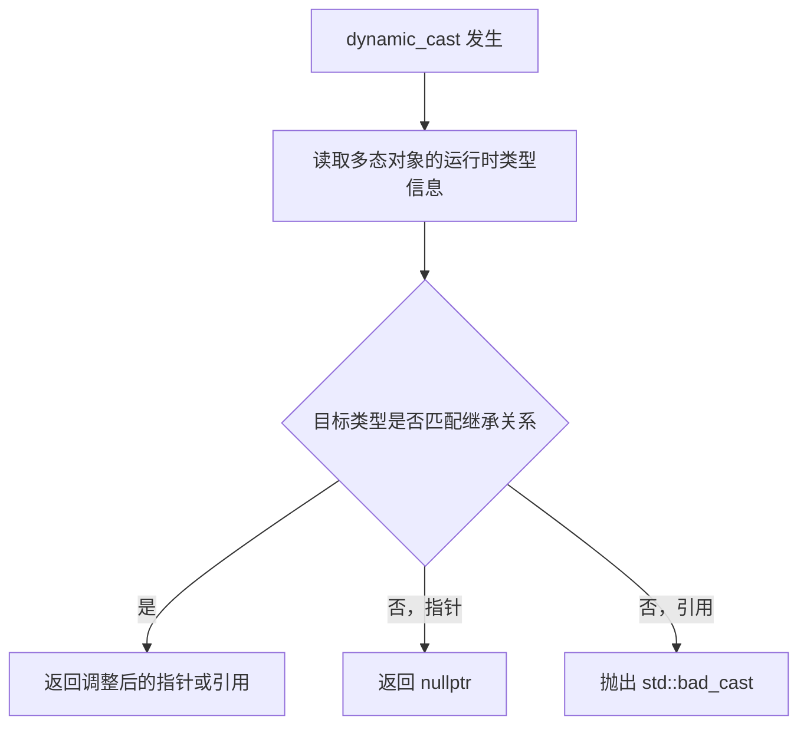
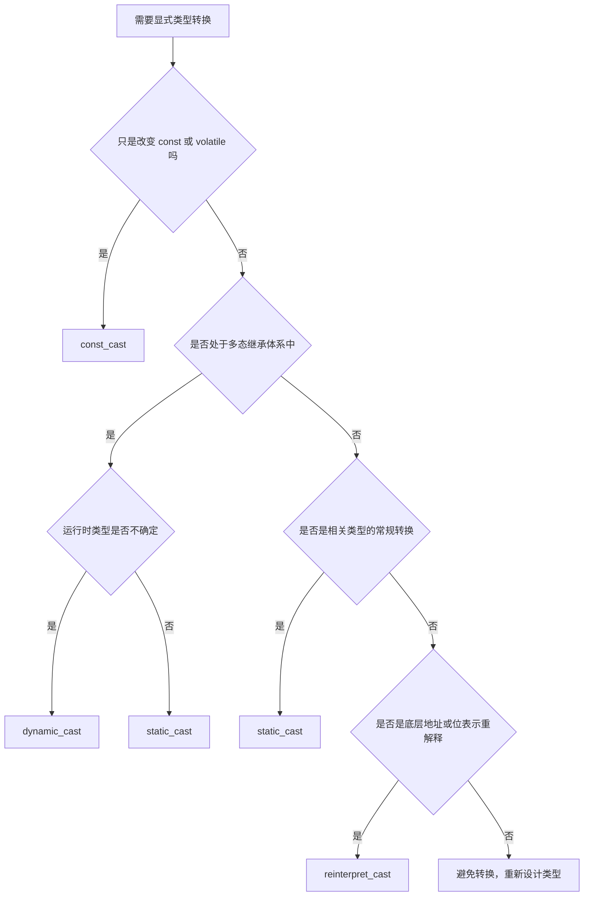

# 1. 总览

C++ 提供四种具名显式类型转换运算符：

```cpp
static_cast<T>(expr)
dynamic_cast<T>(expr)
const_cast<T>(expr)
reinterpret_cast<T>(expr)
```

它们的共同目标是替代 C 风格强制转换 `(T)expr`，让转换意图更清晰，也让编译器和代码审查工具更容易发现风险。

| 转换运算符 | 核心用途 | 检查方式 | 典型风险 |
|---|---|---|---|
| `static_cast` | 相关类型之间的常规转换 | 编译期检查语法合法性 | 向下转型无运行时检查 |
| `dynamic_cast` | 多态继承体系中的安全向下或侧向转换 | 运行时 RTTI 检查 | 有运行时开销，依赖 RTTI |
| `const_cast` | 添加或移除 `const`/`volatile` | 编译期检查限定符变化 | 修改原本为 `const` 的对象是未定义行为 |
| `reinterpret_cast` | 底层位模式或地址重解释 | 几乎不做类型安全检查 | 易违反严格别名、对齐和可移植性要求 |

> [!summary]
> 优先级通常是：能不用转换就不用；需要普通相关类型转换时用 `static_cast`；运行时类型不确定时用 `dynamic_cast`；只改限定符时用 `const_cast`；涉及底层地址或二进制表示时才考虑 `reinterpret_cast`。

---

# 2. static_cast

`static_cast` 用于**编译期可判定的、类型之间存在明确语义关系的转换**。它不会绕过 `const`，不会在运行时检查对象的真实动态类型，也不会把完全无关的指针类型强行互转。

基本语法：

```cpp
static_cast<目标类型>(表达式)
```

## 2.1 基本类型转换

```cpp
int i = 10;
double d = static_cast<double>(i);   // int -> double

double pi = 3.14159;
int n = static_cast<int>(pi);        // double -> int，截断小数部分，n == 3
```

基本类型转换需要注意以下情况：

| 转换 | 说明 |
|---|---|
| 整数到浮点数 | 可能因浮点精度不足而舍入 |
| 浮点数到整数 | 小数部分被截断；若整数类型无法表示该值，行为未定义 |
| 大整数类型到小整数类型 | 可能发生截断或实现定义结果 |

> [!warning]
> `static_cast<int>(3.14)` 的结果是 `3`，但 `static_cast<int>(1e100)` 不只是“溢出”，而是未定义行为，因为目标整数类型无法表示该值。

## 2.2 继承体系中的转换

### 2.2.1 向上转型

派生类指针或引用转换为基类指针或引用称为**向上转型**，通常可以隐式完成。显式写出 `static_cast` 主要是为了标注意图。

```cpp
class Base {
public:
    virtual ~Base() = default;
};

class Derived : public Base {};

Derived derived;
Base* pb = static_cast<Base*>(&derived);
Base& rb = static_cast<Base&>(derived);
```

向上转型不会复制对象，也不会丢失派生类成员。只是通过基类视角访问对象时，只能看到基类接口。

### 2.2.2 向下转型

基类指针或引用转换为派生类指针或引用称为**向下转型**。`static_cast` 允许这类转换，但**不检查对象实际类型**。

```cpp
class Base {
public:
    virtual ~Base() = default;
};

class Derived : public Base {
public:
    int extra = 42;
};

Base* pb = new Base();
Derived* pd = static_cast<Derived*>(pb);  // 编译通过，但 pb 实际不指向 Derived
// pd->extra;                             // 未定义行为
delete pb;
```

只有当你能通过外部逻辑保证对象真实类型就是目标类型时，才可以使用 `static_cast` 向下转型。

```cpp
Derived d;
Base* pb = &d;                           // pb 实际指向 Derived 对象
Derived* pd = static_cast<Derived*>(pb); // 合法：外部逻辑保证真实类型正确
```

> [!warning]
> `static_cast` 的向下转型风险不在“编译器不允许”，而在“编译器允许但不验证”。如果类型不确定，应使用 `dynamic_cast`。

### 2.2.3 对象切片

指针或引用转换不会复制对象；按值转换或按值赋值则可能发生**对象切片**。

```cpp
class Base {
public:
    int base = 1;
};

class Derived : public Base {
public:
    int extra = 2;
};

Derived d;
Base b = static_cast<Base>(d);  // 创建新的 Base 对象，Derived 特有部分被切掉
```

对象切片之后，`b` 是一个独立的 `Base` 对象，不再包含 `Derived::extra`，也无法再“转换回来”恢复派生类部分。

## 2.3 void* 与具体指针互转

任意对象指针都可以隐式转换为 `void*`；从 `void*` 转回具体类型时需要显式转换，并且必须保证原始类型正确。

```cpp
int value = 42;
void* pv = &value;

int* pi = static_cast<int*>(pv);      // 正确：pv 原本来自 int*
// double* pd = static_cast<double*>(pv);
// *pd;                               // 未定义行为：真实对象不是 double
```

## 2.4 枚举与整数转换

```cpp
enum Color {
    Red = 1,
    Green = 2,
    Blue = 3
};

int x = static_cast<int>(Green);      // enum -> int
Color c = static_cast<Color>(2);      // int -> enum
```

把整数转换为枚举时，应确保该值是业务上有效的枚举值。尤其是 `enum class` 更常配合显式转换使用。

```cpp
enum class Status {
    Ok = 0,
    Failed = 1
};

int code = static_cast<int>(Status::Ok);
Status status = static_cast<Status>(code);
```

## 2.5 static_cast 不能做什么

```cpp
const int x = 10;
// int* p = static_cast<int*>(&x);    // 错误：不能移除 const

struct A {};
struct B {};

A a;
// B b = static_cast<B>(a);           // 错误：无转换关系
// B* pb = static_cast<B*>(&a);       // 错误：无关指针不能这样转换
```

`static_cast` 不用于修改限定符，也不用于把无关对象强行按另一种内存布局解释。

---

# 3. dynamic_cast

`dynamic_cast` 用于**多态类继承体系**中的安全类型转换，尤其适合在运行时判断一个基类指针或引用是否实际指向某个派生类对象。

使用前提：

- 源类型通常是指针或引用。
- 类层次必须是多态类型，即至少有一个虚函数。
- 编译器需要启用 RTTI。

## 3.1 指针转换

指针转换失败时返回 `nullptr`。

```cpp
#include <iostream>

class Entity {
public:
    virtual ~Entity() = default;
};

class Player : public Entity {
public:
    void fire() {
        std::cout << "Player::fire\n";
    }
};

class Enemy : public Entity {
public:
    void roar() {
        std::cout << "Enemy::roar\n";
    }
};

void handle(Entity* entity) {
    if (auto* player = dynamic_cast<Player*>(entity)) {
        player->fire();
    } else if (auto* enemy = dynamic_cast<Enemy*>(entity)) {
        enemy->roar();
    }
}
```

`dynamic_cast` 适合这种“容器中有多个派生类型，需要安全区分”的场景。

## 3.2 引用转换

引用不能为空，因此引用转换失败时会抛出 `std::bad_cast`。

```cpp
#include <typeinfo>

void process(Entity& entity) {
    try {
        Player& player = dynamic_cast<Player&>(entity);
        player.fire();
    } catch (const std::bad_cast&) {
        std::cout << "entity is not Player\n";
    }
}
```

## 3.3 侧向转换

在多重继承中，`dynamic_cast` 还可以把一个基类子对象指针安全地转换为同一完整对象中的另一个基类子对象指针。

```cpp
class Drawable {
public:
    virtual ~Drawable() = default;
    virtual void draw() = 0;
};

class Updatable {
public:
    virtual ~Updatable() = default;
    virtual void update() = 0;
};

class Sprite : public Drawable, public Updatable {
public:
    void draw() override {}
    void update() override {}
};

Drawable* drawable = new Sprite();
Updatable* updatable = dynamic_cast<Updatable*>(drawable);

if (updatable) {
    updatable->update();
}

delete drawable;
```

## 3.4 RTTI 原理

`dynamic_cast` 依赖 **RTTI**。多态对象通常包含虚函数表指针，虚函数表关联了对象的运行时类型信息。转换时，程序根据对象真实类型检查目标类型是否位于合法继承路径上，必要时还会调整指针偏移。



> [!warning]
> 如果代码大量依赖 `dynamic_cast` 做业务分派，通常说明抽象设计可能不够好。能用虚函数表达的多态行为，应优先放进基类接口；`dynamic_cast` 更适合少量、确实需要访问派生类特有能力的场景。

---

# 4. const_cast

`const_cast` 是唯一可以添加或移除 `const`/`volatile` 限定符的显式转换运算符。它只改变表达式的限定符视角，不改变对象的真实类型和内存布局。

基本语法：

```cpp
const_cast<目标类型>(表达式)
```

## 4.1 对接限定符不正确的旧接口

有些旧 C 接口参数没有写成 `const char*`，但实际不会修改内容。此时可以用 `const_cast` 适配接口。

```cpp
#include <cstdio>

void legacy_log(char* msg) {
    std::printf("%s\n", msg);        // 只读，不修改 msg
}

const char* message = "system started";
legacy_log(const_cast<char*>(message));
```

这个写法成立的关键不是 `const_cast` 本身安全，而是 `legacy_log` 确实不写入 `msg`。

## 4.2 复用 const 与非 const 成员函数

常见写法是让非 `const` 成员函数复用 `const` 成员函数中的只读查找逻辑。

```cpp
class Buffer {
    int data[100] = {};

public:
    const int& get(int index) const {
        return data[index];
    }

    int& get(int index) {
        return const_cast<int&>(
            static_cast<const Buffer&>(*this).get(index)
        );
    }
};
```

这里安全的原因是：非 `const` 版本只会被非 `const` 对象调用，最终返回的引用指向的原对象本来就允许修改。

## 4.3 最重要限制

> [!warning]
> `const_cast` 可以移除表达式上的 `const`，但不能让一个原本就是 `const` 的对象变成可修改对象。对原生 `const` 对象写入是未定义行为。

```cpp
const int x = 42;
int& rx = const_cast<int&>(x);
// rx = 100;                         // 未定义行为

int y = 42;
const int& cy = y;
int& ry = const_cast<int&>(cy);
ry = 100;                            // 合法：y 本身不是 const
```

| 场景 | 是否安全 | 原因 |
|---|---|---|
| 移除 `const` 后只读访问 | 安全 | 没有修改对象 |
| 原对象非 `const`，通过 `const` 引用移除限定符后修改 | 安全 | 真实对象可修改 |
| 原对象声明为 `const`，移除限定符后修改 | 未定义行为 | 违反对象真实限定属性 |
| 用 `static_cast` 移除 `const` | 不允许 | 编译错误 |

---

# 5. reinterpret_cast

`reinterpret_cast` 用于底层转换：它把表达式按目标类型重新解释，通常不改变底层比特，也不提供类型安全保证。

基本语法：

```cpp
reinterpret_cast<目标类型>(表达式)
```

## 5.1 指针与整数互转

指针可以转换为足够容纳指针值的整数类型，例如 `std::uintptr_t`；再转换回来时，只有原地址仍有效，解引用才有意义。

```cpp
#include <cstdint>

int value = 42;
int* p = &value;

std::uintptr_t address = reinterpret_cast<std::uintptr_t>(p);
int* restored = reinterpret_cast<int*>(address);
```

`std::uintptr_t` 是可选类型；只有当平台提供“能无损保存对象指针值的无符号整数类型”时才存在。

## 5.2 硬件寄存器与系统底层接口

在嵌入式或驱动开发中，固定地址可能代表内存映射寄存器。

```cpp
#include <cstdint>

volatile std::uint32_t* gpio =
    reinterpret_cast<volatile std::uint32_t*>(0x40021000);

*gpio = 0x01;
```

这里的 `volatile` 表示该内存位置可能被程序外部因素改变，编译器不能随意删除或合并读写。

## 5.3 类型双关与严格别名

通过无关类型指针访问同一块内存通常会违反**严格别名规则**。下面这种写法不可靠：

```cpp
float f = 3.14f;
// std::uint32_t bits = *reinterpret_cast<std::uint32_t*>(&f); // 未定义行为
```

更稳妥的方式是使用 `std::memcpy`，C++20 起可以使用 `std::bit_cast`。

```cpp
#include <bit>
#include <cstdint>
#include <cstring>

float f = 3.14f;

std::uint32_t bits1 = 0;
std::memcpy(&bits1, &f, sizeof bits1);

std::uint32_t bits2 = std::bit_cast<std::uint32_t>(f);
```

> [!info]
> `char*`、`unsigned char*` 和 `std::byte*` 是重要例外：它们可以用于查看对象的字节表示。但“查看字节”不等于“可以把对象当作任意类型访问”。

## 5.4 网络地址结构转换

C 网络 API 经常使用通用结构体指针承载具体地址结构。例如 `sockaddr*` 可能实际指向 `sockaddr_in` 或 `sockaddr_in6`。

```cpp
sockaddr* addr = get_address();

if (addr->sa_family == AF_INET) {
    auto* ipv4 = reinterpret_cast<sockaddr_in*>(addr);
    use_ipv4(ipv4);
} else if (addr->sa_family == AF_INET6) {
    auto* ipv6 = reinterpret_cast<sockaddr_in6*>(addr);
    use_ipv6(ipv6);
}
```

这种转换依赖 C API 约定和结构体布局约定，而不是 C++ 继承关系。转换前必须先通过字段或外部协议确认真实类型。

## 5.5 使用原则

| 风险 | 说明 |
|---|---|
| 严格别名违规 | 通过不兼容类型访问对象可能导致编译器优化出错误结果 |
| 对齐错误 | 把低对齐地址转为高对齐类型并解引用可能崩溃 |
| 平台相关 | 指针大小、字节序、结构体填充都可能不同 |
| 生命周期不匹配 | 地址看似有效，不代表目标类型对象的生命周期已经开始 |

> [!warning]
> `reinterpret_cast` 适合少量底层代码边界：硬件访问、系统 API、指针整数互转、字节级检查。业务代码中如果需要它，通常应重新审视类型设计。

---

# 6. 智能指针中的类型转换

智能指针是对象所有权工具，不是裸指针本身。因此不能直接把 `dynamic_cast` 或 `static_cast` 作用在 `std::unique_ptr<T>` 对象上。

## 6.1 临时访问派生类能力

只需要临时访问派生类接口时，使用 `.get()` 取裸指针进行检查，不转移所有权。

```cpp
std::unique_ptr<Entity> entity = std::make_unique<Player>();

if (auto* player = dynamic_cast<Player*>(entity.get())) {
    player->fire();
}

// entity 仍然持有原对象
```

这是最常见也最稳妥的模式。

## 6.2 unique_ptr 的所有权向下转换

如果确实需要把 `std::unique_ptr<Base>` 转成 `std::unique_ptr<Derived>`，必须先验证类型，再释放所有权，最后重新包装。

```cpp
template <typename Derived, typename Base>
std::unique_ptr<Derived> dynamic_unique_ptr_cast(std::unique_ptr<Base>& ptr) {
    if (auto* raw = dynamic_cast<Derived*>(ptr.get())) {
        ptr.release();
        return std::unique_ptr<Derived>(raw);
    }

    return nullptr;
}
```

失败时，原 `ptr` 仍持有对象；成功时，所有权转移到返回的 `std::unique_ptr<Derived>`。

> [!warning]
> 不能先 `release()` 再 `dynamic_cast`。如果转换失败，原智能指针已经放弃所有权，裸指针就需要手动处理，极易造成泄漏或重复释放。

## 6.3 shared_ptr 的标准转换函数

`std::shared_ptr` 有标准库提供的转换函数，它们会正确处理引用计数。

```cpp
std::shared_ptr<Entity> entity = std::make_shared<Player>();

std::shared_ptr<Player> p1 =
    std::dynamic_pointer_cast<Player>(entity);

std::shared_ptr<Entity> up =
    std::static_pointer_cast<Entity>(p1);
```

常用函数包括：

| 函数 | 对应语义 |
|---|---|
| `std::static_pointer_cast<T>` | 类似 `static_cast` |
| `std::dynamic_pointer_cast<T>` | 类似 `dynamic_cast`，失败返回空 `shared_ptr` |
| `std::const_pointer_cast<T>` | 类似 `const_cast` |
| `std::reinterpret_pointer_cast<T>` | 类似 `reinterpret_cast`，C++17 起提供 |

---

# 7. 选择规则

## 7.1 决策表

| 需求 | 推荐工具 | 说明 |
|---|---|---|
| 数值类型转换 | `static_cast` | 注意截断、舍入和范围 |
| 派生类转基类 | 隐式转换或 `static_cast` | 通常安全 |
| 基类转派生类，类型确定 | `static_cast` | 依赖外部保证 |
| 基类转派生类，类型不确定 | `dynamic_cast` | 失败可检测 |
| 修改 `const`/`volatile` 限定符 | `const_cast` | 不得修改原本为 `const` 的对象 |
| 指针与整数互转 | `reinterpret_cast` | 使用 `std::uintptr_t` 更清晰 |
| 查看对象字节表示 | `std::byte*`、`unsigned char*`、`std::memcpy` 或 `std::bit_cast` | 不要随意用无关类型指针解引用 |
| 无关对象类型强转 | 通常不应转换 | 重新设计类型关系 |

## 7.2 决策流程



## 7.3 复习要点

> [!summary]
> - `static_cast` 管“有语义关系的转换”，但不做运行时类型检查。
> - `dynamic_cast` 管“多态层次中的运行时安全转换”，失败结果明确。
> - `const_cast` 只管限定符，不改变对象真实可变性。
> - `reinterpret_cast` 管底层重解释，正确性几乎完全由开发者负责。
> - 智能指针转换要同时考虑类型正确性和所有权，不要把裸指针转换习惯直接套到所有权对象上。
