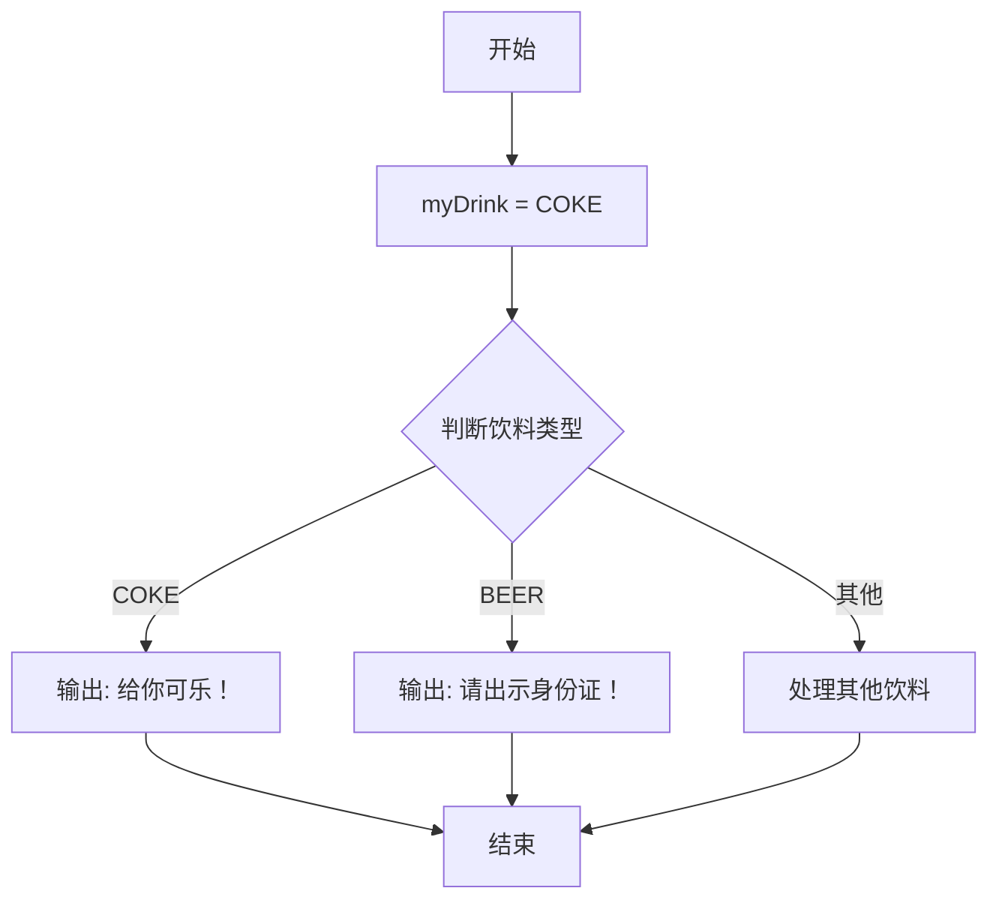
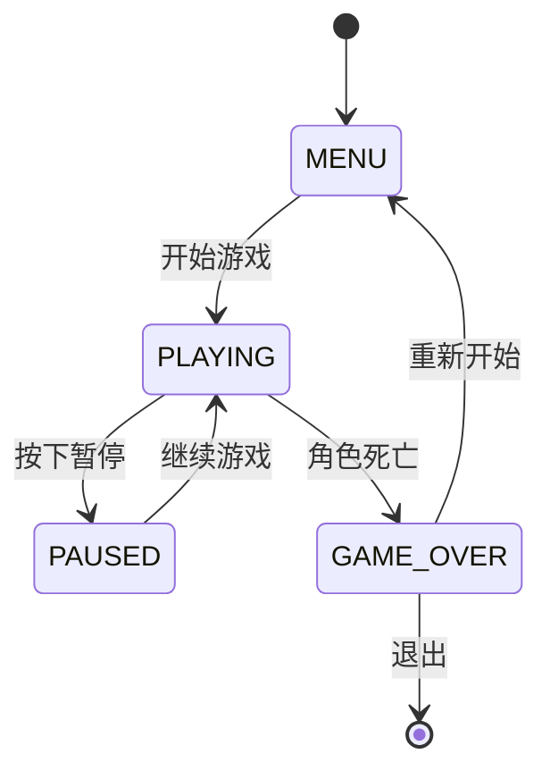

> [!abstract] 枚举
> 枚举是一种用户自定义的数据类型，它由一组命名的整数常量组成。相比于直接使用“魔术数字”，枚举通过赋予数值具体的语义，显著提升了代码的==可读性==与==可维护性==。

# 1. 枚举的作用

在编程中，直接使用数字（如 `0, 1, 2`）表示状态往往会导致代码难以理解。例如，当看到 `if (status == 0)` 时，读者很难立刻明白 `0` 代表什么；而 `if (status == Status::SUCCESS)` 则一目了然。

> [!tip] 核心价值
> 枚举将“语义”注入到“数值”中，解决了“魔术数字”带来的认知负担，并在编译期进行类型检查，防止非法值的传入。

---

# 2. 传统枚举

传统枚举继承自 C 语言，适用于简单的常量定义场景。

## 2.1 基本语法与默认值

默认情况下，枚举成员的值从 `0` 开始，依次递增。

```cpp
enum Color {
    RED,    // 默认 0
    GREEN,  // 默认 1
    BLUE    // 默认 2
};

Color myColor = RED;
std::cout << myColor; // 输出: 0
```

## 2.2 显式赋值

开发者可以指定枚举成员的初始值，后续成员会在此基础上递增。

```cpp
enum Weekday {
    MONDAY = 1,
    TUESDAY,    // 2
    WEDNESDAY,  // 3
    THURSDAY,   // 4
    FRIDAY      // 5
};
```

## 2.3 应用场景：餐厅点餐系统

下面通过一个简单的流程展示枚举在分支逻辑中的应用。

```cpp
#include <iostream>
using namespace std;

// 定义饮料选项
enum Drink {
    COKE,    // 0
    SPRITE,  // 1  
    ORANGE,  // 2
    BEER     // 3
};

int main() {
    Drink myDrink = COKE; 
    
    if (myDrink == COKE) {
        cout << "给你可乐！" << endl;
    } else if (myDrink == BEER) {
        cout << "请出示身份证！" << endl;
    }
    
    return 0;
}
```

其执行逻辑如下所示：



> [!warning] 传统枚举的缺陷
> 传统枚举会将其成员导出到外部作用域，容易造成**命名冲突**。同时，它允许隐式转换为 `int`，削弱了类型系统的安全性。
> ```cpp
> enum Color { RED, BLUE };
> enum Feeling { HAPPY, BLUE }; // 错误！BLUE 重定义冲突
> int num = RED; // 允许隐式转换，类型安全性低
> ```

---

# 3. 强类型枚举（C++11）

为解决传统枚举的问题，C++11 引入了 `enum class`。它是现代 C++ 推荐的枚举定义方式。

## 3.1 核心特性

- **作用域限定**：枚举值必须通过 `枚举名::值` 访问，解决了命名冲突。
- **禁止隐式转换**：枚举值不能直接转换为 `int`，必须使用 `static_cast`，保证了类型安全。

```cpp
enum class Status {
    SUCCESS,
    FAILURE,
    PENDING
};

int main() {
    Status s = Status::SUCCESS; // 必须使用作用域
    
    // int val = s;             // 错误：禁止隐式转换
    int val = static_cast<int>(s); // 正确：显式转换
    
    return 0;
}
```

## 3.2 指定底层类型

强类型枚举允许指定底层的存储类型，这对于内存优化或跨平台交互非常有用。

```cpp
// 使用 unsigned char 存储以节省内存
enum class Priority : unsigned char {
    LOW = 1,
    MEDIUM = 2,
    HIGH = 3
};
```

## 3.3 应用实例：游戏状态机

强类型枚举非常适合用于状态机的设计，确保状态的唯一性和明确性。

```cpp
#include <iostream>

enum class GameState {
    MENU,
    PLAYING,
    PAUSED,
    GAME_OVER
};

int main() {
    GameState current = GameState::MENU;
    
    switch (current) {
        case GameState::MENU:
            std::cout << "显示主菜单" << std::endl;
            break;
        case GameState::PLAYING:
            std::cout << "游戏进行中" << std::endl;
            break;
        case GameState::PAUSED:
            std::cout << "游戏暂停" << std::endl;
            break;
        case GameState::GAME_OVER:
            std::cout << "游戏结束" << std::endl;
            break;
    }
    
    return 0;
}
```

对应的状态流转逻辑图：



---

# 4. 两种枚举的对比总结

| 特性 | 传统枚举 | 强类型枚举 |
| :--- | :--- | :--- |
| **关键字** | `enum` | `enum class` |
| **作用域** | 导出至外部作用域 | 封装在类作用域内 |
| **命名冲突** | 容易发生 | 极难发生 |
| **类型安全** | 弱（可隐式转为 int） | 强（禁止隐式转换） |
| **底层类型** | 不确定（由编译器决定） | 可指定（默认 int） |
| **推荐程度** | ⭐⭐ (兼容旧代码) | ⭐⭐⭐⭐⭐ (现代 C++ 首选) |

> [!summary] 最佳实践建议
> 在编写现代 C++ 代码时，应优先使用 `enum class`。只有当需要与遗留 C 代码库交互，或需要利用隐式转换特性（如数组索引）时，才考虑使用传统枚举。
