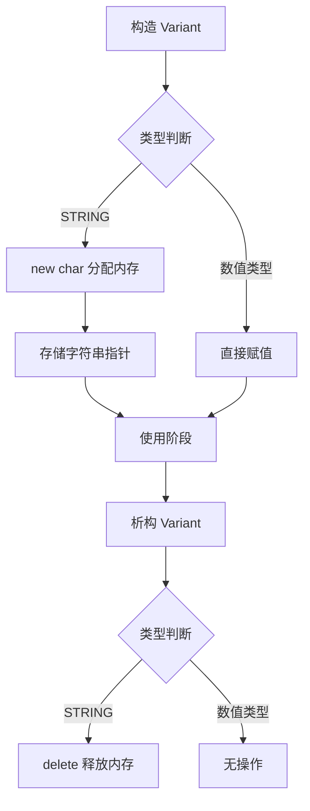

> [!abstract] 联合体
> 联合体是一种特殊的数据结构，它允许在相同的内存位置存储不同的数据类型。其核心特征是==所有成员共享同一块内存空间==，因此在任意时刻，联合体只能有效地保存其中一个成员的值。

# 1. 内存模型

联合体常被比作一个“单选盒子”。虽然它定义了多种类型的成员，但在物理内存上，它们是重叠的。修改其中一个成员会直接覆盖其他成员的值。

联合体的大小等于其==最大成员的大小==（在某些情况下需考虑内存对齐）。

```cpp
union Data {
    int i;
    float f;
    char str[20];
};
```

对于上述 `Data` 联合体，其内存布局如下：

1. **成员分析**
- `int i`: 通常占 **4 字节**。
- `float f`: 通常占 **4 字节**。
- `char str[20]`: 占 **20 字节**。

1. **内存大小计算**
由于 `str[20]` 是最大的成员，联合体的总大小至少为 20 字节。由于 20 是 4（`int` 和 `float` 的对齐要求）的倍数，因此不需要额外的内存填充（Padding）。故：**总大小 = 20 字节**。

2. **内存布局图示**

起始地址通常用 `0x00` 表示。请注意，无论你给哪个变量赋值，它们都从“字节 0”开始覆盖。

```text
地址偏移 (Bytes)
+----+----+----+----+----+----+----+----+ ...... +----+----+----+----+
| 0  | 1  | 2  | 3  | 4  | 5  | 6  | 7  |        | 16 | 17 | 18 | 19 |
+----+----+----+----+----+----+----+----+ ...... +----+----+----+----+
^                   ^                                               ^
|                   |                                               |
+-- int i (4字节) --+                                               |
|                   |                                               |
+-- float f(4字节) -+                                               |
|                                                                   |
+----------------------- char str[20] (20字节) ----------------------+

[所有成员起始地址相同：&i == &f == &str]
```

> [!info] 结构体与联合体的区别
> - **Struct（结构体）**：所有成员拥有独立的内存空间，大小为所有成员大小之和（含内存对齐时的填充）。
> - **Union（联合体）**：所有成员共享同一内存空间，大小为最大成员的大小。
>
> ```cpp
> struct StructData { int i; float f; }; // sizeof = 8+ (独立存储)
> union UnionData { int i; float f; };   // sizeof = 4  (共享存储)
> ```

---

# 2. 基本语法与基本应用

## 2.1 定义与访问

联合体的定义方式与结构体类似，使用 `union` 关键字。

```cpp
#include <iostream>
#include <cstring> // for strcpy

union MagicBox {
    int number;
    float decimal;
    char text[20];
};

int main() {
    MagicBox box;
    
    // 1. 存储整数
    box.number = 100;
    std::cout << "当前存储整数: " << box.number << std::endl;
    
    // 2. 存储浮点数 (覆盖了 number)
    box.decimal = 3.14f;
    std::cout << "当前存储浮点数: " << box.decimal << std::endl;
    // 此时读取 box.number 是未定义行为
    
    // 3. 存储字符串 (覆盖了 decimal)
    std::strcpy(box.text, "Hello");
    std::cout << "当前存储字符串: " << box.text << std::endl;
    
    std::cout << "联合体大小: " << sizeof(MagicBox) << " 字节" << std::endl;
    return 0;
}
```

> [!warning] 访问风险提示：**未定义行为**
> 在联合体中，写入成员 A 后读取成员 B 属于==未定义行为==，除非 B 的字节模式恰好是 A 的有效表示。编译器不会阻止你这样做，但结果是不可预测的。必须由程序员手动跟踪当前有效的成员。

---

# 3. 现代 C++ 中的联合体

在 C++11 及以后的标准中，联合体获得了更强大的能力，允许包含构造函数、析构函数以及复杂类型的成员，但代价是——**编译器不再自动为你生成构造/析构函数**，需要你自己手动管理。

> [!queestion] 
> 为什么需要这个特性？

**C++11 之前的限制**：联合体不能包含拥有非平凡（non-trivial）构造函数、析构函数或拷贝赋值运算符的成员。这意味着：

```cpp
union OldUnion {
    int i;
    std::string s;  // 错误！C++11 之前不允许，因为 std::string 有非平凡的构造/析构函数
};
```

这个限制非常烦人，因为它把 `std::string`、`std::vector`、自定义类等“现代 C++ 常用类型”都排除在联合体之外。

## 3.1 构造函数的作用

### 3.1.1 解决“哪个成员被激活”的问题

联合体的本质是**所有成员共享同一块内存**，但在任意时刻只有一个成员是“活跃的”（active member）。构造函数的核心作用就是**明确告诉编译器和读者：初始化时哪个成员是活跃的**。

```cpp
union ModernData {
    int integer;
    float floating;
    char* string_ptr;
    
    ModernData() : integer(0) {}  // 显式指定 integer 为初始活跃成员
};
```

如果没有这个构造函数，编译器无法知道默认应该初始化哪个成员，且如果联合体里有非平凡类型，编译器会直接拒绝生成默认构造函数（即该联合体变得不可默认构造）。

### 3.1.2 让复杂类型成员可用

一旦联合体里出现了**任何一个**非平凡类型成员（如 `std::string`），编译器就会**隐式删除**该联合体的默认构造、析构、拷贝/移动构造等特殊成员函数。你必须显式提供，才能正常使用：

```cpp
union ComplexUnion {
    int i;
    std::string s;
    
    // 必须手动写，否则联合体根本无法构造
    ComplexUnion() {
        new (&s) std::string();  // placement new 显式构造 s
    }
    
    ~ComplexUnion() {
        s.~string();  // 必须手动析构
    }
};
```

这里用到了 **placement new**，因为编译器不知道你想激活哪个成员，必须由你显式调用构造函数在对应内存上构造对象。

## 3.2 析构函数的作用

### 3.2.1 解决“该析构谁”的问题

如果联合体当前活跃成员是 `std::string`，那么离开作用域时必须调用 `s.~string()` 来正确释放它持有的堆内存。但联合体本身**不会**自动追踪当前哪个成员是活跃的，所以编译器无法自动生成正确的析构逻辑。

```cpp
union ModernData {
    int integer;
    float floating;
    char* string_ptr;
    
    ModernData() : integer(0) {}
    ~ModernData() {}  // 空析构！因为这里没有非平凡类型成员，不需要做什么
};
```

注意：上面这个例子里 `~ModernData()` 是空的，**因为 `int`、`float`、`char*` 都是平凡类型**，不需要特殊清理。但如果联合体里有 `std::string` 这种类型，析构函数就必须做实际工作：

```cpp
union WithString {
    int i;
    std::string s;
    
    WithString() : i(0) {}
    ~WithString() {
        // 危险！如果当前活跃的是 i 而不是 s，调用 s.~string() 是未定义行为！
        // 这正是手动管理的复杂之处
    }
};
```

## 3.3 生命周期的管理

这是联合体含复杂类型时最核心、也最容易出错的部分。问题在于：

**联合体不会记录当前哪个成员是活跃的**，这个信息必须由你自己（通常借助外部的标志位/枚举）来维护。一个常见的安全做法是结合一个“判别值”（discriminant），也就是后面常说的**带标签的联合体（tagged union）**，例如标准库的 `std::variant` 内部就是这么实现的：

```cpp
class SafeUnion {
    enum class Type { Int, String } type;  // 标签，记录当前活跃成员
    union {
        int i;
        std::string s;
    };

public:
    SafeUnion(int val) : type(Type::Int), i(val) {}
    SafeUnion(const std::string& val) : type(Type::String) {
        new (&s) std::string(val);
    }
    
    ~SafeUnion() {
        if (type == Type::String) {
            s.~string();  // 只有活跃成员是 string 时才析构它
        }
        // 如果是 Int，平凡类型不需要任何清理
    }
};
```

## 3.4 总结

|问题|不加构造/析构的后果|加了构造/析构后的解决方式|
|---|---|---|
|联合体含非平凡类型成员|编译器拒绝编译（特殊成员函数被删除）|手动用 placement new 构造|
|默认初始化时不确定激活哪个成员|行为未定义，或编译器报错|在构造函数初始化列表中显式指定|
|析构时不知道该清理谁|内存泄漏（如 string 的堆内存未释放）或未定义行为（析构了未激活的成员）|手动调用对应成员的析构函数，通常配合标签判断|
|切换活跃成员|旧成员未正确析构，新成员未正确构造，导致内存损坏|先 `.~T()` 析构旧成员，再 placement new 构造新成员|

简而言之：**这个特性把原本完全交给编译器/语言规则做的内存初始化和清理工作，下放给了程序员**。好处是可以在联合体中使用任意复杂类型（这对实现像 `std::variant`、`std::any` 这类类型安全的联合体非常关键），坏处是必须非常小心地手动追踪"当前哪个成员活跃"，否则极易引发未定义行为。这也是为什么在实际工程中，更推荐直接使用标准库提供的 `std::variant`（C++17）而不是手写裸联合体——它把这套生命周期管理逻辑封装好了，避免了人为出错的风险。

---

# 4. 实战应用：类型安全的变体类型

联合体最典型的应用是实现“变体类型”或“带标签的联合体”。通过结合 `enum` 和 `union`，可以创建一个既能存储多种类型，又能记住当前存储类型的对象。

## 4.1 设计思路

我们需要两个组件：
1. **状态标签**：使用枚举记录当前存储的数据类型。
2. **数据存储**：使用联合体存储实际数据。

## 4.2 完整实现代码

下面实现了一个简化版的 `Variant` 类，演示如何安全地使用联合体。

```cpp
#include <iostream>
#include <cstring>
#include <stdexcept>

class Variant {
private:
    // 1. 定义类型标签
    enum class Type { INT, FLOAT, STRING } type;
    
    // 2. 定义匿名联合体存储数据
    union {
        int i;
        float f;
        char* s;
    };

public:
    // 构造函数：整数
    Variant(int value) : type(Type::INT), i(value) {}
    
    // 构造函数：浮点数
    Variant(float value) : type(Type::FLOAT), f(value) {}
    
    // 构造函数：字符串 (需要分配内存)
    Variant(const char* value) : type(Type::STRING) {
        s = new char[std::strlen(value) + 1];
        std::strcpy(s, value);
    }
    
    // 析构函数：处理资源释放
    ~Variant() {
        if (type == Type::STRING && s != nullptr) {
            delete[] s;
            s = nullptr;
        }
    }
    
    // 获取当前类型
    Type getType() const { return type; }
    
    // 安全取值：整数
    int getInt() const { 
        if (type == Type::INT) return i;
        throw std::runtime_error("Variant does not hold an integer");
    }
    
    // 安全取值：浮点数
    float getFloat() const {
        if (type == Type::FLOAT) return f;
        throw std::runtime_error("Variant does not hold a float");
    }
    
    // 安全取值：字符串
    const char* getString() const {
        if (type == Type::STRING) return s;
        throw std::runtime_error("Variant does not hold a string");
    }
};

int main() {
    Variant v1(42);
    Variant v2(3.14f);
    Variant v3("Hello Obsidian");
    
    std::cout << "v1 (Int): " << v1.getInt() << std::endl;
    std::cout << "v2 (Float): " << v2.getFloat() << std::endl;
    std::cout << "v3 (String): " << v3.getString() << std::endl;
    
    return 0;
}
```

## 4.3 生命周期管理流程

使用联合体管理动态内存（如 `char*`）时，生命周期管理至关重要。以下是 `Variant` 处理字符串时的内存操作流程：



> [!tip] 推荐：使用 std::variant
> 在现代 C++ (C++17及以上) 开发中，标准库提供了 `std::variant`。它是类型安全的、无需手动管理生命周期的联合体实现。除非有特殊限制（如嵌入式开发或旧标准兼容），否则应优先使用 `std::variant` 而非裸联合体。
