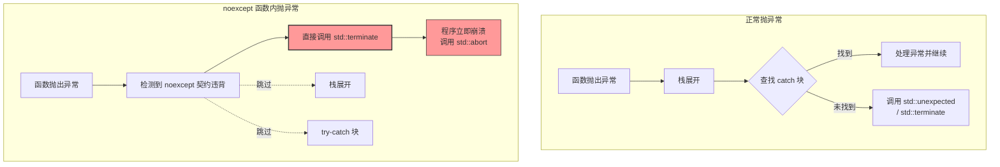

# 1. 核心定义

`noexcept` 是 C++11 引入的关键字，用于指定函数**保证不会抛出任何异常**。它是一份编译器与程序员之间的“契约”。

> **契约内容**：该函数在执行过程中，如果内部发生异常（或其调用的子函数抛出异常），程序将不会进行常规的异常捕获和栈展开，而是直接调用 `std::terminate()` 强制终止程序。

这种机制不仅是一种文档说明，更是编译器进行激进优化的依据。

> [!question] 为什么需要 noexcept？
> 在 C++ 异常处理机制中，编译器默认假设任何函数都可能抛出异常。为了保证异常发生时能够正确回滚状态，编译器需要生成大量的“管家代码”。
> `noexcept` 的价值主要体现在两个维度：
> 1. **性能优化**：编译器省去了生成异常处理表和栈展开代码，减小二进制体积，提升运行速度。
> 2. **接口约束**：明确告知调用者，此操作是安全的，不会打断控制流。

---

# 2. 使用场景

**移动语义**与**标准库容器**是 `noexcept` 最重要、最实战的应用场景。理解这个场景，就理解了为什么高性能代码必须加 `noexcept`。

## 2.1 标准库的“强异常安全”原则

以 `std::vector` 的扩容为例。当 `vector` 空间不足时，它会执行以下步骤：
1. 分配一块更大的新内存。
2. 将旧内存中的元素**移动**到新内存中。
3. 释放旧内存。

> [!question] 如果在移动第 3 个元素时抛出了异常，会发生什么？
> - 旧内存中的第 3 个元素已经被移动走了（可能已被破坏）。
> - 新内存中只有前两个元素是有效的，第 3 个元素构造失败。
> - 数据结构处于不完整状态，无法回滚。

**结论**：为了避免这种灾难，C++ 标准规定，如果元素的**移动构造函数**不是 `noexcept` 的，`std::vector` 就不敢使用移动，而会退回到安全的**拷贝**。

## 2.2 逻辑流程对比

当 `vector` 执行 `push_back()` 或 `insert()` 等操作导致元素数量超过当前容量时，触发扩容流程。扩容目标通常为当前容量的 2 倍（具体倍数由标准库实现决定，MSVC 为 1.5 倍）。

> [!question] 扩容的关键问题是：如何将旧内存中的 N 个元素"搬"到新内存？
> **判断条件**：元素类型的移动构造函数是否标记为 `noexcept`，即 `std::is_nothrow_move_constructible<T>::value` 是否为 `true`。

### 2.2.1 策略 A：移动语义（noexcept 时）

**触发条件**：元素类型的**移动构造函数存在**且**标记为 `noexcept`**。

**执行步骤**：
1. 在堆上分配一块更大的新内存；
2. 依次对每个旧元素调用移动构造函数，将资源所有权转移到新内存中对应位置；
3. 销毁旧内存中的所有元素（此时它们已处于"移后"的有效但未定义状态），释放旧缓冲区；
4. 将新元素插入扩容后的空间，扩容完成。

由于移动构造函数保证 `noexcept`，转移过程中不会抛出任何异常。整个过程是**单向的、不可回滚的**——但正因为不会失败，无需回滚，强异常安全保证天然成立。

**性能**：极高。移动操作通常只是指针交换，时间复杂度 O(n)，无堆分配、无深拷贝开销。

### 2.2.2 策略 B：拷贝构造（非 noexcept 时）

**触发条件**：移动构造函数**不存在**，或存在但**未标记 `noexcept`**。

> [!question] 为何不能直接移动？
> 若移动构造函数可能抛出异常，则在将第 k 个元素移动到新内存的过程中一旦发生异常，前 k-1 个元素已被移走、旧内存中的数据已被破坏，既无法完成操作，也无法恢复原始状态——强异常安全保证被打破。

**执行步骤**：
1. 在堆上分配一块更大的新内存；
2. 依次对每个旧元素调用**拷贝构造函数**，在新内存中构造副本，旧内存数据始终保持完整；
3. **若拷贝过程中发生异常**：
    - 销毁新内存中已拷贝成功的元素；
    - 释放新内存缓冲区；
    - 旧内存数据完好无损；
    - 向上抛出异常，调用方可捕获处理——**强异常安全保证（Strong Exception Safety）**得以维持。
4. **若拷贝全部成功**：销毁旧内存中的所有元素，释放旧缓冲区，插入新元素，扩容完成。

**性能**：较低。拷贝构造需要对每个元素执行深拷贝，若元素内部持有堆资源（如 `std::string`、`std::vector`），则每次拷贝都涉及额外的堆分配，开销随元素复杂度线性增长。

### 2.2.3 设计结论

`vector` 选择拷贝而非移动，**不是因为拷贝更快，而是因为拷贝可以回滚**。这一决策的本质是在性能与异常安全之间的取舍，标准库优先保证正确性：

| 维度 | **策略 A：移动 (Move)** | **策略 B：拷贝 (Copy)** |
| :--- | :--- | :--- |
| **执行前提** | 移动构造函数标记为 **`noexcept`** | 移动构造未标 `noexcept` 或不可移动 |
| **底层操作** | **资源所有权转移**（如指针交换） | **内存深拷贝**（分配新空间+复制） |
| **异常安全性** | **强保证**（因为承诺了不抛异常） | **强保证**（靠“先拷贝后删除”实现回滚） |
| **性能损耗** | **极低**：$O(1)$ 或极小常数开销 | **高**：$O(N)$，涉及大量内存申请与数据复制 |
| **失败后果** | **逻辑上不可能失败** | 若失败，`vector` 保持原样（事务性） |
| **标准库倾向** | 追求性能极致，但以安全声明为准 | **默认的保底方案**，宁慢勿错 |

## 2.3 代码实证

自定义类型若需存入 `vector`，应将移动构造函数和移动赋值运算符标记为 `noexcept`，这是触发策略 A、获得最优扩容性能的必要条件。

```cpp
#include <vector>
#include <iostream>

struct Bad {
    Bad() {}
    // 场景 1：未标记 noexcept
    // 移动构造函数可能抛出异常（例如内部涉及深拷贝逻辑出错）
    Bad(Bad&&) {
	    std::cout << "Move (Risky)\n";
		// 模拟抛异常的逻辑...
	}
	
    Bad(const Bad&) { std::cout << "Copy (Safe)\n"; }
};

struct Good {
    Good() {}
    // 场景 2：标记 noexcept（推荐）
    Good(Good&&) noexcept {
	    std::cout << "Move (Safe)\n";
		// 仅仅是资源转移，不会出错
	}
	
    Good(const Good&) { std::cout << "Copy\n"; }
};

int main() {
    std::vector<Bad> v_bad(1);
    std::cout << "Bad v capacity expansion:\n";
    v_bad.emplace_back(); // 输出: Copy (Safe) -> 因为不敢移动

    std::vector<Good> v_good(1);
    std::cout << "\nGood v capacity expansion:\n";
    v_good.emplace_back(); // 输出: Move (Safe) -> 放心移动
}
```


---

# 3. 语法形式与用法

`noexcept` 有两种常见用法：作为说明符和作为运算符。

## 3.1 函数说明符

用于告诉编译器这个函数不抛出异常。

```cpp
// 写法 1：无条件不抛异常
void safe_function() noexcept;

// 写法 2：等价写法
void safe_function() noexcept(true);

// 写法 3：条件性 noexcept（高级用法）
// 仅当 T 的移动构造是 noexcept 时，该函数才是 noexcept
template <typename T>
void process(T&& t) noexcept(noexcept(T(std::move(t)))) {
    // 这种写法常在泛型编程中看到，保证完美转发安全性
}
```

## 3.2 运算符

用于在编译期检查表达式是否可能抛出异常，结果为 `bool` 值。

```cpp
void risky() {}
void safe() noexcept {}

int main() {
    bool b1 = noexcept(risky()); // false (取决于编译器实现，通常普通函数默认 noexcept(false))
    bool b2 = noexcept(safe());  // true
    
    // 常用于 static_assert 或 SFINAE
    static_assert(noexcept(safe()), "Must be noexcept");
}
```

---

# 4. 违背契约的后果：std::terminate

如果你在标记了 `noexcept` 的函数中抛出了异常（或调用了非 `noexcept` 的函数且未捕获），程序将**跳过所有外层的 `try-catch` 块，直接终止**。

## 4.1 执行流程对比



> [!warning] 危险示例
> 下面的代码展示了 `noexcept` 的“冷酷无情”：
> ```cpp
> void kill_me() noexcept {
>     throw std::runtime_error("Oops!"); // 违背了 noexcept 契约
> }
> 
> int main() {
>     try {
>         kill_me(); // ❌ 这里的 try-catch 毫无作用！
>     } catch (...) {
>         std::cout << "Caught!"; // 永远不会执行到这里
>     }
>     return 0;
> }
> // 程序运行结果：直接 terminate，打印 "terminate called after throwing..."
> ```

---

# 5. 使用场景

1. 在现代 C++ 编程中，以下函数强烈建议标记 `noexcept`：

| 函数类型 | 原因 | 示例 |
| :--- | :--- | :--- |
| **析构函数** | 析构函数抛出异常是 C++ 的大忌，会导致资源泄漏或未定义行为。C++11 以后默认隐式 `noexcept`。 | `~MyClass() = default;` |
| **移动构造函数** | 为了让标准库容器能使用移动语义进行扩容优化。 | `MyClass(MyClass&&) noexcept;` |
| **移动赋值运算符** | 同上。 | `MyClass& operator=(MyClass&&) noexcept;` |
| **Swap 函数** | 交换操作通常只是交换内部指针，不应抛出异常。这是实现强异常安全保证的基础。 | `void swap(MyClass& other) noexcept;` |
| **叶子函数** | 仅包含基本数学运算、位运算，逻辑上绝对安全的函数。 | `int add(int a, int b) noexcept;` |

2. **条件性 `noexcept`** (Conditional noexcept)

在编写模板库时，你经常需要根据模板参数的类型特性来决定当前函数是否是 `noexcept` 的。

```cpp
template <typename T>
class SmartPtr {
public:
    // 如果 T 的移动构造是 noexcept，则 reset 也是 noexcept
    void reset(T* ptr = nullptr) noexcept(noexcept(T())) {
        // ...
    }
};
```
