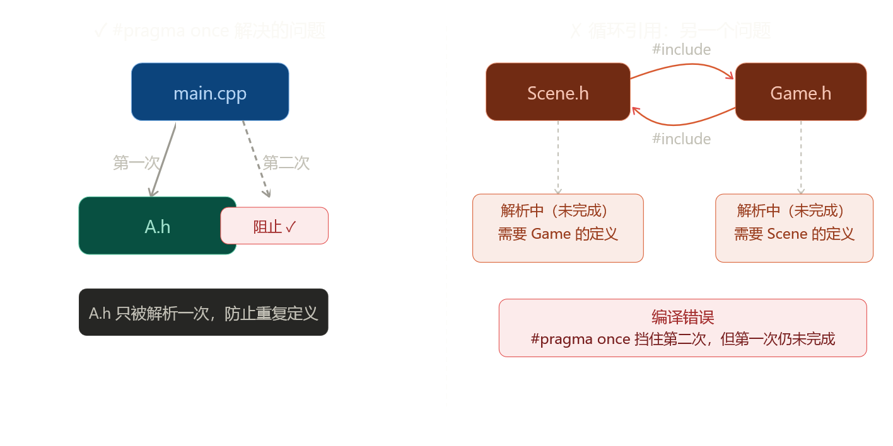
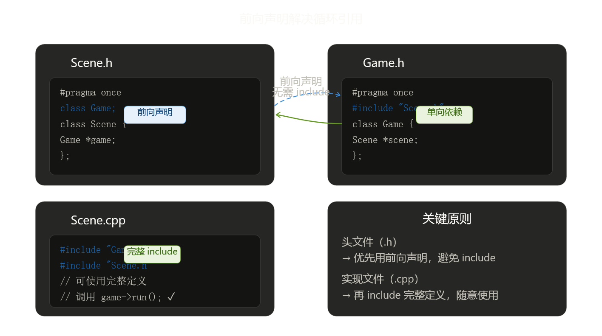
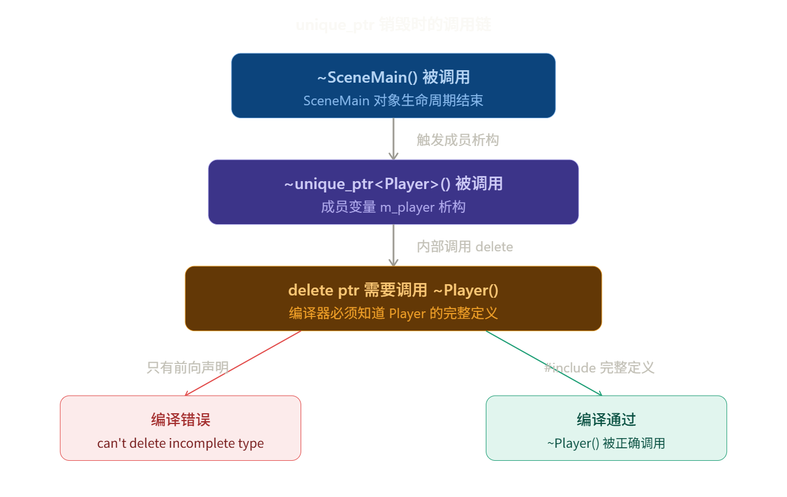
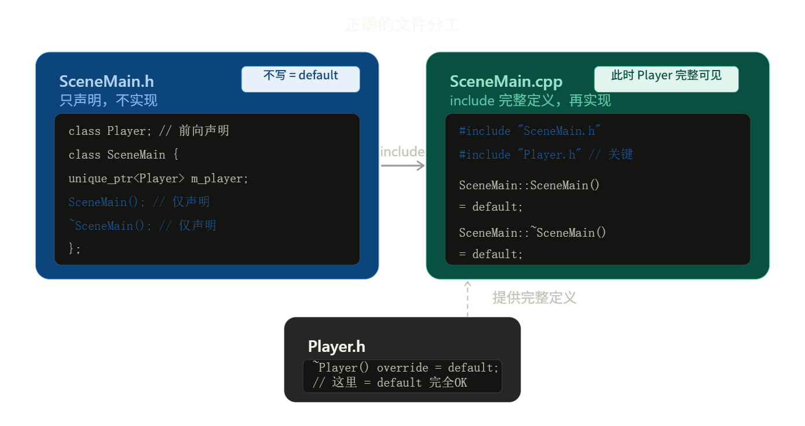

> C++ 头文件包含：`#pragma once` 与循环引用

# 1. `#pragma once`

`#pragma once` 写在头文件的最顶部，作用只有一个：**让同一个头文件在一次编译中只被处理一次**。

```
main.cpp 包含 A.h   ← 正常处理，A.h 被解析
main.cpp 包含 A.h   ← #pragma once 拦截，直接跳过
```

没有 `#pragma once` 时，重复包含会导致类/函数被重复定义，产生编译错误：

```cpp
// A.h（没有保护）
struct Vec2 { float x, y; };

// main.cpp
#include "A.h"
#include "A.h"   // ← 错误：Vec2 重复定义
```

加上 `#pragma once` 之后，第二次遇到同一个文件会被直接略过，问题消失。

**等价写法：Include Guard（传统方式）**

```cpp
#ifndef A_H
#define A_H
struct Vec2 { float x, y; };
#endif
```

> `#pragma once` 是更简洁的现代写法，两者效果相同，但 `#pragma once` 依赖编译器支持（主流编译器均支持）。

---

# 2. 循环引用

> 首先需要说明的是：`#pragma once` 只解决"重复包含"，**无法解决循环引用**。

||`#pragma once`|前向声明|
|---|---|---|
|**解决**|重复 include 导致重复定义|循环 include 导致无法解析|
|**写在**|头文件顶部|头文件中，代替 `#include`|
|**限制**|无|只能用指针/引用，不能用完整类型|
|**配套**|—|`.cpp` 里补 `#include` 完整定义|

## 2.1 问题场景



假设游戏引擎中 `Scene` 持有 `Game` 的指针，`Game` 也持有 `Scene` 的指针：

```cpp
// Scene.h
#pragma once
#include "Game.h"   // Scene 需要 Game

class Scene {
    Game *game;
};
```

```cpp
// Game.h
#pragma once
#include "Scene.h"  // Game 需要 Scene

class Game {
    Scene *scene;
};
```

编译器实际发生了什么？

```bash
编译器开始处理 Scene.h
  → 看到 #include "Game.h"，开始处理 Game.h
    → 看到 #include "Scene.h"
    → #pragma once：Scene.h 已处理过，跳过！
    → 但此时 Scene 类还没定义完（Scene.h 还没解析完）
    → class Game { Scene *scene; };  ← 编译器不认识 Scene ❌
  → 错误：'Scene' was not declared in this scope
```

核心矛盾在于：**`#pragma once` 拦截的是"第二次进入文件"，但第一次还没解析完，对方就已经需要用到这里的定义了**。这是一个先有鸡还是先有蛋的问题。

---

## 2.2 解决方法：前向声明（Forward Declaration）



大多数情况下，两个类互相"持有对方"时，并不需要知道对方的完整定义，只需要告诉编译器“**这个名字是一个类，它存在**”就够了。

- 对于头文件 `Scene.h`：

```cpp
// Scene.h
#pragma once

class Game;  // 前向声明：我知道有个类叫 Game，仅此而已

class Scene {
    Game *game;   // ✅ 指针只需要知道 Game 存在，不需要知道它有多大
};
```

- 对于头文件 `Game.h`：

```cpp
// Game.h
#pragma once
#include "Scene.h"  // Game 需要 Scene 的完整定义，正常 include

class Game {
    Scene *scene;   // ✅ 已经通过 include 得到了完整定义
};
```

现在 `Scene.h` 不再 `#include "Game.h"`，循环链条断开，编译正常进行。最后再在 `Scene.cpp` 文件里补全完整定义

```cpp
// Scene.cpp
#include "Scene.h"
#include "Game.h"   // ✅ 现在拿到了 Game 的完整定义

void Scene::start() {
    game->run();    // ✅ 可以调用成员函数了
    Game localGame; // ✅ 可以创建实例了
}
```

> 在 `.h` 文件中用前向声明"打欠条"，在 `.cpp` 文件里再 `#include` 完整头文件"还债"。

`.cpp` 文件不会被其他文件 `#include`，所以这里加再多 `#include` 都不会引起循环问题。

> 前向声明能用在哪里？

关键规则：**前向声明之后，编译器只知道"这个类存在"，不知道它的大小和成员**。

|用法|是否需要完整定义|可否前向声明？|
|---|---|---|
|`Game *g;` 声明指针|❌ 不需要|✅ 可以|
|`Game &g;` 声明引用|❌ 不需要|✅ 可以|
|`void foo(Game *g);` 函数参数/返回值（声明）|❌ 不需要|✅ 可以|
|`Game g;` 创建对象实例|✅ 需要知道大小|❌ 不行|
|`g->run();` 调用成员函数|✅ 需要知道成员|❌ 不行|
|`sizeof(Game)`|✅ 需要知道大小|❌ 不行|
|继承 `class Derived : public Game`|✅ 需要完整定义|❌ 不行|

代码示例：

```cpp
class Game;          // 前向声明

Game *g;             // ✅ 指针，只需要知道 Game 存在
Game &ref = *g;      // ✅ 引用，同上
void launch(Game*);  // ✅ 函数声明中作为参数类型

Game g2;             // ❌ 编译器：Game 的大小是多少？不知道
g->run();            // ❌ 编译器：Game 有 run() 吗？不知道
```

---

# 3. 实战示例

- 项目结构

```
game/
├── Game.h
├── Game.cpp
├── Scene.h
└── Scene.cpp
```

- Game.h

```cpp
#pragma once
#include "Scene.h"   // Game 管理 Scene，需要完整定义（如创建实例）

class Game {
public:
    void run();
    void loadScene(const char *name);

private:
    Scene currentScene;  // 直接持有对象（非指针），必须 include
};
```

- Scene.h

```cpp
#pragma once

class Game;   // 前向声明，避免循环 include

class Scene {
public:
    void update();
    void setGame(Game *g);

private:
    Game *game;     // 指针 → 前向声明够用
    int entityCount;
};
```

- Scene.cpp

```cpp
#include "Scene.h"
#include "Game.h"   // 这里才引入 Game 的完整定义

void Scene::update() {
    // 现在可以访问 game 的成员
    if (game) {
        // game->someMethod();   ← 可以调用
    }
}

void Scene::setGame(Game *g) {
    game = g;
}
```

- Game.cpp

```cpp
#include "Game.h"   // Game.h 已经 include 了 Scene.h

void Game::run() {
    currentScene.update();
}

void Game::loadScene(const char *name) {
    // 完整定义都在，随意操作
    currentScene = Scene();
}
```

---

# 4. 前向声明的局限性

## 4.1 错误示例

假设 `SceneMain` 持有 `Player` 对象，为避免**循环 include**，于是在头文件中仅前向声明：

```cpp
// SceneMain.h
#pragma once
#include <memory>

class Player;  // 前向声明，Player 为不完整类型

class SceneMain {
    std::unique_ptr<Player> m_player;
public:
    SceneMain();
    ~SceneMain() = default;  // ❌ 编译报错：使用了未定义类型
};
```

这时候如果进行编译，就会报错：

```text
error C2027: 使用了未定义类型"Player"
error: cannot delete pointer to incomplete type 'Player'
error: invalid application of 'sizeof' to incomplete type 'Player'
```

> [!warning] 核心冲突：只知道“名”，不知道“身”
>`std::unique_ptr<T>` 和 `std::shared_ptr<T>` 不仅仅是存储指针，还拥有资源所有权。当其析构时，必须调用 `delete`，进而调用 `T` 的析构函数。`unique_ptr` 的析构要求被管理类型 `Player` 必须是**完整类型（Complete Type）**，但此时编译器仅知道 `Player` 存在，并不知道 `Player` 的**定义**（即大括号 `{...}` 里的内容）。



编译器在处理以下操作时，也必须知道 `Player` 的**定义**：

- **`delete ptr;`**：编译器需要知道析构函数在哪里，以及对象占用多大空间。
- **`sizeof(Player)`**：编译器需要计算所有成员变量的总和。
- **`ptr->member`**：编译器需要知道成员变量在内存中的偏移量。

如果编译器只看到了声明而没看到定义，它就会报“不完整类型（Incomplete Type）”错误。

如果只是声明原始指针就不会报错：

```cpp
class Player;  // 前向声明

class SceneMain {
    Player* m_player;
public:
    ~SceneMain() { delete m_player; }  // ⚠️ 若此处未 include Player.h，同样报错
};
```

> 指针本质上是一个正整数，大小是固定的，64 位操作系统上为 8 字节，无需完整类型。

常用的解决方案是声明与定义分离：**将析构函数（及构造函数）的实现移到 `.cpp` 文件**，确保在编译器展开析构逻辑时，`Player` 的定义可见。



- **头文件**：仅声明（SceneMain.h）

```cpp
// SceneMain.h
#pragma once
#include <memory>

class Player;  // 保留前向声明

class SceneMain {
public:
    SceneMain();   // ⚠️ 关键：仅声明，不写 = default，不写 {}
    ~SceneMain();  // ⚠️ 关键：只声明，不写 = default，不写 {}

    void update(float dt);

private:
    std::unique_ptr<Player> m_player;
};
```

- **源文件**：引入定义并实现（SceneMain.cpp）

```cpp
// SceneMain.cpp
#include "SceneMain.h"
#include "Player.h"  // ✅ 关键：在此处引入完整定义

// 此时编译器已知 Player 完整结构，可安全展开析构
SceneMain::SceneMain() = default;
SceneMain::~SceneMain() = default; 

void SceneMain::update(float dt) {
    if (m_player) {
        m_player->update(dt);  // 调用成员函数也需完整类型
    }
}
```

> [!tip] 💡 为什么构造函数也要移？
> 若构造函数中使用 `std::make_unique<Player>()`，编译器需要知道 `sizeof(Player)` 来分配内存。因此，构造函数实现也**建议**在 `.cpp` 中，或确保头文件中已包含完整定义。

显式声明析构函数，编译器会生成**隐式内联析构函数**。


