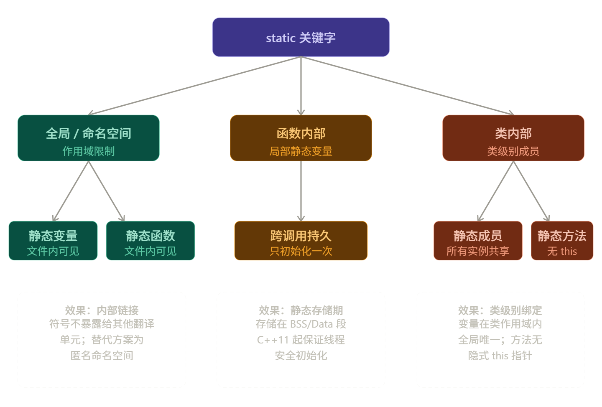

# 1. static 的语义总览

`static` 的含义取决于它出现的位置。理解它时不要背单一解释，而要先判断上下文。



| 位置 | 核心语义 | 影响对象 |
|---|---|---|
| 命名空间作用域 | 内部链接 | 符号可见性 |
| 函数作用域 | 静态存储期 | 局部变量生命周期 |
| 类作用域数据成员 | 属于类而非对象 | 共享数据 |
| 类作用域成员函数 | 无 `this` 指针 | 工具接口或类级操作 |

> [!summary]
> `static` 不是“静态”一个意思。它可能控制链接性、生命周期，也可能控制成员归属。

---

# 2. 命名空间作用域的 static

## 2.1 内部链接

在全局或命名空间作用域中，`static` 修饰变量或函数时表示**内部链接**：该符号只在当前翻译单元内可见。

```cpp
// file_a.cpp
static int counter = 0;
static void helper() {}

// file_b.cpp
extern int counter;  // 链接失败：file_a.cpp 的 counter 对外不可见
```

这可以隐藏实现细节，避免不同 `.cpp` 文件中的同名符号冲突。

## 2.2 匿名命名空间

现代 C++ 中更推荐使用匿名命名空间表达内部链接。

```cpp
namespace {
    int counter = 0;

    void helper() {
    }

    class InternalType {
    };
}
```

匿名命名空间可以作用于变量、函数、类型和模板，比全局 `static` 的适用范围更广。

---

# 3. 函数作用域的 static

## 3.1 静态局部变量

函数内部的 `static` 局部变量具有静态存储期：它只初始化一次，生命周期持续到程序结束，但作用域仍限制在函数内部。

```cpp
int nextId() {
    static int id = 0;
    return ++id;
}
```

调用多次 `nextId()` 时，`id` 会保留上一次调用后的值。

## 3.2 初始化时机

静态局部变量在第一次执行到定义语句时初始化。

```cpp
Logger& logger() {
    static Logger instance("app.log");
    return instance;
}
```

C++11 起，局部静态变量的初始化是线程安全的：多个线程同时第一次进入函数时，标准保证只有一个线程执行初始化。

## 3.3 静态初始化顺序问题

跨翻译单元的全局静态对象初始化顺序不确定。如果一个全局对象依赖另一个 `.cpp` 文件中的全局对象，可能在对方构造前访问它。

```cpp
Logger& logger() {
    static Logger instance;
    return instance;
}
```

把对象放进函数局部静态变量中，可以把初始化延迟到第一次调用，常用于规避静态初始化顺序问题。

---

# 4. 类作用域的 static 数据成员

## 4.1 类级共享数据

静态数据成员属于类，不属于某个具体对象。所有对象共享同一份静态数据成员。

```cpp
class Connection {
public:
    Connection() { ++s_count; }
    ~Connection() { --s_count; }

    static int count() { return s_count; }

private:
    inline static int s_count = 0;  // C++17 起可类内定义
};
```

## 4.2 声明与定义

C++17 之前，非 `constexpr` 的静态数据成员通常需要在类外提供一次定义。

```cpp
// Counter.h
class Counter {
public:
    static int value;
};

// Counter.cpp
int Counter::value = 0;
```

C++17 起可用 `inline static` 在类内完成定义。

```cpp
class Counter {
public:
    inline static int value = 0;
};
```

## 4.3 静态常量

编译期常量优先使用 `static constexpr`。

```cpp
class Math {
public:
    static constexpr double pi = 3.141592653589793;
};
```

---

# 5. 类作用域的 static 成员函数

静态成员函数没有 `this` 指针，因此不能直接访问非静态成员。

```cpp
class Math {
public:
    static int square(int x) {
        return x * x;
    }
};

int value = Math::square(5);
```

静态成员函数适合：

- 与类概念相关但不依赖对象状态的工具函数。
- 访问或管理静态数据成员。
- 工厂方法或注册接口。

```cpp
class User {
public:
    static User guest() {
        return User("guest");
    }

private:
    explicit User(std::string name) : m_name(std::move(name)) {}

    std::string m_name;
};
```

> [!warning]
> 静态成员函数不能声明为 `const`，也不能声明为 `virtual`。`const` 成员函数修饰的是 `this` 指向的对象，而静态成员函数没有 `this`。

---

# 6. 易混淆点

## 6.1 static 与 const 成员函数

`static` 成员函数属于类，`const` 成员函数属于对象接口。

```cpp
class Example {
public:
    static int version();  // 没有 this
    int value() const;     // 有 this，但承诺不修改对象
};
```

二者解决的问题不同，不能互相替代。

## 6.2 静态成员不增加每个对象的大小

静态数据成员只有一份，不存储在每个对象内部。

```cpp
class A {
    int x;
    static int shared;
};
```

`shared` 不会让每个 `A` 对象都多出一个 `int` 成员。

## 6.3 static 不是线程同步工具

`static` 控制生命周期或归属，不自动保证读写操作线程安全。C++11 只保证局部静态变量的初始化过程线程安全，不保证后续对该对象的所有访问都线程安全。

---

# 7. 实践准则

1. 命名空间作用域隐藏实现细节时，优先使用匿名命名空间。
2. 需要延迟初始化单例式对象时，使用函数局部静态变量。
3. 类级共享常量优先使用 `inline static constexpr`。
4. 静态成员函数只放不依赖对象状态的逻辑。
5. 不要把静态局部变量当作无成本全局状态，测试和并发场景需要额外谨慎。

> [!summary]
> 判断 `static` 的关键顺序是：先看它在哪里，再判断它控制的是链接性、生命周期，还是成员归属。
