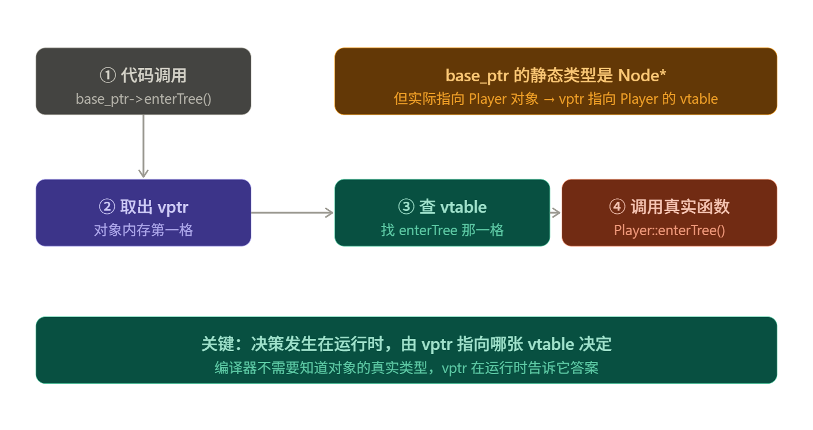

# 1. 虚函数的目的

虚函数用于实现**运行时动态绑定**：通过基类指针或引用调用成员函数时，实际执行哪个版本由对象的运行时类型决定。

```cpp
class Shape {
public:
    virtual double area() const = 0;
    virtual ~Shape() = default;
};

class Circle : public Shape {
public:
    double area() const override;
};

void printArea(const Shape& shape) {
    std::cout << shape.area() << "\n";  // 运行时决定调用哪个 area()
}
```

> [!summary]
> 普通成员函数按静态类型绑定；虚函数在基类指针或引用调用时按动态类型绑定。

---

# 2. virtual、override 与 final

## 2.1 virtual

基类中首次声明虚函数时使用 `virtual`。派生类中即使不重复写 `virtual`，该函数仍然保持虚函数性质。

```cpp
class Base {
public:
    virtual void run();
};

class Derived : public Base {
public:
    void run() override;
};
```

## 2.2 override

`override` 要求编译器验证当前函数确实重写了基类虚函数。

```cpp
class Base {
public:
    virtual void update(float dt) const;
};

class Derived : public Base {
public:
    // void update(float dt) override;  // 错误：缺少 const，不是重写
    void update(float dt) const override;
};
```

> [!warning]
> 重写不仅要求函数名相同，还要求参数列表、`const` 限定、引用限定等签名信息匹配。返回类型只在协变返回的特殊规则下允许不同。

## 2.3 final

`final` 可用于类或虚函数，表示禁止继续继承或重写。

```cpp
class Renderer final {
};

class Base {
public:
    virtual void commit();
};

class Derived : public Base {
public:
    void commit() override final;
};
```

`final` 既能表达设计边界，也可能帮助编译器去虚拟化，但不应随意限制合理扩展。

---

# 3. vtable 与 vptr

## 3.1 vtable

虚函数表通常简称 `vtable`，可以理解为类级别的虚函数地址表。每个含虚函数的类通常有自己的 vtable。

```cpp
class Base {
public:
    virtual void a();
    virtual void b();
};

class Derived : public Base {
public:
    void a() override;
    virtual void c();
};
```

简化理解：

| 类 | vtable 内容 |
|---|---|
| `Base` | `Base::a`, `Base::b` |
| `Derived` | `Derived::a`, `Base::b`, `Derived::c` |

## 3.2 vptr

含虚函数的对象通常会隐式携带一个虚表指针 `vptr`，指向该对象动态类型对应的 vtable。

```text
Derived 对象
+----------------+
| vptr ----------+----> Derived vtable
| Base 成员       |
| Derived 成员    |
+----------------+
```

`vtable` 是类级别共享结构，`vptr` 是对象级别字段。具体布局由实现决定，标准不规定必须叫 vtable 或 vptr，但主流实现普遍采用类似机制。

## 3.3 虚函数调用过程

```cpp
Base* ptr = new Derived();
ptr->a();
```

调用过程可以简化为：

1. 编译器看到 `ptr` 的静态类型是 `Base*`，且 `a()` 是虚函数。
2. 运行时从对象中读取 `vptr`。
3. 通过 `vptr` 找到 `Derived` 的 vtable。
4. 按固定槽位取出 `Derived::a` 的地址并调用。



> [!tip]
> 虚函数调用不是运行时沿继承链逐层查找。每个类的 vtable 在编译和链接阶段已经体现了最终覆盖关系，运行时只是按槽位间接调用。

---

# 4. 纯虚函数与抽象类

## 4.1 纯虚函数

纯虚函数用 `= 0` 声明，表示该类要求派生类提供实现。

```cpp
class Device {
public:
    virtual void connect() = 0;
    virtual void disconnect() = 0;
    virtual ~Device() = default;
};
```

包含至少一个纯虚函数的类是抽象类，不能直接实例化。

```cpp
// Device device;  // 错误：抽象类不能实例化
Device* device = nullptr;  // 正确：可以声明指针或引用
```

## 4.2 纯虚函数也可以有定义

纯虚函数可以在类外提供函数体，派生类可显式调用它作为公共逻辑。

```cpp
class Base {
public:
    virtual void init() = 0;
};

void Base::init() {
    std::cout << "common init\n";
}

class Derived : public Base {
public:
    void init() override {
        Base::init();
        std::cout << "derived init\n";
    }
};
```

---

# 5. 虚析构函数

## 5.1 问题

如果通过基类指针删除派生类对象，而基类析构函数不是虚函数，行为未定义；常见表现是只调用基类析构，派生类资源没有释放。

```cpp
class Base {
public:
    ~Base() = default;  // 非虚析构
};

class Derived : public Base {
public:
    ~Derived();
};

Base* ptr = new Derived();
delete ptr;  // 错误设计
```

## 5.2 正确做法

```cpp
class Base {
public:
    virtual ~Base() = default;
};

class Derived : public Base {
public:
    ~Derived() override = default;
};
```

> [!warning]
> 只要类中有任意虚函数，就几乎总应提供虚析构函数。这样通过基类指针管理派生类对象时才安全。

---

# 6. 构造与析构期间的虚函数

构造函数和析构函数中调用虚函数不会表现出完整多态。

```cpp
class Base {
public:
    Base() {
        log();  // 调用 Base::log
    }

    virtual void log() {
        std::cout << "Base\n";
    }
};

class Derived : public Base {
public:
    void log() override {
        std::cout << "Derived\n";
    }
};
```

构造 `Derived` 时，`Base` 构造函数先执行，此时 `Derived` 部分尚未构造完成，因此 `Base()` 内部调用绑定到 `Base::log`。析构期间同理，派生类部分会先析构，进入基类析构时对象已经不再是完整派生类。

> [!warning]
> 不要在构造函数或析构函数中依赖虚函数分发完成派生类初始化或清理。需要扩展初始化时，优先使用工厂函数或显式初始化步骤。

---

# 7. 性能与适用场景

虚函数的主要成本包括：

| 成本 | 说明 |
|---|---|
| 空间 | 对象通常多一个 `vptr`，类多一张 vtable |
| 时间 | 调用需要间接寻址，可能影响内联 |
| 优化 | 动态绑定可能阻碍编译期优化 |

多数业务代码中，虚函数成本远小于抽象带来的可维护性收益。只有在热点循环、海量小对象或极端性能场景中，才需要认真评估替代方案。

可选替代方式包括：

- 模板与 CRTP 实现编译期多态。
- `std::variant` 加访问器实现封闭类型集合分发。
- 函数对象或策略对象组合。

---

# 8. 实践准则

1. 只有确实需要运行时多态的函数才声明为 `virtual`。
2. 所有重写函数都写 `override`。
3. 多态基类应有 `virtual ~Base() = default;`。
4. 避免虚函数默认参数，因为默认参数按静态类型绑定。
5. 构造和析构期间不要依赖虚函数分发。
6. 性能敏感路径中评估虚调用是否阻碍内联和缓存局部性。

> [!summary]
> 虚函数是 C++ 运行时多态的核心机制。它把“调用哪个实现”的决定从编译期推迟到运行时，但前提是通过基类指针或引用触发动态绑定。
