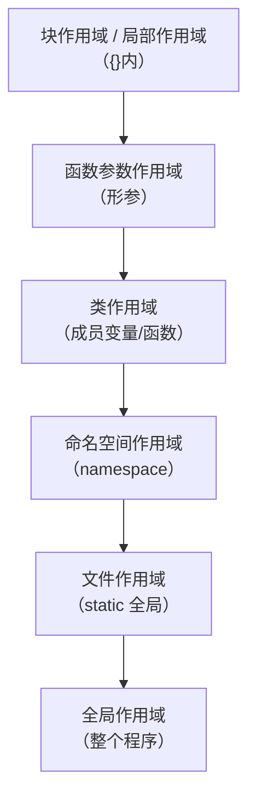

# 1. 作用域的基本概念

在 C++ 中，**作用域（Scope）** 是指程序中变量、函数、类等标识符可以被访问或引用的**有效区域**。作用域决定了一个名字在程序的哪些部分是可见和可用的。

理解作用域对于以下三点至关重要：
- **避免命名冲突**：不同作用域中可以有同名标识符，互不干扰
- **管理变量生命周期**：变量随其所在作用域的进入而创建，随作用域的结束而销毁
- **编写结构清晰的代码**：合理划分可见范围，降低各模块之间的耦合

---

# 2. 作用域的类型

C++ 中的作用域按**从窄到宽**的顺序排列如下：



## 2.1 块作用域与局部作用域

**块作用域（Block Scope）** 是最常见的作用域。任何被 `{}` 包裹的区域都构成一个块，在块内声明的标识符：
- 仅在该块内可见
- 随块的结束而销毁（非静态变量）
- 可以嵌套，内层可访问外层，反之不行

**局部作用域（Local Scope）** 是块作用域的特例，专指函数体内部的块作用域，两者在语义上完全一致。

```cpp
void func() {
    int x = 10;  // x 的作用域从这里开始（函数块内，即局部作用域）

    {
        int y = 20;            // y 的作用域仅限于此内层块
        std::cout << x + y;    // ✅ 内层块可访问外层的 x
    }
    // std::cout << y;  // ❌ 编译错误：y 已超出作用域，不可见

    // if / for / while 同样构成独立的块作用域
    if (true) {
        int z = 30;            // z 仅在此 if 块内有效
        std::cout << z;        // ✅
    }
    // std::cout << z;  // ❌ 编译错误

    for (int i = 0; i < 3; ++i) {
        // i 的作用域仅限于此 for 循环块
    }
    // std::cout << i;  // ❌ 编译错误
}  // x 在此销毁
```

> [!note] 主动缩小作用域的好处
> 在需要时才在最近处声明变量（而非函数顶部），既能缩小生命周期减少资源占用，又能让代码的意图更清晰，还能减少名称遮蔽（见 §3）带来的风险。

## 2.2 函数参数作用域

函数的形式参数在函数体内可见，其作用域等同于函数体的局部作用域：从参数列表起始处到函数体末尾 `}` 结束。

```cpp
void print(int x, const std::string& msg) {
    // x 和 msg 在整个函数体内可见
    std::cout << msg << ": " << x << "\n";
}  // x 和 msg 在此销毁

// print 外部无法访问 x 或 msg
```

## 2.3 类作用域

类中定义的成员变量和成员函数属于该**类的作用域（Class Scope）**：
- 在类的成员函数内部可以直接访问同类的其他成员（无需限定）
- 在类外部需通过**对象**（`.`）或**作用域解析运算符**（`::`）来访问

```cpp
class MyClass {
public:
    int value;           // value 属于 MyClass 的作用域
    void display() const;
    static int count;    // 静态成员同样属于类作用域
};

void MyClass::display() const {
    // 类外定义成员函数：用 :: 指明所属类
    // 函数体内可直接访问 value（同类成员，无需限定）
    std::cout << value << "\n";
}

int main() {
    MyClass obj;
    obj.value = 42;        // ✅ 通过对象访问
    MyClass::count = 1;    // ✅ 通过类名 + :: 访问静态成员
}
```

## 2.4 命名空间作用域

**命名空间作用域（Namespace Scope）** 用于将相关标识符组织在一个具名的逻辑空间中，是 C++ 中防止命名冲突的核心机制。

```cpp
namespace MyMath {
    const double PI = 3.14159;
    double square(double x) { return x * x; }
}

namespace StringUtils {
    std::string toUpper(const std::string& s);
}

int main() {
    std::cout << MyMath::PI << "\n";           // ✅ 通过 :: 访问
    std::cout << MyMath::square(3.0) << "\n";  // ✅

    // using 声明：将单个名称引入当前作用域
    using MyMath::PI;
    std::cout << PI << "\n";  // ✅ 无需 MyMath:: 前缀

    // using namespace（谨慎使用，可能引入命名冲突）
    // using namespace MyMath;
}
```

命名空间还支持**嵌套**和**跨文件扩展**：

```cpp
// file1.cpp
namespace Project {
    namespace Core {
        void init();
    }
}

// file2.cpp（同一命名空间可分布在多个文件）
namespace Project {
    namespace Core {
        void shutdown();
    }
    // C++17 嵌套命名空间简写
    namespace UI::Widget {
        void render();
    }
}
```

> [!warning] 避免在头文件中使用 `using namespace`
> 在头文件中写 `using namespace std;` 会将整个命名空间污染到所有包含该头文件的翻译单元，极易引发命名冲突，是公认的不良实践。

## 2.5 文件作用域（翻译单元作用域）

使用 `static` 修饰的**全局变量或函数**具有**内部链接（Internal Linkage）**，仅在当前翻译单元（`.cpp` 文件）内可见，其他文件即使使用 `extern` 声明也无法访问。

```cpp
// file1.cpp
static int secretCount = 10;        // 仅 file1.cpp 可见
static void doSomething() {}        // 仅 file1.cpp 可调用

// file2.cpp
extern int secretCount;             // ❌ 链接失败：secretCount 是内部链接
```

在**现代 C++ 中，推荐使用匿名命名空间（Anonymous Namespace）替代文件级 `static`**，效果完全等价但更符合 C++ 语言风格：

```cpp
// file1.cpp
namespace {
    int secretCount = 10;     // ✅ 仅当前翻译单元可见（内部链接）
    void doSomething() {}     // ✅ 其他文件无法访问
}
```

> [!note] 匿名命名空间与 static 的等价性
> 匿名命名空间内的所有标识符自动获得内部链接，其效果与 `static` 全局声明完全相同。C++ Core Guidelines 推荐优先使用匿名命名空间，因为它还能应用于类型（`struct`/`class`/`enum`），而文件级 `static` 不能修饰类型定义。

## 2.6 全局作用域

定义在所有函数与命名空间之外的标识符具有**全局作用域**，拥有**外部链接（External Linkage）**，可通过 `extern` 在其他翻译单元中引用。

```cpp
// globals.cpp
int globalVar = 100;          // 全局变量：外部链接
void globalFunc() { /* ... */ }

// main.cpp
extern int globalVar;         // 声明：告知编译器 globalVar 在别处定义
extern void globalFunc();

int main() {
    std::cout << globalVar;   // ✅ 访问另一个翻译单元的全局变量
    globalFunc();             // ✅
}
```

> [!warning] 全局变量的代价
> 全局变量虽然方便，但会带来以下问题：
> - **隐式耦合**：任意函数都能修改它，数据流向难以追踪
> - **初始化顺序未定义**：跨翻译单元的全局变量初始化顺序由编译器决定，可能引发"静态初始化顺序惨案（SIOF）"
> - **测试困难**：全局状态使单元测试难以隔离
>
> 应尽量将全局变量替换为函数参数、类成员或局部 `static` 变量。

---

# 3. 作用域嵌套与名称遮蔽

## 3.1 作用域的嵌套规则

内层作用域可以访问外层作用域的标识符，但外层无法访问内层。当内层声明了与外层同名的标识符时，内层标识符会**遮蔽（Shadow）** 外层同名标识符。

```cpp
int x = 10;  // 全局 x

void func() {
    int x = 20;               // 局部 x 遮蔽全局 x
    std::cout << x << "\n";   // 输出: 20（局部 x）
    std::cout << ::x << "\n"; // 输出: 10（用 :: 显式访问全局 x）

    {
        int x = 30;               // 再次遮蔽局部 x
        std::cout << x << "\n";   // 输出: 30
    }
    std::cout << x << "\n";   // 输出: 20（内层 x 已销毁，恢复外层 x）
}
```

## 3.2 循环变量与遮蔽

```cpp
int i = 100;  // 外层 i

for (int i = 0; i < 3; ++i) {
    // for 初始化语句中的 i 遮蔽了外层 i
    std::cout << i << "\n";  // 输出 0、1、2（循环的 i）
}

std::cout << i << "\n";  // 输出: 100（循环结束后恢复外层 i）
```

> [!warning] 遮蔽的风险
> 不小心触发的名称遮蔽是常见 bug 来源：开发者以为修改的是外层变量，实际上操作的是内层同名变量（或反之）。
> - 开启编译器警告（如 GCC/Clang 的 `-Wshadow`）可以检测大多数遮蔽情况
> - 命名规范（如成员变量加 `m_` 前缀，全局变量加 `g_` 前缀）可从源头减少遮蔽

---

# 4. static 与 namespace 的对比

从表面上看，类中的 `static` 成员函数和 `namespace` 中的函数都通过 `名称::函数名` 的方式调用，**语法形式相似**，但二者在**设计目的、语义和适用场景**上有本质区别。

## 4.1 核心区别总览

| 特性 | `static` 成员函数（类中） | `namespace` 函数 |
|------|:---:|:---:|
| 所属结构 | 类（class）的一部分 | 命名空间，独立于类 |
| 设计范式 | 面向对象（OOP） | 模块化编程 |
| 能否访问 `this` 指针 | ❌（无对象上下文） | 不适用 |
| 能否访问类的静态成员 | ✅ | ❌（没有"类"的概念） |
| 封装数据能力 | ✅（与类的静态数据共存） | 有限（需手动定义文件级变量） |
| 是否支持继承/多态 | ❌（静态函数不可虚化） | ❌ |
| 主要用途 | 工厂方法、类级别辅助功能 | 组织工具函数、防止命名冲突 |

> [!note] 语法形式相似但不可混用
> ```cpp
> // ⚠️ 同名的 class 与 namespace 不能出现在同一翻译单元中
> class Math { public: static int square(int x) { return x * x; } };
> namespace Math { int square(int x) { return x * x; } }  // ❌ 命名冲突
> ```
> 二者共享同一命名空间层级，`Math::square` 会产生歧义，导致编译错误。

## 4.2 状态封装能力对比

`static` 成员函数可以访问类的 `static` 成员变量（类级别的共享状态），这是 `namespace` 函数所不具备的能力：

```cpp
// ✅ class + static：数据与行为共同封装，访问控制明确
class Counter {
    static int count;   // 私有静态数据：仅类内可访问
public:
    Counter()                   { ++count; }
    static int getCount()       { return count; }   // 可访问私有静态数据
    static void reset()         { count = 0; }
};
int Counter::count = 0;  // 静态成员需在类外定义

// ⚠️ namespace：无法对数据做访问控制（count 暴露给所有人）
namespace CounterNS {
    int count = 0;              // 数据完全暴露，任何人都能直接修改
    void increment()            { ++count; }
    int getCount()              { return count; }
}
// CounterNS::count = -999;    // 外部可随意破坏内部状态
```

## 4.3 语义对比：OOP vs 模块化

- `static` 成员函数是**面向对象设计的一部分**：它与类的抽象概念绑定，强调"这是 `X` 类提供的功能"
- `namespace` 函数是**模块化编程的工具**：它强调"这是 `X` 模块中的工具函数"，与 C++ 标准库的组织方式一致（`std::` 是命名空间而非类）

```cpp
// ✅ 推荐：用 namespace 组织无状态工具函数
namespace StringUtils {
    std::string toUpper(const std::string& s) {
        std::string result = s;
        std::transform(result.begin(), result.end(), result.begin(), ::toupper);
        return result;
    }
    bool isEmpty(const std::string& s) { return s.empty(); }
}

StringUtils::toUpper("hello");  // 语义：StringUtils 模块提供的工具

// ✅ 合理：用 class + static 实现工厂方法（需要管理类的共享状态）
class DatabaseConnection {
    static int maxConnections;
    static int currentCount;
public:
    static DatabaseConnection* create() {
        if (currentCount >= maxConnections) return nullptr;
        ++currentCount;
        return new DatabaseConnection();
    }
};
```

## 4.4 使用建议

| 场景 | 推荐方式 |
|------|----------|
| 无状态的工具函数（如 `max`、`serialize`） | ✅ `namespace` |
| 需要类的共享数据（如计数器、配置） | ✅ `class` + `static` 成员 |
| 工厂方法（创建本类对象） | ✅ `class` + `static` 成员函数 |
| 防止全局命名冲突 | ✅ `namespace` |
| 替代文件级 `static`（内部链接） | ✅ 匿名 `namespace` |

> [!tip] 现代 C++ 的倾向
> C++20 的**模块（Modules）** 进一步强化了模块化思想，在支持模块的工程中可以替代头文件 + `namespace` 的组合。现阶段仍推荐：
> - `namespace` + `inline` 函数用于头文件中的工具函数
> - 避免"只有静态函数的工具类"这种反模式——直接用 `namespace` 更简洁

---

# 5. 总结

## 5.1 作用域类型速查

| 作用域类型 | 创建方式 | 可见范围 | 典型生命周期 |
|-----------|---------|---------|-----------|
| **块/局部作用域** | `{}` 包裹的代码块 | 块内 | 块结束时销毁 |
| **函数参数作用域** | 函数形参列表 | 函数体内 | 函数返回时销毁 |
| **类作用域** | `class`/`struct` 定义 | 类成员函数内（直接访问） | 对象生命周期 |
| **命名空间作用域** | `namespace` 块 | 命名空间内及使用 `::` 的外部 | 程序运行期间 |
| **文件作用域** | `static` 全局或匿名 `namespace` | 当前翻译单元 | 程序运行期间 |
| **全局作用域** | 所有块之外 | 整个程序（可跨文件） | 程序运行期间 |

## 5.2 关键原则

> [!check] 作用域设计最佳实践
> 1. ✅ **最小化作用域**：在最近需要的地方声明变量，而非函数顶部
> 2. ✅ **命名空间组织代码**：大型项目中使用 `namespace` 划分模块，防止命名冲突
> 3. ✅ **优先匿名命名空间**：替代文件级 `static`，限制内部实现细节的可见性
> 4. ✅ **开启遮蔽警告**：使用 `-Wshadow` 编译选项检测意外的名称遮蔽
> 5. ❌ **避免滥用全局变量**：用函数参数、类成员或局部 `static` 替代
> 6. ❌ **避免在头文件中 `using namespace`**：会污染所有包含该头文件的翻译单元
