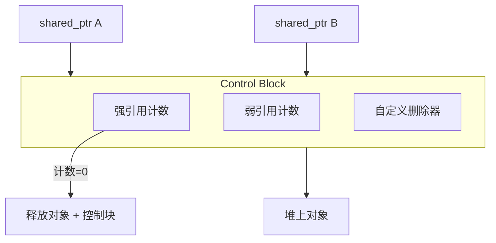

> [!abstract] 智能指针的本质
> 智能指针（Smart Pointer）是 C++ 标准库提供的**类模板**，用于**自动管理动态内存**，核心目标是：
> - ✅ 避免内存泄漏（Memory Leak）
> - ✅ 实现 **RAII**（Resource Acquisition Is Initialization）机制
> - ✅ 将资源生命周期与对象生命周期绑定

# 1. 工作原理

智能指针本质上是**封装了 `new`/`delete` 的栈对象**：
- 📦 **栈上分配**：智能指针对象本身存储在栈中
- 🔗 **堆上管理**：通过内部指针管理堆内存
- 🧹 **自动清理**：离开作用域时自动调用析构函数，释放堆内存

```cpp
// 传统方式：手动管理，易泄漏
Entity* p = new Entity("A");  // ⚠️ 忘记 delete 则泄漏
// ... 使用 p ...
delete p;  // ⚠️ 可能忘记/重复删除

// 智能指针：自动管理，安全
auto p = std::make_unique<Entity>("A");  // ✅ 作用域结束自动释放
```

> [!warning] 重要前提
> 智能指针管理的是**堆内存**（`new` 分配），**绝不能**用于管理栈对象或全局对象，否则会导致 UB（未定义行为，比如双重释放）。

---

# 2. 三种智能指针详解

## 2.1 `unique_ptr` —— 独占所有权

### 2.1.1 核心特性

| 特性 | 说明 |
|------|------|
| 🔒 独占所有权 | 同一时刻只能有一个 `unique_ptr` 拥有资源 |
| 🚫 禁止拷贝 | 拷贝构造/拷贝赋值被 `= delete` |
| ✅ 支持移动 | 通过 `std::move()` 转移所有权 |
| 📏 零开销抽象 | 无引用计数，大小通常等于裸指针 |
| 🧹 自动释放 | 析构时自动调用 `delete` 或自定义删除器 |

### 2.1.2 创建方式对比

| 方式       | 代码示例                                       | 评价        | 原因             |
| -------- | ------------------------------------------ | --------- | -------------- |
| ✅ **首选** | `std::make_unique<Entity>("A")`            | C++14 起推荐 | 异常安全，避免裸指针中间状态 |
| ⚠️ 备选    | `std::unique_ptr<Entity>(new Entity("A"))` | C++11 可用  | 存在异常泄漏风险（见下方）  |

> [!tip] 为什么 `new` + `unique_ptr` 可能导致内存泄漏？
> ```cpp
> // 危险场景：函数参数求值顺序未定义
> foo(
>     std::unique_ptr<Entity>(new Entity),  // (1) new 执行
>     some_function()                        // (2) 若此处抛异常
> );
> // 若 (2) 抛异常，(1) 分配的内存未被 unique_ptr 接管 → 泄漏！
> 
> // 安全方案：make_unique 保证原子性
> foo(
>     std::make_unique<Entity>(),  // 分配+构造+接管 原子完成
>     some_function()
> );
> ```

### 2.1.3 移动语义：所有权转移

```cpp
int main() {
    auto entity = std::make_unique<Entity>("Main");
    
    // ❌ 编译错误：拷贝被禁用
    // auto e2 = entity;
    
    // ✅ 正确：通过 std::move 转移所有权
    auto e2 = std::move(entity);
    
    // 转移后：entity 变为 nullptr，e2 拥有资源
    if (entity == nullptr) { /* ... */ }  // ✅ 安全检查
    if (e2) e2->print();                 // ✅ 安全使用
}
```

> [!note] 函数返回 `unique_ptr` 的自动移动
> ```cpp
> std::unique_ptr<Entity> getEntityPtr() {
>     return std::make_unique<Entity>();  // 返回临时对象（prvalue）
> }
> 
> auto entity = getEntityPtr();  // ✅ 编译器自动应用移动语义
> ```
> 
> **原理**：函数返回的临时对象是纯右值（prvalue），编译器知道其即将销毁，因此允许直接移动资源，无需显式 `std::move`。

### 2.1.4 特殊场景支持

- 管理动态数组：

```cpp
// ✅ C++14 起：make_unique 支持数组
auto arr = std::make_unique<int[]>(10);
arr[0] = 42;

// ✅ 显式指定删除器（自动调用 delete[]）
std::unique_ptr<int[]> arr2(new int[5]{1,2,3,4,5});
```

- 自定义删除器（管理非内存资源）：

```cpp
// 场景：管理 C 风格资源（如 FILE*, socket, mutex）
auto file = std::unique_ptr<FILE, decltype(&fclose)>(
    fopen("test.txt", "r"),  // 资源获取
    &fclose                   // 自定义删除器
);
// 作用域结束时自动调用 fclose(file)

// 通用模板：支持 lambda 作为删除器
auto deleter = [](int* p) { 
    std::cout << "Deleting int[]\n"; 
    delete[] p; 
};
std::unique_ptr<int, decltype(deleter)> arr(
    new int[10], deleter
);
```

> [!note] 安全性的体现
> `unique_ptr` 内部包含 `static_assert` 检查，主动拦截“删除不完整类型”的未定义行为（UB）。这比原始指针更安全，但要求开发者更严谨地组织代码结构。

## 2.2 `shared_ptr` —— 共享所有权

### 2.2.1 核心机制：引用计数



| 特性       | 说明                          |
| -------- | --------------------------- |
| 🔁 共享所有权 | 多个 `shared_ptr` 可指向同一对象     |
| 📊 引用计数  | 控制块记录强引用数，归零时释放资源           |
| ✅ 可拷贝/移动 | 拷贝时计数+1，移动时所有权转移            |
| 💾 额外开销  | 控制块通常占用 16~32 字节（存储计数、删除器等） |

### 2.2.2 引用计数行为演示

```cpp
int main() {
    std::shared_ptr<Entity> e0;  // 空指针，use_count=0
    
    {
        auto shareEntity = std::make_shared<Entity>("Inner");
        std::cout << "Count after creation: " 
                  << shareEntity.use_count() << "\n";  // 1
        
        e0 = shareEntity;  // 拷贝：引用计数+1
        std::cout << "Count after copy: " 
                  << shareEntity.use_count() << "\n";  // 2
    }  // shareEntity 析构：计数-1 → 1，对象仍存活
    
    std::cout << "Count after inner scope: " 
              << e0.use_count() << "\n";  // 1
}  // e0 析构：计数归零 → 调用对象析构函数
```

### 2.2.3 循环引用问题

```cpp
class Node {
public:
    std::string name;
    std::shared_ptr<Node> next;
    std::shared_ptr<Node> prev;  // ❌ 双向 shared_ptr → 循环引用
    
    Node(const std::string& n) : name(n) {
        std::cout << "[" << name << "] created\n";
    }
    ~Node() {
        std::cout << "[" << name << "] destroyed\n";
    }
};

int main() {
    auto a = std::make_shared<Node>("A");
    auto b = std::make_shared<Node>("B");
    
    a->next = b;  // a 持有 b → b 计数=2
    b->prev = a;  // b 持有 a → a 计数=2
    
    // 离开作用域：a 和 b 计数均降为 1（互相持有）
    // → 永不为 0 → 内存泄漏！❌
}
```

> [!success] 解决方案：使用 `weak_ptr` 打破循环（见 2.3 节）

### 2.2.4 `make_shared` 的优势与局限

**✅ 优势**：
- 🚀 **单次内存分配**：控制块 + 对象在同一内存块，减少碎片
- 🔒 **异常安全**：避免 `new` 后构造抛异常导致的泄漏
- ⚡ **缓存友好**：内存连续，提升访问局部性

**⚠️ 局限**：
- 🔗 **控制块与对象同生命周期**：即使对象已销毁，只要存在 `weak_ptr`，控制块（及对象内存）仍无法释放
- 🔧 **不支持自定义删除器**：需用构造函数形式 `shared_ptr<T>(new T, deleter)`

```cpp
// 场景：大对象 + 弱引用缓存
auto large = std::make_shared<BigObject>();  // 对象 + 控制块 一起分配
std::weak_ptr<BigObject> cache = large;

// large 销毁后，对象内存仍被控制块占用（因 cache 存在）
// → 若 BigObject 很大，可能造成内存浪费
```

## 2.3 `weak_ptr` —— 弱引用观察者

### 2.3.1 核心特性

| 特性 | 说明 |
|------|------|
| 👁️ 不增加引用计数 | 仅观察，不延长对象生命周期 |
| 🔐 不能直接解引用 | 必须通过 `.lock()` 提升为 `shared_ptr` |
| 🔄 可检测对象存活 | `expired()` 或 `lock()` 返回值判断 |
| 🛠️ 打破循环引用 | 双向关联中，一端用 `weak_ptr` |

### 2.3.2 安全使用模式

```cpp
#include <iostream>
#include <memory>
#include <string>

class Entity {
 private:
  std::string m_name;

 public:
  Entity(std::string name) : m_name(std::move(name)) { std::cout << "调用 Entity 构造函数\n"; }

  ~Entity() { std::cout << "调用 ~Entity 析构函数\n"; }

  void print() { std::cout << "调用 print() 函数\n"; }
};

int main() {
  std::weak_ptr<Entity> weak;

  {
    auto shared = std::make_shared<Entity>("Shared");
    weak = shared;  // weak_ptr 观察 shared_ptr

    std::cout << "use_count: " << shared.use_count() << "\n";  // 1（weak 不计数）
    auto locked = weak.lock();                                 // locked 是 shared_ptr

    // ✅ 模式 1：先 lock() 再使用
    if (locked) {
      locked->print();  // 对象存活，安全访问
    } else {
      std::cout << "Object already destroyed\n";
    }

    // ✅ 模式 2：先检查 expired()
    if (!weak.expired()) {
      weak.lock()->print();  // ⚠️ 注意：lock() 仍可能失败（多线程）
    }
  }  // shared 析构，对象销毁

  // 此时 weak 已过期
  auto locked = weak.lock();
  if (locked) {
    locked->print();  // 不会执行
  } else {
    std::cout << "Object destroyed (weak expired)\n";  // ✅ 执行
  }
}
```

输出：

```bash
调用 Entity 构造函数
use_count: 1
调用 print() 函数
调用 print() 函数
调用 ~Entity 析构函数
Object destroyed (weak expired)
```

> [!warning] 多线程下的 `weak_ptr` 使用
> 即使 `!weak.expired()` 为真，`lock()` 仍可能返回 `nullptr`（其他线程在检查与 lock 之间销毁了对象）。**始终优先使用 `if (auto locked = weak.lock())` 模式**。

### 2.3.3 修复循环引用示例

```cpp
class Node {
public:
    std::string name;
    std::shared_ptr<Node> next;
    std::weak_ptr<Node> prev;  // ✅ 用 weak_ptr 打破循环
    
    Node(const std::string& n) : name(n) {
        std::cout << "[" << name << "] created\n";
    }
    ~Node() {
        std::cout << "[" << name << "] destroyed\n";
    }
};

int main() {
    auto a = std::make_shared<Node>("A");
    auto b = std::make_shared<Node>("B");
    
    a->next = b;      // a→b：shared_ptr，b 计数=2
    b->prev = a;      // b→a：weak_ptr，a 计数仍=1
    
}  // 作用域结束：
   // b 析构 → b 计数=1→0 → 销毁 b
   // b 销毁时 prev(weak) 自动失效
   // a 析构 → a 计数=1→0 → 销毁 a ✅ 无泄漏
```

> [!info] 补充
> 当类成员函数需要返回 `shared_ptr<this>` 时，**不能**直接 `return shared_ptr<Entity>(this)`（会导致双重释放），而应继承 `enable_shared_from_this`。
>
> ```cpp
> class Entity : public std::enable_shared_from_this<Entity> {
> public:
>     std::shared_ptr<Entity> getShared() {
>         return shared_from_this();  // ✅ 安全返回 this 的 shared_ptr
>     }
> };
> 
> int main() {
>     auto e = std::make_shared<Entity>();
>     auto e2 = e->getShared();  // e 和 e2 共享同一控制块
>     
>     // ❌ 错误示范：
>     // Entity* raw = new Entity();
>     // auto p1 = std::shared_ptr<Entity>(raw);
>     // auto p2 = std::shared_ptr<Entity>(raw);  // 双重释放！
> }
> ```
> 
> **注意**：`shared_from_this()` 要求对象**必须已由 `shared_ptr` 管理**，否则抛出 `std::bad_weak_ptr` 异常。

## 2.4 对比表

| 特性维度 | `unique_ptr` | `shared_ptr` | `weak_ptr` |
|----------|--------------|--------------|------------|
| **所有权模型** | 独占 | 共享 | 无（观察者） |
| **可拷贝** | ❌ | ✅ | ✅（不增计数） |
| **可移动** | ✅ | ✅ | ✅ |
| **引用计数** | 无 | 有（控制块） | 依赖 shared_ptr |
| **内存开销** | ≈ 裸指针 | +16~32 字节控制块 | ≈ 裸指针（共享控制块） |
| **循环引用风险** | 无 | ⚠️ 有 | ✅ 用于解决循环引用 |
| **线程安全** | 对象非线程安全，指针操作原子 | **引用计数原子**，对象非线程安全 | 同 shared_ptr |
| **推荐创建方式** | `make_unique<T>()` | `make_shared<T>()` | 从 shared_ptr 构造 |
| **典型应用场景** | 局部资源、工厂返回值、独占句柄 | 多所有者共享、图/树节点、缓存 | 打破循环、观察者、缓存弱引用 |

> [!check] 智能指针使用原则
> 1. **默认选 `unique_ptr`**：语义清晰、零开销、易优化
> 2. **优先 `make_` 工厂函数**：`make_unique`/`make_shared` 保证异常安全
> 3. **避免裸指针混用**：`shared_ptr<T>(raw)` 多次调用 = 双重释放
> 4. **慎用 `.get()`**：仅用于临时传递给不接管所有权的 C API
> 5. **循环引用必用 `weak_ptr`**：双向链表、树、观察者模式
> 6. **绝不管理栈/全局对象**：`unique_ptr<T>(&stack_obj)` → 未定义行为

## 2.4 使用技巧

- 自定义删除器：管理非内存资源

```cpp
// 场景 1：管理 FILE*
auto file = std::unique_ptr<FILE, decltype(&fclose)>(
    fopen("data.txt", "r"), &fclose
);

// 场景 2：管理互斥锁
struct MutexDeleter {
    void operator()(std::mutex* m) const { m->unlock(); }
};
std::unique_ptr<std::mutex, MutexDeleter> lock_guard(
    &my_mutex, MutexDeleter{}  // 假设已 lock()
);

// 场景 3：数组 + 日志
auto arr = std::unique_ptr<int[], decltype([](int* p){
    std::cout << "Deleting array at " << p << "\n";
    delete[] p;
})>(new int[100], [](int* p){ delete[] p; });
```

- `shared_ptr` 与容器配合

```cpp
// ✅ 存储 shared_ptr 而非对象（避免拷贝开销）
std::vector<std::shared_ptr<Entity>> entities;
entities.push_back(std::make_unique<Entity>("E1"));  // 自动转为 shared_ptr

// ✅ 使用 remove-erase idiom 删除
entities.erase(
    std::remove_if(entities.begin(), entities.end(),
        [](const auto& e) { return e->name == "E1"; }),
    entities.end()
);  // shared_ptr 计数自动 -1，归零时释放
```

---

# 3. 问题汇总

## 3.1 常见陷阱

- 陷阱 1：`shared_ptr` + 裸指针混用

```cpp
Entity* raw = new Entity("Danger");
std::shared_ptr<Entity> p1(raw);
std::shared_ptr<Entity> p2(raw);  // ❌ 两个独立控制块！

// p1 析构：delete raw
// p2 析构：再次 delete raw → 未定义行为（崩溃/数据损坏）
```

> **正确做法**：始终从同一个 `shared_ptr` 拷贝，或使用 `make_shared`。

- 陷阱 2：误用 `.get()` 手动删除

```cpp
auto p = std::make_unique<Entity>("Test");
Entity* raw = p.get();
delete raw;  // ❌ 手动删除后，p 析构时再次 delete → 崩溃

// ✅ .get() 仅用于：
some_c_api_function(p.get());  // C API 不接管所有权
```

- 陷阱 3：`shared_ptr` 的线程安全误解

```cpp
std::shared_ptr<Entity> global;

// 线程 1
global = std::make_shared<Entity>();  // ✅ 赋值操作原子（控制块计数）

// 线程 2
if (global) {  // ✅ 检查指针非空是原子的
    global->do_something();  // ⚠️ 但 do_something() 非线程安全！
}
```

> [!note] 线程安全边界
> 尽管`shared_ptr` 的**拷贝/赋值/计数操作**是原子的（控制块内部用原子变量），但是**被管理对象的操作**、**多个 shared_ptr 的协同修改**仍需外部同步（如 `std::mutex`）。

- 陷阱 4：`weak_ptr` 的竞态条件

```cpp
// 线程不安全写法
if (!weak.expired()) {          // (1) 检查
    weak.lock()->do_work();     // (2) 使用 → 可能 (1)(2) 间对象被销毁！
}

// ✅ 线程安全写法
if (auto locked = weak.lock()) {  // 检查 + 提升 原子完成
    locked->do_work();
}
```
