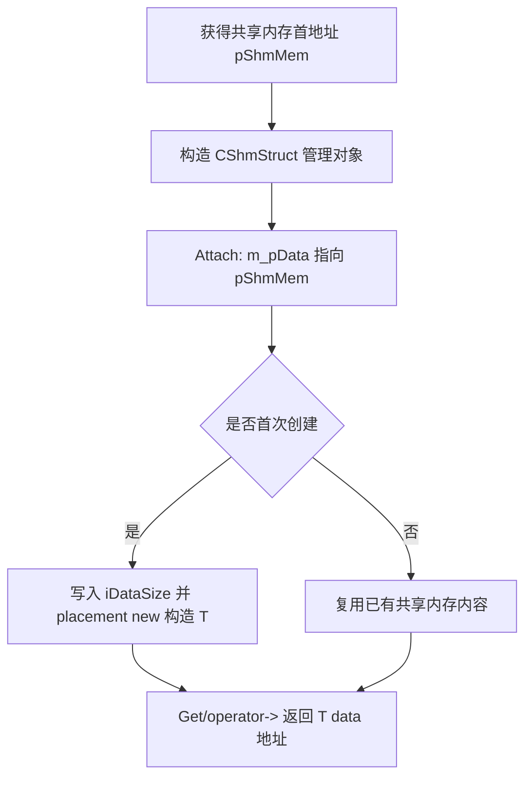
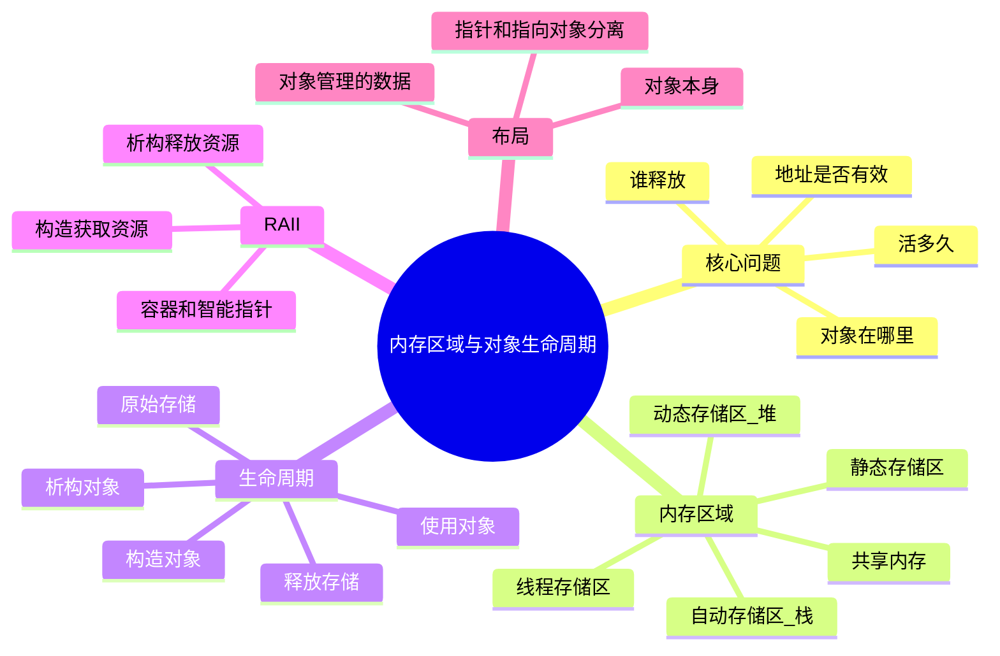

# 1. 背景与核心问题

## 1.1 为什么要区分内存区域与生命周期

C++ 的内存问题经常不是单纯的“栈和堆谁快”，而是几个概念混在一起造成的：

| 维度 | 关注点 | 典型问题 |
|---|---|---|
| **存储位置** | 对象的字节放在哪里 | 栈、堆、静态区、共享内存 |
| **存储期** | 那块存储空间什么时候分配、什么时候释放 | 离开作用域后内存是否还存在 |
| **对象生命周期** | 构造函数和析构函数之间的时间段 | 对象是否已经被构造、是否已经析构 |
| **资源所有权** | 谁负责释放对象管理的资源 | `delete`、RAII、智能指针、容器 |
| **访问有效性** | 指针、引用、迭代器是否还能用 | 悬空指针、迭代器失效 |

> [!summary]
> C++ 内存管理的主线是：**对象在哪里、活多久、由谁释放、访问是否仍然有效**。这四件事分清楚以后，栈、堆、RAII、智能指针、容器和共享内存都可以放到同一套逻辑里理解。

## 1.2 栈和堆不是类型特性

同一个类型既可以创建在栈上，也可以创建在堆上：

```cpp
#include <string>

void f()
{
    std::string a = "stack object";          // a 对象本身是自动存储期
    auto* b = new std::string("heap object"); // *b 对象是动态存储期

    delete b;
}
```

这里有两个容易混淆的点：

- `a` 是一个 `std::string` 对象，它本身在当前函数的栈帧中。
- `a` 内部可能仍然管理堆内存，因为字符串内容可能被放到堆上。

所以更准确的表达不是“`std::string` 在栈上还是堆上”，而是：

- **`std::string` 对象本身在哪里？**
- **它内部管理的字符缓冲区在哪里？**
- **谁负责释放这些资源？**

## 1.3 三层模型：存储、对象、资源

理解 C++ 内存时可以用三层模型：

```text
第 1 层：存储空间
  一段原始字节，可以来自栈、堆、静态区、共享内存、内存池。

第 2 层：对象生命周期
  在某段存储空间上构造对象，对象生命周期开始；
  调用析构函数后，对象生命周期结束。

第 3 层：资源所有权
  对象内部可能继续管理其他资源，例如堆内存、文件句柄、socket、锁。
```

示例：

```cpp
#include <vector>

void f()
{
    std::vector<int> v{1, 2, 3};
}
```

这段代码里：

| 层次 | 内容 |
|---|---|
| 存储空间 | `v` 对象本身的几个指针和大小字段通常在栈帧中 |
| 对象生命周期 | 进入作用域时构造 `v`，离开作用域时析构 `v` |
| 资源所有权 | `v` 内部管理堆上的连续元素数组，析构时自动释放 |

> [!tip]
> 可把 C++ 对象理解为“放在某个位置的一组字节 + 一段生命周期 + 一套资源管理规则”。原始内存只解决第一层，构造和析构才让它成为真正的对象。

---

# 2. C++ 常见内存区域

## 2.1 自动存储区

自动存储区通常对应函数调用栈。局部变量在进入作用域时创建，离开作用域时自动销毁。

```cpp
#include <array>
#include <string>

void f()
{
    int x = 42;
    std::array<int, 4> arr{1, 2, 3, 4};
    std::string name = "Alice";
} // name、arr、x 在这里按逆序析构
```

特点：

| 特点 | 说明 |
|---|---|
| 分配快 | 通常只是调整栈指针，函数进入时建立栈帧 |
| 生命周期清晰 | 和作用域绑定，离开作用域自动析构 |
| 异常安全 | 栈展开时自动调用已构造对象的析构函数 |
| 容量有限 | 不适合放巨大数组或不可控大小对象 |
| 不适合跨作用域持有地址 | 局部变量销毁后，其地址变成悬空指针 |

典型栈帧示意：

```text
调用 f() 后：

高地址
+-----------------------+
| 返回地址 / 保存寄存器 |
+-----------------------+
| name 对象本身         |
+-----------------------+
| arr[0..3]             |
+-----------------------+
| x                     |
+-----------------------+
低地址
```

> [!warning]
> 栈上对象“自动析构”不等于对象不使用堆。比如 `std::string name` 的对象本体在栈上，但它管理的字符缓冲区可能在堆上。

## 2.2 动态存储区

动态存储区通常称为堆。对象可以通过 `new`、标准库容器、智能指针或底层分配器在运行期申请。

```cpp
int* p = new int(42);

delete p;
p = nullptr;
```

特点：

| 特点 | 说明 |
|---|---|
| 大小灵活 | 对象大小和数量可以在运行期决定 |
| 生命周期可跨作用域 | 不随创建它的函数返回而自动释放 |
| 需要所有权管理 | 必须明确谁负责释放 |
| 分配成本较高 | 分配器需要查找空闲块、维护元数据、处理碎片 |
| 容易出错 | 泄漏、重复释放、悬空指针、异常安全问题 |

动态对象的基本布局：

```text
栈:                     堆:
+----------+            +-----------+
| p -------|----------> | int = 42  |
+----------+            +-----------+
```

`delete p` 释放的是 `p` 指向的对象，不会销毁 `p` 这个指针变量本身。

## 2.3 静态存储区

全局变量、命名空间作用域变量、`static` 局部变量具有静态存储期。

```cpp
int global_count = 0;

void f()
{
    static int call_count = 0;
    ++call_count;
}
```

特点：

| 特点 | 说明 |
|---|---|
| 生命周期长 | 通常从程序启动前后持续到程序结束 |
| 初始化只发生一次 | `static` 局部变量第一次执行到声明处时初始化 |
| 适合保存全局状态 | 配置、单例、统计计数等 |
| 容易产生顺序问题 | 跨翻译单元静态初始化顺序不可靠 |
| 退出时析构 | 程序结束阶段按规则析构，顺序需谨慎 |

> [!warning]
> 静态对象不适合随意持有其他静态对象的引用，因为不同 `.cpp` 文件中的初始化顺序没有统一保证，容易出现“静态初始化顺序灾难”。

## 2.4 线程存储区

`thread_local` 对象具有线程存储期。每个线程各自拥有一份独立对象。

```cpp
thread_local int request_count = 0;

void handle_request()
{
    ++request_count;
}
```

特点：

| 特点 | 说明 |
|---|---|
| 每线程一份 | 不同线程访问的是不同实例 |
| 生命周期随线程 | 在线程开始后初始化，线程结束时销毁 |
| 适合线程局部缓存 | 日志缓冲区、临时对象池、线程统计 |
| 不适合跨线程共享 | 地址或引用传给其他线程时要非常小心 |

## 2.5 只读常量区与代码区

字符串字面量、只读常量和程序指令通常放在只读数据区或代码区。它们不是 C++ 标准层面的“必须这样实现”，但主流平台通常如此。

```cpp
const char* p = "hello";
```

这里：

- `p` 这个指针变量本身可能在栈上。
- `"hello"` 字符串字面量通常在只读存储区。
- 修改字符串字面量是未定义行为。

```cpp
// 错误示范
char* q = const_cast<char*>("hello");
q[0] = 'H'; // 未定义行为
```

---

# 3. 存储期与对象生命周期

## 3.1 存储期分类

C++ 中常见存储期可以概括为：

| 存储期 | 常见来源 | 释放时机 |
|---|---|---|
| 自动存储期 | 局部非 `static` 变量 | 离开作用域 |
| 静态存储期 | 全局变量、命名空间变量、`static` 变量 | 程序结束 |
| 线程存储期 | `thread_local` 变量 | 线程结束 |
| 动态存储期 | `new`、分配器、容器内部申请 | 显式释放或所有者析构 |

存储期描述的是**存储空间有效多久**，对象生命周期描述的是**对象什么时候构造、什么时候析构**。二者相关，但不是同一个概念。

## 3.2 对象生命周期开始

对象生命周期通常从构造完成开始。

```cpp
#include <string>

void f()
{
    std::string s("hello"); // 构造完成后，s 的生命周期开始
}
```

对于动态对象：

```cpp
auto* p = new std::string("hello");
```

`new` 做了两件事：

1. 分配足够的原始内存。
2. 在这块内存上构造 `std::string` 对象。

## 3.3 对象生命周期结束

对象生命周期通常在析构函数执行完成后结束。

```cpp
void f()
{
    std::string s("hello");
} // s 的析构函数执行，生命周期结束
```

对于动态对象：

```cpp
auto* p = new std::string("hello");
delete p;
```

`delete` 做了两件事：

1. 调用 `std::string` 析构函数。
2. 释放对象占用的动态存储空间。

> [!warning]
> `delete p` 后，`p` 这个指针变量仍然存在，只是它保存的地址已经失效。继续解引用就是悬空指针访问。

## 3.4 原始存储不等于对象

下面代码只申请了原始字节，并没有构造 `std::string` 对象：

```cpp
#include <memory>
#include <new>
#include <string>

void f()
{
    void* mem = ::operator new(sizeof(std::string));

    auto* s = new (mem) std::string("hello"); // placement new 构造对象

    std::destroy_at(s);                       // 手动析构对象
    ::operator delete(mem);                   // 释放原始存储
}
```

这段代码展示了底层内存管理的完整流程：

```text
申请原始存储 -> 在存储上构造对象 -> 使用对象 -> 析构对象 -> 释放原始存储
```

标准库容器、内存池、对象池内部都在处理类似问题，只是它们把这些细节封装起来。

## 3.5 生命周期和作用域的区别

作用域是名字可见范围，生命周期是对象是否存在。二者经常重合，但不是同一概念。

```cpp
int* make_value()
{
    int* p = new int(42);
    return p;
}
```

`p` 这个指针变量的作用域在函数内，函数返回后 `p` 消失；但 `p` 指向的动态对象仍然存在，直到调用 `delete`。

相反，返回局部变量地址是错误的：

```cpp
int* bad()
{
    int x = 42;
    return &x; // 错误：x 离开函数后生命周期结束
}
```

---

# 4. 栈对象、堆对象与 RAII

## 4.1 栈对象：作用域绑定生命周期

栈对象最适合表达局部、短生命周期资源：

```cpp
#include <fstream>

void write_log()
{
    std::ofstream file("app.log");
    file << "hello\n";
} // file 析构，自动关闭文件
```

这里 `std::ofstream` 是典型 RAII 类型：

- 构造时打开文件。
- 析构时关闭文件。
- 即使中途抛异常，栈展开也会调用析构函数。

## 4.2 堆对象：生命周期与作用域解耦

堆对象适合生命周期不能被当前作用域覆盖的场景：

```cpp
#include <memory>
#include <string>

std::unique_ptr<std::string> create_name()
{
    return std::make_unique<std::string>("Alice");
}
```

这段代码中：

- `std::string` 对象在堆上。
- `std::unique_ptr` 负责独占管理它。
- 函数返回时，所有权从局部 `unique_ptr` 移动到调用者。

## 4.3 手动 `new/delete` 的问题

手动管理动态对象容易出现异常安全问题：

```cpp
#include <string>

void f()
{
    auto* p = new std::string("hello");

    // 如果这里抛异常，delete p 可能执行不到

    delete p;
}
```

更好的写法：

```cpp
#include <memory>
#include <string>

void f()
{
    auto p = std::make_unique<std::string>("hello");

    // 即使这里抛异常，p 的析构函数也会自动释放对象
}
```

## 4.4 RAII 的本质

RAII 的核心是：**把资源的释放绑定到对象析构函数上**。

| 资源 | RAII 工具 |
|---|---|
| 单个动态对象 | `std::unique_ptr<T>` |
| 共享动态对象 | `std::shared_ptr<T>` |
| 动态数组 | `std::vector<T>` |
| 固定数组 | `std::array<T, N>` |
| 文件 | `std::ifstream`、`std::ofstream` |
| 互斥锁 | `std::lock_guard`、`std::unique_lock` |
| 原始内存 | 容器、分配器、智能指针、专用内存池 |

> [!summary]
> C++ 中“少写 `delete`”不是偷懒，而是把释放逻辑交给能自动析构的对象，减少泄漏、重复释放和异常路径遗漏。

---

# 5. 常见容器与对象内存布局

## 5.1 `std::array`：数据嵌在对象内部

`std::array<T, N>` 是固定大小数组的轻量包装器，元素直接嵌在 `std::array` 对象内部。

```cpp
#include <array>

void f()
{
    std::array<int, 4> arr{1, 2, 3, 4};
}
```

若 `arr` 是局部变量，则整个数组通常位于当前栈帧：

```text
栈:
+-----------------------------------+
| arr[0] | arr[1] | arr[2] | arr[3] |
+-----------------------------------+
```

如果 `std::array` 是类成员，那么数据嵌在类对象内部。类对象在哪里，数组数据就在哪里：

```cpp
#include <array>

struct Packet
{
    int id;
    std::array<char, 16> payload;
};
```

```text
Packet 对象:
+------+--------------------------------+
| id   | payload[0..15]                 |
+------+--------------------------------+
```

## 5.2 `std::vector`：对象本身和元素缓冲区分离

`std::vector<T>` 对象本身通常只保存几个管理字段，例如数据指针、大小、容量。元素缓冲区通常在堆上。

```cpp
#include <vector>

void f()
{
    std::vector<int> v{1, 2, 3, 4};
}
```

典型布局：

```text
栈:                         堆:
+-------------------+        +---------------------------+
| data | size | cap | -----> | v[0] | v[1] | v[2] | v[3] |
+-------------------+        +---------------------------+
```

当 `v` 离开作用域：

1. `v` 的析构函数执行。
2. 析构函数销毁元素。
3. 析构函数释放堆上的元素缓冲区。
4. `v` 对象本身所在的栈帧随函数返回被回收。

## 5.3 `std::string`：对象本身和字符存储可能分离

`std::string` 和 `std::vector` 类似，都是对象本身管理一段字符存储。但 `std::string` 常见实现还包含小字符串优化。

```cpp
#include <string>

void f()
{
    std::string short_name = "abc";
    std::string long_name = "this is a long string that may allocate";
}
```

可能布局：

```text
short_name 对象本身:
+--------------------------------+
| 小字符串直接存放在对象内部     |
+--------------------------------+

long_name 对象本身:              堆:
+-------------------------+      +----------------------------+
| data | size | capacity  | ---> | 字符内容                   |
+-------------------------+      +----------------------------+
```

> [!info]
> 小字符串优化是实现细节，不同标准库实现不同。不能编写依赖具体 `std::string` 内部布局的代码。

## 5.4 指针变量和指向对象的区别

指针变量本身也有自己的存储位置。

```cpp
void f()
{
    int* p = new int(42);
    delete p;
}
```

布局：

```text
栈:                    堆:
+----------+           +----------+
| p -------|---------> | int 42   |
+----------+           +----------+
```

`p` 是一个局部变量，通常在栈上；`*p` 是动态对象，在堆上。

`delete p` 后：

```text
栈:                    堆:
+----------+           +--------------+
| p -------|----X      | 已释放内存   |
+----------+           +--------------+
```

`p` 没有自动变成 `nullptr`，它仍然保存旧地址。为了降低误用风险，可以手动置空：

```cpp
delete p;
p = nullptr;
```

但更推荐直接使用**智能指针**，让所有权明确。

---

# 6. 性能与局部性

## 6.1 分配成本

栈分配通常很便宜：函数进入时建立栈帧，函数返回时整体回收。很多情况下并不是每个局部变量单独调用一次分配器。

堆分配更复杂，分配器可能需要：

- 查找合适的空闲块。
- 维护堆元数据。
- 拆分或合并空闲块。
- 处理多线程锁竞争。
- 必要时向操作系统申请更多内存。

| 操作 | 典型成本来源 |
|---|---|
| 栈上局部变量 | 栈指针调整、编译期布局 |
| `new` 小对象 | 分配器元数据、空闲链表、锁、构造函数 |
| `vector::push_back` 扩容 | 重新分配、移动或拷贝旧元素、释放旧缓冲区 |
| 内存池分配 | 通常是空闲链表摘取，成本稳定 |

## 6.2 访问成本

访问对象时，分配位置本身不是唯一因素，数据是否连续更重要。

`std::array`：

```cpp
std::array<int, 4> arr{};
arr[0] = 1;
```

元素与对象本体在一起，连续访问非常直接。

`std::vector`：

```cpp
std::vector<int> v(4);
v[0] = 1;
```

需要先通过 `v` 对象中的指针找到堆上的元素区。这个额外间接访问通常不是主要开销，但在热路径中可能影响缓存和流水线。

## 6.3 Cache 友好性

CPU 读取内存通常按缓存行加载，常见缓存行大小为 64 字节。连续内存更容易被一次加载和预取。

| 数据组织 | Cache 友好性 | 说明 |
|---|---|---|
| 连续数组 | 高 | 相邻元素地址连续，硬件预取器容易识别 |
| `std::vector<T>` | 高 | 元素连续，适合遍历 |
| 链表 | 低 | 节点分散在堆上，容易 Cache Miss |
| 小对象频繁堆分配 | 不稳定 | 地址由分配器决定，局部性不可控 |
| 内存池对象 | 较高 | 同类对象集中分配，局部性更可控 |

> [!tip]
> 性能敏感代码优先关注**数据布局和访问模式**，而不只是“栈一定快、堆一定慢”这种粗粒度判断。

## 6.4 大对象放栈的风险

栈空间通常远小于堆空间，大数组放栈上可能导致栈溢出：

```cpp
void f()
{
    int huge[10'000'000]; // 风险：可能栈溢出
}
```

更稳妥：

```cpp
#include <vector>

void f()
{
    std::vector<int> huge(10'000'000);
}
```

这里 `huge` 对象本身仍是局部变量，但它管理的元素缓冲区位于堆上。

---

# 7. 指针、引用与失效问题

## 7.1 返回局部变量地址

错误示范：

```cpp
int* get_value()
{
    int x = 42;
    return &x;
}
```

`x` 在函数返回后生命周期结束，返回的地址变成悬空指针。

正确方式之一：

```cpp
int get_value()
{
    return 42;
}
```

如果确实需要动态生命周期：

```cpp
#include <memory>

std::unique_ptr<int> make_value()
{
    return std::make_unique<int>(42);
}
```

## 7.2 `vector` 扩容导致指针失效

```cpp
#include <vector>

void f()
{
    std::vector<int> v;
    v.reserve(2);
    v.push_back(1);
    v.push_back(2);

    int* p = &v[0];

    v.push_back(3); // 可能扩容，搬迁元素

    // p 可能已经失效
}
```

扩容前：

```text
v.data() ----> [1][2]
p -------------^
```

扩容后：

```text
旧缓冲区: [已释放或不再归 vector 管理]
p -------X

新缓冲区: [1][2][3]
v.data() -^
```

规避方式：

- 提前 `reserve` 足够容量。
- 不长期保存元素指针或引用。
- 使用索引代替裸指针。
- 若需要稳定地址，考虑 `std::deque`、链表或对象池，但要根据访问模式权衡。

## 7.3 `delete` 后指针不自动失效为 `nullptr`

```cpp
int* p = new int(42);
delete p;

// if (p) 仍然可能为 true
```

`delete` 释放的是动态对象，**不会修改**指针变量 `p` 的值。`p` 仍然保存旧地址，只是这个地址不再能被合法解引用。

```cpp
delete p;
p = nullptr;
```

置空可以降低单个指针变量被误用的概率，但不能解决所有别名问题：

```cpp
int* p = new int(42);
int* q = p;

delete p;
p = nullptr;

// q 仍然是悬空指针
```

根本办法仍然是用所有权模型管理对象。

---

# 8. 对象本身和对象管理的内存布局

## 8.1 需要区分的两种布局

很多内存管理封装类都会出现一个现象：**对象本身很小，但它管理的内存很大**。

例如 `std::vector<int>`：

```text
vector 对象本身:               vector 管理的元素缓冲区:
+-------------------+           +--------------------------+
| data | size | cap | ------->  | int | int | int | ...    |
+-------------------+           +--------------------------+
```

同样地，下面讨论的 `CShmStruct<T>` 也有两种不同布局：

| 布局 | 含义 |
|---|---|
| `CShmStruct<T>` 对象本身布局 | 当前进程普通内存里的 C++ 管理对象，内部通常只有指针等管理字段 |
| `CShmStruct<T>` 管理的共享内存布局 | System V / mmap 等机制得到的一段共享内存，被解释成头部 + 业务数据 |

> [!summary]
> 这里设定 `CShmStruct<T>` 对象是一个**共享内存结构体**，它本身不是共享内存块，只是当前进程里的一个“句柄/视图对象”，通过内部指针指向真正的共享内存。

## 8.2 `CShmStruct<T>` 示例

下面是一个简化示例，用来解释内存布局。真实项目中 `Create` 可能会调用 `shmget`、`shmat`、`mmap` 或封装好的共享内存接口。

```cpp
#include <cstddef>
#include <new>

template<class T>
class CShmStruct
{
public:
    CShmStruct() = default;

    int Attach(void* pShmMem, std::size_t shmSize, bool needInit)
    {
        if (pShmMem == nullptr)
        {
            return -1;
        }

        if (shmSize < sizeof(_DataInfo) + sizeof(T))
        {
            return -2;
        }

        m_pData = static_cast<_DataInfo*>(pShmMem);

        if (needInit)
        {
            m_pData->iDataSize = static_cast<int>(sizeof(T));
            new (m_pData->data) T{};
        }

        return 0;
    }

    T* operator->()
    {
        return m_pData->data;
    }

    T* Get()
    {
        return m_pData->data;
    }

private:
    struct _DataInfo
    {
        int iDataSize;
        T data[0];
    };

    _DataInfo* m_pData = nullptr;
};
```

这段代码中最关键的是：

```cpp
struct _DataInfo
{
    int iDataSize;
    T data[0];
};
```

它描述的是**共享内存块内部的格式**，不是说每个 `CShmStruct<T>` 对象里都直接嵌入了一个 `_DataInfo` 对象。

> [!warning]
> `T data[0]` 是 GCC/Clang 等编译器支持的零长数组扩展，不是标准 C++。它常用于表示“尾部变长数据的起点”。标准 C++ 中更推荐显式计算偏移，或使用 `std::byte` 缓冲区配合对齐处理。

## 8.3 `CShmStruct<T>` 对象本身的布局

`CShmStruct<T>` 类中真正的非静态数据成员只有一个：

```cpp
_DataInfo* m_pData = nullptr;
```

> [!note]
> 嵌套的 `struct _DataInfo` 只是一个**类型定义**，不会让每个 `CShmStruct<T>` 对象内部自动包含一个 `_DataInfo` 实例。

因此，一个 `CShmStruct<T>` 对象本身大致是：

```text
CShmStruct<T> 对象本身:

+----------------------+
| m_pData 指针         |
+----------------------+
```

在 64 位进程中，若没有其他成员，通常：

```cpp
sizeof(CShmStruct<T>) == sizeof(void*) // 常见为 8
```

但更严谨地说，这只是常见实现结果；实际大小仍由 ABI、对齐和成员决定。

如果这样声明：

```cpp
CShmStruct<ServerGlobalState> g_serverState;
```

`g_serverState` 本身可能位于静态存储区，因为它是全局变量：

```text
当前进程普通内存中的 g_serverState:

+----------------------+
| m_pData 指针         |
+----------------------+
          |
          | Attach 后指向
          v
共享内存块:
+----------------------+---------------------------+
| iDataSize            | ServerGlobalState data    |
+----------------------+---------------------------+
```

如果这样声明：

```cpp
void f()
{
    CShmStruct<ServerGlobalState> state;
}
```

`state` 对象本身通常在栈上，但它的 `m_pData` 仍然可以指向共享内存：

```text
栈上的 state 对象:       共享内存:
+---------------+        +----------------------+------------------+
| m_pData ------|------> | iDataSize            | T data           |
+---------------+        +----------------------+------------------+
```

## 8.4 `_DataInfo` 的作用

`_DataInfo` 的作用类似“协议头”或“文件头”：**描述的是共享内存块格式**，它告诉编译器如何解释 `m_pData` 指向的那段字节。

```cpp
m_pData = static_cast<_DataInfo*>(pShmMem);
```

这句代码的含义是：

- `pShmMem` 是共享内存起始地址。
- 把它解释成 `_DataInfo*`。
- 共享内存开头的若干字节被看作 `iDataSize`。
- `iDataSize` 后面的地址被看作 `T data` 的起始位置。

共享内存布局：

```text
pShmMem / m_pData
  |
  v
+----------------------+-------------------------------+
| _DataInfo::iDataSize | T data                        |
| int                  | 业务结构体字段                |
+----------------------+-------------------------------+
                       ^
                       |
                  m_pData->data
                  Get() 返回这里
```

`Get()` 的返回值：

```cpp
T* Get()
{
    return m_pData->data;
}
```

它返回的不是 `CShmStruct<T>` 对象本身，也不是 `_DataInfo` 头部，而是共享内存中业务数据 `T` 的起始地址。

## 8.5 嵌套 `struct` 不等于成员变量

下面这个类：

```cpp
class A
{
private:
    struct B
    {
        int x;
    };

    B* p;
};
```

`A` 的对象布局只有一个指针成员：

```text
A 对象:
+----------+
| p        |
+----------+
```

`struct B` 只是声明了一个类型。它不会自动占据每个 `A` 对象的空间。

只有写成下面这样，`A` 对象内部才真的包含一个 `B` 对象：

```cpp
class A
{
private:
    struct B
    {
        int x;
    };

    B  b;
    B* p;
};
```

此时布局大致是：

```text
A 对象:
+----------+----------+
| b.x      | p        |
+----------+----------+
```

其中可能存在 padding，用于满足 `p` 的对齐要求。

## 8.6 零长数组在这里的作用

`T data[0]` 不占用 `T` 元素空间，它表示“从这里开始，后面紧跟着业务数据”。

```cpp
struct _DataInfo
{
    int iDataSize;
    T data[0];
};
```

假设 `T` 是：

```cpp
struct ServerGlobalState
{
    int onlineCount;
    long long totalRequest;
};
```

共享内存可以按下面方式估算：

```cpp
std::size_t shmSize = sizeof(int) + sizeof(ServerGlobalState);
```

但这只是粗略估算，因为它没有显式考虑 `_DataInfo` 头部可能产生的 padding。更稳妥的思路是在类内部使用实际头部大小：

```cpp
sizeof(_DataInfo) + sizeof(T)
```

由于 `_DataInfo` 是 `private`，外部不能直接访问它。真实工程中通常会提供一个静态函数，把这个计算封装起来：

```cpp
template<class T>
class CShmStruct
{
public:
    static std::size_t ShmSize()
    {
        return sizeof(_DataInfo) + sizeof(T);
    }

private:
    struct _DataInfo
    {
        int iDataSize;
        T data[0];
    };

    _DataInfo* m_pData = nullptr;
};
```

这样外部可以写：

```cpp
std::size_t shmSize = CShmStruct<ServerGlobalState>::ShmSize();
```

> [!warning]
> `sizeof(_DataInfo)` 不一定等于 `sizeof(int)`。如果 `T` 的对齐要求比 `int` 高，编译器可能在 `iDataSize` 后面插入 padding，让 `data` 起始地址满足 `T` 的对齐要求。

例如：

```cpp
struct BigAlign
{
    double value;
};
```

`double` 通常要求 8 字节对齐。下面布局可能出现 padding：

```text
+----------------------+----------------------+----------------------+
| iDataSize: 4 bytes   | padding: 4 bytes     | BigAlign data        |
+----------------------+----------------------+----------------------+
```

所以 `sizeof(_DataInfo)` 通常是计算业务数据起点的更好方式。

## 8.7 `Attach` 和初始化流程

结合前面的示例，一个共享内存对象的使用流程可以是：

```cpp
struct ServerGlobalState
{
    int onlineCount;
    long long totalRequest;
};

void init(void* pShmMem, std::size_t shmSize, bool isFirstCreate)
{
    CShmStruct<ServerGlobalState> state;

    int ret = state.Attach(pShmMem, shmSize, isFirstCreate);
    if (ret != 0)
    {
        return;
    }

    state->onlineCount = 10;
    state->totalRequest += 1;
}
```

关键过程：



此处 `state` 只是管理对象；真正被多个进程共享的是 `pShmMem` 指向的共享内存块。

> [!warning]
> 放入共享内存的 `T` 应尽量是平凡、无进程内指针语义的数据结构。不要直接把 `std::string`、`std::vector`、普通指针等放入跨进程共享内存，因为它们内部地址只在当前进程有效。

## 8.8 `CShmStruct<T>` 与 `std::vector<T>` 的类比

二者都有“对象本身”和“管理的数据”两层：

| 类型 | 对象本身 | 管理的数据 |
|---|---|---|
| `std::vector<T>` | 指针、大小、容量 | 堆上的连续元素数组 |
| `CShmStruct<T>` | `m_pData` 指针 | 共享内存中的 `_DataInfo + T data` |

类比图：

```text
std::vector<T>:

vector 对象             堆内存
+----------------+      +------------------------+
| data size cap  | ---> | T | T | T | ...        |
+----------------+      +------------------------+

CShmStruct<T>:

CShmStruct 对象          共享内存
+----------------+      +------------------------+----------------+
| m_pData        | ---> | iDataSize              | T data         |
+----------------+      +------------------------+----------------+
```

这个类比的边界：

- `std::vector` 拥有并释放它的堆内存。
- `CShmStruct` 未必拥有共享内存，它可能只是 attach 到已有共享内存。
- `std::vector` 会自动构造、析构元素。
- 共享内存中的对象构造和析构需要额外约定，尤其跨进程时更复杂。

---

# 9. 常见易错点

| # | 陷阱 | 后果 | 规避 |
|---|---|---|---|
| 1 | 把“栈/堆”当成类型属性 | 误判对象布局和生命周期 | 区分对象本身位置与对象管理的资源 |
| 2 | 返回局部变量地址 | 悬空指针 | 返回值、智能指针或由调用者传入存储 |
| 3 | `delete` 后继续使用指针 | Use-after-free | 使用 RAII，必要时置空单个指针 |
| 4 | 大数组放栈上 | 栈溢出 | 使用 `std::vector` 或堆分配 |
| 5 | 保存 `vector` 元素指针后继续扩容 | 指针、引用、迭代器失效 | `reserve`、使用索引或避免长期保存地址 |
| 6 | 用 `malloc` 分配类对象后直接使用 | 构造函数未执行 | 使用 `new`、`construct_at` 或 placement new |
| 7 | 只析构对象但不释放存储 | 内存泄漏 | 析构和释放要配对 |
| 8 | 只释放存储但不析构对象 | 资源泄漏 | 对非平凡对象先析构再释放 |
| 9 | 误以为嵌套 `struct` 占用外层对象空间 | 错误理解 `sizeof` 和布局 | 只有非静态数据成员才进入对象布局 |
| 10 | 把 `std::string` / `std::vector` 放入共享内存跨进程使用 | 内部指针在其他进程无效 | 使用 POD 风格结构、偏移量或专用共享内存容器 |

> [!warning]
> 大多数内存 bug 都来自“生命周期已经结束，但地址还在手里”。地址只是一个数值，它不会告诉你对象是否仍然活着。

---

# 10. 最佳实践

1. **默认使用自动对象和 RAII**：局部对象、容器、智能指针优先于裸 `new/delete`。
2. **明确所有权**：谁创建、谁释放、能否共享、能否转移，都应在类型上表达出来。
3. **区分对象本身和管理资源**：尤其是 `vector`、`string`、智能指针、共享内存封装类。
4. **避免长期保存裸指针**：指针不表达所有权，也不表达生命周期。
5. **容器扩容前考虑失效问题**：保存元素地址前先确认容器是否会搬迁元素。
6. **大块数据优先放堆或容器**：不要在栈上创建不可控大小的大数组。
7. **原始内存和对象生命周期分开处理**：`operator new` / `malloc` 只给字节，构造函数才创建对象。
8. **共享内存中使用简单布局**：跨进程共享时优先使用固定大小字段、数组、偏移量，不直接保存进程内指针。
9. **性能优化先看数据布局**：连续性、访问顺序、缓存命中率通常比“栈还是堆”的口号更重要。

---

# 11. 总结



| 概念 | 核心结论 |
|---|---|
| 栈 | 自动存储期，分配快，生命周期随作用域，容量有限 |
| 堆 | 动态存储期，大小灵活，需要明确所有权 |
| 静态区 | 生命周期贯穿程序，适合全局状态，但要小心初始化顺序 |
| 对象生命周期 | 从构造完成到析构完成，不等同于内存字节存在时间 |
| RAII | 用对象析构自动释放资源，是现代 C++ 内存管理基础 |
| `std::array` | 元素嵌在对象内部，对象在哪里元素就在哪里 |
| `std::vector` | 对象本身管理堆上连续缓冲区 |
| `CShmStruct<T>` | 对象本身通常只是指针，真正数据在共享内存块中 |

> [!summary]
> 判断一段 C++ 内存代码是否可靠，可以连续问四个问题：**这段字节在哪里？对象是否已经构造？谁负责析构和释放？我手里的地址是否仍然有效？**
