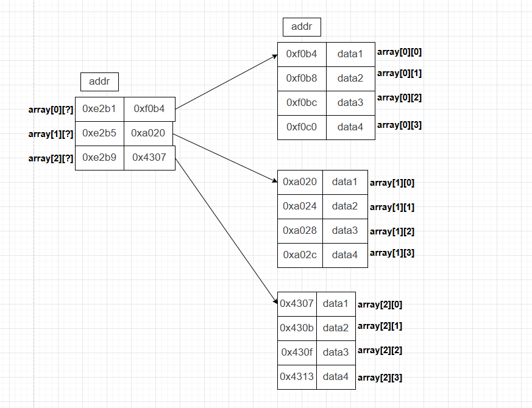

# 1. 核心问题

多维数组的性能关键不是“维度有几层”，而是**元素在内存中是否连续，以及遍历顺序是否符合内存布局**。

| 组织方式 | 内存连续性 | 管理复杂度 | 推荐程度 |
|---|---|---:|---|
| 栈上二维数组 | 整体连续 | 低 | 小规模固定大小推荐 |
| `int**` 指针数组 | 行内连续，行间不连续 | 高 | 不推荐 |
| 一维数组展平 | 整体连续 | 中 | 动态大小推荐 |
| `std::vector<T>` 展平 | 整体连续 | 低 | 现代 C++ 推荐 |

> [!summary]
> 性能敏感的多维数据结构应尽量保存为**一整块连续内存**，再用索引公式表达逻辑维度。

---

# 2. 栈上多维数组

## 2.1 基本写法

```cpp
void stack_array_example()
{
    int array[3][4] = {};
    array[1][2] = 5;
}
```

`int array[3][4]` 在内存中是 12 个 `int` 连续排列。C/C++ 的内置二维数组采用**行主序（row-major order）**：

```text
array[0][0] array[0][1] array[0][2] array[0][3]
array[1][0] array[1][1] array[1][2] array[1][3]
array[2][0] array[2][1] array[2][2] array[2][3]
```

实际线性顺序为：

```text
[0][0] [0][1] [0][2] [0][3] [1][0] [1][1] [1][2] [1][3] [2][0] [2][1] [2][2] [2][3]
```

## 2.2 优缺点

| 优点 | 说明 |
|---|---|
| 分配快 | 自动存储期对象通常随栈帧一次性分配 |
| Cache 友好 | 元素整体连续，顺序遍历命中率高 |
| 类型信息完整 | `array` 的行列大小是类型的一部分 |

| 缺点 | 说明 |
|---|---|
| 大小固定 | 维度通常需要编译期确定 |
| 栈空间有限 | 大数组可能导致栈溢出 |
| 不适合动态输入 | 运行期行列数变化时不灵活 |

---

# 3. 堆上指针数组

## 3.1 基本写法

```cpp
int rows = 3;
int cols = 4;

int** array = new int*[rows];
for (int i = 0; i < rows; ++i) {
    array[i] = new int[cols];
}

for (int i = 0; i < rows; ++i) {
    delete[] array[i];
}
delete[] array;
```

这种写法创建的是“指针目录 + 多个行数组”：

```text
array
  |
  v
+----------+     +-------------------+
| row[0] --|---> | 0,0 | 0,1 | 0,2 |
| row[1] --|--+  +-------------------+
| row[2] --|--|--------+
+----------+  |        v
              |   +-------------------+
              +-> | 1,0 | 1,1 | 1,2 |
                  +-------------------+
```

## 3.2 问题

`int**` 形式有三个主要问题：

1. **行间不连续**：每一行独立 `new[]`，分配器可能把它们放在相距很远的位置。
2. **释放复杂**：需要逐行释放，异常安全处理麻烦。
3. **访问多一次跳转**：`array[i][j]` 需要先读取 `array[i]`，再访问该行的第 `j` 个元素。



> [!warning]
> `int**` 不是“真正连续的二维数组”。它只是一个指针数组，每个指针再指向一行独立分配的数组。

---

# 4. 一维数组展平

## 4.1 基本写法

```cpp
int rows = 100;
int cols = 100;

std::vector<int> data(rows * cols);

auto index = [cols](int row, int col) {
    return row * cols + col;
};

data[index(3, 5)] = 42;
```

二维坐标到一维下标的转换公式为：

```text
index = row * cols + col
```

若扩展到三维数组：

```text
index = z * rows * cols + y * cols + x
```

## 4.2 优势

| 优势 | 说明 |
|---|---|
| 内存整体连续 | Cache 命中率和预取效果更好 |
| 分配释放简单 | 一次分配，一次释放 |
| 易对接底层接口 | 图形 API、C 接口、SIMD 常需要连续缓冲区 |
| RAII 友好 | `std::vector` 自动管理动态内存 |

---

# 5. 遍历顺序

## 5.1 行主序遍历

C/C++ 内置数组和上述展平公式都按行主序存储，因此应优先让内层循环遍历列。

```cpp
for (int row = 0; row < rows; ++row) {
    for (int col = 0; col < cols; ++col) {
        sum += data[row * cols + col];
    }
}
```

这会顺着连续地址访问，硬件预取器容易提前加载后续缓存行。

## 5.2 列优先遍历的代价

```cpp
for (int col = 0; col < cols; ++col) {
    for (int row = 0; row < rows; ++row) {
        sum += data[row * cols + col];
    }
}
```

每次内层循环都跨过一整行，步长为 `cols * sizeof(T)`。当矩阵较大时，这会导致缓存行利用率下降，甚至造成频繁 Cache Miss。

---

# 6. 容器选择

| 场景 | 推荐写法 |
|---|---|
| 编译期固定小矩阵 | `std::array<std::array<T, Cols>, Rows>` |
| 运行期动态矩阵 | `std::vector<T>` + 展平索引 |
| 需要矩阵运算 | Eigen、xtensor 等成熟库 |
| 需要二维语法封装 | 自定义 `Matrix` 类封装索引 |

简单封装示例：

```cpp
class Matrix
{
public:
    Matrix(std::size_t rows, std::size_t cols)
        : rows_(rows), cols_(cols), data_(rows * cols)
    {
    }

    int& operator()(std::size_t row, std::size_t col)
    {
        return data_[row * cols_ + col];
    }

private:
    std::size_t rows_;
    std::size_t cols_;
    std::vector<int> data_;
};
```

---

# 7. 易错点

> [!warning]
> 多维数组最常见的误解是把“语法上像二维”误认为“内存上整体连续”。

1. **`int**` 不等于 `int[rows][cols]`**：前者是多次分配的指针结构，后者是连续数组。
2. **忘记逐行释放**：`int**` 每一行都需要对应的 `delete[]`。
3. **遍历顺序反着写**：行主序布局中列优先遍历会明显损害局部性。
4. **大数组放栈上**：固定二维数组过大时应改为堆上容器。
5. **索引公式写错**：`row * cols + col` 中乘的是列数，不是行数。

---

# 8. 总结

| 结论 | 说明 |
|---|---|
| 连续内存优先 | 有利于 Cache、预取和底层接口 |
| 展平数组推荐 | 动态多维数据的常用工程写法 |
| `int**` 谨慎使用 | 行间不连续，释放复杂 |
| 遍历顺序重要 | 内层循环应贴合实际内存布局 |

> [!summary]
> 多维数组优化的本质是把“逻辑维度”和“物理布局”分开：逻辑上可以是二维、三维，物理上尽量保持一维连续。
