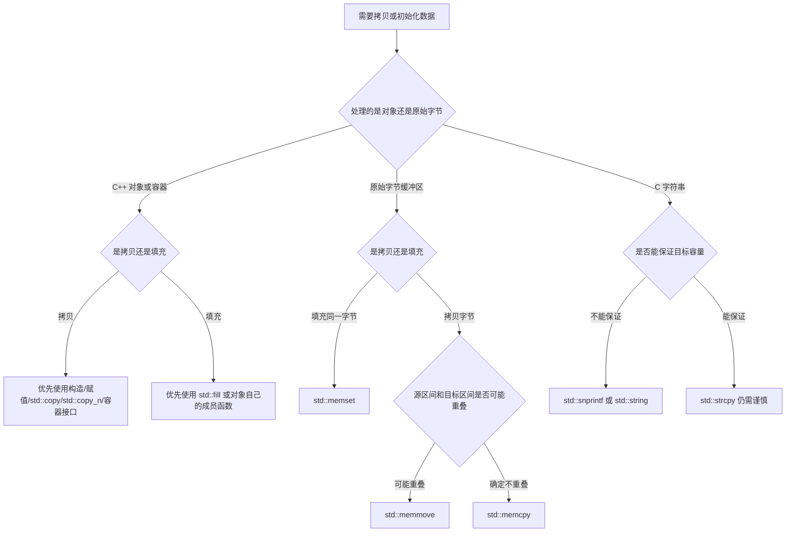

# 1. 核心原则

原始内存操作函数来自 C 风格接口，核心特点是：**它们操作的是一段连续字节序列，而不是 C++ 对象本身的语义**。

也就是说，`std::memcpy`、`std::memmove`、`std::memset` 这类函数只关心：

- 从哪个地址开始。
- 处理多少个字节。
- 每个字节如何复制或填充。

它们不会关心：

- 对象是否需要构造。
- 对象是否需要析构。
- 对象是否拥有堆内存、文件句柄、锁等资源。
- 拷贝时是否应该调用拷贝构造函数或赋值运算符。

> [!summary]
> 原始内存函数理解的是 **byte**，不是 **object**。越靠近协议、文件、网络、分配器、缓冲区，越可能需要它们；越靠近业务对象、容器、资源所有权，越应该使用 C++ 对象语义。

## 1.1 常见 API 总览

| 函数 | 头文件 | 核心作用 | 主要风险 |
|---|---|---|---|
| `std::memcpy` | `<cstring>` | 拷贝不重叠的原始字节 | 源和目标重叠是未定义行为 |
| `std::memmove` | `<cstring>` | 拷贝可能重叠的原始字节 | 仍然只适合字节语义 |
| `std::memset` | `<cstring>` | 按字节填充同一个值 | 不是按元素赋值 |
| `std::strcpy` | `<cstring>` | 拷贝以 `'\0'` 结尾的 C 字符串 | 不检查目标缓冲区容量 |
| `std::copy` | `<algorithm>` | 按元素拷贝区间 | 目标区间必须足够大 |
| `std::copy_n` | `<algorithm>` | 从起点开始拷贝指定数量的元素 | 数量是元素个数，不是字节数 |
| `std::fill` | `<algorithm>` | 按元素填充同一个值 | 与 `memset` 的字节填充不同 |

## 1.2 字节语义和对象语义

原始内存函数适合处理下面这种数据：

```cpp
struct Point
{
    int x;
    int y;
};
```

`Point` 只包含两个 `int`，没有动态资源，也没有自定义构造、析构、拷贝逻辑。它的内容可以被理解为一段固定大小的字节。

但下面这种对象不适合用原始内存函数直接复制：

```cpp
std::string s = "hello";
```

`std::string` 内部通常包含指针、长度、容量、小字符串优化状态等实现细节。直接复制字节会绕过 `std::string` 的拷贝构造和资源管理逻辑，可能导致双重释放、资源泄漏或对象状态损坏。

## 1.3 可平凡拷贝类型

`std::memcpy` 和 `std::memmove` 通常只应该用于**可平凡拷贝类型**。

可以粗略理解为：一个对象如果可以安全地把它的字节表示复制到另一块存储中，并且复制后的对象仍然是一个合法对象，它就适合按字节拷贝。

常见适用类型：

- 整数类型：`int`、`std::uint32_t`、`std::size_t`。
- 浮点类型：`float`、`double`。
- 原始数组：`int arr[10]`。
- 只包含平凡成员的简单结构体。
- 协议头、文件头、二进制缓冲区中布局明确的数据。

常见不适用类型：

- `std::string`。
- `std::vector`。
- `std::unique_ptr`。
- `std::shared_ptr`。
- 含虚函数的多态对象。
- 自定义了析构、拷贝构造、移动构造、赋值运算符的资源管理类型。

可以用类型萃取检查：

```cpp
#include <type_traits>

static_assert(std::is_trivially_copyable_v<int>);
static_assert(!std::is_trivially_copyable_v<std::string>);
```

---

# 2. `std::memcpy`

## 2.1 函数原型

```cpp
#include <cstring>

void* std::memcpy(void* dest, const void* src, std::size_t count);
```

## 2.2 参数说明

| 参数 | 含义 |
|---|---|
| `dest` | 目标内存地址，表示字节要复制到哪里 |
| `src` | 源内存地址，表示字节从哪里读取 |
| `count` | 要复制的字节数，单位是字节，不是元素个数 |

## 2.3 返回值

返回 `dest`，也就是目标内存地址。

这个返回值通常用于链式表达或兼容 C 风格接口，但日常 C++ 代码里多数情况下不会专门使用它。

## 2.4 最终效果

`std::memcpy` 会从 `src` 指向的内存位置开始，连续读取 `count` 个字节，然后写入到 `dest` 指向的内存位置。

效果可以理解为：

```text
src:   [b0][b1][b2][b3]...
          |   |   |   |
          v   v   v   v
dest:  [b0][b1][b2][b3]...
```

使用前必须保证：

- `src` 至少能读取 `count` 个字节。
- `dest` 至少能写入 `count` 个字节。
- `src` 和 `dest` 指向的内存区间不能重叠。
- 对于 C++ 对象，类型应适合按字节复制。

## 2.5 基本示例：拷贝数组

在这个例子中：

- `dest` 是 `dst` 数组的起始地址。
- `src` 是 `src` 数组的起始地址。
- `count` 是 `sizeof(src)`，表示整个 `src` 数组占用的字节数。
- 返回值是 `dst` 的地址，但这里不需要使用。
- 最终效果是把 `src` 中三个 `int` 的字节表示复制到 `dst`。

```cpp
#include <cstring>
#include <iostream>

int main()
{
    int src[3] = {1, 2, 3};
    int dst[3] = {};

    std::memcpy(dst, src, sizeof(src));

    for (int value : dst)
    {
        std::cout << value << ' ';
    }
}
```

输出：

```text
1 2 3
```

> [!warning]
> `sizeof(src)` 在这里得到的是整个数组的字节数。但如果 `src` 退化成指针，`sizeof(src)` 得到的就是指针大小，不再是数组大小。

## 2.6 示例：拷贝简单结构体

在这个例子中：

- `dest` 是 `&b`，表示目标结构体对象的地址。
- `src` 是 `&a`，表示源结构体对象的地址。
- `count` 是 `sizeof(Point)`，表示一个 `Point` 对象的字节大小。
- 返回值是 `&b`。
- 最终效果是 `b` 拥有和 `a` 相同的对象表示，因此 `b.x == 10` 且 `b.y == 20`。

```cpp
#include <cstring>
#include <iostream>

struct Point
{
    int x;
    int y;
};

int main()
{
    Point a{10, 20};
    Point b{};

    std::memcpy(&b, &a, sizeof(Point));

    std::cout << b.x << ", " << b.y << '\n';
}
```

## 2.7 示例：序列化协议头

原始内存拷贝经常用于协议头、文件头、网络包等固定二进制布局。

在这个例子中：

- 第一次 `memcpy` 的 `dest` 是 `buffer`，`src` 是 `&header`。
- `count` 是 `sizeof(Header)`。
- 最终效果是把结构体头部的原始字节写入字节缓冲区。
- 第二次 `memcpy` 方向相反，把缓冲区中的字节恢复到另一个 `Header` 对象中。

```cpp
#include <cstdint>
#include <cstring>
#include <iostream>

struct Header
{
    std::uint16_t type;
    std::uint16_t length;
};

int main()
{
    Header header{1, 128};
    unsigned char buffer[sizeof(Header)]{};

    std::memcpy(buffer, &header, sizeof(Header));

    Header parsed{};
    std::memcpy(&parsed, buffer, sizeof(Header));

    std::cout << parsed.type << ", " << parsed.length << '\n';
}
```

> [!warning]
> 真实网络协议中还要考虑字节序、结构体 padding、对齐和跨平台布局问题。不能简单假设任意结构体都适合直接 `memcpy` 到网络。

## 2.8 禁止场景：复制 `std::string`

下面代码是错误示范：

```cpp
#include <cstring>
#include <string>

int main()
{
    std::string a = "hello";
    std::string b;

    std::memcpy(&b, &a, sizeof(std::string)); // 错误
}
```

错误原因：

- `std::memcpy` 不会调用 `std::string` 的拷贝赋值运算符。
- `b` 的内部指针可能和 `a` 指向同一块资源。
- 程序结束时两个字符串析构，可能释放同一块内存。

正确写法：

```cpp
std::string a = "hello";
std::string b = a;
```

---

# 3. `std::memmove`

## 3.1 函数原型

```cpp
#include <cstring>

void* std::memmove(void* dest, const void* src, std::size_t count);
```

## 3.2 参数说明

| 参数 | 含义 |
|---|---|
| `dest` | 目标内存地址，表示字节要移动到哪里 |
| `src` | 源内存地址，表示字节从哪里读取 |
| `count` | 要移动的字节数，单位是字节 |

## 3.3 返回值

返回 `dest`，也就是目标内存地址。

## 3.4 最终效果

`std::memmove` 会把 `src` 开始的 `count` 个字节复制到 `dest`，并且**允许源区间和目标区间发生重叠**。

它的语义可以理解为：

1. 先把源区间的字节临时保存起来。
2. 再写入目标区间。

标准并不要求实现真的分配临时缓冲区，但最终效果必须像使用了临时缓冲区一样安全。

## 3.5 与 `std::memcpy` 的区别

| 情况 | `std::memcpy` | `std::memmove` |
|---|---|---|
| 源和目标完全不重叠 | 可以使用 | 可以使用 |
| 源和目标可能重叠 | 未定义行为 | 可以使用 |
| 典型性能 | 通常更直接 | 可能需要判断方向 |
| 使用意图 | 明确不重叠的拷贝 | 需要移动或无法确定是否重叠 |

## 3.6 示例：向右移动缓冲区内容

在这个例子中：

- `dest` 是 `buffer + 2`，表示从第 3 个字符位置开始写入。
- `src` 是 `buffer`，表示从第 1 个字符位置开始读取。
- `count` 是 `5`，表示移动 5 个字节。
- 返回值是 `buffer + 2`。
- 最终效果是把原来的 `"12345"` 移动到从索引 2 开始的位置。

```cpp
#include <cstring>
#include <iostream>

int main()
{
    char buffer[] = "1234567890";

    std::memmove(buffer + 2, buffer, 5);

    std::cout << buffer << '\n';
}
```

输出：

```text
1212345890
```

内存变化可以理解为：

```text
原始:
index:  0 1 2 3 4 5 6 7 8 9
value:  1 2 3 4 5 6 7 8 9 0

移动:
src:    1 2 3 4 5
dest:       1 2 3 4 5

结果:
value:  1 2 1 2 3 4 5 8 9 0
```

如果使用 `std::memcpy(buffer + 2, buffer, 5)`，由于源区间 `[0, 5)` 和目标区间 `[2, 7)` 重叠，行为是未定义的。

## 3.7 示例：删除数组中间元素

在这个例子中：

- 目标位置是 `arr + index`。
- 源位置是 `arr + index + 1`。
- 移动的元素个数是 `size - index - 1`。
- 传给 `memmove` 的 `count` 必须是字节数，所以要乘以 `sizeof(int)`。
- 最终效果是把被删除元素右侧的内容整体左移一位。

```cpp
#include <cstring>
#include <iostream>

int main()
{
    int arr[5] = {10, 20, 30, 40, 50};
    int size = 5;
    int index = 2;

    std::memmove(
        arr + index,
        arr + index + 1,
        static_cast<std::size_t>(size - index - 1) * sizeof(int)
    );

    --size;

    for (int i = 0; i < size; ++i)
    {
        std::cout << arr[i] << ' ';
    }
}
```

输出：

```text
10 20 40 50
```

> [!tip]
> 不确定区间是否重叠时，优先使用 `std::memmove`。现代实现通常会对简单场景做优化，不必为了微小性能差异牺牲正确性。

---

# 4. `std::memset`

## 4.1 函数原型

```cpp
#include <cstring>

void* std::memset(void* ptr, int value, std::size_t count);
```

## 4.2 参数说明

| 参数 | 含义 |
|---|---|
| `ptr` | 要填充的内存起始地址 |
| `value` | 要写入每个字节的值，会先转换为 `unsigned char` |
| `count` | 要填充的字节数，单位是字节 |

## 4.3 返回值

返回 `ptr`，也就是被填充的内存起始地址。

## 4.4 最终效果

`std::memset` 会从 `ptr` 开始，连续写入 `count` 个字节。每个字节都被写成同一个值。

注意：`value` 不是按对象或元素写入，而是按字节写入。

例如：

```cpp
std::memset(arr, 1, sizeof(arr));
```

表示把 `arr` 占用的每一个字节都写成 `0x01`，而不是把每个元素赋值为整数 `1`。

## 4.5 示例：清零数组

在这个例子中：

- `ptr` 是 `arr`，表示数组起始地址。
- `value` 是 `0`，转换成字节值 `0x00`。
- `count` 是 `sizeof(arr)`，表示整个数组的字节大小。
- 返回值是 `arr` 的起始地址。
- 最终效果是数组占用的所有字节都变成 0。

```cpp
#include <cstring>
#include <iostream>

int main()
{
    int arr[4] = {1, 2, 3, 4};

    std::memset(arr, 0, sizeof(arr));

    for (int value : arr)
    {
        std::cout << value << ' ';
    }
}
```

输出：

```text
0 0 0 0
```

对整数数组来说，全字节清零在常见平台上可以得到整数 0。对于指针、浮点数等类型，全零字节在常见平台也通常表示空指针和浮点 0，但从可移植性和 C++ 风格角度，更推荐使用值初始化或标准算法。

## 4.6 示例：错误地把 `int` 数组设置为 1

在这个例子中：

- `ptr` 是 `arr`。
- `value` 是 `1`，实际写入的字节是 `0x01`。
- `count` 是 `sizeof(arr)`。
- 最终效果是每个字节都变成 `0x01`，不是每个 `int` 元素都变成 `1`。

```cpp
#include <cstring>
#include <iostream>

int main()
{
    int arr[4]{};

    std::memset(arr, 1, sizeof(arr));

    for (int value : arr)
    {
        std::cout << value << ' ';
    }
}
```

在常见的 4 字节 `int`、小端机器上，单个 `int` 的字节表示会变成：

```text
0x01 0x01 0x01 0x01
```

通常输出类似：

```text
16843009 16843009 16843009 16843009
```

正确写法：

```cpp
#include <algorithm>

std::fill(std::begin(arr), std::end(arr), 1);
```

## 4.7 示例：初始化字节缓冲区

在这个例子中：

- `ptr` 是 `buffer`。
- `value` 是 `0xff`，转换后写入字节值 `0xFF`。
- `count` 是 `sizeof(buffer)`。
- 最终效果是把整个缓冲区填成 `0xFF`。

```cpp
#include <cstring>
#include <iostream>

int main()
{
    unsigned char buffer[8]{};

    std::memset(buffer, 0xff, sizeof(buffer));

    for (unsigned char byte : buffer)
    {
        std::cout << std::hex << static_cast<int>(byte) << ' ';
    }
}
```

输出：

```text
ff ff ff ff ff ff ff ff
```

## 4.8 禁止场景：清空 C++ 对象

```cpp
#include <cstring>
#include <string>

int main()
{
    std::string s = "hello";

    std::memset(&s, 0, sizeof(s)); // 错误
}
```

错误原因：

- `std::string` 是具有对象不变量的类型。
- `memset` 会破坏内部状态。
- 析构时可能访问已经损坏的内部指针或状态。

正确写法：

```cpp
std::string s = "hello";
s.clear();
```

---

# 5. C 字符串拷贝

## 5.1 `std::strcpy`

### 5.1.1 函数原型

```cpp
#include <cstring>

char* std::strcpy(char* dest, const char* src);
```

### 5.1.2 参数说明

| 参数 | 含义 |
|---|---|
| `dest` | 目标字符数组起始地址 |
| `src` | 源 C 字符串起始地址，必须以 `'\0'` 结尾 |

### 5.1.3 返回值

返回 `dest`，也就是目标字符数组的起始地址。

### 5.1.4 最终效果

`std::strcpy` 会从 `src` 开始逐字符复制到 `dest`，直到复制完字符串结尾的 `'\0'`。

最终效果包括：

- 源字符串内容被复制到目标缓冲区。
- 字符串结尾的 `'\0'` 也会被复制。
- `dest` 中原有内容会被覆盖。

使用前必须保证：

- `src` 是合法的 C 字符串，存在 `'\0'` 终止符。
- `dest` 的容量足够容纳 `src` 的全部字符和末尾 `'\0'`。
- 源和目标不应重叠。

### 5.1.5 示例：安全容量下的拷贝

在这个例子中：

- `dest` 是 `dest` 字符数组。
- `src` 是字符串字面量 `"hello"`。
- 返回值是 `dest`。
- 最终效果是 `dest` 中保存 `"hello\0"`。

```cpp
#include <cstring>
#include <iostream>

int main()
{
    char dest[16]{};

    std::strcpy(dest, "hello");

    std::cout << dest << '\n';
}
```

输出：

```text
hello
```

### 5.1.6 风险：目标缓冲区溢出

下面代码是危险的：

```cpp
#include <cstring>

int main()
{
    char dest[4]{};

    std::strcpy(dest, "hello"); // 错误：dest 容量不足
}
```

`"hello"` 实际需要 6 个字符空间：

```text
h e l l o \0
```

但 `dest` 只有 4 个字符，`std::strcpy` 不会检查容量，因此会写出数组边界。

## 5.2 `std::snprintf`

`std::snprintf` 常用于替代不安全的 C 字符串拷贝或格式化。

### 5.2.1 函数原型

```cpp
#include <cstdio>

int std::snprintf(char* buffer, std::size_t bufsz, const char* format, ...);
```

### 5.2.2 参数说明

| 参数 | 含义 |
|---|---|
| `buffer` | 目标字符缓冲区 |
| `bufsz` | 目标缓冲区总容量，单位是字符 |
| `format` | 格式字符串 |
| `...` | 按格式字符串要求传入的额外参数 |

### 5.2.3 返回值

返回如果缓冲区足够大时本应写入的字符数量，不包括末尾的 `'\0'`。

需要注意：

- 如果返回值小于 0，表示格式化失败。
- 如果返回值大于等于 `bufsz`，表示输出被截断。
- 只要 `bufsz > 0`，成功情况下目标缓冲区会以 `'\0'` 结尾。

### 5.2.4 最终效果

`std::snprintf` 会根据格式字符串生成文本，并最多写入 `bufsz - 1` 个有效字符，再追加结尾的 `'\0'`。

### 5.2.5 示例：限制写入长度

在这个例子中：

- `buffer` 是 `dest`。
- `bufsz` 是 `sizeof(dest)`，表示目标缓冲区容量。
- `format` 是 `"%s"`。
- 额外参数是 `src`。
- 返回值是完整字符串理论上需要写入的字符数。
- 最终效果是尽量把 `src` 写入 `dest`，容量不够时截断，但不会越界。

```cpp
#include <cstdio>
#include <iostream>

int main()
{
    const char* src = "hello";
    char dest[4]{};

    int written = std::snprintf(dest, sizeof(dest), "%s", src);

    std::cout << "dest = " << dest << '\n';
    std::cout << "written = " << written << '\n';

    if (written >= static_cast<int>(sizeof(dest)))
    {
        std::cout << "output was truncated\n";
    }
}
```

可能输出：

```text
dest = hel
written = 5
output was truncated
```

---

# 6. C++ 标准算法

## 6.1 `std::copy`

### 6.1.1 函数原型

常见形式：

```cpp
#include <algorithm>

template<class InputIt, class OutputIt>
OutputIt std::copy(InputIt first, InputIt last, OutputIt d_first);
```

### 6.1.2 参数说明

| 参数 | 含义 |
|---|---|
| `first` | 源区间起始迭代器，指向第一个要拷贝的元素 |
| `last` | 源区间结束迭代器，采用左闭右开区间 `[first, last)` |
| `d_first` | 目标区间起始迭代器，表示元素要拷贝到哪里 |

### 6.1.3 返回值

返回目标区间中最后一个被写入元素的下一个位置。

如果拷贝了 `n` 个元素，返回值等价于 `d_first + n`，前提是目标迭代器支持这种运算。

### 6.1.4 最终效果

`std::copy` 会按元素从源区间 `[first, last)` 复制到目标区间。

它和 `std::memcpy` 的关键区别是：

- `std::copy` 处理的是元素，不是字节。
- 对类类型会调用赋值运算符。
- 对 `std::string`、`std::vector` 等对象遵守对象语义。
- 对连续的平凡类型，标准库实现可能优化成类似 `memcpy` 的底层操作。

使用前必须保证目标区间有足够空间。

### 6.1.5 示例：拷贝 `std::vector<std::string>`

在这个例子中：

- `first` 是 `src.begin()`。
- `last` 是 `src.end()`。
- `d_first` 是 `dst.begin()`。
- 返回值指向 `dst` 中最后一个被写入元素之后的位置。
- 最终效果是把 `src` 中的字符串逐个赋值到 `dst`。

```cpp
#include <algorithm>
#include <iostream>
#include <string>
#include <vector>

int main()
{
    std::vector<std::string> src{"a", "b", "c"};
    std::vector<std::string> dst(src.size());

    auto out = std::copy(src.begin(), src.end(), dst.begin());

    std::cout << "copied = " << (out - dst.begin()) << '\n';

    for (const auto& value : dst)
    {
        std::cout << value << ' ';
    }
}
```

输出：

```text
copied = 3
a b c
```

### 6.1.6 示例：拷贝到插入迭代器

如果目标容器一开始没有足够大小，可以使用 `std::back_inserter`。

在这个例子中：

- `d_first` 是 `std::back_inserter(dst)`。
- 每次写入都会调用 `dst.push_back(...)`。
- 最终效果是把源元素追加到 `dst` 尾部。

```cpp
#include <algorithm>
#include <iostream>
#include <iterator>
#include <vector>

int main()
{
    std::vector<int> src{1, 2, 3};
    std::vector<int> dst;

    std::copy(src.begin(), src.end(), std::back_inserter(dst));

    for (int value : dst)
    {
        std::cout << value << ' ';
    }
}
```

## 6.2 `std::copy_n`

### 6.2.1 函数原型

```cpp
#include <algorithm>

template<class InputIt, class Size, class OutputIt>
OutputIt std::copy_n(InputIt first, Size count, OutputIt result);
```

### 6.2.2 参数说明

| 参数 | 含义 |
|---|---|
| `first` | 源区间起始迭代器 |
| `count` | 要拷贝的元素个数，不是字节数 |
| `result` | 目标区间起始迭代器 |

### 6.2.3 返回值

返回目标区间中最后一个被写入元素的下一个位置。

### 6.2.4 最终效果

`std::copy_n` 从 `first` 开始拷贝 `count` 个元素到 `result` 开始的目标区间。

它适合“我知道要拷贝多少个元素，但不想手动计算 `last` 迭代器”的场景。

### 6.2.5 示例：拷贝指定数量元素

在这个例子中：

- `first` 是 `src.begin()`。
- `count` 是 `3`，表示拷贝 3 个元素。
- `result` 是 `dst.begin()`。
- 最终效果是 `dst` 的前三个元素变成 `10, 20, 30`。

```cpp
#include <algorithm>
#include <iostream>
#include <vector>

int main()
{
    std::vector<int> src{10, 20, 30, 40, 50};
    std::vector<int> dst(3);

    std::copy_n(src.begin(), 3, dst.begin());

    for (int value : dst)
    {
        std::cout << value << ' ';
    }
}
```

输出：

```text
10 20 30
```

## 6.3 `std::fill`

### 6.3.1 函数原型

```cpp
#include <algorithm>

template<class ForwardIt, class T>
void std::fill(ForwardIt first, ForwardIt last, const T& value);
```

### 6.3.2 参数说明

| 参数 | 含义 |
|---|---|
| `first` | 目标区间起始迭代器 |
| `last` | 目标区间结束迭代器，采用左闭右开区间 `[first, last)` |
| `value` | 要赋给每个元素的值 |

### 6.3.3 返回值

无返回值。

### 6.3.4 最终效果

`std::fill` 会对区间 `[first, last)` 中的每个元素执行赋值，使每个元素都变成 `value`。

它和 `std::memset` 的区别是：

- `std::fill` 是按元素赋值。
- `std::memset` 是按字节填充。
- 设置 `int` 数组为 `1` 时，应该使用 `std::fill`。
- 清理或重置 C++ 对象时，也应该优先考虑对象自己的接口或标准算法。

### 6.3.5 示例：把数组元素设置为 1

在这个例子中：

- `first` 是 `std::begin(arr)`。
- `last` 是 `std::end(arr)`。
- `value` 是 `1`。
- 最终效果是每个 `int` 元素都被赋值为整数 `1`。

```cpp
#include <algorithm>
#include <iostream>
#include <iterator>

int main()
{
    int arr[4]{};

    std::fill(std::begin(arr), std::end(arr), 1);

    for (int value : arr)
    {
        std::cout << value << ' ';
    }
}
```

输出：

```text
1 1 1 1
```

---

# 7. API 选择决策树



## 7.1 推荐选择表

| 需求 | 推荐方式 |
|---|---|
| 拷贝 `std::string`、`std::vector` 等 C++ 对象 | 拷贝构造、赋值、`std::copy` |
| 拷贝普通数组中的元素 | `std::copy`、`std::copy_n` |
| 拷贝不重叠的原始字节 | `std::memcpy` |
| 拷贝可能重叠的原始字节 | `std::memmove` |
| 把字节缓冲区全部清零 | `std::memset(buffer, 0, size)` |
| 把 `int` 数组元素都设置为 1 | `std::fill` |
| 拷贝 C 字符串且要防止溢出 | `std::snprintf` 或改用 `std::string` |
| 构造新对象 | 构造函数、容器接口、放置 new 等对象生命周期工具 |

---

# 8. 常见易错点

## 8.1 把元素个数当成字节数

错误写法：

```cpp
int src[10]{};
int dst[10]{};

std::memcpy(dst, src, 10); // 只拷贝 10 个字节，不是 10 个 int
```

正确写法：

```cpp
std::memcpy(dst, src, sizeof(src));
```

或者：

```cpp
std::memcpy(dst, src, 10 * sizeof(int));
```

## 8.2 对指针使用 `sizeof` 误以为得到数组大小

错误写法：

```cpp
void copy_array(int* dst, int* src)
{
    std::memcpy(dst, src, sizeof(src)); // sizeof(src) 是指针大小
}
```

正确写法：

```cpp
void copy_array(int* dst, int* src, std::size_t count)
{
    std::memcpy(dst, src, count * sizeof(int));
}
```

## 8.3 重叠区间使用 `std::memcpy`

错误写法：

```cpp
char buffer[] = "abcdef";

std::memcpy(buffer + 1, buffer, 3); // 未定义行为
```

正确写法：

```cpp
std::memmove(buffer + 1, buffer, 3);
```

## 8.4 用 `std::memset` 初始化非字节语义的对象

错误写法：

```cpp
std::string s;

std::memset(&s, 0, sizeof(s)); // 错误
```

正确写法：

```cpp
std::string s;
s.clear();
```

## 8.5 用 `std::memset(arr, 1, sizeof(arr))` 初始化 `int` 数组

错误写法：

```cpp
int arr[4];

std::memset(arr, 1, sizeof(arr)); // 不是把每个元素设为 1
```

正确写法：

```cpp
std::fill(std::begin(arr), std::end(arr), 1);
```

## 8.6 直接使用 `std::strcpy` 忽略容量

错误写法：

```cpp
char dest[8];

std::strcpy(dest, user_input); // user_input 长度未知
```

更稳妥的写法：

```cpp
std::snprintf(dest, sizeof(dest), "%s", user_input);
```

现代 C++ 中更推荐：

```cpp
std::string text = user_input;
```

---

# 9. 工程实践建议

## 9.1 优先让类型系统表达意图

如果你是在处理对象：

```cpp
std::vector<std::string> names;
```

就使用容器、算法和对象自己的接口。

如果你是在处理字节：

```cpp
std::array<std::byte, 1024> buffer;
```

再考虑 `std::memcpy`、`std::memmove`、`std::memset` 这样的底层函数。

## 9.2 把字节数计算写清楚

推荐：

```cpp
std::memcpy(dst, src, count * sizeof(src[0]));
```

比下面这种写法更不容易写错：

```cpp
std::memcpy(dst, src, count * 4);
```

## 9.3 对协议和文件格式要小心结构体布局

直接把结构体写入文件或网络时，要考虑：

- 成员之间可能有 padding。
- 不同平台的字节序可能不同。
- 不同编译器和编译选项可能影响结构体布局。
- 对齐要求可能导致结构体大小和字段偏移不符合协议预期。

更稳妥的方式通常是显式写入每个字段：

```cpp
buffer[0] = static_cast<unsigned char>((length >> 8) & 0xff);
buffer[1] = static_cast<unsigned char>(length & 0xff);
```

## 9.4 不要用原始内存函数绕过生命周期

原始内存函数不会创建对象，也不会销毁对象。

如果你拿到的是一块未构造的原始存储：

```cpp
alignas(T) unsigned char storage[sizeof(T)];
```

不能简单地用 `memcpy` 就认为里面有了一个完整的任意 C++ 对象。对象生命周期、构造和析构需要用专门的机制处理，例如放置 new、`std::construct_at`、`std::destroy_at` 等。

---

# 10. 总结

| API | 参数核心 | 返回值 | 最终效果 | 适用场景 |
|---|---|---|---|---|
| `std::memcpy(dest, src, count)` | `count` 是字节数 | `dest` | 从 `src` 拷贝 `count` 字节到 `dest` | 不重叠的原始字节拷贝 |
| `std::memmove(dest, src, count)` | `count` 是字节数 | `dest` | 从 `src` 移动 `count` 字节到 `dest`，允许重叠 | 缓冲区内部移动 |
| `std::memset(ptr, value, count)` | `value` 转成单字节 | `ptr` | 从 `ptr` 开始填充 `count` 个相同字节 | 字节缓冲区初始化、清零 |
| `std::strcpy(dest, src)` | `src` 必须以 `'\0'` 结尾 | `dest` | 复制 C 字符串及结尾 `'\0'` | 容量已知且足够的 C 字符串拷贝 |
| `std::snprintf(buffer, bufsz, format, ...)` | `bufsz` 是缓冲区容量 | 理论写入字符数 | 格式化写入，容量不足时截断 | 更安全的 C 字符串格式化 |
| `std::copy(first, last, d_first)` | 区间是元素范围 | 目标末尾迭代器 | 按元素拷贝 | C++ 对象和容器 |
| `std::copy_n(first, count, result)` | `count` 是元素个数 | 目标末尾迭代器 | 从起点拷贝指定数量元素 | 已知元素数量的拷贝 |
| `std::fill(first, last, value)` | `value` 是元素值 | 无 | 按元素赋值 | 元素级初始化 |

> [!summary]
> `memcpy`、`memmove`、`memset` 的共同点是“按字节处理”；`std::copy`、`std::copy_n`、`std::fill` 的共同点是“按元素处理”。写 C++ 时，默认优先对象语义；只有明确需要处理原始字节时，才进入原始内存操作。
