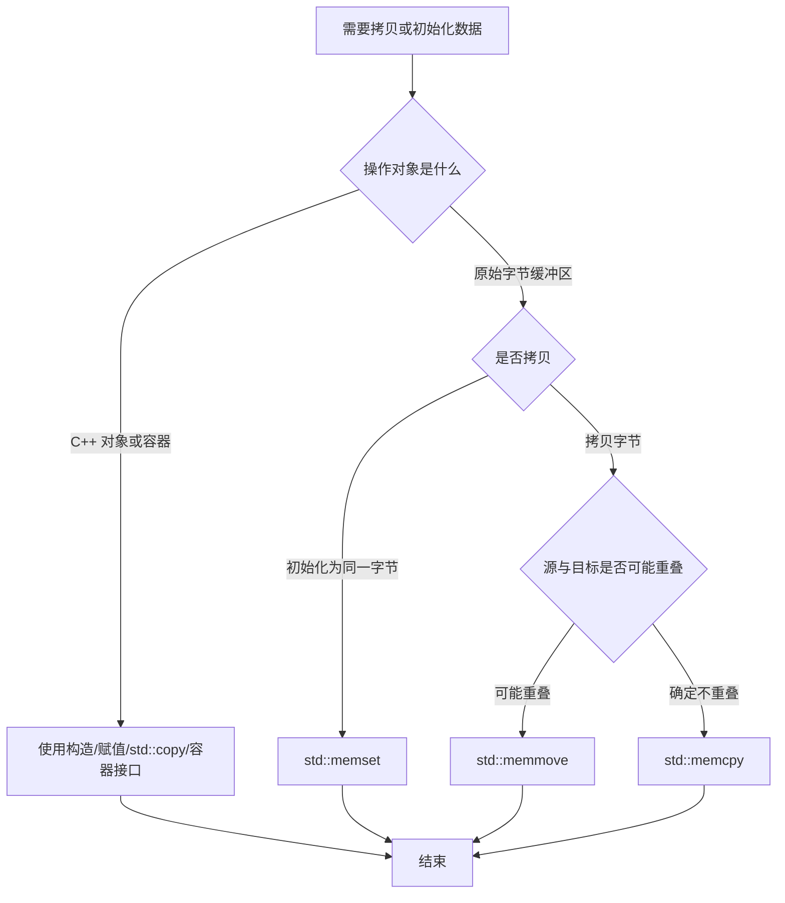

# 1. 核心原则

C 风格内存函数操作的是**字节序列**，不是 C++ 对象语义。

| 函数 | 作用 | 关键限制 |
|---|---|---|
| `std::memcpy` | 拷贝不重叠原始字节 | 源和目标重叠是未定义行为 |
| `std::memmove` | 拷贝可能重叠的原始字节 | 通常比 `memcpy` 多处理方向 |
| `std::memset` | 按字节填充值 | 不是按元素赋值 |
| `std::strcpy` | 拷贝 C 字符串 | 不检查目标容量 |
| `std::copy` | 按元素拷贝 | 遵守 C++ 对象语义 |

> [!summary]
> 对 C++ 对象优先使用构造、赋值、容器和算法；只有在确认对象适合按字节处理时，才使用 `memcpy` / `memset` 这类函数。

---

# 2. `std::memcpy`

## 2.1 函数原型

```cpp
#include <cstring>

void* std::memcpy(void* dest, const void* src, std::size_t count);
```

`count` 是字节数，不是元素个数。

```cpp
int src[3] = {1, 2, 3};
int dst[3] = {};

std::memcpy(dst, src, sizeof(src));
```

## 2.2 适用类型

`memcpy` 适合**可平凡拷贝（trivially copyable）**类型：

- 基本整数和浮点类型。
- 原始数组。
- 只包含平凡成员的简单结构体。
- 协议包、文件头、网络缓冲区等字节布局明确的数据。

```cpp
struct Point
{
    int x;
    int y;
};

Point a{1, 2};
Point b{};

std::memcpy(&b, &a, sizeof(Point));
```

## 2.3 禁止场景

```cpp
std::string a = "hello";
std::string b;

// 错误：破坏 std::string 的对象语义
std::memcpy(&b, &a, sizeof(std::string));
```

`memcpy` 只是复制对象表示中的字节，不会调用拷贝构造、赋值运算符或处理资源所有权。对 `std::string`、`std::vector` 等对象使用 `memcpy`，可能导致双重释放、资源泄漏或内部状态损坏。

---

# 3. `std::memmove`

## 3.1 与 `memcpy` 的区别

`memmove` 可以处理源区间和目标区间重叠。

| 情况 | `memcpy` | `memmove` |
|---|---|---|
| 不重叠 | 可用 | 可用 |
| 重叠 | 未定义行为 | 保证结果正确 |
| 性能 | 通常更快 | 可能略慢 |

## 3.2 重叠拷贝示例

```cpp
char buffer[] = "1234567890";

std::memmove(buffer + 2, buffer, 5);
// 结果: 1212345890
```

若目标位置位于源区间后方，安全实现会从后往前拷贝，避免尚未读取的源字节被提前覆盖。

```text
低地址 ----------------------------------> 高地址

src:  [1][2][3][4][5]
dest:       [ ][ ][ ][ ][ ]

安全方向: 从后往前
```

> [!tip]
> 不确定是否重叠时，使用 `memmove`。现代编译器在能证明不重叠时，可能把它优化成等价的快速拷贝。

---

# 4. `std::memset`

## 4.1 函数原型

```cpp
#include <cstring>

void* std::memset(void* ptr, int value, std::size_t count);
```

`value` 会转换为 `unsigned char`，然后逐字节写入。

## 4.2 按字节填充

```cpp
int arr[4];
std::memset(arr, 1, sizeof(arr));
```

这不是把每个 `int` 设置为 1，而是把每个字节设置为 `0x01`。若 `int` 为 4 字节，单个元素的字节表示可能变成：

```text
0x01 0x01 0x01 0x01
```

在常见小端机器上，这通常解释为 `16843009`。

## 4.3 合理用法

清零是 `memset` 最常见且相对安全的用途：

```cpp
int arr[4];
std::memset(arr, 0, sizeof(arr));
```

但对非平凡 C++ 对象仍应避免：

```cpp
std::string s;
// std::memset(&s, 0, sizeof(s)); // 错误
```

现代 C++ 中，初始化优先使用：

```cpp
std::vector<int> values(10, 1);
std::fill(values.begin(), values.end(), 1);
```

---

# 5. C 字符串拷贝

## 5.1 `strcpy` 的风险

```cpp
#include <cstring>

char* std::strcpy(char* dest, const char* src);
```

`strcpy` 会持续拷贝直到遇到 `'\0'`，但不会检查 `dest` 容量。若目标缓冲区不够，会造成缓冲区溢出。

## 5.2 替代方案

| 场景 | 推荐 |
|---|---|
| C++ 字符串 | `std::string` |
| 固定 C 缓冲区格式化 | `std::snprintf` |
| 已知长度字节拷贝 | `std::memcpy` / `std::copy_n` |

```cpp
char dest[10];
std::snprintf(dest, sizeof(dest), "%s", src);
```

---

# 6. `std::copy`

## 6.1 对象语义

`std::copy` 按元素执行拷贝，能够遵守类型的赋值语义。

```cpp
#include <algorithm>
#include <vector>

std::vector<std::string> src{"a", "b"};
std::vector<std::string> dst(src.size());

std::copy(src.begin(), src.end(), dst.begin());
```

对复杂对象，`std::copy` 会调用赋值运算符，而不是粗暴复制内部字节。

## 6.2 性能

对平凡连续类型，现代标准库和编译器常能把 `std::copy` 优化为类似 `memcpy` 的机器指令。因此在 C++ 代码中，不必为了性能过早放弃 `std::copy`。

```cpp
int src[] = {1, 2, 3};
int dst[3];

std::copy(std::begin(src), std::end(src), std::begin(dst));
```

---

# 7. 决策树



---

# 8. 易错点

1. **把元素个数当字节数**：`memcpy(dst, src, n)` 中 `n` 是字节数。
2. **对 `std::string` 使用 `memcpy`**：会破坏所有权和析构语义。
3. **用 `memset(arr, 1, sizeof(arr))` 初始化 int 数组**：结果不是每个元素为 1。
4. **重叠区间使用 `memcpy`**：应使用 `memmove`。
5. **直接使用 `strcpy`**：目标容量不足会溢出。

---

# 9. 总结

| 需求 | 推荐 |
|---|---|
| C++ 对象拷贝 | `std::copy`、赋值、容器接口 |
| 原始字节不重叠拷贝 | `std::memcpy` |
| 原始字节可能重叠拷贝 | `std::memmove` |
| 原始字节清零 | `std::memset(..., 0, ...)` |
| 字符串管理 | `std::string` |

> [!summary]
> 原始内存函数很快，但它们只理解字节，不理解对象。越接近业务对象，越应该使用 C++ 类型系统和 RAII；越接近分配器、协议和缓冲区，才越需要直接操作字节。
