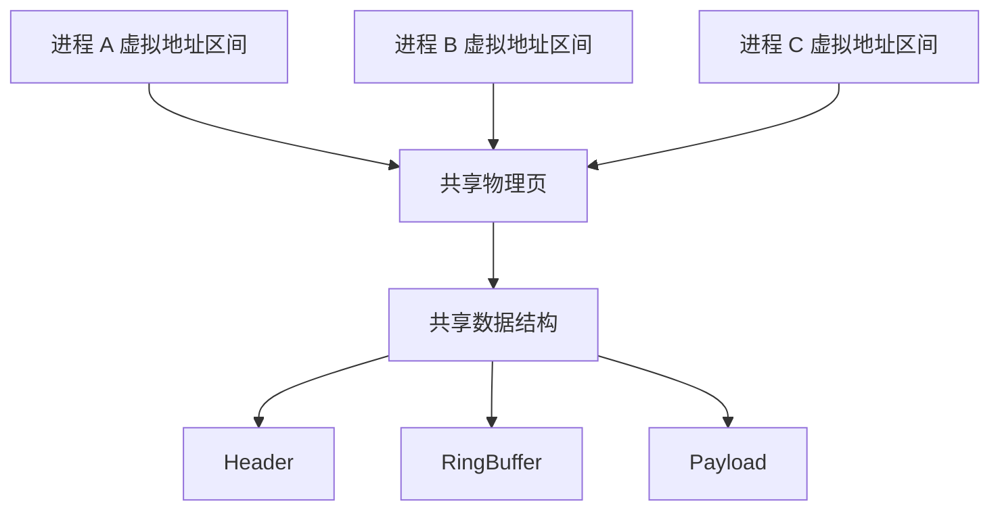
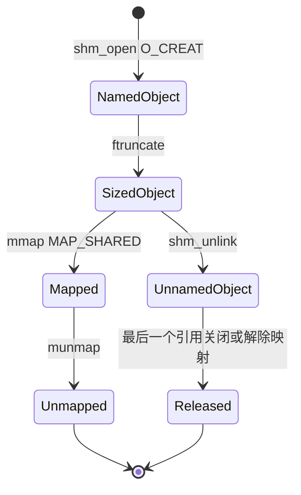
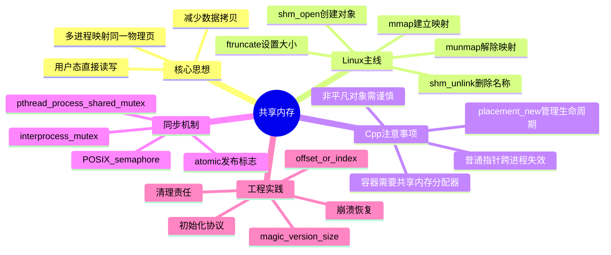

# 1. 背景与动机

## 1.1 进程间通信的拷贝成本

在 Linux 中，每个进程都有独立的虚拟地址空间。进程 A 的普通指针，默认不能被进程 B 直接访问。

因此，进程间通信（IPC）通常需要借助内核作为中转：

```text
+----------+        +----------+        +----------+
| 进程 A   | -----> |   内核   | -----> | 进程 B   |
| 用户缓冲 | copy   | 内核缓冲 | copy   | 用户缓冲 |
+----------+        +----------+        +----------+
```

以管道、消息队列、socket 为例，数据通常经历：

1. 进程 A 从用户态把数据拷贝到内核态。
2. 内核维护队列、缓冲区或协议状态。
3. 进程 B 再从内核态把数据拷贝到自己的用户态。

| IPC 方式 | 数据路径 | 特点 |
|---|---|---|
| **Pipe/FIFO** | 用户态 → 内核缓冲 → 用户态 | 简单，适合字节流 |
| **Socket** | 用户态 → 协议栈/内核缓冲 → 用户态 | 通用，可跨机器 |
| **Message Queue** | 用户态 → 内核消息队列 → 用户态 | 有消息边界 |
| **Shared Memory** | 多进程直接映射同一批物理页 | 拷贝最少，速度最快 |

> [!warning]
> 当数据量很大、通信频率很高时，IPC 的主要成本往往不是系统调用本身，而是**重复拷贝、缓存污染和内核缓冲区管理**。

## 1.2 共享内存的核心思想

> **共享内存（Shared Memory）让多个进程把同一批物理内存页映射到各自的虚拟地址空间中，从而直接读写同一份数据。**

它的核心不是“让进程共享指针”，而是：

```text
不同进程的虚拟地址
        ↓
映射到同一批物理页
        ↓
多个进程看到同一份字节
```

共享内存的主要收益：

- **减少数据拷贝**：数据不需要反复经过内核缓冲区中转。
- **吞吐高**：适合大块数据、 高频消息、图像帧、行情数据等场景。
- **延迟低**：常态读写就是普通内存访问。
- **数据结构可自定义**：可以把环形缓冲区、队列、数组、状态表放在共享区中。
- **适合多进程架构**：多个进程可共享缓存、配置、统计信息或数据平面。

> [!summary]
> 共享内存解决的是：**多个进程如何访问同一份内存字节**。它不自动解决同步、对象生命周期、跨进程指针、数据格式兼容等问题。

## 1.3 适用场景

| 场景 | 说明 |
|---|---|
| **高频 IPC** | 进程之间频繁交换消息，管道/socket 拷贝成本偏高 |
| **大块数据传输** | 图像帧、音视频缓存、矩阵、采样数据等 |
| **多进程缓存** | 多个 worker 共享只读配置、字典、模型参数 |
| **生产者/消费者队列** | 一个进程写入，另一个进程消费 |
| **实时系统** | 需要降低延迟抖动，避免内核缓冲区复制 |
| **进程隔离架构** | 保留进程隔离，同时共享性能敏感数据 |

不适合：

- 数据量很小，普通 pipe/socket 已足够简单。
- 数据结构复杂且频繁变化，版本兼容成本高。
- 需要跨机器通信。
- 进程之间信任边界很强，不能让对方直接读写内存。

> [!tip]
> 可将共享内存理解为：**多个进程各自拿到一扇门，但门后通向同一个房间**。门牌号可以不同，房间里的东西是同一份。

---

# 2. 核心概念

## 2.1 共享内存定义

> **共享内存**：一种 IPC 机制，它通过操作系统的虚拟内存映射能力，使多个进程的不同虚拟地址区间映射到同一组物理内存页，从而让这些进程直接读写同一份内存内容。

共享内存的本质是：**虚拟内存映射关系的共享，而不是 C++ 指针值的共享**。

进程 A 中的地址 `0x7f00_1000` 和进程 B 中的地址 `0x7e00_9000` 可以指向同一批物理页：

```text
进程 A 虚拟地址 0x7f00_1000  ─┐
                              ├──> 同一物理页
进程 B 虚拟地址 0x7e00_9000  ─┘
```

## 2.2 关键术语

| 术语 | 含义 |
|---|---|
| **Virtual Address Space** | 每个进程看到的独立虚拟地址空间 |
| **Physical Page** | 真实物理内存页，通常按页粒度管理 |
| **Mapping** | 虚拟地址区间到物理页或文件页的映射关系 |
| **File Descriptor** | Linux 中表示共享内存对象或文件的句柄 |
| **`mmap`** | 将文件、设备或共享内存对象映射到进程地址空间 |
| **`MAP_SHARED`** | 多个映射共享修改，对同一底层对象可见 |
| **POSIX Shared Memory** | 基于 `shm_open` 的命名共享内存对象 |
| **System V Shared Memory** | 较老的 `shmget/shmat` 风格共享内存 API |
| **Synchronization** | 互斥锁、信号量等进程间同步手段 |

## 2.3 共享内存与普通堆内存的区别

| 维度 | 普通堆内存 | 共享内存 |
|---|---|---|
| 分配方式 | `malloc/new` | `shm_open` + `ftruncate` + `mmap` |
| 可见范围 | 当前进程 | 映射同一对象的多个进程 |
| 地址稳定性 | 只在当前进程内有意义 | 每个进程映射地址可能不同 |
| 生命周期 | 跟随进程或分配器 | 跟随共享内存对象与映射关系 |
| 数据同步 | 线程内可用普通 mutex | 需要进程间同步机制 |
| C++ 对象支持 | 自然支持构造/析构 | 需要 placement new、显式生命周期管理 |

> [!warning]
> 共享内存中的内容本质是**一段字节**。C++ 对象能否安全放进去，取决于类型是否适合跨进程表示，以及是否正确管理构造、析构和同步。

## 2.4 共享内存与内存映射文件

Linux 下的共享内存与内存映射文件非常接近，底层都依赖 `mmap`。

| 类型 | 底层对象 | 常见创建方式 | 特点 |
|---|---|---|---|
| **匿名映射** | 无文件名 | `mmap(..., MAP_ANONYMOUS | MAP_SHARED, ...)` | 常用于父子进程 |
| **普通文件映射** | 文件系统中的文件 | `open` + `ftruncate` + `mmap` | 可持久化到文件 |
| **POSIX 共享内存** | 内核管理的命名对象 | `shm_open` + `ftruncate` + `mmap` | 常位于 `/dev/shm` |
| **System V 共享内存** | System V IPC 对象 | `shmget` + `shmat` | 历史悠久，接口较老 |

> [!info]
> POSIX 共享内存对象在 Linux 上通常表现为 `/dev/shm` 下的对象，但代码不应依赖具体路径，而应通过 `shm_open` 管理。

---

# 3. 原理分析

## 3.1 虚拟地址到物理页的映射

共享内存依赖操作系统的页表机制。

普通情况下，两个进程的虚拟地址空间彼此隔离：

```text
进程 A: 0x1000 -> 物理页 A
进程 B: 0x1000 -> 物理页 B
```

即使虚拟地址数值相同，也不代表访问同一份内存。

共享内存则让多个进程的某段虚拟地址映射到同一批物理页：



关键点：

- 每个进程仍然有自己的虚拟地址空间。
- 每个进程调用 `mmap` 后获得一个本进程内有效的地址。
- 这些地址数值不一定相同。
- 地址背后的物理页相同，所以写入会被其他进程看到。

> [!summary]
> 共享内存不是打破进程地址空间隔离，而是在操作系统允许的前提下，让多个地址空间拥有一段共同映射区域。

## 3.2 `MAP_SHARED` 与 `MAP_PRIVATE`

`mmap` 的关键标志之一是 `MAP_SHARED`。

| 标志 | 修改是否回写到底层对象 | 其他进程是否可见 | 典型用途 |
|---|---|---|---|
| `MAP_SHARED` | 是 | 是 | 共享内存、文件映射写入 |
| `MAP_PRIVATE` | 否，写时复制 | 否 | 加载文件、私有副本 |

对于共享内存，必须使用：

```cpp
mmap(nullptr, size, PROT_READ | PROT_WRITE, MAP_SHARED, fd, 0);
```

如果误用 `MAP_PRIVATE`，进程写入时可能触发写时复制（Copy-on-Write），其他进程看不到修改。

> [!warning]
> `MAP_SHARED` 才是共享修改的关键。`shm_open` 只是创建共享内存对象，真正把它映射进进程地址空间的是 `mmap`。

## 3.3 生命周期分层

共享内存有三层生命周期，容易混淆：

| 层级 | API | 含义 |
|---|---|---|
| **共享内存对象** | `shm_open` / `shm_unlink` | 命名对象是否存在 |
| **文件描述符** | `shm_open` / `close` | 当前进程是否持有句柄 |
| **虚拟地址映射** | `mmap` / `munmap` | 当前进程是否映射到地址空间 |

它们彼此独立：

- `close(fd)` 只关闭当前进程的文件描述符，不会取消已经建立的 `mmap` 映射。
- `munmap(addr, size)` 只取消当前进程的虚拟地址映射，不会删除共享内存对象。
- `shm_unlink(name)` 删除名字，已经打开或映射的进程仍可继续使用，直到最后引用释放。



> [!tip]
> 可以把 `shm_unlink` 理解为“删除目录项”，不是立刻拔掉所有进程脚下的内存地板。

---

# 4. Linux POSIX 共享内存 API

## 4.1 基本使用流程

POSIX 共享内存的典型流程：

```text
创建/打开共享内存对象
        |
        v
设置共享内存大小
        |
        v
映射到当前进程地址空间
        |
        v
读写共享区域
        |
        v
解除映射、关闭 fd、必要时 unlink
```

对应 API：

| 步骤 | API | 作用 |
|---|---|---|
| 创建/打开 | `shm_open` | 获得共享内存对象的文件描述符 |
| 设置大小 | `ftruncate` | 把对象扩展到指定字节数 |
| 建立映射 | `mmap` | 得到当前进程可访问的地址 |
| 解除映射 | `munmap` | 从当前进程地址空间移除映射 |
| 关闭句柄 | `close` | 关闭文件描述符 |
| 删除名字 | `shm_unlink` | 删除共享内存对象名称 |

## 4.2 创建共享内存对象

```cpp
#include <fcntl.h>
#include <sys/mman.h>
#include <sys/stat.h>
#include <unistd.h>

int fd = shm_open(
    "/demo_shm",
    O_CREAT | O_RDWR,
    0666
);

if (fd == -1) {
    // handle error
}
```

参数说明：

| 参数 | 说明 |
|---|---|
| `"/demo_shm"` | 共享内存名称，POSIX 要求通常以 `/` 开头 |
| `O_CREAT` | 不存在时创建 |
| `O_RDWR` | 可读可写打开 |
| `0666` | 权限，仍受进程 `umask` 影响 |

> [!warning]
> `shm_open` 创建的是“对象”，不是 C++ 对象。此时还没有设置大小，也没有任何地址可以直接读写。

## 4.3 设置共享内存大小

新创建的 POSIX 共享内存对象大小通常为 0，必须先设置大小：

```cpp
constexpr std::size_t kSize = 4096;

if (ftruncate(fd, kSize) == -1) {
    // handle error
}
```

`ftruncate` 的作用是把共享内存对象调整到指定大小。

| 情况 | 结果 |
|---|---|
| 新对象大小为 0 | 扩展到 `kSize` |
| 已存在对象更小 | 扩大对象 |
| 已存在对象更大 | 截断对象，可能丢失数据 |

> [!warning]
> 如果多个进程同时创建/初始化同一个共享内存对象，需要额外约定“谁负责初始化”。否则可能出现一个进程正在读，另一个进程突然 `ftruncate` 的灾难。

## 4.4 映射到进程地址空间

```cpp
void* addr = mmap(
    nullptr,
    kSize,
    PROT_READ | PROT_WRITE,
    MAP_SHARED,
    fd,
    0
);

if (addr == MAP_FAILED) {
    // handle error
}
```

参数说明：

| 参数 | 说明 |
|---|---|
| `nullptr` | 让内核自动选择映射地址 |
| `kSize` | 映射长度 |
| `PROT_READ | PROT_WRITE` | 映射区域可读可写 |
| `MAP_SHARED` | 修改对其他共享映射可见 |
| `fd` | `shm_open` 返回的文件描述符 |
| `0` | 从共享内存对象起始位置开始映射 |

映射成功后，可以把 `addr` 转成需要的结构体指针：

```cpp
struct SharedData {
    int ready;
    char message[256];
};

auto* data = static_cast<SharedData*>(addr);
```

> [!warning]
> `static_cast<SharedData*>(addr)` 只是把共享字节解释成结构体视图，不会自动构造 C++ 对象。对于非平凡类型，必须额外处理对象生命周期。

## 4.5 清理资源

```cpp
munmap(addr, kSize);
close(fd);
shm_unlink("/demo_shm");
```

三者含义不同：

| API | 作用 |
|---|---|
| `munmap(addr, kSize)` | 当前进程不再映射这段地址 |
| `close(fd)` | 当前进程关闭共享内存对象的文件描述符 |
| `shm_unlink(name)` | 删除共享内存对象的名字 |

常见策略：

- 创建者负责 `shm_unlink`。
- 所有进程都负责自己的 `munmap` 和 `close`。
- 若希望共享内存像临时文件一样自动消失，可以创建后尽早 `shm_unlink`，但其他进程必须已经有打开路径或由父进程传递 fd。

> [!summary]
> POSIX 共享内存完整路径是：**`shm_open` 拿对象 → `ftruncate` 定大小 → `mmap` 得地址 → 读写 → `munmap/close/shm_unlink` 清理**。

## 4.6 与 System V 共享内存对比

System V 共享内存使用另一套历史更久的 API：

```cpp
int shmid = shmget(key, size, IPC_CREAT | 0666);
void* addr = shmat(shmid, nullptr, 0);
shmdt(addr);
shmctl(shmid, IPC_RMID, nullptr);
```

| 维度 | POSIX Shared Memory | System V Shared Memory |
|---|---|---|
| 创建 | `shm_open` | `shmget` |
| 映射 | `mmap` | `shmat` |
| 解除映射 | `munmap` | `shmdt` |
| 删除 | `shm_unlink` | `shmctl(..., IPC_RMID, ...)` |
| 命名方式 | 字符串名称 | `key_t` |
| 风格 | 更接近文件描述符和 `mmap` | 传统 System V IPC |

教学和现代 C++ 项目中，通常优先学习 POSIX 共享内存：

- 接口与文件描述符模型一致。
- 可与 `mmap`、`ftruncate` 等 Unix API 组合。
- 更容易理解“对象 + 映射”的生命周期。

---

# 5. C++ 使用示例

## 5.1 共享结构体定义

下面示例使用一个简单结构体作为共享数据格式：

```cpp
#include <atomic>
#include <cstdint>

struct SharedBlock {
    std::atomic<std::uint32_t> ready;
    std::uint32_t length;
    char message[256];
};
```

这里选择固定大小数组，而不是 `std::string`：

```cpp
char message[256];      // 可以直接放入共享内存
std::string message;    // 不适合直接跨进程共享
```

原因是 `std::string` 内部通常持有指向进程堆内存的指针。这个指针只在创建它的进程中有意义，另一个进程即使看到同样的指针数值，也无法把它当作有效地址使用。

> [!warning]
> 共享内存示例优先使用 **trivially copyable** 或布局明确的类型：整数、定长数组、POD 风格结构体、原子标志等。

## 5.2 生产者进程

生产者创建共享内存，写入消息，然后设置 `ready` 标志。

```cpp
#include <atomic>
#include <cerrno>
#include <cstring>
#include <fcntl.h>
#include <iostream>
#include <new>
#include <sys/mman.h>
#include <sys/stat.h>
#include <unistd.h>

struct SharedBlock {
    std::atomic<std::uint32_t> ready;
    std::uint32_t length;
    char message[256];
};

int main() {
    constexpr const char* kName = "/cpp_shared_memory_demo";
    constexpr std::size_t kSize = sizeof(SharedBlock);

    int fd = shm_open(kName, O_CREAT | O_RDWR, 0666);
    if (fd == -1) {
        std::cerr << "shm_open failed: " << std::strerror(errno) << "\n";
        return 1;
    }

    if (ftruncate(fd, kSize) == -1) {
        std::cerr << "ftruncate failed: " << std::strerror(errno) << "\n";
        close(fd);
        return 1;
    }

    void* addr = mmap(
        nullptr,
        kSize,
        PROT_READ | PROT_WRITE,
        MAP_SHARED,
        fd,
        0
    );

    if (addr == MAP_FAILED) {
        std::cerr << "mmap failed: " << std::strerror(errno) << "\n";
        close(fd);
        return 1;
    }

    auto* block = new (addr) SharedBlock{};

    block->ready.store(0, std::memory_order_relaxed);

    const char* text = "hello from producer";
    std::strncpy(block->message, text, sizeof(block->message) - 1);
    block->message[sizeof(block->message) - 1] = '\0';
    block->length = static_cast<std::uint32_t>(std::strlen(block->message));

    block->ready.store(1, std::memory_order_release);

    munmap(addr, kSize);
    close(fd);

    return 0;
}
```

关键点：

- `ftruncate` 必须在 `mmap` 前设置足够大小。
- `MAP_SHARED` 让写入对其他进程可见。
- `new (addr) SharedBlock{}` 显式在共享内存中启动对象生命周期。
- `ready.store(..., memory_order_release)` 表示消息内容写完后再发布标志。
- 示例没有调用 `shm_unlink`，方便消费者稍后打开；真实项目中应有明确清理者。

## 5.3 消费者进程

消费者打开同名共享内存，等待 `ready` 后读取消息。

```cpp
#include <atomic>
#include <cerrno>
#include <cstring>
#include <fcntl.h>
#include <iostream>
#include <sys/mman.h>
#include <sys/stat.h>
#include <thread>
#include <unistd.h>

struct SharedBlock {
    std::atomic<std::uint32_t> ready;
    std::uint32_t length;
    char message[256];
};

int main() {
    constexpr const char* kName = "/cpp_shared_memory_demo";
    constexpr std::size_t kSize = sizeof(SharedBlock);

    int fd = shm_open(kName, O_RDWR, 0666);
    if (fd == -1) {
        std::cerr << "shm_open failed: " << std::strerror(errno) << "\n";
        return 1;
    }

    void* addr = mmap(
        nullptr,
        kSize,
        PROT_READ | PROT_WRITE,
        MAP_SHARED,
        fd,
        0
    );

    if (addr == MAP_FAILED) {
        std::cerr << "mmap failed: " << std::strerror(errno) << "\n";
        close(fd);
        return 1;
    }

    auto* block = static_cast<SharedBlock*>(addr);

    while (block->ready.load(std::memory_order_acquire) == 0) {
        std::this_thread::yield();
    }

    std::cout << "message: " << block->message << "\n";
    std::cout << "length : " << block->length << "\n";

    munmap(addr, kSize);
    close(fd);
    shm_unlink(kName);

    return 0;
}
```

`memory_order_acquire` 与生产者的 `memory_order_release` 配合，确保消费者看到 `ready == 1` 后，也能看到此前写入的 `message` 和 `length`。

> [!warning]
> 这个示例只演示最小数据发布流程，不是完整消息队列。忙等会浪费 CPU，生产环境通常会使用进程间 mutex、condition variable、semaphore、futex 或事件通知机制。

## 5.4 编译方式

在 Linux 上可使用：

```bash
g++ -std=c++20 producer.cpp -o producer -pthread
g++ -std=c++20 consumer.cpp -o consumer -pthread
```

较老系统可能还需要显式链接实时库：

```bash
g++ -std=c++17 producer.cpp -o producer -pthread -lrt
g++ -std=c++17 consumer.cpp -o consumer -pthread -lrt
```

运行顺序：

```bash
./producer
./consumer
```

> [!info]
> `-lrt` 是否需要取决于系统和 glibc 版本。现代 Linux 上很多 POSIX realtime API 已合并到 libc 中，但学习时知道这个历史差异很有用。

---

# 6. 同步机制

## 6.1 共享内存不等于线程安全

共享内存只解决“多个进程能看到同一份字节”，不解决“谁先读、谁先写、写到一半怎么办”。

如果两个进程同时写同一字段：

```text
进程 A 写 counter
进程 B 写 counter
        |
        v
数据竞争、丢失更新、读到半更新状态
```

常见同步需求：

| 需求 | 示例 |
|---|---|
| **互斥访问** | 同一时刻只有一个进程修改共享结构 |
| **发布/订阅顺序** | 写完数据后再通知读者 |
| **生产者/消费者等待** | 队列空时消费者睡眠，队列满时生产者等待 |
| **初始化一次** | 多进程中只有一个进程负责构造共享对象 |
| **崩溃恢复** | 持锁进程崩溃后其他进程如何处理 |

> [!summary]
> 共享内存负责数据通道，同步机制负责访问规则。没有同步的共享内存，本质上只是多人同时编辑同一块字节。

## 6.2 进程间 `pthread_mutex`

普通 `std::mutex` 不能直接用于进程间同步。Linux 下可以使用带 `PTHREAD_PROCESS_SHARED` 属性的 `pthread_mutex_t`。

```cpp
#include <pthread.h>

struct SharedState {
    pthread_mutex_t mutex;
    int counter;
};

void init_mutex(SharedState* state) {
    pthread_mutexattr_t attr;
    pthread_mutexattr_init(&attr);
    pthread_mutexattr_setpshared(&attr, PTHREAD_PROCESS_SHARED);

    pthread_mutex_init(&state->mutex, &attr);

    pthread_mutexattr_destroy(&attr);
}
```

使用：

```cpp
pthread_mutex_lock(&state->mutex);
++state->counter;
pthread_mutex_unlock(&state->mutex);
```

需要注意：

- `pthread_mutex_t` 本身必须放在共享内存中。
- 初始化必须只做一次。
- 若进程可能在持锁时崩溃，应考虑 robust mutex。

> [!warning]
> `pthread_mutex_init` 不能被多个进程反复对同一块内存调用。共享内存初始化通常需要额外的“创建者协议”或文件锁保护。

## 6.3 POSIX 信号量

POSIX semaphore 适合表达计数资源、生产者/消费者通知。

命名信号量：

```cpp
#include <fcntl.h>
#include <semaphore.h>
#include <sys/stat.h>

sem_t* sem = sem_open("/demo_sem", O_CREAT, 0666, 0);

// 生产者：发布一个消息
sem_post(sem);

// 消费者：等待一个消息
sem_wait(sem);

sem_close(sem);
sem_unlink("/demo_sem");
```

共享内存 + 信号量的常见组合：

```text
共享内存：存放数据
信号量：通知数据可读/空间可写
互斥锁：保护共享数据结构元信息
```

## 6.4 原子变量的边界

`std::atomic<T>` 可以用于共享内存中的简单标志或计数，但要谨慎：

| 问题 | 说明 |
|---|---|
| 类型必须 lock-free 吗 | 不一定，但非 lock-free 实现是否适合跨进程依赖标准库实现 |
| 只解决单变量原子性 | 多字段一致性仍需要锁或协议 |
| 不提供睡眠等待 | 忙等会浪费 CPU |
| ABI 与平台相关 | 不同编译器/标准库混用要谨慎 |

示例中的 `ready` 适合用原子变量，是因为它只是一个发布标志。

> [!tip]
> 原子变量适合做轻量标志、序号、ring buffer 下标；复杂共享结构仍优先使用明确的进程间锁或成熟队列实现。

---

# 7. C++ 对象与共享内存

## 7.1 为什么普通指针不能跨进程

假设进程 A 在共享内存中写入一个指针：

```cpp
struct BadSharedData {
    char* ptr;
};
```

进程 A 中：

```text
ptr = 0x7f00abcd
```

这个地址只在进程 A 的虚拟地址空间中有意义。进程 B 读取到同样的数值 `0x7f00abcd` 时，它可能：

- 没有映射任何内存。
- 映射到完全不同的对象。
- 触发段错误。
- 更糟糕：恰好可访问但语义错误。


> [!warning]
> 共享内存中不要保存普通进程内指针。保存**偏移量 offset**、索引、句柄，或使用 Boost.Interprocess 的 `offset_ptr`。

## 7.2 使用偏移量表达引用关系

共享内存内部的引用关系可以用相对偏移表示：

```cpp
#include <cstddef>
#include <cstdint>

struct SharedNode {
    std::int32_t value;
    std::uint32_t next_offset;
};
```

访问时用共享内存基地址加偏移：

```cpp
template <typename T>
T* ptr_from_offset(void* base, std::uint32_t offset) {
    if (offset == 0) {
        return nullptr;
    }

    auto* bytes = static_cast<unsigned char*>(base);
    return reinterpret_cast<T*>(bytes + offset);
}
```

相对偏移的好处：

- 不依赖各进程的 `mmap` 返回地址。
- 可序列化、可检查。
- 适合构建共享链表、树、数组、队列。

缺点：

- 写起来比普通指针麻烦。
- 要处理对齐、越界、空值编码。
- 数据结构移动或扩容时要维护偏移关系。

## 7.3 非平凡 C++ 对象的问题

以下类型不适合直接作为共享内存结构字段：

| 类型 | 问题 |
|---|---|
| `std::string` | 内部指针指向进程私有堆 |
| `std::vector` | 元素缓冲区默认在进程私有堆 |
| `std::map` | 节点默认从进程私有分配器申请 |
| 含虚函数的类 | vptr 指向当前进程的虚表地址 |
| 含文件描述符封装的对象 | fd 是进程资源，语义需要额外约定 |
| 含 mutex 的普通对象 | 普通 mutex 默认只适用于进程内线程 |

共享内存中的 C++ 类型应优先满足：

- 布局固定。
- 不含普通裸指针。
- 不依赖进程私有堆。
- 不依赖虚函数表地址。
- 构造和析构流程明确。
- 多进程访问协议明确。

> [!summary]
> 能放进共享内存的不是“任意 C++ 对象”，而是**跨进程表示稳定的数据结构**。

## 7.4 Placement New 与显式析构

如果确实要在共享内存中构造 C++ 对象，应使用 placement new：

```cpp
#include <new>

struct SharedHeader {
    std::uint32_t magic;
    std::uint32_t version;
};

void construct_header(void* addr) {
    new (addr) SharedHeader{0x12345678, 1};
}
```

析构时显式调用析构函数：

```cpp
auto* header = static_cast<SharedHeader*>(addr);
header->~SharedHeader();
```

但这只解决“对象生命周期”问题，不解决：

- 指针成员是否跨进程有效。
- 标准库容器是否使用共享内存分配器。
- 多进程是否重复构造同一对象。
- 析构时是否还有其他进程正在访问。

> [!warning]
> 在共享内存中使用 placement new，比在对象池中更危险：对象池通常只有一个进程管理生命周期，而共享内存可能有多个进程同时认为自己是初始化者。

## 7.5 版本与 ABI 兼容

共享内存结构可能被多个不同版本的程序同时访问，因此结构体布局要稳定。

推荐在共享区头部放元信息：

```cpp
struct SharedHeader {
    std::uint32_t magic;
    std::uint32_t version;
    std::uint32_t total_size;
    std::uint32_t header_size;
};
```

作用：

| 字段 | 用途 |
|---|---|
| `magic` | 判断是否是预期共享内存 |
| `version` | 判断结构版本 |
| `total_size` | 判断映射大小是否匹配 |
| `header_size` | 允许未来扩展头部 |

> [!tip]
> 共享内存格式要像网络协议一样对待：一旦多个进程依赖它，就不能随意改字段顺序、类型大小和对齐方式。

---

# 8. 第三方库：Boost.Interprocess

## 8.1 为什么需要第三方库

直接使用 Linux API 可以理解原理，但工程上会遇到很多重复问题：

- 共享内存对象创建与清理。
- 映射区域管理。
- 在共享内存中分配对象。
- 容器使用共享内存分配器。
- 相对指针。
- 进程间 mutex/condition/semaphore。
- 异常安全与 RAII。

Boost.Interprocess 对这些问题提供了 C++ 风格封装。

> [!summary]
> Linux API 负责“把内存共享起来”；Boost.Interprocess 进一步帮助 C++ 管理“共享内存里的对象、容器、分配器和同步原语”。

## 8.2 `shared_memory_object` 与 `mapped_region`

Boost 对 POSIX 风格共享内存做了 RAII 封装：

```cpp
#include <boost/interprocess/mapped_region.hpp>
#include <boost/interprocess/shared_memory_object.hpp>
#include <cstring>
#include <iostream>

namespace bip = boost::interprocess;

int main() {
    bip::shared_memory_object shm(
        bip::create_only,
        "boost_demo_shm",
        bip::read_write
    );

    shm.truncate(4096);

    bip::mapped_region region(
        shm,
        bip::read_write
    );

    void* addr = region.get_address();
    std::size_t size = region.get_size();

    std::memset(addr, 0, size);

    bip::shared_memory_object::remove("boost_demo_shm");
}
```

对应关系：

| Linux API | Boost.Interprocess |
|---|---|
| `shm_open` | `shared_memory_object` |
| `ftruncate` | `truncate` |
| `mmap` | `mapped_region` |
| `munmap` | `mapped_region` 析构 |
| `shm_unlink` | `shared_memory_object::remove` |

## 8.3 `managed_shared_memory`

`managed_shared_memory` 是 Boost.Interprocess 更常用的高级封装。它在共享内存中内置一个段管理器，可以按名字构造、查找、销毁对象。

```cpp
#include <boost/interprocess/managed_shared_memory.hpp>
#include <iostream>

namespace bip = boost::interprocess;

struct SharedCounter {
    int value;
};

int main() {
    bip::shared_memory_object::remove("managed_demo");

    bip::managed_shared_memory segment(
        bip::create_only,
        "managed_demo",
        65536
    );

    SharedCounter* counter = segment.construct<SharedCounter>("counter")();
    counter->value = 42;

    SharedCounter* found = segment.find<SharedCounter>("counter").first;
    if (found) {
        std::cout << found->value << "\n";
    }

    segment.destroy<SharedCounter>("counter");
    bip::shared_memory_object::remove("managed_demo");
}
```

核心接口：

| 接口 | 作用 |
|---|---|
| `create_only` | 只创建，不允许已存在 |
| `open_only` | 只打开已存在 |
| `open_or_create` | 存在则打开，不存在则创建 |
| `segment.construct<T>("name")(args...)` | 在共享内存中按名字构造对象 |
| `segment.find<T>("name")` | 查找命名对象 |
| `segment.destroy<T>("name")` | 销毁命名对象 |

> [!warning]
> `open_or_create` 很方便，但也容易隐藏初始化竞争。多个进程同时启动时，仍要设计“谁负责第一次初始化”的协议。

## 8.4 共享内存中的 STL 风格容器

普通 `std::vector<int>` 不适合直接放进共享内存，因为它的元素缓冲区默认从当前进程堆分配。

Boost.Interprocess 提供共享内存分配器：

```cpp
#include <boost/interprocess/allocators/allocator.hpp>
#include <boost/interprocess/containers/vector.hpp>
#include <boost/interprocess/managed_shared_memory.hpp>

namespace bip = boost::interprocess;

using Segment = bip::managed_shared_memory;
using Manager = Segment::segment_manager;
using IntAllocator = bip::allocator<int, Manager>;
using SharedVector = bip::vector<int, IntAllocator>;

int main() {
    bip::shared_memory_object::remove("vector_demo");

    Segment segment(bip::create_only, "vector_demo", 65536);

    IntAllocator alloc(segment.get_segment_manager());

    SharedVector* vec = segment.construct<SharedVector>("numbers")(alloc);

    vec->push_back(10);
    vec->push_back(20);
    vec->push_back(30);

    segment.destroy<SharedVector>("numbers");
    bip::shared_memory_object::remove("vector_demo");
}
```

关键点：

- 容器对象本身在共享内存中。
- 容器内部节点或数组也必须通过共享内存分配器申请。
- 不能用普通 STL 容器默认 allocator。

> [!tip]
> 判断一个容器能否放进共享内存，关键看它的“内部动态内存从哪里来”。只要还从进程私有堆来，另一个进程就无法安全访问。

## 8.5 `interprocess_mutex`

Boost 也提供进程间同步原语：

```cpp
#include <boost/interprocess/managed_shared_memory.hpp>
#include <boost/interprocess/sync/interprocess_mutex.hpp>
#include <boost/interprocess/sync/scoped_lock.hpp>

namespace bip = boost::interprocess;

struct SharedState {
    bip::interprocess_mutex mutex;
    int counter;
};

int main() {
    bip::managed_shared_memory segment(
        bip::open_or_create,
        "mutex_demo",
        65536
    );

    SharedState* state =
        segment.find_or_construct<SharedState>("state")();

    bip::scoped_lock<bip::interprocess_mutex> lock(state->mutex);
    ++state->counter;
}
```

这比手写 `pthread_mutexattr_setpshared` 更贴近 C++ RAII 风格。

## 8.6 `offset_ptr`

Boost.Interprocess 的 `offset_ptr` 用相对偏移表达指针关系：

```cpp
#include <boost/interprocess/offset_ptr.hpp>

struct Node {
    int value;
    boost::interprocess::offset_ptr<Node> next;
};
```

它解决的问题：

```text
普通指针：保存绝对虚拟地址，跨进程失效
offset_ptr：保存相对偏移，不依赖映射基址
```

适用：

- 共享链表。
- 共享树结构。
- 共享对象图。
- 自定义共享内存分配器内部结构。

> [!summary]
> Boost.Interprocess 的核心价值在于：让 C++ 代码显式使用**共享内存分配器、进程间同步原语和相对指针**，避免误把进程内对象模型直接搬进共享内存。

---

# 9. 易错点与最佳实践

## 9.1 易错点

| # | 陷阱 | 后果 | 规避 |
|---|---|---|---|
| 1 | **忘记 `ftruncate`** | `mmap` 后访问可能触发错误或无有效空间 | 创建后先设置大小 |
| 2 | **误用 `MAP_PRIVATE`** | 写入不对其他进程可见 | 使用 `MAP_SHARED` |
| 3 | **忘记同步** | 数据竞争、读到半写入状态 | 使用进程间 mutex/semaphore/原子协议 |
| 4 | **共享普通指针** | 其他进程中地址无效 | 使用 offset、索引、句柄或 `offset_ptr` |
| 5 | **直接放 `std::string`/`std::vector`** | 内部指向进程私有堆 | 使用定长数组或共享内存 allocator |
| 6 | **重复初始化共享对象** | 对象状态被覆盖，锁被重新初始化 | 设计创建者协议和版本标记 |
| 7 | **忘记 `shm_unlink`** | `/dev/shm` 残留对象 | 明确清理责任，启动时清理旧对象 |
| 8 | **结构体版本不兼容** | 新旧进程解释同一内存出错 | 添加 magic/version/size |
| 9 | **大小扩展不协调** | 进程映射长度不一致 | 约定固定布局或停机升级 |
| 10 | **持锁进程崩溃** | 其他进程永久阻塞 | 考虑 robust mutex、超时和恢复策略 |

## 9.2 最佳实践

1. **先定义共享内存格式**：像设计网络协议一样设计 header、version、size、字段对齐。
2. **共享简单数据优先**：优先使用整数、定长数组、偏移量、环形缓冲区。
3. **明确初始化者**：用 `O_CREAT | O_EXCL`、文件锁、命名信号量或 Boost 的创建模式区分创建与打开。
4. **同步协议写进结构设计**：不要事后补锁；队列下标、状态位、锁和信号量应一起设计。
5. **避免普通指针和默认 allocator**：跨进程引用用 offset，容器用共享内存分配器。
6. **清理责任明确**：谁创建、谁 unlink；所有进程各自 `munmap` 和 `close`。
7. **加调试标记**：magic、version、owner pid、sequence、checksum 可以显著降低排错成本。
8. **处理异常退出**：考虑进程崩溃、持锁死亡、半初始化共享区、旧对象残留。
9. **权限最小化**：不要随手 `0666` 用到生产环境，应根据用户、组和部署环境设置权限。
10. **复杂 C++ 对象交给成熟库**：需要共享容器、对象图、分配器时优先使用 Boost.Interprocess。

## 9.3 共享内存设计模板

一个比较稳妥的共享区布局：

```text
+-----------------------------+
| SharedHeader                |
| - magic                     |
| - version                   |
| - total_size                |
| - initialized               |
| - mutex / sequence          |
+-----------------------------+
| Metadata                    |
| - read_index                |
| - write_index               |
| - capacity                  |
+-----------------------------+
| Data Region                 |
| - slots / payload / offsets |
+-----------------------------+
```

对应原则：

- Header 负责识别和版本控制。
- Metadata 负责共享结构的状态。
- Data Region 存放真正数据。
- 所有跨区域引用都用 offset 或 index。

> [!tip]
> 好的共享内存设计不是“把类塞进去”，而是“设计一份跨进程可解释的内存格式”。

---

# 10. 总结



- 共享内存本质是：**多个进程把不同虚拟地址映射到同一批物理页**。
- Linux POSIX 共享内存主流程是：`shm_open` → `ftruncate` → `mmap` → 读写 → `munmap`/`close`/`shm_unlink`。
- `MAP_SHARED` 决定修改是否对其他映射可见；误用 `MAP_PRIVATE` 会破坏共享语义。
- 共享内存只共享字节，不自动提供同步；多进程访问必须设计互斥、通知和内存可见性协议。
- C++ 对象不能随便搬进共享内存：普通指针、默认 STL 容器、虚函数对象、进程私有资源都可能失效。
- 简单共享数据可直接使用 Linux API；复杂对象、容器和同步建议使用 Boost.Interprocess。

> [!note]
> 进一步学习：可以继续研究 `mmap` 文件映射、Linux page cache、futex、lock-free ring buffer、Boost.Interprocess 段管理器，以及数据库/浏览器等大型系统中的多进程共享内存设计。
