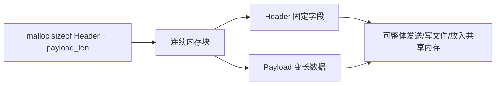
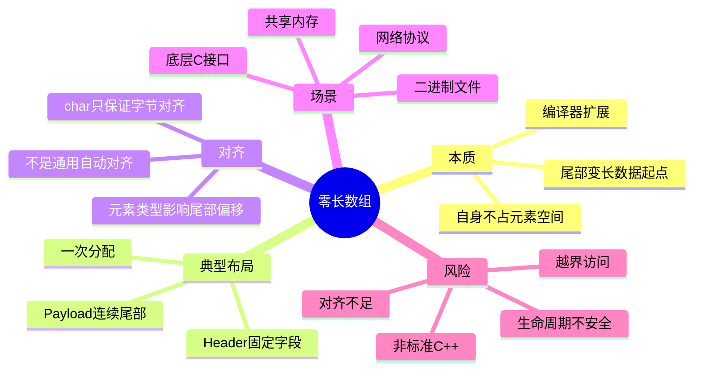

# 1. 背景与动机

## 1.1 固定头部与变长数据

在网络协议、二进制文件、共享内存、游戏消息包等场景中，经常会遇到一种典型数据布局：

```text
+------------------+----------------------+
| 固定大小的 Header | 变长 Payload 数据   |
+------------------+----------------------+
```

例如一条网络消息可能包含：

| 字段 | 说明 |
|---|---|
| `type` | 消息类型，固定大小 |
| `length` | 负载长度，固定大小 |
| `payload` | 真实消息内容，长度运行期才知道 |

如果使用普通指针：

```cpp
struct Message {
    int type;
    int length;
    char* payload;
};
```

通常会形成两块内存：

```text
+-------------------------+          +-------------------+
| Message 对象            | ----->   | payload 数据      |
+-------------------------+          +-------------------+
```

这种方式灵活，但有几个代价：

| 问题 | 说明 |
|---|---|
| **至少两次分配** | Header 一块，Payload 一块 |
| **内存不连续** | 不利于缓存，也不适合直接序列化 |
| **额外指针开销** | 结构体中需要保存一个指针 |
| **共享内存不友好** | 指针只在当前进程地址空间有意义 |

## 1.2 零长数组的核心思想

零长数组常写在结构体最后：

```cpp
struct Message {
    int type;
    int length;
    char payload[0];
};
```

它的核心作用是：

> **在结构体尾部提供一个“变长数据的起始位置”，数组本身不占用元素存储空间。**

于是可以一次性分配：

```text
sizeof(Message) + payload_length
```

得到一整块连续内存：

```text
+----------+------------+----------------------------+
| type     | length     | payload 实际数据           |
+----------+------------+----------------------------+
                        ^
                      payload[0] 指向的尾部起点
```

> [!warning]
> 零长数组是 GCC/Clang 等编译器支持的扩展，**不是标准 C++ 语法**。如果要编写可移植 C++，应优先考虑 `std::vector`、`std::string`、显式 buffer 或标准布局 Header + 字节数组方案。

---

# 2. 核心概念

## 2.1 定义

**零长数组（Zero Length Array）**指数组长度为 `0` 的成员：

```cpp
struct Packet {
    unsigned int length;
    unsigned char data[0];
};
```

它通常具有以下特点：

| 特点 | 说明 |
|---|---|
| **数组元素个数为 0** | 不为数组元素本身预留空间 |
| **通常放在结构体最后** | 用作尾部变长数据起点 |
| **影响结构体布局** | 元素类型可能影响尾部起点的对齐 |
| **非标准 C++** | 依赖编译器扩展，不保证跨编译器可用 |

## 2.2 与普通数组的区别

```cpp
struct A {
    int len;
    char data[8];
};

struct B {
    int len;
    char data[0];
};
```

| 结构 | `data` 是否占元素空间 | 典型含义 |
|---|---|---|
| `char data[8]` | 是，占 8 字节 | 固定长度数组 |
| `char data[0]` | 否，占 0 个元素空间 | 尾部变长数据起点 |

`data[0]` 的重点不是“能存 0 个元素”，而是给尾部数据提供一个具名入口：

```cpp
packet->data[i]
```

这比手动写地址偏移更直观：

```cpp
reinterpret_cast<char*>(packet) + sizeof(Packet)
```

## 2.3 与 C99 柔性数组成员的区别

C99 支持柔性数组成员：

```c
struct Packet {
    unsigned int length;
    unsigned char data[];
};
```

但在 C++ 中：

| 写法 | 标准 C | 标准 C++ | 说明 |
|---|---|---|---|
| `char data[0];` | 常见编译器扩展 | 常见编译器扩展 | GCC/Clang 常支持 |
| `char data[];` | C99 标准 | 非标准 C++ | GCC/Clang 在 C++ 中也可能作为扩展支持 |
| `std::vector<char>` | 不适用 | 标准 C++ | 更安全、更可移植 |

> [!tip]
> 记忆方式：**C99 有柔性数组成员，C++ 标准没有；零长数组更是编译器扩展。**

---

# 3. 内存布局

## 3.1 结构体尾部布局

以如下结构为例：

```cpp
struct Message {
    unsigned int type;
    unsigned int length;
    char payload[0];
};
```

在常见平台上，`sizeof(Message)` 通常只包含两个 `unsigned int`：

```text
+----------------+----------------+----------------------+
| type           | length         | 额外分配的 payload   |
| 4 bytes        | 4 bytes        | N bytes              |
+----------------+----------------+----------------------+
                                  ^
                                  msg->payload
```

如果只分配：

```cpp
std::malloc(sizeof(Message));
```

那么 `payload` 后面没有任何可用空间。

如果分配：

```cpp
std::malloc(sizeof(Message) + payload_length);
```

则 `payload` 可以访问后面额外申请出来的那段内存。

## 3.2 一次分配的优势



优势：

| 优势 | 说明 |
|---|---|
| **一次分配** | 降低分配器调用次数 |
| **内存连续** | Cache 友好，也适合网络/磁盘 I/O |
| **无内部指针** | 适合共享内存和二进制序列化 |
| **结构清晰** | Header 与 Payload 的关系直接体现在布局上 |

## 3.3 与指针成员的布局对比

```text
指针成员方式：

+-------------------+       +----------------------+
| type              |       | payload data         |
| length            | ----> | ...                  |
| payload pointer   |       +----------------------+
+-------------------+


零长数组方式：

+-------------------+----------------------+
| type              | payload data         |
| length            | ...                  |
+-------------------+----------------------+
```

> [!summary]
> 零长数组真正解决的问题不是“数组长度为 0”，而是让**固定头部 + 变长尾部**在一块连续内存中自然表达出来。

---

# 4. 代码示例一

## 4.1 网络消息包

> [!warning]
> 下面示例使用 `char payload[0]`，需要 GCC/Clang 的 GNU 扩展。可使用 `g++ -std=gnu++17 demo.cpp -o demo` 编译。

```cpp
#include <cstdlib>
#include <cstring>
#include <iostream>
#include <new>

// Message 表示一个“固定头部 + 变长正文”的消息包。
//
// 注意：
// 1. payload[0] 是编译器扩展，不是标准 C++。
// 2. payload 必须放在结构体最后，表示尾部变长数据的起点。
// 3. payload 本身不负责分配空间，空间来自 malloc 时额外申请的字节。
struct Message {
    unsigned int type;    // 固定字段：消息类型
    unsigned int length;  // 固定字段：payload 的字节数
    char payload[0];      // 变长数据起点，不占元素存储空间
};

int main() {
    const char* text = "hello zero length array";

    // strlen 不包含字符串结尾的 '\0'。
    // 这里 +1 是为了把 '\0' 也复制进 payload，使它能作为 C 字符串打印。
    const std::size_t payload_len = std::strlen(text) + 1;

    // 总大小 = 固定头部大小 + 运行期才知道的 payload 大小。
    //
    // sizeof(Message) 通常只包含 type 和 length，
    // 不包含 payload 的元素空间。
    const std::size_t total_size = sizeof(Message) + payload_len;

    void* raw = std::malloc(total_size);
    if (!raw) {
        std::cerr << "malloc failed\n";
        return 1;
    }

    // malloc 返回的是原始内存。
    // Message 是平凡类型，这里直接转换后写字段即可。
    Message* msg = static_cast<Message*>(raw);

    msg->type = 1001;
    msg->length = static_cast<unsigned int>(payload_len);

    // 把正文复制到结构体尾部额外申请的空间中。
    std::memcpy(msg->payload, text, payload_len);

    std::cout << "sizeof(Message) = " << sizeof(Message) << '\n';
    std::cout << "total_size      = " << total_size << '\n';
    std::cout << "type            = " << msg->type << '\n';
    std::cout << "length          = " << msg->length << '\n';
    std::cout << "payload         = " << msg->payload << '\n';

    // 验证 payload 的地址正好位于 Message 头部之后。
    const char* base = reinterpret_cast<const char*>(msg);
    const char* payload = reinterpret_cast<const char*>(msg->payload);

    std::cout << "payload offset  = " << (payload - base) << '\n';

    std::free(raw);
    return 0;
}
```

## 4.2 代码解析

关键语句是：

```cpp
const std::size_t total_size = sizeof(Message) + payload_len;
```

它把内存分成两部分：

| 区域 | 大小 | 用途 |
|---|---:|---|
| `sizeof(Message)` | 固定 | 保存 `type`、`length` 等 Header 字段 |
| `payload_len` | 运行期决定 | 保存变长正文 |

对应布局：

```text
msg
 |
 v
+----------------+----------------+-----------------------------+
| type           | length         | payload bytes               |
+----------------+----------------+-----------------------------+
                                  ^
                                  msg->payload
```

> [!warning]
> 如果忘记额外申请 `payload_len` 字节，只写 `std::malloc(sizeof(Message))`，那么 `msg->payload[0]` 就是越界访问。

---

# 5. 零长数组与对齐

## 5.1 零长数组不是通用自动对齐工具

一个常见误解是：

> 零长数组可以实现自动对齐。

更准确的说法是：

> **零长数组本身不是通用对齐机制；但零长数组的元素类型可能影响结构体尾部起点的对齐。**

例如：

```cpp
struct A {
    char tag;
    int data[0];
};
```

`data` 的元素类型是 `int`。如果 `int` 要求 4 字节对齐，编译器通常会在 `tag` 后插入 padding，使 `data` 的起点满足 `int` 对齐：

```text
+------+------------------+----------------+
| tag  | padding          | data 起点      |
| 1B   | 3B               | offset 4       |
+------+------------------+----------------+
```

因此 `sizeof(A)` 可能是 `4`，而不是 `1`。

## 5.2 可运行代码：观察尾部起点对齐

> [!warning]
> 下面代码同样依赖 GCC/Clang 的零长数组扩展。不同平台的输出可能不同，但规律是一致的：元素类型的对齐要求会影响尾部数组成员的偏移。

```cpp
#include <cstddef>
#include <iostream>

struct CharTail {
    char tag;
    char data[0];     // char 对齐通常是 1
};

struct IntTail {
    char tag;
    int data[0];      // int 对齐通常是 4
};

struct DoubleTail {
    char tag;
    double data[0];   // double 对齐通常是 8
};

template <typename T>
void print_layout(const char* name, std::size_t data_offset) {
    std::cout << name << '\n';
    std::cout << "  sizeof      = " << sizeof(T) << '\n';
    std::cout << "  alignof     = " << alignof(T) << '\n';
    std::cout << "  data offset = " << data_offset << '\n';
    std::cout << '\n';
}

int main() {
    // offsetof 可以观察 data 成员在结构体中的偏移。
    // 对零长数组来说，这个偏移就是尾部变长数据的起始位置。
    print_layout<CharTail>("CharTail", offsetof(CharTail, data));
    print_layout<IntTail>("IntTail", offsetof(IntTail, data));
    print_layout<DoubleTail>("DoubleTail", offsetof(DoubleTail, data));

    return 0;
}
```

可能输出：

```text
CharTail
  sizeof      = 1
  alignof     = 1
  data offset = 1

IntTail
  sizeof      = 4
  alignof     = 4
  data offset = 4

DoubleTail
  sizeof      = 8
  alignof     = 8
  data offset = 8
```

## 5.3 对齐的准确理解

| 写法 | 尾部数据通常满足的对齐 | 适合存放 |
|---|---|---|
| `char data[0];` | `char` 对齐，通常 1 字节 | 字节流、字符串、序列化数据 |
| `int data[0];` | `int` 对齐 | `int` 数组 |
| `double data[0];` | `double` 对齐 | `double` 数组 |

因此，如果尾部实际要存放 `int`，更合理的写法是：

```cpp
struct IntBlock {
    unsigned int count;
    int values[0];
};
```

而不是：

```cpp
struct BadBlock {
    unsigned int count;
    char values[0];
};
```

然后再强转：

```cpp
int* p = reinterpret_cast<int*>(block->values);
```

后者的风险在于：`char values[0]` 只表达字节起点，不表达 `int` 的对齐要求。

> [!summary]
> 零长数组可以“顺带”让尾部起点按元素类型对齐，但它不是任意类型的自动对齐器。尾部要存什么类型，零长数组就应该声明成接近真实用途的元素类型。

---

# 6. 代码示例二

## 6.1 变长整数数组

下面示例展示 `int values[0]` 如何表达“固定头部 + 变长 `int` 数组”。

```cpp
#include <cstdlib>
#include <iostream>

// IntArrayBlock 表示：
//   头部：count，记录后面有多少个 int
//   尾部：values，实际 int 数据，数量由运行期决定
struct IntArrayBlock {
    unsigned int count;
    int values[0];
};

int main() {
    const unsigned int count = 5;

    // 因为 values 的元素类型是 int，
    // sizeof(IntArrayBlock) 通常会让 values 的起点满足 int 对齐。
    const std::size_t total_size =
        sizeof(IntArrayBlock) + sizeof(int) * count;

    void* raw = std::malloc(total_size);
    if (!raw) {
        std::cerr << "malloc failed\n";
        return 1;
    }

    IntArrayBlock* block = static_cast<IntArrayBlock*>(raw);
    block->count = count;

    // values[0] 到 values[count - 1] 位于额外申请的尾部空间中。
    for (unsigned int i = 0; i < block->count; ++i) {
        block->values[i] = static_cast<int>((i + 1) * 10);
    }

    std::cout << "sizeof(IntArrayBlock) = "
              << sizeof(IntArrayBlock) << '\n';
    std::cout << "count                 = "
              << block->count << '\n';

    for (unsigned int i = 0; i < block->count; ++i) {
        std::cout << "values[" << i << "] = "
                  << block->values[i] << '\n';
    }

    const char* base = reinterpret_cast<const char*>(block);
    const char* values = reinterpret_cast<const char*>(block->values);

    std::cout << "values offset         = "
              << (values - base) << '\n';

    std::free(raw);
    return 0;
}
```

## 6.2 内存布局

假设 `sizeof(unsigned int) == 4`，`sizeof(int) == 4`，`count == 5`：

```text
+---------+---------+---------+---------+---------+---------+
| count   | v[0]    | v[1]    | v[2]    | v[3]    | v[4]    |
+---------+---------+---------+---------+---------+---------+
| 4B      | 4B      | 4B      | 4B      | 4B      | 4B      |
+---------+---------+---------+---------+---------+---------+
```

分配公式：

```cpp
sizeof(IntArrayBlock) + sizeof(int) * count
```

对应：

| 部分 | 说明 |
|---|---|
| `sizeof(IntArrayBlock)` | 包含 `count`，并保证 `values` 起点满足 `int` 对齐 |
| `sizeof(int) * count` | 真正存放 `count` 个 `int` 元素的空间 |

---

# 7. 使用场景

## 7.1 网络协议包

适合表达：

```text
+---------+---------+----------------+
| cmd     | len     | body           |
+---------+---------+----------------+
```

典型结构：

```cpp
struct NetPacket {
    unsigned short command;
    unsigned short body_length;
    unsigned char body[0];
};
```

常用于：

- TCP/UDP 应用层协议
- RPC 请求消息
- 游戏服务器消息帧
- 日志或埋点二进制上报

## 7.2 二进制文件格式

适合表达：

```text
+-----------+-----------+----------------+
| magic     | data_size | data bytes     |
+-----------+-----------+----------------+
```

读取文件时，可以先读取 Header，再按 `data_size` 读取尾部数据。

## 7.3 共享内存消息

共享内存中不适合存放普通进程内指针，因为不同进程映射同一段共享内存时，虚拟地址可能不同。

零长数组方案只依赖相对布局：

```text
共享内存起点 + Header 偏移 + Payload 偏移
```

不依赖进程私有地址，因此更适合跨进程通信。

## 7.4 内核或底层系统接口

很多 C 风格系统接口会使用类似思想表达尾部变长数据：

```cpp
struct EventRecord {
    unsigned int id;
    unsigned int size;
    unsigned char data[0];
};
```

这种设计牺牲类型安全，换取：

- 二进制布局直接
- 分配次数少
- 可与 C ABI 兼容
- 便于和设备、内核、网络协议交互

---

# 8. 易错点

| # | 陷阱 | 后果 | 规避 |
|---|---|---|---|
| 1 | **以为零长数组是标准 C++** | 换编译器后无法编译或行为不同 | 明确它是 GCC/Clang 扩展 |
| 2 | **只分配 `sizeof(T)`** | 访问尾部数据越界 | 必须额外分配尾部字节 |
| 3 | **把零长数组放在中间** | 后续成员布局混乱，语义错误 | 只放在结构体最后 |
| 4 | **用 `char data[0]` 存任意类型** | 对齐不足，可能崩溃或性能退化 | 尾部数组元素类型应匹配真实数据类型 |
| 5 | **忘记字符串结尾 `\0`** | 按 C 字符串打印越界 | 字符串 payload 长度要 `strlen + 1` |
| 6 | **把含指针的结构直接写文件/共享内存** | 指针在其他进程或下次运行无意义 | 尾部数据使用相对布局，不放裸指针 |
| 7 | **误以为它负责构造对象** | 非平凡对象生命周期错误 | 复杂对象应使用 placement new 并手动析构，或避免此方案 |

> [!warning]
> 零长数组适合 POD/平凡数据和二进制协议，不适合直接承载复杂 C++ 对象。对象一旦涉及构造、析构、所有权、异常安全，就应优先使用标准容器或专门封装。

---

# 9. 最佳实践

## 9.1 使用建议

1. **仅在底层边界使用**：如网络包、共享内存、二进制格式、C ABI 兼容结构。
2. **尾部成员必须最后出现**：不要在零长数组后继续声明其他字段。
3. **分配大小必须显式计算**：始终使用 `sizeof(Header) + payload_size`。
4. **尾部类型匹配真实数据**：存 `int` 就用 `int values[0]`，存字节流才用 `char data[0]`。
5. **封装创建函数**：避免调用者到处手写大小计算。
6. **记录长度字段**：结构体中必须有 `length` / `count`，否则无法知道尾部数据边界。
7. **跨平台代码避免使用**：现代 C++ 项目优先选择标准容器和显式序列化。

## 9.2 封装创建函数

裸写 `malloc(sizeof(Header) + len)` 容易出错，可以封装成创建函数：

```cpp
#include <cstdlib>
#include <cstring>
#include <iostream>

struct Message {
    unsigned int type;
    unsigned int length;
    char payload[0];
};

Message* create_message(unsigned int type, const char* text) {
    const std::size_t payload_len = std::strlen(text) + 1;
    const std::size_t total_size = sizeof(Message) + payload_len;

    void* raw = std::malloc(total_size);
    if (!raw) {
        return nullptr;
    }

    Message* msg = static_cast<Message*>(raw);
    msg->type = type;
    msg->length = static_cast<unsigned int>(payload_len);
    std::memcpy(msg->payload, text, payload_len);

    return msg;
}

void destroy_message(Message* msg) {
    std::free(msg);
}

int main() {
    Message* msg = create_message(7, "wrapped allocation");
    if (!msg) {
        std::cerr << "create_message failed\n";
        return 1;
    }

    std::cout << "type    = " << msg->type << '\n';
    std::cout << "length  = " << msg->length << '\n';
    std::cout << "payload = " << msg->payload << '\n';

    destroy_message(msg);
    return 0;
}
```

封装后的收益：

| 收益 | 说明 |
|---|---|
| **减少重复计算** | 调用者不需要关心 `sizeof + len` |
| **集中检查溢出** | 生产环境可在函数内检查 `sizeof(Message) + len` 是否溢出 |
| **统一释放方式** | `malloc/free`、`new/delete` 不会混用 |
| **便于替换实现** | 将来可替换为 `std::vector` 或自定义分配器 |

## 9.3 标准 C++ 替代方案

如果不需要严格的二进制连续布局，优先使用：

```cpp
#include <string>
#include <vector>

struct Message {
    unsigned int type;
    std::vector<char> payload;
};
```

如果需要连续二进制 buffer，可以使用：

```cpp
#include <cstdint>
#include <cstring>
#include <iostream>
#include <vector>

struct MessageHeader {
    std::uint32_t type;
    std::uint32_t length;
};

int main() {
    const char* text = "standard c++ buffer";
    const std::uint32_t payload_len =
        static_cast<std::uint32_t>(std::strlen(text) + 1);

    std::vector<unsigned char> buffer(
        sizeof(MessageHeader) + payload_len
    );

    MessageHeader header{42, payload_len};

    std::memcpy(buffer.data(), &header, sizeof(header));
    std::memcpy(buffer.data() + sizeof(header), text, payload_len);

    const auto* parsed_header =
        reinterpret_cast<const MessageHeader*>(buffer.data());

    const char* payload =
        reinterpret_cast<const char*>(buffer.data() + sizeof(MessageHeader));

    std::cout << "type    = " << parsed_header->type << '\n';
    std::cout << "length  = " << parsed_header->length << '\n';
    std::cout << "payload = " << payload << '\n';

    return 0;
}
```

> [!tip]
> 工程中可以把零长数组理解为一种“底层布局技巧”；而 `std::vector` / `std::string` 是更适合业务层代码的资源管理方式。

---

# 10. 总结



- 零长数组的核心价值是表达**固定头部 + 变长尾部**的连续内存布局。
- 它常用于网络包、二进制协议、共享内存、底层系统接口等需要精确控制布局的场景。
- 它不是标准 C++，而是 GCC/Clang 等编译器扩展；可移植代码应谨慎使用。
- 零长数组**不是通用自动对齐工具**，但其元素类型会影响尾部起点的对齐。
- 如果尾部只是字节流，用 `char data[0]`；如果尾部是 `int`、`double` 等类型数组，应使用对应元素类型。
- 现代 C++ 业务代码应优先使用 `std::vector`、`std::string` 或显式 buffer，只有在底层布局确实重要时再考虑零长数组。

> [!summary]
> 一句话记忆：**零长数组不是为了存 0 个元素，而是为了给结构体后面那段“额外申请的连续内存”命名。**
