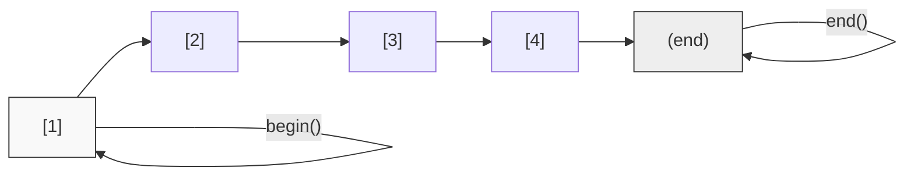

# 1. 迭代器基本概念

迭代器是 STL（Standard Template Library）的核心组件之一，它提供了一种统一的方法来访问容器中的元素，而无需暴露容器内部的底层结构。

## 1.1 迭代器的定义与作用

可以将迭代器理解为一种**广义指针**。它类似于指针，指向容器中的某个特定位置，并提供了访问该位置元素的能力。虽然底层实现可能并非简单的指针（例如链表的迭代器），但在使用层面上，它模仿了指针的行为（如解引用 `*` 和自增 `++`）。

迭代器充当了容器与算法之间的桥梁：容器负责存储数据，迭代器负责访问数据，算法通过迭代器对数据进行处理。

迭代器的主要作用包括：
-   **统一访问接口**：无论底层是数组、链表还是树结构，外部代码都可以使用相同的方式（`begin()`, `end()`, `++`, `*`）进行遍历。
-   **解耦算法与容器**：STL 算法（如 `sort`, `find`）不直接操作容器，而是操作迭代器，这使得同一套算法可以适用于多种容器。
-   **安全性**：相比原始指针，迭代器通常提供边界检查（Debug 模式下）和类型安全检查。

## 1.2 迭代器的逻辑结构

迭代器通过 `begin()` 和 `end()` 函数定义了一个半开半闭区间 `[begin, end)`。这个区间覆盖了容器中的所有有效元素。

-   `begin()`：返回指向容器第一个元素的迭代器。
-   `end()`：返回指向容器最后一个元素的**下一个位置**的迭代器，作为哨兵使用，不指向有效元素。



上图展示了迭代器在序列中的指向关系，`begin()` 指向首元素，`end()` 指向末尾的下一个位置。

---

# 2. 迭代器的分类

不同的容器拥有不同的内部结构，因此提供的迭代器能力也不同。C++ 标准库将迭代器分为以下几类，能力由弱到强：

## 2.1 输入/输出迭代器

这是能力最弱的迭代器，只能单方向移动，通常用于流操作，这里不作深入展开。

## 2.2 前向迭代器

只能向前移动（`++`），不支持向后移动。例如 `forward_list` 的迭代器。

## 2.3 双向迭代器

支持向前和向后移动（`++` 和 `--`）。
-   **典型容器**：`list`（链表）、`set`、`map`。
-   **限制**：不支持随机访问，不能直接跳跃到第 N 个元素。

## 2.4 随机访问迭代器

支持所有双向迭代器的操作，且支持算术运算（`+n`, `-n`）和大小比较（`<`, `>`），可以像数组下标一样直接跳转到任意位置。
-   **典型容器**：`vector`、`deque`。

## 2.5 示例

不同容器迭代器的行为差异：

```cpp
#include <iostream>
#include <vector>
#include <list>

int main() {
    // 1. vector 拥有随机访问迭代器
    std::vector<int> vec = {1, 2, 3, 4, 5};
    auto vec_it = vec.begin();
    vec_it += 3;  // 合法：支持算术运算，直接跳到第4个元素
    std::cout << "Vector: " << *vec_it << std::endl; // 输出: 4

    // 2. list 拥有双向迭代器
    std::list<int> lst = {1, 2, 3, 4, 5};
    auto lst_it = lst.begin();
    lst_it++;      // 合法：支持单向移动
    lst_it--;      // 合法：支持双向移动
    // lst_it += 3; // 错误！list 迭代器不支持随机访问
    
    // 若要移动3步，必须循环执行
    for (int i = 0; i < 3; ++i) ++lst_it;
    std::cout << "List: " << *lst_it << std::endl; // 输出: 4

    return 0;
}
```

---

# 3. 基本使用方法

## 3.1 创建与遍历

使用迭代器遍历容器是 STL 编程中最基础的操作。遍历循环通常使用 `it != end()` 作为终止条件，这对于所有容器都是通用的。

```cpp
#include <iostream>
#include <vector>

int main() {
    std::vector<int> numbers = {10, 20, 30, 40, 50};

    // 1. 使用显式迭代器遍历（读/写）
    for (auto it = numbers.begin(); it != numbers.end(); ++it) {
        *it = *it * 2; // 解引用并修改元素
        std::cout << *it << " ";
    }
    std::cout << std::endl;

    // 2. 使用范围 for 循环（C++11 起）
    // 底层原理与迭代器遍历相同，适用于只读或简单修改场景
    for (int num : numbers) {
        std::cout << num << " ";
    }
    std::cout << std::endl;

    return 0;
}
```

## 3.2 元素查找与访问

结合 STL 算法库 `<algorithm>`，迭代器可以高效地进行查找操作。

```cpp
#include <iostream>
#include <vector>
#include <algorithm> // 包含 find 函数

int main() {
    std::vector<std::string> names = {"Alice", "Bob", "Charlie", "David"};

    // 查找值为 "Charlie" 的元素
    auto it = std::find(names.begin(), names.end(), "Charlie");

    // find 返回指向找到元素的迭代器，若未找到则返回 end()
    if (it != names.end()) {
        std::cout << "Found: " << *it << std::endl;
        
        // 计算位置索引（仅适用于随机访问迭代器，如 vector）
        int index = it - names.begin();
        std::cout << "Index: " << index << std::endl;
    } else {
        std::cout << "Not Found" << std::endl;
    }

    return 0;
}
```

## 3.3 插入与删除

迭代器常用于在容器的特定位置插入或删除元素。需要注意的是，某些操作会使当前持有的迭代器失效。

```cpp
#include <iostream>
#include <vector>

int main() {
    std::vector<int> data = {1, 2, 3, 4, 5};

    // 在第 2 个位置插入 99
    auto it = data.begin() + 1; 
    data.insert(it, 99); // 插入后，it 及其后的迭代器可能失效

    // 删除元素
    data.erase(data.begin()); // 删除第一个元素

    for (int n : data) {
        std::cout << n << " "; // 输出: 2 99 3 4 5
    }
    return 0;
}
```

---

# 4. 迭代器失效问题

这是使用迭代器时最需要注意的陷阱。当容器发生结构性变化（如扩容、插入、删除）时，原本指向容器元素的迭代器可能会变成无效指针，继续使用会导致程序崩溃。

## 4.1 扩容导致的失效

对于 `vector`，当其大小超过容量时，会重新分配更大的内存空间，并将旧数据拷贝过去。此时，所有指向旧内存的迭代器全部失效。

```cpp
std::vector<int> vec = {1, 2, 3};
auto it = vec.begin();

// 危险操作：push_back 可能触发扩容
vec.push_back(4); 

// 此时 it 可能已失效，指向被释放的旧内存
// *it; // 错误！未定义行为

// 正确做法：在进行可能扩容的操作后，重新获取迭代器
it = vec.begin(); 
std::cout << *it << std::endl; // 安全
```

## 4.2 删除操作导致的失效

在遍历过程中删除元素是常见的错误场景。

-   **错误做法**：删除元素后继续使用旧迭代器。
    ```cpp
    std::vector<int> v = {1, 2, 3, 4};
    for (auto it = v.begin(); it != v.end(); ++it) {
        if (*it % 2 == 0) {
            v.erase(it); // erase 后，it 及其后的元素移动，it 变为无效
            // ++it;      // 错误：对无效迭代器进行操作
        }
    }
    ```

-   **正确做法**：利用 `erase` 的返回值更新迭代器。
    `erase` 函数会返回指向被删除元素**下一个位置**的有效迭代器。
    ```cpp
    std::vector<int> v = {1, 2, 3, 4};
    for (auto it = v.begin(); it != v.end(); /* 不在此处自增 */) {
        if (*it % 2 == 0) {
            it = v.erase(it); // 更新 it，指向下一个有效元素
        } else {
            ++it; // 只有未删除时才手动自增
        }
    }
    ```

---

# 5. 迭代器辅助函数

为了简化迭代器的使用和兼容性，C++ 提供了一些辅助函数和类型。

## 5.1 `std::advance`

用于移动迭代器。对于随机访问迭代器，它相当于 `+=`；对于双向迭代器，它通过循环执行 `++` 实现。这使得代码可以通用于所有类型的迭代器。

```cpp
#include <iostream>
#include <list>
#include <iterator> // 包含 advance

int main() {
    std::list<int> lst = {10, 20, 30, 40};
    auto it = lst.begin();
    
    // 将迭代器向后移动 2 步
    std::advance(it, 2); 
    
    std::cout << *it << std::endl; // 输出: 30
    return 0;
}
```

## 5.2 `std::distance`

用于计算两个迭代器之间的距离（元素个数）。

```cpp
auto start = vec.begin();
auto finish = vec.end();
int count = std::distance(start, finish); // 等同于 vec.size()
```

## 5.3 `std::next` 和 `std::prev` (C++11)

返回指定偏移量的新迭代器副本，不改变原迭代器。

```cpp
auto it = vec.begin();
auto next_it = std::next(it); // 相当于 it + 1，但通用
auto prev_it = std::prev(next_it); // 相当于 next_it - 1
```