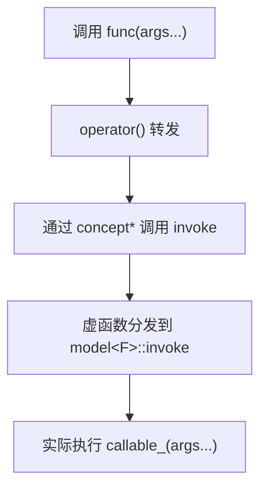
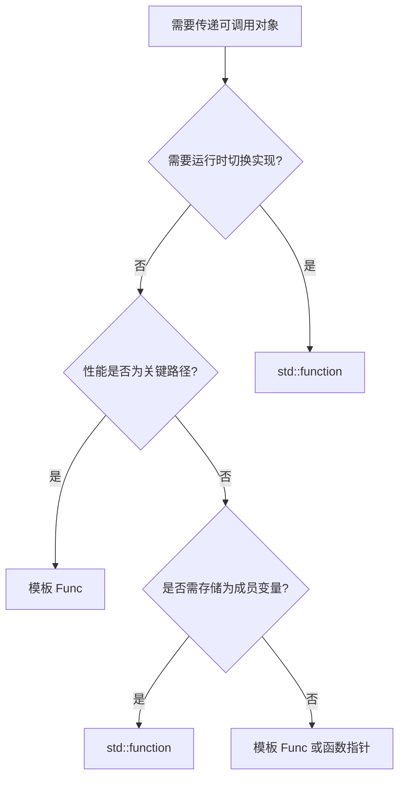

# 1. 背景与动机

## 1.1 函数指针的局限

在 C++11 之前，若要把"一个函数"当作变量传递，通常只能使用**函数指针**：

```cpp
int add(int a, int b) { return a + b; }
int (*funcPtr)(int, int) = add;  // 函数指针
```

函数指针存在三类根本性局限：

| 局限 | 原因 |
|---|---|
| 无法指向带捕获的 Lambda | 带捕获的 Lambda 本质是带成员变量的类对象，并非纯函数 |
| 无法直接指向成员函数 | 成员函数需要隐式绑定 `this` 指针，签名与普通函数不同 |
| 无法统一存储异构可调用对象 | 函数指针类型严格，无法装入同一容器 |

## 1.2 `std::function` 的定位

`std::function` 是 C++11 引入的**通用可调用对象包装器（Polymorphic Callable Wrapper）**，定义在 `<functional>` 头文件中。它通过**类型擦除（Type Erasure）** 技术，可以存储、复制、调用任何"调用签名匹配"的可调用对象——普通函数、Lambda、仿函数、成员函数指针等。

> [!summary]
> **核心定位**：`std::function` 是"运行时多态的函数容器"，将不同来源、但签名一致的可调用对象统一为同一类型，从而支持运行时存储、传递和切换。

---

# 2. 核心概念

## 2.1 调用签名

`std::function` 的关键约束是**调用签名（Call Signature）**——即返回类型与参数类型列表。只要可调用对象能匹配该签名，即可被存储。

```cpp
std::function<int(int, int)> func;
//          ^^^^^^^^^^^^^^^^^
//          调用签名：接受两个 int，返回一个 int
```

## 2.2 类型擦除的本质

`std::function` 内部并不关心被包装对象的真实类型，只关心它"能被怎样调用"。这一特性通过类型擦除实现：

- **对外**：暴露统一的 `operator()` 接口（签名固定）
- **对内**：通过一个抽象基类指针，调用具体派生类的实现（运行时多态）

> [!info]
> 类型擦除 = "对外隐藏具体类型，只暴露接口契约"。`std::function`、`std::any`、`std::shared_ptr` 的删除器都使用了这一思想。

---

# 3. 基本使用

## 3.1 存储普通函数

```cpp
#include <functional>
#include <iostream>

int add(int a, int b) { return a + b; }

int main() {
    std::function<int(int, int)> func = add;
    std::cout << func(3, 4) << "\n";  // 输出 7
}
```

## 3.2 存储 Lambda（最常见用法）

```cpp
int multiplier = 10;

// 带捕获的 Lambda 无法用函数指针存储，但 std::function 可以
std::function<int(int)> func = [multiplier](int x) {
    return x * multiplier;
};
std::cout << func(5) << "\n";  // 输出 50
```

## 3.3 存储仿函数

```cpp
struct Adder {
    int operator()(int a, int b) const { return a + b; }
};

std::function<int(int, int)> func = Adder{};
std::cout << func(2, 3) << "\n";  // 输出 5
```

## 3.4 存储成员函数

成员函数需要绑定 `this`，可用 `std::bind` 或 Lambda：

```cpp
class Calculator {
public:
    int add(int a, int b) { return a + b; }
};

Calculator calc;

// 写法一：std::bind（传统）
std::function<int(int, int)> func = std::bind(
    &Calculator::add, &calc,
    std::placeholders::_1, std::placeholders::_2);

// 写法二：Lambda（更现代，推荐）
std::function<int(int, int)> func2 = [&calc](int a, int b) {
    return calc.add(a, b);
};
```

> [!tip]
> 现代代码优先使用 Lambda 而非 `std::bind`。Lambda 可读性更好、编译期类型推导更友好，且避免 `std::bind` 的占位符语法负担。

---

# 4. 典型使用场景

## 4.1 回调机制

`std::function` 最经典的用途是作为回调参数，允许调用方传入任意形式的可调用对象：

```cpp
void processData(const std::vector<int>& data,
                 std::function<void(int)> callback) {
    for (int x : data) callback(x);
}

int main() {
    std::vector<int> nums = {1, 2, 3, 4, 5};
    processData(nums, [](int x) { std::cout << x * x << " "; });
    // 输出：1 4 9 16 25
}
```

相比函数指针，回调可以是**带状态**的 Lambda，灵活性显著提升。

## 4.2 事件系统 / 观察者模式

```cpp
class Button {
    std::function<void()> onClick;
public:
    void setOnClick(std::function<void()> cb) { onClick = std::move(cb); }
    void click() { if (onClick) onClick(); }
};

int main() {
    Button btn;
    int clickCount = 0;
    btn.setOnClick([&clickCount]() {
        std::cout << "点击次数：" << ++clickCount << "\n";
    });
    btn.click();
    btn.click();
}
```

## 4.3 任务队列 / 命令模式

`std::function` 类型统一，可装入同一容器：

```cpp
std::vector<std::function<void()>> tasks;
tasks.push_back([]() { std::cout << "任务1\n"; });
tasks.push_back([]() { std::cout << "任务2\n"; });

for (auto& task : tasks) task();
```

## 4.4 策略模式

运行时切换算法实现，无需模板：

```cpp
class Sorter {
    std::function<bool(int, int)> cmp;
public:
    explicit Sorter(std::function<bool(int, int)> c) : cmp(std::move(c)) {}
    void sort(std::vector<int>& data) {
        std::sort(data.begin(), data.end(), cmp);
    }
};

Sorter asc ([](int a, int b) { return a < b; });
Sorter desc([](int a, int b) { return a > b; });
```

---

# 5. 内部实现原理

## 5.1 类型擦除的内部结构

`std::function<R(Args...)>` 内部通常由两部分组成：

```text
+-----------------------------------+
|        std::function              |
|-----------------------------------|
|  concept*  impl;   → 抽象基类指针 |
|  storage   sbo;     → 小对象缓冲  |
+-----------------------------------+
              |
              v
+-----------------------------------+
|   concept (抽象)                  |
|   ├─ invoke(Args...) = 0          |
|   ├─ clone() = 0                  |
|   └─ destroy() = 0                |
+-----------------------------------+
       △              △
       │              │
+-------------+  +-------------+
| model<F>    |  | model<G>    |  ← 具体派生类
|  F callable;|  |  G callable;|
+-------------+  +-------------+
```

- **concept**：定义统一的调用接口（`invoke`、`clone`、`destroy`），是抽象基类
- **model\<F\>**：模板派生类，持有具体可调用对象 `F` 的实例
- 通过 `concept*` 指针调用 `invoke`，本质上是**虚函数分发**

## 5.2 调用流程



> [!info]
> 由于内部使用虚函数分发，`std::function` 的调用比直接调用或模板慢——这是运行时多态的固有代价。

## 5.3 小对象优化（SBO）

为避免对小型可调用对象进行堆分配，`std::function` 内部预留一块固定大小的栈缓冲区（通常 16~32 字节，依赖实现）：

| 可调用对象大小 | 存储方式 | 性能 |
|---|---|---|
| ≤ SBO 阈值（如小型 Lambda） | 直接存于栈缓冲 | 无堆分配，构造快 |
| > SBO 阈值（如大型捕获、大仿函数） | 堆分配 `model<F>` | 有 `new/delete` 开销 |

> [!tip]
> 实践中应尽量让传入 `std::function` 的 Lambda **捕获轻量化**，使其命中 SBO 路径，避免堆分配。

---

# 6. 空状态检查

`std::function` 默认构造时为**空**，调用空对象会抛出 `std::bad_function_call`：

```cpp
std::function<void()> func;  // 空

if (func) {           // 隐式转 bool，判断非空
    func();
} else {
    std::cout << "func 为空\n";
}
```

> [!warning]
> **易错点**：忘记检查空状态直接调用，会导致运行时异常崩溃。在事件回调、外部传入的 `std::function` 成员中尤其要警惕。

---

# 7. 性能分析

## 7.1 开销来源

| 开销类型 | 描述 | 影响场景 |
|---|---|---|
| 内存开销 | SBO 失败时堆分配 `model<F>` | 大型可调用对象 |
| 调用开销 | 虚函数分发，无法内联 | 高频调用路径 |
| 拷贝开销 | 拷贝时需 `clone` 可调用对象 | 频繁拷贝传递 |

## 7.2 与模板的性能对比

```cpp
// 模板版本：编译期多态，可内联
template<typename Func>
void processDataT(const std::vector<int>& data, Func callback) {
    for (int x : data) callback(x);  // 编译器可内联 callback
}

// std::function 版本：运行期多态
void processDataF(const std::vector<int>& data,
                  std::function<void(int)> callback) {
    for (int x : data) callback(x);  // 虚函数分发，无法内联
}
```

> [!warning]
> **关键原则**：在性能敏感的热点路径（如游戏引擎每帧循环、信号处理、高频算法回调），应优先使用模板而非 `std::function`。

---

# 8. 对比与选型

## 8.1 三种方案对比

| 维度 | 函数指针 | 模板 `Func` | `std::function` |
|---|---|---|---|
| 存储带捕获 Lambda | ==不能== | 能 | 能 |
| 存储仿函数 | 不能 | 能 | 能 |
| 存储成员函数 | 需 bind | 能 | 能 |
| 运行时切换实现 | 能 | 不能（编译期确定） | 能 |
| 调用性能 | 快 | ==最快==（可内联） | 较慢（类型擦除） |
| 作为类成员存储 | 受限 | 不便（模板类复杂） | ==方便== |
| 类型擦除 | 无 | 无 | 有 |
| 二进制边界兼容 | 好 | 差（需源码） | 好 |

## 8.2 选型决策



> [!summary]
> - **模板**：泛型算法、STL 风格代码、性能敏感场景
> - **`std::function`**：回调、事件系统、策略模式、需要运行时多态的场景
> - **函数指针**：C 风格 API、与 C 互操作

---

# 9. 易错点

> [!warning]
> **易错点汇总**：
> 1. **忘记空检查**：调用空 `std::function` 抛 `std::bad_function_call`
> 2. **悬垂引用**：Lambda 捕获局部变量的引用，对象销毁后调用导致 UB
> 3. **过度使用**：在模板即可解决的场景滥用 `std::function`，引入不必要开销
> 4. **拷贝开销**：按值传递 `std::function` 会触发可调用对象的拷贝，应考虑 `const&` 或 `&&`
> 5. **SBO 失败**：Lambda 捕获大量数据导致堆分配，影响性能

---

# 10. 最佳实践

1. **按需传递**：函数参数优先 `std::function` 的 `const&` 或直接模板，避免按值拷贝
2. **优先 Lambda**：用 Lambda 替代 `std::bind`，更现代、更易读
3. **检查空状态**：对外部传入或可选回调，调用前必须检查 `if (func)`
4. **轻量捕获**：Lambda 捕获尽量精简，命中 SBO 避免堆分配
5. **热点用模板**：性能关键路径使用模板，保留 `std::function` 给需要运行时多态的场景
6. **`std::move` 转移所有权**：构造时若可调用对象不再使用，用 `std::move` 避免拷贝

---

# 11. 总结

> [!summary]
> **`std::function` 是"运行时多态的函数容器"**：
> - 通过**类型擦除**统一存储任意签名匹配的可调用对象
> - 内部使用**虚函数分发 + SBO** 机制
> - 最适用于**回调、事件系统、策略模式**等需要运行时多态的场景
> - 性能敏感场景应优先使用**模板**（编译期多态）
> - 调用前需检查空状态，避免 `std::bad_function_call`
