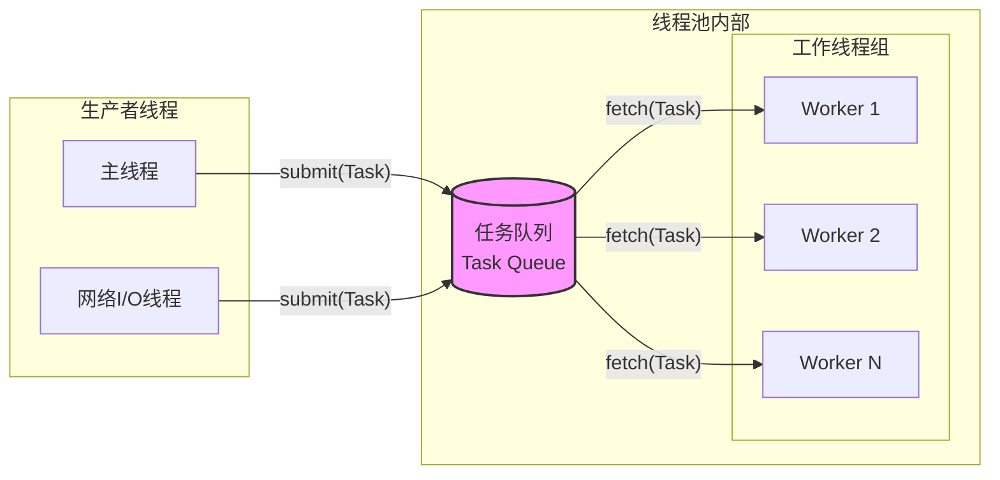

# 1. 核心定义

线程池是一种**基于生产者-消费者模型的并发执行架构**。它解决了在处理大量短小任务时，频繁创建和销毁线程带来的性能损耗问题。

## 1.1 核心架构模型

线程池将资源的“创建”与“使用”分离，预先创建一组线程作为工作单位，通过一个共享的任务队列来**分发任务**。



---

# 2. 线程池的优势

1. 对比：临时线程 vs 线程池

| 维度 | 临时线程 (`std::thread t; t.join()`) | 线程池 (`threadpool.submit()`) |
| :--- | :--- | :--- |
| **创建开销** | 极高 (几十微秒，涉及系统调用) | 极低 (内存拷贝) |
| **资源消耗** | 不可控，高并发下耗尽内存 | 可控，固定线程数 |
| **调度开销** | 频繁创建/销毁导致上下文切换频繁 | 线程复用，仅涉及任务切换 |
| **响应抖动** | 存在 (GC 风格的停顿) | 平滑 (任务排队) |

2. **核心收益**
	- **降低开销**：避免了频繁的**线程创建与销毁**（避免了内核态与用户态的频繁切换）。
	- **并发控制**：限制最大并发数，防止因并发过高导致服务器资源耗尽（OOM）或 CPU 上下文切换率过高导致“惊群效应”。
	- **解耦架构**：将“任务的提交”与“任务的执行”解耦。

---

# 3. 线程池的设计

## 3.1 基本思想

线程池（Thread Pool）是一种**资源复用**模式。其核心思想是：预先创建一批线程并维持其存活，通过任务队列将工作分发给空闲线程，从而将**线程的生命周期管理**与**任务的执行**解耦。

这一设计规避了朴素“一任务一线程”模型的两大缺陷：
- **创建/销毁开销**：线程创建涉及内核栈分配、调度器注册等操作，在高频短任务场景下开销不可忽视。
- **资源失控风险**：无限制地创建线程会耗尽系统文件描述符、栈内存等资源，并因过度的上下文切换导致性能骤降。

## 3.2 核心组成

### 3.2.1 线程池管理器

管理器是线程池的控制中枢，承担以下职责：

- **初始化**：在构造时预创建指定数量的工作线程，并将它们置于**阻塞**状态。
- **生命周期管理**：维护线程句柄，在析构时负责优雅关闭——通常通过**设置停止标志并广播条件变量**，等待所有工作线程自然退出，而非强制终止（`terminate`）。
- **状态统计**：追踪活跃线程数、空闲线程数、队列积压深度等指标，为动态伸缩和监控提供数据支撑。

管理器的析构必须保证**所有已提交的任务都得到处理或明确丢弃**，不允许出现任务"泄漏"的情况。

### 3.2.2 任务队列

任务队列是生产者（调用方）与消费者（工作线程）之间的缓冲层，其设计直接影响吞吐量和调度语义。

#### 存储形式

任务通常封装为 `std::function<void()>`，这提供了足够的泛用性。通过后面我们将会聊到的 `std::bind` 或 **Lambda 表达式**，你可以把任何复杂的、带参数的、需要对象实例的操作，全部“**抹平**”成一个简单的 `void()` 调用。

这种“抹平”的好处在于：
1. **解耦**：线程池的工作线程（Worker Thread）不需要知道它正在运行的是什么。它只需要机械地从队列里拿出一个 `task`，然后执行 `task()`。
2. **统一存储**：任务队列可以统一使用 `std::queue<std::function<void()>>`。无论任务是算加法、写文件、还是网络通信，它们在队列里看起来都一模一样。

> `std::function<void()>` 和 `std::function<void(void)>` 是等价的。只是写法不同。在模板参数里，`void()` 是更现代、更常用的写法，而 `void(void)` 只是更显式地表达了“无参”这个概念。

#### 调度策略

|策略|实现|适用场景|
|---|---|---|
|FIFO 队列|`std::queue`|通用场景，公平调度|
|优先级队列|`std::priority_queue`|任务有轻重缓急，如实时系统|
|工作窃取队列|每线程一个双端队列|高性能计算，减少竞争|

#### 背压控制（Backpressure）

无界队列在任务提交速率持续超过消费速率时，会导致内存无限增长。生产级实现通常设置队列容量上限，并在队列满时采取以下策略之一：
- **阻塞调用方**：等待队列有空位（适用于可以容忍等待的场景）。
- **抛出异常 / 返回错误**：拒绝任务，由调用方决策重试逻辑。
- **丢弃策略**：丢弃最旧的任务或新提交的任务（需业务允许）。

### 3.2.3 添加任务

这是添加任务到任务队列的成员函数：

```cpp
/* 添加任务到任务队列中 */
void addTask(std::function<void(void)> task) { ... }
```

在调用时，有以下几种方式（只能调用**返回值为 `void`** 类型的函数）：

```cpp
void doSomething() { std::println("正在工作 ..."); }

void calc(int a, int b) {
  std::println("calc: {} + {} = {}", a, b, a + b);
  std::this_thread::sleep_for(std::chrono::seconds(2));
}
```

#### 情景一：无参数传递函数

对于 `doSomething()` 这种**无参数**的函数，可以直接传递函数指针：

```cpp
ThreadPool pool;
for (int i = 0; i < 10; ++i) {
  pool.addTask(doSomething));
}
```

#### 情景二：有参数传递函数

对于 `calc(...)` 这种**有参数**的函数，可以采用绑定（`bind`）的方式：

```cpp
ThreadPool pool;
for (int i = 0; i < 10; ++i) {
  pool.addTask(std::bind(calc, i, i * 2));
}
```

> [!note]
> `bind` 先把函数名 `calc` 和提供的参数（比如 `i` 和 `i*2`）捆绑在一起，然后它返回一个**仿函数对象（Functor）**。这个对象内部存了一份 `i` 和 `i*2` 的**拷贝**。
> 
> ```cpp
> // 伪代码：bind 内部大概长这样
> struct MyBoundTask {
>     int _a;
>     int _b;
>     void operator()() {   // 注意：这里没有参数！
>         calc(_a, _b);     // 在内部调用时，把存好的参数传进去
>     }
> };
> ```

于是，自然而然有了这种 **lambda** 调用方式（**推荐**）：

```cpp
ThreadPool pool;
for (int i = 0; i < 10; ++i) {
  pool.addTask([=]() { calc(i, i * 2); });  // 一定要用值捕获
  // pool.addTask([i]() { calc(i, i * 2); });  // 或者手动传递 i
}
```

> [!question] 这里为什么用值捕获，而不用引用捕获呢？
> 用引用捕获 `i` 的话，lambda 里存的不是 `i` 的值，而是**指向 `i` 的引用**。
> 
> ```cpp
> for (int i = 0; i < 10; ++i) {
>     pool.addTask([&]() { calc(i, i * 2); }); // 存的是 i 的地址
> }
> // 循环结束后，i 销毁！
> ```
> 
> 任务被丢进线程池之后，**不会立刻执行**，等线程池真正调用这个 lambda 时，循环可能早就结束了，`i` 已经不存在，引用变成了**悬空引用**，读到的是垃圾值。

线程池场景下，任务的**执行时机**和**创建时机**是分离的，必须保证数据在执行时还活着。

#### 场景三：类的成员函数

**场景三**：任意可调用对象

```cpp
Foo {
 public:
  bar() { ... }
}

ThreadPool pool;
Foo obj;                                  // 1. 在内存中开辟空间，存放 obj 的成员变量
pool.addTask(std::bind(&Foo::bar, &obj)); // 2. 绑定这个具体的实例地址
```

> [!question] 为什么需要实例化 `obj`？
> 
> 普通函数（如 `calc`）是独立存在的，直接调用就行。但成员函数（如 `Foo::bar`）内部通常会访问类的成员变量。如果没有具体的对象，成员变量从哪儿来呢？
> 
> 从底层原理来看，成员函数其实都有一个隐藏的第一个参数：`this` 指针。
> - 这里定义的签名：`void Foo::bar()`
> - 编译器眼里的真实签名：`void Foo::bar(Foo* const this)`
> 
> 当你使用 `std::bind(&Foo::bar, &obj)` 时，你实际上是在告诉 `bind`：**“请把 `&obj` 作为这个隐藏的 `this` 指针传进去。”**

不过这里的 `&obj` 其实是会有**生命周期风险**，这是多线程编程中最容易踩的坑：
- **危险动作**：如果你在函数局部创建了 `Foo obj;`，然后把它 `bind` 给线程池就直接退出了当前函数。
- **后果**：局部变量 `obj` 会被销毁，但线程池里的线程过一会儿才去执行 `task()`。此时 `this` 指针指向的是一块**已经失效的内存**（野指针），程序会崩溃。

**解决方案：**
1. 确保 `obj` 的生命周期比线程池长（比如作为全局变量或 `main` 函数里的变量）。
2. 使用智能指针（推荐）：

```cpp
auto objPtr = std::make_shared<Foo>();
pool.addTask([objPtr] { objPtr->bar(); }); // Lambda 会自动增加引用计数，保证对象不死
```

### 3.2.3 工作线程

每个工作线程运行一个事件循环，逻辑如下：

```
loop:
    加锁，检查队列
    if 队列为空 且 未停止:
        在条件变量上等待（原子释放锁并挂起）
    if 已停止 且 队列为空:
        退出循环
    取出任务，解锁
    执行任务
```

几个关键细节：

- **虚假唤醒（Spurious Wakeup）**：`condition_variable::wait` 可能在无通知的情况下返回，因此必须在**循环**中检查条件，而**不是 `if`**。
- **停止语义**：区分"立即停止"（丢弃队列剩余任务）和"优雅停止"（耗尽队列后再退出）两种模式，后者更常见。
- **任务执行隔离**：工作线程不应持有任何锁的情况下执行任务，否则会人为延长锁的持有时间，阻塞其他线程入队。

### 3.2.4 同步机制

线程池涉及多个共享状态，需要精心设计同步策略：

#### 互斥锁（`std::mutex`）

保护任务队列的入队/出队操作。锁的粒度应尽可能小——仅在操作队列时持有锁，不要在持锁期间执行任务。

#### 条件变量（`std::condition_variable`）

> 后面简称 `cv`。

用于工作线程的休眠与唤醒：
- 任务入队后调用 `notify_one()`（唤醒一个等待线程）。
- 关闭线程池时调用 `notify_all()`（唤醒所有线程使其检测到停止标志）。

#### 原子变量（`std::atomic`）

对于不需要与队列操作组合的状态（如活跃线程计数、停止标志），可使用原子变量替代互斥锁，减少竞争：

```cpp
std::atomic<bool> stop_{false};
std::atomic<size_t> active_count_{0};
```

三者的职责边界清晰：**mutex 保护复合状态，condition_variable 协调等待，atomic 管理独立计数**，避免过度同步。

### 3.2.5 线程池大小管理

1. 方案一：**固定大小**：
线程数通常设置为 `std::thread::hardware_concurrency()`（逻辑核心数）。适用于 CPU 密集型任务——此时增加线程只会加剧上下文切换，并无收益。

2. 方案二：**动态调整**
	适用于 I/O 密集型或任务耗时波动较大的场景。实现要点：
	- 设定**最小线程数**（空闲时维持的基线）和**最大线程数**（防止资源耗尽）。
	- 通过监控队列积压深度，在超过阈值时按需创建新线程。
	- 对空闲超过一定时间的线程进行回收（通常通过带超时的条件变量等待实现）。

> 动态调整引入了额外的复杂度，需警惕线程创建风暴（短时间内大量创建线程）和频繁抖动（反复创建/销毁）。

### 3.2.6 任务执行与异常处理

工作线程中未捕获的异常会导致线程终止，进而**永久性地缩减线程池容量**，这是严重的正确性问题。

**基本防护**

工作线程的任务执行部分必须包裹 `try-catch`：

```cpp
try {
    task();
} catch (const std::exception& e) {
    // 记录日志，但不重新抛出
    log_error(e.what());
} catch (...) {
    log_error("unknown exception in worker thread");
}
```

**结合 `std::future` 传递异常**

使用 `std::packaged_task` 封装任务时，任务内部抛出的异常会被自动存储在 `future` 中，调用方在 `future::get()` 时才会看到该异常。这是将异常从工作线程安全传递给调用方的推荐方式，工作线程本身不会因此终止。

**线程意外终止的补偿**

对于极端情况（如 `std::terminate` 被调用），可以在管理器中监控存活线程数，在检测到线程数低于预期时自动补充，以保证线程池容量不会悄无声息地退化。

## 3.3 异步设计

**异步执行**与同步操作不同，异步操作不要求调用者在任务完成之前等待结果。异步操作通常会在后台线程中执行，主线程或其他线程可以继续执行其他任务。在多线程编程中，异步操作通常通过创建新的线程来实现。新线程会执行异步任务，而主线程则继续进行其他操作。

比如任务函数有返回值，我们就可以通过线程异步的方式，将子线程也就是工作的线程的返回值传递给主线程，核心操作就是修改添加任务的函数 addTask。

若需要获取任务执行结果，可结合 `std::packaged_task` 和 `std::future`，使调用方能够异步等待结果并捕获异常：

```cpp
template <typename F, typename... Args>
auto addTask(F &&f, Args &&...args) -> std::future<typename std::result_of<F(Args...)>::type> {
  // 其别名：定义返回类型
  using returnType = typename std::result_of<F(Args...)>::type;
  // 1. 创建 package_task 实例
  auto my_task =
      std::make_shared<std::packaged_task<returnType()>>(std::bind(std::forward<F>(f), std::forward<Args>(args)...));
  // 2. 获取 future
  std::future<returnType> res = my_task->get_future();
  // 3. 将任务添加到任务队列
  {
    std::lock_guard<std::mutex> lock(m_task_mutex);
    m_tasks.emplace([my_task]() { (*my_task)(); });
  }
  m_queue_condition.notify_one();
  return res;
}
```

这个函数可以接收任意函数 `f` 和参数 `args...`，并返回一个 `future<f(args...) 的返回值类型>`。

但是从形式来看，这部分函数实现可以说是相当复杂（“**丑陋**”）的，下面我们一步一步来拆解：

#### 函数签名

1. **模板参数**：`F, Args...`

```cpp
template <typename F, typename... Args>
```

含义：
- `F`：函数类型（或者可调用对象）
- `Args...`：参数列表（可变参数模板）

> [!example]
> 比如你调用 `addTask(add, 1, 2)`，编译器就推导出：
> - `F` = `int(int, int)` 这种函数类型
> - `Args...` = `int, int`
> 
> `...` 代表"任意多个"，0 个、1 个、10 个都行。

2. **函数参数**：`F&&, Args&&...`

```cpp
F&& f, Args&&... args
```

`&&` 在模板里是**万能引用**，意思是“**不管你传左值还是右值，我都能接**”。你暂时可以把它理解成就是在接收参数，不用纠结 `&&`，这只是为了性能优化（避免多余拷贝）。

3. **返回类型**

```cpp
-> std::future<typename std::result_of<F(Args...)>::type>
```

`->` 是**尾置返回类型**的语法，就是把返回类型写到后面，原因是返回类型里要用到 `F` 和 `Args`，而它们在前面的参数列表里才定义，所以只能写后面。

等价于你想写：

```cpp
std::future<???> addTask(...)
```

但 `???` 在前面还不知道是什么，所以挪到后面写。

> [!question] 那么 `???` 到底是什么？
> 
> 这里传入的函数 `f`，调用之后返回什么类型，future 就装什么类型。
> 
> 比如：
> - `f` 是 `int add(int, int)` → 返回 `int` → future 装 `int` → `std::future<int>`
> - `f` 是 `std::string getName()` → 返回 `string` → `std::future<string>`

但编译器不能直接问“f 的返回值是啥”，它需要你用类型系统来描述这件事，于是就有了：

```cpp
std::result_of<F(Args...)>::type
```

拆开看：

```cpp
std::result_of< F(Args...) > :: type
              └────────────┘
              "传递参数 Args... 调用 F，会得到什么类型？"
                                    └──┘
                                  取出那个类型
```

`typename` 是固定写法，告诉编译器“后面跟着的是一个类型，不是别的东西”。

> [!question] 为什么不能写简单点？
> 因为 C++ 是**静态类型语言**，返回类型必须在编译期确定。这个函数要能接受任意函数，那返回类型自然也是"不确定"的，只能用模板机制让编译器自己推导。
> 比如 Python 就完全不需要这些，因为它是动态类型的，运行时才管类型是什么。C++ 为了性能，提前把这一切算清楚，代价就是写起来麻烦很多。

#### 创建任务（最复杂）

```cpp
auto my_task =
    std::make_shared<std::packaged_task<returnType()>>(
        std::bind(std::forward<F>(f), std::forward<Args>(args)...)
    );
```

从**最里层**往外看：

**第一层**：`std::forward`：

```cpp
std::forward<F>(f)
std::forward<Args>(args)...
```

配合万能引用使用的固定写法，叫**完美转发**。意思是“把参数原封不动地传下去，不产生多余拷贝”。你暂时可以把它当成透明的，理解成就是 `f` 和 `args...`。

**第二层**：`std::bind`

```cpp
std::bind(f, args...)
```

`packaged_task` 要求内部存一个**无参**的可调用对象，但你传进来的 `f` 是有参数的，比如 `add(1, 2)`。`std::bind` 的作用就是**把函数和参数提前绑在一起**，生成一个新的无参对象：

```
bind(add, 1, 2)  →  一个新对象，调用它等价于 add(1, 2)
```

参数已经被“记住”了，调用时不需要再传。

**第三层**：`std::packaged_task<returnType()>`

```cpp
std::packaged_task<returnType()>(bind的结果)
```

`packaged_task` 是一个包装器，它做两件事：
1. **存着那个无参可调用对象**（上面 bind 生成的）
2. **内置一个 future**，当任务被执行时，自动把返回值塞进 `future`

`returnType()` 这个写法的意思是“无参，返回 returnType 的函数类型”，是模板参数，用来告诉 packaged_task 任务的签名是什么。

**第四层**：`std::make_shared`

```cpp
std::make_shared<std::packaged_task<...>>(...)
```

用智能指针包裹 `packaged_task`。

> [!question] 为什么必须用 shared_ptr？
> 因为后面要把 `my_task` 捕获进一个 lambda，而 `packaged_task` **不能被拷贝**（它是 move-only 的）。Lambda 的捕获默认是拷贝，所以直接捕获会编译报错。
> 用 shared_ptr 包一层之后，捕获的是指针（指针可以拷贝），而真正的 packaged_task 只有一份，生命周期由 shared_ptr 自动管理。

#### 取出 future

```cpp
std::future<returnType> res = my_task->get_future();
```

从 packaged_task 里取出关联的 future，存在 `res` 里。这个 future 和 packaged_task 内部是**绑定的**：将来 packaged_task 被执行，结果自动出现在这个 future 里。

`res` 最后会被 `return` 给调用方，调用方拿着它等结果。

#### 放进任务队列

```cpp
{
    std::lock_guard<std::mutex> lock(m_task_mutex);
    m_tasks.emplace([my_task]() { (*my_task)(); });
}
```

> [!question] 为什么要再包一层 lambda？
> 
> ```cpp
> [my_task]() { (*my_task)(); }
> ```

任务队列 `m_tasks` 里存的类型是统一的，通常是 `std::function<void()>`（无参无返回值）。但每个任务的返回类型都不一样，有的是 `int`，有的是 `string`……不可能都塞进同一个队列。

所以用这个 lambda 做了一层**类型抹除**：
- 外面看到的：`void()` 统一接口
- 里面实际干的：执行 packaged_task，结果自动进 future

`[my_task]` 按值捕获 shared_ptr，保证 packaged_task 在任务真正被执行前不会被销毁。`(*my_task)()` 就是调用 packaged_task，触发实际执行。

#### 唤醒工作线程

```cpp
m_queue_condition.notify_one();
```

线程池里的工作线程平时在**睡眠等待**（阻塞在条件变量上），任务队列为空就没事干。`notify_one()` 唤醒其中一个线程，告诉它"队列里有新任务了，去取吧"。

#### 返回 future

```cpp
return res;
```

把之前取到的 future 还给调用方。调用方拿着它，随时可以 `.get()` 等结果。

#### 优化（现代 C++ 写法）

```cpp
template <typename F, typename... Args>
auto addTask(F &&f, Args &&...args) {
    // 用 invoke_result 替代 result_of，用 auto 省略尾置返回类型
    using returnType = std::invoke_result_t<F, Args...>;

    // 用 lambda 替代 std::bind
    auto my_task = std::make_shared<std::packaged_task<returnType()>>(
        [f = std::forward<F>(f), 
         args = std::make_tuple(std::forward<Args>(args)...)]() mutable {
            return std::apply(f, args);
        }
    );

    std::future<returnType> res = my_task->get_future();
    {
        std::lock_guard<std::mutex> lock(m_task_mutex);
        m_tasks.emplace([my_task]() { (*my_task)(); });
    }
    m_queue_condition.notify_one();
    return res;  // C++14 起可以直接 auto 推导返回类型
}
```

> `invoke_result_t` 是 `invoke_result<...>::type` 的简写，C++17 加的语法糖。

---

# 4. 同步原语的分工

在线程池中，`std::atomic` 和 `std::mutex` 各司其职。理解它们的分工是理解高性能并发编程的关键。

> [!question] 任务队列中为什么必须用 `mutex` + `cv`

`std::atomic` 虽然快，但不适合用来保护复杂的共享数据结构（如 `std::queue`）。

| 特性 | `std::atomic` (CAS 自旋) | `std::mutex` + `cv` (阻塞) |
| :--- | :--- | :--- |
| **适用场景** | 单个变量、标志位、计数器 | 复杂数据结构、长临界区、需要等待时 |
| **竞争开销** | 高竞争下 CPU 忙等待，浪费 CPU | 无任务时线程睡眠，释放 CPU |
| **任务队列适用性** | **差** (自旋锁在队列空时空转) | **优** (队列空时睡眠，有任务时唤醒) |

线程池的任务队列是一个**高竞争区域**（多生产者、多消费者）。如果使用无锁队列（Lock-Free Queue），虽然避免了锁，但在任务空缺时，工作线程必须 `while(true) { if(!empty) pop; }` 自旋检查，这会白白消耗 CPU。使用 `std::condition_variable` 可以让工作线程在队列为空时进入**阻塞态**，零 CPU 占用，直到有新任务到来时才被内核唤醒。

> [!question] 状态控制为什么用 `std::atomic`

`std::atomic` 用于那些**操作极快、无需互斥**的简单状态。

1.  **停止标志位 (`std::atomic<bool> stop`)**：
    -   工作线程在 `wait` 返回后需要检查是否该销毁。
    -   主线程析构时设置 `m_is_running = false`。
    -   这比使用 `mutex` 保护一个 bool 要快得多。

2.  **任务计数 (`std::atomic<int> pending_tasks`)**：
    -   用于统计当前还有多少任务在执行。
    -   用于实现简单的 `wait_all()` 功能。
    -   `fetch_add` 操作是原子的，无需加锁，开销极低。

---

# 5. 线程池的局限性

虽然线程池很强大，但并非万能。

1.  **不适合超短任务**：
    -   如果任务执行时间只有纳秒级，加锁和调度（线程上下文切换）的开销可能超过了任务本身。
    -   **解决方案**：批量处理任务，或使用协程。

2.  **不适合强实时系统**：
    -   `std::condition_variable` 唤醒线程由操作系统调度，存在延迟抖动（无法保证精确的微秒级响应）。
    -   **解决方案**：使用实时操作系统内核或自旋锁。

3.  **负载均衡问题（传统线程池）**：
    -   如果某个 Worker 拿到了一个耗时极长的任务，其他 Worker 可能会闲着。
    -   **解决方案**：**Work Stealing (工作窃取)** 算法。每个 Worker 维护自己的双端队列，空闲的 Worker 去偷其他 Worker 队列尾部的任务。

---

# 6. 总结

线程池是并发编程中连接“底层原语”与“上层业务”的桥梁。

-   **它是一个容器**：封装了 `std::thread` 的生命周期管理。
-   **它是一个调度器**：利用 `std::queue` 和 `std::mutex` 实现任务分发。
-   **它是一个优化器**：利用 `std::atomic` 进行低成本的元数据控制，利用 `std::condition_variable` 实现零 CPU 占用的等待。

> [!summary] 设计哲学
> **原子变量管状态，互斥锁管数据，条件变量管等待**。理解了这句话，你就掌握了线程池的核心。

推荐一些第三方库：
- `cppcoro`：目前最成熟的 C++ 协程库，自带线程池调度器
- `libunifex`（Facebook 出品）：基于 Sender/Receiver (发送者/接收者) 模式。可以实现异步操作、调度程序（Scheduler）、计时器、以及基于 io_uring 的异步 I/O。

