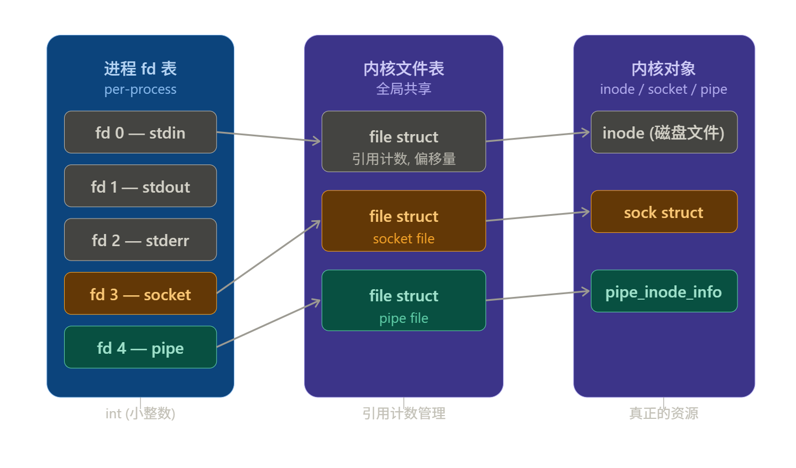
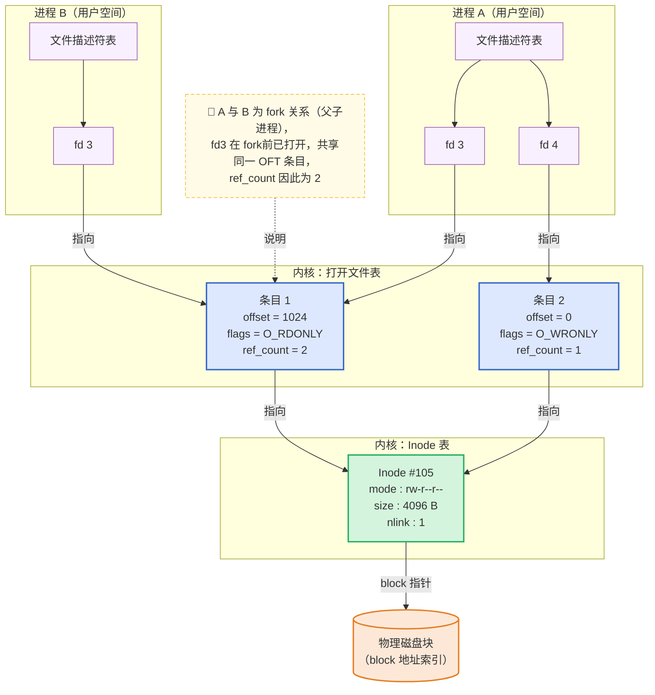
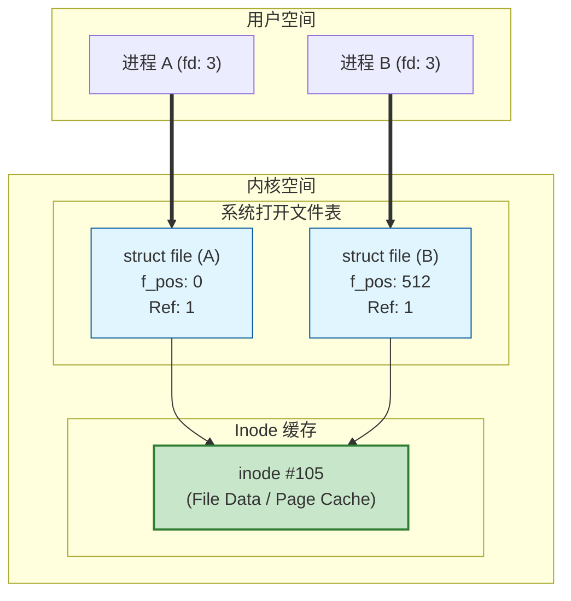

# 1. 基本概念

在 Linux/Unix 系统的哲学中，**一切皆文件**。无论是普通磁盘文件、目录、管道，还是网络套接字，在内核层面都被抽象为统一的对象。为了方便用户空间程序操作这些对象，内核提供了一个**非负的整数索引**，这就是**文件描述符(File Descriptor)**，一般简称 fd。



## 1.1 基础定义

文件描述符（fd）是一个**索引值（index）**，其本质上是**进程级文件描述符表的数组下标**。当程序打开一个现有文件或创建一个新文件时，内核向进程返回一个文件描述符。

### 1.1.1 标准文件描述符

根据 POSIX 标准，每个进程启动时默认会打开三个文件描述符：

|fd|宏定义|含义|
|---|---|---|
|0|STDIN_FILENO|标准输入，通常指键盘|
|1|STDOUT_FILENO|标准输出，通常指终端|
|2|STDERR_FILENO|标准错误，通常指终端|

> [!tip]  
> 这 3 个 fd 是 shell 重定向机制的基础（如 `>`、`2>`）

## 1.2 工作原理简述

当用户程序调用 `read(fd, buf, size)` 时，实际上是执行了以下步骤：
1.  **索引**：进程通过 `fd`（整数）在自身的文件描述符表中找到对应的条目。
2.  **定位**：通过该条目找到内核中对应的**打开文件表**（Open File Table）项。
3.  **映射**：通过打开文件表项找到磁盘上的具体文件（Inode）。
4.  **操作**：根据当前偏移量读写数据。

---

# 2. 内核中的三层结构

为了支持复杂的文件操作（如共享、重定向），Linux 内核通过三层表结构管理文件 I/O：

1. **进程文件描述符表**：每个进程独立维护。`fd` 本质是该表的数组索引。
2. **内核打开文件表（Open File Description Table）**：系统级全局表。记录文件偏移量、访问模式（读/写/追加）、文件状态标志及指向 VFS inode 的指针。
3. **VFS Inode 表**：记录文件的元数据（权限、所有者、磁盘块位置等）。

> [!important] 核心模型
> 文件描述符表中的 fd → 打开文件表 → i-node

## 2.1 结构图解

下图展示了两个进程（Process A 和 Process B）访问同一个物理文件的内存布局，B 是由 A `fork()` 出来的子进程：



> **补充**：打开文件表（Open File Table）一般简称为 OFT，Inode 表是处于 VFS 层。

## 2.2 层级详细解析

### 2.2.1 第一层：进程级文件描述符表

**归属**：每个进程独有。Linux 中每个进程都有一个 `task_struct`，其中有一个指针 `files` 指向 `files_struct`（文件描述符表）。`files_struct` 内部维护一个指针数组 `fd_array[]`，数组下标就是 fd 编号。

**内容**：`fd_array[]` 的每个**元素**是一个指向 `struct file` 的**指针**（即**系统级打开文件表**的条目）。fd 本身只是一个非负整数，不携带任何文件状态，它的唯一作用是作为这个**数组的索引**。

**默认分配**：进程启动时，内核默认打开三个 fd：

```
task_struct
  └── files（指针）
        └── files_struct
              └── fd_array[ ]
                    ├── fd[0] → struct file（stdin,  O_RDONLY）
                    ├── fd[1] → struct file（stdout, O_WRONLY）
                    ├── fd[2] → struct file（stderr, O_WRONLY）
                    └── fd[3] → struct file → ...
```

**fd 的分配规则**：内核总是分配当前可用的**最小非负整数**。这是 POSIX 标准规定的行为，也是 `close(0)` 后再 `open()` 一个文件会得到 fd 0 的原因（常用于 I/O 重定向）。

**与 fork/dup 的关系**：

- `fork()`：子进程**复制**整张 `fd_array[]`，复制的是指针本身，因此父子进程的同名 fd 指向**同一个** `struct file`，该条目的引用计数 +1。
- `dup()`/`dup2()`：在**同一进程内**创建一个新 fd，使其指向与旧 fd 相同的 `struct file`，引用计数同样 +1。
- `open()`：每次调用都会在系统级打开文件表中分配一个**全新的** `struct file` 条目，即使打开的是同一个文件。

> `task_struct` 是 Linux 内核对 PCB（Process Control Block）的具体实现。PCB 是操作系统理论中的通用术语，描述"管理进程所需的核心数据结构"；`task_struct` 则是 Linux 落地这一概念的结构体，除文件描述符表外，还包含调度信息、内存映射、信号处理、命名空间等大量字段。

### 2.2.2 第二层：系统级打开文件表（`struct file`）

**归属**：内核全局，所有进程共享同一张表。

**内容**：每个 `struct file` 条目记录的是**一次 open() 调用的状态**，而不是文件本身的属性：

|字段|说明|
|---|---|
|`f_pos`|当前文件偏移量（字节位置），`read()`/`write()` 后自动推进|
|`f_flags`|打开时指定的标志：`O_RDONLY`、`O_WRONLY`、`O_APPEND`、`O_NONBLOCK` 等|
|`f_count`|引用计数，有多少个 fd 指向此条目；降为 0 时内核才释放该条目|
|`f_op`|指向文件操作函数表（`struct file_operations`），包含 `read`、`write`、`mmap` 等函数指针，由具体文件系统实现|
|`f_inode`|指向对应的 inode|

**偏移量共享的含义**：

- `fork()` 或 `dup()` 后，多个 fd 指向**同一个** `struct file`，它们共享 `f_pos`。一个进程调用 `read()` 推进了偏移量，另一个进程立刻能感知到。Shell 的管道和输出重定向正是依赖这一机制。
- 两个进程**分别** `open()` 同一文件，则各自拥有独立的 `struct file` 条目和独立的 `f_pos`，互不干扰。

**`O_APPEND` 的特殊性**：设置此标志后，每次 `write()` 前内核会原子性地将 `f_pos` 移到文件末尾，再执行写入，避免多进程并发写同一日志文件时互相覆盖。

### 2.2.3 第三层：Inode 表

**归属**：文件系统层，由具体的文件系统（ext4、XFS、tmpfs 等）管理。内核在内存中维护一份活跃 inode 的缓存（inode cache），避免每次都从磁盘读取。

**内容**：inode 记录的是**文件本身的属性**，与文件是否被打开、被谁打开无关：

|字段|说明|
|---|---|
|`i_mode`|文件类型（普通文件、目录、符号链接、设备文件等）及权限（rwxrwxrwx）|
|`i_uid`/`i_gid`|所有者用户/组 ID|
|`i_size`|文件大小（字节）|
|`i_blocks`|已分配的磁盘块数量|
|`i_atime`/`i_mtime`/`i_ctime`|最后访问/修改/状态变更时间|
|`i_nlink`|硬链接数；降为 0 且无进程打开该文件时，磁盘空间才真正释放|
|块指针|指向实际存储数据的磁盘块地址（直接块、间接块等，视文件系统而定）|

**文件名不在 inode 里**：文件名存储在**目录项**（`dentry`）中，目录项将"文件名字符串"映射到"inode 编号"。这也是硬链接的本质——两个不同的文件名指向同一个 inode，`i_nlink` 因此为 2。

**文件删除的真实时机**：调用 `unlink()` 只是删除了一个目录项（文件名），使 `i_nlink` -1。只有当 `i_nlink == 0` **且** `f_count == 0`（没有任何进程打开该文件）时，内核才会真正回收 inode 和磁盘块。这就是"文件被删除后仍可通过已有 fd 继续读写"的原因。

### 2.3.4 三层之间的完整查找路径

```
fd（整数）
 │
 ▼  proc->files->fd_array[fd]           进程级，纯指针查找，O(1)
struct file（f_pos / f_flags / f_count）
 │
 ▼  file->f_inode                       全局共享，O(1)
inode（权限 / 大小 / 块指针）
 │
 ▼  inode->块指针 → 磁盘块地址          经文件系统/页缓存，可能触发 I/O
物理数据
```

每次 `read(fd, buf, n)` 系统调用，内核就沿着这条链路走一遍，前两跳都是内存中的指针解引用，最后一跳才可能涉及磁盘 I/O（若页缓存命中则也在内存中完成）。

---

# 3. 核心场景与行为分析

理解了三层结构后，我们来分析几个经典的系统行为。每个场景都对应着一种对三层结构的不同"操作方式"。

## 3.1 场景一：`fork()` 后的文件共享

当进程 A 调用 `fork()` 创建子进程 B 时，内核依次完成以下动作：

1. **复制 FD 表**：内核为子进程 B 分配一个新的 `files_struct`，并将父进程 `fd_array[]` 中的所有指针**逐项复制**过去。复制的是**指针本身**，不是 `struct file` 条目。
2. **共享打开文件表项**：父子进程的同名 fd 现在指向内存中同一个 `struct file`。
3. **引用计数 +1**：被共享的每个 `struct file` 条目的 `f_count` 递增，确保任意一方关闭 fd 时不会立即释放该条目。

```
fork() 之后：

进程 A                        进程 B
fd_array[3] ──┐               fd_array[3] ──┐
              ▼                             ▼
         struct file（f_count=2, f_pos=1024, O_RDONLY）
              │
              ▼
         inode #105
```

**行为结果**：
- 父子进程**共享** `f_pos`。父进程 `read()` 了 100 字节后，子进程再 `read()` 会从第 101 字节开始，因为它们操作的是同一个偏移量。
- 任意一方调用 `close(fd)` 只是将 `f_count` -1，另一方的 fd 仍然有效，不受影响。只有 `f_count` 降为 0，内核才释放该 `struct file`。

**注意事项**：`fork()` 之后，父子进程同时对共享 fd 进行读写是**不安全的**，存在竞态条件（race condition）。实践中通常的做法是 `fork()` 后立即 `exec()`（子进程替换自身镜像），或由父子进程各自关闭不需要的那一端（如管道的写端/读端）。

**应用场景**：Shell 管道（`ls | grep foo`）的底层实现。Shell 先创建一个匿名管道，再 `fork()` 出子进程，父子进程分别关闭管道的一端，从而形成单向数据流。共享 `f_pos` 保证了数据按顺序流动，不会重复或跳过。

## 3.2 场景二：独立打开同一文件

进程 A 和进程 B 各自独立调用 `open()` 打开同一个文件（如 `/etc/passwd`）：

1. **独立的 `struct file` 条目**：每次 `open()` 调用，内核都在**系统级打开文件表**中分配一个**全新的** `struct file`，有各自独立的 `f_pos` 和 `f_flags`。
2. **指向同一 inode**：两个 `struct file` 条目的 `f_inode` 指针指向内存中同一个 inode（如果 inode 在缓存中，直接共享；若不在则从磁盘加载一份）。



**行为结果**：
- 两个进程拥有**独立的**文件偏移量，互不影响。进程 A 读到哪里，进程 B 不感知。
- inode 层的数据（权限、大小、磁盘块位置）是共享的，任何一方通过 `write()` 修改了文件内容，另一方下次读取时能看到更新（因为最终都访问同一份物理数据，且经过同一份页缓存）。
- 并发写同一文件时，若没有外部同步机制（如文件锁 `flock()`），存在数据相互覆盖的风险。

**应用场景**：多进程并发读取配置文件或日志文件，各自维护独立进度，互不干扰。需要并发安全写入时，使用 `O_APPEND` 标志或显式加锁。

## 3.3 场景三：I/O 重定向（`dup2`）

这是 Shell 实现 `ls > output.txt` 的核心原理。

**`dup` 与 `dup2` 的区别**：
- `dup(oldfd)`：在当前进程中找一个最小可用 fd，使其指向 `oldfd` 对应的 `struct file`。
- `dup2(oldfd, newfd)`：强制将 `newfd` 指向 `oldfd` 对应的 `struct file`。若 `newfd` 已打开，内核先原子性地关闭它（`f_count` -1），再完成重定向。整个操作是原子的，不存在 `close` + `dup` 两步之间被信号打断的问题。

**`dup2` 执行前后的状态变化**：

```
调用 dup2(3, 1) 之前：

fd[1] → struct file A（stdout，指向终端）   f_count=1
fd[3] → struct file B（output.txt）         f_count=1

调用 dup2(3, 1) 之后：

fd[1] → struct file B（output.txt）         f_count=2
fd[3] → struct file B（output.txt）         f_count=2
struct file A（终端）                        f_count=0 → 被释放
```

**Shell 实现重定向的完整流程**：

```
Shell 进程
  │
  ├── fork()
  │     │
  │     └── 子进程
  │           ├── open("output.txt", O_WRONLY|O_CREAT|O_TRUNC) → fd=3
  │           ├── dup2(3, 1)     将 stdout 重定向到 output.txt
  │           ├── close(3)       fd=3 已不需要，关闭（f_count -1）
  │           └── exec("ls")     ls 程序向 fd=1 写数据，实际写入 output.txt
  │
  └── 父进程（Shell 本身的 fd=1 不受影响）
```

**关键点**：`exec()` 之后，新程序的代码完全替换了子进程的地址空间，但**文件描述符表默认被继承**（除非 fd 设置了 `FD_CLOEXEC` 标志）。所以 `ls` 程序在运行时，fd=1 已经悄悄指向了 `output.txt`，它对此一无所知，只管向 stdout 写数据。

**`FD_CLOEXEC` 标志**：通过 `fcntl(fd, F_SETFD, FD_CLOEXEC)` 或 `open()` 时传入 `O_CLOEXEC` 设置。带有此标志的 fd 在 `exec()` 时会被内核自动关闭，防止子进程意外继承父进程不该暴露的文件描述符（如 socket、临时文件等）。这是编写安全程序的重要实践。

## 3.4 场景四：文件删除后仍可读写

调用 `unlink("file.txt")` 删除文件后，若有进程已经打开了该文件，数据并不会立即消失。

**原因**：`unlink()` 只做了一件事——删除目录项（即文件名到 inode 的映射），并将 inode 的硬链接数 `i_nlink` -1。真正的数据释放需要同时满足两个条件：

```
释放条件：i_nlink == 0  且  f_count == 0

i_nlink == 0：所有文件名（硬链接）都已被 unlink()
f_count == 0：所有进程都已关闭了指向该文件的 fd
```

只要有任意一个进程持有该文件的 fd，`f_count` 就不为 0，inode 和磁盘块就不会被回收，已有的 fd 可以继续正常读写。

**实际应用**：

- **临时文件安全模式**：`open()` 后立即 `unlink()`，文件从目录中消失（其他进程无法再通过路径访问），但当前进程仍可通过 fd 使用它，进程退出时数据自动清理，不留痕迹。
- **日志轮转**（logrotate）：将旧日志文件改名或删除后，正在写入的进程（如 Nginx）仍持有旧 fd，会继续写入旧文件。logrotate 需要向该进程发送信号（如 `SIGHUP`），让其重新 `open()` 新的日志文件，才能完成切换。

## 3.5 场景总结对比

|**操作**|**FD 表**|**打开文件表**（`struct file`）|**Inode**|
|---|---|---|---|
|`fork()`|复制指针数组|共享，`f_count` +1|不变|
|`dup()`/`dup2()`|新增一个指针|共享，`f_count` +1|不变|
|`open()`（同一文件）|新增一个指针|创建新条目|共享同一个|
|`close()`|清除指针|`f_count` -1，为 0 则释放|`i_nlink` 不变|
|`unlink()`|不涉及|不涉及|`i_nlink` -1，两者为 0 才释放磁盘块|

---

# 4. 常见操作与限制

## 4.1 常用 API

**文件的打开与关闭**
- `open(const char *path, int flags, mode_t mode)`
	- 在系统级打开文件表中创建一个新的 `struct file` 条目，并在调用进程的 `fd_array[]` 中分配当前**最小可用的 fd 编号**返回。
	- `flags` 必须包含访问模式（`O_RDONLY` / `O_WRONLY` / `O_RDWR`）之一，可附加 `O_CREAT`、`O_TRUNC`、`O_APPEND`、`O_NONBLOCK`、`O_CLOEXEC` 等修饰标志。
	- `mode` 仅在 `O_CREAT` 时生效，指定新文件的权限位（受 `umask` 掩码影响）。
	- 每次调用都产生独立的 `struct file` 条目，即使对同一路径多次 `open()`，也会得到多个相互独立的 fd 和偏移量。

- `close(int fd)`
	- 清除 `fd_array[fd]` 中的指针，并将对应 `struct file` 的 `f_count` -1。
	- `f_count` 降为 0 时，内核释放该 `struct file` 条目；若此时 inode 的 `i_nlink` 也为 0，则一并回收磁盘块。
	- `close()` 的返回值应当检查。在 NFS 等网络文件系统上，写入错误有可能延迟到 `close()` 时才被报告。

> [!note]
> 资源泄漏是系统编程的常见缺陷。传统 C 语言依赖程序员显式调用 `close()`，在复杂控制流或异常分支中极易遗漏。现代 C++ 通过 RAII（Resource Acquisition Is Initialization）范式将资源生命周期与对象作用域绑定，实现自动化管理。[点击跳转至 **文件描述符的封装实现**](#\ 5.\ FD\ 的封装实现)。

**读写与偏移**
- `read(int fd, void *buf, size_t count)` / `write(int fd, const void *buf, size_t count)`
	- 内核根据 fd 找到对应的 `struct file`，从 `f_pos` 处开始读写，完成后自动将 `f_pos` 向后推进实际传输的字节数。
	- 返回值是**实际传输的字节数**，可能小于 `count`（短读/短写），调用方必须循环处理，不能假设一次调用就传输了全部数据。
	- `write()` 成功返回并不意味着数据已落盘，数据可能仍在内核页缓存中。需要持久化保证时，应调用 `fsync(fd)` 强制刷盘。

- `lseek(int fd, off_t offset, int whence)`
	- 直接修改 `struct file` 的 `f_pos`，不触发任何 I/O。
	- `whence` 三个基准点：`SEEK_SET`（文件头）、`SEEK_CUR`（当前位置）、`SEEK_END`（文件尾）。
	- 对以 `O_APPEND` 打开的 fd 调用 `lseek()` 可以移动 `f_pos`，但每次 `write()` 前内核会强制将偏移量重置到文件末尾，`lseek()` 的结果对写入位置无效。
	- 管道、socket 等流式文件不支持 `lseek()`，调用会返回 `ESPIPE` 错误。

**复制文件描述符**
- `dup(int oldfd)` / `dup2(int oldfd, int newfd)` / `dup3(int oldfd, int newfd, int flags)`
	- 三者都在当前进程内新增一个 fd，使其指向与 `oldfd` 相同的 `struct file`，`f_count` +1。
	- `dup()` 返回当前最小可用 fd；`dup2()` 指定目标 fd，若目标已打开则原子性地先关闭再重定向；`dup3()` 在 `dup2()` 基础上支持传入 `O_CLOEXEC` 标志，是三者中最推荐在新代码中使用的。

**控制文件描述符属性**
- `fcntl(int fd, int cmd, ...)`
	- 用途广泛，常用命令：
	    - `F_DUPFD` / `F_DUPFD_CLOEXEC`：复制 fd，类似 `dup()`，但可指定 fd 编号下界。
	    - `F_GETFD` / `F_SETFD`：读写 fd 级别的标志，目前只有 `FD_CLOEXEC`。
	    - `F_GETFL` / `F_SETFL`：读写 `struct file` 级别的状态标志（如动态添加/去除 `O_NONBLOCK`、`O_APPEND`）；注意访问模式 `O_RDONLY`/`O_WRONLY`/`O_RDWR` 在 `open()` 后不可更改。
	    - `F_GETLK` / `F_SETLK` / `F_SETLKW`：POSIX 文件锁（advisory lock），用于进程间协调对文件区域的并发访问。

**其他常用操作**
- `stat(const char *path, struct stat *buf)` / `fstat(int fd, struct stat *buf)`
	- 读取 inode 中的元数据（大小、权限、时间戳等）。`fstat()` 通过 fd 直接访问，无需路径解析，效率更高，且对已 `unlink()` 的文件同样有效。

- `fsync(int fd)` / `fdatasync(int fd)`
	- `fsync()`：将 fd 对应文件的页缓存数据及 inode 元数据全部刷入磁盘。
	- `fdatasync()`：只刷数据页，仅在文件大小等影响数据完整性的元数据变化时才同步 inode，性能略优于 `fsync()`。数据库等对持久性要求高的场景必须显式调用。

- `mmap(void *addr, size_t length, int prot, int flags, int fd, off_t offset)`
	- 将文件的某个区域映射到进程的虚拟地址空间，之后对该内存区域的读写直接对应文件内容，由内核负责在页缓存与磁盘之间同步，省去了 `read()`/`write()` 的数据拷贝开销。数据库、共享内存等高性能场景广泛使用。

## 4.2 限制

每个进程能持有的 fd 数量受两个层面的约束：

```bash
ulimit -n               # 查看当前 shell 的软限制（soft limit）
ulimit -Hn              # 查看硬限制（hard limit）
ulimit -n 65536         # 临时调整软限制（不能超过硬限制）
```

- **软限制**：内核实际执行的上限，进程自身或有权限的父进程可以在不超过硬限制的范围内动态调高。
- **硬限制**：软限制的上界，只有 root 可以提高。普通用户只能降低硬限制，不能提高。
- 默认值通常为 1024。高并发服务（Nginx、Redis、数据库等）通常需要调整到 65536 甚至更高。永久修改需写入 `/etc/security/limits.conf`：

```
# /etc/security/limits.conf
nginx   soft   nofile   65536
nginx   hard   nofile   65536
```

超出限制后，`open()`、`socket()`、`accept()` 等会返回 `EMFILE`（too many open files）错误。

**系统级限制：全局可打开的文件数量**

```bash
cat /proc/sys/fs/file-max          # 系统级总上限
cat /proc/sys/fs/file-nr           # 已分配数 / 曾分配峰值 / 上限
sysctl -w fs.file-max=1000000      # 临时修改
```

`file-max` 是整个系统（所有进程合计）能同时打开的 `struct file` 条目总数，由内核在启动时根据物理内存大小自动估算，也可手动调整。超出后任何进程的 `open()` 都会返回 `ENFILE`（file table overflow）。

- **fd 编号的范围**：
fd 是一个 `int`，但内核限制其有效范围为 `[0, INT_MAX]`（通常受 `file-max` 和 `nofile` 双重约束远低于此）。fd 0、1、2 按惯例保留给 stdin/stdout/stderr，**程序不应假设这三个 fd 一定处于打开状态**（守护进程通常会显式关闭并重定向它们）。

- **`select()` 的 fd 上限**：
使用 `select()` 进行 I/O 多路复用时，监听的 fd 编号不能超过 `FD_SETSIZE`（通常为 1024），这是 `select()` 的硬编码限制，与 `ulimit -n` 无关。这也是高并发场景下 `select()` 被 `poll()` 和 `epoll()` 取代的核心原因——`epoll` 没有此限制，且时间复杂度为 O(1)（就绪事件数），而非 `select` 的 O(n)（监听 fd 总数）。

## 4.3 最佳实践

- **及时关闭不需要的 fd**：
未关闭的 fd 会持续占用系统资源，阻止文件数据被回收，并在 `fork()` 后被子进程意外继承。对于长期运行的服务进程，fd 泄露会缓慢耗尽 `nofile` 配额，最终导致无法建立新连接或打开新文件。

- **优先使用 `O_CLOEXEC`**：
在 `open()`、`socket()`、`accept4()` 等调用时直接传入 `O_CLOEXEC`，而不是事后 `fcntl(fd, F_SETFD, FD_CLOEXEC)`。后者存在竞态窗口——在两次调用之间若有 `fork()` 发生，子进程会继承一个本不该暴露的 fd。

- **检查所有系统调用的返回值**：
`close()`、`write()`、`fsync()` 的错误经常被忽略。在网络文件系统或磁盘满的场景下，这些调用失败意味着数据丢失，静默忽略会导致难以排查的数据一致性问题。

---

# 5. FD 的封装实现

RAII 的核心在于构造函数负责获取资源，析构函数负责释放资源。结合 C++11 移动语义与禁用拷贝构造，可严格实现**单一所有权**模型，从根本上杜绝句柄泄漏与二次关闭（Double Close）缺陷。

代码实现参见 [RAII 与资源管理](../../01_C++语言核心/05_资源与内存管理/01_RAII/02_RAII_与资源管理.md) 的 **2.2 案例：`FdGuard`**。

> [!tip] 关键设计解析
> - `std::exchange`：原子性读取旧值并赋新值。在移动构造中一次性完成资源转移与源对象置空，避免中间状态不一致。
> - `explicit` 关键字：阻断隐式类型转换，防止意外将整数误当作对象构造。
> - 手动 `close()` 方法：支持提前释放资源。析构函数通过判断 `fd_ >= 0` 避免重复关闭。


