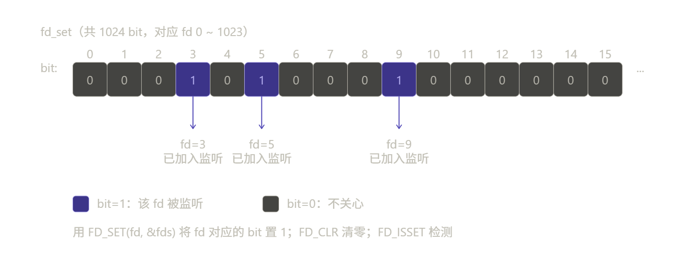
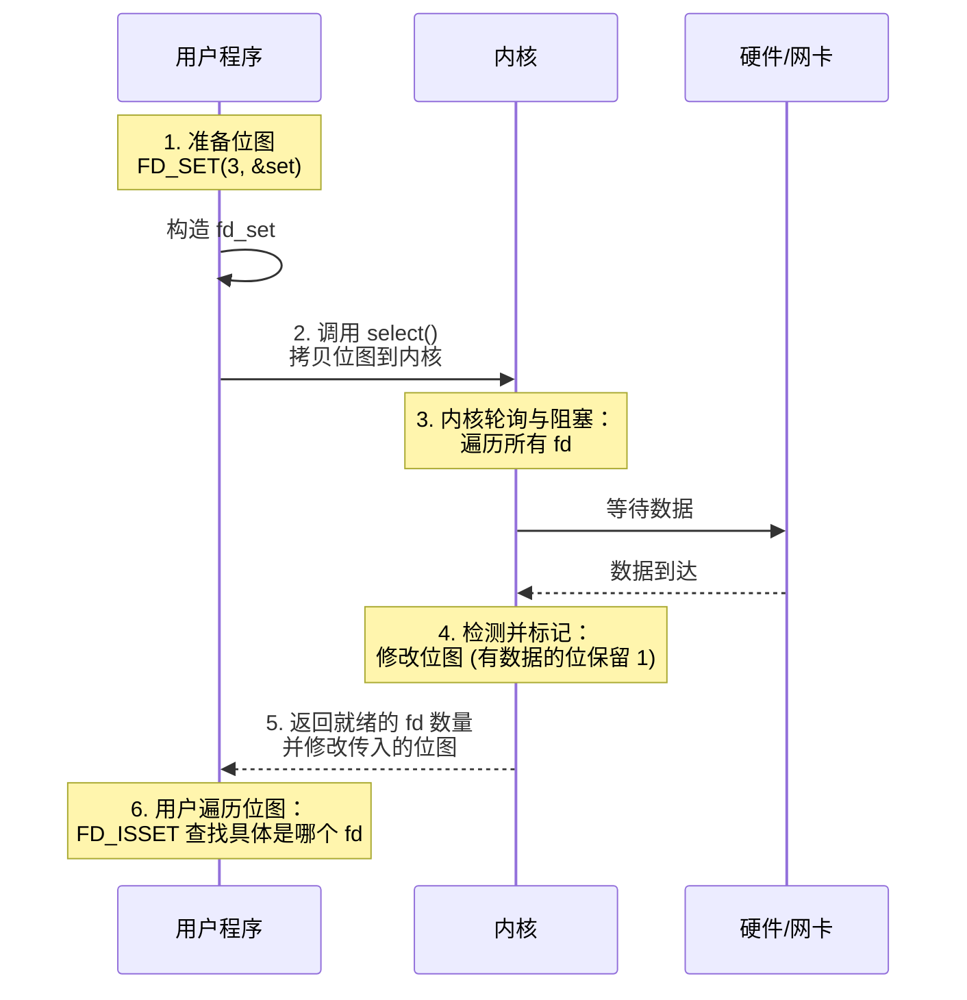
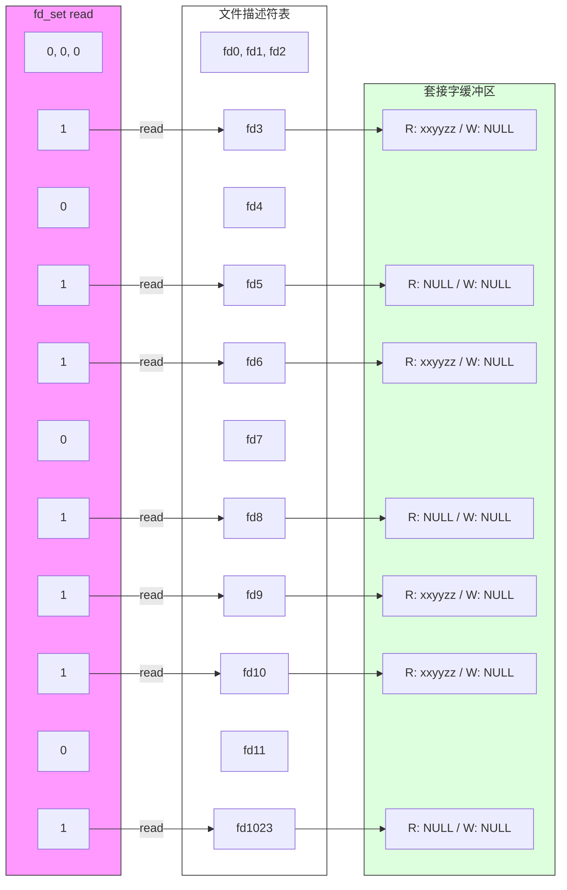

> [!abstract] select：I/O 多路复用的基石
> `select` 是 Unix/Linux 系统中最早的 I/O 多路复用机制。虽然在高性能场景（如 C10K 问题）下它已被 `epoll` 取代，但 `select` 的设计原理是理解整个 I/O 多路复用家族（`poll`、`epoll`）的必经之路。而且它具有良好的跨平台性（Windows/Linux/Mac 均支持）。

---

# 1. 核心数据结构：位图 (`fd_set`)

> [!note] 位图
> 核心逻辑：用 1 个 bit 的状态（0 或 1）来映射一个对应资源的状态。
> - **空间压缩**：用 1 个字节就能表示 8 个资源的状态，极大地节省了内存。
> - **偏移量映射**：第 $i$ 位（bit）直接对应第 $i$ 个资源。

`select` 的核心机制是基于**位图**来管理文件描述符（fd）。它不维护复杂的数据结构，而是用一个二进制位来代表一个 Socket。

**映射关系**：第 $n$ 位表示数值为 $n$ 的文件描述符。比如 bit 3 为 1，代表你在监控 `fd = 3` 的那个 Socket。
**生存周期**：它是**瞬时**的。每次调用 `select` 前，你都要重置它；调用返回后，内核会修改它来告诉你哪些 fd 就绪了。
**长度限制**：在 Linux 中，它通常是一个固定长度的数组（如 `long fds_bits[1024 / 64]`），这就是为什么会有 1024 的数量限制。

## 1.1 `fd_set` 结构示意

`select` 用一种叫 **fd_set 位图**的结构来表示“哪些 fd 需要监听”。先看清楚这个结构长什么样，假设我们监控文件描述符 3, 5, 9：



`fd_set` 本质上是一个封装了定长数组的结构体，通过位运算模拟成一个 $16 \times 8 \times 8 = 1024$ 位的位图 (Bitmap)。
- **映射关系**：每个 bit 的**索引位置**直接对应文件描述符的**数值**。
- **局限性**：由于数组长度在编译时已固定（`FD_SETSIZE`），这种结构无法处理数值超过 1023 的文件描述符，这正是 `select` 的硬伤所在。

```cpp
typedef struct fd_set {
   long __fds_bits[16];
} fd_set;
```


## 1.2 三张关键的表（输入参数）

调用 `select` 时，程序员需要准备三类位图：

1. `readfds` (读就绪集合)
	- **内核监控逻辑**：内核会检查该集合中的 fd 是否满足“可读”条件。
	- **触发场景**：
	    - **数据接收**：Socket **接收缓冲区**中有新的数据。
	    - **连接请求**：对于监听中的 Socket (Listen fd)，有新的客户端连接到来。
	    - **连接断开**：对端关闭连接（此时读操作会返回 0）。

> **注意**：此集合既是输入参数，也是输出结果。内核会修改此位图，仅保留真正已就绪的 fd。

2. `writefds` (写就绪集合)
	- **内核监控逻辑**：检查该集合中的 fd 是否具备发送数据的空间。
	- **触发场景**：
	    - **缓冲区可用**：Socket 的**发送缓冲区**未满，可以容纳更多数据进行发送。
	    - **异步连接成功**：非阻塞 `connect` 调用成功完成。

> **注意**：通常在没有数据要发送时，不应将 fd 放入此集合，否则 `select` 会因发送缓冲区始终可用而立即返回（产生空转）。

3. `exceptfds` (异常就绪集合)
	- **内核监控逻辑**：检查该集合中的 fd 是否发生了带外（Out-of-band）数据或其他特定的异常状态。
	- **触发场景**：
	    - **带外数据**：接收到了 TCP 紧急数据（紧急标志 URG 置位）。
	    - **特定状态变化**：某些伪终端或特殊的设备驱动状态变更。

> **注意**：此集合**并不负责**捕获通用的网络错误（如连接被拒绝或重置），那些通常被归类为“读就绪”或“写就绪”。

---

# 2. 执行流程：从调用到返回

`select` 的执行过程是一个典型的“用户态-内核态”交互过程。我们可以将其拆解为五个关键步骤。



## 2.1 步骤详解

1.  **准备阶段（用户态）**：
    用户程序创建 `fd_set` 变量，使用 `FD_ZERO` 清空，然后使用 `FD_SET` 将关心的 fd 置 1。

2.  **拷贝阶段（用户态 -> 内核态）**：
    调用 `select` 函数。内核将这三张位图从用户空间内存拷贝到内核空间内存。
 
> [!warning] 注意
> 这是一次开销较大的内存拷贝。

3.  **轮询与阻塞（内核态）**：
    内核会遍历传入的位图，检查每个 fd 对应的状态。
    - 如果没有任何 fd 就绪，当前进程**进入睡眠（阻塞）**，让出 CPU。
    - 当网卡收到数据并触发中断，或者超时时间到，内核唤醒进程。

4.  **修改与返回（内核态 -> 用户态）**：
    唤醒后，内核会**再次遍历**位图，找出哪些 fd（添加到集合中被监控的 fd）真的就绪了，并将位图中未就绪的 fd 位清零（置为 0），保留就绪的 fd 位为 1。

> [!bug] 参数的“破坏性”修改
> `select` 是一个**输入输出参数**（Input/Output Parameter）。内核会**直接修改**你传进去的 `fd_set`。这意味着在 `select` 返回后，传入的位图仅代表“当前就绪状态”，原本的“监控意图”已遭破坏。所以开发者必须在循环外部维护一个 **Master Set (主集)**，并在每次迭代开始时，通过内存拷贝将其复制到 **Working Set (工作集)** 中传入。

5.  **遍历处理（用户态）**：
    `select` 函数返回一个整数 `n`，表示有多少个 fd 就绪。但 `select` **不告诉你具体是哪几个**。你需要写一个 `for` 循环，从 0 遍历到 `fd_max`，使用 `FD_ISSET` 逐个检查。

---

# 3. API 操作

## 3.1 位图操作

`select` 本身是一个系统调用，但操作位图的宏定义在 C 标准库中。

| 宏 | 功能 | 作用 |
| :--- | :--- | :--- |
| `FD_ZERO(fd_set *set)` | **清空** | 将位图所有位置 0。**必须在使用前调用**。 |
| `FD_SET(int fd, fd_set *set)` | **添加** | 将 fd 对应的位置置为 1（加入监控集合）。 |
| `FD_CLR(int fd, fd_set *set)` | **移除** | 将 fd 对应的位置置为 0（从监控集合移除）。 |
| `FD_ISSET(int fd, fd_set *set)` | **判断** | 检查 fd 对应位是否为 1。**`select` 返回后使用此宏检测具体是哪个 fd**。 |

> `FD_SET(fd, &fds)` 的本质是根据 `fd` 计算出其在数组中的偏移量，并将对应的 bit **置为 1**。

## 3.2 select 函数

`select(...)` 函数：

```cpp
#include <sys/select.h>

int select(int nfds, 
           fd_set *readfds, 
           fd_set *writefds, 
           fd_set *exceptfds, 
           struct timeval *timeout);
```

- **nfds**：监控的**最大的 fd 值 + 1**。它定义了内核在三个位图中扫描的 bit 位数上限。

> [!note]
> 加 1 是因为文件描述符是从 0 开始的。如果你监控的最高 `fd` 是 5，内核就需要扫描 0, 1, 2, 3, 4, 5 这**六个位置**，所以参数必须是 6。

- **readfds**：文件描述符的集合, 内核只检测这个集合中文件描述符对应的**读缓冲区**。读集合一般情况下都是需要检测的，这样才知道通过哪个文件描述符接收数据
- **writefds**：文件描述符的集合, 内核只检测这个集合中文件描述符对应的**写缓冲区**。
- **exceptfds**：文件描述符的集合, 内核检测集合中文件描述符是否有**异常状态**。
- **timeout**：超时时长，用来强制解除 `select(...)` 函数的阻塞的。
	- NULL：函数检测不到就绪的文件描述符会一直**阻塞**，直到检测到就绪的文件描述符。
	- 等待固定时长（秒）：函数检测不到就绪的文件描述符，在指定时长之后强制解除阻塞，函数返回 0。
	- 不等待：函数不会阻塞，直接将该参数对应的结构体初始化为 0 即可。
- **返回值**：
	- `-1`：调用失败。常见原因：`EBADF`（无效 fd）、`EINTR`（被信号中断）、`EINVAL`（nfds 越界）。
	- `0`：在任何 fd 就绪之前，设定的时间窗口已耗尽（超时）。
	- `n`（n > 0）：所有集合中 **已就绪事件（bit 位为 1）的总数**。需配合 `FD_ISSET` 逐一排查具体 fd。

> 当 select(...) 函数被调用成功之后，这三个参数指针（`readfds`、`writefds`、`exceptfds`）指向的内存地址会被内核进行修改。

下图中的 fd_set 中存储了要委托内核检测**读缓冲区**的文件描述符集合。
- 如果集合中的标志位为 0 代表不检测这个文件描述符状态；
- 如果集合中的标志位为 1 代表检测这个文件描述符状态。



内核在遍历这个读集合的过程中，如果被检测的文件描述符对应的读缓冲区中没有数据，内核将修改这个文件描述符在读集合 `fd_set` 中对应的标志位，改为 0，如果有数据那么这个标志位的值不变，还是1。

显然：`fd3`、`fd6`、`fd9`、`fd10` 对应的位仍然是 1，其他位设为 0。

当 `select(...)` 函数解除阻塞之后，被内核修改过的读集合通过参数传出，此时集合中只要标志位的值为 1，那么它对应的文件描述符肯定是就绪的，我们就可以基于这个文件描述符和客户端建立新连接或者通信了。

## 3.3 监控超时时间

```cpp
struct timeval {
    long tv_sec;     /* seconds */
    long tv_usec;    /* microseconds */
};
```

- 设置 timeval 里时间均为 `0`：非阻塞，检查描述字后立即返回。
- 设置 `>0`：等待指定的时间。

---

# 4. select 实战

## 4.1 代码实现

服务端代码：

```cpp
/**
 * @File    :   src/server.cpp
 * @Time    :   2026/04/16 22:08:16
 * @Author  :   loskyertt
 * @Github  :   https://github.com/loskyertt
 * @Desc    :   .....
 */

#include "logger/logger.h"
#include "socket/server_socket.h"
#include "socket/socket.h"

#include <bits/types/struct_timeval.h>
#include <sys/select.h>
#include <sys/types.h>
#include <unistd.h>
#include <cstring>
#include <print>
#include <string>

using namespace sky::socket;
using namespace sky::utility;

int main() {
  // 初始化日志
  Singleton<Logger>::getInstance().open("log/server.log");

  // 创建服务器监听套接字
  ServerSocket server("127.0.0.1", 8080);
  int listen_fd = server.getSocketFd();

  // 初始化文件描述符集合
  fd_set fds;               // 主文件描述符集合
  FD_ZERO(&fds);            // 清空集合
  FD_SET(listen_fd, &fds);  // 添加监听套接字
  fd_set read_fds;          // 临时文件描述符集合，用于 select

  int max_fd = listen_fd;  // 所有需要监听的文件描述符中的最大

  // 主事件循环
  while (true) {
    // ===== 准备 select 参数 =====
    read_fds = fds;    // 复制主集合到临时集合，因为 select 会修改这个集合
    timeval tv{5, 0};  // 5 秒超时

    // ===== 等待 I/O 事件 =====
    int ready_count = select(max_fd + 1, &read_fds, nullptr, nullptr, &tv);
    // select 调用前：read_fds 包含所有监听的 fd
    // select 调用后：read_fds 只包含可读的 fd
    // 所以必须从主集合 fds 重新复制

    // ===== 处理 select 结果 =====
    if (ready_count < 0) {
      Log_error("select error: errno=%d errmsg=%s", errno, strerror(errno));
      break;
    } else if (ready_count == 0) {
      Log_debug("select timeout");
      continue;
    }
    Log_debug("select ok: ready_count=%d", ready_count);

    // 接受连接请求, 这个调用不阻塞
    // 如果有新连接，listen_fd 在 read_fs 中会被位置 1
    if (FD_ISSET(listen_fd, &read_fds)) {
      // 处理新连接
      Log_debug("New connection request on listen_fd=%d", listen_fd);

      int conn_fd = server.accept();
      if (conn_fd < 0) {
        continue;
      }
      // 得到了有效的文件描述符
      // 通信的文件描述符添加到主集合
      // 在下一轮 select 检测的时候, 就能得到缓冲区的状态
      FD_SET(conn_fd, &fds);
      // 重置最大的文件描述符
      max_fd = std::max(max_fd, conn_fd);

      Log_info("New client connected: conn_fd=%d, max_fd=%d", conn_fd, max_fd);
    }

    // 处理已连接的客户端
    for (int fd = 0; fd <= max_fd; fd++) {
      // 判断从监听的文件描述符之后到 max_fd 这个范围内的文件描述符是否读缓冲区有数据
      if (fd != listen_fd && FD_ISSET(fd, &read_fds)) {
        // 处理客户端数据
        Log_debug("Client data available on fd=%d", fd);

        Socket client_conn(fd);
        client_conn.setRelease();  // 释放所有权，析构函数不再 close(fd)
        char buf[1024] = {0};
        // 一次只能接收 1024 个字节, 如果客户端一次发送 2000 个字节，
        // 一次是接收不完的, 因此文件描述符对应的读缓冲区中还有数据，
        // 下一轮 select 检测的时候, 内核还会标记这个文件描述符缓冲区有数据 -> 再读一次
        // 循环会一直持续, 直到缓冲区数据被读完位置

        ssize_t bytes_read = client_conn.recv(buf, sizeof(buf));

        if (bytes_read == 0) {
          // 客户端关闭连接
          Log_info("Client disconnected: fd=%d", fd);
          // 将检测的文件描述符从读集合中删除
          FD_CLR(fd, &fds);
          client_conn.close();  // 手动关闭
        } else if (bytes_read > 0) {
          std::println("Received {} bytes from fd={}, data={}", bytes_read, fd, std::string(buf));

          // 向客户端发送数据
          std::string new_data = "Echo: " + std::string(buf);
          client_conn.send(new_data.c_str(), new_data.size());
        } else {
          Log_error("recv error: errno=%d errmsg=%s", errno, strerror(errno));
        }
      }
      // 虽然超出这个 if 的作用域后，client_conn 这个对象会被销毁，但这个对象只是内核连接的包装器
      // 同时由于我们调用了 setRelease()，所以析构函数不会关闭文件描述符，文件描述符在内核中仍然有效
      // 真正的连接是由内核管理，通过文件描述符访问
    }
  }

  return 0;
}
```

客户端代码（后续的 poll 和 epoll 都将复用这段客户端的代码）：

```cpp
/**
 * @File    :   src/socket/examples/client.cpp
 * @Time    :   2026/04/14 20:29:25
 * @Author  :   loskyertt
 * @Github  :   https://github.com/loskyertt
 * @Desc    :   .....
 */

#include "logger/logger.h"
#include "socket/client_socket.h"

#include <iostream>
#include <string>
#include <print>

using namespace sky::socket;
using namespace sky::utility;

int main() {
  Singleton<Logger>::getInstance().open("log/client.log");

  ClientSocket client("127.0.0.1", 8080);

  // 通信
  while (true) {
    std::println("client_fd={}, Please input data:", client.getSockFd());
    std::string data;
    std::getline(std::cin, data);

    // 发送数据
    client.send(data.c_str(), data.size());

    // 接收数据
    char buf[1024] = {0};
    client.recv(buf, sizeof(buf));
    std::println("Received data from server: {}", std::string(buf));
  }
}
```

在看懂这段代码之前，需要理解这两个基本概念：
- **服务器永远只有一个 `listen_fd`，但它会产生无数个不同的 `conn_fd`**。
- **新连接的到来，会导致初始的 `listen_fd` 变为“可读”状态**。

> [!note] 监听套接字（listen_fd）的唯一性
> 当你执行 `ServerSocket server("127.0.0.1", 8080);` 时，内核为你创建了一个结构。这个 `listen_fd` **指向的结构**其实是一个“**全连接队列**（Accept Queue）”（可以把 `listen_fd` 当成这个队列的大门），只要这个**队列里有**已经完成 TCP 三次握手的客户端，`listen_fd` 就会被标记为**可读（Ready to Read）**（大门开启）。

## 4.2 程序模拟

### 4.2.1 模拟：当第一个客户端连接时

#### 状态 A：完全没有连接

- **`fds` 内容**：`{3}`（假设 `listen_fd` 是 3）。
- **内核行为**：`select` 检查 3 号 FD 指向的“**全连接队列**”。队列为空，`select` 阻塞（这里设定的是 `5` 秒没查询到，就重新执行 while 循环）。

#### 状态 B：客户端 A 发起连接（三次握手完成）

- **内核行为**：内核将客户端 A 的**连接信息**（一个包含很多信息的结构体）放入 3 号 FD 指向的“全连接队列”。
- **状态翻转**：因为队列不再为空，内核将 `read_fds` 位图中第 3 位设为 **1**。`select` 返回。

#### 状态 C：执行 `accept`

```cpp
int conn_fd = server.accept(); 
```

这时候，`accept` 并不是创建了一个新的监听器。它是从 3 号 FD 的“全连接队列”里**取出一个已经建好的连接**，并为这个特定的连接分配一个新的文件描述符（假设是 `4`）。

> [!note] 再概括性地模拟一下这个过程
> - **第一个客户端连接**：内核把连接信息放入队列，`listen_fd` 在位图中的位置置为 1。
> - **你调用了 `accept()`**：这个动作非常关键，它从队列中**取走**了那个连接实体。
> - **队列状态改变**：如果没有第二个客户端在排队，此时 `listen_fd` 的全连接队列就**变空了**。
> - **再次调用 `select`**：内核检查 `listen_fd` 的队列，发现是空的。那么在返回给你的 `read_fds` 中，第 3 位（`listen_fd`）就会被**抹成 0**。

**结果**：
- `listen_fd` (3) 依然存在，继续守在大门口等下一个连接，没有新连接的话，`listen_fd` 的“全连接队列”就为空，那 `listen_fd` 对应的 bit 位就为 0。
- `conn_fd` (4) 诞生了，它专门负责和客户端 A “聊天”。

### 4.2.2 模拟：当第二个客户端连接时

1. **准备阶段**：你执行 `FD_SET(4, &fds)`。现在 `fds` 是 `{3, 4}`。
2. **调用 `select`**：内核盯着 3（大门）和 4（客户端 A）。
3. **客户端 B 接入**：
    - 3 号 FD 的“全连接队列”又多了一个人。
    - 内核把 `read_fds` 的第 3 位设为 **1**。
    - 注意：此时第 4 位通常是 **0**（除非客户端 A 刚好也发了消息）。
4. **程序动作**：`FD_ISSET(3, &read_fds)` 再次成立。
5. **再次 `accept`**：内核返回一个新的 `conn_fd = 5`。

---

# 5. `select` 的缺陷

> [!question] 为什么高性能服务器（如 Nginx、Redis）在 Linux 下不用 `select`？

## 5.1 监控数量限制 (1024 Ceiling)

`fd_set` 是一个固定大小的位图。虽然理论上可以重新编译内核修改，但在大多数系统中，`FD_SETSIZE` 默认为 **1024**。这就会导致一个进程最多只能处理 1024 个并发连接。对于 C10K（1万并发）场景完全不够用。

## 5.2 性能随连接数线性下降 (O(n))

这是 `select` 最致命的性能问题。

1.  **内核开销**：每次调用 `select`，内核都需要遍历 `0` 到 `nfds` 的所有 fd，哪怕这 1000 个连接里只有 1 个有数据。这是 **O(n)** 的复杂度。
2.  **用户态开销**：`select` 返回后，只告诉了你“有几个”好了，没告诉你是“哪几个”。应用程序必须再次遍历 `0` 到 `nfds`，用 `FD_ISSET` 逐个检查。这也是 **O(n)**。

> [!info] 空转浪费
> 假设你有 1000 个连接，只有第 1000 号连接来了数据。
> - 内核白白检查了前 999 个。
> - 用户程序也白白检查了前 999 个。
> - 随着并发数增加，CPU 都浪费在无效的检查上。

## 5.3 频繁的内存拷贝

每次调用 `select`，都需要把要交给内核监听的 `fd_set` **从用户态拷贝到内核态**。对于高频调用的网络程序来说，这部分内存带宽消耗不容忽视。此外，由于 `select` 会修改传入的参数，导致每次循环调用前都要重置位图，增加了用户态的代码复杂度和 CPU 消耗。

> 这里的拷贝操作是从**系统底层**视角来看的，是系统调用触发了**跨越权限边界的内存拷贝**。由于 `select` 的无状态设计，内核无法记忆你的监控意图，迫使你每一轮循环都必须进行“用户态 $\rightarrow$ 内核态 $\rightarrow$ 用户态”的双向拷贝。
