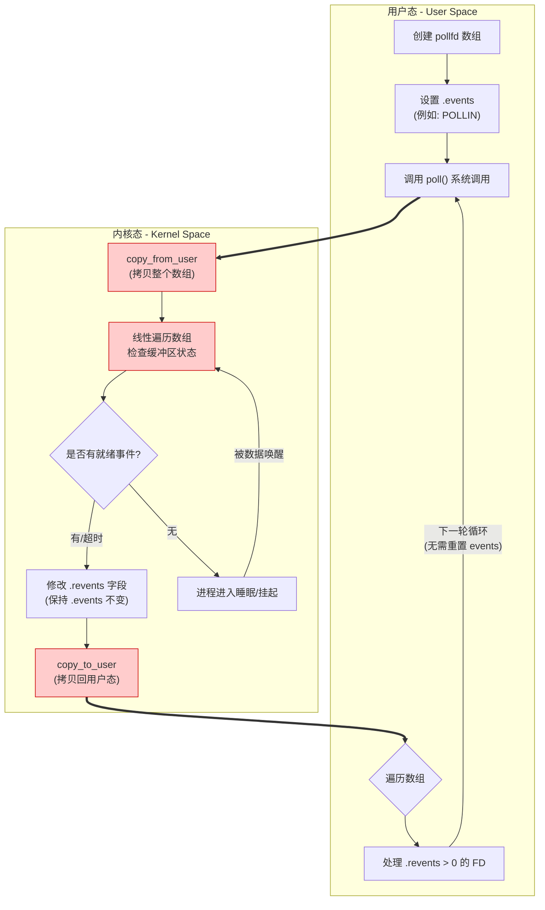

> [!abstract] 实际上 `poll` 的机制与 `select` 类似，与 `select` 在本质上没有多大差别，使用方法也类似。

# 1. select VS poll

下面的是对于二者的对比：
- 内核对应文件描述符的检测也是以线性的方式进行轮询，根据描述符的状态进行处理。
- `poll` 和 `select` 检测的文件描述符集合会在检测过程中频繁的进行用户区和内核区的拷贝，它的开销随着文件描述符数量的增加而线性增大，从而效率也会越来越低。
- `select` 检测的文件描述符个数上限是 $1024$，`poll` 没有最大文件描述符数量的限制。
- `select` 可以跨平台使用，`poll` 只能在 Linux 平台使用。

| 特性 | `select` | `poll` |
| :--- | :--- | :--- |
| **底层数据结构** | 位图 | 结构体数组 (`pollfd`) |
| **最大连接数** | **有限制** (默认 1024) | **无限制** (取决于系统资源) |
| **事件类型** | 读、写、异常 (3 个参数) | 读、写、异常、优先级等 (统一为 flags) |
| **参数维护** | **需重置** (内核会修改参数) | **无需重置** (仅修改 `revents`) |
| **跨平台性** | 极好 (Windows/Linux/Mac) | 较好 (Linux/Mac) |
| **时间复杂度** | $O(n)$ | $O(n)$ |

> [!note]
> 从上面的描述不难看出，在实际生产环境中，基本上是不会考虑使用 `poll` 的，因为 `select` 有跨平台性（Windows 上也支持），因此在特定场景下不可替代。而 `poll` 没有跨平台性这个特点，且效率远低于 `epoll`，所以 `poll` 一般也就用在教学中。

# 2. 核心数据结构：“结构体数组”

> `select` 强制使用三个固定长度的位图（`fd_set`），而 `poll` 允许用户传递一个由 `struct pollfd` 组成的**动态数组**。

`struct pollfd` 定义于 `<poll.h>` 中，`poll` 的核心在于实现了**输入输出参数的分离**。

```cpp
struct pollfd {
    int   fd;
    short events;
    short revents;
};
```

**参数说明**：
- `fd`：委托内核检测的文件描述符。
- `events`：**输入参数**，关注的事件掩码（本质是一组位标志），即委托内核检测文件描述符的什么事件。比如：POLLIN（有数据可读），POLLOUT（写数据不会阻塞），POLLERR（错误事件），POLLHUP（挂起事件）等。
- `revents`：**输出参数**，文件描述符实际发生的事件掩码（本质是一组位标志），由内核填充。

**这种结构有三大设计优势**：

1.  **突破 1024 连接数限制**
    由于不再使用固定大小的位图，而是传递**数组指针和长度**，理论上 `poll` 可以监控任意数量的文件描述符（仅受系统内存和 `ulimit -n` 的限制）。

2.  **输入输出分离**
    `events` 用于告诉内核“我关心什么”，`revents` 用于内核告诉程序“发生了什么”。
    - **优势**：`select` 会破坏传入的参数，每次循环都需要重新初始化；而 `poll` 只修改 `revents`，`fd` 和 `events` 在循环中保持不变，代码逻辑更简洁。

3.  **统一错误处理**
    `select` 需要三个独立的集合（读、写、异常）和一个额外的 `exceptfds`；`poll` 将所有事件（包括异常）都统一在 `events`/`revents` 的标志位中，无需单独处理异常集合。

---

# 3. 常用事件标志位

在使用 `poll` 时，必须熟练掌握以下宏，这些宏在内核头文件中被定义为不同的二进制位，用于设置 `events` 和检查 `revents`。

| 宏定义 | 含义 | 用途 |
| :--- | :--- | :--- |
| `POLLIN` | 有数据可读（普通数据或优先带外数据） | **最常用**：监听 Socket 可读或新连接。 |
| `POLLOUT` | 有数据可写（发送缓冲区未满） | 监听 Socket 是否可以发送数据。 |
| `POLLERR` | 发生错误 | 检查 Socket 是否出错（如连接重置）。 |
| `POLLHUP` | 对方关闭连接（挂起） | 检测对端是否已关闭（此时通常仍可读数据）。 |
| `POLLNVAL` | 请求无效（如 fd 未打开） | 检查文件描述符是否合法。 |

> [!tip] 用“或”操作（`|`）表示**组合开关**。

`POLLIN` 和 `POLLOUT` 在内核头文件中被定义为不同的二进制位。假设：
- `POLLIN` 的二进制是 `0000 0001` (十进制 1)
- `POLLOUT` 的二进制是 `0000 0100` (十进制 4)

当你执行 `events = POLLIN | POLLOUT` 时，实际上是在做一个**合并**操作：

```
  0000 0001 (POLLIN)
| 0000 0100 (POLLOUT)
-----------
  0000 0101 (结果)
```

**逻辑含义**：你告诉内核：“我既关心读（第 0 位），也关心写（第 2 位）。” 这个整数现在就像一个**面板**，上面有两个开关都被拨到了“开启”位置。

> [!tip] 用“与”操作（`&`）表示**精准嗅探**

当 `poll` 返回时，内核会修改 `revents`。由于 `revents` 可能同时包含多个状态（比如既可读又可写，或者报错了），你不能用 `==` 来判断。

如果你用 `if (fds[i].revents == POLLIN)`，但此时 `revents` 的值是 `0000 0101`（可读且可写），这个判断就会失效，因为 `5 != 1`。

因此必须使用 **按位与 (`&`)** 来屏蔽掉其他不相关的位，只看你关心的那一项：

```
  0000 0101 (内核返回的 revents：可读且可写)
& 0000 0001 (你关心的 POLLIN)
-----------
  0000 0001 (结果不为 0，说明 POLLIN 位是 1)
```

**逻辑含义**：
- 如果 `(revents & POLLIN)` 的结果 **非零**，说明“可读”这个位被勾选了。
- 如果结果为 **零**，说明“可读”这个位是干掉的，即便其他位（如错误位）是 1。

> [!tip] 设置技巧
> 通常设置 `events = POLLIN | POLLOUT` 来同时关心读写事件。
> 检查时使用 `if (fds[i].revents & POLLIN)` 判断是否可读。

---

# 4. 函数原型

```cpp
#include <poll.h>

int poll(struct pollfd *fds, nfds_t nfds, int timeout);
```

**参数说明**：
- **`fds`**：指向 `struct pollfd` 数组的首地址。
- **`nfds`**：数组中元素的**数量**，即监控的**最大的 fd 对应的数组下标值 + 1**。
- **`timeout`**：超时时间，单位是**毫秒**。
    - **`-1`**：永久阻塞，直到有事件发生。
    - **`0`**：非阻塞，立即返回（轮询模式）。
    - **`>0`**：等待指定的毫秒数。

**返回值**：
- **`> 0`**：数组中 `revents` 不为 0 的 `pollfd` 结构体的数量（即就绪的 fd 数量）。
- **`0`**：超时时间到，没有任何 fd 就绪。
- **`-1`**：出错，`errno` 会被设置（如 `EINTR` 被信号中断）。

---

# 5. 执行流程与内存视图

当调用 `poll` 函数时，内核会检查每个 `pollfd` 结构体中列出的文件描述符，看看是否有任何指定的事件发生。如果有，内核将会在 `revents` 字段中设置相应的位，以指示哪些事件已经发生。然后 `poll` 函数返回，应用程序可以检查每个 `pollfd` 结构体的 `revents` 字段来确定每个文件描述符上发生了哪些事件。



**关键点**：
- 当你调用 `poll()` 时，你需要把整个 `pollfd` 数组从你的程序内存（用户态）搬运到操作系统的内存（内核态）；当 `poll()` 返回时，内核还得把改好的结果再搬回来。这是 $O(n)$ 的空间/数据传输开销。
- 内核在接收到数组后，并不知道哪些 FD 是活跃的。它必须从数组的第 0 个元素开始，一直扫到第 $n-1$ 个元素，逐个检查每个 FD 对应的内核缓冲区（比如 TCP 接收队列）是否有数据。这是 $O(n)$ 的 CPU 时间开销。
- 在 `pollfd` 结构体中，`events`（你的期待）和 `revents`（内核的结果）是两个不同的字段。内核只会修改 `revents`。这是 `poll` 优于 `select` 的地方。
	- 在 `select` 中，位图被内核原地覆盖，所以你必须在 `while` 循环里重复 `FD_SET`（步骤很繁琐）。
	- 在 `poll` 中，只要你的监控意图没变，你就不需要重新给数组赋值，直接带着原来的 `events` 进入下一轮 `poll()` 即可。

---

# 6. poll 实战

这个示例展示了 `poll` 相比 `select` 的优势：不需要每次循环都重置关注列表。

```cpp
/**
 * @File    :   src/server.cpp
 * @Time    :   2026/04/16 22:08:16
 * @Author  :   loskyertt
 * @Github  :   https://github.com/loskyertt
 * @Desc    :   poll 示例
 */

#include "logger/logger.h"
#include "socket/server_socket.h"
#include "socket/socket.h"

#include <bits/types/struct_timeval.h>
#include <poll.h>
#include <sys/types.h>
#include <unistd.h>
#include <algorithm>
#include <cstring>
#include <print>
#include <string>

using namespace sky::socket;
using namespace sky::utility;

int main() {
  // 初始化日志
  Singleton<Logger>::getInstance().open("log/server.log");

  // 创建服务器监听套接字
  ServerSocket server("127.0.0.1", 8080);
  int listen_fd = server.getSocketFd();

  // === 循环等待连接 ===
  // 数据初始化, 创建自定义的文件描述符集
  struct pollfd fds[1024];
  for (int i = 0; i < 1024; ++i) {
    fds[i].fd = -1;
    fds[i].events = POLLIN;  // 检测读缓冲区, 委托内核去处理
  }

  fds[0].fd = listen_fd;
  int max_idx = 0;  // 在结构体数组中的目前最大下标是 0

  // 主事件循环
  while (true) {
    // 调用 poll 等待事件
    int ret = poll(fds, static_cast<nfds_t>(max_idx) + 1, -1);  // -1 表示永久阻塞，直到有事件发生
    if (ret < 0) {
      Log_error("poll error: errno=%d errmsg=%s", errno, strerror(errno));
      break;
    }

    // 检查监听套接字是否有事件，第 0 号位置始终对应的是 listen_fd
    if (fds[0].revents & POLLIN) {
      // 有新连接
      int conn_fd = server.accept();
      if (conn_fd < 0) {
        continue;
      }

      // 找到空闲位置
      for (int i = 0; i < 1024; ++i) {
        if (fds[i].fd == -1) {
          fds[i].fd = conn_fd;
          max_idx = std::max(max_idx, i);
          break;
        }
      }
    }

    // 通信, 有客户端发送数据过来
    for (int i = 1; i <= max_idx; ++i) {
      if (fds[i].fd != -1 && (fds[i].revents & POLLIN)) {
        Socket client_conn(fds[i].fd);
        client_conn.setNonBlocking();
        client_conn.setRelease();

        // 有数据可读
        char buffer[1024];
        ssize_t bytes_read = client_conn.recv(buffer, sizeof(buffer));
        if (bytes_read == 0) {
          // 客户端关闭连接
          Log_info("Client disconnected: fd=%d", fds[i].fd);
          // 将检测的文件描述符从读集合中删除
          client_conn.close();  // 手动关闭
          fds[i].fd = -1;
        } else if (bytes_read > 0) {
          std::println("Received {} bytes from fd={}, data={}", bytes_read, fds[i].fd, std::string(buffer));

          // 向客户端发送数据
          std::string new_data = "Echo: " + std::string(buffer);
          client_conn.send(new_data.c_str(), new_data.size());
        } else {
          Log_error("recv error: errno=%d errmsg=%s", errno, strerror(errno));
        }
      }
    }
  }

  return 0;
}
```

---

# 7. poll 的缺陷

虽然 `poll` 修复了 `select` 的一些 API 设计缺陷，但它并没有解决高并发下的性能核心问题。

## 7.1 $O(n)$ 的线性时间复杂度

这是 `poll` 和 `select` 的共同瓶颈。
- **用户态开销**：当 `poll` 返回时，你不知道具体是哪些 fd 就绪，必须遍历整个 `poll_fds` 数组（长度 $n$）检查 `revents`。
- **内核态开销**：内核在底层也必须遍历所有的注册 fd 来检查状态。

**场景模拟**：假设有 10,000 个连接，只有 1 个活跃（发了数据）。
- `poll` （内核）必须检查 10,000 个 fd。
- 有效工作量仅为 1/10000。
- 随着连接数增加，CPU 消耗线性增长，导致“惊群”或负载过高。

## 7.2 频繁的内存拷贝

虽然 `poll` 的数组比 `select` 的位图更灵活，但每次调用依然需要将整个数组从用户态拷贝到内核态。对于海量连接，这也是一笔不可忽视的上下文切换和带宽开销。
