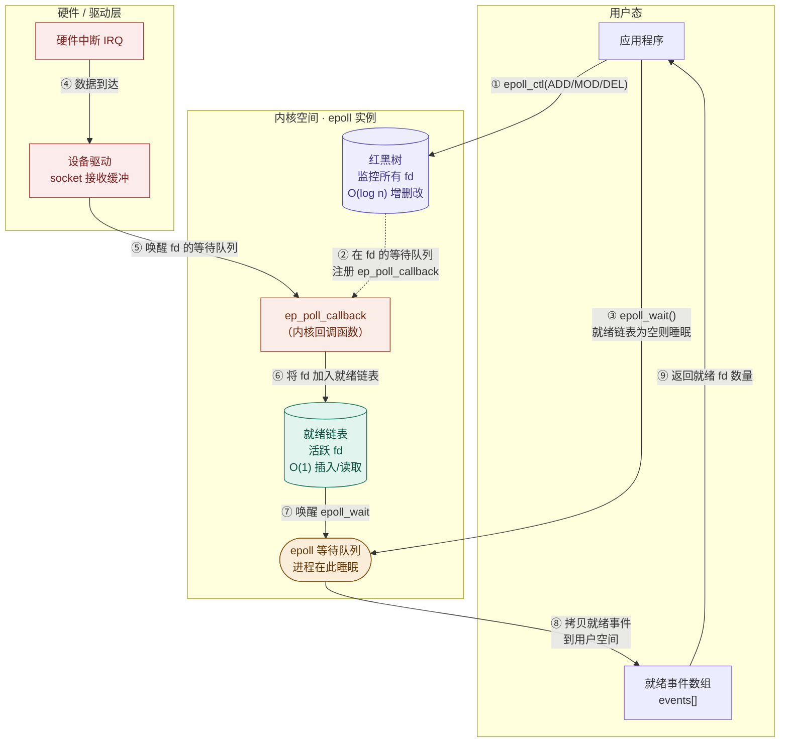
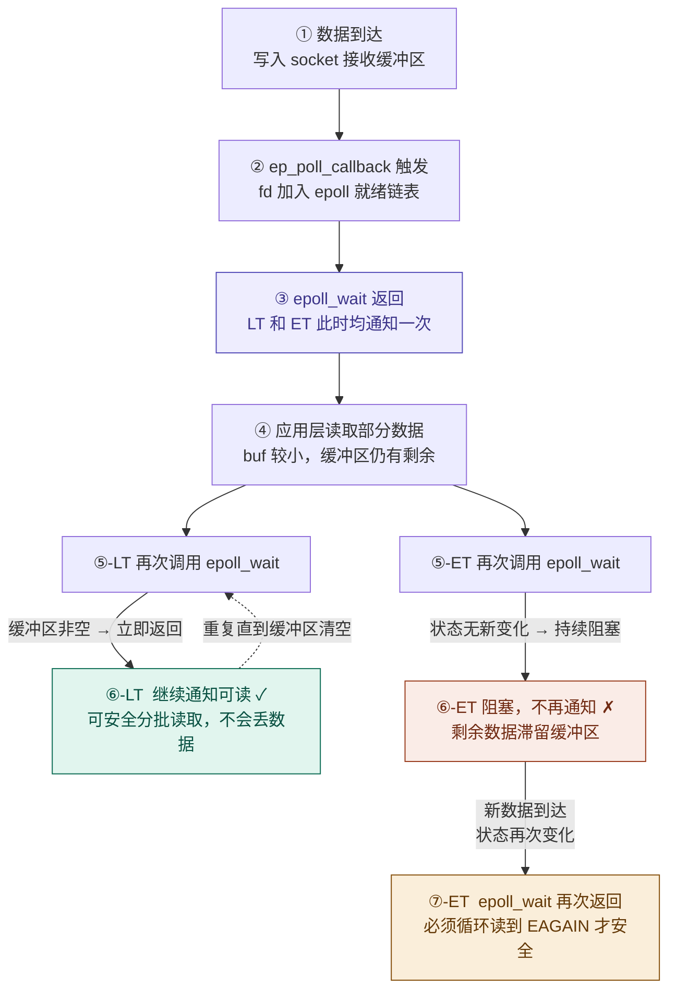

> [!abstract] 
> `epoll`（Event Poll）是 Linux 内核特有的 I/O 多路复用机制，专为解决 C10K（单机同时处理一万个并发连接）问题而设计。
> **核心定义**：`epoll` 是一种基于**事件驱动**、利用**回调机制**、在内核态与用户态之间进行高效交互的异步 I/O 通知机制。
> 相比于 `select` 和 `poll` 的“轮询”模式，`epoll` 采用了“订阅-通知”模式，这使得它在处理海量并发连接（其中绝大多数是空闲连接）时，性能不会随连接数的增加而线性下降。

---

# 1. epoll 的红黑树与就绪链表

`epoll` 的高性能源于内核中维护的两个关键数据结构：**红黑树**与**就绪链表**。

## 1.1 结构详解

在 Linux 内核源码中，一个 **`epoll` 实例**对应一个 **`struct eventpoll` 结构体**。简化后大致长这样：

```cpp
struct eventpoll {
    spinlock_t       lock;       // 自旋锁，保护就绪链表
    struct mutex     mtx;        // 互斥锁，保护红黑树
    wait_queue_head_t wq;        // epoll_wait 睡眠的等待队列
    struct rb_root_cached rbr;   // 红黑树：存储所有被监控的 fd
    struct list_head  rdllist;   // 就绪链表：存储活跃的 fd
    // ... 其他字段
};
```

它主要由**两个核心数据结构**组成：

1. **红黑树**
	- **存储内容**：所有被监控的文件描述符（FD）。
	- **作用**：通过 `epoll_ctl` 添加、删除或修改 FD 时，内核以 $O(\log N)$ 的复杂度操作该树。这避免了每次调用都要把所有 FD 拷贝到内核。

> 比如当你调用 `epoll_ctl(..., ADD)` 时，内核会创建一个**包装了 FD** 的节点（`struct epitem`）并插入红黑树。
	
2. **就绪链表**
    - **存储内容**：已经**发生 I/O 事件**（如可读、可写）的 FD。
    - **作用**：设备中断最终触发协议栈处理，数据到达 socket 后唤醒其等待队列，而 epoll 在添加 fd 时已经在这个等待队列上注册了专属回调（`ep_poll_callback`），这个回调负责把 fd 加入就绪链表并唤醒 `epoll_wait`

## 1.2 内存与数据流视图



---

# 2. API 说明

`epoll` 将操作清晰地拆分为三个独立的系统调用，实现了“注册”与“等待”的分离。

## 2.1 `epoll_create1`：创建实例

在现代 Linux 中，推荐使用 `epoll_create1` 替代过时的 `epoll_create`。

```cpp
int epoll_create1(int flags);
```

**功能**：在内核中创建一个 `epoll` 实例，返回**指向 `struct eventpoll` 的文件描述符**。内核会同时初始化好红黑树（用于存储监控的 fd）和就绪链表（用于存储活跃事件）。后续的 `epoll_ctl` 和 `epoll_wait` 都是对 `epfd` 该文件描述符进行操作的。

```
用户态:
    epfd = 5
        ↓
进程 fd table
        ↓
struct file
        ↓
file->private_data
        ↓
struct eventpoll
```

**参数说明**：
- `flags`：通常传入 `0`（或 `EPOLL_CLOEXEC`）。
	- `0`：无任何标志（等价于旧版 `epoll_create`），适用于确定程序永远不会创建子进程的简单脚本。
	- `EPOLL_CLOEXEC`：子进程 `exec` 后自动关闭此 fd，防止 fd 泄漏到子进程，适用于现代网络服务器、库开发（**推荐**方案）。

**返回值**：成功返回 epoll 文件描述符 `epfd`（>=0）；失败返回 -1。

> [!warning]
> `epfd` 本质上也是一个文件，用完必须 `close(epfd)`，否则会造成 fd 泄漏。

## 2.2 `epoll_ctl`：控制与注册

```cpp
int epoll_ctl(int epfd, int op, int fd, struct epoll_event *event);
```

**功能**：向 `epoll` 实例的红黑树中增加、修改或删除一个被监控的 fd。每次调用只操作**一个** fd。

**参数说明**：
- `epfd`：`epoll_create1` 返回的实例描述符。
- `op`：这是一个枚举值，控制通过该函数执行什么操作
	- `EPOLL_CTL_ADD`：注册新的 FD 到红黑树进行监控，此时 `event` 传入要**监控**的事件。
	- `EPOLL_CTL_MOD`：修改已注册 FD 的监控事件，此时 `event` 传入要**修改为**的事件。
	- `EPOLL_CTL_DEL`：从红黑树中移除 FD，此时 `event` 可传 `NULL`。
- `fd`：被监控的目标文件描述符（socket、pipe、timerfd 等，**不能是普通文件**）。
- `event`：指向 `epoll_event` 结构体的指针。

**返回值**：
- `0`：成功
- `-1`：失败，`errno` 被设置（常见：`EEXIST` 重复 ADD、`ENOENT` 对不存在的 fd 做 MOD/DEL）

**参数 `event`** 是委托 epoll 检测的事件。

```cpp
struct epoll_event {
    uint32_t     events;     // 事件掩码，即一串二进制位，表示监听的事件
    epoll_data_t data;       // 下面的这个联合体，通常用于存储 fd 或用户指针（比如要在堆内存开辟空间存放客户端的连接信息）
};

typedef union epoll_data {
    void        *ptr;
    int          fd;
    uint32_t     u32;
    uint64_t     u64;
} epoll_data_t;
```

`events` 常用掩码：

| 标志 | 触发时机 |
|---|---|
| `EPOLLIN` | fd 可读，读事件, 接收数据, 检测读缓冲区，如果有数据到达，该文件描述符就绪 |
| `EPOLLOUT` | fd 可写，写事件, 发送数据, 检测写缓冲区，如果可写，该文件描述符就绪 |
| `EPOLLERR` | fd 发生错误，异常事件（无需显式设置，自动监听） |
| `EPOLLHUP` | fd 被对端关闭（同上，自动监听） |
| `EPOLLET` | **边缘触发模式**（默认为水平触发） |
| `EPOLLONESHOT` | 事件触发一次后自动停止监听，需手动 `MOD` 重新激活 |
| `EPOLLRDHUP` | 对端关闭写端（半关闭检测，比 `EPOLLHUP` 更精确） |

### 2.2.1 epoll_ctl 的值拷贝特性

注意传入的最后一个参数 `struct epoll_event *event`，虽然从 C 语言语法上看，这里传入的是一个指向 `struct epoll_event` 类型的**指针**（地址），但从内核处理逻辑和系统调用边界来看，它执行的是**值拷贝**。

`epoll_ctl` 的内部实现类似于：

```cpp
// 伪代码
int epoll_ctl(int epfd, int op, int fd, struct epoll_event *event) {
    if (op == EPOLL_CTL_ADD) {
        // 内核会复制 event 的内容
        kernel_epoll_instance->events[fd] = *event;  // 值复制
    }
    return 0;
}
```

下面我们从“地址空间隔离”和“内核行为”两个层面来剖析：

1. **语法表现 vs 内核行为**：
	在 C 语言中，传入指针确实是为了“传址”，但在系统调用（System Call）面前，**用户态地址对内核态是不可直接访问的**。
	- **语法层**：你调用 `epoll_ctl(epfd, op, fd, &ev)`，确实传入了 `ev` 的地址。
	- **内核层**：当 CPU 切换到内核态后，内核会执行 `copy_from_user` 操作。它会根据你传入的地址，将 `struct epoll_event` 里的内容（`events` 和 `data`）**完整地拷贝一份**，存储到内核为该 FD 创建的红黑树节点（`struct epitem`）中。

> **结论**：内核并不关心你原来的那个 `&ev` 内存块后续会发生什么，它只拿走那一刻的数据。

2. **“值拷贝”的必要性**：
	如果内核不进行值拷贝，而是像普通函数那样“引用”你的地址，会发生灾难性的后果：
	- 空间隔离（Memory Isolation）：用户态的内存地址在内核看来是不可靠的。如果内核直接引用你的地址，一旦你的函数返回，栈上的 `ev` 变量被销毁或被其他数据覆盖，内核红黑树里的“监控指南”就乱套了。
	- 长期驻留的需求：`epoll_ctl` 的目的是在内核红黑树中**持久化**监控规则。
		- `select/poll` 是“临时工”：每次调用都要重新传集合。
		- `epoll` 是“登记制”：你通过 `epoll_ctl` 登记一次，内核就得在红黑树节点里**永久保存**这份配置。

因此，为了实现这种长期保存，内核必须在自己的受管内存里开辟空间，把你的配置**拷贝**进去。

正是因为内核做了值拷贝，你在编写代码时可以非常自由：

```cpp
{
    struct epoll_event ev;
    ev.events = EPOLLIN;
    ev.data.fd = conn_fd;
    
    // 调用后，内核已经把 ev 的内容存进了红黑树
    epoll_ctl(epfd, EPOLL_CTL_ADD, conn_fd, &ev); 
} 
// 超出作用域，此时 ev 变量在栈上失效了，但没关系，内核红黑树里的配置依然有效。
```

即使你随后修改了 `ev` 的值，也不会影响已经注册到内核中的监控状态。除非你再次调用 `epoll_ctl(MOD)`。

## 2.3 `epoll_wait`：等待事件

```cpp
int epoll_wait(int epfd, struct epoll_event *events, int maxevents, int timeout);
```

**功能**：阻塞调用进程，直到有 fd 就绪（或超时）。内核将**就绪链表**中的事件**批量拷贝**到用户传入的 `events` 数组，然后返回。

**参数说明**：
- `epfd`：epoll_create() 函数的返回值, 通过这个参数找到 `epoll` 实例
- `events`：这是一个**传出参数**，由调用者分配的 `epoll_event` **数组**，内核将**就绪链表**里的 `struct epoll_event` 类型数据**拷贝出**到你提供的这个数组中。
- `maxevents`：数组容量上限（修饰第二个参数），必须 `> 0`。决定单次最多取出多少个就绪事件。
- `timeout`：超时时间（毫秒）：
	- `-1`：永久阻塞，直到有事件或被信号打断；
	- `0`：立即返回（非阻塞轮询）；
	- `> 0`：等待至多 N 毫秒。

> [!note]
> 传入的 `events` 数组本质是 `epoll_wait` 的**输出缓冲区**（就绪事件列表），**不是被监控 fd 的注册表**。
> 
> ```
> m_events 的本质：
> 
> epoll_wait(epfd, m_events.data(), ...) 调用前：
>   m_events = [垃圾值, 垃圾值, 垃圾值, ...]  ← 内容无意义
> 
> epoll_wait 返回后：
>   m_events = [就绪事件1, 就绪事件2, ...]    ← 内核覆盖写入
>               |___n 个有效___|
> ```
> 下一次 `epoll_wait` 调用前，`m_events` 数组里的内容已经**没有意义**了，内核会在下次调用时再次**覆盖写入**。

**返回值**：
- `> 0`：就绪 fd 的数量（比如返回 `n` 的话，表示 `events[0..n-1]` 是就绪的 fd 事件）；`events[n]` 到 `events[maxevents-1]` 保持不变（不会被访问）。因此这个数字通常远小于总连接数。
- `0`：超时，没有就绪事件。
- `-1`：出错（若被信号打断则 `errno == EINTR`，需重试）。

---

# 3. epoll 的性能优势

相较于 `select` 和 `poll`，`epoll` 并不是简单的优化，而是架构上的革新，主要体现在以下个维度的对比：

## 3.1 集合管理与检索效率

- **Select/Poll**：使用**线性结构**（数组/位图）存储文件描述符（FD）。每次调用时，内核都需要**线性扫描**整个集合来检查就绪状态。由于扫描复杂度为 $O(n)$，效率随集合规模增大而线性下降。

- **Epoll**：在内核中使用**红黑树**（RB-Tree）管理监控集合。通过 FD 作为键值，实现 $O(\log n)$ 级别的增删改查效率。这种结构保证了即使在监控百万级连接时，维护集合的性能依然稳定。

## 3.2 就绪检测机制（核心差异）

- **Select/Poll**：基于**轮询**（Polling）机制。内核并不知道哪个 FD 有数据，必须在被唤醒后遍历一遍。

- **Epoll**：基于**事件回调**（Event-driven Callback）机制。每个 FD 注册时都会与内核协议栈挂钩。一旦数据到达，内核通过回调函数直接将就绪 FD 放入**就绪链表**（Ready List）。`epoll_wait` 仅需检查该链表，复杂度与总监控数 $N$ 无关，仅与当前活跃的连接数有关。

## 3.3 数据拷贝

- **Select/Poll**：每次调用都需要将**整个监控集合**从用户空间拷贝到内核空间，返回时再拷贝回去，存在频繁的 $O(n)$ 拷贝开销。

- **Epoll**：Epoll 的优势在于其**增量式操作**。通过 `epoll_ctl` 注册后，FD 信息长期驻留在内核红黑树中。`epoll_wait` 只需要拷贝**极少数已就绪**的 FD 信息，而不是像 `select` 那样拷贝整个监控池。

> [!error] 关于 mmap 的误传
>  很多教程称 `epoll` 使用了 `mmap` 共享内存来完全消除拷贝，**这是不准确的**。实际上，`epoll_wait` 在将就绪事件传回用户空间时，仍然使用了传统的 `copy_to_user`（内核态到用户态的拷贝）。

## 3.4 结果处理方式

- **Select/Poll**：返回的是整个集合。程序必须再次 $O(n)$ 遍历，通过 `FD_ISSET` 或判断 `revents` 来筛选出真正就绪的 FD。

- **Epoll**：`epoll_wait` 直接返回一个**就绪事件数组**。程序拿到的每一个元素都是已经就绪的，可以直接进行 I/O 操作，无需二次检测。

## 3.5 资源限制

- **Select**：受限于 `FD_SETSIZE`（通常是 1024），修改此限制需要重新编译内核。

- **Poll**：使用链表或动态数组，没有 1024 限制，但受限于系统内存和进程 FD 上限。

- **Epoll**：没有硬性数量限制。其上限仅取决于系统的**最大文件句柄数**（通常由内存大小决定，可通过 `cat /proc/sys/fs/file-max` 查看）。

---

# 4. 两种触发模式：LT 与 ET

`epoll` 提供了两种截然不同的通知模式，决定了程序编写的复杂度和性能上限。

对比表格概览：

| 维度            | LT（水平触发 / Level Triggered） | ET（边沿触发 / Edge Triggered）    |
| ------------- | -------------------------- | ---------------------------- |
| **触发语义**      | 只要 fd **处于“可读/可写状态”就持续触发** | 只在状态**从“不可用 → 可用”发生变化时触发一次** |
| **触发时机**      | 条件满足就一直通知                  | 只在“状态变化瞬间”通知                 |
| **是否重复通知**    | ✅ 会重复触发                    | ❌ 不会重复触发                     |
| **对未处理数据的行为** | 数据没读完 → 下次还会触发             | 数据没读完 → ❌ 不会再提醒（可能饿死）        |
| **是否必须非阻塞**   | ❌ 不强制（但建议）                 | ⭐ 必须使用 non-blocking        |
| **编程难度**      | 简单（接近直觉）                 | 较复杂（需要严格控制读写逻辑）          |
| **读操作要求**     | 可以“读一点点”                   | ⭐ 必须**一直读到 `EAGAIN`**        |
| **写操作要求**     | 可以按需写                      | ⭐ 必须写到 `EAGAIN` 或写完          |
| **典型循环行为**    | “有数据就处理一点”                 | “有数据就一次性榨干”                  |
| **事件丢失风险**    | ❌ 基本没有                     | ⚠️ 有（读/写不彻底就丢事件）             |
| **系统调用频率**    | 较高（重复通知）                   | 较低（减少 wakeup）                |
| **性能特点**      | 稳定但略低效                     | 高性能（适合高并发）                   |
| **适用场景**      | 小规模服务 / 简单逻辑               | 高并发服务器 / Reactor / nginx     |
| **典型使用模式**    | “保守处理”                     | “一次性处理彻底”                    |

## 4.1 水平触发（Level Triggered）

**LT (Level Triggered)** 是 `epoll` 的默认工作模式。它监控的是 **“状态”**。
- **Socket 限制**：同时支持 **阻塞 (block)** 和 **非阻塞 (non-block)** 类型的套接字。
- **通知机制**：只要文件描述符（FD）满足**可读**或**可写**状态，内核就会在每次调用 `epoll_wait()` 时返回该事件。如果用户不进行处理（或者处理不彻底），内核会不断重复通知。

1. **读事件** (EPOLLIN) 的触发逻辑：
	- **触发条件**：只要内核接收缓冲区中的数据量大于等于 **1 字节**（或达到低水位线 `SO_RCVLOWAT`），读事件就会被触发。
	- **分批读取**：如果用户的接收缓冲区（Buffer）小于内核缓冲区的数据量，导致一次 `recv` 没读完，`epoll_wait()` 在下一轮循环中会立即再次解除阻塞，提示用户继续读取剩余数据。
	- **性能权衡**：增加用户态 Buffer 大小可以减少 `epoll_wait` 的系统调用次数，从而提高效率。
	- **必要性**：由于数据到达的时间点不可控（被动接收），因此必须通过 `epoll` 持续检测读事件。

2. **写事件** (EPOLLOUT) 的触发逻辑：
	- **触发条件**：只要内核发送缓冲区有 **剩余空间**（大于等于发送低水位线 `SO_SNDLOWAT`），写事件就会被触发。
	- **写前触发**：写事件触发代表“当前具备写入条件”。一旦 `epoll_wait` 返回写就绪，用户即可调用 `send/write` 将数据从用户态拷贝到内核发送缓冲区。
	- **发送自动性**：数据一旦进入内核发送缓冲区，其后续的 TCP 封包、重传、物理发送由内核网络协议栈自动完成。
	- **“忙等”风险**：因为在绝大多数时间内，内核发送缓冲区都是不满的（数据发送很快），这意味着如果你一直注册 `EPOLLOUT`，`epoll_wait` 会不断地立即返回，导致 **CPU 占用率飙升（忙等）**。
	- **处理技巧**：
	    1. **通常不注册写事件**。当需要发送数据时，直接调用 `send`。
	    2. 只有当 `send` 返回 `EAGAIN`（表示内核缓冲区满了，没发完）时，才手动通过 `epoll_ctl` **添加** `EPOLLOUT` 检测。
	    3. 当写事件触发并把剩余数据发完后，必须立即通过 `epoll_ctl` **移除** `EPOLLOUT` 检测，否则主循环会陷入持续的死循环触发中。

> [!warning]
> 在 LT 模式下，虽然逻辑上你可以“不读完”，但从系统设计的角度看，**尽快读完数据并减少 `epoll_wait` 的调用次数** 依然是优化的目标。如果你故意留着数据不读，频繁的 `epoll` 唤醒会由于上下文切换（Context Switch）导致性能大幅下降。

## 4.2 边缘触发（Edge Triggered）

**ET (Edge Triggered)** 是 `epoll` 的高性能工作方式。它监控的是 **“状态的变化”**。
- **Socket 限制**：**必须**配合 **非阻塞 (non-block)** 模式使用。
- **通知机制**：只有当 FD 的状态发生“从无到有”或“从满到不满”的**变化**时，内核才会触发一次通知。如果用户不一次性将任务处理完（读空或写满），内核不会再次通知。

1. **读**事件 (EPOLLIN) 的触发逻辑：
- **触发时机**：只有当**内核**接收缓冲区 **新到达** 数据时，才会触发通知。
- **“贪婪”读取要求**：
    - 如果读缓冲区有 2000 字节，你只读了 1000 字节就回到了 `epoll_wait`，即使缓冲区还有 1000 字节，内核也**不会**再次通知。
    - **后果**：这 1000 字节会滞留在内核中，导致响应延迟甚至死锁（直到下一次新数据到达触发下一次 ET 通知）。
- **修正操作**：用户必须在收到通知后，使用 `while` 循环调用 `recv()`，直到返回 `-1` 且 `errno == EAGAIN`，以此确保缓冲区已被**彻底读空**。

1. **写**事件 (EPOLLOUT) 的触发逻辑：
- **触发时机**：
    1. **注册瞬间**：当你第一次用 `epoll_ctl` 添加 `EPOLLOUT` 时，如果缓冲区没满，会触发一次。
    2. **由满变不满**：当内核发送缓冲区原本是**满**的，随着协议栈将数据发出，缓冲区出现了**空闲空间**的一瞬间，触发一次。
- **业务逻辑**：
    - 当你需要发送大数据时，先直接调用 `send()`。
    - 如果 `send()` 返回 `EAGAIN`，说明缓冲区满了。此时你注册 `EPOLLOUT`。
    - 等到内核缓冲区有空间了，ET 模式会**通知你一次**。你必须在循环中把待发数据全部塞进内核，直到再次返回 `EAGAIN`。
    - **关键点**：一旦发完或再次写满，通常建议移除 `EPOLLOUT`，避免不必要的内核逻辑检查。

> **注**：写事件的本质是关注“发送能力的恢复”。

> [!question] 
> 为什么 ET 模式必须使用**非阻塞 IO**？
> - **逻辑链条**：ET 模式要求你必须使用 `while` 循环读/写直到“报错”（读完数据）。既然是循环，最后一次调用 `recv/send` 必然是因为**缓冲区没数据/没空间**了，**如果是阻塞 IO**，最后这一次调用会把整个主线程**永久卡死**，导致服务器失去响应。
> 
> 因此，非阻塞 IO 是为了保证循环操作能通过 `EAGAIN` 安全退出。

## 4.3 触发模式示意图



---

# 5. 代码实战

## 5.1 LT 模式

这里只设置了 `EPOLLIN`，没有设置 `EPOLLET`，所以默认是 **LT 模式**：

```cpp
/**
 * @File    :   src/server.cpp
 * @Time    :   2026/04/16 22:08:16
 * @Author  :   loskyertt
 * @Github  :   https://github.com/loskyertt
 * @Desc    :   poll 示例
 */

#include "logger/logger.h"
#include "socket/server_socket.h"

#include <sys/epoll.h>
#include <array>
#include <cstring>
#include <print>

using namespace sky::utility;
using namespace sky::socket;

int main() {
  // 初始化日志
  Singleton<Logger>::getInstance().open("log/server.log");

  // 创建服务器监听套接字
  ServerSocket server("127.0.0.1", 8080);
  int listen_fd = server.getSockFd();

  // 现在只有监听的文件描述符
  // 所有的文件描述符对应读写缓冲区状态都是委托内核进行检测的epoll
  // 创建一个 epoll 模型
  int epoll_fd = epoll_create1(0);
  if (epoll_fd < 0) {
    Log_error("epoll_create1 error: errno=%d errmsg=%s", errno, strerror(errno));
    return 1;
  }

  // 往 epoll 实例中添加需要检测的节点，现在只有 listen_fd
  struct epoll_event event;
  event.events = EPOLLIN;  // 只检测可读事件
  event.data.fd = listen_fd;
  if (epoll_ctl(epoll_fd, EPOLL_CTL_ADD, listen_fd, &event) < 0) {
    Log_error("epoll_ctl error: errno=%d errmsg=%s", errno, strerror(errno));
    return 1;
  }

  std::array<epoll_event, 1024> events;

  // 主事件循环
  while (true) {
    int ready_counts = epoll_wait(epoll_fd, events.data(), events.size(), -1);
    // 内核会向 events[0] 到 events[ready_counts-1] 写入有效数据
    // events[ready_counts] 到 events[1023] 保持不变（不会被访问）
    if (ready_counts < 0) {
      Log_error("epoll_wait error: errno=%d errmsg=%s", errno, strerror(errno));
      return 1;
    } else if (ready_counts == 0) {
      Log_debug("epoll_wait timeout...");
      continue;
    }
    Log_debug("epoll_wait ok: ready_count=%d", ready_counts);

    // 处理就绪事件
    for (int i = 0; i < ready_counts; ++i) {
      // events[i].data.fd 就是就绪的文件描述符
      // events[i].events 就是就绪的事件类型
      int current_fd = events[i].data.fd;
      // 检查否有新连接
      if (current_fd == listen_fd) {
        // 建立新的连接
        int conn_fd = server.accept();
        if (conn_fd < 0) {
          continue;
        }
        Log_debug("new connection: fd=%d", conn_fd);

        // 新得到的件描述符添加到 epol1 模型中，下轮循环的时候就可以被检测了
        event.events = EPOLLIN;
        event.data.fd = conn_fd;
        if (epoll_ctl(epoll_fd, EPOLL_CTL_ADD, conn_fd, &event) < 0) {
          Log_error("epoll_ctl error: errno=%d errmsg=%s", errno, strerror(errno));
          continue;
        }
      } else {
        Socket client_conn(current_fd);
        client_conn.setNonBlocking();  // 设置为非阻塞
        client_conn.setRelease();      // 释放所有权，析构函数不再 close(fd)
        char buf[1024] = {0};

        ssize_t bytes_read = client_conn.recv(buf, sizeof(buf));

        if (bytes_read == 0) {
          // 客户端关闭连接
          Log_info("Client disconnected: fd=%d", current_fd);
          epoll_ctl(epoll_fd, EPOLL_CTL_DEL, current_fd, nullptr);
          client_conn.close();  // 手动关闭
        } else if (bytes_read > 0) {
          std::println("Received {} bytes from fd={}, data={}", bytes_read, current_fd, std::string(buf));

          // 向客户端发送数据
          std::string new_data = "Echo: " + std::string(buf, bytes_read);
          client_conn.send(new_data.c_str(), new_data.size());
        } else {
          if (errno == EAGAIN || errno == EWOULDBLOCK) {
            continue;  // 非阻塞模式正常情况
          }
          Log_error("recv error: errno=%d errmsg=%s", errno, strerror(errno));
          epoll_ctl(epoll_fd, EPOLL_CTL_DEL, current_fd, nullptr);
          client_conn.close();  // 手动关闭
        }
      }
    }
  }

  if (epoll_fd >= 0) {
    ::close(epoll_fd);
  }
  return 0;
}
```

当在服务器端循环调用 `epoll_wait()` 的时候，就会得到一个就绪列表，并通过该函数的第二个参数传出：

```cpp
std::array<epoll_event, 1024> events;
int ready_counts = epoll_wait(epoll_fd, events.data(), events.size(), -1);
```

每当 `epoll_wait(...)` 函数返回一次，在 `events` 中最多可以存储 `size` 个已就绪的文件描述符信息，但是在这个数组中实际存储的有效元素个数为 `ready_counts` 个。如果在这个 `epoll` 实例的红黑树中已就绪的文件描述符很多，并且 `events` 数组**无法将这些信息全部传出**，那么这些信息会在**下一次** `epoll_wait(...)` 函数返回的时候被传出。

通过 `events` 数组被传递出的每一个有效元素里边都包含了已就绪的文件描述符的相关信息，这些信息并不是凭空得来的，这取决于我们在往 `epoll` 实例中添加节点的时候，往节点中初始化了哪些数据：

```cpp
struct epoll_event event;
// 节点初始化
event.events = EPOLLIN;     // 只检测可读事件
event.data.fd = listen_fd;  //使用了联合体中 fd 成员
// 添加待检测节点到 epol1 实例中
if (epoll_ctl(epoll_fd, EPOLL_CTL_ADD, listen_fd, &event) < 0) { ... }
```

在添加节点的时候，需要对这个 `struct epoll_event` 类型的节点进行初始化，当这个节点对应的文件描述符变为已就绪状态，这些被传入的初始化信息就会被原样传出，这个对应关系必须要搞清楚。

> [!question]
> 在接收数据逻辑中的最后，我们添加了一个错误检查的判断条件：`if (errno == EAGAIN || errno == EWOULDBLOCK) { continue; }`，为什么非阻塞模式下这两种错误是**正常情况**？

```cpp
client_conn.setNonBlocking();  // 设置了非阻塞
```

如果缓冲区没有数据：
- **阻塞模式**：等待直到有数据；
- **非阻塞模式**：立即返回错误 `EAGAIN` 或 `EWOULDBLOCK`。

这两种错误的含义：
- `EAGAIN` (Resource temporarily unavailable)：资源暂时不可用；
- `EWOULDBLOCK` (Operation would block)：操作会阻塞；
- **两者值相同**：`#define EWOULDBLOCK EAGAIN`。

```cpp
// 场景：客户端连接成功，但还没发送数据
// epoll 检测到连接就绪，但实际缓冲区是空的
ssize_t bytes_read = client_conn.recv(buffer, sizeof(buffer));
// 返回 -1，errno = EAGAIN
```

> [!warning] 注意
> 返回 `0` 表示客户端**关闭连接**！别弄混淆了。

因此非阻塞模式下，如果缓冲区没有数据，`recv()` 会立即返回 `-1` 并设置 `errno = EAGAIN`，这是**正常情况**，不是真正的错误。

```cpp
} else {
    if (errno == EAGAIN || errno == EWOULDBLOCK) {
        continue;  // 非阻塞模式正常情况
    }
    Log_error("recv error: errno=%d errmsg=%s", errno, strerror(errno));
    // 还需要清理连接
	// 根据具体模式（select、poll、epoll）清理连接......
}
```

## 5.2 ET 模式

这里把 `listen_fd` 设置为 LT 模式，`conn_fd` 设置为 ET 模式：

```cpp
/**
 * @File    :   src/server.cpp
 * @Time    :   2026/04/16 22:08:16
 * @Author  :   loskyertt
 * @Github  :   https://github.com/loskyertt
 * @Desc    :   epoll 示例（ET 模式，混用：listen_fd 为 LT；conn_fd 为 ET）
 */

#include "logger/logger.h"
#include "socket/server_socket.h"

#include <sys/epoll.h>
#include <array>
#include <cstring>
#include <print>

using namespace sky::utility;
using namespace sky::socket;

int main() {
  // 初始化日志
  Singleton<Logger>::getInstance().open("log/server.log");

  // 创建服务器监听套接字
  ServerSocket server("127.0.0.1", 8080);
  int listen_fd = server.getSockFd();

  // 现在只有监听的文件描述符
  // 所有的文件描述符对应读写缓冲区状态都是委托内核进行检测的 epoll
  // 创建一个 epoll 模型
  int epoll_fd = epoll_create1(0);
  if (epoll_fd < 0) {
    Log_error("epoll_create1 error: errno=%d errmsg=%s", errno, strerror(errno));
    return 1;
  }

  // 往 epoll 实例中添加需要检测的节点，现在只有 listen_fd
  struct epoll_event event;
  event.events = EPOLLIN;  // 检测 listen_fd 读读缓冲区是否有数据
  event.data.fd = listen_fd;
  if (epoll_ctl(epoll_fd, EPOLL_CTL_ADD, listen_fd, &event) < 0) {
    Log_error("epoll_ctl error: errno=%d errmsg=%s", errno, strerror(errno));
    return 1;
  }

  std::array<epoll_event, 1024> events;

  // 主事件循环
  while (true) {
    int ready_counts = epoll_wait(epoll_fd, events.data(), events.size(), -1);
    // 内核会向 events[0] 到 events[ready_counts-1] 写入有效数据
    // events[ready_counts] 到 events[1023] 保持不变（不会被访问）
    if (ready_counts < 0) {
      Log_error("epoll_wait error: errno=%d errmsg=%s", errno, strerror(errno));
      return 1;
    } else if (ready_counts == 0) {
      Log_debug("epoll_wait timeout...");
      continue;
    }
    Log_debug("epoll_wait ok: ready_count=%d", ready_counts);

    // 处理就绪事件
    for (int i = 0; i < ready_counts; ++i) {
      // events[i].data.fd 就是就绪的文件描述符；events[i].events 就是就绪的事件类型
      int current_fd = events[i].data.fd;
      // 检查否有新连接
      if (current_fd == listen_fd) {
        // 建立新的连接
        int conn_fd = server.accept();
        if (conn_fd < 0) {
          continue;
        }
        Log_debug("new connection: fd=%d", conn_fd);

        // 新得到的件描述符添加到 epol1 模型中，下轮循环的时候就可以被检测了
        event.events = EPOLLIN | EPOLLET;  // 设置边沿模式
        event.data.fd = conn_fd;
        if (epoll_ctl(epoll_fd, EPOLL_CTL_ADD, conn_fd, &event) < 0) {
          Log_error("epoll_ctl error: errno=%d errmsg=%s", errno, strerror(errno));
          continue;
        }
      } else {
        Socket client_conn(current_fd);
        client_conn.setNonBlocking();  // 设置为非阻塞
        client_conn.setRelease();      // 释放所有权，析构函数不再 close(fd)

        char buf[5] = {0};  // 这里故意设置一个小缓冲区，当接收的数据超过这个缓冲区的大小，后面会循环读完剩下的数据
        std::string all_data;
        while (true) {
          ssize_t bytes_read = client_conn.recv(buf, sizeof(buf));

          if (bytes_read == 0) {
            // 客户端关闭连接
            Log_info("Client disconnected: fd=%d", current_fd);
            epoll_ctl(epoll_fd, EPOLL_CTL_DEL, current_fd, nullptr);
            client_conn.close();  // 手动关闭
            break;
          } else if (bytes_read > 0) {
            std::println("Received {} bytes from fd={}, data={}", bytes_read, current_fd, std::string(buf, bytes_read));
            all_data += std::string(buf, bytes_read);
          } else {
            // 数据读完了
            if (errno == EAGAIN || errno == EWOULDBLOCK) {
              // 向客户端发送数据
              std::string new_data = "Echo " + all_data;
              client_conn.send(new_data.c_str(), new_data.size());
              break;  // 非阻塞模式正常情况
            }
            Log_error("recv error: errno=%d errmsg=%s", errno, strerror(errno));
            epoll_ctl(epoll_fd, EPOLL_CTL_DEL, current_fd, nullptr);
            client_conn.close();  // 手动关闭
            break;
          }
        }
      }
    }
  }

  if (epoll_fd >= 0) {
    ::close(epoll_fd);
  }

  return 0;
}
```

> [!exampel] 数据流
> 
> ```
> 客户端发送 "hello world"
>     ↓
> 内核接收缓冲区：[h e l l o   w o r l d]  (11 字节)
>     ↓
> epoll_wait() 检测这个缓冲区
>     ↓
> 代码中：recv(fd, buf, 5) -> 读到 "hello"（buf 是我们在用户空间分配的缓冲区，临时存储从内核读取的数据）
>     ↓
> 内核接收缓冲区：[  w o r l d]  (剩余 6 字节)
>    ↓
> 尽管还没有读完，但是没有新数据到达缓冲，所以不会自动触发读事件，必须通过循环读取剩余的数据
> ```

epoll 的触发模式是**针对每个 fd 单独设置**的，存在 `epoll_event.events` 里，不是 epoll 实例的全局配置。所以同一个 epoll 实例里，可以为不同 fd 设置不同模式：

```c
// listen_fd 用 LT，有新连接就通知，取完再说
struct epoll_event ev;
ev.events  = EPOLLIN;            // 不加 EPOLLET → LT
ev.data.fd = listen_fd;
epoll_ctl(epfd, EPOLL_CTL_ADD, listen_fd, &ev);

// conn_fd 用 ET，数据必须一次读完
ev.events  = EPOLLIN | EPOLLET;  // 加 EPOLLET → ET
ev.data.fd = conn_fd;
epoll_ctl(epfd, EPOLL_CTL_ADD, conn_fd, &ev);
```

这里我把 `listen_fd` 设置为 LT 模式，`conn_fd` 设置为 ET 模式，两种 fd 的职责刚好匹配各自的模式：
- **listen_fd（LT）**：全连接队列有几个连接，`epoll_wait` 就返回几次，每次只 `accept` 一个，简单安全，**不会有漏连接的风险**。
- **conn_fd（ET）**：数据到达时只通知一次，然后用 `while` 循环读到 EAGAIN，一次处理完所有数据。这样可以减少 `epoll_wait` 的唤醒次数，高并发下更高效。

如果把 `listen_fd` 设置为 ET 模式，需要进行循环 `accept()`：

```cpp
while (true) {
    int conn_fd = server.accept();  // 每次 accept() 操作，都是从全连接队列 deque 出一个连接（如果有的话）
    if (conn_fd < 0) {
        if (errno == EAGAIN || errno == EWOULDBLOCK) {
            break;  // 没有更多连接
        }
        Log_error("accept error: errno=%d errmsg=%s", errno, strerror(errno));
        break;
    }
    // 处理新连接...
}
```

`listen_fd` 在 ET 模式要用 `while` 循环的原因：

```
队列状态：[ conn1 | conn2 | conn3 ]
                ↑
         ET 触发一次通知

不用 while：
  accept() → 取 conn1，队列剩 [ conn2 | conn3 ]
  处理一系列事件...
  回到 epoll_wait...
  epoll_wait 阻塞！队列非空但状态没有“从空变非空”，ET 不触发
  conn2、conn3 永远等不到处理 ← 连接泄漏

用 while：
  accept() → 取 conn1，队列剩 [ conn2 | conn3 ]
  accept() → 取 conn2，队列剩 [ conn3 ]
  accept() → 取 conn3，队列清空
  accept() → 返回 EAGAIN（队列真的空了）← 退出循环
  回到 epoll_wait，安全
```

下面是 `listen_fd` 在不同模式下处理多个连接同时到达的场景模拟：

```
// 场景：3 个客户端几乎同时连接
// 内核连接队列：[conn1, conn2, conn3]

// LT 模式：
epoll_wait() -> 返回 listen_fd
accept() -> 取出 conn1 -> 返回 conn_fd1
epoll_wait() -> 再次返回 listen_fd（因为还有 conn2, conn3）
accept() -> 取出 conn2 -> 返回 conn_fd2
epoll_wait() -> 再次返回 listen_fd（因为还有 conn3）
accept() -> 取出 conn3 -> 返回 conn_fd3

// ET 模式：
epoll_wait() -> 返回 listen_fd（状态变化：listen_fd 指向的全连接队列“从空变非空”，触发且仅触发这一次）
accept() -> 取出 conn1 -> 返回 conn_fd1
accept() -> 取出 conn2 -> 返回 conn_fd2 // 继续取，直到队列为空
accept() -> 取出 conn3 -> 返回 conn_fd3
accept() -> 返回 -1, errno=EAGAIN  // 队列空了，停止
```

这里说的返回 `epoll_wait() -> 返回 listen_fd`，不是通过返回值来返回得到的，而是通过传入的 `events` 数组，别弄混了。

> [!note]
> 设置 `listen_fd` 为 LT 模式的好处不只是省掉 `while` 循环，更重要的是**安全**：
> - `listen_fd` 的全连接队列在极端情况下可能瞬间涌入大量连接，LT 模式下可以保证即使某次循环只处理了一个（只要全连接队列里的内容不为空），下次 `epoll_wait` 还会继续提醒你进行处理，**不会丢连接**。
> - LT 模式对 `listen_fd` 的额外开销可忽略不计——一般情况下**连接建立的频率远低于数据读写**，额外的 `epoll_wait` 唤醒次数几乎不影响整体性能。
> 
> `conn_fd` 承载高频数据读写事件，ET 模式的收益体现在：
> - 减少 `epoll_wait` 的无效唤醒次数（数据未读完时 LT 会持续触发）；
> - 在高并发读写场景下降低系统调用频率，提升整体吞吐量。

| 组合方式 | 编程复杂度 | 安全性 | 性能 | 适用场景 |
|:---|:---|:---|:---|:---|
| **全 LT** | 低 | 高 | 一般 | 通用服务、快速开发、连接数适中 |
| **全 ET** | 高 | 依赖编码严谨性 | 高 | 极高并发、吞吐量敏感型服务 |
| **LT（listen_fd）+ ET（conn_fd）** | 中 | 较高 | 较高 | 兼顾连接安全与数据 I/O 性能 |

---

# 6. 补充

## 6.1 数据读取的判断模板

在代码中为了简洁性，所以数据读取的判断方式并不严谨，这里补充完整的判断模板：

```cpp
ssize_t n = read(fd, buf, sizeof(buf));

if (n > 0) {
    // 正常处理
} 
else if (n == 0) {
    // 对端关闭（如果是 select 或 poll，替换成对应的关闭方式）
    epoll_ctl(epfd, EPOLL_CTL_DEL, fd, NULL);
    close(fd);
} 
else {
    if (errno == EAGAIN || errno == EWOULDBLOCK) {
        // 正常情况：数据读完
    } 
    else if (errno == EINTR) {
        // 被信号中断，可重试
    } 
    else {
        // 真正错误（如果是 select 或 poll，替换成对应的关闭方式）
        epoll_ctl(epfd, EPOLL_CTL_DEL, fd, NULL);
        close(fd);
    }
}
```

错误分类整理如下：

1. **可恢复，不需要关闭**：
	- `EAGAIN / EWOULDBLOCK`：缓冲区暂无数据，正常退出读循环
	- `EINTR`：被信号打断，重试即可

2. **必须关闭连接**：
	- `read() == 0`：对端发送 FIN，正常关闭
	- `ECONNRESET`：对端强制重置连接（发送 RST）
	- 其他 errno：未知严重错误，保守处理直接关闭
