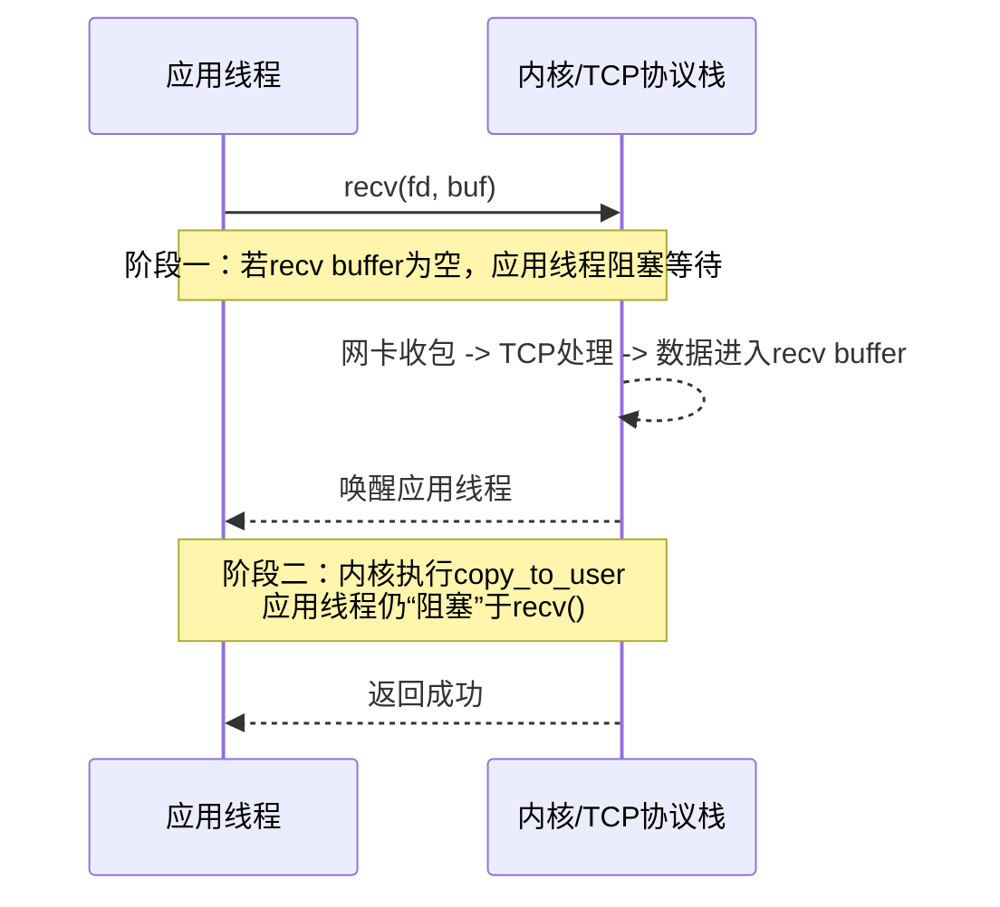
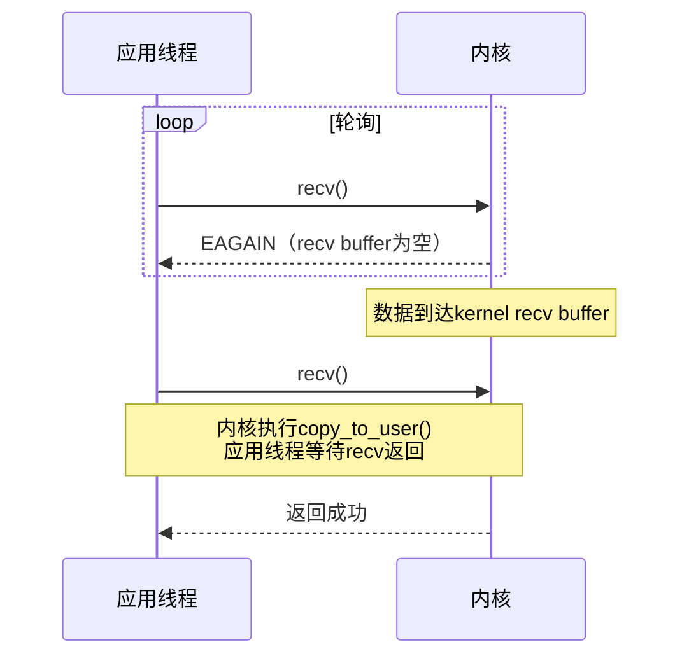
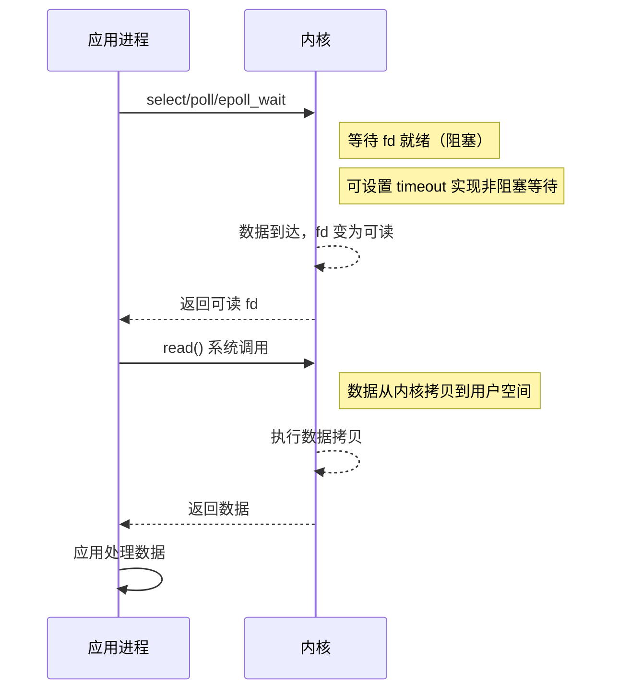
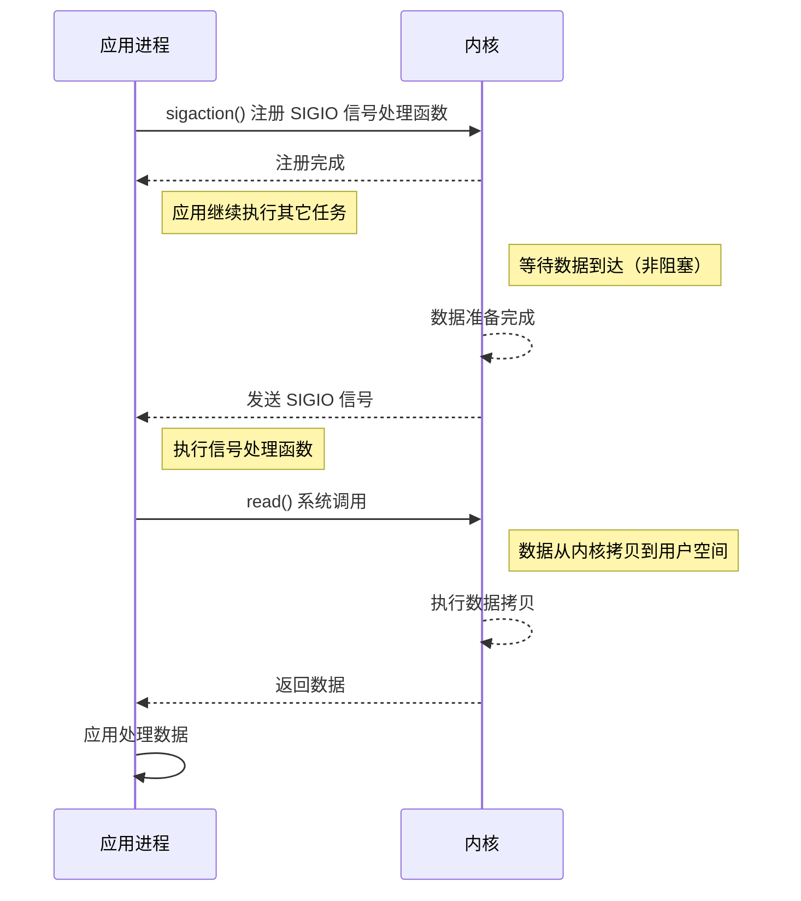
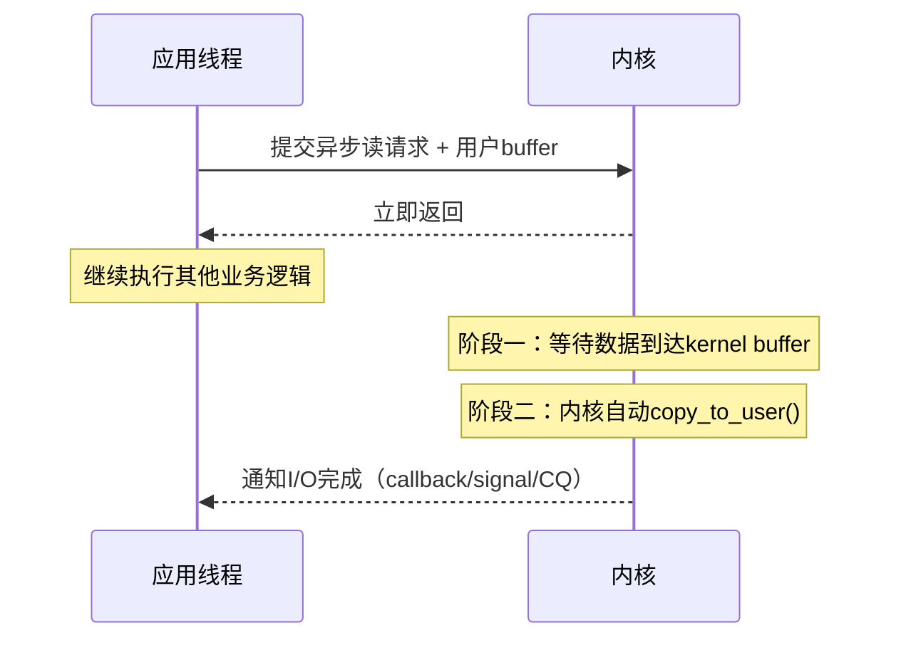

# 1. I/O 模型

在操作系统与网络编程中，“阻塞/非阻塞”与“同步/异步”经常被混为一谈。实际上，它们描述的是 I/O 操作中两个==完全不同阶段==的特征。

一次完整的网络 I/O 操作通常分为两个阶段：
1. **阶段一：等待数据准备**（数据从网络到达内核缓冲区）
2. **阶段二：数据拷贝**（数据从内核缓冲区拷贝到用户缓冲区）

> [!tip] 核心判断标准
> - **阻塞 / 非阻塞**：描述的是**阶段一**（等待数据阶段），线程是否被挂起。
> - **同步 / 异步**：描述的是**阶段二**（数据拷贝阶段），==数据拷贝由谁负责完成==。

## 1.1 同步 I/O

同步 I/O 意味着**应用线程必须亲自参与 I/O 的完成过程**。

> [!tip] 线程被 IO 过程“绑住”。

具体表现：当内核准备好数据后，仍然需要应用线程主动发起系统调用（如 `recv` 或 `read`），在应用线程的上下文中，将数据从内核缓冲区拷贝到用户缓冲区。在此拷贝期间，**应用线程是被占用或阻塞的**。

## 1.2 异步 I/O

异步 I/O 意味着**应用线程不参与真正的 I/O 执行**。

> [!tip] 线程可以继续做别的事情。

具体表现：应用线程只需向内核提交 I/O 请求后立即返回。后续的等待数据到达、将数据直接拷贝进用户 buffer 的操作，**全部由内核独立完成**。当内核完成所有工作后，再通过某种机制（如信号、回调）通知应用程序。

## 1.3 阻塞与非阻塞

在明确了同步/异步的定义后，阻塞与非阻塞仅作为等待数据阶段的附加属性存在。

- **阻塞**：调用后，若数据未准备好，线程被挂起，交出 CPU 执行权，直到数据准备好被唤醒。
- **非阻塞**：调用后，若数据未准备好，内核立即返回错误码（如 `EAGAIN` 或 `EWOULDBLOCK`），线程不睡眠，通常需要应用层通过轮询不断重试。

# 2. Unix/Linux 上的五种 IO 模型

基于上述两个维度，可以组合出四种 I/O 模型。其中最主流的是前三种同步 I/O。

## 2.1 阻塞同步 I/O

最传统的 I/O 方式。用户线程在阶段一（等待数据）和阶段二（拷贝数据）**均被阻塞**。

```c
recv(fd, buf, 1024, 0);
```

- 若无数据，当前应用线程睡眠（线程从运行态 $\rightarrow$ 阻塞态）；
- 数据到达**内核 socket recv buffer**后，内核唤醒该线程（线程从阻塞态 $\rightarrow$ 就绪态），
- 内核在系统调用上下文中将数据拷贝到用户缓冲区（kernel buffer $\rightarrow$ user buffer）。



> [!question] 阶段二中，当数据到达内核接收缓冲区时，应用线程不就被唤醒了吗？为什么说应用线程还被**阻塞**着？
> 虽然线程被“唤醒”了，但 `recv()` 这个系统调用还没返回。对于**用户态的程序逻辑**来说，它依然停在 `recv()` 那一行。
> 此时内核现在正在执行 `copy_to_user`。这涉及到把数据从内核空间的内存地址拷贝到用户定义的 `char buf[]` 所在的内存地址。
> 这步操作是**消耗 CPU** 的。CPU 需要从内核态把数据一字节一字节地搬运到用户态，在搬运完成之前，`recv()` 没法返回。
> 因此从用户程序的视角看，它依然是“阻塞”在 `recv` 系统调用里的，只不过阶段一是在“等数据到”，阶段二是在“等数据搬完”。

## 2.2 非阻塞同步 I/O

通过 `fcntl` 设置 `O_NONBLOCK`。阶段一不阻塞，阶段二如果数据已就绪，仍由应用线程同步拷贝。

```c
fcntl(fd, F_SETFL, O_NONBLOCK);
recv(fd, buf, 1024, 0);
```

若 recv buffer 为空，立即然会 `-1`，并且设置 `errno = EAGAIN`，应用线程不会阻塞等待。



## 2.3 I/O多路复用（同步 I/O）

现代高并发服务器的主流模型（如 `epoll`、`select`）。通过一个线程同时监听多个文件描述符的可读/可写状态。



> [!warning] 最常见的误解
> 很多人认为 `epoll` 是异步 I/O。但实际上，`epoll_wait` 返回“可读”状态仅代表阶段一完成，此时数据仍在**内核的 recv buffer** 中。应用线程仍需调用 `recv()`，内核在**应用线程上下文**中完成 `kernel buffer → user buffer` 的拷贝。因此，`epoll` 依然是**同步 I/O**，准确说是“同步 I/O + 就绪事件通知”。

## 2.4 信号驱动 I/O（Signal-Driven I/O）

通过 `fcntl` 设置 `O_ASYNC` 和 `F_SETOWN`。应用线程不主动轮询，而是在数据就绪时由内核发送 `SIGIO` 信号通知。

```c
fcntl(fd, F_SETOWN, getpid());   // 指定接收 SIGIO 的进程
fcntl(fd, F_SETFL, O_ASYNC);    // 开启信号驱动IO
```

- **当 kernel 的 socket recv buffer 为空时**：应用线程不会阻塞在 `recv()`，也不会像非阻塞 IO 那样不断轮询，而是继续执行自己的业务逻辑。
- **等数据到达 socket recv buffer 后**：内核发送 `SIGIO`，应用线程收到信号后再主动调用 `recv()`，然后由内核执行 `copy_to_user()`。

所以信号驱动本质上仍属于**同步 I/O**。



或许你会发现 `signal-driven IO` 和 `epoll` 看起来很像。因为它们都不主动 busy polling，只在数据准备好时通知应用。但两者区别在于：

|模型|通知方式|
|---|---|
|epoll|应用线程主动调用 epoll_wait() 等待|
|signal-driven|内核主动发送 SIGIO 信号|

- `epoll` 属于**同步等待（主动等）**，应用线程调用 `epoll_wait()` 阻塞等待事件。
- 信号驱动 IO 属于**异步通知（被动通知）**，应用线程平时可以继续运行。直到 SIGIO 到来才知道 socket ready。

> [!question] 为什么信号驱动 IO 仍然是同步 IO？
> 因为应用线程收到 `SIGIO` 后，应用线程仍需调用 `recv(fd, buf, ...)` **主动读取数据**。而 kernel buffer → user buffer 的拷贝仍发生在当前应用线程的系统调用上下文，因此它依然属于同步 I/O。

在现代服务器中，其实很少使用 Signal-Driven IO，因为 signal 机制存在很多问题：

|问题|说明|
|---|---|
|signal 语义复杂|容易出现竞态|
|信号不可排队|多次 SIGIO 可能合并|
|可重入问题|signal handler 限制很多|
|编程复杂|不如 epoll 清晰|
|可维护性差|大规模并发难管理|

因此现代 Linux 网络服务器几乎都使用 `epoll + 非阻塞 socket`。

## 2.5 异步I/O（Async IO）

真正的异步 I/O：应用线程无需主动参与等待数据与数据拷贝过程，提交请求后可继续执行其他任务，待 I/O 完成后再通过完成**通知机制**获知结果。



## 2.6 总结

根据 POSIX 标准和 UNIX 网络编程的经典定义，只要阶段二需要应用线程参与拷贝，就属于同步 I/O。

| 经典 I/O 模型 | 等待数据阶段（阶段一） | 数据拷贝阶段（阶段二） | 最终分类 |
| :--- | :--- | :--- | :--- |
| 阻塞 I/O | 阻塞 | 应用线程拷贝（阻塞） | **同步 I/O** |
| 非阻塞 I/O | 非阻塞（轮询） | 应用线程拷贝（阻塞） | **同步 I/O** |
| I/O 多路复用 (`select`/`poll`/`epoll`) | 阻塞（在监听句柄上） | 应用线程拷贝（阻塞） | **同步 I/O** |
| 信号驱动 I/O (`SIGIO`) | 非阻塞（由信号通知） | 应用线程拷贝（阻塞） | **同步 I/O** |
| 异步 I/O (`AIO` / `io_uring`) | 非阻塞 | 内核自动拷贝 | **异步 I/O** |

> [!info] 代码层面的铁证
> 只要你的代码中显式调用了 `recv()`、`read()`、`send()` 或 `write()` 来获取或发送数据，这就意味着是你（应用线程）在执行拷贝动作，那么它一定是同步 I/O。

---

# 3. 异步I/O实现

由于 POSIX 标准中的 AIO 存在各种历史包袱和性能问题，真正的异步 I/O 在不同操作系统中有不同的成熟方案：

- **Windows IOCP**：Windows 平台下极其成熟的真正异步 I/O 模型，高性能网络框架的标杆。
- **Linux io_uring**：Linux 5.1 引入的新一代异步 I/O 框架。通过共享环形缓冲区，大幅减少了系统调用和上下文切换的开销，是 Linux 未来异步 I/O 的主流方向。

> [!question] 既然 `epoll` 仍然是同步 I/O，为什么 Redis、Nginx、Netty 等顶级高性能组件都不使用真正的异步 I/O 呢？

> [!abstract] 性能瓶颈不在拷贝
> 在网络 I/O 中，真正极其耗时的操作是**网络延迟**（等待数据从远端到达网卡），而不是内存中的数据拷贝。内存拷贝（几 KB 到几 MB）在现代 CPU 上耗时通常在微秒级，代价极小。

- **epoll 已解决核心痛点**：`epoll` + 非阻塞 socket 完美解决了“线程切换开销”和“无效 fd 扫描”的问题，单线程即可处理海量连接。
- **编程模型复杂度**：真正的异步 I/O（如 AIO 的回调机制）会导致代码控制流被割裂，难以进行复杂的业务状态管理。而 `epoll` 的“事件通知 + 同步读写”模型非常符合人类线性思维，极易编写和维护复杂的业务逻辑。
- **历史兼容性**：在 `io_uring` 成熟之前，Linux 原生缺乏好用的异步 I/O 支持。

因此，`epoll`（同步 I/O）在可预见的未来仍是服务器端网络编程的绝对主流，而 `io_uring` 则在特定的高磁盘 I/O 或极低延迟网络场景下作为进阶优化手段。