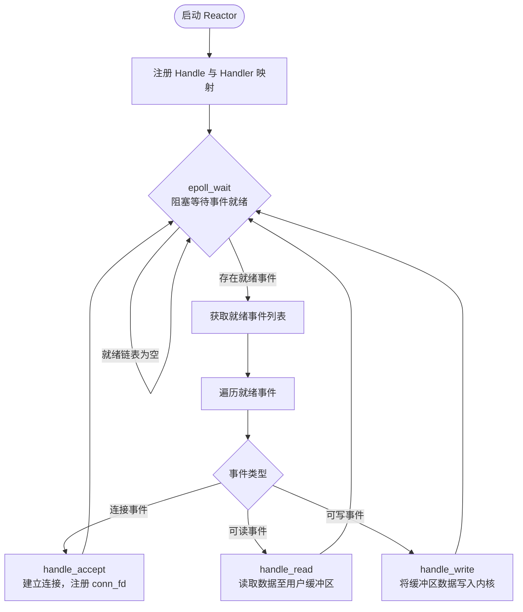
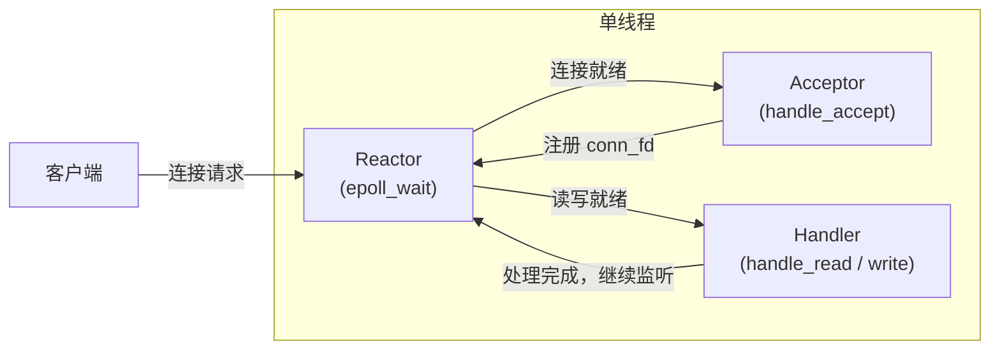
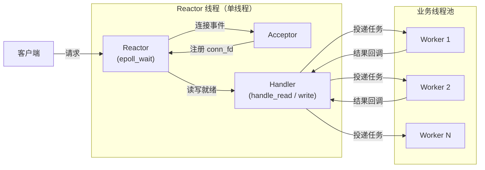
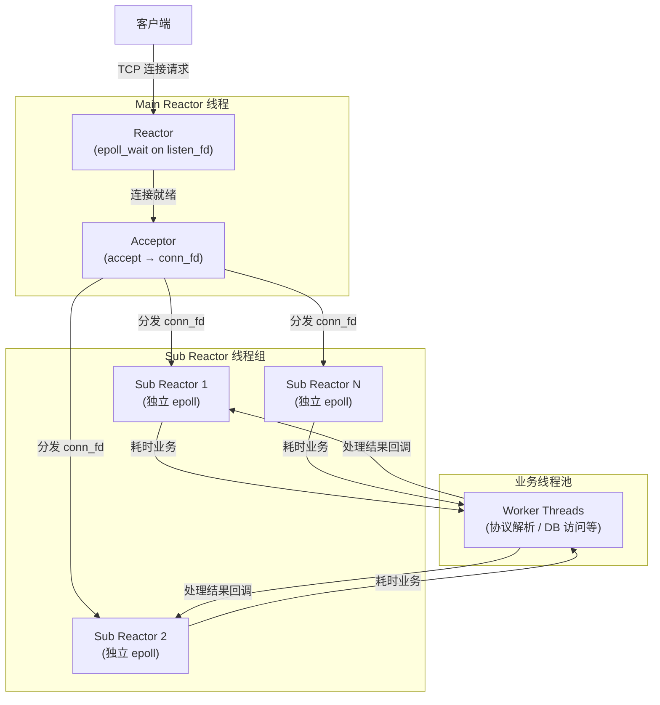
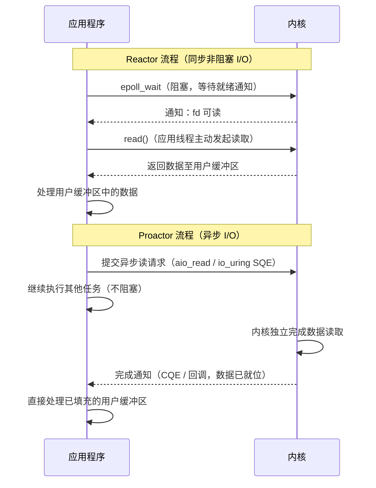

# 1. 背景与设计动机

## 1.1 传统阻塞 I/O 模型的局限性

在传统阻塞 I/O（Blocking I/O，BIO）模型中，服务器为每个客户端连接分配一个独立线程，该线程在执行 `read()`/`write()` 等系统调用期间持续阻塞，直至 I/O 操作完成方才返回。

该模型存在以下根本性缺陷：

- **内存开销过高**：Linux 下每个线程默认栈空间约为 8 MB，万级并发连接将消耗数十 GB 内存。
- **调度开销显著**：大量线程的频繁上下文切换带来不可忽视的 CPU 时间损耗。
- **扩展性受限**：线程总量受操作系统资源上限约束，整体吞吐量无法随连接数线性扩展。

上述问题在连接数达到万级（即 C10K 问题）时集中爆发，促使工程界寻求更高效的并发 I/O 处理架构。

## 1.2 I/O 多路复用的引入

**I/O 多路复用**（I/O Multiplexing）允许单线程同时监听多个文件描述符（fd）的就绪状态。内核通过 `select`、`poll`、`epoll`（Linux）等系统调用提供此能力：当任意 fd 就绪时，内核唤醒等待线程，使单线程得以服务大量并发连接。

Reactor 模式正是基于 I/O 多路复用机制构建的一套系统化**事件驱动架构**，其目标是将事件的等待、分发与处理解耦，形成可复用的高并发 I/O 处理框架。

---

# 2. Reactor 模型概述

## 2.1 核心定义

**Reactor 模型**（反应堆模式）是一种基于事件驱动的 I/O 处理架构。它通过 I/O 多路复用机制集中监听多个资源句柄上的事件，一旦某事件就绪，即将其分发至对应的事件处理器执行业务逻辑。

> [!important] **重要说明**
> Reactor 属于**同步非阻塞 I/O 模型**。虽然其文件描述符以非阻塞模式运行，但实际的 `read()`/`write()` 调用仍由应用线程在收到就绪通知后**主动发起并同步完成**。内核仅负责通知“资源已就绪”，而非代替应用完成数据搬运，这与 Proactor（异步 I/O）模型有本质区别（详见第 4 节）。

## 2.2 核心组成角色

Reactor 模型包含以下五个核心角色，源自 Douglas Schmidt 在《Pattern-Oriented Software Architecture, Vol. 2》中的形式化描述。

### 2.2.1 Handle（资源句柄）

操作系统管理的 I/O 资源标识符，在网络编程中通常为**文件描述符（fd）**，如监听套接字（`listen_fd`）与连接套接字（`conn_fd`）。Handle 是事件的载体，所有事件均绑定于某个 Handle 之上。

### 2.2.2 Synchronous Event Demultiplexer（同步事件分离器）

封装系统提供的 I/O 多路复用接口，负责**阻塞等待**并从就绪事件集合中分离出各 Handle 对应的事件。

|平台|实现|时间复杂度|
|:--|:--|:--|
|Linux|`epoll`|$O(k)$|
|BSD / macOS|`kqueue`|$O(k)$|
|通用（POSIX）|`select` / `poll`|$O(n)$|

`epoll_wait` 在就绪链表为空时将调用线程投入睡眠，不占用 CPU 资源；当 fd 就绪时，内核中断处理路径通过预注册的回调函数（`ep_poll_callback`）将对应事件挂入就绪链表并唤醒线程。

### 2.2.3 Event Handler（事件处理器接口）

定义事件处理的抽象接口，声明各类事件（可读、可写、异常）的处理方法，通常以回调函数或 C++ 虚函数接口的形式呈现。

### 2.2.4 Concrete Event Handler（具体事件处理器）

`Event Handler` 的具体实现，封装实际业务逻辑，如连接建立（`handle_accept`）、数据读取（`handle_read`）、数据发送（`handle_write`）等操作。

### 2.2.5 Reactor（反应器 / 调度器）

框架的核心调度组件，主要职责如下：

1. 维护 Handle 与 Concrete Event Handler 的映射关系（注册表）。
2. 调用 Synchronous Event Demultiplexer 阻塞等待事件就绪。
3. 遍历就绪事件列表，通过映射关系调用对应的 Concrete Event Handler。

## 2.3 核心设计原理

Reactor 的事件驱动循环（Event Loop）执行流程如下：



> [!warning] 核心约束
> `handle_read` 等处理函数**不得执行阻塞或耗时操作**（如同步数据库访问、复杂计算），否则将导致整个事件循环停滞，使其余就绪连接无法得到及时处理。这是 Reactor 模型引入业务线程池的根本动因。

---

# 3. Reactor 的三种典型演进

## 3.1 单 Reactor 单线程模型

### 3.1.1 架构描述

所有操作（事件监听、连接建立、数据读写、业务处理）均在**同一线程**内串行完成，是最基础的 Reactor 实现形式。



### 3.1.2 优缺点分析

|维度|说明|
|:--|:--|
|**优点**|实现简单；无线程切换开销；无需处理共享数据的并发安全问题|
|**缺点① 计算瓶颈**|所有操作串行执行，单核 CPU 利用率上限为 100%，无法利用多核处理器|
|**缺点② 阻塞风险**|任一 Handler 中的耗时操作将阻塞整个事件循环，导致所有连接无法响应|

**典型应用**：Redis 6.0 之前的主逻辑处理（基于 `ae` 事件库），适用于计算密集度低、处理延迟可控的场景。

---

## 3.2 单 Reactor 多线程模型

### 3.2.1 架构描述

为解决 Handler 中耗时业务逻辑阻塞事件循环的问题，引入**业务线程池**，将 I/O 操作与业务计算解耦。Reactor 线程仍为单线程，负责所有 fd 的事件监听与数据读写；读取完整请求数据后，将业务处理任务投递至线程池异步执行，结果通过回调机制返回并由 Reactor 线程完成写回。



### 3.2.2 优缺点分析

|维度|说明|
|:--|:--|
|**优点**|Reactor 线程专注于 I/O 事件处理，业务计算由线程池并行承载，二者互不干扰|
|**缺点① I/O 瓶颈**|在极高并发场景下，单线程 Reactor 的 `read`/`write` 吞吐量可能成为整体瓶颈|
|**缺点② 并发安全**|Worker 线程将处理结果回写时，涉及对共享缓冲区的并发访问，需引入同步机制|

---

## 3.3 主从 Reactor 多线程模型

### 3.3.1 架构描述

为解决单线程 Reactor 的 I/O 读写吞吐量瓶颈，将 Reactor 职责拆分为两层：

- **Main Reactor（主反应器）**：运行于独立线程，维护一个 `epoll` 实例，**仅负责监听 `listen_fd` 上的连接建立事件**，调用 `accept` 后将新的 `conn_fd` 分发给某个 Sub Reactor。
- **Sub Reactor 组（从反应器组）**：由多个线程构成，每个线程维护**独立的 `epoll` 实例**，负责其所辖连接的完整 I/O 生命周期（`read`/`write`）；数据读取完成后，将耗时业务逻辑投递至业务线程池。



### 3.3.2 执行流程

1. **连接建立**：Main Reactor 通过 `epoll_wait` 监听 `listen_fd` 上的 `EPOLLIN` 事件，就绪后调用 `accept` 获取 `conn_fd` 并将其设置为非阻塞模式。
2. **连接分发**：依据负载均衡策略（如轮询、最少连接数），将 `conn_fd` 分配至目标 Sub Reactor。通常借助线程安全队列与 `eventfd`/`pipe` 完成跨线程通知，Sub Reactor 唤醒后将 `conn_fd` 注册至其自身的 `epoll` 实例。
3. **I/O 处理**：Sub Reactor 负责该连接的全生命周期 I/O 事件，将内核数据读入用户态缓冲区，并将响应数据写回内核缓冲区（若写入阻塞返回 `EAGAIN`，则注册 `EPOLLOUT` 事件，在下次可写时续传）。
4. **业务解耦**：若业务逻辑耗时（如协议解析、数据库查询），Sub Reactor 将任务包投递至业务线程池，避免 I/O 线程阻塞。

### 3.3.3 优缺点分析

|维度|说明|
|:--|:--|
|**并发能力**|多个 Sub Reactor 并行处理 I/O，充分利用多核 CPU|
|**职责分离**|连接建立与数据读写解耦，主从线程互不干扰|
|**负载均衡**|连接均匀分配至各 Sub Reactor，避免单点热点|
|**适用场景**|C10K、C100K 及以上量级的高并发网络服务|

**典型应用**：Netty（主从 `EventLoopGroup`）、Nginx（Master/Worker 进程模型）、Memcached。

---

# 4. Reactor 与 Proactor 的本质区别

## 4.1 I/O 模型定位

二者的根本差异在于**谁来执行实际的 I/O 数据搬运**：

- **Reactor（同步非阻塞 I/O）**：内核仅通知应用"资源已就绪（可读/可写）"，数据的实际读写（`read`/`write`）由**应用线程主动发起并同步完成**。
- **Proactor（异步 I/O）**：应用向内核提交 I/O 请求后立即返回，**由内核负责完成数据搬运**，完成后通过完成事件或回调通知应用，应用直接处理已填充完毕的缓冲区。

## 4.2 全面对比

|维度|Reactor|Proactor|
|:--|:--|:--|
|**I/O 模式**|同步非阻塞 I/O|异步 I/O（AIO）|
|**I/O 执行者**|应用线程|操作系统内核|
|**通知时机**|fd 已就绪（可读 / 可写）|I/O 操作已完成|
|**数据状态**|就绪后由应用主动读取|数据已填充至用户缓冲区|
|**典型系统调用**|`epoll` + `read`/`write`|`aio_read` / `io_uring` / Windows IOCP|
|**典型实现**|Linux `epoll`、`kqueue`、Java NIO|Windows IOCP、Linux `io_uring`|
|**编程复杂度**|中等|较高（缓冲区生命周期管理复杂）|
|**可移植性**|高（POSIX 标准）|低（平台差异显著）|

## 4.3 执行流程对比



> [!warning] 常见误区 Reactor 模型虽然使用非阻塞 fd，但**执行 `read`/`write` 的时刻线程仍是同步的**。由于事件分离器已确认 fd 就绪，`read` 通常能立即返回，耗时极短，但从 I/O 语义上仍属同步操作，与 Proactor 中由内核完成数据搬运有本质区别。

> [!note] 关于 `io_uring` Linux 5.1 引入的 `io_uring` 提供了接近 Proactor 语义的真异步 I/O 接口，通过共享环形队列（Submission Queue / Completion Queue）实现应用与内核间的零拷贝通信，性能显著优于 POSIX AIO，是目前 Linux 平台高性能 I/O 的重要演进方向。

---

# 5. 生产级设计实践

## 5.1 标准三层架构

生产级高并发服务器通常采用**主从 Reactor + 业务线程池**的三层架构：

```
┌─────────────────────────────────────────────────────────┐
│                  Main Reactor 线程                      │
│   listen_fd → epoll_wait → accept → 分发 conn_fd        │
└─────────────────────┬───────────────────────────────────┘
                      │  轮询 / 最少连接等负载均衡策略
          ┌───────────┼───────────┐
          ▼           ▼           ▼
┌─────────────┐ ┌─────────────┐ ┌─────────────┐
│Sub Reactor 1│ │Sub Reactor 2│ │Sub Reactor N│
│ 独立 epoll  │ │ 独立 epoll  │ │ 独立 epoll  │
│ read/write  │ │ read/write  │ │ read/write  │
└──────┬──────┘ └──────┬──────┘ └──────┬──────┘
       │               │               │
       └───────────────┼───────────────┘
                       │  投递耗时任务
                       ▼
            ┌─────────────────────────┐
            │      业务线程池         │
            │  协议解析 / 数据库访问  │
            │  加解密 / 序列化        │
            └─────────────────────────┘
```

## 5.2 各层职责说明

**Main Reactor 层**：

- 调用 `epoll_wait` 监听 `listen_fd` 上的 `EPOLLIN` 事件。
- 调用 `accept` 建立连接，获取 `conn_fd` 并设置为非阻塞模式。
- 通过负载均衡策略将 `conn_fd` 注册至目标 Sub Reactor 的 `epoll` 实例，通常借助 `eventfd` 或无锁队列完成跨线程通知。

**Sub Reactor 层（I/O 线程组）**：

- 每个线程维护独立的 `epoll` 实例，处理其所辖连接的 `read`/`write` 事件。
- 读操作：将内核数据读入用户态环形缓冲区（Ring Buffer），减少内存拷贝次数。
- 写操作：将响应数据写入内核缓冲区；若单次写入未完成（`errno == EAGAIN`），注册 `EPOLLOUT` 事件，在下次可写时续传。
- 对于低延迟简单业务（如 Redis 的 GET/SET），可直接在 I/O 线程内完成处理，避免线程间通信开销。

**业务线程池层**：

- 处理计算密集或高延迟的业务逻辑（HTTP 协议解析、数据库访问、加解密等）。
- 处理完成后，通过回调或消息队列通知对应 Sub Reactor 将响应数据写回客户端。

## 5.3 关键设计要点

**非阻塞 fd 的必要性**：Sub Reactor 线程管理多条连接，若 fd 以阻塞模式运行，在极端情况下（如对端发送速率极低触发 TCP 流量控制），`read`/`write` 将使整个 I/O 线程阻塞，影响其所辖的全部连接。将 fd 设为非阻塞可确保在遇到 `EAGAIN` 时立即返回，保障事件循环的持续推进。

**`epoll` 触发模式的选择**：

|模式|行为|适用场景|
|:--|:--|:--|
|**水平触发（LT）**|只要 fd 处于就绪状态，`epoll_wait` 持续通知|编程简单，适合通用场景|
|**边沿触发（ET）**|仅在 fd 状态发生跳变时通知一次，需循环读取至 `EAGAIN`|减少系统调用次数，高吞吐量场景，需配合非阻塞 fd|

生产环境中高性能服务器通常采用 **ET 模式**以降低 `epoll_wait` 的调用频率，提升整体吞吐量。

> [!summary] 架构总结
> Reactor 是**事件分发**的设计框架，`epoll` 是**I/O 多路复用**的内核机制，业务线程池是**计算解耦**的工程手段。三者分别解决"如何高效监听事件"、"如何避免 I/O 阻塞"和"如何处理耗时业务"三个正交问题，组合使用是构建高性能 Linux 网络服务的标准范式。
