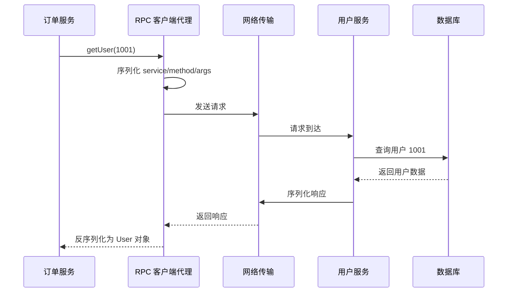

# 1. RPC 核心概念

## 1.1 定义

**RPC** 是 **Remote Procedure Call** 的缩写，中文通常称为**远程过程调用**。

它的核心目标是：让程序可以像调用本地函数一样，调用另一台机器或另一个进程中的函数。

```cpp
User user = userService.getUser(1001);
```

这行代码表面上是一次普通函数调用，但如果 `userService` 是 RPC 代理对象，那么它背后实际发生的是一次远程网络通信。

> [!summary]
> RPC 的本质不是消除网络通信，而是把网络通信封装成接近本地函数调用的形式。

## 1.2 一个具体场景

假设系统中有两个服务：

| 服务 | 职责 |
|---|---|
| 订单服务 | 创建订单、计算折扣、保存订单 |
| 用户服务 | 查询用户信息、用户等级、用户状态 |

订单服务在创建订单时，需要查询用户信息：

```cpp
User user = userService.getUser(1001);

if (user.getLevel() == "VIP") {
    discount = 0.8;
}
```

这段代码中的 `userService.getUser(1001)` 看起来像本地方法，但真正执行查询逻辑的可能是远程的用户服务。

# 2. RPC 调用过程

## 2.1 表面调用

从业务代码视角看，RPC 调用非常简单：

```cpp
class OrderService {
public:
    Order createOrder(long userId, long productId) {
        User user = userService.getUser(userId);

        Order order;
        order.userId = user.id;
        order.productId = productId;

        if (user.level == "VIP") {
            order.discount = 0.8;
        }

        return order;
    }

private:
    UserService userService;
};
```

## 2.2 实际过程

RPC 框架会在内部完成以下步骤：

1. 找到目标服务地址。
2. 建立连接或复用已有连接。
3. 将服务名、方法名、参数编码成请求数据。
4. 通过网络发送请求。
5. 服务端解析请求。
6. 服务端执行真实方法。
7. 服务端将返回值编码成响应数据。
8. 客户端接收响应。
9. 客户端反序列化得到结果对象。



# 3. RPC 与网络连接

## 3.1 RPC 不是没有连接

RPC 代码中通常看不到连接步骤：

```cpp
User user = userService.getUser(1001);
```

但这不代表没有网络连接。

传统网络编程通常会显式写出：

```cpp
Socket socket("user-service", 8080);
socket.connect();
socket.write(requestBytes);
auto responseBytes = socket.read();
socket.close();
```

RPC 框架则把这些细节隐藏在代理对象或客户端框架内部。

> [!warning]
> 不要把 RPC 理解为“没有网络”。RPC 只是让调用方不必直接处理 socket、连接、发包、收包、编解码等底层细节。

## 3.2 RPC 代理对象

RPC 中的 `userService` 往往不是普通对象，而是框架生成的**代理对象**。

调用：

```cpp
User user = userService.getUser(1001);
```

实际可能等价于：

```cpp
User getUser(long userId) {
    RpcRequest request;
    request.serviceName = "UserService";
    request.methodName = "getUser";
    request.args = {userId};

    Bytes requestBytes = serialize(request);
    Bytes responseBytes = rpcClient.send(requestBytes);

    RpcResponse response = deserialize(responseBytes);

    if (response.hasError()) {
        throw response.error;
    }

    return response.toUser();
}
```

也就是说：

```text
业务代码调用方法
→ 代理对象拦截方法调用
→ 代理对象组装 RPC 请求
→ 网络发送请求
→ 服务端执行真实方法
→ 网络返回响应
→ 代理对象还原返回值
```

# 4. RPC 的传输方式

## 4.1 不一定等于 HTTP

`userService.getUser(1001)` 可以理解为封装了一次网络请求，但不一定是普通 HTTP 请求。

常见传输方式包括：

| 传输方式 | 说明 | 示例 |
|---|---|---|
| HTTP/1.1 | 常见 Web 请求协议 | JSON-RPC、部分 REST 风格 RPC |
| HTTP/2 | 支持多路复用，性能较好 | gRPC |
| TCP 长连接 | 更接近底层 socket 通信 | Dubbo、部分自研 RPC |
| WebSocket | 双向通信 | 实时通信场景 |
| QUIC | 基于 UDP 的现代传输协议 | 部分新型 RPC 框架 |

## 4.2 短连接与长连接

RPC 框架可能使用短连接：

```text
连接 → 发送请求 → 接收响应 → 关闭连接
```

也可能使用长连接：

```text
启动时建立连接
→ 第一次 RPC 调用复用连接
→ 第二次 RPC 调用复用连接
→ 第三次 RPC 调用复用连接
```

实际工程中，为了性能，RPC 框架通常会使用**长连接**或**连接池**，避免每次调用都重新建立连接。

# 5. RPC 与 REST/HTTP API 对比

## 5.1 思维方式差异

| 对比项 | RPC | REST/HTTP API |
|---|---|---|
| 核心思维 | 调用远程方法 | 操作资源 |
| 示例 | `getUser(1001)` | `GET /users/1001` |
| 接口组织 | 以服务和方法为中心 | 以资源和 URL 为中心 |
| 常见数据格式 | Protobuf、JSON、Thrift | JSON |
| 常见场景 | 服务间通信、微服务内部调用 | Web API、开放接口 |

## 5.2 等价关系

RPC 风格：

```cpp
User user = userService.getUser(1001);
```

HTTP API 风格：

```text
GET /users/1001
```

两者都可以完成“查询用户”的目标，但抽象方式不同。

# 6. RPC 的优缺点

## 6.1 优点

- 调用方式接近本地函数，业务代码更直观。
- 适合微服务之间的内部通信。
- 可结合接口定义文件生成客户端和服务端代码。
- 使用二进制协议时，性能和传输效率通常较好。
- 可以统一处理超时、重试、限流、熔断、负载均衡等能力。

## 6.2 缺点

- 远程调用可能失败，不能真的当成本地函数。
- 服务之间容易形成强耦合。
- 链路排查比本地函数复杂。
- 需要处理版本兼容问题。
- 需要关注超时、重试、幂等性、连接池等工程细节。

> [!warning]
> RPC 调用看起来像本地调用，但它仍然可能因为网络抖动、服务宕机、超时、序列化失败等原因出错。

# 7. 常见易错点

## 7.1 把 RPC 当成本地函数

RPC 调用的写法像本地函数：

```cpp
User user = userService.getUser(1001);
```

但它的执行成本和失败模式完全不同。

| 项目 | 本地函数调用 | RPC 调用 |
|---|---|---|
| 是否经过网络 | 否 | 是 |
| 延迟 | 通常极低 | 受网络和服务端影响 |
| 失败原因 | 主要是代码异常 | 网络、超时、服务异常、协议错误 |
| 是否需要超时控制 | 通常不需要 | 必须需要 |
| 是否需要重试策略 | 通常不需要 | 经常需要 |

## 7.2 忽略重试带来的副作用

如果一个 RPC 请求超时，客户端可能会重试。

如果远程方法不是幂等的，重试可能导致重复操作。

例如：

```cpp
paymentService.pay(orderId, amount);
```

如果第一次付款请求已经成功，但响应超时，客户端再次重试，可能造成重复扣款。

> [!tip]
> 查询类 RPC 通常更容易重试；写入类 RPC 要重点考虑幂等性。

# 8. 记忆总结

## 8.1 一句话总结

RPC 就是把一次远程网络通信，包装成一次看起来像本地函数调用的操作。

## 8.2 核心链路

```text
本地方法调用
→ RPC 代理对象
→ 序列化请求
→ 网络传输
→ 服务端执行方法
→ 序列化响应
→ 网络返回
→ 反序列化结果
```

## 8.3 最重要的理解

> [!summary]
> `userService.getUser(1001)` 可以理解为“封装了一次网络请求”，但 RPC 不等于 HTTP。它可能基于 HTTP/2、TCP 长连接、自定义协议等多种通信方式。代码中看不到连接步骤，是因为连接、发包、收包、编解码等细节被 RPC 框架隐藏了。
