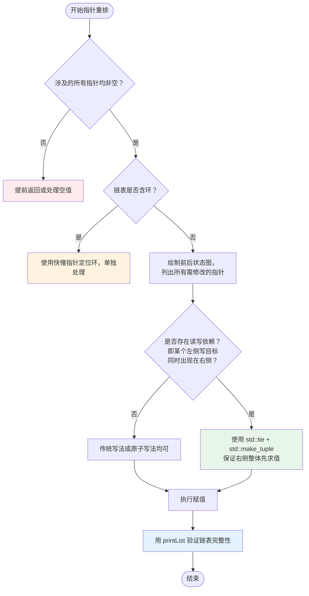

# 1. 指针操作与原子重排技巧

链表节点重排是算法题中的高频操作，常见于旋转链表、反转局部链表、节点插入等场景。本笔记系统讲解使用现代 C++ 技巧（`std::tie` + `std::tuple`）实现链表节点的原子化重排。通过对比传统写法与现代写法，分析指针操作的原子性原理，并提供可复用的代码模板与调试指南。

## 1.1 问题场景与目标分析

- **初始状态**：

```
dummy -> A -> B -> C -> D -> E -> (null)
```

- **目标状态**：

```
dummy -> E -> A -> B -> C -> D -> (null)
```

- **指针变化逻辑拆解**：

| 指针位置 | 初始指向 | 目标指向 | 变化类型 |
| :--- | :--- | :--- | :--- |
| `dummy->next` | `A` | `E` | 首节点切换 |
| `D->next` | `E` | `nullptr` | 尾节点断开 |
| `E->next` | `nullptr` | `A` | 新首节点衔接 |

> [!note] 关键观察
> 三个指针的更新存在**依赖关系**：`E->next` 需要指向原始的 `dummy->next`（即 `A`），但若先修改 `dummy->next`，则会丢失 `A` 的引用。传统写法需引入临时变量保存中间状态；现代写法利用 `std::tuple` 的"右侧整体先求值"机制自动解决此问题。

## 1.2 原子赋值的实现原理

### 1.2.1 std::tie 与 std::tuple 协同机制

```cpp
// 语法格式
std::tie(左值引用1, 左值引用2, ...) = std::make_tuple(表达式1, 表达式2, ...);
```

> 如果是 C++ 17 以上，可以把 `std::make_tuple(表达式1, 表达式2, ...)` 简化为 `std::tuple{表达式1, 表达式2, ...}`。

**执行顺序保证**（由 C++ 标准明确规定）：

1. **右侧整体先求值**：`std::make_tuple(...)` 或 `std::tuple{...}` 构造期间，所有参数表达式在任何赋值发生之前完成求值，结果以值语义暂存于临时 `tuple` 对象中。
2. **左侧依次赋值**：随后将临时 `tuple` 中各元素按顺序解包，赋给 `std::tie` 绑定的各左值引用。

这两个阶段之间不存在交叉，因此左侧任何一个赋值都不会影响右侧其他表达式的读取结果，从而实现"逻辑上的原子性"。

> [!warning] 注意：这里的"原子性"是逻辑层面
> `std::tie` + `std::tuple` 保证的是**赋值顺序上的原子性**（右侧读完再写左侧），而非多线程意义下的硬件原子操作。多线程场景请使用 `std::atomic`。

### 1.2.2 核心代码解析

```cpp
// 原子化重排：将尾节点 E 移至链表头部
std::tie(dummy->next, D->next, E->next) = std::make_tuple(E, nullptr, dummy->next);
```

**第一步：右侧整体求值，全部捕获**

```
std::make_tuple(E,   nullptr,   dummy->next)
             = (E,   nullptr,   A         )   // dummy->next 此时仍为 A，安全捕获
```

**第二步：依次赋值给左侧**

```
dummy->next = E        // dummy -> E
D->next     = nullptr  // D -> null（断开与 E 的链接）
E->next     = A        // E -> A（捕获的旧值，非已被修改的 dummy->next）
```

结果：`dummy -> E -> A -> B -> C -> D -> null` ✅

| 左侧目标 | 右侧源值（捕获时） | 实际效果 | 依赖关系说明 |
| :--- | :--- | :--- | :--- |
| `dummy->next` | `E` | 新链表以 `E` 为起点 | 无依赖，可任意顺序 |
| `D->next` | `nullptr` | `D` 成为新尾节点 | 无依赖，可任意顺序 |
| `E->next` | `dummy->next`（旧值 `A`） | `E` 衔接原首节点 | 依赖右侧**整体**先求值 |

**左侧顺序可以调换**，只要左右对应关系正确即可。例如，以下写法等价：

```cpp
// 写法一
std::tie(dummy->next, D->next, E->next) = std::make_tuple(E, nullptr, dummy->next);

// 写法二（调换了 D->next 和 E->next 的位置，同时调换右侧对应值）
std::tie(dummy->next, E->next, D->next) = std::make_tuple(E, dummy->next, nullptr);
```

对于写法二：

| 阶段 | 执行动作 | 结果 |
|------|----------|------|
| **1. 左侧引用绑定** | `std::tie` 创建三个引用：<br>`ref0` → `dummy->next`（节点成员）<br>`ref1` → `E->next`（节点成员）<br>`ref2` → `D->next`（节点成员） | 引用已固定，与后续 `dummy` 值变化无关 |
| **2. 右侧完整求值** | 计算 `std::tuple` 元素：<br>`val0 = E` → `B`<br>`val1 = dummy->next` → `P`<br>`val2 = nullptr` → `A` | 所有值基于旧状态快照 |
| **3. 左侧顺序赋值** | `ref0 = val0` → `dummy->next = B`<br>`ref1 = val1` → `E->next = P`<br>`ref2 = val2` → `D->next = A` | 链表反转完成，指针正确推进 |

> [!warning] 对应关系不能搞错
> 左边第 N 个必须对应右边第 N 个期望值。顺序可以随意排列，但左右的**配对关系**必须一致：
>
> ```
> // 左边           右边（捕获值）
> dummy->next  ↔  E
> E->next      ↔  dummy->next（旧值 A）
> D->next      ↔  nullptr
> ```

---

# 2. 代码实现与对比分析

## 2.1 节点定义与辅助函数

```cpp
#include <tuple>
#include <iostream>
#include <string>

struct ListNode {
    int val;
    ListNode* next;
    ListNode(int x) : val(x), next(nullptr) {}
};

// 打印链表（用于调试）
void printList(ListNode* head, const std::string& label) {
    std::cout << label << ": ";
    while (head) {
        std::cout << head->val << " -> ";
        head = head->next;
    }
    std::cout << "nullptr\n";
}

// 构建链表：从数组快速创建
ListNode* buildList(std::initializer_list<int> vals) {
    ListNode dummy(0);       // 栈上分配，生命周期由作用域自动管理
    ListNode* cur = &dummy;  // cur 仅用于遍历构建，不拥有所有权
    for (int v : vals) {
        cur->next = new ListNode(v);
        cur = cur->next;
    }
    return dummy.next;      // 返回真实头节点，dummy 自动析构
}
```

> [!note] 补充：栈分配下 `ListNode* cur = &dummy;` 的必要性
> 
> ```
> 内存布局（栈分配）：
> ┌─────────────────┐
> │ dummy (对象)    │  地址: 0x1000
> │  val: 0         │
> │  next: nullptr  │
> └─────────────────┘
> 
> 代码：
> ListNode dummy(0);
> ListNode* cur = &dummy;  // cur 存储 dummy 的地址 0x1000
> 
> 后续操作：
> cur->next = new ListNode(1);  // 通过指针修改 dummy 的 next 成员
> // 此时 dummy.next 指向新节点，构建成功 ✓
> ```

## 2.2 传统写法：临时变量法

```cpp
// 将尾节点 E 移至头部（传统写法）
// 前置条件：dummy、D、E 均非空，且 D->next == E，E->next == nullptr
void moveTailToHead_Traditional(ListNode* dummy, ListNode* D, ListNode* E) {
    ListNode* original_head = dummy->next;  // ① 先保存 A，防止被覆盖

    E->next = original_head;   // ② E -> A
    D->next = nullptr;         // ③ D -> nullptr
    dummy->next = E;           // ④ dummy -> E
    // ⚠️ 若将 ④ 提前到 ② 之前执行，original_head 的保存就不可省略；
    //    若顺序写错，链表将发生断裂或形成环。
}
```

**潜在问题**：
- 临时变量命名需清晰，否则易混淆
- 赋值顺序错误会导致逻辑错误（链表断裂）甚至内存泄漏
- 代码行数多，可维护性较低

## 2.3 现代写法：原子赋值法

```cpp
// 将尾节点 E 移至头部（现代写法）
// 前置条件：dummy、D、E 均非空，且 D->next == E
void moveTailToHead_Modern(ListNode* dummy, ListNode* D, ListNode* E) {
    // ✅ 右侧值整体先求值，一行完成，无需关心赋值顺序
    std::tie(dummy->next, D->next, E->next) =
        std::make_tuple(E, nullptr, dummy->next);
}
```

**优势对比**：

| 维度 | 传统写法 | 现代写法 |
| :--- | :--- | :--- |
| **代码行数** | 4–5 行 | 1 行 |
| **临时变量** | 需显式声明 1–2 个 | 隐式由 `tuple` 管理 |
| **顺序依赖** | 开发者手动保证 | 语言机制自动保证 |
| **可读性** | 需注释说明依赖逻辑 | 表达式即文档 |
| **出错概率** | 中（易写错顺序） | 低（原子性保障） |

## 2.4 完整测试示例

```cpp
int main() {
    // 构建链表: dummy -> 1 -> 2 -> 3 -> 4 -> 5
    ListNode dummy(0);
    ListNode* A = new ListNode(1);
    ListNode* B = new ListNode(2);
    ListNode* C = new ListNode(3);
    ListNode* D = new ListNode(4);
    ListNode* E = new ListNode(5);

    dummy.next = A;
    A->next = B; B->next = C; C->next = D; D->next = E;

    printList(dummy.next, "初始链表");
    // 输出: 1 -> 2 -> 3 -> 4 -> 5 -> nullptr

    moveTailToHead_Modern(&dummy, D, E);

    printList(dummy.next, "重排后链表");
    // 预期输出: 5 -> 1 -> 2 -> 3 -> 4 -> nullptr

    // 清理内存
    ListNode* curr = dummy.next;
    while (curr) {
        ListNode* nxt = curr->next;
        delete curr;
        curr = nxt;
    }

    return 0;
}
```

---

# 3. 应用场景与扩展技巧

## 3.1 旋转链表

将链表向右旋转 `k` 个位置，本质是找到新的头节点，然后将链表尾部接到原头部。

```
原始: 1 -> 2 -> 3 -> 4 -> 5,  k=2
目标: 4 -> 5 -> 1 -> 2 -> 3
      ↑
      new_head（从 new_tail->next 开始）
```

```cpp
ListNode* rotateRight(ListNode* head, int k) {
    if (!head || !head->next || k == 0) return head;

    // 1. 计算长度并找到尾节点
    int len = 1;
    ListNode* tail = head;
    while (tail->next) {
        tail = tail->next;
        ++len;
    }

    // 2. 计算有效旋转次数（避免重复整圈旋转）
    k %= len;
    if (k == 0) return head;

    // 3. 找到新尾节点（第 len-k 个节点，1-indexed）
    ListNode* new_tail = head;
    for (int i = 0; i < len - k - 1; ++i) {
        new_tail = new_tail->next;
    }

    // 4. 原子重排
    // 右侧捕获：(nullptr, head, new_tail->next)
    //   new_tail->next 在此处尚未被修改，捕获的是原始值（新链表的头节点）
    std::tie(new_tail->next, tail->next, head) =
        std::make_tuple(nullptr, head, new_tail->next);

    return head;
}
```

**步骤 4 指针变化分析**（以 `1->2->3->4->5, k=2` 为例，`new_tail=3, tail=5`）：

| 左侧目标 | 右侧捕获值 | 效果 |
| :--- | :--- | :--- |
| `new_tail->next`（`3->next`） | `nullptr` | `3` 成为新尾节点 |
| `tail->next`（`5->next`） | `head`（`1`） | 原链头接到原链尾 |
| `head` | `new_tail->next`（旧值 `4`） | 返回值指向新头 |

结果：`4 -> 5 -> 1 -> 2 -> 3 -> nullptr` ✅

## 3.2 局部反转

反转链表 `[left, right]` 区间，使用**头插法**：将 `curr` 右侧的节点逐个插到 `pre` 之后。

**头插法示意**（`left=2, right=4`）：

```
初始: dummy -> 1 -> [2 -> 3 -> 4] -> 5
                pre  curr  next_node

i=0: 将 3 插到 pre(1) 之后
     dummy -> 1 -> [3 -> 2 -> 4] -> 5
               pre       curr

i=1: 将 4 插到 pre(1) 之后
     dummy -> 1 -> [4 -> 3 -> 2] -> 5
```

```cpp
ListNode* reverseBetween(ListNode* head, int left, int right) {
    ListNode dummy(0);
    dummy.next = head;

    // 1. 定位到 left 的前驱节点 pre
    ListNode* pre = &dummy;
    for (int i = 0; i < left - 1; ++i) {
        pre = pre->next;
    }

    // 2. curr 固定指向待反转区间的"尾部"（头插过程中它不断后移）
    ListNode* curr = pre->next;

    // 3. 头插法：循环 (right - left) 次，每次把 curr->next 插到 pre 之后
    for (int i = 0; i < right - left; ++i) {
        ListNode* next_node = curr->next;  // 即将被头插的节点

        // 右侧捕获：(next_node, next_node->next, pre->next)
        //   pre->next 是当前反转区间的"头节点"，next_node 将接替它的位置
        std::tie(pre->next, curr->next, next_node->next) =
            std::make_tuple(next_node, next_node->next, pre->next);
    }

    return dummy.next;
}
```

**单次迭代指针变化分析**（以第一次迭代为例，`next_node = 3`）：

| 左侧目标 | 右侧捕获值 | 效果 |
| :--- | :--- | :--- |
| `pre->next` | `next_node`（`3`） | `3` 成为区间新头 |
| `curr->next` | `next_node->next`（旧值 `4`） | `curr(2)` 跳过 `3`，指向 `4` |
| `next_node->next` | `pre->next`（旧值 `2`） | `3` 指向原区间头 `2` |

每次迭代后，`curr` 始终固定（不移动），它是反转区间不断增长的"尾节点"。

## 3.3 节点交换

两两交换相邻节点：将每对 `first -> second` 变为 `second -> first`。

```
prev -> first -> second -> rest
  ↓（交换后）
prev -> second -> first -> rest
```

```cpp
ListNode* swapPairs(ListNode* head) {
    ListNode dummy(0);
    dummy.next = head;
    ListNode* prev = &dummy;

    while (prev->next && prev->next->next) {
        ListNode* first  = prev->next;        // 当前对的第一个节点
        ListNode* second = first->next;       // 当前对的第二个节点

        // 右侧捕获：(second, second->next, first)
        std::tie(prev->next, first->next, second->next) =
            std::make_tuple(second, second->next, first);
        //  prev->next  = second   → prev 接上 second
        //  first->next = rest     → first 接上后续链表
        //  second->next = first   → second 指向 first（完成交换）

        prev = first;  // first 现在是本对的尾节点，移动到下一对的前驱
    }

    return dummy.next;
}
```

**指针变化分析**（以首对 `1 -> 2` 为例）：

| 左侧目标 | 右侧捕获值 | 效果 |
| :--- | :--- | :--- |
| `prev->next` | `second`（`2`） | `dummy` 接上 `2` |
| `first->next` | `second->next`（旧值，后续链表头） | `1` 接上剩余部分 |
| `second->next` | `first`（`1`） | `2` 指向 `1`，完成交换 |

---

# 4. 边界条件与正确性验证

## 4.1 特殊链表结构的处理

在将原子赋值应用于实际题目前，需针对边界情况预先防御。

### 4.1.1 单节点与空链表

```cpp
// 旋转链表前置检查
if (!head || !head->next || k == 0) return head;

// 反转区间前置检查
if (left == right) return head;  // 区间长度为 1，无需操作
```

### 4.1.2 双节点链表

以 `swapPairs` 为例，链表只有两个节点时：

```
dummy -> first(1) -> second(2) -> nullptr

right = (second, second->next=nullptr, first)
赋值后：dummy -> 2 -> 1 -> nullptr ✅
prev = first(1)  →  prev->next == nullptr，循环终止 ✅
```

双节点是最易出错的边界，建议手动走一遍每个算法。

### 4.1.3 `k` 等于链表长度整数倍（旋转链表）

```cpp
k %= len;
if (k == 0) return head;  // 旋转整圈，结果不变，直接返回
```

不加此判断会导致 `new_tail` 定位到 `nullptr`，后续解引用崩溃。

## 4.2 原子赋值正确性的系统化验证

对任意原子赋值，可按以下三步表格化验证，避免对应关系写错。

**验证模板**：

```
步骤 1：列出所有需要修改的指针及其目标值（不考虑顺序）
步骤 2：右侧值中，是否有某个值会在本次赋值中被覆盖？
步骤 3：将被覆盖的值放入右侧 tuple 捕获，确认左右对应关系
```

以 `reverseBetween` 单次迭代为例：

| 步骤 | 内容 |
| :--- | :--- |
| **需修改的指针** | `pre->next`（→ `next_node`）；`curr->next`（→ `next_node->next`）；`next_node->next`（→ `pre->next` 旧值） |
| **会被覆盖的值** | `pre->next` 将被写新值，但 `next_node->next` 需要读它的旧值 → 必须在 `pre->next` 被写前捕获 |
| **构造 tuple** | 右侧：`(next_node, next_node->next, pre->next)` 整体先求值，三者均安全捕获 |
| **验证对应** | `pre->next ↔ next_node` ✅；`curr->next ↔ next_node->next` ✅；`next_node->next ↔ pre->next(旧)` ✅ |

## 4.3 指针变化的图解分析

对于复杂的多指针重排，推荐先绘制**前后状态图**，再编写原子赋值语句。以下是通用的指针重排决策流程：



**流程说明**：

- **读写依赖**：若某个指针 `p->next` 既是赋值目标（左侧），又需要被另一个右侧表达式读取，则存在依赖，必须使用原子赋值。
- **无依赖**：三个赋值彼此独立，传统写法和原子写法等价，可按可读性选择。

---

# 5. 注意事项与最佳实践

## 5.1 空指针安全检查

原子赋值前必须确保所有被解引用的指针有效，否则会触发段错误（Segmentation Fault）。

```cpp
// ✅ 安全写法：先检查再操作
if (dummy && D && E && dummy->next) {
    std::tie(dummy->next, D->next, E->next) =
        std::make_tuple(E, nullptr, dummy->next);
}

// ❌ 危险写法：未检查空指针——若 D 为 nullptr 则在赋值左侧解引用时崩溃
// std::tie(dummy->next, D->next, E->next) = std::make_tuple(...);
```

**常见需要检查的前置条件**：

| 操作 | 必须满足的前置条件 |
| :--- | :--- |
| 移动尾节点到头部 | `dummy != nullptr`，`D != nullptr`，`E != nullptr`，`dummy->next != nullptr` |
| 反转区间 `[l, r]` | `l <= r`，链表长度 `>= r` |
| 旋转链表 | `head != nullptr`，`k >= 0` |
| 两两交换 | 无额外条件（循环条件已保护） |

## 5.2 循环链表特殊处理

若链表存在环，`tail->next` 不为 `nullptr`，直接进行"找尾节点"操作会陷入死循环；原子赋值也可能意外改变环的结构。

```cpp
// 检测环：Floyd 快慢指针算法
bool hasCycle(ListNode* head) {
    ListNode *slow = head, *fast = head;
    while (fast && fast->next) {
        slow = slow->next;
        fast = fast->next->next;
        if (slow == fast) return true;
    }
    return false;
}

// 重排前防御
if (!hasCycle(dummy->next)) {
    std::tie(dummy->next, D->next, E->next) =
        std::make_tuple(E, nullptr, dummy->next);
} else {
    // 特殊处理含环链表
}
```

## 5.3 调试与验证技巧

使用 `printList` 辅助函数在关键步骤输出链表状态，快速定位指针错误。

```cpp
// 调试宏：打印当前链表状态（Release 构建时可统一关闭）
#ifdef DEBUG
    #define DEBUG_LIST(head, msg) printList((head), (msg))
#else
    #define DEBUG_LIST(head, msg) ((void)0)
#endif

// 使用示例
DEBUG_LIST(dummy->next, "重排前");
std::tie(dummy->next, D->next, E->next) =
    std::make_tuple(E, nullptr, dummy->next);
DEBUG_LIST(dummy->next, "重排后");
```

**调试时的黄金法则**：若链表状态与预期不符，先用纸笔画出当前的指针状态图，再对照代码逐步验证，不要凭直觉猜测。

## 5.4 性能与可读性平衡

| 场景 | 推荐写法 | 理由 |
| :--- | :--- | :--- |
| **算法竞赛** | 原子赋值 | 代码紧凑，减少笔误，节省时间 |
| **生产环境** | 传统写法 + 注释 | 便于团队代码审查与维护 |
| **教学演示** | 两者对比展示 | 帮助学生理解指针依赖关系的根因 |
| **复杂重排（4+ 指针）** | 分步 + 原子混合 | 超过 3 个元素的 `tie` 可读性下降，适当拆分 |

> [!tip] 复习要点
> 1. `std::tie` + `std::make_tuple` 实现原子赋值，右侧整体先求值，保证逻辑正确
> 2. 这里的"原子性"是赋值顺序上的逻辑原子性，非多线程硬件原子操作
> 3. 传统写法需手动管理临时变量与赋值顺序，易因顺序错误引入 bug
> 4. 原子赋值前必须检查所有指针非空，避免运行时段错误
> 5. 循环链表需用 Floyd 算法预检，避免死循环或破坏环结构
> 6. 复杂场景建议先画前后状态图，再用"读写依赖表"验证 tuple 对应关系
> 7. 调试时善用 `printList` 在每个关键步骤输出链表状态

## 5.5 常见错误排查表

| 错误现象 | 可能原因 | 修复方案 |
| :--- | :--- | :--- |
| 链表断裂 / 丢失节点 | 传统写法赋值顺序错误，或原子写法左右对应关系写反 | 改用原子赋值，或用状态表逐步验证对应关系 |
| 形成自环 / 死循环 | `E->next` 错误指向自身，或链表含环未检测 | 确认右侧 `tuple` 中各值为捕获的旧值；先检测环 |
| 段错误（Segmentation Fault） | 解引用了空指针 | 在所有 `->` 操作前添加 `if (ptr)` 非空检查 |
| 内存泄漏 | 被断开的节点未释放（如替换节点时） | 重排前保存待删除节点的指针，操作后手动 `delete` |
| 旋转结果错误 | `k` 未对链表长度取模，或 `new_tail` 定位偏移 | 添加 `k %= len`，并验证定位逻辑的边界（`len - k - 1` 步） |
| 反转区间错误 | 头插法迭代次数写错（应为 `right - left` 次） | 手动追踪单次迭代前后的指针状态进行对照 |
