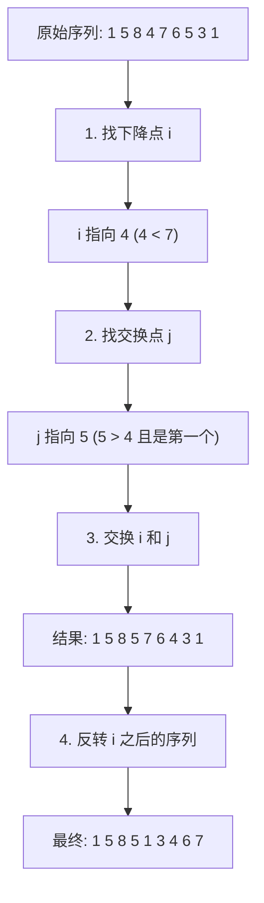

# 1. 题目

给你一个正整数 $n$，请你找出符合条件的最小整数，其由重新排列 $n$ 中存在的每位数字组成，并且其值大于 $n$。如果不存在这样的正整数，则返回 $-1$。

**注意**：返回的整数应当是一个 **32 位整数**，如果存在满足题意的答案，但不是 32 位整数，同样返回 $-1$。

- **输入描述**：一个正整数 $n$（$1 \leq n \leq 2^{31} - 1$）。
- **输出描述**：返回符合条件的最小整数，若不存在则返回 $-1$。

示例1

```
输入：n = 12
输出：21
```

示例2

```
输入：n = 21
输出：-1
```

> **提示**：
> - $1 \leq n \leq 2^{31} - 1$

---

# 2. 题解

这道题本质上是一道经典的组合数学问题：**寻找下一个全排列**。

我们需要找到一个比当前数字大的最小数字。如果数字已经是降序排列（如 `321`），则无法找到更大的排列。否则，我们需要通过特定的交换和反转操作来构造目标数字。

## 2.1 算法核心逻辑

为了找到“下一个更大”的数，我们需要在**尽量低位**进行变动，以保证数值**增加的幅度最小**。算法分为四个核心步骤：**找转折点、找交换点、交换、反转**。

### 2.1.1 步骤详解

假设输入数字序列为 `158476531`。

**第一步：从右往左寻找第一个“下降点”**
我们需要找到一个位置 `i`，使得 `nums[i] < nums[i+1]`。这意味着 `i` 之后的序列是单调递减的（也就是局部最大），无法通过排列 `i` 之后的数字得到更大的数，必须提升 `nums[i]`。

- 观察序列 `158476531`：
  - 从右向左遍历：`1` < `3` < `5` < `6` < `7`，这一段一直是上升的。
  - 直到遇到 `4`，发现 `4` < `7`。
- 此时 `i` 指向数字 `4` 的位置。这是需要被替换的关键位。

**第二步：从右往左寻找“最小的大数”**
在 `i` 的右侧（`7, 6, 5, 3, 1`）寻找一个最小的、但比 `nums[i]`（即 `4`）大的数。
由于 `i` 右侧是降序排列，我们只需从右向左找到第一个大于 `nums[i]` 的数即可。

- 从右向左看：`1`、`3`、`5`。
- `5` 是第一个比 `4` 大的数。
- 记录位置 `j`，指向数字 `5`。

**第三步：交换两个数字**
交换位置 `i` 和位置 `j` 的数字。

- 交换 `4` 和 `5`。
- 序列变为 `158576431`。
- 此时数值已经比原数大，但为了得到“最小”的下一个数，还需处理后半部分。

**第四步：反转右侧序列**
交换后，`i` 右侧的序列（`76431`）依然是降序的，这是原序列中“最大”的状态。为了得到“最小”的状态，我们需要将其变为升序。由于原本就是降序，只需进行**反转**操作即可。

- 反转 `7, 6, 4, 3, 1` 得到 `1, 3, 4, 6, 7`。
- 最终结果为 `158513467`。

## 2.2 图解演示

针对输入 `158476531` 的全过程如下：



---

# 3. 代码实现

C++ 标准库中已经提供了 `next_permutation` 函数，可以直接使用。但为了理解算法本质，这里同时提供手动实现的版本。

## 3.1 方式一：手动实现

```cpp
class Solution {
public:
    int nextGreaterElement(int n) {
        // 将整数转为字符串方便按位操作
        string s = to_string(n);
        int len = s.length();
        
        // Step 1: 从后往前找第一个相邻升序对
        int i = len - 2;
        while (i >= 0 && s[i] >= s[i + 1]) {
            i--;
        }
        
        // 如果没找到 i，说明整个序列是降序的，不存在更大的排列
        if (i < 0) return -1;
        
        // Step 2: 在 [i+1, end) 中从后往前找第一个大于 s[i] 的数
        int j = len - 1;
        while (j >= 0 && s[j] <= s[i]) {
            j--;
        }
        
        // Step 3: 交换 i 和 j
        swap(s[i], s[j]);
        
        // Step 4: 反转 i 之后的序列
        // 此时 [i+1, end) 一定是降序的，反转变为升序即可得到最小值
        reverse(s.begin() + i + 1, s.end());
        
        // 检查是否溢出 32 位整数范围
        long long res = stoll(s);
        return res > INT_MAX ? -1 : (int)res;
    }
};
```

## 3.2 方式二：使用 STL 库函数

利用 C++ 内置函数可以极大地简化代码，但必须注意返回值溢出的检查。

```cpp
class Solution {
public:
    int nextGreaterElement(int n) {
        string s = to_string(n);
        // next_permutation 会自动将序列重排为下一个字典序更大的排列
        // 如果当前已经是最大排列，返回 false
        if (!next_permutation(s.begin(), s.end())) {
            return -1;
        }
        
        long long res = stoll(s);
        // 必须检查结果是否超出 int 范围
        return res > INT_MAX ? -1 : (int)res;
    }
};
```

---

# 4. 注意事项

在解决此题时，有两个常见的易错点：

1.  **32 位整数溢出问题**
    题目输入的 $n$ 虽然在 `int` 范围内，但变换后的数字可能超出 `int` 范围（例如 $2147483476$ 变换后可能超过 $2147483647$）。因此，在将字符串转回数字时，必须使用 `long long` 类型的变量来接收结果，并与 `INT_MAX` 进行比较。

2.  **全降序序列的处理**
    如果输入数字的各位数字是完全降序排列的（例如 $n = 4321$），那么它已经是全排列中的最大值。此时算法第一步找不到“下降点”，变量 `i` 会变为 `-1`，应直接返回 `-1`。

---

# 5. 复杂度分析

- **时间复杂度**：$O(\log n)$。数字的位数大约为 $\log_{10} n$，无论是查找、交换还是反转操作，都是在线性扫描数字位数级别。
- **空间复杂度**：$O(\log n)$。需要将整数转换为字符串进行存储和操作。
