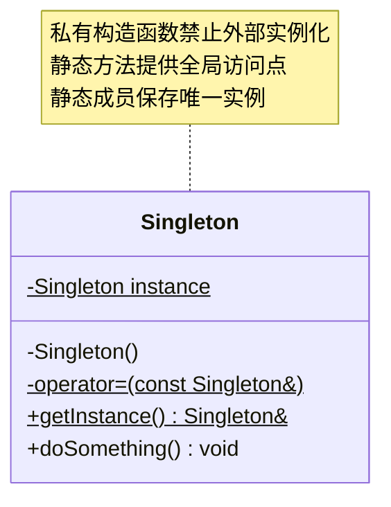
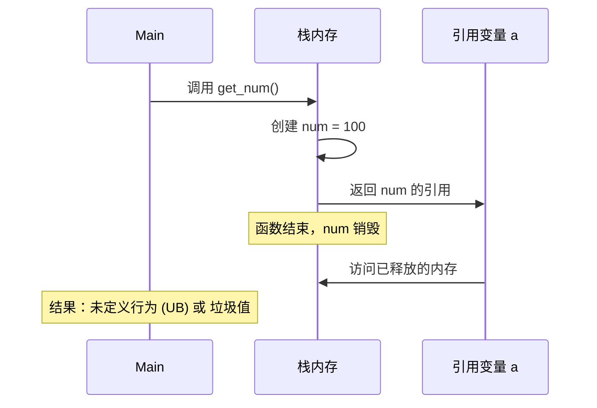
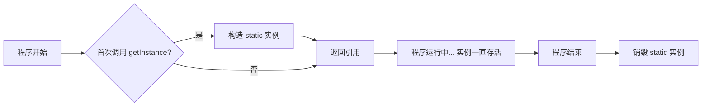

# 1. 单例模式概述

单例模式是一种创建型设计模式，其核心目的是确保一个类在整个系统中**仅有一个实例**，并提供一个**全局访问点**。

> [!info] 核心意图
> 控制实例数量，节省系统资源，并为全局状态提供一致的访问入口。

为了直观理解单例模式的结构，以下通过类图展示其核心组成：



---

# 2. 标准实现：Meyer's Singleton

在现代 C++（**C++11** 及以上）中，最推荐的单例实现方式是利用**静态局部变量**的特性。这种方式被称为 Meyer's Singleton，它不仅代码简洁，而且天然**线程安全**。

## 2.1 代码实现

以下是完整的、线程安全的单例模式实现代码：

```cpp
#include <iostream>

class Singleton {
 private:
  int m_num;
  char m_buffer[1024];
 
 public:
  // 删除拷贝构造函数，防止通过拷贝创建新实例
  Singleton(const Singleton &) = delete;
  // 删除赋值运算符，防止通过赋值修改实例
  Singleton &operator=(const Singleton &) = delete;

  // 全局访问点
  static Singleton &getInstance() {
    // C++11 保证静态局部变量初始化的线程安全性
    static Singleton instance;
    return instance;
  }

  void doSomething() {
    std::cout << "Executing singleton task...\n";
  }

 private:
  // 私有构造函数，禁止外部直接创建实例
  Singleton() { std::cout << "Singleton created.\n"; }
};
```

> [!question] `instance` 到底存放在哪？
在 `static Singleton instance;` 这行代码中：
> - **对象的数据（成员变量）**：存放在 **静态数据区（可读写）**。这意味着 `Singleton` 类中定义的 `int m_num;` 或 `char m_buffer[1024];` 等数据成员，在程序运行期间一直占据着静态区的一块固定空间。
> - **对象的成员函数**：**完全不在数据区**。所有的函数逻辑（机器指令）都存放在只读的 **代码区 (Code Segment)**。

## 2.2 调用方式

外部代码只能通过引用来获取并操作这个唯一的实例：

```cpp
int main() {
  // 获取单例引用
  Singleton &s = Singleton::getInstance();
  s.doSomething();
  
  // 再次获取，只会返回同一个实例
  Singleton &s2 = Singleton::getInstance();
  // s 和 s2 引用的是同一个对象
}
```


> [!question] 调用 `Singleton::getInstance().doSomething();` 时发生了什么？

当你执行这行代码时，内存的操作是跨区域协作的：

**第一步：获取引用 (`getInstance()`)**

- 编译器首先会检查一个隐藏的 **guard 变量**（同样存放在静态数据区），判断 `instance` 是否已经完成初始化。
  - 如果是**第一次调用**：执行 `Singleton()` 构造函数，在**静态数据区**为 `instance` 完成初始化（这一步在多线程下由编译器生成的同步逻辑保护，保证只执行一次）。
  - 如果**不是第一次调用**：跳过构造，直接使用已有对象。
- 无论哪种情况，最终编译器都会去**静态数据区**找到 `instance` 的首地址，并将其作为 `this` 指针返回。

**第二步：函数执行**，当你调用 `.doSomething()` 时：

1. **指令来源**：CPU 从**代码区**加载 `doSomething()` 函数的机器指令。
2. **函数栈帧 (Stack)**：
   - 当 `doSomething()` 函数开始运行时，它会在**栈区 (Stack)** 开辟一块临时的空间（栈帧）。
   - **参数**：`doSomething()` 本身不接受参数，但调用过程仍会像普通成员函数一样，通过隐式的 `this` 指针参数完成传递。
   - **局部变量**：如果函数内部定义了局部变量，它们会存在于**栈区**；而 `std::cout` 本身是一个全局对象（存放在静态区），函数只是调用它，并不在栈上创建它。
   - **this 指针**：静态数据区中 `instance` 的地址会通过寄存器（如 x86-64 下的 `rdi`）传给 `doSomething()`，告诉它："请操作静态区里的那块数据（即 `m_num`、`m_buffer`）"。
## 2.3 错误调用示例分析

由于我们封死了创建和复制的途径，以下尝试都会直接导致编译错误：

| 错误尝试 | 编译错误原因 |
| :--- | :--- |
| `Singleton a;` | **构造函数私有**：外部无法访问 `private` 构造函数。 |
| `Singleton b = Singleton::getInstance();` | **拷贝构造删除**：尝试调用已删除的拷贝构造函数。 |
| `Singleton s2(s1);` | **拷贝构造删除**：同上，禁止通过拷贝产生新对象。 |

---

# 3. 核心原理深度剖析

为了彻底掌握单例模式，我们需要深入理解其背后的三个关键技术决策。

## 3.1 访问控制：私有构造函数

将构造函数设为 `private` 是单例模式的第一道防线。

> [!question] 为什么私有构造函数能迫使所有人通过 `getInstance()` 获取实例？

这是利用了 C++ 的访问控制机制：
- **类内部**：成员函数（如 `getInstance`）可以访问私有成员（包括构造函数）。
- **类外部**：用户代码无法调用私有构造函数，因此无法直接定义对象。

```cpp
// 类内部
static Singleton &getInstance() {
    static Singleton instance; // ✅ 成员函数有权调用 private 构造函数
    return instance;
}

// 类外部
Singleton a; // ❌ 编译报错：'Singleton::Singleton()' is private
```

如果构造函数是 `public`，任何人都可以随意创建实例，单例的唯一性就无法保证。

## 3.2 静态局部变量的生命周期

在 `getInstance()` 中使用静态局部变量 `static Singleton instance;` 是实现单例的关键。

### 3.2.1 生命周期对比

我们需要对比普通局部变量与静态局部变量的根本区别，以理解为何前者会导致错误而后者安全。

> [!warning] 危险示例：返回局部变量的引用
> 这是一个经典的 C++ 错误，称为“悬空引用”。

```cpp
int& get_num() {
  int num = 100; // 局部变量，存储在栈上
  return num;    // 返回栈变量的引用
} // 函数结束，num 被销毁，内存失效
```

当调用 `int& a = get_num();` 时，内存变化如下：



这就是为什么 `get_num()` 返回的引用会得到类似 `-858993460` (0xCCCCCCCC) 这样的值——这是 MSVC 编译器用于标记**未初始化或已释放栈内存**的填充值。

### 3.2.2 正确做法：静态变量

单例模式中使用的是静态变量：

```cpp
static Singleton& getInstance() {
    static Singleton instance; // 静态变量，存储在静态数据区
    return instance;
}
```

**关键差异**：
- **存储位置**：静态变量存储在全局/静态数据区，而非栈区。
- **生命周期**：从第一次构造开始，直到程序结束才销毁。
- **安全性**：函数返回后，对象依然存在，引用始终有效。



此外，C++11 标准明确保证：**静态局部变量的初始化是线程安全的**。编译器会自动生成代码确保多线程环境下只初始化一次。

## 3.3 接口设计：返回引用

`getInstance()` 返回引用 (`Singleton&`) 而非指针或对象值，是经过深思熟虑的设计。

```cpp
static Singleton& getInstance() { return instance; } // ✅ 最佳实践
```

有以下两点优势：

- **语义清晰**：引用代表对象的别名，明确表示“使用这个对象”而非“创建新对象”。
- **安全性**：引用无法被 `delete`，无法重新赋值绑定，确保了对唯一实例的安全访问。

> [!question] 为什么不返回值？

```cpp
static Singleton getInstance() { return instance; } // ❌ 错误做法
```

返回值会触发**拷贝构造函数**。这不仅违背了“唯一实例”的初衷（产生了一个副本），而且因为我们已经 `= delete` 了拷贝构造，这行代码会直接导致编译错误。

> [!question] 为什么不返回指针？

```cpp
static Singleton* getInstance() { return &instance; } // ⚠️ 可行但不推荐
```

虽然可行，但存在风险：
1. 调用者可能误用 `delete` 删除指针，导致单例被意外销毁。
2. 容易造成语义混淆，不如引用直观。

## 3.4 防御机制：删除拷贝与赋值

仅私有构造函数是不够的，必须彻底封死复制渠道。

### 3.4.1 为什么必须禁止拷贝构造？

假设我们只私有化了构造函数，但没有删除拷贝构造：

```cpp
Singleton& s1 = Singleton::getInstance();
Singleton s2 = s1; // 如果允许拷贝，现在有了两个实例！
```

这会导致单例失效。早期的 C++ 做法是将拷贝构造声明为 `private` 且不实现，但这存在隐患——类内部仍可能意外调用它。

### 3.4.2 `= delete` vs `private`

现代 C++ 推荐使用 `= delete`，它提供了更高级别的安全性：

| 特性 | `private` 声明 | `= delete` (C++11) |
| :--- | :--- | :--- |
| **类外部调用** | 编译错误 | 编译错误 |
| **类内部调用** | 允许（但链接时报错） | **编译错误**（彻底禁止） |
| **错误提示** | "is private" | "use of deleted function" |
| **安全性** | 中等 | **最高** |

因此，完整的防御机制应包含：

```cpp
Singleton(const Singleton &) = delete;             // 禁止拷贝构造
Singleton &operator=(const Singleton &) = delete;  // 禁止赋值操作
```

---

# 4. 单例模板

## 4.1 继承版 CRTP 单例

```cpp
#include <iostream>

template <typename T>
class Singleton {
public:
    // 获取单例对象的全局接口
    static T& instance() {
        // C++11规定，局部静态变量的初始化是线程安全的
        static T s_instance; 
        return s_instance;
    }

    // 删除拷贝构造和赋值函数，防止复制出新对象
    Singleton(const Singleton&) = delete;
    Singleton& operator=(const Singleton&) = delete;

protected:
    Singleton() = default;
    virtual ~Singleton() = default;
};
```

**使用示例**：

```cpp
// 继承 Singleton 模板
class MyManager : public Singleton<MyManager> {
    // 必须把 Singleton 设为友元，否则父类无法调用子类的私有构造函数
    friend class Singleton<MyManager>; 

public:
    void doSomething() {
        std::cout << "执行操作" << std::endl;
    }

private:
    MyManager() = default;
};

int main() {
    // 通过 instance() 获取唯一的对象并调用方法
    MyManager::instance().doSomething();
    return 0;
}
```

这种写法里，`Singleton<MyManager>` 是 `MyManager` 的基类。基类里删掉了拷贝和赋值，所以 `MyManager` 也会天然变成不可拷贝、不可赋值，通常就不用再在 `MyManager` 里重复写一遍了。

> [!note] CRTP 版一个容易被忽略的细节：析构函数需要设置为 `protected`
> 
> ```cpp
> protected:
>     Singleton() = default;
>     virtual ~Singleton() = default;
> ```
> 
> 这里析构函数放在 `protected` 而不是 `public`，是有意为之的设计：
> 
> - 如果析构函数是 `public` 的，外部代码理论上可以拿到一个 `Singleton<MyManager>*` 的基类指针，然后 `delete` 它，这会破坏“单例生命周期由静态存储期自动管理”的约定。
> - 设为 `protected`，就杜绝了外部通过基类指针手动删除单例的可能，只有派生类自己（或者程序退出时的静态析构过程）能够析构它。
> - 同时把它声明为 `virtual`，是防御性编程的惯例——万一将来有人真的通过基类指针做了些多态操作，也能保证析构行为正确，不会出现只析构了基类部分、派生类资源泄漏的问题。

## 4.2 friend 版

```cpp
#include <iostream>

template <typename T>
class Singleton {
public:
    // 获取单例对象的全局接口
    static T& instance() {
        // C++11规定，局部静态变量的初始化是线程安全的
        static T s_instance; 
        return s_instance;
    }
};
```

**使用示例**：

```cpp
class MyManager {
    // 必须把 Singleton 设为友元，否则父类无法调用子类的私有构造函数
    friend class Singleton<MyManager>; 

public:
    void doSomething() {
        std::cout << "执行操作" << std::endl;
    }

	MyManager(const MyManager&) = delete;
	MyManager& operator=(const MyManager&) = delete;

private:
    MyManager() = default;
};

int main() {
    // 通过 instance() 获取唯一的对象并调用方法
    MyManager::instance().doSomething();
    return 0;
}
```

该版本不需要在单例模板中删除拷贝构造和赋值函数，但是需要在 MyManager 中进行删除。本质原因就是：**friend 版里 `Singleton<T>` 和 `MyManager` 没有继承关系**，删了也没用（不会传递给 `MyManager`），所以必须让 `MyManager` 自己删。

## 4.3 补充说明

> [!question] 为什么两个版本都需要 `friend`？

原因其实是同一个：`static T s_instance;` 这行代码是在 **`Singleton<T>` 内部**执行的，而它要构造的却是 `T`（也就是 `MyManager`）的对象。既然 `MyManager` 的构造函数是 `private`，那么“外人” `Singleton<T>` 想调用它，就必须先被 `MyManager` 声明为 `friend`。

这一点在两个版本里是**完全一样的逻辑**，跟是否继承无关——继承与否只影响“拷贝/赋值该在谁那里删”，不影响 friend 的必要性。

> [!question] 两个版本的本质区别：是不是 “is-a” 关系

这是两种写法真正的分水岭，值得单独强调一下：

| | CRTP 版 | friend 版 |
|---|---|---|
| `MyManager` 和 `Singleton<MyManager>` 的关系 | **是一个**（is-a），公有继承 | **没有关系**，`Singleton<T>` 只是一个工具类 |
| 拷贝/赋值删除写在哪 | 写在基类 `Singleton<T>` 一次即可，所有派生类自动继承这个“不可拷贝”属性 | 每个使用该模板的类（如 `MyManager`）都要**自己重复写一遍** `= delete` |
| 代码复用程度 | 高（继承体系统一管理） | 低（每个单例类都要写模板代码） |
| 耦合程度 | 较高：`MyManager` 对外暴露了它是 `Singleton<MyManager>` 的子类，`Singleton<T>` 的公有接口（如 `instance()`）也会被继承下来 | 较低：`MyManager` 只是“借用”了 `Singleton<T>::instance()` 这个静态函数来创建自己，本身不带任何继承包袱 |

---

# 5. 适用场景与局限性

单例模式是一把双刃剑，需在合适的场景下使用。

## 5.1 推荐使用场景

- **资源管理器**：如纹理、音频、线程池管理器，需要全局统一调度。
- **配置管理器**：系统配置通常只需要一份，全局可读。
- **日志系统**：通常只需要一个日志实例来统一输出路径。
- **游戏主循环/存档系统**：保证核心逻辑的唯一性。

## 5.2 局限性与注意事项

> [!warning] 注意：全局状态的陷阱
> 单例模式本质上是一个“全局变量”。过度使用会导致代码耦合度增加，难以测试（难以 Mock）。

**缺点总结**：
1. **隐藏依赖**：依赖单例的类可能与单例紧密耦合，不易剥离。
2. **并发问题**：虽然 C++11 保证了初始化的线程安全，但单例对象的业务方法仍需开发者自行保证线程安全。
3. **生命周期管理**：如果单例依赖其他单例，析构顺序可能导致问题。

**最佳实践**：仅在确信**必须**限制实例数量为 1 时使用，而非为了“方便传参”而滥用。
