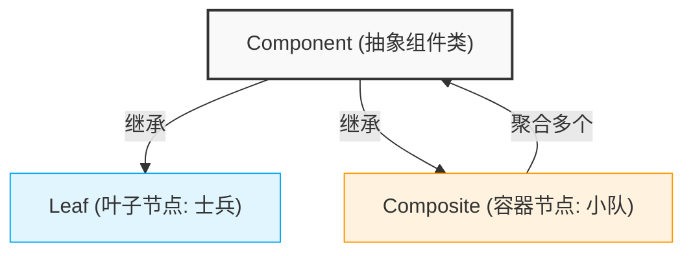

# 1. 核心概念

组合模式是一种处理“部分-整体”层次结构的结构型设计模式。它能让你将对象组合成树状结构，并且==像处理单个对象一样处理对象的集合==。

其核心思想在于**模糊了简单元素与复杂元素之间的界限**，客户端代码无需关心当前处理的是单个对象还是组合对象，从而极大地简化了客户端的逻辑。

以下是组合模式标准结构的可视化表示：



---

# 2. 问题引出与痛点分析

假设我们在开发一款策略游戏，场景中存在**士兵**和**小队**两种基本实体。初学者往往采用硬编码的方式管理这种“部分-整体”关系。

## 2.1 硬编码的反模式实现

```cpp
#include <iostream>
#include <vector>

class Soldier {
public:
    void move() { std::cout << "士兵正在行进...\n"; }
};

class Squad {
public:
    void addSoldier(Soldier* s) { soldiers.push_back(s); }
    void moveAll() {
        std::cout << "小队开始行动：\n";
        for (auto s : soldiers) s->move();
    }
private:
    std::vector<Soldier*> soldiers;
};
```

## 2.2 硬编码方案的致命缺陷

> [!warning] 核心痛点总结
> 这种“为每种容器写独特逻辑”的做法在软件工程中是不可持续的，存在以下三个致命缺陷：

1. **接口不统一**：客户端必须明确区分对象类型，调用不同的方法（`s1.move()` vs `squad.moveAll()`），违反了多态原则。
2. **扩展性极差**：若新增“军团”层级，必须新增类并重写遍历逻辑，代码呈线性膨胀。
3. **无法支持嵌套**：如果要求“小队中包含其他小队”，由于 `Squad` 只能接受 `Soldier*`，现有结构将直接崩溃。

---

# 3. 透明模式（Transparent）

> [!abstract] 组合模式标准实现：透明模式（Transparent）
> 将管理方法（`add`/`remove`）声明在抽象组件中，叶子节点提供**空实现**或**抛出异常**。客户端可完全透明地操作所有节点。

## 3.1 代码示例

```cpp
#include <iostream>
#include <vector>
#include <memory>
#include <string>

// === Component: 抽象组件 ===
class GameEntity {
 public:
  virtual ~GameEntity() = default;
  virtual void executeOrder(int depth = 0) = 0;

  // 🔑 透明模式核心：管理方法在基类声明
  virtual void add(std::shared_ptr<GameEntity> entity) {
    // 叶子节点默认空实现（或可选：抛出运行时异常）
    // throw std::logic_error("Leaf does not support add()");
  }

  virtual void remove(std::shared_ptr<GameEntity> entity) {}
};

// === Leaf: 叶子节点 ===
class Soldier : public GameEntity {
  std::string name;

 public:
  Soldier(std::string n) : name(std::move(n)) {}

  void executeOrder(int depth = 0) override {
    std::cout << std::string(depth * 2, ' ') << "🪖 [士兵 " << name << "] 冲锋!\n";
  }

  // ✅ 继承基类的空实现 add()/remove()，无需重写
};

// === Composite: 容器节点 ===
class Squad : public GameEntity {
  std::vector<std::shared_ptr<GameEntity>> members;
  std::string squadName;

 public:
  Squad(std::string name = "无名小队") : squadName(std::move(name)) {}

  // 🔑 重写管理方法，实现真正的添加逻辑
  void add(std::shared_ptr<GameEntity> entity) override {
    if (entity)
      members.push_back(entity);
  }

  void remove(std::shared_ptr<GameEntity> entity) override {
    members.erase(std::remove(members.begin(), members.end(), entity), members.end());
  }

  void executeOrder(int depth = 0) override {
    std::string indent(depth * 2, ' ');
    std::cout << indent << "🚩 [" << squadName << "] 下达指令:\n";
    for (const auto &member : members) {
      member->executeOrder(depth + 1);  // 🔄 递归调用
    }
  }
};
```

## 3.2 客户端调用：完全透明

```cpp
int main() {
  // 🌲 构建树状结构
  auto s1 = std::make_shared<Soldier>("张三");
  auto s2 = std::make_shared<Soldier>("李四");
  auto squadA = std::make_shared<Squad>("突击小队");

  squadA->add(s1);  // ✅ 客户端无需关心 squadA 是容器
  squadA->add(s2);

  auto mainForce = std::make_shared<Squad>("主力军团");
  mainForce->add(squadA);  // ✅ 容器嵌套容器
  mainForce->add(std::make_shared<Soldier>("王五"));

  // 🎯 统一接口调用：多态的终极体现
  std::vector<std::shared_ptr<GameEntity>> allUnits = {s1, mainForce};
  for (const auto &unit : allUnits) {
    unit->executeOrder();  // 🔥 无需 dynamic_cast，无需类型判断
  }

  // ⚠️ 但透明模式的代价：
  s1->add(std::make_shared<Soldier>("赵六"));  // ✅ 编译通过，但逻辑无意义（空实现）

  return 0;
}
```

**输出**：

```bash
🪖 [士兵 张三] 冲锋!
🚩 [主力军团] 下达指令:
  🚩 [突击小队] 下达指令:
    🪖 [士兵 张三] 冲锋!
    🪖 [士兵 李四] 冲锋!
  🪖 [士兵 王五] 冲锋!
```

---

# 4. 安全模式（Safe）

> [!abstract] 组合模式变体：安全模式（Safe）
> 管理方法（`add`/`remove`）**仅声明在容器类中**，叶子节点接口保持纯净。编译期即可阻止非法调用。

## 4.1 代码示例

```cpp
#include <iostream>
#include <vector>
#include <memory>
#include <string>

// === Component: 抽象组件（仅业务接口）===
class GameUnit {
public:
    virtual ~GameUnit() = default;
    virtual void executeOrder(int depth = 0) = 0;
    // 🔑 安全模式核心：基类不声明 add/remove
};

// === Leaf: 叶子节点（接口纯净）===
class Soldier : public GameUnit {
    std::string name;
public:
    Soldier(std::string n) : name(std::move(n)) {}
    
    void executeOrder(int depth = 0) override {
        std::cout << std::string(depth * 2, ' ') 
                  << "🪖 [士兵 " << name << "] 冲锋!\n";
    }
    // ✅ 无 add/remove 方法，接口最小化
};

// === Composite: 容器节点（独占管理方法）===
class Squad : public GameUnit {
    std::vector<std::shared_ptr<GameUnit>> members;
    std::string squadName;
public:
    Squad(std::string name = "无名小队") : squadName(std::move(name)) {}
    
    // 🔑 管理方法仅在容器中声明 → 编译期类型安全
    void add(std::shared_ptr<GameUnit> entity) {
        if (entity) members.push_back(entity);
    }
    void remove(std::shared_ptr<GameUnit> entity) {
        members.erase(std::remove(members.begin(), members.end(), entity), members.end());
    }
    
    void executeOrder(int depth = 0) override {
        std::string indent(depth * 2, ' ');
        std::cout << indent << "🚩 [" << squadName << "] 下达指令:\n";
        for (const auto& member : members) {
            member->executeOrder(depth + 1);
        }
    }
    
    // 🔍 可选：提供访问子节点的方法（仍保持类型安全）
    const auto& getMembers() const { return members; }
};
```

## 4.2 客户端调用：需类型区分

```cpp
int main() {
    auto s1 = std::make_shared<Soldier>("张三");
    auto squadA = std::make_shared<Squad>("突击小队");
    
    // ✅ 业务接口统一调用
    s1->executeOrder();
    squadA->executeOrder();
    
    // 🔑 管理接口：必须通过 Squad* 调用
    squadA->add(s1);  // ✅ 编译期检查：只有 Squad 有 add()
    
    // ❌ 以下代码编译失败，类型安全得到保障：
    // std::shared_ptr<GameUnit> unit = s1;
    // unit->add(std::make_shared<Soldier>("李四"));  // 🚫 error: 'class GameUnit' has no member named 'add'
    
    // 🔧 如果确实需要动态添加，必须显式向下转型：
    std::shared_ptr<GameUnit> generic = squadA;
    if (auto squadPtr = std::dynamic_pointer_cast<Squad>(generic)) {
        squadPtr->add(std::make_shared<Soldier>("李四"));  // ✅ 运行时检查 + 显式意图
    }
    
    return 0;
}
```

**输出**：

```bash
🪖 [士兵 张三] 冲锋!
🚩 [主力军团] 下达指令:
  🚩 [突击小队] 下达指令:
    🪖 [士兵 张三] 冲锋!
    🪖 [士兵 李四] 冲锋!
  🪖 [士兵 王五] 冲锋!
```

---

# 4. 模式进阶与多维解析

在实际应用组合模式时，根据接口设计的不同，存在两种主要变体。上述代码采用的是“透明模式”。

## 4.1 透明模式与安全模式对比

| 对比维度 | 透明模式 (上述代码采用) | 安全模式 |
| :--- | :--- | :--- |
| **`add`等方法位置** | 定义在**抽象组件类**中 (提供默认空实现) | 仅定义在**容器节点类**中 |
| **客户端调用** | 统一，无需类型转换 (`entity->add()`) | 需要类型判断或向下转型 (`dynamic_cast`) |
| **安全性** | 较低，调用叶子节点的 `add` 不会报错但无意义 | 较高，编译期阻止对叶子节点调用 `add` |
| **纯粹性** | ==接口完全一致，最符合组合模式初衷== | 接口不一致，损失了部分多态性 |

> [!tip] 实践建议
> 在C++中，由于没有像 Java/C# 那样的运行时接口拦截机制，如果团队对类型安全要求极高，可使用安全模式；在大多数游戏引擎和 UI 框架中，为了简化客户端代码，通常首选透明模式。

**典型适用场景**：

| 场景 | 组合模式价值 | 模式选择建议 |
|------|-------------|-------------|
| **UI 组件树** | 窗口→面板→按钮，事件冒泡/布局计算统一 | 透明模式（客户端代码简洁） |
| **文件系统** | 目录包含文件/子目录，递归计算大小/权限 | 透明模式 + 混合异常检查 |
| **游戏场景图** | 节点嵌套变换、渲染、更新逻辑 | 安全模式（逻辑严谨性优先） |
| **组织架构** | 公司→部门→员工，权限/任务递归下发 | 混合模式（开发期检查 + 发布期透明） |
| **表达式解析** | 算术表达式树（常量/变量/运算符） | 透明模式（递归求值自然） |

---

# 5. 工程实践

## 5.1 混合模式

混合模式可以兼顾透明性与安全性：

```cpp
class GameEntity {
public:
    virtual ~GameEntity() = default;
    virtual void executeOrder(int depth = 0) = 0;
    
    // 🔑 混合策略：声明但默认抛出异常
    virtual void add(std::shared_ptr<GameEntity> entity) {
        throw std::logic_error(
            "❌ add() called on leaf node: " + 
            typeid(*this).name()
        );
    }
};

class Soldier : public GameEntity {
    // ✅ 继承 add()，但调用时抛出清晰异常
    void executeOrder(int depth = 0) override { /* ... */ }
};

class Squad : public GameEntity {
    void add(std::shared_ptr<GameEntity> entity) override {
        members.push_back(entity);  // ✅ 正常实现
    }
};
```

**优势**：
- ✅ 保持接口统一（透明性）
- ✅ 非法调用时给出**明确错误信息**（安全性）
- ✅ 调试阶段快速发现问题，发布阶段可通过宏关闭检查

## 5.2 注意事项

```cpp
// ⚠️ 1. 虚析构函数必须声明（防止内存泄漏）
class GameEntity {
public:
    virtual ~GameEntity() = default;  // ✅ 关键！
};

// ⚠️ 2. 避免 shared_ptr 循环引用
class Squad : public GameEntity {
    std::vector<std::shared_ptr<GameEntity>> children;
    std::weak_ptr<GameEntity> parent;  // ✅ 父指针用 weak_ptr
};

// ⚠️ 3. 默认参数的静态绑定陷阱（见前文分析）
// 建议：虚函数避免默认参数，或采用 NVI 模式
class GameEntity {
public:
    void executeOrder() { executeOrderImpl(0); }  // 非虚接口
protected:
    virtual void executeOrderImpl(int depth) = 0;
};
```

## 5.3 性能优化技巧

```cpp
// 🔹 技巧1：预留容器容量，减少 rehash
class Squad : public GameEntity {
    std::vector<std::shared_ptr<GameEntity>> members;
public:
    Squad(size_t reserveSize = 4) {
        members.reserve(reserveSize);  // ✅ 预分配，提升 add 性能
    }
};

// 🔹 技巧2：小对象优化（避免频繁动态分配）
class SmallSquad : public GameEntity {
    // 最多容纳 4 个子节点时，使用栈上存储
    std::array<std::shared_ptr<GameEntity>, 4> smallBuffer;
    std::vector<std::shared_ptr<GameEntity>>* members;
    
public:
    SmallSquad() : members(&smallBuffer) {}
    
    void add(std::shared_ptr<GameEntity> e) override {
        if (members->size() < 4 && members == &smallBuffer) {
            smallBuffer[members->size()] = e;
        } else {
            if (members == &smallBuffer) {
                // 首次溢出：迁移到堆
                auto* heapVec = new std::vector<std::shared_ptr<GameEntity>>(
                    smallBuffer.begin(), smallBuffer.end()
                );
                members = heapVec;
            }
            static_cast<std::vector<std::shared_ptr<GameEntity>>*>(members)->push_back(e);
        }
    }
    // ... 注意析构时清理堆内存
};
```
