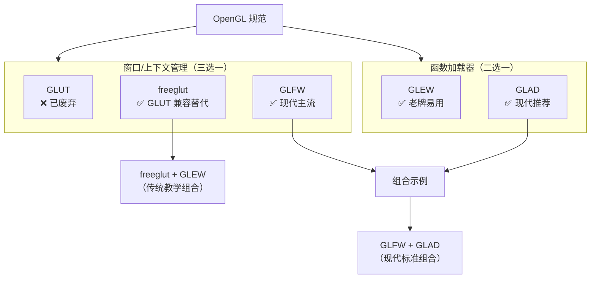

> Q：什么是 OpenGL？

简单来说，**OpenGL (Open Graphics Library)** 既不是一种编程语言，也不是一个具体的软件，而是一套 **底层的图形应用程序编程接口（API）**。它定义了一系列标准的指令，让程序员可以用代码告诉显卡（GPU）该如何在屏幕上画出复杂的 3D 场景。

> [OpenGL 学习仓库](https://github.com/loskyertt/OpenGL_learn.git)

---

# 1. 作用

在没有 OpenGL 之前，程序员如果想在不同的显卡上显示图形，必须针对每种硬件编写不同的代码。OpenGL 实习了下面的功能：

- **跨平台**：无论你在 Windows、Linux 还是 macOS 上，代码逻辑基本一致。
- **硬件加速**：它将计算压力从 CPU 转移到专门处理图形的 GPU 上。
- **渲染流水线**：它负责将你定义的点、线、面，最终转换成屏幕上五颜六色的像素。

---

# 2. OpenGL 的现状

虽然现在图形界有很多“后起之秀”，但 OpenGL 依然占据重要地位：

|**竞争对手**|**特点**|**与 OpenGL 的关系**|
|---|---|---|
|**DirectX**|微软自家产品|仅限 Windows/Xbox，性能极强，是 OpenGL 的老对手。|
|**Vulkan**|下一代标准|OpenGL 的继任者。性能更榨干硬件，但学习难度极大。|
|**Metal**|苹果自研|苹果为了性能，在自家设备上逐渐放弃了 OpenGL。|

现在的 OpenGL 主要用于：
1. **入门教学**：它是学习计算机图形学的必经之路。
2. **专业软件**：很多 CAD 建模软件（如 Blender）和地理信息系统（GIS）。
3. **移动端**：其精简版 **OpenGL ES** 几乎统治了早期的安卓和 iOS 游戏开发。

---

# 3. 组件

## 3.1 OpenGL 本身

> 图形渲染核心，Windows 的 `opengl32.dll` 在 `C:\Windows\System32` 这个目录下。

**OpenGL** 是跨平台的**图形渲染 API 规范**（由 Khronos Group 维护），定义了绘制 2D/3D 图形的函数接口（如 `glClear`, `glDrawArrays`）。

它并 **不负责** 创建窗口、处理键盘/鼠标输入、加载高版本/扩展函数（需额外工具）。因此，实际使用时需配合其他库完成完整应用开发。

## 3.2 窗口与上下文管理库

这类库负责：创建窗口、创建/激活 OpenGL 上下文、处理输入事件。

| 库名 | 状态 | 特点 | 与 OpenGL 关系 |
|------|------|------|----------------|
| **GLUT** (OpenGL Utility Toolkit) | ❌ 已废弃（1998年后停止维护） | 最早的跨平台窗口工具包，API 简单 | 提供基础窗口和回调机制 |
| **freeglut** | ✅ 活跃维护 | GLUT 的开源替代，修复 bug、增加功能（如多窗口） | **完全兼容 GLUT API**，是 GLUT 的延续 |
| **GLFW** | ✅ 现代主流 | 专为 OpenGL/ Vulkan/ Metal 设计，轻量、模块化、支持多窗口/多显示器 | **不兼容 GLUT**，但功能更强大、更现代 |

> **推荐**：新项目优先使用 **GLFW**；维护旧代码可继续用 freeglut。

## 3.3 OpenGL 函数加载库

OpenGL 驱动在运行时才暴露高版本/扩展函数指针，需通过加载器获取。核心作用：**调用 `gladLoadGL()` 或 `glewInit()` 填充函数指针表**。

| 库名 | 特点 | 优势 | 劣势 |
|------|------|------|------|
| **GLEW** (OpenGL Extension Wrangler) | 老牌加载器，曾是事实标准 | 使用简单，自动加载所有扩展 | 不支持核心上下文需设 `glewExperimental=GL_TRUE`；静态绑定全部函数，体积大 |
| **GLAD** | 现代生成式加载器 | 按需生成代码（指定 OpenGL 版本/扩展），轻量；天然支持核心上下文 | 需通过 [glad web service](https://glad.dav1d.de/) 生成源码 |

> **推荐**：新项目用 **GLAD**（更灵活、现代）；教学/快速原型可用 GLEW。

## 3.4 组件关系图



> **关键点**：**窗口管理库** 与 **函数加载库** 是正交组合，可自由搭配，比如：
> - `GLFW + GLEW`
> - `GLFW + GLAD` ← **现代推荐**
> - `freeglut + GLEW`
>> **不需要** 同时用 GLEW + GLAD（这俩功能重叠）。

## 3.5 典型初始化流程对比

1. 现代组合：GLFW + GLAD

```cpp
glfwInit();
GLFWwindow* window = glfwCreateWindow(800, 600, "GLFW+GLAD", NULL, NULL);
glfwMakeContextCurrent(window);

// GLAD 必须在上下文激活后初始化
if (!gladLoadGLLoader((GLADloadproc)glfwGetProcAddress)) {
    // 失败处理
}
```

2. 传统组合：freeglut + GLEW

```cpp
glutInit(&argc, argv);
glutCreateWindow("freeglut+GLEW");

// GLEW 必须在上下文激活后初始化
glewExperimental = GL_TRUE;  // 核心上下文必需
glewInit();
```

> **共同原则**：无论用哪个组合，**函数加载器（GLEW/GLAD）必须在窗口创建 + 上下文激活之后调用**，否则会失败。

## 3.6 问题汇总

### 3.6.1 Q.1

> Q：不管是用 `glfw + glew` 组合，还是 `glfw + glad` 组合，为什么导入头文件的顺序都得是 `glew/glad` 在 `glfw` 之前？

GLEW/GLAD 必须在 GLFW 之前包含，因为它们需要“抢先”定义保护宏并声明函数指针，从而阻止 GLFW 间接引入的标准 OpenGL 头文件造成重复声明冲突。使用 `#define GLFW_INCLUDE_NONE` 可彻底规避此问题，也是现代项目的推荐做法。

> 详细说明如下：

**标准 OpenGL 头文件 `<GL/gl.h>`** 声明了所有 OpenGL 函数原型，例如：

```c
void glClear(GLbitfield mask);  // 函数声明
```

因此，它为了避免重复包含，便使用保护宏：

```c
#ifndef __gl_h_
#define __gl_h_
// ... 所有 OpenGL 声明 ...
#endif
```

**GLEW/GLAD 的设计目标** 是作为 **函数加载器**，它们需要将 `glClear` 等函数 **重新声明为函数指针变量**（而非函数）：

```c
// GLEW 内部实际声明
extern PFNGLCLEARPROC glClear;  // 函数指针，非函数
```

这种方式会阻止标准 `<GL/gl.h>` 被包含，否则会产生 **重复声明** （`glClear` 既是函数又是指针）和 **类型冲突**（`void glClear(...)` vs `PFNGLCLEARPROC glClear`）

`glfw3.h` 为了提供类型定义（如 `GLint`）和常量，**会间接包含系统 OpenGL 头文件**：

```c
// glfw3.h 内部（简化）
#include <GL/glcorearb.h>  // → 最终会包含 <GL/gl.h>
```

⚠️ 比如错误顺序：`glfw3.h` 先于 `glew.h`/`glad.h`

```cpp
#include <GLFW/glfw3.h>  // 1️⃣ GLFW 包含 <GL/gl.h> → 标准函数声明被引入
#include <GL/glew.h>     // 2️⃣ GLEW 尝试重新声明 glClear 为指针 → 冲突！
```

lsp 报错：`In included file: gl.h included before glew.h` 或 `OpenGL header already included, remove this include, glad already provides it`（glfw + glad 组合）。

> **原因**：`glClear` 已被标准头声明为函数，GLEW/GLAD 无法再将其重定义为指针变量。

✅ 因此正确顺序：`glew.h`/`glad.h` 先于 `glfw3.h`

```cpp
#include <GL/glew.h>     // 1️⃣ GLEW 先"占位"：定义 __gl_h_ 宏 + 声明函数指针
#include <GLFW/glfw3.h>  // 2️⃣ GLFW 尝试包含 <GL/gl.h>，但因 __gl_h_ 已定义而跳过
```

也可以使用 `GLFW_INCLUDE_NONE` 的方式。如果你希望 **完全避免 GLFW 触碰 OpenGL 头文件**，可定义宏：

```cpp
#define GLFW_INCLUDE_NONE  // 告诉 GLFW：不要包含任何 OpenGL 头
#include <GLFW/glfw3.h>    // GLFW 只提供窗口/输入 API，不碰 OpenGL
#include <GL/glew.h>       // GLEW/GLAD 全权管理 OpenGL 声明
```


