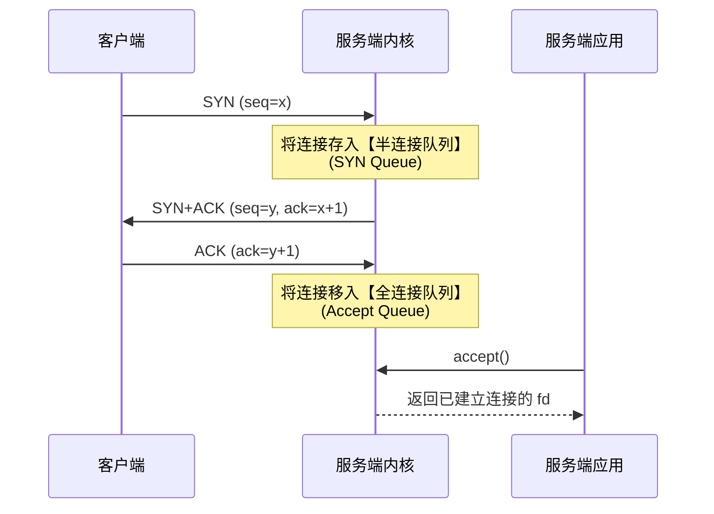
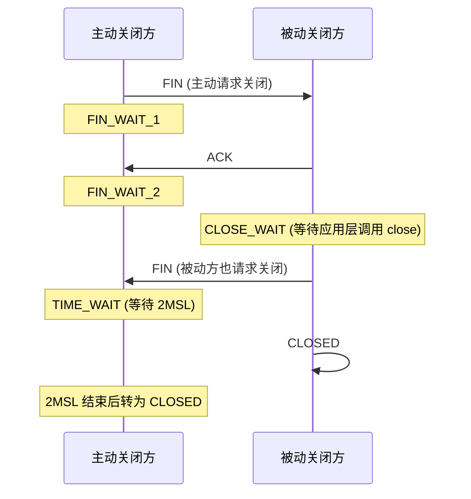
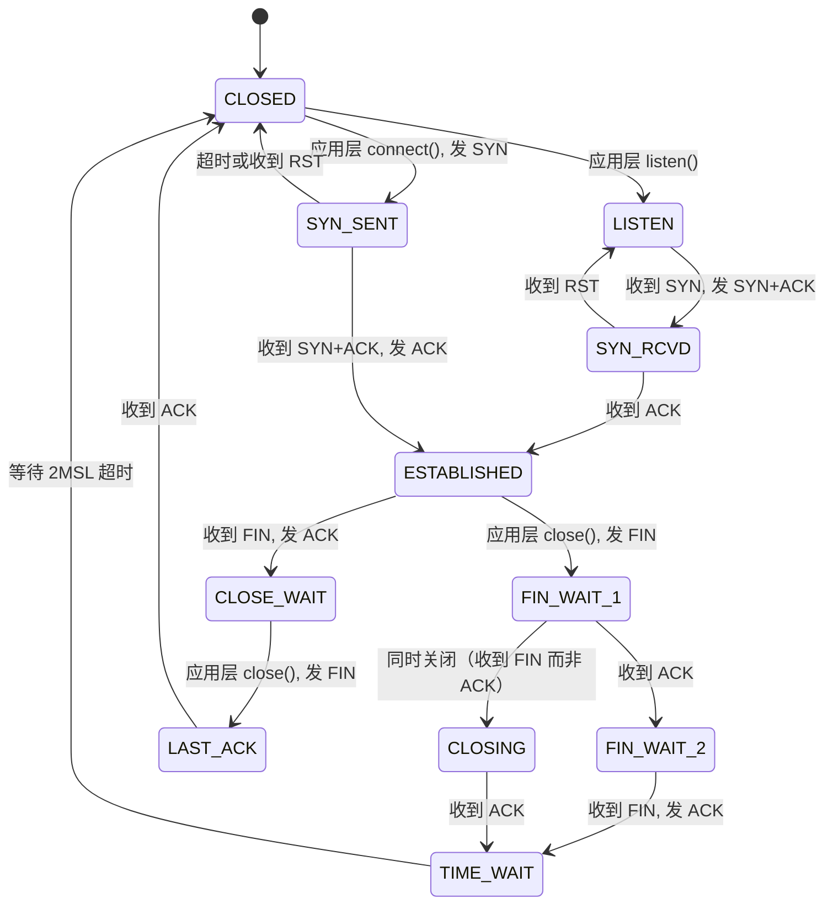

# 1. TCP连接建立与内核队列机制

三次握手不仅是网络包的交互，更是在服务器内核中维护两个核心数据结构的过程。这两个队列的大小直接决定了服务器能够承受的并发连接能力。

## 1.1 握手过程与队列流转

客户端发送 SYN，服务端收到后分配资源并放入**半连接队列**，同时回复 SYN+ACK。当客户端再次发送 ACK 到达服务端时，连接正式建立，节点被移入**全连接队列**，等待应用程序调用 `accept()` 取走。



## 1.2 队列溢出的致命影响与参数调优

- **半连接队列溢出**：内核直接丢弃 SYN 包（或回复 SYN Cookie），客户端表现为==连接超时==。这是 SYN Flood 攻击的底层原理。
- **全连接队列溢出**：此时三次握手其实已经完成，但内核无法暂存该连接，会直接丢弃或向客户端发送 RST。客户端表现为==连接被对端重置==。

`listen(fd, backlog)` 中的 `backlog` 参数控制的正是**全连接队列**的长度。

```cpp
#include <sys/socket.h>
#include <netinet/in.h>

void listener_setup() {
    int fd = socket(AF_INET, SOCK_STREAM, 0);

    sockaddr_in addr{};
    addr.sin_family      = AF_INET;
    addr.sin_port        = htons(8080);
    addr.sin_addr.s_addr = htonl(INADDR_ANY);

    int opt = 1;
    setsockopt(fd, SOL_SOCKET, SO_REUSEADDR, &opt, sizeof(opt));
    bind(fd, (sockaddr*)&addr, sizeof(addr));

    // backlog = 128：全连接队列最大缓冲 128 个已建立但未 accept 的连接
    // 实际生效值 = min(128, 系统参数 somaxconn)
    listen(fd, 128);
}
```

> [!warning] 生产环境必调参数
> - `net.core.somaxconn`：全连接队列硬上限（默认 128 或 4096，高并发需调至 1024+）。
> - `net.ipv4.tcp_max_syn_backlog`：半连接队列硬上限。
> - `net.ipv4.tcp_syncookies`：设为 1 可在半连接队列满时开启 SYN Cookie 防护，抵御 SYN Flood。

# 2. TCP连接释放与状态陷阱

四次挥手是 TCP 状态机中最复杂的部分，其中产生的 `TIME_WAIT` 和 `CLOSE_WAIT` 状态是服务器开发中最常见的故障源头。

## 2.1 挥手过程与状态变迁

主动关闭方发出 FIN 后进入 `FIN_WAIT` 状态，被动关闭方收到后进入 `CLOSE_WAIT` 状态并回复 ACK。随后被动方发出自己的 FIN，主动方收到后进入 `TIME_WAIT` 状态，等待 2MSL（最大报文段生存时间）后彻底释放。



## 2.2 TIME_WAIT 的存在价值与解决方案

TIME_WAIT 状态持续 2MSL（Linux 默认约为 60 秒），存在两个核心理由：
1. **确保最后一个 ACK 到达**：如果被动方没收到 ACK，会重传 FIN，主动方需在此状态下重发 ACK。
2. **让旧连接的残余报文消亡**：防止网络中滞留的延迟报文被相同四元组的新连接误接收。

> [!tip] 解决 bind 失败的两种方案
> 服务器重启时因存在大量 TIME_WAIT 导致 `Address already in use` 报错的解决方案：

```cpp
#include <sys/socket.h>
#include <netinet/tcp.h>

void solve_timewait(int fd) {
    // 方案1（推荐）：SO_REUSEADDR
    // 允许将处于 TIME_WAIT 的端口绑定到新的 socket 上
    // 注意：必须在 bind() 之前调用
    int opt = 1;
    setsockopt(fd, SOL_SOCKET, SO_REUSEADDR, &opt, sizeof(opt));

    // 方案2（危险）：SO_LINGER 配合超时时间为 0
    // 会导致关闭时直接发送 RST 而非走四次挥手，强行跳过 TIME_WAIT
    // 副作用：对端会收到 "Connection reset by peer"，缓冲区数据丢失！
    // 仅限调试环境使用，严禁用于生产服务器
    /*
    struct linger lg;
    lg.l_onoff = 1;
    lg.l_linger = 0;
    setsockopt(fd, SOL_SOCKET, SO_LINGER, &lg, sizeof(lg));
    */
}
```

## 2.3 CLOSE_WAIT 堆积的根因

> [!danger] 常见代码 Bug
> 如果 `ss` 命令观察到大量 `CLOSE_WAIT` 状态，==这绝对是你代码的 Bug==。
> **根因**：被动关闭方（通常是服务器）收到了对端的 FIN（此时 `recv` 返回 0），但**没有调用 `close(fd)`**。只要应用层不关闭，该连接就会永远停留在 `CLOSE_WAIT` 状态，最终耗尽文件描述符。

```cpp
void handle_client_disconnect(int fd, bool received_eof) {
    if (received_eof) {
        // recv 返回 0 表示对端发了 FIN
        // 必须调用 close，否则状态卡在 CLOSE_WAIT
        close(fd);  
    }
}
```

# 3. TCP状态机全局视图

将三次握手、四次挥手以及异常处理结合，构成 TCP 完整的状态机。理解状态机是排查复杂网络问题的终极武器。



# 4. TCP数据传输与滑动窗口机制

TCP 的可靠传输依靠**滑动窗口**（流量控制，接收方驱动）和**拥塞控制**（网络环境驱动）共同实现。这两个机制直接决定了 `send()` 和 `recv()` 在代码层面的表现行为。

## 4.1 send() 与 recv() 的真实语义

> [!important] 核心认知纠正
> - `send()` **不是**把数据发送到对端，而是==将数据从用户态拷贝到内核的发送缓冲区==。
> - 如果发送缓冲区满了（受==接收方通告窗口==和==网络拥塞窗口==双重限制），`send()` 在阻塞模式下会挂起，在非阻塞模式下会返回 `EAGAIN`。
> - `recv()` 是从内核接收缓冲区拷贝数据到用户态，TCP是面向字节流的，==绝不保证一次读取能拿到完整的业务消息==（粘包/半包问题的根源）。

```cpp
#include <sys/socket.h>
#include <cerrno>
#include <cstring>

ssize_t send_all(int fd, const void* buf, size_t len) {
    const char* ptr = static_cast<const char*>(buf);
    size_t remaining = len;

    while (remaining > 0) {
        ssize_t n = send(fd, ptr, remaining, 0);
        if (n < 0) {
            if (errno == EINTR) continue;      // 被信号中断，应重试
            if (errno == EAGAIN || errno == EWOULDBLOCK) {
                // 非阻塞模式：缓冲区已满，需等待 epoll 的 EPOLLOUT 事件
                return -1; 
            }
            return -1;   // 真正的致命错误
        }
        ptr       += n;
        remaining -= n;
    }
    return static_cast<ssize_t>(len);
}

ssize_t recv_all(int fd, void* buf, size_t len) {
    char* ptr = static_cast<char*>(buf);
    size_t received = 0;

    while (received < len) {
        ssize_t n = recv(fd, ptr + received, len - received, 0);
        if (n < 0) {
            if (errno == EINTR) continue;
            return -1;
        }
        if (n == 0) {
            // 对端调用了 close()，触发 FIN，连接已半关闭
            break; 
        }
        received += n;
    }
    return static_cast<ssize_t>(received);
}
```

## 4.2 内核缓冲区调优

对于高吞吐量服务器，默认的内核缓冲区（通常只有几十KB到一百多KB）可能成为瓶颈。

```cpp
void tune_socket_buffers(int fd) {
    int rcvbuf = 256 * 1024;  // 期望设置 256KB 接收缓冲区
    int sndbuf = 256 * 1024;  // 期望设置 256KB 发送缓冲区

    setsockopt(fd, SOL_SOCKET, SO_RCVBUF, &rcvbuf, sizeof(rcvbuf));
    setsockopt(fd, SOL_SOCKET, SO_SNDBUF, &sndbuf, sizeof(sndbuf));

    // 注意：Linux 内核会在此基础上翻倍（预留协议头和对齐开销）
    // 实际分配 = min(你设置的值 × 2, 系统最大限制 rmem_max/wmem_max)
}
```

# 5. 传输延迟优化与Nagle算法

默认情况下，TCP 启用了 Nagle 算法。其目的是减少网络中小包（如只有 1 字节有效载荷加上 40 字节 TCP/IP 头）的数量。

## 5.1 Nagle 算法的触发与延迟表现

**触发条件**：如果之前发送的数据尚未收到 ACK，后续的小包会被内核缓存起来，直到收到 ACK 或累积数据达到 MSS（最大报文段大小，通常约 1460 字节）才一起发送。

**负面影响**：在“请求-响应”模式（如 HTTP、RPC）下，发送端发了一个小请求被缓存，等待 ACK；但接收端因为没收到完整请求所以不回复 ACK，形成死锁，==最终表现为固定的 40ms（或 200ms）延迟==。

## 5.2 解决方案：TCP_NODELAY 与 writev

```cpp
#include <netinet/tcp.h>
#include <sys/uio.h>

// 方案1：直接禁用 Nagle（牺牲带宽换延迟）
void disable_nagle(int fd) {
    int opt = 1;
    setsockopt(fd, IPPROTO_TCP, TCP_NODELAY, &opt, sizeof(opt));
}

// 方案2（更优）：保留 Nagle，使用 writev 聚合数据
// 如果你的协议分为 Header 和 Body，分开 send 会触发 Nagle 延迟
// 用 writev 一次系统调用将两者打包，内核只会生成一个 TCP 报文
void send_request_with_writev(int fd,
                              const char* header, size_t hlen,
                              const char* body,   size_t blen) {
    iovec iov[2];
    iov[0].iov_base = const_cast<char*>(header);
    iov[0].iov_len  = hlen;
    iov[1].iov_base = const_cast<char*>(body);
    iov[1].iov_len  = blen;

    // 零拷贝技术基础：内核直接从不同内存地址拼接报文
    writev(fd, iov, 2);
}
```

# 6. UDP协议特性与适用场景

UDP 丢弃了 TCP 的所有可靠性机制（握手、重传、排序、拥塞控制），换来极低的延迟和极简的状态机。

## 6.1 UDP 编程模型与边界特性

与 TCP 的流式读取不同，UDP 每次调用 `recvfrom` 必须且只能提取一个完整的数据报。==UDP 天然具有消息边界，不存在“粘包”问题，但存在“截断”问题（缓冲区小于报文长度时，超出部分被静默丢弃）==。

```cpp
#include <sys/socket.h>
#include <netinet/in.h>
#include <cstdio>

void udp_server(uint16_t port) {
    int fd = socket(AF_INET, SOCK_DGRAM, 0);  // SOCK_DGRAM 代表 UDP

    sockaddr_in addr{};
    addr.sin_family      = AF_INET;
    addr.sin_port        = htons(port);
    addr.sin_addr.s_addr = htonl(INADDR_ANY);
    bind(fd, (sockaddr*)&addr, sizeof(addr));

    char buf[65535]; // UDP 数据报最大理论长度 65535 字节（实际有效载荷 65507）
    sockaddr_in client{};
    socklen_t clen = sizeof(client);

    while (true) {
        // 无论发了多少次 sendto，这里一次 recvonly 只拿一个包
        ssize_t n = recvfrom(fd, buf, sizeof(buf), 0, (sockaddr*)&client, &clen);
        if (n < 0) break;

        // 注意：如果对端发来 1000 字节，但 buf 只有 500，这里 n=500，剩下 500 被内核丢弃！
        sendto(fd, buf, n, 0, (sockaddr*)&client, clen);
    }
}
```

## 6.2 UDP 适用场景矩阵

| 场景 | 是否适用 | 原因分析 |
| :--- | :--- | :--- |
| DNS 查询 | ✅ 极度适用 | 数据极小，一问一答，丢失可重发 |
| 视频/语音流 | ✅ 极度适用 | 允许丢帧，但绝不允许因为重传导致画面卡顿 |
| 游戏状态同步 | ✅ 适用 | 最新一帧的状态永远比旧帧重要，旧包无需重传 |
| QUIC / KCP | ✅ 适用 | 在 UDP 之上由应用层实现定制化的可靠传输 |
| 文件传输 | ❌ 绝对禁止 | 必须保证字节级准确无误，丢失重传成本极高 |
| HTTP/1.1, API | ❌ 绝对禁止 | 需要强事务性和顺序保证 |

# 7. 网络状态排查与ss命令实战

`ss`（Socket Statistics）是现代 Linux 替代老旧 `netstat` 的利器，它能直接读取内核中的网络状态，是验证上述理论的最好工具。

```bash
# 查看所有 TCP 连接（-a 全部, -n 不解析域名, -t TCP）
ss -ant

# 精准过滤状态
ss -ant state time-wait    # 检查 TIME_WAIT 是否堆积
ss -ant state close-wait   # 检查是否存在代码未 close 的 Bug
ss -ant state established  # 查看当前活跃并发连接数

# 查看监听端口及全连接队列使用情况（-l 监听）
ss -lnt
# 输出示例中 State 列如果是 LISTEN，后面的 Send-Q 就是全连接队列最大值，Recv-Q 是当前等待 accept 的连接数
# 若 Recv-Q 接近 Send-Q，说明你的 accept() 太慢或 backlog 太小！

# 查看特定 socket 的详细参数（拥塞窗口 cwnd、重传 rtt 等）
ss -ti dst <目标IP>:<端口>
```

# 8. 核心问题排查总结

将理论与实际生产 Bug 对应，形成结构化的排查清单：

| 故障现象 | 底层根因 | 排查命令 | 解决方案 |
| :--- | :--- | :--- | :--- |
| 服务器重启 `bind` 失败 | 主动关闭遗留 `TIME_WAIT` | `ss -ant state time-wait` | `listen` 前设置 `SO_REUSEADDR` |
| 高并发下连接被静默丢弃 | 全连接队列溢出 | `ss -lnt` (对比 Recv-Q 和 Send-Q) | 增大 `backlog` 与 `somaxconn` |
| 文件描述符耗尽瘫痪 | `CLOSE_WAIT` 无限堆积 | `ss -ant state close-wait` | 修复代码：`recv` 返回 0 时必须 `close(fd)` |
| 请求偶尔出现 40ms 延迟 | Nagle 算法与 ACK 延迟相互作用 | 抓包查看小包发送间隔 | 设置 `TCP_NODELAY` 或合并写 `writev` |
| `send` 阻塞挂起 | 发送缓冲区满（对端不收或网络拥塞） | `ss -ti` 查看 sndbuf 和 cwnd | 改用非阻塞 I/O + epoll 的 `EPOLLOUT` |