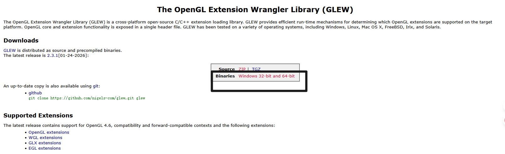
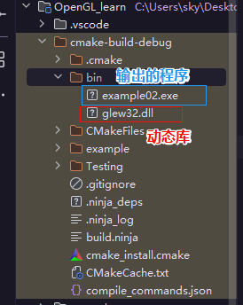
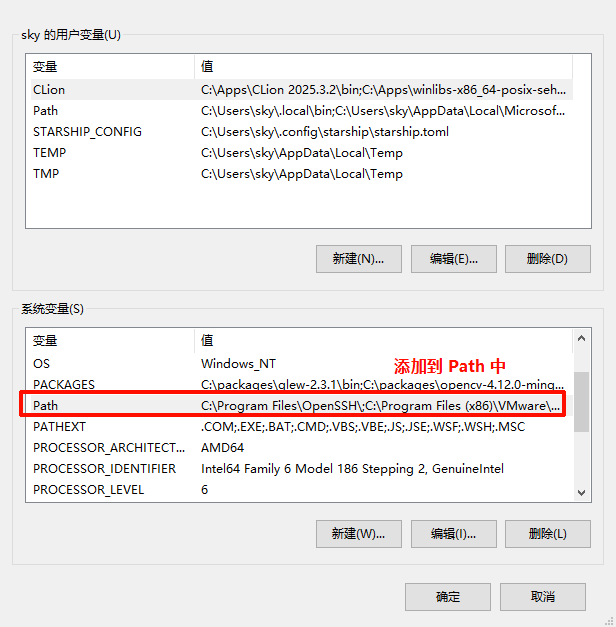

# 1. Windows 平台

## 1.1 方式一：cmake 构建

> 默认只提供动态链接。

### 1.1.1 下载源码

[下载 GLEW]([https://www.glfw.org/download.html](https://glew.sourceforge.net/index.html))。

### 1.1.2 构建和安装

> 前提配置好工具链：cmake、Ninja、mingw。推荐下载 Clion，然后把对应的工具链添加进环境变量中。

进入 `glew-2.3.1/build/cmake` 目录，和目录中的 `CMakeLists.txt` 同级，执行：

```bash
cmake -B build -G Ninja -DCMAKE_BUILD_TYPE=Release -DCMAKE_INSTALL_PREFIX="C:\packages\glew-2.3.1"
```

> 构建类型设置为 `Release`，安装目录设置为 `C:\packages\glew-2.3.1`。

构建好后进行编译：

```bash
cmake --build build -j10
```

安装：

```bash
cmake --install build
```

因为这里用的是 **单配置生成器**（Ninja）在构建时会直接指定构建类型（如 `Release` 或 `Debug`），因此在安装时不需要再指定 `--config Release`。

但是若使用的是 **多配置生成器**（Visual Studio）在构建时不会直接指定构建类型，而是在安装时需要明确指定构建类型。

```bash
# 默认使用 Visual Studio 构建（如果有的话）
cmake -B build -DCMAKE_BUILD_TYPE=Release -DCMAKE_INSTALL_PREFIX="C:\packages\glew-2.3.1"

# 编译
cmake --build build --config Release -j10

# 安装
cmake --install build --config Release
```

> 如果要卸载，直接删除 `C:\packages\glew-2.3.1` 即可。

## 1.2 方式二：使用二进制文件

> 动态链接和静态链接均提供。

下载预编译好的二进制文件（黑色框圈上的）：



我把下载好的库文件放到 `C:\packages\glew-2.3.1-win32` 目录下：


---

# 2. Linux 平台

---

# 3. 使用示例

> 这里仅展示了链接 `glew` 库的配置，其他配置省略。

## 3.1 方式一：动态链接

`CMakeLists.txt` 配置：

```cmake
list(APPEND CMAKE_PREFIX_PATH
  "C:/packages/glfw-3.4"
  "C:/packages/glew-2.3.1"
)

find_package(glfw3 REQUIRED)
find_package(GLEW REQUIRED)

# 检查目标是否存在
if(TARGET glfw)
  message(STATUS "glfw target found!")
  # 获取该目标的包含目录属性
  get_target_property(GLFW_INC glfw INTERFACE_INCLUDE_DIRECTORIES)
  message(STATUS "glfw include path: ${GLFW_INC}")
else()
  message(STATUS "glfw target NOT found!")
endif()

# glew 的信息
message(STATUS "GLEW library status:")
message(STATUS "libraries: ${GLEW_LIBRARIES}")
message(STATUS "include path: ${GLEW_INCLUDE_DIRS}")

add_executable(example main.cpp)

target_link_libraries(example
  PRIVATE
  GLEW::GLEW
  opengl32 # Windows，负责具体的渲染命令
  glfw
)

```

需要把 `C:\packages\glew-2.3.1\bin\glew32.dll` 动态库复制到和输出的程序同级目录下：



也可以把目录 `C:\packages\glew-2.3.1\bin`（包含有动态库的目录）添加到 **系统环境变量 Path** 中：



测试代码：

```cpp
//  
// Created by sky on 2026/2/12.  
//  
  
#include <GL/glew.h>  
#include <GLFW/glfw3.h>  
#include <iostream>  
  
int main(void) {  
  GLFWwindow *window;  
  
  /* Initialize the library */  
  if (!glfwInit())  
    return -1;  
  
  /* 1. 创建窗口（同时创建 OpenGL 上下文） */  
  window = glfwCreateWindow(640, 480, "第一个窗口", NULL, NULL);  
  if (!window) {  
    glfwTerminate();  
    return -1;  
  }

  /* 2. 将上下文设为当前线程的活动上下文 */  
  glfwMakeContextCurrent(window);  
  
  /* 3. 此时有有效上下文，初始化成功 */
  if (glewInit() != GLEW_OK) { std::cout << "Error\n"; }  // <--- 加了这个
  
  /* Loop until the user closes the window */  
  while (!glfwWindowShouldClose(window)) {  
    /* Render here */  
    glClear(GL_COLOR_BUFFER_BIT);  
  
    glBegin(GL_TRIANGLES);  
    glVertex2f(-0.5f, -0.5f);  
    glVertex2f(0.0f, 0.5f);  
    glVertex2f(0.5f, -0.5f);  
    glEnd();  
  
    /* Swap front and back buffers */  
    glfwSwapBuffers(window);  
  
    /* Poll for and process events */  
    glfwPollEvents();  
  }  
  glfwTerminate();  
  return 0;  
}
```

这会显示一个窗口并生成一个三角形。

## 3.2 方式二：静态链接

`CMakeLists.txt` 配置：

```cmake
message("CMakeLists.txt for example directory")

# 手动指定 glew-win32 位置
set(GLEW_INCLUDE_DIR "C:/packages/glew-2.3.1-win32/include")
set(GLEW_LIBRARY "C:/packages/glew-2.3.1-win32/lib/Release/x64/glew32s.lib")

list(APPEND CMAKE_PREFIX_PATH
  "C:/packages/glfw-3.4"
)

find_package(glfw3 REQUIRED)

# 检查目标是否存在
if(TARGET glfw)
  message(STATUS "glfw target found!")
  # 获取该目标的包含目录属性
  get_target_property(GLFW_INC glfw INTERFACE_INCLUDE_DIRECTORIES)
  message(STATUS "glfw include path: ${GLFW_INC}")
else()
  message(STATUS "glfw target NOT found!")
endif()

add_executable(example main.cpp)

# 链接 glew 头文件
target_include_directories(example PRIVATE ${GLEW_INCLUDE_DIR})

target_link_libraries(example
  PRIVATE
  ${GLEW_LIBRARY}  # 要放在 opengl32 之前
  opengl32 # Windows，负责具体的渲染命令
  glfw
)
```

> 注：在链接器的工作逻辑中，如果库 A 依赖库 B，那么 **库 A 必须写在库 B 的前面**。因为 GLEW（静态库）需要调用 `opengl32` 的函数，因此在 `target_link_libraries` 中，要把 `${GLEW_LIBRARY}` 写在 `opengl32` 之前。还有一个原因是这里使用了一个 **路径字符串**（如 `C:/.../glew32s.lib`）而不是 CMake 的 **Target**（如 `GLEW::GLEW`）时，CMake 会失去它的“智能”，退化为最原始的链接模式。

在 **3.1 方式一：动态链接** 的代码示例中的开头加上 `#define GLEW_STATIC` 表示启用静态链接。

```cpp
#define GLEW_STATIC
#include <GL/glew.h>  
#include <GLFW/glfw3.h>  

......
```

---

# 4. 补充

`glew32.lib` 和 `glew32s.lib` 的区别：

|**文件名**|**类型**|**说明**|
|---|---|---|
|**`glew32.lib`**|**导入库** (Import Library)|配合 `glew32.dll` 使用。程序运行时需要动态加载 DLL 文件。|
|**`glew32s.lib`**|**静态库** (Static Library)|代码直接嵌入生成的程序中。程序运行时不需要额外的 GLEW DLL 文件。|

> 如果下载的是预编译版的 glew，里面是没有包含 `GLEWConfig.cmake` 文件的，因此需要自己写 `FindGLEW.cmake`。

glew-2.3.1-win32 目录下的结构：

```shell
.
├── LICENSE.txt
├── bin
│   └── Release
│       ├── Win32
│       │   ├── glew32.dll
│       │   ├── glewinfo.exe
│       │   └── visualinfo.exe
│       └── x64
│           ├── glew32.dll
│           ├── glewinfo.exe
│           └── visualinfo.exe
├── cmake
│   └── FindGLEW.cmake
├── include
│   └── GL
│       ├── eglew.h
│       ├── glew.h
│       ├── glxew.h
│       └── wglew.h
└── lib
    └── Release
        ├── Win32
        │   ├── glew32.lib
        │   └── glew32s.lib
        └── x64
            ├── glew32.lib
            └── glew32s.lib
```

在 `glew-2.3.1-win32/cmake/FindGLFW.cmake` 文件（需要自己创建）中写入：

```cmake
# 1. 设置头文件路径
find_path(GLEW_INCLUDE_DIR
    NAMES GL/glew.h  # 寻找包含 GL 文件夹的那个 include 目录
    PATHS "${CMAKE_CURRENT_LIST_DIR}/../include"
    NO_DEFAULT_PATH # 不包含默认路径
)

# 2. 根据架构自动选择库目录
if(CMAKE_SIZEOF_VOID_P EQUAL 8)
  set(ARCH_DIR "x64")
else()
  set(ARCH_DIR "Win32")
endif()

# 3. 查找库 (优先找动态库，你想用静态可以改名为 glew32s)
find_library(GLEW_LIBRARY
    NAMES glew32  # 如果想默认用静态链接，这里写 glew32s
    PATHS "${CMAKE_CURRENT_LIST_DIR}/../lib/Release/${ARCH_DIR}"
    NO_DEFAULT_PATH # 不包含默认路径
)

# 4. 定义接口库供外部使用
add_library(GLEW INTERFACE)
target_include_directories(GLEW INTERFACE ${GLEW_INCLUDE_DIR})
target_link_libraries(GLEW INTERFACE ${GLEW_LIBRARY})

# 如果选了 glew32s，自动加上静态宏定义
if(GLEW_LIBRARY MATCHES "gleW32s")
  target_compile_definitions(GLEW INTERFACE GLEW_STATIC)
endif()

add_library(GLEW::GLEW ALIAS GLEW)
```

然后再在你的项目 `CMakeLists.txt` 的配置中添加：

```cmake
# for each "win32/x.cpp", generate target "x"
message("CMakeLists.txt for win32 directory")

list(APPEND CMAKE_MODULE_PATH
  "C:\\Packages\\glfw-3.4.bin.WIN64\\cmake"
  "C:\\Packages\\glew-2.3.1-win32\\cmake"
)

find_package(GLFW REQUIRED)
find_package(GLEW REQUIRED)

file(GLOB_RECURSE all_examples *.cpp)
foreach(v ${all_examples})
  string(REGEX MATCH "win32/.*" relative_path ${v})
  message(${relative_path})
  string(REGEX REPLACE "win32/" "" target_name ${relative_path})
  string(REGEX REPLACE ".cpp" "" target_name ${target_name})

  add_executable(${target_name} ${v})

  target_link_libraries(${target_name}
    PRIVATE
    opengl32 # Windows，负责具体的渲染命令
    GLFW::GLFW
    GLEW::GLEW
  )

  # MSVC UTF-8 支持
  if(MSVC)
    target_compile_options(${target_name} PRIVATE /utf-8)
  endif()
endforeach()

message("\n--------------------------------------------")
```