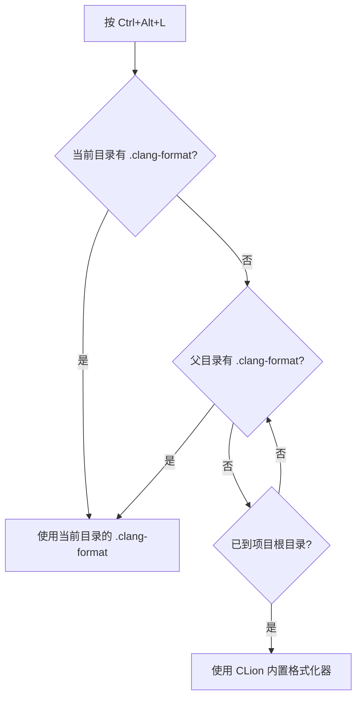

> [!note]
> [官方参考链接](https://www.jetbrains.com/zh-cn/help/clion/clion-quick-start-guide.html)

# 1. 快捷键

CLion 提供丰富的快捷键体系，以下按使用场景分类整理（默认 **Windows/Linux Keymap**）。

> [!tip]
> 如果只记 10 个，记住文末的 [[#1.8 核心快捷键|核心快捷键]] 即可覆盖日常 80% 以上的操作。

## 1.1 导航

| 功能 | 快捷键 |
|---|---|
| 搜索所有内容（文件、类、符号、命令） | `Shift` × 2 |
| 查找文件 | `Ctrl + Shift + N` |
| 查找类 | `Ctrl + N` |
| 查找符号 | `Ctrl + Alt + Shift + N` |
| 跳转到定义 | `Ctrl + B` |
| 跳转到实现 | `Ctrl + Alt + B` |
| 查看声明（Quick Definition） | `Ctrl + Shift + I` |
| 返回上一个位置 | `Ctrl + Alt + ←` |
| 前进到下一个位置 | `Ctrl + Alt + →` |
| 最近访问文件 | `Ctrl + E` |
| 最近编辑位置 | `Ctrl + Shift + E` |

## 1.2 编辑

| 功能 | 快捷键 |
|---|---|
| 格式化代码 | `Ctrl + Alt + L` |
| 自动优化 include | `Ctrl + Alt + O` |
| 重命名 | `Shift + F6` |
| 提取变量 | `Ctrl + Alt + V` |
| 提取函数 | `Ctrl + Alt + M` |
| 显示快速修复 | `Alt + Enter` |
| 注释 / 取消注释 | `Ctrl + /` |
| 块注释 | `Ctrl + Shift + /` |
| 复制当前行 | `Ctrl + D` |
| 删除当前行 | `Ctrl + Y` |
| 移动行 | `Alt + Shift + ↑/↓` |

## 1.3 搜索

| 功能 | 快捷键 |
|---|---|
| 当前文件查找 | `Ctrl + F` |
| 当前文件替换 | `Ctrl + R` |
| 全局查找 | `Ctrl + Shift + F` |
| 全局替换 | `Ctrl + Shift + R` |
| 查找用法（Find Usages） | `Alt + F7` |
| 高亮当前符号所有引用 | `Ctrl + Shift + F7` |

> [!info]
> `Alt + F7` 是 C++ 重构时最常用的快捷键之一：在符号上按此键，可以查看所有引用位置，包括跨文件的调用链。

## 1.4 C++ 开发专用

| 功能 | 快捷键 |
|---|---|
| 查看函数参数提示 | `Ctrl + P` |
| 自动补全 | `Ctrl + Space` |
| 智能补全（类型感知） | `Ctrl + Shift + Space` |
| 查看文档（Quick Documentation） | `Ctrl + Q` |
| 查看类型定义 | `Ctrl + Shift + B` |
| 生成代码（构造函数、getter/setter 等） | `Alt + Insert` |
| 实现虚函数 | `Ctrl + I` |
| 重写虚函数 | `Ctrl + O` |

## 1.5 调试（Debug）

| 功能 | 快捷键 |
|---|---|
| 启动调试 | `Shift + F9` |
| 运行程序 | `Shift + F10` |
| 停止 | `Ctrl + F2` |
| Step Over | `F8` |
| Step Into | `F7` |
| Step Out | `Shift + F8` |
| 继续执行（Resume） | `F9` |
| 切换断点 | `Ctrl + F8` |
| 查看变量值（Evaluate Expression） | `Alt + F8` |

## 1.6 窗口管理

| 功能 | 快捷键 |
|---|---|
| 打开 / 关闭 Terminal | `Alt + F12` |
| Project 视图 | `Alt + 1` |
| CMake 视图 | `Alt + 8` |
| Structure 视图 | `Alt + 7` |
| 隐藏 / 恢复所有工具窗口 | `Ctrl + Shift + F12` |

> [!tip]
> `Ctrl + Shift + F12` 可以作为"专注模式"切换键：按一次隐藏所有侧边栏，再按一次恢复。

## 1.7 万能入口：Find Action

除了记忆快捷键，最快的方式是使用 **Find Action**：

```text
Ctrl + Shift + A
```

输入功能名称（如 `reformat code`、`rename`、`debug`），CLion 会：

- 显示对应的快捷键
- 允许直接执行该操作

> [!tip]
> 养成熟练使用 `Ctrl + Shift + A` 的习惯，可以大幅减少对快捷键表的依赖。

## 1.8 核心快捷键

如果只记几个，优先记住下面这些：

| 快捷键 | 功能 | 使用频率 |
|---|---|---|
| `Shift` × 2 | 全局搜索（万能入口） | 极高 |
| `Ctrl + F` / `Ctrl + R` | 文件中搜索 / 替换 | 极高 |
| `Ctrl + B` | 跳转到定义 | 极高 |
| `Ctrl + Alt + ←` | 返回上一个位置 | 极高 |
| `Alt + Enter` | 快速修复 / 意图操作 | 极高 |
| `Ctrl + Alt + L` | 格式化代码 | 高 |
| `Shift + F6` | 重命名 | 高 |
| `Alt + F7` / `Ctrl + Alt + F7` | 查找所有引用 | 高 |
| `Alt + Insert` | 生成代码 | 高 |
| `Shift + F9` | 启动调试 | 高 |
| `Alt + F12` | 打开 / 关闭 Terminal | 中 |

---

# 2. 格式化配置

## 2.1 基本原理

CLion 原生支持 `.clang-format`，无需额外安装插件。

当项目目录结构如下：

```text
project/
├── .clang-format
├── CMakeLists.txt
└── src/
    └── main.cpp
```

执行 `Ctrl + Alt + L`（Reformat Code）时，CLion 会自动从当前文件所在目录向上查找 `.clang-format` 并应用其规则。

### 查找流程



## 2.2 启用 ClangFormat

打开：

```text
Settings
└── Editor
    └── Code Style
        └── C/C++
```

确保勾选：

```text
✓ Enable ClangFormat
```

（不同版本名称略有区别，也可能是 `Use ClangFormat instead of IDE formatter`）

## 2.3 验证是否生效

编写一段故意格式混乱的代码：

```cpp
int main(){
if(true){
printf("hello");
}
}
```

按 `Ctrl + Alt + L`，如果 `.clang-format` 配置了 `IndentWidth: 8`，将变为：

```cpp
int main() {
        if (true) {
                printf("hello");
        }
}
```

说明 CLion 已正确读取 `.clang-format`。

## 2.4 故障排查

### 方法 1：查看状态栏

打开 `.cpp` 文件，右下角状态栏会显示当前格式化器：

| 状态栏显示 | 含义 |
|---|---|
| `ClangFormat` | 正在使用 `.clang-format` |
| `Project` | 正在使用 CLion 内置格式化器 |

点击状态栏文字可以在两种模式间切换。

### 方法 2：检查设置页

```text
Settings
└── Editor
    └── Code Style
        └── Formatter
```

勾选：

```text
✓ Enable ClangFormat
✓ ClangFormat for all C/C++ files
```

如下图所示：

![[imgs/CLion_配置/01.png]]

### 方法 3：查看检测结果

CLion 检测到 `.clang-format` 时会弹出提示：

```text
ClangFormat file detected
```

或在：

```text
Settings → Editor → Code Style → ClangFormat
```

中显示：

```text
Found .clang-format at:
<project root>/.clang-format
```

> [!warning]
> 如果上述路径显示为空，说明 CLion 没有找到 `.clang-format`，请检查文件是否在项目根目录下，以及文件名是否拼写正确（注意开头的点号）。

## 2.5 推荐配置

```yaml
BasedOnStyle: LLVM

IndentWidth: 4
TabWidth: 4
UseTab: Never

ColumnLimit: 100

BreakBeforeBraces: Allman

PointerAlignment: Left
SortIncludes: true
```

> [!info]
> 使用 `.clang-format` 的最大优势是**跨编辑器和 CI 统一**：CLion、VSCode + clangd、Neovim + clangd、命令行 `clang-format` 全部使用同一套格式化规则。

## 2.6 版本差异说明

> [!warning]
> JetBrains 在 2024.3 和 2025.x 版本中对 ClangFormat 设置页做过调整，入口位置可能略有不同。如果找不到上述路径，请使用 `Ctrl + Shift + A` 搜索 `ClangFormat` 直接跳转。

---

# 3. 设置鼠标滚轮缩放字体

1. **打开设置**
   * **Windows / Linux**：点击左上角 `File` -> `Settings...` （或者直接按快捷键 `Ctrl + Alt + S`）
   * **Mac**：点击左上角 `CLion` -> `Settings...` （或者直接按快捷键 `Cmd + ,`）

2. **找到对应选项**
   * 在左侧导航栏中，依次展开：**`Editor`** -> **`General`**。
   * 在右侧的设置列表中往下滚动，找到 **`Change font size (zoom) with Ctrl+Mouse Wheel`** （中文版通常显示为：**使用 Ctrl+鼠标滚轮更改字体大小(缩放)**）。

3. **勾选并保存**
   * 将这个选项**勾选**上。
   * 点击右下角的 `Apply` 和 `OK` 保存设置。

设置完成后，你不能直接滚轮缩放，**必须配合修饰键使用**：

* 在 **Windows / Linux** 上：按住 **`Ctrl`** 键不放，同时滚动鼠标滚轮。
* 在 **Mac** 上：按住 **`Cmd`** 键不放，同时滚动鼠标滚轮。

> [!note]
> 注：这种缩放方式默认是”临时缩放”，只对当前打开的文件标签页生效。如果你想恢复默认大小，可以按快捷键 `Ctrl + 0` (Mac: `Cmd + 0`) 重置缩放。

---

# 4. 总结

> [!summary]
> **CLion 高效使用核心要点：**
> 1. 优先掌握 [[#1.8 核心快捷键|核心快捷键]]，覆盖日常 80% 操作
> 2. 养成使用 `Ctrl + Shift + A`（Find Action）的习惯，按功能名搜索而非死记快捷键
> 3. 项目根目录放置 `.clang-format`，确保团队代码风格统一
> 4. 右下角状态栏可快速切换 CLion 内置格式化器与 ClangFormat