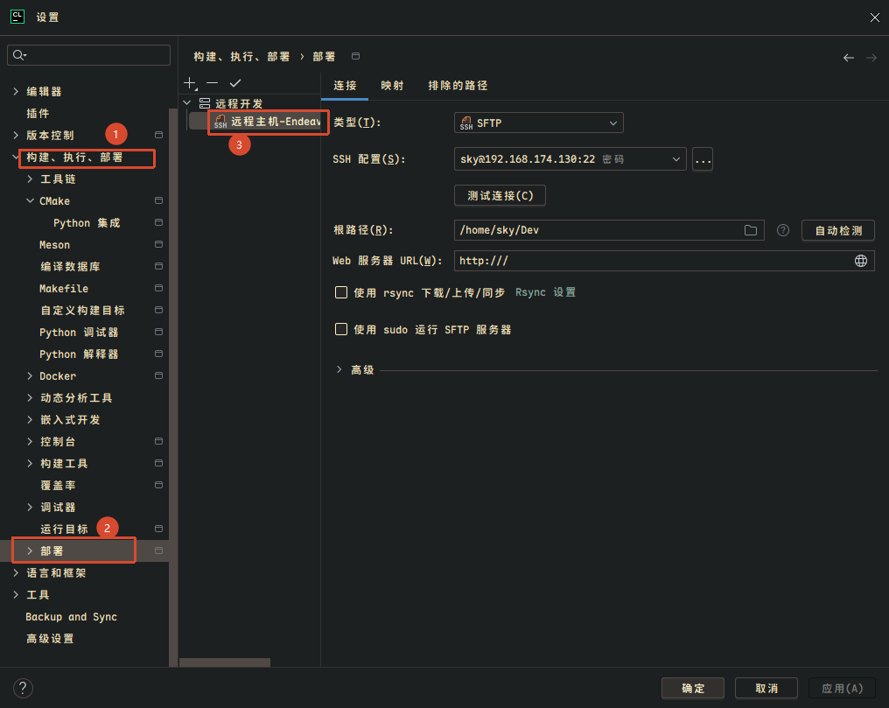
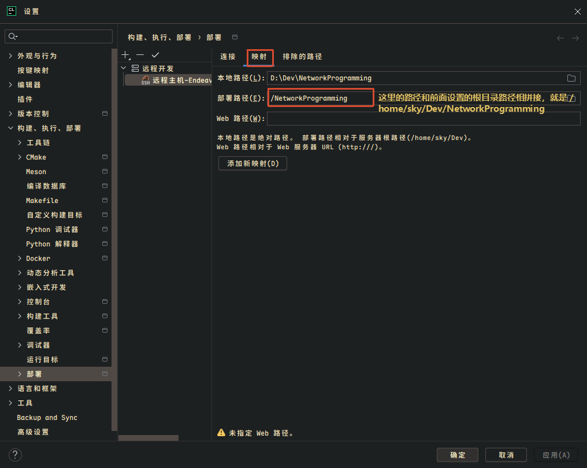

# 1. 概述

CLion 的 **远程主机工具链（Remote Host Toolchain）** 允许在本地 Windows 编辑代码，而将编译、链接、调试全部交由远端 Linux 服务器完成。这种模式适用于：

- 本地缺少 Linux 工具链，但需要为 Linux 目标编译
- 借用服务器的 CPU/内存资源加速大型项目构建
- 在与生产环境一致的 Linux 环境中调试网络、系统类程序

> [!info]
> 本文记录的是 **Deployment 模式（经典远程开发）** 的配置方法，不是 Gateway 中的 Full Remote Development 模式（比如 VSCode 那种直接通过 ssh 连接到服务器上，然后在服务器上进行写代码、编译、调试等）。

---

# 2. 工作原理

CLion 远程开发采用 **文件同步 + 远程编译** 模式，整体流程可分为三层：


## 2.1 文件同步层

- CLion 通过 **SFTP / rsync** 协议将本地源码镜像到远端
- 首次同步整个项目，后续仅同步修改过的文件（增量同步）
- 本地修改一个 `.cpp`，只传那一个文件过去

## 2.2 构建层

- CLion 通过 SSH 在远端执行 `cmake` 与 `make`
- 编译完全在远端 CPU 上运行
- 本地无需安装任何编译工具链

## 2.3 索引与调试层

| 功能 | 执行位置 | 说明 |
|---|---|---|
| 代码补全 / 跳转 | 本地 | 首次配置时同步远端头文件与库符号到本地建立索引，延迟极低 |
| 运行 / 调试 | 远端 | 二进制在远端执行，通过 `gdbserver` 远程调试协议与本地 GDB/LLDB 前端通信 |

![[imgs/Remote-Dev/06.png]]

---

# 3. 两种远程模式对比

## 3.1 Deployment 模式（本文）

- 又称 **经典远程开发** 或 **远程主机工具链** 模式
- 本地 IDE 前端 + 远端工具链
- 对网络要求相对宽松
- 文件同步由 CLion 的 Deployment 机制管理

## 3.2 与 Full Remote Development 的区别

| 维度 | Deployment 模式 | Full Remote Development（Gateway SSH） |
|---|---|---|
| IDE 后端位置 | 本地 | 远端 |
| 索引 / 补全 | 本地完成 | 远端完成 |
| 网络延迟敏感度 | 较低 | 较高 |
| 资源占用 | 本地较高 | 远端较高 |
| 适用场景 | 网络一般、本地性能尚可 | 网络稳定、需要极低延迟 |

> [!tip]
> 如果只是想用远端 Linux 工具链编译，且网络条件一般，**优先选择 Deployment 模式**。

---

# 4. Deployment 配置详解

配置入口：

```
Settings → Build, Execution, Deployment → Deployment
```

配置界面如下图所示，该页面管理的是 **本地文件 ↔ 远程主机文件的同步规则**，并不属于 CMake Toolchain 本身：



## 4.1 类型（Type）

| 类型 | 作用 |
|---|---|
| **SFTP** | 通过 SSH 同步文件（最常用，推荐） |
| FTP | 普通 FTP |
| FTPS | 加密 FTP |
| 本地或挂载目录 | 本地目录映射 |

Linux 远程开发一般选择 **SFTP**。

## 4.2 SSH 配置（SSH Configuration）

形如 `sky@192.168.174.130:22`，等价于：

```bash
ssh sky@192.168.174.130
```

CLion 使用此处的 SSH 配置（用户名、IP、端口、密钥、密码）建立连接。

## 4.3 根路径（Root Path）

> [!warning]
> 这是 Deployment 配置中 **最重要的字段**，决定远端同步的根目录。

例如配置为 `/home/sky/Dev`：

| 本地路径 | 远端路径 |
|---|---|
| `D:\Project\NetworkProgramming\src\main.cpp` | `/home/sky/Dev/src/main.cpp` |

假设 Mappings 配置为：

```text
Local Path:      D:\Project\NetworkProgramming
Deployment Path: .
```

则同步结果为：

```text
本地: D:\Project\NetworkProgramming\src\main.cpp
远程: /home/sky/Dev/src/main.cpp
```

## 4.4 自动检测（Autodetect）

连接远程主机后尝试推断 `/home/sky`、`/var/www` 之类的目录。一般手动填写即可。

## 4.5 Web 服务器 URL

形如 `http:///` 是 **Web 服务器 URL**，给 CLion 的内置 HTTP 服务用的，与 C++ 开发基本无关，主要服务于 PHP / Django / Flask 等 Web 项目，做远程开发/编译不需要管它，留空或默认即可。

## 4.6 使用 rsync 同步

> [!info]
> 前提：远端服务器与本地机都已安装 `rsync`。

勾选后，文件同步协议由 SFTP 切换为 `rsync -avz`，仅传输差异部分。

| 优点 | 缺点 |
|---|---|
| 增量同步速度快 | 远端必须安装 rsync |
| 适合大型项目 / 海量源码 | 需额外检查环境 |

检查 rsync 是否安装：

```bash
which rsync
```

## 4.7 使用 sudo 运行 SFTP 服务器

默认不勾选，即以当前 SSH 用户权限访问文件。勾选后以 root 权限访问，等价于 `sudo sftp-server`。

| 适用场景 | 不适用场景 |
|---|---|
| 写入 `/usr/local`、`/opt`、`/etc` 等系统目录 | 普通用户目录 `/home/sky/Dev` |

> [!warning]
> 一般开发项目位于用户家目录下，**切勿勾选 sudo**，避免权限污染。

---

# 5. 修改部署路径（核心操作）

## 5.1 为什么要修改

CLion 默认会将远端工作区放在 `/tmp/tmp.xxxxx` 下。`/tmp` 目录在服务器重启后会被清空，导致：

- 全量重新同步
- 构建缓存丢失
- 编译速度变慢

因此需要将部署路径改为用户可控的固定目录。

## 5.2 修改步骤

```
Settings → Build, Execution, Deployment → Deployment
```

1. 在左侧选中配置好的远程服务器
2. 切换到 **Mappings** 标签页
3. 将 **Deployment path** 从自动生成的 `/tmp/tmp.xxx/...` 改为固定路径，例如：
   - `~/projects/NetworkProgramming`
   - 或 `/home/youruser/projects/NetworkProgramming`
4. 点击 OK 保存



> [!tip]
> 修改完成后，完整的同步目标为 `Root Path + Deployment Path`，例如 `/home/sky/Dev/NetworkProgramming`，重启不会丢失。

## 5.3 同步修改 CMake 构建目录

改完部署路径后，必须同步修改 CMake 的远端工作目录，否则 CMake 仍会指向旧的 `/tmp` 路径。

```
Settings → Build, Execution, Deployment → CMake
```

选中远程 Profile，检查 **Build directory** 字段，确保指向新路径下的构建目录，例如：

```text
~/projects/NetworkProgramming/cmake-build-remote
```

## 5.4 配置排除项（Excluded Paths）

可以在 Deployment 中配置同步时排除的文件或目录：

![[imgs/Remote-Dev/04.png]]

![[imgs/Remote-Dev/05.png]]

> [!tip]
> **强烈建议排除 `cmake-build-remote` 构建目录**，避免将远端的编译产物同步回本地，造成不必要的网络流量和磁盘占用。

---

# 6. 常见问题排查

## 6.1 CMake 仍指向 /tmp 路径

**现象**：Deployment 已配置 `Root Path = /home/sky/Dev`，但 CMake 输出仍为：

```bash
-S /tmp/tmp.d3MumGRL4j/NetworkProgramming
```

**原因**：CLion 当前构建使用的是 **Remote Host Toolchain** 自维护的 `/tmp/tmp.xxxxx` 工作区，并未走 Deployment 配置。

**排查步骤**：

1. 检查 `Settings → Build, Execution, Deployment → Toolchains` 中 Remote Host 的配置
2. 检查 `Settings → Build, Execution, Deployment → CMake` 中 Profile 的工具链与构建目录
3. 确认 CMake 的 **Build directory** 已改为新路径

> [!warning]
> 新版 CLion 的 Remote Host Toolchain 会自行维护 `/tmp/tmp.xxxxx` 工作区，**不一定使用 Deployment 的 Root Path**。两者需分别配置。

## 6.2 修改路径后的注意事项

| 事项 | 说明 |
|---|---|
| 全量同步 | 修改路径后 CLion 会触发一次全量同步，之后恢复增量 |
| 写权限 | 确保远程服务器上目标目录有写权限 |
| 自动创建 | 若远端目录不存在，CLion 会自动创建 |
| 路径格式 | 推荐使用绝对路径（`/home/user/...`）而非 `~`，避免某些环境下 tilde 展开失败 |

## 6.3 CLion 版本与远程服务器 cmake 版本不匹配

**现象**：如果远程服务器的 cmake 版本过低，但是主机的 CLion 版本比较新，在用远程服务器的 cmake 进行构建时，可能会出现下面这种情况：

```bash
/usr/bin/cmake -DCMAKE_BUILD_TYPE=Debug -G "CodeBlocks - Unix Makefiles" /data/home/loskyertt/Dev/a5game/server/trunk/server/src
-- Configuring done
-- Generating done
-- Build files have been written to: /data/home/loskyertt/Dev/a5game/server/trunk/server/src/cmake-build-debug-remote
无法读取 Z:\a5game\server\trunk\server\src\cmake-build-debug-remote\CMakeFiles\TargetDirectories.txt
```

如果远程工作目录和本地工作目录的映射已经确定没有弄错，那么这种情况通常是远程 CMake 版本过老导致 CLion 解析失败。

因此可以在远程服务器安装一个较新版本的 cmake，如果没有 sudo 安装权限，可以把 cmake 安装在自己的用户目录下。

根据服务器的架构（一般是 x86_64）直接下载官方二进制包，然后：

```bash
mkdir -p ~/tools
cd ~/tools

wget https://github.com/Kitware/CMake/releases/download/v3.31.8/cmake-3.31.8-linux-x86_64.tar.gz

tar -xf cmake-3.31.8-linux-x86_64.tar.gz
```

> [!tip]
> 如果在服务器上不允许访问外网，可以先把 cmake-3.31.8-linux-x86_64.tar.gz 下载到本地，然后上传到服务器中：
> 
> ```bash
> scp cmake-3.31.8-linux-x86_64.tar.gz loskyertt@<服务器 IP>:~/tools/
> ```

解压后：

```text
~/tools/cmake-3.31.8-linux-x86_64/
├── bin
├── share
└── ...
```

测试：

```bash
~/tools/cmake-3.31.8-linux-x86_64/bin/cmake --version
```

应该看到：

```text
cmake version 3.31.8
```

然后再配置 CLion，进入：

```text
Settings
→ Build, Execution, Deployment
→ Toolchains
```

找到：

```text
CMake:
```

原来可能是：

```text
/usr/bin/cmake
```

改成：

```text
/home/loskyertt/tools/cmake-3.31.8-linux-x86_64/bin/cmake
```

然后点击：

```text
Reload CMake Project
```

---

# 7. 最佳实践

> [!summary]
> CLion 远程开发配置的核心要点：

1. **优先使用 SFTP + rsync**：增量同步速度快，适合大型项目
2. **避免使用 /tmp 作为工作区**：服务器重启会丢失，改为固定路径
3. **绝对路径优先**：避免 `~` 展开问题
4. **排除构建产物**：将 `cmake-build-remote` 加入 Excluded Paths
5. **区分 Deployment 与 Toolchain 配置**：两者独立，需分别检查
6. **普通项目禁用 sudo**：家目录开发无需提权
