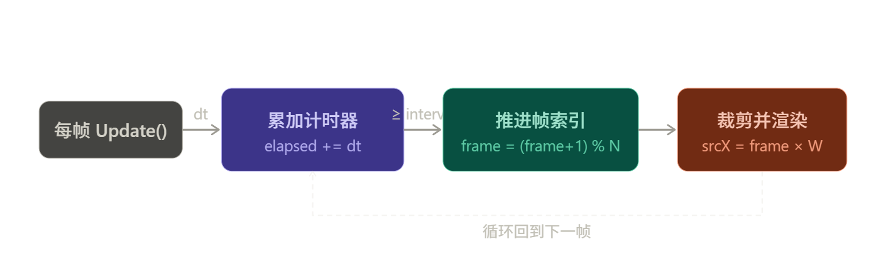

# 1. 时间和帧率的关系

时间和帧率换算就一个公式，互为倒数：

$$ \text{frameInterval} = \frac{1}{\text{fps}} \qquad \text{fps} = \frac{1}{\text{frameInterval}} $$

几个常见值对照：

|fps（帧/秒）|frameInterval（秒/帧）|
|---|---|
|5|1 ÷ 5 = 0.2s|
|10|1 ÷ 10 = 0.1s|
|24|1 ÷ 24 ≈ 0.0417s|
|30|1 ÷ 30 ≈ 0.0333s|
|60|1 ÷ 60 ≈ 0.0167s|

理解起来也很直观：**fps 是"每秒播多少帧"，interval 是"每帧占多少秒"**，两者描述的是同一件事，只是角度不同。

所以如果想让动画跑 12fps，在代码中直接写：

```cpp
frameInterval = 1.0f / 12.0f;  // 约 0.0833s
```

比直接填小数更清晰，意图一目了然。

---

# 2. 序列帧动画（Sprite Sheet Animation）

下面这张图是一张 **精灵图序列帧（Sprite Strip）**，包含 8 帧动画，水平排列，每帧等宽。


实现动画的核心是：用一个计时器不断推进帧索引，再用帧索引计算出当前帧在图片中的偏移量进行裁剪渲染。

先看整体数据流：



## 2.1 伪代码实现

```cpp
// ── 数据结构 ──────────────────────────────────────────
struct SpriteAnimation {
    Texture* spriteSheet;   // 整张序列帧图片
    int      frameCount;    // 总帧数（本例为 8）
    int      frameWidth;    // 单帧宽度 = 总宽 / frameCount
    int      frameHeight;   // 单帧高度（即图片高度）
    float    frameInterval; // 每帧持续时间（秒），如 0.1f = 10fps

    int   currentFrame = 0;  // 当前帧
    float elapsed      = 0.f;  // 累计计时器：记录"距离上一次切换帧，已经过去了多少时间"
};

// ── 初始化 ────────────────────────────────────────────
SpriteAnimation anim;
anim.spriteSheet   = loadTexture("ghost-move.png");
anim.frameCount    = 8;    // 动画被划分为 8帧
anim.frameWidth    = anim.spriteSheet->width / anim.frameCount; // 计算每帧宽度
anim.frameHeight   = anim.spriteSheet->height;
anim.frameInterval = 1.0f / 10.0f; // 目标动画帧率 10fps，比直接填 0.1f 更清晰

// ── 每帧更新（Update 函数中调用）────────────────────────
void updateAnimation(SpriteAnimation& anim, float deltaTime) {
    anim.elapsed += deltaTime;

    if (anim.elapsed >= anim.frameInterval) {
        anim.elapsed -= anim.frameInterval;          // 保留余量，避免漂移
        anim.currentFrame = (anim.currentFrame + 1) % anim.frameCount;
    }
}

// ── 渲染（Render 函数中调用）────────────────────────────
// 渲染“裁剪”下来的每一块
void renderAnimation(const SpriteAnimation& anim, float destX, float destY) {
    // 从整张图中裁出当前帧的矩形区域
    Rect srcRect = {
        anim.currentFrame * anim.frameWidth, // 水平偏移
        0,                                   // 垂直偏移（单行序列帧）
        anim.frameWidth,
        anim.frameHeight
    };

    Rect dstRect = { destX, destY, anim.frameWidth, anim.frameHeight };

    renderer->drawTexture(anim.spriteSheet, srcRect, dstRect);
}

// ── 主循环 ────────────────────────────────────────────
while (gameRunning) {
    float dt = timer.getDeltaTime(); // 上一帧耗时（秒）
    updateAnimation(anim, dt);
    renderAnimation(anim, screenX, screenY);
}
```

## 2.2 代码解释

下面分四个部分逐一拆解。

### 2.2.1 数据结构

```cpp
struct SpriteAnimation {
    Texture* spriteSheet;   // 指向整张图片的指针
    int      frameCount;    // 总帧数 = 8
    int      frameWidth;    // 单帧宽度
    int      frameHeight;   // 单帧高度
    float    frameInterval; // 每帧持续多少秒

    int   currentFrame = 0; // 当前播放到第几帧（0~7）
    float elapsed      = 0; // 距上次换帧已过去多少秒
};
```

可以把这个结构体理解成一个"视频播放器"，它同时持有两类信息：

- **静态配置**（`spriteSheet` / `frameCount` / `frameWidth` / `frameHeight` / `frameInterval`）：初始化后就不变了
- **动态状态**（`currentFrame` / `elapsed`）：每帧都在变，记录播放进度

### 2.2.2 初始化

```cpp
anim.frameWidth = anim.spriteSheet->width / anim.frameCount;
```

图片总宽除以帧数，得到单帧宽度。比如图片是 `512px` 宽、8 帧，每帧就是 `64px`。

```cpp
anim.frameInterval = 1.0f / 10.0f; // = 0.1 秒
```

目标是 10fps，即每帧持续 0.1 秒，用除法写出来意图更清晰。

> [!note] `frameInterval` 只属于这个 `SpriteAnimation` 结构体，控制的是**这一个动画的播放速度**，和游戏本身跑多少帧完全无关。

两者是独立的：

||控制什么|在哪里设置|
|---|---|---|
|游戏帧率（60fps）|主循环多快跑一圈|锁帧逻辑里的 `FRAME_DELAY`|
|动画帧率（10fps）|精灵图多快切下一帧|`SpriteAnimation` 里的 `frameInterval`|

游戏以 60fps 渲染，但幽灵的动画只以 10fps 切换，这两件事同时发生、互不影响。实际上正因为解耦了，你可以给不同角色设置不同的动画速度——比如幽灵走路 10fps、Boss 攻击 24fps、背景装饰 5fps，而游戏渲染始终稳定在 60fps。

### 2.2.3 每帧更新（核心逻辑）

```cpp
void updateAnimation(SpriteAnimation& anim, float deltaTime) {
    anim.elapsed += deltaTime;

    if (anim.elapsed >= anim.frameInterval) {
        anim.elapsed -= anim.frameInterval;
        anim.currentFrame = (anim.currentFrame + 1) % anim.frameCount;
    }
}
```

用一张时间轴来看，游戏跑在 60fps（deltaTime = `1s/60帧≈16ms/帧`），动画跑在 10fps：

```
游戏帧:  1    2    3    4    5    6    7    8    9   10  ...
elapsed: 16   32   48   64   80   96  112   16   32   48  (ms)
                                       ↑切换          ↑切换
                                    (超过100ms)    (超过100ms)
```

每次 `elapsed` 累积超过 `frameInterval`（`1s/10帧=0.1s/帧`），就换一帧，同时 **减去而不是清零**：

```
第7帧：elapsed = 112ms，超过了 100ms，则 elapsed = 112ms - 100ms
减去后：elapsed = 12ms  ← 这 12ms 留给下一帧继续累积
```

如果直接清零，那多出的 12ms 就丢失了，长期下来动画会越来越慢（漂移）。

换帧用取模保证循环：

```
(0+1) % 8 = 1
(7+1) % 8 = 0  ← 第8帧播完自动回到第0帧
```

最后再用具体数字走一遍，游戏 60fps，动画 10fps（`frameInterval = 0.1s`）：

```
初始：elapsed = 0s

第1帧：elapsed = 0 + 0.016 = 0.016   < 0.1，不执行 if
第2帧：elapsed = 0.016 + 0.016 = 0.032  < 0.1，不执行 if
第3帧：elapsed = 0.032 + 0.016 = 0.048  < 0.1，不执行 if
第4帧：elapsed = 0.048 + 0.016 = 0.064  < 0.1，不执行 if
第5帧：elapsed = 0.064 + 0.016 = 0.080  < 0.1，不执行 if
第6帧：elapsed = 0.080 + 0.016 = 0.096  < 0.1，不执行 if
第7帧：elapsed = 0.096 + 0.016 = 0.112  ≥ 0.1，执行 if！  ⚠️
          └─ elapsed -= 0.1
          └─ elapsed = 0.012   ← 重新变小了！
          └─ currentFrame = 1

第8帧：elapsed = 0.012 + 0.016 = 0.028  < 0.1，不执行 if
第9帧：elapsed = 0.028 + 0.016 = 0.044  < 0.1，不执行 if
...（又要等几帧才能再次到达 0.1）
```

所以 `elapsed` 的值一直在做这样的循环：**慢慢涨 → 超过阈值 → 减回去 → 再慢慢涨**，if 里的内容大约每 6~7 个游戏帧才触发一次，而不是一直在执行。

### 2.2.4 渲染

```cpp
Rect srcRect = {
    anim.currentFrame * anim.frameWidth,  // 水平偏移
    0,
    anim.frameWidth,
    anim.frameHeight
};
```

`srcRect` 是在原图上"截取"哪一块区域。`currentFrame` 乘以单帧宽度，就得到当前帧的起始 x 坐标：

```
第0帧：x = 0  × 64 =   0px，截取 [0,   64]
第1帧：x = 1  × 64 =  64px，截取 [64, 128]
第2帧：x = 2  × 64 = 128px，截取 [128,192]
...
```

```cpp
Rect dstRect = { destX, destY, anim.frameWidth, anim.frameHeight };
renderer->drawTexture(anim.spriteSheet, srcRect, dstRect);
```

`dstRect` 是渲染到屏幕上的哪个位置。`drawTexture` 把 `srcRect` 这块区域，画到屏幕上 `dstRect` 的位置。

## 2.3 整体运行顺序

```
主循环每跑一圈：
  1. 取 deltaTime（本帧耗时）
  2. updateAnimation：elapsed 累积，够了就 currentFrame++
  3. renderAnimation：根据 currentFrame 计算截取坐标，画到屏幕
```

`update` 只管"现在该显示第几帧"，`render` 只管"把那一帧画出来"，两者职责分离，互不干扰。

---

# 3. 锁帧

游戏中，Entity（物体）的移动（或运动）速度直接与游戏的帧率相关。这意味着，如果游戏在不同性能的设备上运行，或者同一设备上的帧率波动，物体的移动速度也会随之变化，导致游戏体验不一致。因此，我们要实现基于时间的移动，让游戏速度不受帧率影响。

在 **序列帧动画** 伪代码中，`deltaTime` 是 **上一帧到这一帧之间经过的真实时间**（单位：秒）。

## 3.1 伪代码实现

游戏主循环每跑一圈就是"一帧"，但每圈耗时不是固定的——处理逻辑多、或者机器性能差的时候会更长。`deltaTime` 就是这个实际耗时的测量值：

```cpp
// ── 配置 ──────────────────────────────────────────────
const uint64 TARGET_FPS    = 60;
const uint64 FRAME_DELAY   = 1_000_000_000 / TARGET_FPS; // 这里单位是 ns，换算成毫秒约 16.67ms
float        deltaTime     = FRAME_DELAY / 1e9f;          // 初始值 ≈ 0.01667s

// ── 主循环 ────────────────────────────────────────────
while (gameRunning) {
    uint64 frameStart = getCurrentTimeNS();   // 帧开始时间（纳秒）

    handleEvents();                           // 一系列的事件处理
    update(deltaTime);                        // 更新逻辑：包括场景的更新等，用上一帧算出的 deltaTime（见注意事项）
    render();                                 // 渲染

    uint64 frameEnd     = getCurrentTimeNS();  // 帧结束时间
    uint64 frameElapsed = frameEnd - frameStart; // 本帧实际工作耗时

    if (frameElapsed < FRAME_DELAY) {
        // 帧提前完成：睡眠补齐，让 deltaTime 始终是稳定的 1/60 秒
        sleepNS(FRAME_DELAY - frameElapsed);
        deltaTime = FRAME_DELAY / 1e9f;
    } else {
        // 帧超时：跳过睡眠，deltaTime 用实际耗时（防止逻辑慢动作）
        deltaTime = frameElapsed / 1e9f;
    }
    // 此处算出的 deltaTime 将在下一帧的 update() 中使用
}
```

> [!note] deltaTime 滞后一帧 `deltaTime` 是在帧末尾计算出来的，在**下一帧**的 `update()` 里才被使用，因此总是滞后一帧。第一帧使用初始值，之后每帧使用前一帧的实测结果。在 60fps 下这个误差（约 16ms）可以忽略不计。

> `deltaTime` 的作用是让游戏物体的移动量和帧率解耦——物体每帧移动 `速度 × deltaTime` 个像素，无论帧率高低，1秒内移动的总距离都是一样的。

**每帧耗时 × 速度 = 每帧移动量**，而每秒的帧数 × 每帧移动量 = 每秒总移动距离。假设速度设定 1s 移动 100 像素格：

- 1fps 时：每帧耗时 `1/1=1s`，移动 `1 × 100 = 100 格/帧`，1秒只有1帧，总共移动 `1 × 100 =` **100**
- 10fps 时：每帧耗时 `1/10=0.1s`，移动 `0.1 × 100 = 10 格/帧`，1秒有10帧，总共移动 `10 × 10 =` **100**
- 60fps 时：每帧耗时 `1/60=0.0167s`，移动 `0.0167 × 100 ≈ 1.67 格/帧`，1秒有60帧，总共移动 `1.67 × 60 ≈` **100**

帧率变了，每帧移动量跟着反向变化，两者相乘的结果（每秒总距离）始终不变。

> 下面再解释下为什么超时帧要用实际耗时，举个例子更直观。

假设玩家角色的移动逻辑是：

```cpp
position += speed * deltaTime;  // 每秒移动 speed 个单位
```

**正常情况**（帧在 16ms 内完成）：

```
deltaTime = 0.0167s（固定）
每帧移动 = speed × 0.0167
60帧后移动 = speed × 0.0167 × 60 = speed × 1.0  ✅ 刚好移动了 1 秒的距离
```

**帧超时，但 deltaTime 仍用固定值**（错误做法）：

```
假设某帧实际耗时 50ms，但 deltaTime 仍传 0.0167s
这一帧只移动了 speed × 0.0167
但实际时间过去了 50ms ← 游戏逻辑比现实慢了，出现"慢动作"
```

**帧超时，deltaTime 用实际耗时**（正确做法）：

```
deltaTime = 0.05s（真实耗时）
这一帧移动 = speed × 0.05  ← 补偿了这帧多花的时间
游戏逻辑与现实时间保持同步  ✅
```

所以核心思路是：**游戏逻辑的推进量要和真实流逝的时间对齐**。正常帧因为睡眠补齐了时间，用固定值没问题；超时帧没有睡眠，就必须用真实耗时，否则那段多花的时间在游戏世界里"消失了"，表现为卡顿或慢动作。

> [!tip] 为什么不直接用固定值（比如 1/60）？
> 
> 现实中帧率会波动——玩家电脑性能不同、某帧逻辑特别重等等。如果用固定值，帧率一旦下降，动画和游戏逻辑就会变慢；用真实的 `deltaTime` 则可以让所有计算与时间挂钩，**无论帧率高低，表现都一致**。
> 
> |情况|固定步长|deltaTime|
> |---|---|---|
> |60fps 正常运行|正常|正常|
> |掉到 30fps|动画变慢一倍|动画速度不变|
> |性能爆表跑 120fps|动画变快一倍|动画速度不变|

这就是为什么 `elapsed += deltaTime` 能保证动画帧率稳定在你设定的值，而不受游戏帧率影响。

---

# 4. 关键细节

- **避免帧漂移**：更新时用 `elapsed -= frameInterval` 而不是直接清零，否则误差累积会导致动画越来越慢。
    
- **多行序列帧（Sprite Sheet）**：如果图片排成多行（网格），`srcRect.y = row * frameHeight`，用二维坐标定位帧。
    
- **帧率与游戏帧率解耦**：动画帧率（如 10fps）与游戏渲染帧率（如 60fps）通过计时器完全独立，改变 `frameInterval` 就能控制播放速度，不影响游戏逻辑。
    
- **状态切换**：实际项目中通常把多个动画（行走、攻击、跳跃）存为一个 `map<string, SpriteAnimation>`，通过状态机切换当前动画。