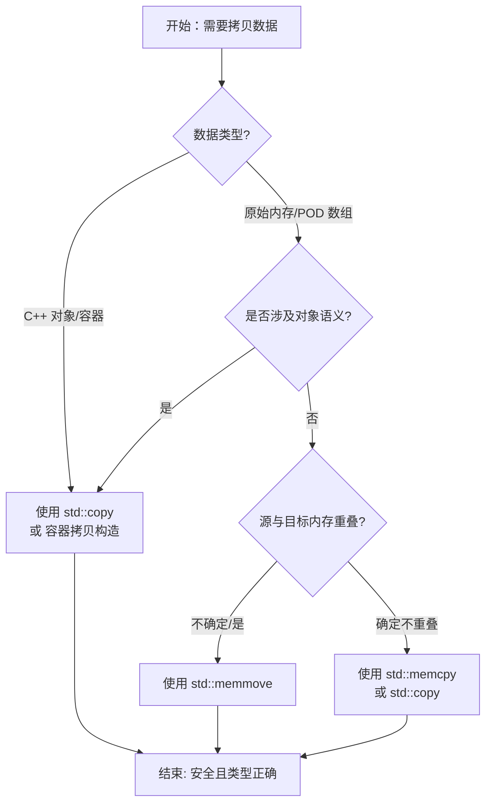

# 1. memcpy：高效的内存块拷贝

`memcpy` 是 C/C++ 中用于拷贝原始内存块的标准库函数。由于其高度优化（通常针对特定 CPU 指令集如 SSE/AVX 进行了优化），它是**拷贝连续内存**最快的方式。

## 1.1 函数原型与说明

- **头文件**：`<cstring>`（C 风格）或 `<string.h>`
- **函数原型**：

```cpp
void* memcpy(void* dest, const void* src, size_t count);
```

- **参数说明**：
    - `dest`：目标内存地址（必须具有足够的空间）。
    - `src`：源内存地址。
    - `count`：要拷贝的字节数（注意是**字节数**，不是元素个数）。
- **返回值**：返回 `dest` 的指针。

## 1.2 核心特点与适用场景

### 1.2.1 适用场景（POD 类型）

`memcpy` 仅适用于 **POD (Plain Old Data)** 或 **可平凡拷贝（Trivially Copyable）** 类型。这些类型通常没有虚函数、没有复杂的构造/析构逻辑，且内存布局连续。

- **基本数据类型**：`int`, `double`, `char` 等。
- **数组**：`int[]`, `struct[]`。
- **标准布局的结构体**：只包含基本类型的结构体。

### 1.2.2 禁止场景（非平凡类型）

> [!danger] 警告：未定义行为 (UB)
> 对于含有**构造函数、析构函数、虚函数表**或**自管理内存指针**的对象（如 `std::string`, `std::vector`），使用 `memcpy` 是极其危险的。

**原因**：`memcpy` 进行的是**位拷贝**，它不会调用对象的**拷贝构造函数**。这会导致：
1. **浅拷贝**：内部的指针被复制，两个对象指向同一块内存。
2. **双重释放**：两个对象析构时尝试释放同一块内存，导致程序崩溃。

## 1.3 代码示例

1. **示例 1**：拷贝基本类型数组

```cpp
#include <cstring>
#include <iostream>

int main() {
    int src[3] = {1, 2, 3};
    int dest[3];

    // sizeof(src) 自动计算总字节数
    std::memcpy(dest, src, sizeof(src));

    for (int x : dest) {
        std::cout << x << " "; // 输出: 1 2 3
    }
    return 0;
}
```

2. **示例 2**：拷贝结构体（安全）

```cpp
struct Point {
    int x;
    int y;
    // 无虚函数，无 std::string 等成员
};

Point p1{10, 20};
Point p2;

// ✅ 安全：Point 是 Trivially Copyable 的
std::memcpy(&p2, &p1, sizeof(Point)); 
```

3. **示例 3**：错误用法（拷贝 STL 容器）

```cpp
#include <string>
#include <cstring>

int main() {
    std::string s1 = "Hello World";
    std::string s2;

    // ❌ 危险：未定义行为！
    // s1 内部有一个指向堆内存的指针。
    // memcpy 复制了指针值，导致 s1 和 s2 指向同一块堆内存。
    // 函数结束时 s1 和 s2 都会调用析构函数尝试释放这块内存 -> Double Free。
    std::memcpy(&s2, &s1, sizeof(std::string)); 
    
    return 0; // 崩溃
}
```

---

# 2. memset：内存初始化

`memset` 用于将一块内存设置为指定的值。它常用于初始化数组、清零结构体。

## 2.1 函数原型与说明

- **头文件**：`<cstring>`
- **函数原型**：

```cpp
void* memset(void* ptr, int value, size_t num);
```

- **参数说明**：
    - `ptr`：指向要填充的内存块的指针。
    - `value`：要设置的值。该值以 `int` 形式传递，但在函数内部转换为 `unsigned char`。
    - `num`：要设置为该值的字节数。

## 2.2 核心陷阱：`int` 到 `byte` 的截断

这是 `memset` 最容易出错的地方。`memset` 是按**字节**填充的。

> [!warning] 常见误区
> 如果你想将 `int` 数组初始化为 `1`，使用 `memset(arr, 1, sizeof(arr))` 是**错误**的。这会将**每个字节**（即没 8 位）设置为 `0x01`，而不是将每个整型元素设置为 `1`。

1. **示例**：`memset` 的字节填充效果

```cpp
#include <cstring>
#include <iostream>
#include <iomanip>

int main() {
    int arr[5];
    
    // 尝试用 memset 初始化为 1
    std::memset(arr, 1, sizeof(arr));

    for (int i = 0; i < 5; ++i) {
        std::cout << arr[i] << " ";
        // 输出结果并不是 1 1 1 1 1
        // 在小端机器上，int 是 4 字节：
        // 0x01 0x01 0x01 0x01 -> 0x01010101 -> 16843009
    }
    // 输出: 16843009 16843009 16843009 16843009 16843009
    
    return 0;
}
```

2. **正确用法**：清零

`memset` 最常用的场景是将**内存清零**，因为 `0` 的二进制全为 0，无论按字节填充还是按整数理解，结果都是 0。

```cpp
struct UserInfo {
    int id;
    char name[32];
    double score;
};

UserInfo user;
// ✅ 将结构体所有字节置为 0
std::memset(&user, 0, sizeof(user)); 
```

---

# 3. memmove：处理内存重叠

`memmove` 的功能与 `memcpy` 完全相同，都是拷贝内存，但 `memmove` 增加了一个关键特性：**处理源内存和目标内存重叠的情况**。

| 特性 | `memcpy` | `memmove` |
| :--- | :--- | :--- |
| **重叠处理** | **未定义行为** (如果重叠) | **安全处理** (保证结果正确) |
| **性能** | 极快 (无检查，直接拷贝) | 稍慢 (需检查方向，可能使用缓冲区) |
| **使用场景** | 确定不重叠时优先使用 | 不确定是否重叠时必须使用 |

## 3.1 内存重叠示意图

当 `src` 和 `dest` 有重叠区域时，拷贝方向至关重要。

### 3.1.1 正向重叠 (Forward Overlap)

**场景**：源地址（Src）在前，目标地址（Dest）在后。
**策略**：**从后往前 (Back to Front)** 拷贝，防止前面的数据覆盖了后面还没来得及搬运的原数据。

```Plaintext
      低地址  ------------------------------------->  高地址

      +-----------+---------------+-----------+
内存:  |   Src     |   Overlap     |   Dest    |
      +-----------+---------------+-----------+
      ^           ^               ^           ^
      |           |               |           |
    [src]       [dest]        [src+len]   [dest+len]

      拷贝方向: <-------------------------- [从后往前]
```

### 3.1.2 反向重叠 (Backward Overlap)

**场景**：目标地址（Dest）在前，源地址（Src）在后。
**策略**：**从前往后 (Front to Back)** 拷贝，这样可以先处理低地址的数据。

```Plaintext
      低地址  ------------------------------------->  高地址

      +-----------+---------------+-----------+
内存:  |   Dest    |   Overlap     |   Src     |
      +-----------+---------------+-----------+
      ^           ^               ^           ^
      |           |               |           |
    [dest]      [src]         [dest+len]  [src+len]

      拷贝方向: [从前往后] -------------------------->
```

## 3.2 代码示例

```cpp
#include <cstring>
#include <iostream>
#include <vector>

int main() {
    char buffer[] = "1234567890";
    
    std::cout << "Before: " << buffer << std::endl;

    // 场景：将 "12345" 拷贝到 buffer[2] 开始的位置
    // 源: &buffer[0], 目标: &buffer[2]
    // 存在重叠！
    
    // ❌ 使用 memcpy 可能导致错误（取决于编译器实现，可能是 UB）
    // std::memcpy(buffer + 2, buffer, 5); 

    // ✅ 使用 memmove 保证安全
    std::memmove(buffer + 2, buffer, 5);

    std::cout << "After:  " << buffer << std::endl;
    // 正确输出应为: 1212345890
    // 原数据: 1 2 3 4 5 6 7 8 9 0
    // 拷贝:   ^ ^ ^ ^ ^
    // 覆盖后: 1 2 1 2 3 4 5 8 9 0
    return 0;
}
```

在 C 语言的 `memmove` 实现中，判断逻辑通常如下：
- 如果 `dest < src`：无论是否重叠，**从前往后** 拷贝都是安全的。
- 如果 `dest > src`：如果存在重叠，必须 **从后往前** 拷贝。
- 如果 `dest == src`：原地踏步，啥也不用干。
- **情况 1**：`dest` 在 `src` 之前且重叠。如果从前往后拷贝，`src` 的前部会被覆盖，导致数据丢失。`memmove` 会自动判断并**从后往前**拷贝。
- **情况 2**：`dest` 在 `src` 之后且重叠。如果从后往前拷贝，`src` 的后部会被覆盖。`memmove` 会自动判断并**从前往后**拷贝。

> [!tip] 编译器优化
> 现代编译器（如 GCC, Clang）非常智能。如果编译器能通过静态分析推断出 `src` 和 `dest` 不重叠，它可能会将 `std::memmove` 内联优化为与 `std::memcpy` 等同的高效指令。因此，在不清楚是否重叠时，**直接使用 `memmove` 是更安全的选择**。

---

# 4. strcpy：字符串拷贝

`strcpy` 是 C 语言专门用于处理以空字符 `\0` 结尾的字符串的函数。

## 4.1 函数原型与风险

- **头文件**：`<cstring>`
- **函数原型**：

```cpp
char* strcpy(char* dest, const char* src);
```

- **机制**：从 `src` 逐个字节拷贝到 `dest`，直到遇到 `\0` 为止（包括 `\0`）。
- **致命缺陷**：**不检查缓冲区大小**。如果 `src` 的长度超过了 `dest` 的空间，会发生**缓冲区溢出**，覆盖相邻内存，这是黑客攻击的常见漏洞。

## 4.2 安全替代方案

> [!danger] 建议
> 在现代 C++ 开发中，**严禁直接使用 `strcpy`**。请使用以下替代品：

1. **替代 1**：`strncpy` (C 风格，但不完美)

```cpp
char dest[10];
strncpy(dest, src, sizeof(dest) - 1);
dest[sizeof(dest) - 1] = '\0'; // 必须手动补零，因为 strncpy 不一定以 \0 结尾
```

2. **替代 2**：`snprintf` (最推荐的 C 风格)

```cpp
char dest[10];
snprintf(dest, sizeof(dest), "%s", src);
// 保证总是以 \0 结尾，且安全
```

3. **替代 3**：`std::string` (C++ 风格)

```cpp
std::string dest = src; // 自动管理内存，杜绝缓冲区溢出
```

---

# 5. std::copy：C++ 的通用拷贝算法

进入 C++ 世界后，我们应尽量使用标准库算法 `std::copy` 而不是 C 风格的 `memcpy`。

> [!question] 为什么使用 `std::copy`？
> 1. **类型安全**：使用迭代器，编译器能检查类型匹配。
> 2. **对象语义**：对于非 POD 类型，`std::copy` 会调用对象的**赋值运算符 (`operator=`)**，从而正确处理深拷贝和资源管理。
> 3. **通用性**：适用于数组、`vector`、`list`、`deque` 等所有容器。

## 5.1 性能问题

很多 C++ 程序员担心 `std::copy` 比 `memcpy` 慢。事实上：
- 对于 **POD 类型**（如 `int`, `char`），现代编译器会自动将 `std::copy` 优化为等价于 `memcpy` 的机器码（如 `rep movs` 或 SIMD 指令）。
- 对于 **复杂对象**，`std::copy` 调用赋值构造函数，这是必须的开销，无法通过 `memcpy` 绕过（除非你想要 UB）。

> UB 是 Undefined Behavior（未定义行为）的缩写。

## 5.2 代码示例

```cpp
#include <algorithm> // std::copy
#include <iostream>
#include <vector>
#include <iterator>

int main() {
    // 1. 拷贝数组
    int src[] = {10, 20, 30, 40, 50};
    int dest[5];

    // 使用迭代器区间 [begin, end)
    std::copy(std::begin(src), std::end(src), std::begin(dest));

    // 2. 拷贝 vector
    std::vector<int> vec_src = {1, 2, 3};
    std::vector<int> vec_dest(vec_src.size()); // 需预先分配空间

    std::copy(vec_src.begin(), vec_src.end(), vec_dest.begin());

    // 3. 拷贝到输出流 (利用 ostream_iterator)
    std::copy(vec_dest.begin(), vec_dest.end(), 
              std::ostream_iterator<int>(std::cout, " "));
    // 输出: 1 2 3 
    
    return 0;
}
```

## 5.3 `std::copy_n`

如果你知道确切的元素个数（类似于 `memcpy` 的 count），可以使用 `std::copy_n`：

```cpp
int src[] = {1, 2, 3};
int dest[5];

// 从 src 拷贝 3 个元素到 dest
std::copy_n(src, 3, dest);
```

---

# 6. 总结与决策树

在开发中如何选择合适的内存操作函数？



> [!summary] 核心要点
> 1. **POD 类型**：追求极致性能用 `memcpy`，求稳用 `memmove`，代码风格统一用 `std::copy`。
> 2. **非 POD 类型**：必须用 `std::copy`（或容器自带的接口），绝对不能用 `memcpy`。
> 3. **字符串**：C++ 中优先用 `std::string`；C 语言中优先用 `snprintf`。
> 4. **初始化**：用 `memset` 清零最方便，但注意不要用来初始化非零的整数值。
