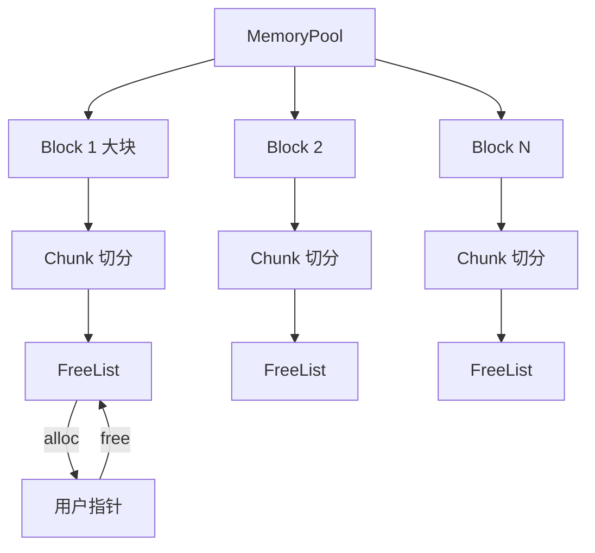
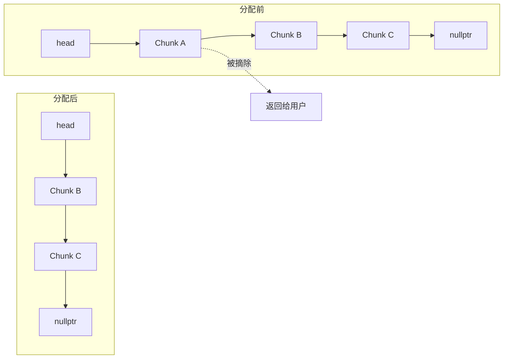
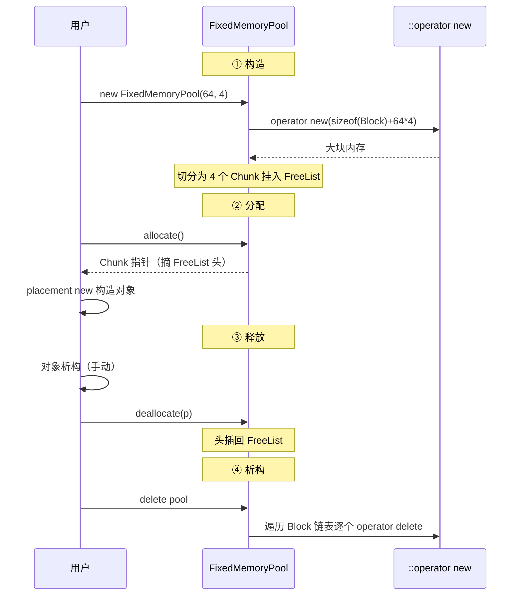
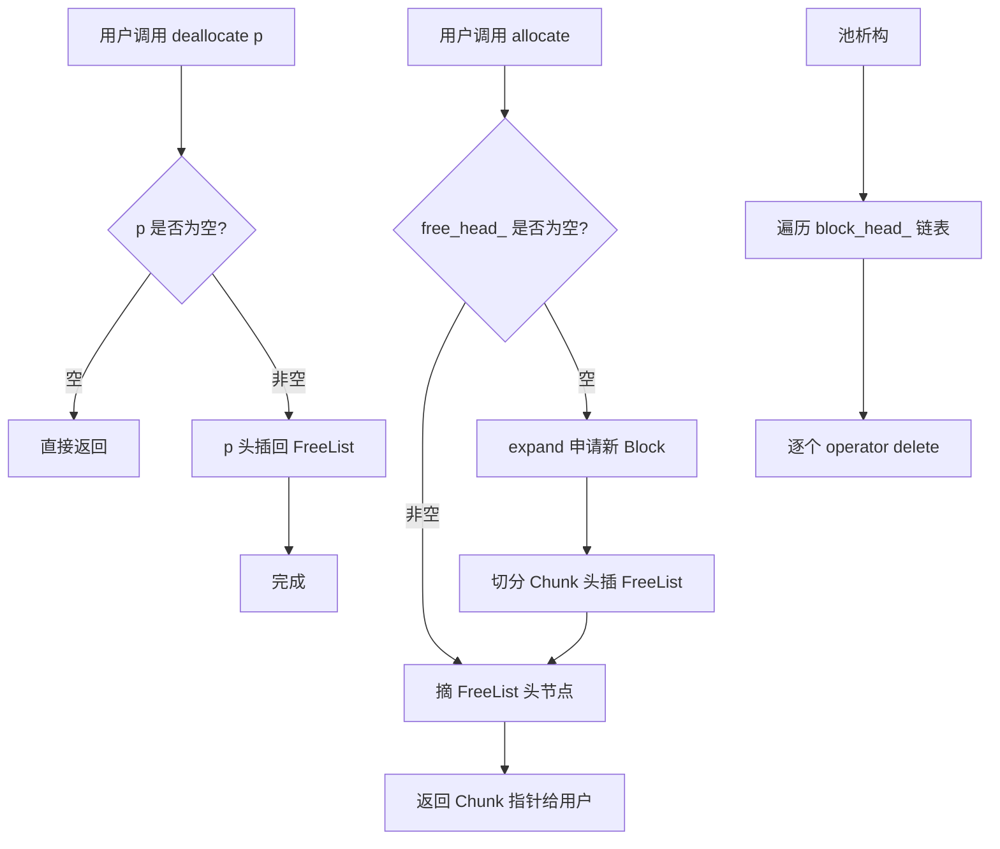

# 1. 背景与动机

## 1.1 频繁 `malloc`/`new` 的代价

直接使用 `malloc` / `new` 进行堆内存分配，存在多重隐藏开销：

| 开销来源 | 说明 | 量级 |
|---|---|---|
| **系统调用** | 当 ptmalloc/tcmalloc 内部无合适块时，需通过 `brk`/`mmap` 向 OS 申请 | 微秒级 |
| **堆元数据维护** | 分配器需维护 chunk header、空闲链表、bins 等 | 纳秒级 |
| **锁竞争** | 多线程下全局堆锁成为瓶颈 | 严重退化 |
| **内存碎片** | 频繁分配/释放产生外部碎片，导致 RSS 持续增长 | 长期累积 |
| **Cache Miss** | 分配出的地址不连续，破坏空间局部性 | 数十纳秒 |

> [!warning]
> 在游戏循环、高频交易、网络服务器等场景下，每帧/每请求可能进行数千次小对象分配，`malloc` 的开销会被放大成性能瓶颈。

## 1.2 内存池的核心思想

> **预分配一大块连续内存，由用户空间自行管理分配/回收，彻底绕过系统堆。**

核心收益：

- **O(1) 分配/释放**：通过空闲链表直接摘取/归还节点
- **零系统调用**：池子初始化时一次性向 OS 申请，运行期不再陷入内核
- **零碎片（定长池）**：所有块大小一致，不存在外部碎片
- **Cache 友好**：连续内存布局，提升命中率
- **可控生命周期**：池销毁时统一回收，避免泄漏

## 1.3 适用场景

| 场景 | 说明 |
|---|---|
| **定长对象高频分配** | 如网络连接对象、定时器节点、AST 节点 |
| **实时系统** | 需要可预测的分配延迟，禁止系统调用抖动 |
| **嵌入式系统** | 无动态内存管理或需避免堆碎片 |
| **批量生命周期管理** | 一批对象同时创建、同时销毁 |

---

# 2. 前置知识：内存对齐

> 内存池的块大小、起始地址都需要对齐，否则会引发跨缓存行访问、平台总线错误等问题。

## 2.1 对齐函数 `align_upward`

```cpp
/**
 * 将字节大小向上对齐到指定对齐数的整数倍。
 *
 * 例如：align_upward(13, 8) == 16，align_upward(8, 8) == 8
 *
 * @param size      需要对齐的原始字节大小
 * @param alignment 对齐基数，必须是 2 的幂次方（如 1、2、4、8、16...）
 * @return          大于等于 size、且是 alignment 整数倍的最小值
 */
static inline std::size_t align_upward(std::size_t size, std::size_t alignment) {
  return (size + alignment - 1) & ~(alignment - 1);
}
```

### 2.1.1 核心思想

内存对齐要求地址必须是某个值（alignment）的整数倍。比如 4 字节对齐，地址必须是 4 的倍数（0, 4, 8, 12...）。

### 2.1.2 拆解公式

> [!important]
> ```cpp
> (size + alignment - 1) & ~(alignment - 1)
> ```
> **前提**：alignment 必须是 2 的幂次方（1, 2, 4, 8, 16...）

**第一步：`size + alignment - 1`**

先把 size “推过”下一个对齐边界，确保即使 size 本身已对齐也能正确处理。

**第二步：`~(alignment - 1)` — 构造对齐掩码**

```
alignment = 8  →  二进制 0000 1000
alignment - 1  →  二进制 0000 0111
~(alignment-1) →  二进制 1111 1000  ← 对 (alignment - 1) 取反以生成掩码，使低位全清零
```

**第三步：按位与 `&`**

把第一步的结果与掩码相与，**抹掉低位**，强制对齐。

### 2.1.3 举例说明（alignment = 8）

| size | +7 后 | & ~7 后（结果） | 说明 |
|---|---|---|---|
| 1 | 8 | 8 | 向上对齐到 8 |
| 7 | 14 | 8 | 向上对齐到 8 |
| 8 | 15 | 8 | 本身已对齐，不变 |
| 9 | 16 | 16 | 向上对齐到 16 |
| 15 | 22 | 16 | 向上对齐到 16 |
| 16 | 23 | 16 | 本身已对齐，不变 |

### 2.1.4 实际用途

```cpp
// 比如你要分配 13 字节，但要按 8 字节对齐
size_t real_size = align_upward(13, 8); // = 16
malloc(real_size); // 实际分配 16 字节
```

这样分配出来的内存块，其大小是 alignment 的整数倍，保证下一个块的起始地址也是对齐的。

## 2.2 公式推导：从数学到位运算

> [!question]
> `(size + alignment - 1) & ~(alignment - 1)` 是如何推导出来的？

**核心结论**：这个公式不是凭空“发明”的，而是从“如何向上取整到 2 的幂倍数”一步步演化出来的。

### 2.2.1 第一步：明确目标

希望求“大于等于 size 的最小 alignment 的倍数”，数学表达：

$$
\text{aligned} = \left\lceil\frac{\text{size}}{\text{alignment}}\right\rceil \times \text{alignment}
$$

例如 `size=13, alignment=8`：`ceil(13/8) = 2`，`2×8 = 16`。其中 $\text{ceil}$ 是向上取整的含义。

### 2.2.2 第二步：消除 `ceil`（整数除法技巧）

C++ 的整数除法中（即截断尾数），只有向下取整，无法直接 $\text{ceil}$ 向上取整。利用经典整数恒等式：

$$
\left\lceil\frac{a}{b}\right\rceil = \frac{a + b - 1}{b} \quad (\text{整数除法})
$$

公式变为：

```cpp
((size + alignment - 1) / alignment) * alignment
```

### 2.2.3 第三步：利用 `alignment` 是 2 的幂

比如当 `alignment = 8` 时：

```
8   → 0000 1000
7   → 0000 0111
~7  → 1111 1000  (低位全 0)
```

任何数 `& ~7` 都会**把低 3 位清零**，等价于“向下取整到 8 的倍数”：

```
20  = 0001 0100  →  & 1111 1000  →  0001 0000 = 16
23  = 0001 0111  →  & 1111 1000  →  0001 0000 = 16
31  = 0001 1111  →  & 1111 1000  →  0001 1000 = 24
```

### 2.2.4 第四步：组合两步

| 步骤 | 操作 | 语义 |
|---|---|---|
| 1 | `size + alignment - 1` | 先把 size “推过”下一个对齐边界 |
| 2 | `& ~(alignment - 1)` | 再向下取整到 alignment 倍数 |

**先推过后下取整 = 向上取整**，于是得到经典公式：

```cpp
(size + alignment - 1) & ~(alignment - 1)
```

### 2.2.5 完整示例（size=13, alignment=8）

```
13              → 0000 1101
13 + 7 = 20     → 0001 0100
~7              → 1111 1000
20 & ~7 = 16    → 0001 0000  ✓
```

> [!tip]
> 记忆技巧：**“+偏移推过去，&掩码拉回来”**。加偏移是为了让“本应进位”的数越过边界，按位与则是把低位抹掉完成对齐。

> [!summary]
> 整个推导链：
> 1. 数学表达 `ceil(size/alignment) × alignment`
> 2. 整数除法消去 `ceil` → `((size + alignment - 1) / alignment) × alignment`
> 3. 2 的幂条件下，`×/÷ alignment` 等价于位掩码清低位 → `& ~(alignment-1)`
> 4. 合并得到 `(size + alignment - 1) & ~(alignment - 1)`

---

# 3. 核心概念

## 3.1 内存池定义

> **内存池（Memory Pool）**：程序启动时预申请一大块内存，后续所有分配/释放都在该块内部完成，由池自行管理空闲块的数据结构，完全绕开系统堆。

## 3.2 关键术语

| 术语 | 含义 |
|---|---|
| **Chunk（块）** | 池中最小分配单元，通常定长 |
| **Block（大块）/ Page（页）** | 向 OS 申请的连续大内存，内部切分为多个 Chunk |
| **FreeList（空闲链表）** | 维护可用 Chunk 的单链表，O(1) 摘取/归还 |
| **Slab** | 同类型对象的池化区域，源自 Solaris Slab 分配器 |
| **Padding（填充）** | 为对齐而补的字节 |

## 3.3 分类

| 类型 | 特点 | 适用 |
|---|---|---|
| **定长内存池** | 所有 Chunk 等长，FreeList O(1) | 同类型对象（连接、节点） |
| **变长内存池** | 支持任意 size，类似 mini-malloc | 通用场景 |
| **线程局部池** | 每线程独立池，无锁 | 高并发 |
| **对象池** | 池化构造/析构，不仅是内存 | 复用昂贵对象 |

---

# 4. 架构设计

## 4.1 整体架构



## 4.2 内存块布局

一个 Block 内部的物理布局：

```text
+--------------------------------------------------+
|  Block Header  |  Chunk0 | Chunk1 | Chunk2 | ... |
+--------------------------------------------------+
                  ↑        ↑        ↑
                  对齐到 alignment 的整数倍
```

每个 Chunk 在未分配时，**头部存储下一个空闲 Chunk 的指针**，复用内存：

```text
+----------------------+
| next*  |  (未用空间)  |   ← 空闲态
+----------------------+

+----------------------+
| 用户数据 ...          |   ← 占用态
+----------------------+
```

> [!tip]
> 巧妙点：FreeList 节点不需要额外内存，**复用 Chunk 自身的前 `sizeof(void*)` 字节**作为链表指针。

## 4.3 FreeList 工作机制



- **分配**：`head = head->next; return head_old;` —— O(1)
- **回收**：`p->next = head; head = p;` —— O(1)

---

# 5. 关键代码实现

## 5.1 定长内存池（经典版）

> 最常见的内存池形态：一次申请一大块内存（Block），然后把它切成很多固定大小的小块（Chunk），所有 Chunk 用空闲链表（Free List）管理，分配和释放都只需要修改几个指针，因此时间复杂度都是 O(1)。

```cpp
#include <cstddef>
#include <cstdint>
#include <new>

class FixedMemoryPool {
private:
    static inline std::size_t align_upward(std::size_t size, std::size_t alignment) {
        return (size + alignment - 1) & ~(alignment - 1);
    }

    struct Chunk {
        Chunk* next;
    };

    struct Block {
        Block* next;
        // 后续紧跟 chunk 数据
    };

    std::size_t chunk_size_;
    Block*    block_head_;
    Chunk*    free_head_;

    void expand(std::size_t count) {
        // Block 头部 + count * chunk_size
        std::size_t block_size = sizeof(Block) + chunk_size_ * count;
        Block* block = static_cast<Block*>(::operator new(block_size));
        block->next = block_head_;
        block_head_ = block;

        // 切分 Chunk 并挂到 FreeList
        char* base = reinterpret_cast<char*>(block) + sizeof(Block);
        for (std::size_t i = 0; i < count; ++i) {
            Chunk* c = reinterpret_cast<Chunk*>(base + i * chunk_size_);
            c->next = free_head_;
            free_head_ = c;
        }
    }

    // 禁止拷贝
    FixedMemoryPool(const FixedMemoryPool&) = delete;
    FixedMemoryPool& operator=(const FixedMemoryPool&) = delete;

public:
    /// @param chunk_size  单个块大小（会自动对齐）
    /// @param chunk_count 初始块数量
    FixedMemoryPool(std::size_t chunk_size, std::size_t chunk_count)
        : chunk_size_(align_upward(chunk_size, alignof(std::max_align_t))),
          block_head_(nullptr),
          free_head_(nullptr) {
        expand(chunk_count);
    }

    ~FixedMemoryPool() {
        Block* cur = block_head_;
        while (cur) {
            Block* next = cur->next;
            ::operator delete(cur);
            cur = next;
        }
    }

    /// O(1) 分配
    void* allocate() {
        if (!free_head_) expand(64);  // 按需扩容
        Chunk* c = free_head_;
        free_head_ = free_head_->next;
        return c;
    }

    /// O(1) 释放
    void deallocate(void* p) {
        if (!p) return;
        Chunk* c = static_cast<Chunk*>(p);
        c->next = free_head_;
        free_head_ = c;
    }
};
```

下面按**整体结构 → 数据结构 → 各函数实现 → 生命周期**的顺序逐层解析。

## 5.2 代码解析

### 5.2.1 整体结构：两条独立的链表

`FixedMemoryPool` 内部维护**两条相互独立的单链表**，分别服务于不同目标：

| 链表 | 节点 | 头指针 | 用途 |
|---|---|---|---|
| **Block 链表** | `Block`（大块内存头） | `block_head_` | 串联所有向 OS 申请的大块，供析构时统一释放 |
| **FreeList** | `Chunk`（空闲小块） | `free_head_` | 管理可用 Chunk，支撑 O(1) 分配/回收 |

二者只是恰好都采用单链表，**逻辑上互不依赖**：Block 链表关心“哪些大块归我所有”，FreeList 关心“哪些小块当前空闲”。

```text
block_head_                              free_head_
     │                                        │
     ▼                                        ▼
┌──────────────────────────────────┐     Chunk3 → Chunk2 → Chunk1 → Chunk0 → nullptr
│ Block │ Chunk0 │ Chunk1 │ ...    │     (每个 Chunk 复用自身前 sizeof(void*) 字节存 next)
└──────────────────────────────────┘
```

> [!info]
> Block 链表中每个 `Block` 头部紧跟着其所属的 Chunk 区域；而 FreeList 中的 `Chunk` 节点并非独立分配，而是复用这些 Chunk 空闲时的前几个字节。两条链表共享同一片物理内存，但组织方式不同。

### 5.2.2 数据结构：Block 与 Chunk

#### Block：大块内存的管理头

```cpp
struct Block {
    Block* next;   // 指向下一个 Block，组成释放链表
};
```

每个 `Block` 是一次 `::operator new` 申请到的连续大内存的**头部（Header）**，仅承载管理信息，不存放用户数据。当前实现中 Header 只有一个 `next` 指针，唯一作用是把所有大块串成链表，以便析构函数遍历释放。

```text
┌──────────┬──────────────────────────────────────────────┐
│ Header   │            可供用户使用的 Chunk 区域         │
│ (Block)  │  Chunk0 │ Chunk1 │ Chunk2 │ ...              │
└──────────┴──────────────────────────────────────────────┘
←属于内存池→ ←───────────────属于用户───────────────────→
```

> [!tip]
> 生产级分配器（glibc malloc、jemalloc）的 Header 通常还记录 `chunk_count`、`free_count`、`magic`、`block_size` 等元信息，用于调试、统计与越界检测。本实现为求简洁仅保留 `next`。

#### Chunk：空闲块的复用结构

```cpp
struct Chunk {
    Chunk* next;
};
```

> [!warning]
> `Chunk` **不是一种常驻对象**，而是“空闲块”的临时视图。它只定义了空闲态下前几个字节如何解释。

`Chunk` 结构的大小仅为 `sizeof(Chunk*)`（如 8 字节），但每个 Chunk 实际占用的空间是 `chunk_size_`（已对齐，如 64 字节）。同一片内存在两种状态下被不同地解释：

| 状态 | 前 `sizeof(void*)` 字节 | 其余空间 |
|---|---|---|
| **空闲态**（在 FreeList 中） | `Chunk::next`，指向下一个空闲块 | 未使用 |
| **占用态**（已分配给用户） | 用户对象数据（如 `Connection`） | 用户对象数据 |

```text
空闲态：  ┌─────────┬─────────────────────┐
          │  next   │      (未使用)       │
          └─────────┴─────────────────────┘

占用态：  ┌─────────────────────────────────┐
          │  用户对象 (placement new 构造)  │
          └─────────────────────────────────┘
```

`allocate()` 返回指针后，用户通过 placement new 在原位构造对象，`next` 字段被覆盖；`deallocate()` 时再通过 `reinterpret_cast<Chunk*>(p)` 把 `next` 写回，重新纳入 FreeList。**这种“复用 Chunk 自身空间存链表指针”的设计使 FreeList 节点零额外开销。**

### 5.2.3 `expand()`：申请大块并切分

`expand()` 是内存池与 OS 唯一的交互点，负责申请大块内存、切分为 Chunk 并挂入 FreeList。

```cpp
void expand(std::size_t count) {
    // 1. 计算所需字节：Block 头 + count 个 Chunk
    std::size_t block_size = sizeof(Block) + chunk_size_ * count;

    // 2. 向 OS 申请原始内存（不构造对象）
    Block* block = static_cast<Block*>(::operator new(block_size));

    // 3. 头插法插入 Block 链表
    block->next = block_head_;
    block_head_ = block;

    // 4. 定位 Chunk 区域起始地址
    char* base = reinterpret_cast<char*>(block) + sizeof(Block);

    // 5. 切分 Chunk 并头插法挂入 FreeList
    for (std::size_t i = 0; i < count; ++i) {
        Chunk* c = reinterpret_cast<Chunk*>(base + i * chunk_size_);
        c->next = free_head_;
        free_head_ = c;
    }
}
```

#### 步骤拆解

**步骤 1 — 计算容量**：`block_size = sizeof(Block) + chunk_size_ * count`。以 `sizeof(Block)=8`、`chunk_size_=64`、`count=4` 为例，申请 `8 + 64×4 = 264` 字节的连续内存。

**步骤 2 — 申请原始内存**：`::operator new` 仅分配字节、不调用任何构造函数；返回的内存前 `sizeof(Block)` 字节作为 Header，其余作为 Chunk 区域。

**步骤 3 — 挂入 Block 链表**：采用头插法（`block->next = block_head_; block_head_ = block;`）。多次 `expand()` 申请的大块在物理上不一定连续，靠 `Block::next` 串联，析构时沿链表逐个 `operator delete`。

**步骤 4 — 定位 Chunk 起点**：`base = (char*)block + sizeof(Block)`。转为 `char*` 是为了按字节进行指针算术（`sizeof(char)` 恒为 1），`base + i * chunk_size_` 即第 `i` 个 Chunk 的起始地址。

**步骤 5 — 切分并挂入 FreeList**：循环中将每个 Chunk 头插法挂入 FreeList。由于头插，遍历顺序与地址顺序相反——若按地址依次为 `Chunk0, Chunk1, Chunk2, Chunk3`，则挂入后 FreeList 为 `Chunk3 → Chunk2 → Chunk1 → Chunk0 → nullptr`。

> [!warning]
> 本实现假设 `sizeof(Block)` 是 `alignof(std::max_align_t)` 的整数倍，从而 `base` 自然满足最大对齐要求。这在主流平台成立，但并非标准保证。更严谨的做法是对 `base` 显式做一次对齐，或令 `Block` 自身按 `std::max_align_t` 对齐（见 5.2.7）。

### 5.2.4 构造函数：初始化对齐与首批 Chunk

```cpp
FixedMemoryPool(std::size_t chunk_size, std::size_t chunk_count)
    : chunk_size_(align_upward(chunk_size, alignof(std::max_align_t))),
      block_head_(nullptr),
      free_head_(nullptr) {
    expand(chunk_count);
}
```

执行顺序：

1. **对齐 `chunk_size`**：`align_upward(chunk_size, alignof(std::max_align_t))` 将用户传入的 `chunk_size` 向上取整到 `max_align_t`（主流平台为 8 或 16）的整数倍。即使请求 7 字节，最终也按 8 字节分配，保证任意类型的对象都能安全 placement new 到 Chunk 内。
2. **置空头指针**：`block_head_` 与 `free_head_` 初始化为 `nullptr`。
3. **首批扩容**：调用 `expand(chunk_count)` 申请第一个大块并切分。这意味着**内存池在构造完成时即占用 `sizeof(Block) + chunk_size_ * chunk_count` 字节内存**——这是一种"预换时间"的取舍，换取后续分配的 O(1)。

### 5.2.5 `allocate()` / `deallocate()`：O(1) 核心路径

```cpp
void* allocate() {
    if (!free_head_) expand(64);  // 按需扩容
    Chunk* c = free_head_;
    free_head_ = free_head_->next;
    return c;
}

void deallocate(void* p) {
    if (!p) return;
    Chunk* c = static_cast<Chunk*>(p);
    c->next = free_head_;
    free_head_ = c;
}
```

#### `allocate()` — 摘头分配

```text
分配前：  free_head_ → C3 → C2 → C1 → C0 → nullptr

执行：    c = free_head_;          // c 指向 C3
          free_head_ = c->next;    // free_head_ 后移到 C2
          return c;                // 把 C3 返回给用户

分配后：  free_head_ → C2 → C1 → C0 → nullptr
          用户拿到 C3 的指针
```

只有 1 次判空、2 次指针读写，**无系统调用、无锁、无内存写入**（除链表指针外），故为 O(1)。当 `free_head_` 为空（首次用尽或全部占用）时触发 `expand(64)` 申请新大块；这里的 64 是经验性的按需扩容批次大小。

#### `deallocate()` — 头插回收

```text
回收前：  free_head_ → C2 → C1 → C0 → nullptr
          用户持有 p 指向 C3

执行：    c = static_cast<Chunk*>(p);   // 把 p 解释为 Chunk*
          c->next = free_head_;          // C3->next = C2
          free_head_ = c;                // free_head_ = C3

回收后：  free_head_ → C3 → C2 → C1 → C0 → nullptr
```

`static_cast<Chunk*>(p)` 的合法性：`p` 原本就是 `allocate()` 返回的 `Chunk*`（隐式转为 `void*`），现在只是转回原类型。回收后的 Chunk 重新成为 FreeList 的头节点，等待下次 `allocate()` 复用。整个回收同样 O(1)。

> [!warning]
> `deallocate(p)` **不检查 `p` 是否真属于本池**，也**不检查 `p` 是否已被释放过**（双重释放会形成自环导致死循环）。生产实现应加 magic 校验与 in-pool 检测。

### 5.2.6 析构函数：统一归还大块

```cpp
~FixedMemoryPool() {
    Block* cur = block_head_;
    while (cur) {
        Block* next = cur->next;
        ::operator delete(cur);
        cur = next;
    }
}
```

析构只遍历 **Block 链表**逐个 `operator delete`，**不碰 FreeList**。原因有二：

1. **Block 链表已覆盖所有申请的内存**：每个 Block 头部紧跟着其切分出的 Chunk 区域，释放 Block 即释放其下属的所有 Chunk。
2. **FreeList 中的 Chunk 都内嵌于某个 Block 内**，没有独立申请的内存，无需也不能单独释放。

> [!warning]
> 析构时**不会调用用户对象的析构函数**。用户必须先用 `p->~T()` 手动析构，再 `pool.deallocate(p)`，否则会资源泄漏（如对象内部持有 `std::string`、文件句柄等）。

### 5.2.7 `align_upward()`：位运算对齐

```cpp
static inline std::size_t align_upward(std::size_t size, std::size_t alignment) {
    return (size + alignment - 1) & ~(alignment - 1);
}
```

#### 公式拆解

设 `alignment = 8`（二进制 `1000`），则 `alignment - 1 = 7`（二进制 `0111`）。以 `size = 13` 为例：

| 表达式 | 作用 | 计算 |
|---|---|---|
| `size + alignment - 1` | 先加 `alignment-1`，制造进位 | `13 + 7 = 20`（`10100`） |
| `~(alignment - 1)` | 生成掩码，低 `log2(alignment)` 位置 0 | `~0111 = ...11111000` |
| `& ~(alignment - 1)` | 截断低位，得到不小于 `size` 的对齐值 | `10100 & 11111000 = 10000 = 16` |

最终 `13 → 16`，即不小于 13 的最小 8 的倍数。

> [!info]
> 使用前提：`alignment` 必须是 **2 的幂**。否则 `alignment - 1` 的高位为 1，`&` 操作会错误地清零。`alignof(std::max_align_t)` 在所有标准平台上都满足此约束。

### 5.2.8 完整生命周期

把前述函数串起来，一个内存池的完整生命周期如下：



#### 具体数值演练

构造 `FixedMemoryPool(56, 4)`（请求 56 字节 Chunk，初始 4 块）：

1. **对齐**：`align_upward(56, 8) = 56`（已是 8 的倍数），`chunk_size_ = 56`。
2. **`expand(4)`**：申请 `8 + 56×4 = 232` 字节。
3. **切分**：`base = block + 8`，依次生成 `Chunk0@(base+0)`、`Chunk1@(base+56)`、`Chunk2@(base+112)`、`Chunk3@(base+168)`。
4. **挂入 FreeList**（头插）：`free_head_ → Chunk3 → Chunk2 → Chunk1 → Chunk0 → nullptr`。
5. **首次 `allocate()`**：返回 `Chunk3`，`free_head_ → Chunk2`。
6. **`deallocate(Chunk3)`**：`Chunk3->next = Chunk2`，`free_head_ → Chunk3 → Chunk2 → ...`。
7. **析构**：`operator delete(block)`，整块归还 OS。

> [!tip]
> 整个生命周期内，**与 OS 的交互只发生在构造和按需 `expand` 时**；常态化的分配/释放完全在用户态通过几条指针赋值完成，这正是内存池性能优势的根源。

## 5.3 使用示例

以管理 `Connection` 对象为例，展示内存池的典型用法：

```cpp
#include <new>
#include <cstring>

struct Connection {
    int  fd;
    char ip[16];
    Connection(int f, const char* s) : fd(f) { std::strcpy(ip, s); }
    ~Connection() { /* 关闭 fd 等 */ }
};

int main() {
    // 1. 构造池：Chunk 至少容纳 sizeof(Connection)，初始 128 块
    FixedMemoryPool pool(sizeof(Connection), 128);

    // 2. 分配 + placement new 构造
    void* mem = pool.allocate();
    Connection* conn = new (mem) Connection(3, "127.0.0.1");

    // ... 使用 conn ...

    // 3. 手动析构 + 回收
    conn->~Connection();
    pool.deallocate(conn);

    // 4. 池析构时统一归还所有 Block
}
```

> [!warning]
> 三步缺一不可：`allocate` 只给裸内存，必须 `placement new` 才构造对象；回收前必须手动 `~T()`，否则对象内部资源（`fd`、`std::string` 等）泄漏。

## 5.4 线程安全版

经典版未加锁，多线程并发 `allocate`/`deallocate` 会导致 FreeList 竞争（丢失更新、悬空指针）。最小改造是用互斥锁包裹核心路径：

```cpp
#include <mutex>

class ThreadSafePool {
private:
    FixedMemoryPool pool_;          // 复用经典实现
    std::mutex      mtx_;

public:
    ThreadSafePool(std::size_t chunk_size, std::size_t chunk_count)
        : pool_(chunk_size, chunk_count) {}

    void* allocate() {
        std::lock_guard<std::mutex> lk(mtx_);
        return pool_.allocate();
    }

    void deallocate(void* p) {
        std::lock_guard<std::mutex> lk(mtx_);
        pool_.deallocate(p);
    }
};
```

#### 取舍

| 方案 | 吞吐 | 复杂度 | 适用场景 |
|---|---|---|---|
| **全局锁**（上图） | 低（竞争激烈） | 低 | 临界区短、线程数少 |
| **每线程独立池**（ThreadLocal） | 高（无锁） | 中 | 线程数固定、对象不跨线程 |
| **分段锁 / Sharded Pool** | 较高 | 高 | 高并发通用场景 |

> [!tip]
> FreeList 的摘头/头插本质是 LIFO 栈操作，天然适合无锁 CAS 实现（`std::atomic<Chunk*>`）。但 ABA 问题需用 tagged pointer 或 hazard pointer 解决，远超教学版范围。

---

# 6. 数据流



要点：

- **分配热路径**（`free_head_` 非空）：仅 2 次指针读写，无系统调用。
- **冷路径**（触发 `expand`）：偶发，分摊到后续多次分配后成本可忽略。
- **回收路径**：恒为 2 次指针读写，无任何分支调用 OS。

---

# 7. 性能分析

## 7.1 与 `malloc` 对比

| 维度 | `malloc/free` | 定长内存池 |
|---|---|---|
| 时间复杂度 | 平均 O(1)，最坏可达 O(n)（碎片整理/锁竞争） | **严格 O(1)** |
| 系统调用 | 频繁（堆扩展时 `brk/mmap`） | **仅构造/扩容时** |
| 内存碎片 | 高（外部 + 内部） | **零（定长）** |
| 多线程 | 全局堆锁或 arena 锁 | 可每线程一池，**无锁** |
| 缓存友好性 | 分散 | **连续布局，命中率高** |
| 灵活性 | 任意大小 | **仅固定大小** |

## 7.2 开销估算

设 `chunk_size_ = 64`，`count = 1024`：

- **内存开销**：`sizeof(Block) + 64×1024 ≈ 64 KB`（Block 头 8 字节可忽略）。
- **单次分配**：~2 条 mov 指令 + 1 条比较，纳秒级。
- **对比 `malloc(64)`**：glibc tcache 命中约 20–40 ns，未命中走 fastbin/smallbin 可达 100+ ns；池化版本稳定在个位数 ns。

## 7.3 适用边界

> [!warning]
> 内存池并非银弹。当对象**大小差异大**、**生命周期复杂**或**总用量小**时，池化的预分配与固定大小反而增加开销。最佳场景是**同型对象高频创建/销毁**（连接、节点、事件）。

---

# 8. 易错点

| # | 陷阱 | 后果 | 规避 |
|---|---|---|---|
| 1 | **双重释放**：同一指针 `deallocate` 两次 | FreeList 形成自环，`allocate` 死循环 | 加 magic/in-use 标志位校验 |
| 2 | **跨池释放**：把 A 池的指针还给 B 池 | 内存归属混乱、析构时双重释放 | 校验指针是否落在 `block_head_` 区间内 |
| 3 | **忘记手动析构**：`deallocate` 前 `~T()` | 对象内部资源泄漏 | 封装 `make<T>(args...)` / `destroy(p)` 接口 |
| 4 | **Chunk 过小**：`chunk_size < sizeof(T)` | placement new 越界写相邻 Chunk | 构造时断言 `chunk_size_ >= sizeof(T)` |
| 5 | **对齐不足**：`chunk_size` 非 `max_align_t` 倍数 | 平台相关崩溃或性能退化 | 构造时强制 `align_upward`（本实现已做） |
| 6 | **多线程未加锁**：直接用经典版 | FreeList 竞争，丢失更新/悬空 | 用 5.4 的线程安全版或 ThreadLocal 池 |
| 7 | **`sizeof(Block)` 未对齐**：`base` 错位 | 罕见平台崩溃 | 让 `Block` 继承 `std::max_align_t` 或显式对齐 `base` |

# 9. 最佳实践

1. **场景匹配**：仅对"同型、高频、生命周期短"的对象池化；其余仍用 `malloc`/`new`。
2. **封装 RAII**：提供 `pool.make<T>(args...)` 与 `pool.destroy(p)`，内部完成分配+构造 / 析构+回收，避免手动 placement new 漏写析构。
3. **对齐优先**：构造期一次性 `align_upward`，运行期不再处理；`chunk_size_` 取 `max(sizeof(T), alignof(T))` 向上对齐。
4. **按需扩容**：初始给合理批量（如 256），用尽时按 2× 或固定批次扩容，避免每对象一次 `expand`。
5. **线程模型**：优先 ThreadLocal 池（无锁、缓存友好）；跨线程传递对象时用"归还到原池"的 sharded 设计。
6. **统计与调试**：维护 `alloc_count`/`free_count`/`peak_usage`，加 magic 字段，便于排查泄漏与越界。
7. **析构兜底**：池析构前断言 `alloc_count == free_count`，提示用户未归还的对象。

# 10. 总结

```mermaid
mindmap
  root((定长内存池))
    核心思想
      预分配大块 Block
      切分为等长 Chunk
      FreeList 管理 空闲态
    关键结构
      Block 链表 ← 归还 OS
      FreeList ← O(1) 分配回收
      Chunk 复用头部存 next
    性能特征
      分配/释放 O(1)
      零系统调用 热路径
      零碎片 定长
    适用场景
      同型对象 高频
      连接 / 节点 / 事件
    注意事项
      手动析构对象
      双重释放 跨池释放
      线程安全 对齐
```

- 内存池用**预分配 + FreeList**把分配/释放降到 O(1)，本质是用空间换时间、用固定大小换零碎片。
- **Block 链表**管"哪些大块归我"（析构归还），**FreeList** 管"哪些小块空闲"（O(1) 调度），两者共享物理内存、逻辑独立。
- **Chunk 复用自身前几个字节存 `next`**，使 FreeList 节点零额外开销——这是教学版最巧妙之处。
- 生产化需补齐**对齐校验、双重释放检测、线程安全、RAII 封装、统计调试**等工程护栏。

> [!note]
> 进一步学习：可阅读 SGI STL 的 `__default_alloc_template`（带 free list 的二级配置器）、boost::pool、jemalloc 的 tcache 设计。