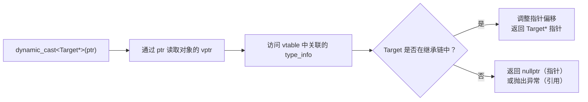
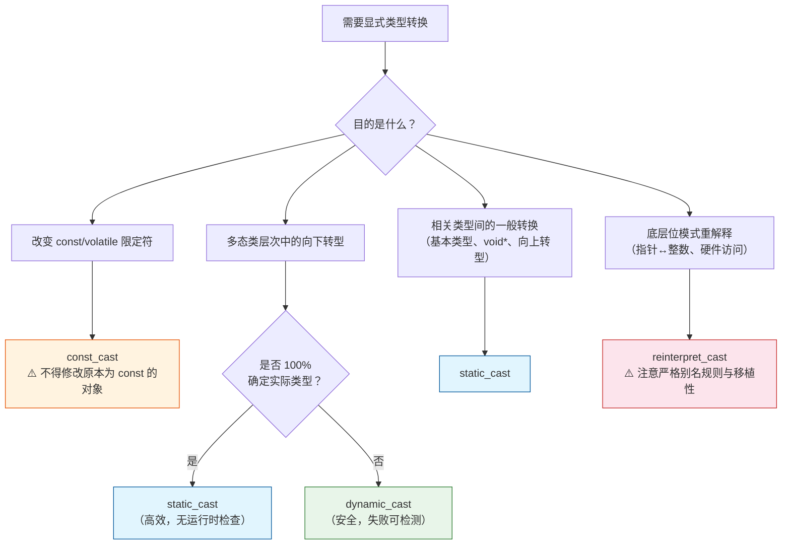
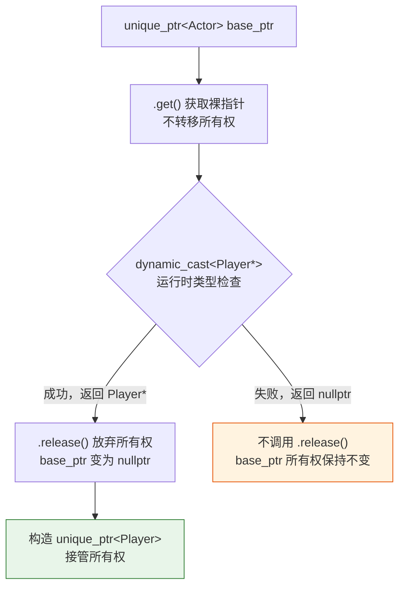

# 1. static_cast

`static_cast` 是 C++ 中**编译期进行的显式类型转换**，用于在**具有逻辑关联的类型之间**进行"安全、可预期"的转换。它比 C 风格强转 `(Type)expr` 更严格、更易读，也更容易被编译器检查和工具分析。

基本语法：

```cpp
static_cast<目标类型>(表达式)
```

## 1.1 适用场景

### 1.1.1 基本类型之间的转换

```cpp
int a = 10;
double b = static_cast<double>(a);  // ✅ int → double，精度扩展

double pi = 3.14159;
int truncated = static_cast<int>(pi);  // ✅ double → int，小数部分截断（= 3）

// 对比 C 风格强转（不推荐）：
double b2 = (double)a;  // ⚠️ 语义不明确，不易 grep/分析
```

### 1.1.2 继承体系内的上下行转换

> 将派生类指针/引用转换为基类指针/引用（Upcast）。此方向的转型本身是隐式安全的，`static_cast` 在此显式标注意图。

向上转型（子类 -> 父类）：

```cpp
class Base {};
class Derived : public Base {};

Derived d;
Base* b = static_cast<Base*>(&d);  // ✅ 安全：向上转型，符合 Is-A 关系
Base& br = static_cast<Base&>(d);  // ✅ 引用同理
```

向下转型（父类 -> 子类，编译通过但**不安全**）：

```cpp
class Base {};
class Derived : public Base { public: int extra; };

Base* b = new Base();  // 实际对象是 Base
Derived* d = static_cast<Derived*>(b);  // ⚠️ 编译通过，但行为未定义！
d->extra;  // 💥 访问不存在的内存区域 → 未定义行为
```

> [!warning] static_cast 向下转型的风险
> 对指针使用 `static_cast` 进行向下转型时，编译器**不进行任何运行时检查**。若对象实际类型与目标类型不符，将产生**未定义行为（Undefined Behavior）**，可能表现为崩溃、数据损坏或静默错误，且极难调试。仅在有充分外部保证时使用。
> 因此，在类型不确定时，建议使用 `dynamic_cast`（见 [§2 dynamic_cast](#\ 2.\ dynamic_cast)）。
> 但是，如果类型确定（比如 Derived -> Base -> Derived），建议用 `static_cast`，因为 `static_cast` 的开销比 `dynamic_cast` 更小。

下面是对 Derived -> Base -> Derived 这种转换的说明：

#### 场景 A：指针/引用转换（不改变内存布局）

当你执行 `Base* b = static_cast<Base*>(derived_ptr);` 时：

- **内存布局**：完全没变。`Derived` 对象在内存里依然保持完整。
- **信息丢失**：不会丢失。虽然你通过 `b` 只能看到 `Base` 的成员，但 `Derived` 的成员依然在那。
- **从 Base 还原到 Derived**：只要你确定 `b` 实际指向的就是 `Derived`，再次 `static_cast` 回去，所有数据都完好无损。

#### 场景 B：对象切片（真正的数据丢失）

如果你执行的是**对象拷贝**而非指针转换：

```cpp
Derived d;
Base b = static_cast<Base>(d); // 发生对象切片 (Slicing)
```

此时，编译器会调用 `Base` 的拷贝构造函数。它会从 `d` 中提取 `Base` 部分并创建一个**全新的 `Base` 对象**。此时，`Derived` 特有的成员确实“丢了”，且无法还原。

### 1.1.3 `void*` 与具体指针类型的互转

```cpp
int x = 42;
void* vp = &x;                        // ✅ 任何指针可隐式转为 void*
int* px = static_cast<int*>(vp);      // ✅ 需显式转回，必须保证类型正确
// ⚠️ 若 vp 实际指向 double，转为 int* 后解引用 → 未定义行为
```

### 1.1.4 枚举与整数的互转

```cpp
enum Color { Red = 1, Green = 2, Blue = 3 };

int x = static_cast<int>(Red);      // ✅ enum → int
Color c = static_cast<Color>(2);    // ✅ int → enum（需确保值在枚举范围内）
```

## 1.2 不支持的操作

### 1.2.1 移除 const 限定符

```cpp
const int x = 10;
// int* p = static_cast<int*>(&x);  // ❌ 编译错误
```

> 移除 const 必须使用 `const_cast`（见 [§3 const_cast](#\ 3.\ const_cast)）。

### 1.2.2 完全无关类型之间的转换

```cpp
struct A {};
struct B {};

A a;
// B b = static_cast<B>(a);  // ❌ 编译错误：A 与 B 之间无转换关系
// A* pa = &a;
// B* pb = static_cast<B*>(pa);  // ❌ 编译错误：无关指针类型
```

> 强制按位重解释必须使用 `reinterpret_cast`（见 [§4 reinterpret_cast](#\ 4.\ reinterpret_cast)）。

---

# 2. dynamic_cast

`dynamic_cast` 是 C++ 四种显式转换符中**唯一在运行时进行类型安全检查**的转换，专用于多态类继承体系中的指针/引用转换。

## 2.1 核心作用与适用范围

`dynamic_cast` 在运行时查询对象的**实际类型**（依赖 RTTI），安全地将基类指针/引用转换为派生类指针/引用。

- 若转换目标是**指针**：失败时返回 `nullptr`，不抛出异常
- 若转换目标是**引用**：失败时抛出 `std::bad_cast` 异常（引用不可为空）

> [!note] 使用前提
> 基类**必须包含至少一个虚函数**（通常是虚析构函数）。若基类无虚函数，编译器无法为其生成 RTTI 信息，`dynamic_cast` 将编译报错。

## 2.2 作用于指针：失败返回 nullptr

```cpp
#include <iostream>

class Entity {
public:
    virtual ~Entity() {}  // ✅ 虚析构函数，提供 RTTI 入口
};

class Player : public Entity {
public:
    void useAbility() { std::cout << "调用 Player::useAbility()：玩家释放了技能！\n"; }
};

class Enemy : public Entity {
public:
    void roar() { std::cout << "调用 Enemy::roar()：怪物发出了怒吼！\n"; }
};

int main() {
    Entity* e_player = new Player();
    Entity* e_enemy  = new Enemy();

    // ✅ 成功：e_player 实际指向 Player 对象
    Player* p = dynamic_cast<Player*>(e_player);
    if (p) {
        p->useAbility();  // 输出: 玩家释放了技能！
    }

    // ✅ 失败：e_enemy 实际指向 Enemy，不是 Player
    Player* p2 = dynamic_cast<Player*>(e_enemy);
    if (!p2) {
        std::cout << "转换失败：该 Entity 并非 Player\n";
    }

    delete e_player;
    delete e_enemy;
}
```

## 2.3 作用于引用：失败抛出 std::bad_cast

由于引用不能为空，`dynamic_cast` 作用于引用时，转换失败以抛出异常的方式报告。

```cpp
#include <typeinfo>  // std::bad_cast

void processPlayer(Entity& entity) {
    try {
        Player& p = dynamic_cast<Player&>(entity);  // 失败时抛出 std::bad_cast
        p.useAbility();
    } catch (const std::bad_cast& e) {
        std::cout << "引用转换失败：" << e.what() << "\n";
    }
}

int main() {
    Player player;
    Enemy  enemy;

    processPlayer(player);  // ✅ 成功，正常调用
    processPlayer(enemy);   // ❌ 抛出 std::bad_cast，被 catch 捕获
}
```

## 2.4 适用场景

### 2.4.1 向下转型

最常见的用法：基类指针/引用在运行时安全地还原为派生类。

```cpp
std::vector<Entity*> entities;
entities.push_back(new Player());
entities.push_back(new Enemy());

for (auto* e : entities) {
    if (auto* player = dynamic_cast<Player*>(e)) {
        player->useAbility();  // 仅 Player 执行
    } else if (auto* enemy = dynamic_cast<Enemy*>(e)) {
        enemy->roar();         // 仅 Enemy 执行
    }
    // Entity 通用行为通过虚函数多态处理
}

for (auto* e : entities) delete e;
```

### 2.4.2 侧向转型（多重继承场景）

在多重继承中，可将指向某一基类的指针**横向转换**为同一派生类的另一基类指针。

```cpp
class Drawable { public: virtual ~Drawable() {} virtual void draw() = 0; };
class Updatable { public: virtual ~Updatable() {} virtual void update() = 0; };

class Sprite : public Drawable, public Updatable {
public:
    void draw()   override { std::cout << "绘制 Sprite\n"; }
    void update() override { std::cout << "更新 Sprite\n"; }
};

Drawable* d = new Sprite();

// 侧向转型：Drawable* → Updatable*（通过派生类 Sprite 中转）
Updatable* u = dynamic_cast<Updatable*>(d);
if (u) {
    u->update();  // ✅ 输出: 更新 Sprite
}

delete d;
```

## 2.5 底层原理：RTTI

`dynamic_cast` 依靠 **RTTI（Run-Time Type Information，运行时类型信息）** 工作。

编译器在虚函数表（vtable）中关联类型描述符（`type_info` 对象）。执行 `dynamic_cast` 时，程序通过对象的 `vptr` 找到 vtable，再查询类型信息，验证目标类型与实际类型的继承关系。



> [!warning] 性能与设计提示
> `dynamic_cast` 是四种转换符中**性能开销最高**的（涉及运行时查表与类型层级遍历）。若代码中频繁出现 `dynamic_cast`，通常意味着多态设计存在问题——应优先考虑将类型分派逻辑封装为虚函数，以消除显式类型检查。
> 
> 另外，部分嵌入式或高性能场景会通过编译选项（如 `-fno-rtti`）关闭 RTTI，此时 `dynamic_cast` 不可用。

---

# 3. const_cast

`const_cast` 是 C++ 中**唯一用于添加或移除 `const`/`volatile` 限定符**的显式转换符，不改变指针/引用所指向对象的实际类型或内存布局。

基本语法：

```cpp
const_cast<目标类型>(表达式)
// 目标类型与源类型的基础类型必须相同，仅限定符不同
```

## 3.1 移除 const：对接遗留 C 接口

最常见的合法用途：调用不接受 `const char*` 的旧式 C API，但确保该函数不会真正修改内容。

```cpp
// 遗留 C 库函数：参数未声明 const（但实际不修改内容）
void legacyLog(char* msg) {
    printf("[LOG] %s\n", msg);  // 只读，不写入
}

const char* message = "系统启动完成";
legacyLog(const_cast<char*>(message));  // ✅ 安全：legacyLog 不修改内容
```

## 3.2 在 const 成员函数中复用非 const 逻辑

利用 `const_cast` 消除重复代码：让非 `const` 版本复用 `const` 版本的实现。

```cpp
class Buffer {
    int data[100] = {};
public:
    // const 版本：基础实现
    const int& get(int i) const {
        // 边界检查、缓存查找等公共逻辑...
        return data[i];
    }

    // 非 const 版本：复用 const 实现，避免代码重复
    int& get(int i) {
        // 先转为 const this → 调用 const 版本 → 再移除返回值的 const
        return const_cast<int&>(
            static_cast<const Buffer&>(*this).get(i)
        );
    }
};

Buffer buf;
buf.get(0) = 42;               // 调用非 const 版本，可赋值
const Buffer& cbuf = buf;
int val = cbuf.get(0);         // 调用 const 版本，只读
```

## 3.3 添加 const

虽然向 `const` 方向的转换通常由编译器隐式完成，但显式使用 `const_cast` 可以提高代码意图的清晰度。

```cpp
int x = 10;
int* p = &x;

const int* cp = const_cast<const int*>(p);  // ✅ 添加 const（通常写成隐式转换即可）
// *cp = 20;  // ❌ 编译错误：cp 是 const int*，不可修改
```

## 3.4 使用限制与风险

> [!danger] 最重要的限制：不得修改原本为 const 的对象
> 若对象**声明时即为 const**，使用 `const_cast` 移除后进行**写操作**，将产生**未定义行为（UB）**：

```cpp
const int x = 42;                   // x 本身是 const 对象
int& y = const_cast<int&>(x);
y = 100;                            // ❌ 未定义行为！编译器可能将 x 存入只读内存
std::cout << x << "\n";             // 可能仍输出 42（编译器优化缓存），也可能崩溃

// ✅ 合法：原对象本身是非 const，只是通过 const 引用/指针传递
int mutable_x = 42;
const int& cr = mutable_x;
int& wr = const_cast<int&>(cr);     // ✅ 安全：mutable_x 本身非 const
wr = 100;
std::cout << mutable_x << "\n";     // 输出: 100
```

| 操作 | 是否合法 | 说明 |
|------|:--------:|------|
| 移除 `const` 后只读访问 | ✅ | 安全，无副作用 |
| 移除 `const` 后写入（原对象非 const）| ✅ | 原对象可修改，合法 |
| 移除 `const` 后写入（原对象为 const）| ❌ | 未定义行为，严禁 |
| `static_cast` 移除 `const` | ❌ | 编译错误，只有 `const_cast` 可操作限定符 |

---

# 4. reinterpret_cast

`reinterpret_cast` 是 C++ 中**最底层、最危险的显式转换符**，它将表达式的比特模式**按目标类型重新解释**，不进行任何类型安全检查，也不保证结果的可移植性。

基本语法：

```cpp
reinterpret_cast<目标类型>(表达式)
// 目标类型通常是指针、整数或引用，且与源类型无继承关系
```

## 4.1 指针与整数的互转

将指针转为整数（通常用于地址运算或哈希），或将整数转为指针（用于访问特定内存地址）。

```cpp
#include <cstdint>

int value = 42;
int* ptr = &value;

// 指针 → 整数：获取地址数值
uintptr_t addr = reinterpret_cast<uintptr_t>(ptr);
std::cout << "地址: " << std::hex << addr << "\n";

// 整数 → 指针：还原指针（必须保证地址有效）
int* restored = reinterpret_cast<int*>(addr);
std::cout << "值: " << *restored << "\n";  // 输出: 42

// ⚠️ 用于哈希（自定义指针哈希）
std::size_t hash = reinterpret_cast<std::size_t>(ptr);
```

## 4.2 访问硬件寄存器（嵌入式/驱动开发）

在硬件编程中，外设寄存器通常映射到固定内存地址，需要将整数地址转为指针。

```cpp
#include <cstdint>

// 访问内存映射的硬件寄存器（假设地址为 0x40021000）
volatile uint32_t* gpio_reg = reinterpret_cast<volatile uint32_t*>(0x40021000);
*gpio_reg = 0x01;  // 写入控制位，操作硬件

// volatile 关键字防止编译器优化掉对寄存器的读写
```

## 4.3 字节级序列化与反序列化

将对象内存以字节流形式读写（如网络传输、文件存储）。

```cpp
#include <cstdint>
#include <cstring>

struct Header {
    uint16_t magic;
    uint32_t length;
};

// 将 Header 对象序列化为字节流
Header h = { 0xABCD, 100 };
const uint8_t* bytes = reinterpret_cast<const uint8_t*>(&h);
// bytes 现在可以逐字节写入文件或网络缓冲区

// 从字节缓冲区反序列化（需保证对齐和大小端）
uint8_t buffer[sizeof(Header)] = {};
// ... 从文件/网络读入 buffer ...
const Header* parsed = reinterpret_cast<const Header*>(buffer);
```

## 4.4 类型双关（Type Punning）与严格别名规则

通过指针将一种类型的比特模式解读为另一种类型，需特别谨慎。

```cpp
// ❌ 严格别名规则（Strict Aliasing Rule）违反：C++17 及以下为未定义行为
float f = 3.14f;
uint32_t bits = *reinterpret_cast<uint32_t*>(&f);  // ❌ UB（编译器可能优化掉）

// ✅ C++17 及以下的合规方式：通过 memcpy 进行类型双关
uint32_t bits_safe;
std::memcpy(&bits_safe, &f, sizeof(float));         // ✅ 合法、可移植

// ✅ C++20 推荐方式：std::bit_cast（零开销，语义清晰）
#include <bit>
uint32_t bits_modern = std::bit_cast<uint32_t>(f);  // ✅ 安全且高效
```

## 4.5 不同类型指针之间的转换

比如把 `struct sockaddr *` 转成 `sockaddr_in *` 或者 `sockaddr_in6 *`：

```cpp
addrinfo *p = ...;  // addrinfo 结构体中有一个 struct sockaddr *ai_addr 成员

// IPv4 地址结构
auto *addr4 = (sockaddr_in *)p->ai_addr;

// IPv6 地址结构
auto *addr6 = (sockaddr_in6 *)p->ai_addr;
```

`sockaddr` 是通用地址结构，`sockaddr_in`/`sockaddr_in6` 是具体实现，它们通过内存布局兼容性工作，而不是 C++ 的继承关系，`reinterpret_cast` 专门用于这种“重新解释内存 bits”的转换。

## 4.6 使用限制与风险

> [!danger] reinterpret_cast 的核心风险
> `reinterpret_cast` **绕过 C++ 类型系统**，完全由开发者承担正确性责任。

| 风险类型 | 说明 |
|---------|------|
| **严格别名规则（SAR）违反** | 通过不同类型的指针访问同一内存，编译器可能做出错误优化 |
| **平台移植性差** | 指针大小、字节序、内存对齐因平台而异，行为不可移植 |
| **对齐问题** | 将低对齐指针转为高对齐类型的指针，解引用可能导致总线错误 |
| **无运行时保护** | 不进行任何检查，错误立即导致未定义行为 |

```cpp
// ❌ 不相关指针类型之间的转换（几乎总是错误）
int x = 65;
// char* 是字节类型，是 SAR 的合法例外
char* cp = reinterpret_cast<char*>(&x);   // ✅ 合法（char* 可别名任意类型）
std::cout << *cp << "\n";                  // 读取第一个字节（平台相关）

// ❌ 无关结构体指针互转
struct TypeA { int x; };
struct TypeB { float y; };
TypeA a = { 42 };
TypeB* b = reinterpret_cast<TypeB*>(&a);   // ⚠️ 未定义行为（严格别名违反）
```

> [!warning] 使用原则
> `reinterpret_cast` 仅适用于以下场景，其他情况应优先考虑其他三种转换：
> 1. 与硬件寄存器或操作系统底层接口交互
> 2. 实现序列化框架中的字节级内存访问（配合 `volatile`/`memcpy`）
> 3. 指针与 `uintptr_t` 的互转（用于哈希或地址运算）

---

# 5. 四种转换的综合对比

## 5.1 核心特性对比

| 特性 | static_cast | dynamic_cast | const_cast | reinterpret_cast |
|---|---|---|---|---|
| 检查时机 | 编译期 | 运行时 (RTTI) | 编译期 | 编译期 |
| 安全性 | 中等（无运行时检查） | 最高（失败返回 null/异常） | 中等 | 极低（仅重新解释位模式） |
| 性能开销 | 低 | 较高（查虚函数表） | 无 | 无 |
| 核心用途 | 相关类型转换（如 int/float，基类/派生类） | 多态体系下的安全向下/交叉转型 | 移除/增加 const / volatile | 任意指针、整数间的硬转 |
| 指针值改变 | 可能改变（多继承下会计算偏移） | 可能改变（多继承下会计算偏移） | 绝不改变 | 绝不改变 |
| 内存布局 | 指针不变；对象转值会切片 | 不改变对象布局 | 绝不改变 | 绝不改变 |
| 向下转型 | ⚠️ 不安全（不检查类型） | ✅ 安全 | ❌ 不支持 | ❌ 不支持 |
| 移除 const | ❌ | ❌ | ✅ 唯一支持 | ❌ |
| 指针/整数互转 | ❌ | ❌ | ❌ | ✅ 唯一支持 |

## 5.2 选择决策流



## 5.3 static_cast 与 dynamic_cast 的对比示例

以下以游戏实体继承体系为例，演示两种转换在具体场景中的行为差异。

```cpp
class Actor {
public:
    virtual ~Actor() {}
    virtual void update() { std::cout << "Actor::update\n"; }
};
class Player : public Actor {
public:
    void fire() { std::cout << "Player::fire\n"; }
};
class Enemy : public Actor {
public:
    void roar() { std::cout << "Enemy::roar\n"; }
};
class NPC : public Actor {};
```

- 场景 1：类型确定，使用 `static_cast`（高效）

```cpp
// 工厂函数保证返回的一定是 Player，类型 100% 确定
std::unique_ptr<Actor> createPlayer() {
    return std::make_unique<Player>();
}

void init() {
    auto actor = createPlayer();
    // ✅ 有外部保证（工厂函数语义），可安全使用 static_cast
    static_cast<Player*>(actor.get())->fire();  // 输出: Player::fire
}
```

- 场景 2：类型不确定，使用 `dynamic_cast`（安全）

```cpp
// 容器中可能存放 Player、Enemy、NPC 等多种类型
std::vector<std::unique_ptr<Actor>> actors;
actors.push_back(std::make_unique<Player>());
actors.push_back(std::make_unique<Enemy>());
actors.push_back(std::make_unique<NPC>());

for (auto& actor : actors) {
    // ❌ 危险：如果 actor 不是 Player，static_cast 导致未定义行为
    // static_cast<Player*>(actor.get())->fire();

    // ✅ 安全：dynamic_cast 在类型不符时返回 nullptr
    if (auto* player = dynamic_cast<Player*>(actor.get())) {
        player->fire();  // 仅对 Player 执行
    } else if (auto* enemy = dynamic_cast<Enemy*>(actor.get())) {
        enemy->roar();   // 仅对 Enemy 执行
    }

    actor->update();  // 所有类型通过虚函数多态处理
}
```

- 场景 3：`static_cast` 的灾难性错误示范

```cpp
// 创建 Enemy，错误地转换为 Player
std::unique_ptr<Actor> actor = std::make_unique<Enemy>();

// ❌ 灾难：Enemy 对象被强制解释为 Player
Player* fake = static_cast<Player*>(actor.get());
fake->fire();  // 💥 未定义行为：可能崩溃、静默数据损坏

// ✅ dynamic_cast 提供保护
if (auto* player = dynamic_cast<Player*>(actor.get())) {
    player->fire();  // 不执行：actor 实际是 Enemy
} else {
    std::cout << "转换失败，actor 不是 Player\n";  // 安全路径
}
```

## 5.4 智能指针的类型转换

### 5.4.1 不能直接对 unique_ptr 使用 cast 运算符

`dynamic_cast` 和 `static_cast` **只能作用于原始指针或引用**，`std::unique_ptr<T>` 是类模板实例，不是指针类型，不能直接转换：

```cpp
std::unique_ptr<Actor> actor = std::make_unique<Player>();

// ❌ 编译错误：unique_ptr 不是指针类型
std::unique_ptr<Player> p1 = dynamic_cast<std::unique_ptr<Player>>(actor);
std::unique_ptr<Player> p2 = static_cast<std::unique_ptr<Player>>(actor);

// ✅ 正确：先通过 .get() 获取原始指针，再使用 cast 运算符
Player* raw = dynamic_cast<Player*>(actor.get());
```

### 5.4.2 向下访问（不转移所有权）

只需临时调用派生类特有函数，不需要改变所有权。这是最常见、最安全的使用模式。

```cpp
std::unique_ptr<Actor> actor = std::make_unique<Player>();

// ✅ .get() 获取裸指针 → dynamic_cast 检查类型 → 临时调用
if (auto* player = dynamic_cast<Player*>(actor.get())) {
    player->fire();  // ✅ 安全调用
}
// actor 所有权不变，仍然有效
```

### 5.4.3 向下转移所有权

需要将 `unique_ptr<Base>` 转换为 `unique_ptr<Derived>`，三步操作缺一不可：



```cpp
std::unique_ptr<Actor> actor = std::make_unique<Player>();

// ✅ 正确的三步转换（先验证，后释放，再包裹）
if (Player* raw = dynamic_cast<Player*>(actor.get())) {
    // 步骤 1：get() 验证类型（actor 所有权不变）
    // 步骤 2：release() 放弃所有权（actor 变为 nullptr）
    actor.release();
    // 步骤 3：重新包裹为目标类型的 unique_ptr
    std::unique_ptr<Player> player(raw);
    player->fire();  // ✅ 现在可以安全调用
}
// 转换失败时：actor 仍持有对象，所有权未丢失
```

> [!danger] 常见错误：先 release() 后 dynamic_cast
> ```cpp
> // ❌ 错误顺序：先 release() 放弃所有权，再检查类型
> Actor* raw = actor.release();   // actor 已变为 nullptr，所有权丢失
> Player* p = dynamic_cast<Player*>(raw);
> if (!p) {
>     // 类型不符！但 actor 已为空，raw 成为裸指针，内存泄漏！
> }
> ```
> ==必须先用 `.get()` 验证类型，确认安全后再调用 `.release()`。==

### 5.4.4 封装为通用辅助函数

将上述模式封装为模板函数，提升可复用性：

```cpp
// 注意：参数为左值引用，转换失败时 ptr 所有权保持不变
template<typename Derived, typename Base>
std::unique_ptr<Derived> dynamic_pointer_cast(std::unique_ptr<Base>& ptr) {
    if (Derived* raw = dynamic_cast<Derived*>(ptr.get())) {
        ptr.release();  // 类型确认后才释放所有权
        return std::unique_ptr<Derived>(raw);
    }
    return nullptr;  // 失败：ptr 所有权不变
}

// 使用示例
std::unique_ptr<Actor> actor = std::make_unique<Player>();
if (auto player = dynamic_pointer_cast<Player>(actor)) {
    player->fire();  // ✅ 转换成功，player 持有对象
}
// 转换失败时：actor 仍有效，player 为 nullptr
```

### 5.4.5 shared_ptr 的转换（标准库直接支持）

`shared_ptr` 有配套的标准库转型函数，无需手动处理所有权，转换后两个指针共享同一引用计数块：

```cpp
std::shared_ptr<Actor> actor = std::make_shared<Player>();

// ✅ 编译期转换（已知类型）：引用计数 +1，两者共享对象
std::shared_ptr<Player> p1 = std::static_pointer_cast<Player>(actor);

// ✅ 运行时转换（类型不确定）：失败返回空 shared_ptr
std::shared_ptr<Player> p2 = std::dynamic_pointer_cast<Player>(actor);
if (p2) {
    p2->fire();  // ✅
}

// ❌ 失败情况：dynamic_pointer_cast 返回空 shared_ptr，actor 不受影响
std::shared_ptr<Actor> enemy = std::make_shared<Enemy>();
std::shared_ptr<Player> fail = std::dynamic_pointer_cast<Player>(enemy);
// fail == nullptr，enemy 仍正常持有 Enemy 对象
```

### 5.4.6 三种转换场景对比

| 场景 | 裸指针 | `unique_ptr` | `shared_ptr` | 推荐程度 |
|------|--------|:---:|:---:|:---:|
| **向上转型** | 隐式赋值 | 隐式（须 `std::move`） | 隐式（`move` 或拷贝） | ✅ 优先使用智能指针 |
| **向下访问（不转移所有权）** | `dynamic_cast<D*>(p)` | `dynamic_cast<D*>(p.get())` | `dynamic_cast<D*>(p.get())` | ✅ 最常用、最安全 |
| **向下转移所有权** | `dynamic_cast<D*>(p)` | `.get()` 验证 → `.release()` → 包裹 | `std::dynamic_pointer_cast<D>(p)` | ⚠️ 谨慎使用（`shared_ptr` 更简洁） |

> [!tip] 设计原则
> 在良好的多态设计中，**向下转移所有权**极少出现：
> - **创建时**：用具体派生类类型的智能指针管理（如 `unique_ptr<Player>`）
> - **存储时**：向上转型存入多态容器（如 `vector<unique_ptr<Actor>>`）
> - **访问时**：通过虚函数多态处理通用逻辑，仅在必要时用 `dynamic_cast` 临时访问派生类特有功能
>
> 若代码中频繁出现向下转型，通常意味着应将相关功能提升为基类的虚函数。
