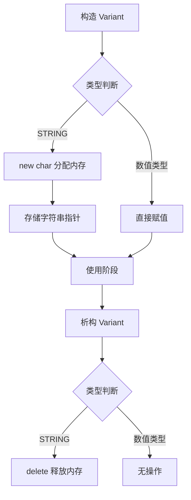

> [!abstract] 联合体
> 联合体是一种特殊的数据结构，它允许在相同的内存位置存储不同的数据类型。其核心特征是==所有成员共享同一块内存空间==，因此在任意时刻，联合体只能有效地保存其中一个成员的值。

# 1. 内存模型

联合体常被比作一个“单选盒子”。虽然它定义了多种类型的成员，但在物理内存上，它们是重叠的。修改其中一个成员会直接覆盖其他成员的值。

联合体的大小等于其==最大成员的大小==（在某些情况下需考虑内存对齐）。

```cpp
union Data {
    int i;
    float f;
    char str[20];
};
```

对于上述 `Data` 联合体，其内存布局如下：

1. **成员分析**
- `int i`: 通常占 **4 字节**。
- `float f`: 通常占 **4 字节**。
- `char str[20]`: 占 **20 字节**。

1. **内存大小计算**
由于 `str[20]` 是最大的成员，联合体的总大小至少为 20 字节。由于 20 是 4（`int` 和 `float` 的对齐要求）的倍数，因此不需要额外的内存填充（Padding）。故：**总大小 = 20 字节**。

2. **内存布局图示**

起始地址通常用 `0x00` 表示。请注意，无论你给哪个变量赋值，它们都从“字节 0”开始覆盖。

```text
地址偏移 (Bytes)
+----+----+----+----+----+----+----+----+ ...... +----+----+----+----+
| 0  | 1  | 2  | 3  | 4  | 5  | 6  | 7  |        | 16 | 17 | 18 | 19 |
+----+----+----+----+----+----+----+----+ ...... +----+----+----+----+
^                   ^                                               ^
|                   |                                               |
+-- int i (4字节) --+                                               |
|                   |                                               |
+-- float f(4字节) -+                                               |
|                                                                   |
+----------------------- char str[20] (20字节) ----------------------+

[所有成员起始地址相同：&i == &f == &str]
```

> [!info] 结构体与联合体的区别
> - **Struct（结构体）**：所有成员拥有独立的内存空间，大小为所有成员大小之和（含内存对齐时的填充）。
> - **Union（联合体）**：所有成员共享同一内存空间，大小为最大成员的大小。
>
> ```cpp
> struct StructData { int i; float f; }; // sizeof = 8+ (独立存储)
> union UnionData { int i; float f; };   // sizeof = 4  (共享存储)
> ```

---

# 2. 基本语法与基本应用

## 2.1 定义与访问

联合体的定义方式与结构体类似，使用 `union` 关键字。

```cpp
#include <iostream>
#include <cstring> // for strcpy

union MagicBox {
    int number;
    float decimal;
    char text[20];
};

int main() {
    MagicBox box;
    
    // 1. 存储整数
    box.number = 100;
    std::cout << "当前存储整数: " << box.number << std::endl;
    
    // 2. 存储浮点数 (覆盖了 number)
    box.decimal = 3.14f;
    std::cout << "当前存储浮点数: " << box.decimal << std::endl;
    // 此时读取 box.number 是未定义行为
    
    // 3. 存储字符串 (覆盖了 decimal)
    std::strcpy(box.text, "Hello");
    std::cout << "当前存储字符串: " << box.text << std::endl;
    
    std::cout << "联合体大小: " << sizeof(MagicBox) << " 字节" << std::endl;
    return 0;
}
```

> [!warning] 访问风险提示：**未定义行为**
> 在联合体中，写入成员 A 后读取成员 B 属于==未定义行为==，除非 B 的字节模式恰好是 A 的有效表示。编译器不会阻止你这样做，但结果是不可预测的。必须由程序员手动跟踪当前有效的成员。

---

# 3. 现代 C++ 中的联合体

在 C++11 及以后的标准中，联合体获得了更强大的能力，允许包含构造函数、析构函数以及复杂类型的成员（需手动管理生命周期）。

## 3.1 含有成员函数的联合体

```cpp
#include <string>

union ModernData {
    int integer;
    float floating;
    char* string_ptr;
    
    // C++11 允许定义构造函数
    ModernData() : integer(0) {} 
    
    // 析构函数
    ~ModernData() {}
};
```

## 3.2 限制与约束

虽然现代 C++ 放宽了限制，但联合体仍有以下约束：
- 不能含有虚函数。
- 不能含有引用类型的成员。
- 如果成员有非平凡的构造函数/析构函数，联合体必须显式定义对应的构造/析构函数并手动调用。

---

# 4. 实战应用：类型安全的变体类型

联合体最典型的应用是实现“变体类型”或“带标签的联合体”。通过结合 `enum` 和 `union`，可以创建一个既能存储多种类型，又能记住当前存储类型的对象。

## 4.1 设计思路

我们需要两个组件：
1. **状态标签**：使用枚举记录当前存储的数据类型。
2. **数据存储**：使用联合体存储实际数据。

## 4.2 完整实现代码

下面实现了一个简化版的 `Variant` 类，演示如何安全地使用联合体。

```cpp
#include <iostream>
#include <cstring>
#include <stdexcept>

class Variant {
private:
    // 1. 定义类型标签
    enum class Type { INT, FLOAT, STRING } type;
    
    // 2. 定义匿名联合体存储数据
    union {
        int i;
        float f;
        char* s;
    };

public:
    // 构造函数：整数
    Variant(int value) : type(Type::INT), i(value) {}
    
    // 构造函数：浮点数
    Variant(float value) : type(Type::FLOAT), f(value) {}
    
    // 构造函数：字符串 (需要分配内存)
    Variant(const char* value) : type(Type::STRING) {
        s = new char[std::strlen(value) + 1];
        std::strcpy(s, value);
    }
    
    // 析构函数：处理资源释放
    ~Variant() {
        if (type == Type::STRING && s != nullptr) {
            delete[] s;
            s = nullptr;
        }
    }
    
    // 获取当前类型
    Type getType() const { return type; }
    
    // 安全取值：整数
    int getInt() const { 
        if (type == Type::INT) return i;
        throw std::runtime_error("Variant does not hold an integer");
    }
    
    // 安全取值：浮点数
    float getFloat() const {
        if (type == Type::FLOAT) return f;
        throw std::runtime_error("Variant does not hold a float");
    }
    
    // 安全取值：字符串
    const char* getString() const {
        if (type == Type::STRING) return s;
        throw std::runtime_error("Variant does not hold a string");
    }
};

int main() {
    Variant v1(42);
    Variant v2(3.14f);
    Variant v3("Hello Obsidian");
    
    std::cout << "v1 (Int): " << v1.getInt() << std::endl;
    std::cout << "v2 (Float): " << v2.getFloat() << std::endl;
    std::cout << "v3 (String): " << v3.getString() << std::endl;
    
    return 0;
}
```

## 4.3 生命周期管理流程

使用联合体管理动态内存（如 `char*`）时，生命周期管理至关重要。以下是 `Variant` 处理字符串时的内存操作流程：



> [!tip] 推荐：使用 std::variant
> 在现代 C++ (C++17及以上) 开发中，标准库提供了 `std::variant`。它是类型安全的、无需手动管理生命周期的联合体实现。除非有特殊限制（如嵌入式开发或旧标准兼容），否则应优先使用 `std::variant` 而非裸联合体。
