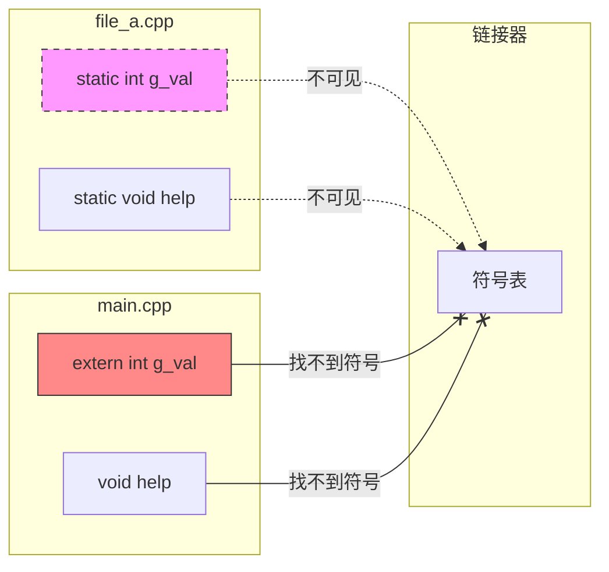
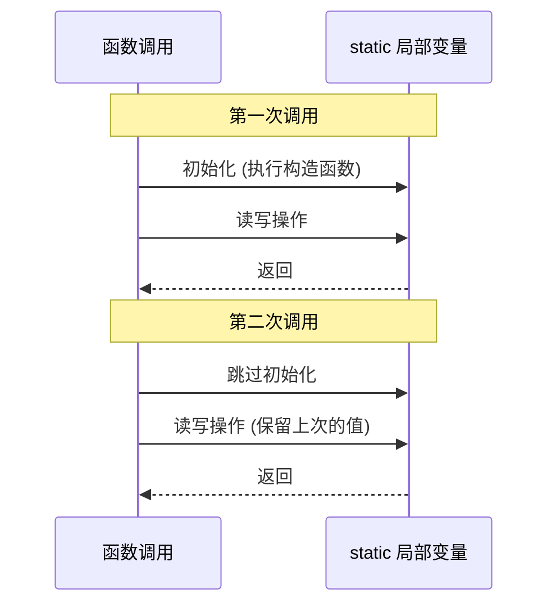
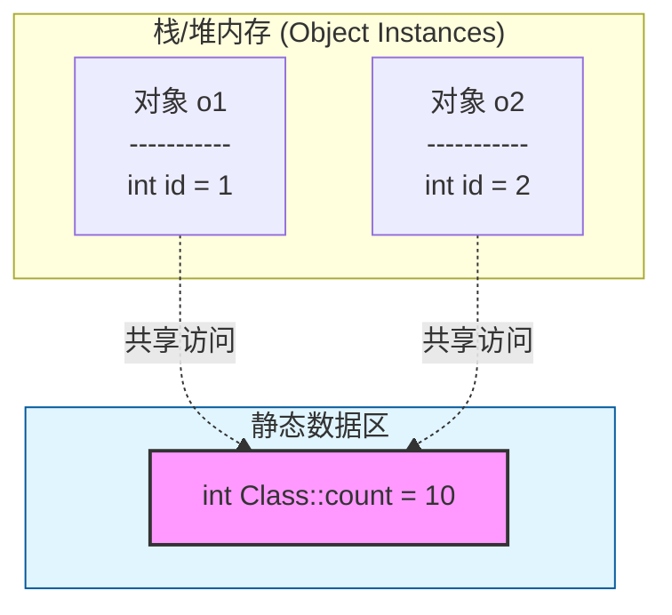

# 1. static 关键字全景图

`static` 是 C++ 中语义最重载的关键字之一。它的含义完全取决于它出现的位置（上下文）。先用一张图来建立全局认知：


---

# 2. 全局/命名空间作用域：控制可见性

当 `static` 用于全局变量、自由函数或匿名命名空间时，其核心语义是**内部链接**。

## 2.1 核心机制

这意味着该符号（变量或函数名）只在当前的**翻译单元**（.cpp 文件）内可见，链接器在链接其他 .cpp 文件时无法看到它。



比如：

```cpp
// file_a.cpp
static int counter = 0;          // 仅在 file_a.cpp 内可见
static void helper() { ... }     // 仅在 file_a.cpp 内可见

// file_b.cpp
extern int counter;              // ❌ 链接错误！找不到这个符号
```

## 2.2 实践中的用法

**用途**：隐藏实现细节，防止命名空间污染。

```cpp
// file_a.cpp
static int g_connection_count = 0;  // 仅限本文件使用

// 内部辅助函数，外部无需知晓
static void log_internal(const char* msg) {
    // ...
}

void public_api() {
    log_internal("API called");
}
```

> [!tip] 现代 C++ 替代方案：匿名命名空间
> 在 C++ 中，更推荐使用**匿名命名空间**来实现内部链接，因为它不仅适用于变量和函数，还适用于类型（类/结构体）。

```cpp
// 推荐：现代 C++ 写法
namespace {
    // 这个命名空间内的所有内容都具有内部链接
    int g_connection_count = 0;
    
    class InternalHelper { // static 无法修饰类，但匿名命名空间可以
        // ...
    };
}
```

---

# 3. 函数作用域：控制生命周期

当 `static` 用于函数内部的局部变量时，其核心语义是**静态存储期**。

## 3.1 核心机制

- **生命周期**：变量在程序启动时分配内存（或第一次调用时），直到程序结束才释放。不像普通局部变量那样随函数调用结束而销毁。
- **作用域**：仍然局限于函数内部，外部无法直接访问。
- **初始化**：只在第一次执行到该定义语句时初始化一次。



## 3.2 经典应用：单例模式

这是 C++11 起最推荐的懒汉式单例写法，因为**Magic Statics**（魔法静态变量）特性保证了线程安全。

```cpp
class Config {
public:
    // 获取单例引用
    static Config& get_instance() {
        // C++11 保证：
        // 1. 多线程并发进入时，只有一个线程执行初始化
        // 2. 编译器会插入隐式锁，无需手动加锁
        static Config instance; 
        return instance;
    }

    // 禁止拷贝和赋值
    Config(const Config&) = delete;
    Config& operator=(const Config&) = delete;

private:
    Config() { /* 加载配置文件 */ }
    ~Config() = default;
};

// 使用
Config& cfg = Config::get_instance();
```

> [!warning] 静态初始化顺序灾难
> 全局静态变量（跨文件）的初始化顺序是不确定的。如果 `A.cpp` 的全局变量 `a` 依赖 `B.cpp` 的全局变量 `b`，可能会在 `b` 初始化前就访问 `b`。
> 
> **解决方案**：使用**函数内部的局部静态变量**（如上面的单例模式）。局部静态变量在第一次调用函数时初始化，从而将顺序控制在了函数调用时刻。

---

# 4. 类作用域：控制归属权

当 `static` 用于类成员时，其核心语义是**属于类而非对象**。

## 4.1 静态数据成员

静态数据成员在内存中只有一份副本，被该类的所有对象共享。

### 4.1.1 内存布局示意



### 4.1.2 定义与声明

**必须遵守“声明在头文件，定义在源文件”的原则**（C++17 之前）。

```cpp
// MyClass.h
class MyClass {
public:
    static int total_count; // 声明
};

// MyClass.cpp
// 必须在类外定义并分配内存（除非是 const 整型且在类内初始化）
int MyClass::total_count = 0; 
```

**C++17 新特性：`inline static`**，即允许直接在类内定义静态成员，无需在 .cpp 中单独定义，极大简化了代码。

```cpp
class MyClass {
public:
    // C++17: 声明即定义，链接器会自动去重
    inline static int total_count = 0; 
    inline static std::string name = "Default";
};
```

## 4.2 静态成员函数

静态成员函数没有 `this` 指针。

- **可访问**：只能访问**静态数据成员**或**静态成员函数**。
- **不可访问**：非静态成员（非静态成员属于具体对象，没有 `this` 无法知道访问哪个对象的成员）。
- **调用方式**：可以通过类名直接调用，也可以通过对象调用（但不推荐）。

```cpp
class MathUtils {
public:
    static const double PI = 3.14159;
    
    // 静态函数：工具函数，不依赖对象状态
    static double square(double x) {
        return x * x;
    }
    
    // 错误示例：静态函数不能访问非静态成员
    // static double addPI(double x) {
    //     return x + this->value; // ❌ 编译错误：没有 this
    // }
    
    // 错误示例：静态函数不能是 const 或 virtual
    // static void foo() const { } // ❌ const 修饰的是 this 指针
    // virtual static void bar() { } // ❌ virtual 需要对象实例
};

// 调用
double val = MathUtils::square(5.0); // 推荐
MathUtils obj;
obj.square(5.0); // 合法但不直观
```

---

# 5. 常见易混淆点与总结

## 5.1 全局 static vs 匿名命名空间

| 特性 | `static` (全局) | 匿名命名空间 `namespace {}` |
| :--- | :--- | :--- |
| **链接性** | 内部链接 | 内部链接 |
| **适用范围** | 仅变量、函数 | 变量、函数、类、模板 |
| **推荐程度** | 兼容 C (可用) | **C++ 首选** |

## 5.2 静态局部变量的线程安全

- **C++11 之前**：局部静态变量的初始化不是线程安全的，双重检查锁是标准做法。
- **C++11 及以后**：标准规定编译器必须保证局部静态变量初始化的**线程安全**。因此，使用局部静态变量实现单例是简单且高效的最佳实践。

## 5.3 `static` 与 `const` 的组合

1.  **`static const int`**：类内初始化，等同于编译期常量。
2.  **`static constexpr`**：C++11 起，推荐用于编译期常量，适用范围更广。
3.  **`const` 成员函数**：表示不修改 `this` 指向的对象状态。这与 `static` 是正交的概念（static 没有 this）。
