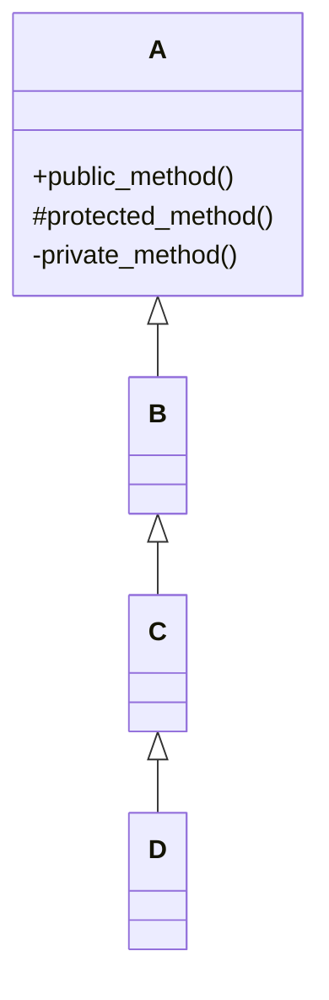
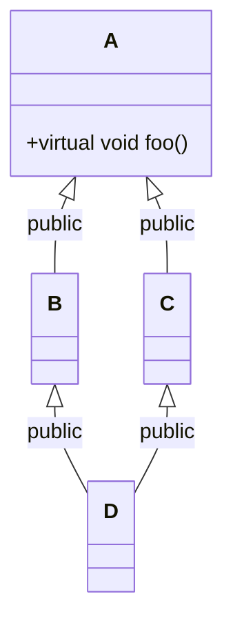
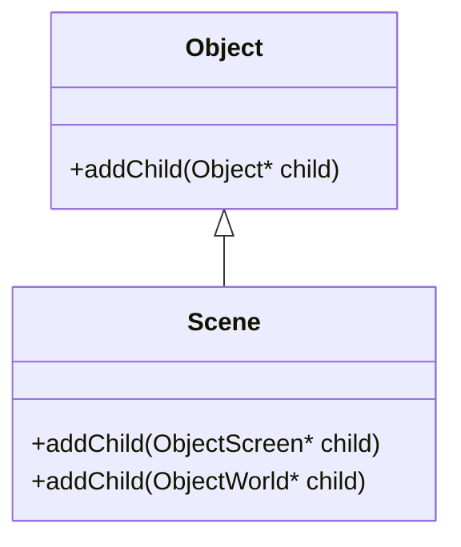
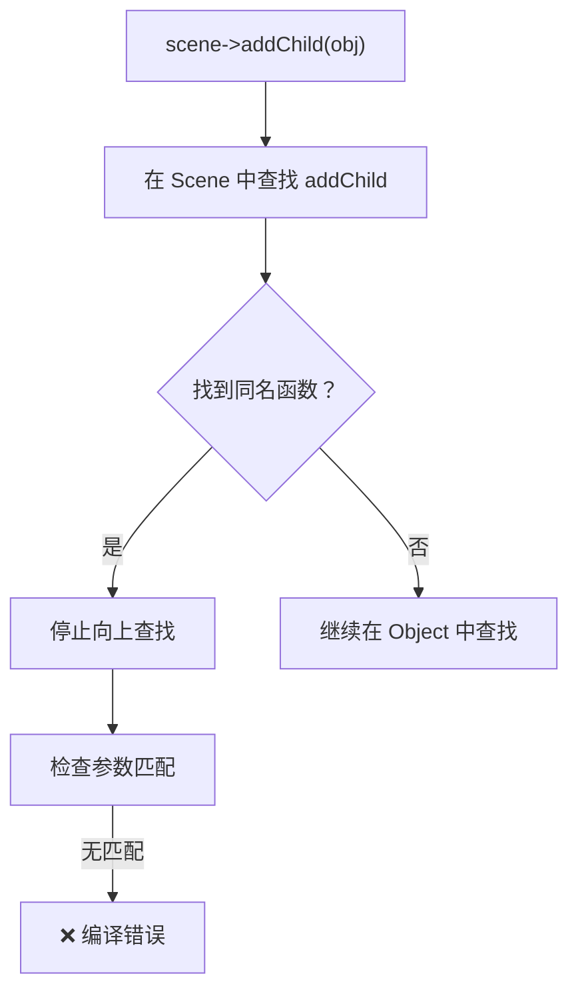
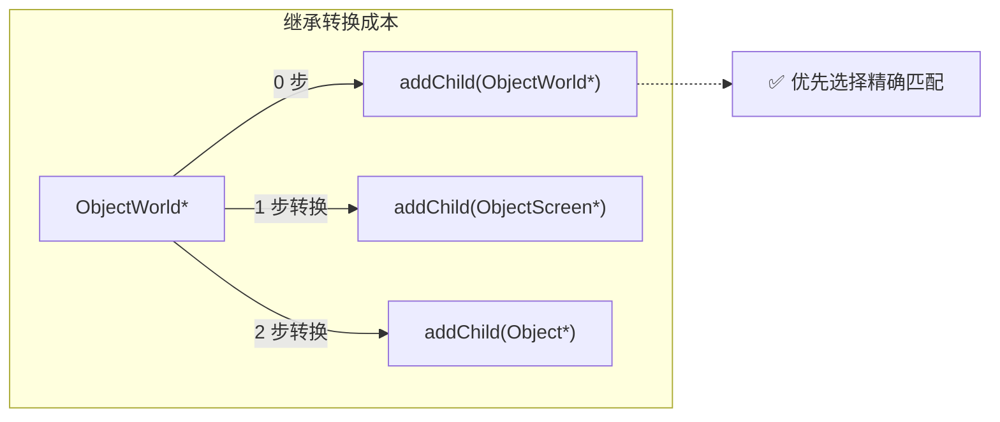
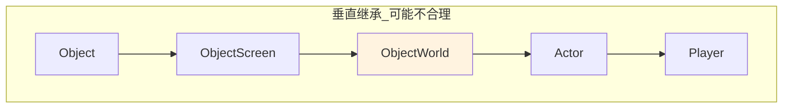
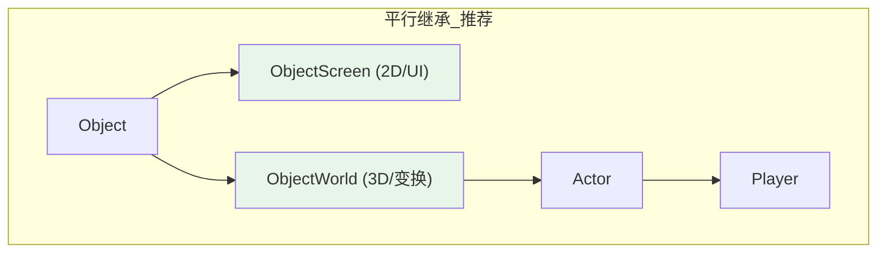

# 1. 继承基础与访问控制

## 1.1 单继承链中的访问权限

在 `public` 继承体系下，派生类对基类成员的访问权限遵循严格的层级规则。以下以四层继承链为例说明：



> [!note] 核心原则
> - `private` 成员：**永远**仅在本类内部可见，无论继承多少层均不可访问
> - `protected` 成员：可被所有派生类访问，但**外部代码**（通过对象）不可直接访问
> - `public` 成员：在 `public` 继承链中保持公开，外部可通过任意派生类对象调用

## 1.2 访问权限对照表

以下表格展示各层级类对祖先类成员的访问能力（假设均为 `public` 继承，且讨论非 `friend`、非静态的普通成员）：

| 成员在祖先类中的级别 | B 能访问 | C 能访问 | D 能访问 | 外部代码能否通过对象访问 |
|---------------------|----------|----------|----------|-------------------------|
| A 的 `public` 成员   | ✅       | ✅       | ✅       | ✅                      |
| A 的 `protected` 成员 | ✅       | ✅       | ✅       | ❌                      |
| A 的 `private` 成员   | ❌       | ❌       | ❌       | ❌                      |
| B 的 `public` 成员   | —        | ✅       | ✅       | ✅                      |
| B 的 `protected` 成员 | —        | ✅       | ✅       | ❌                      |
| B 的 `private` 成员   | —        | ❌       | ❌       | ❌                      |
| C 的 `public` 成员   | —        | —        | ✅       | ✅                      |
| C 的 `protected` 成员 | —        | —        | ✅       | ❌                      |
| C 的 `private` 成员   | —        | —        | ❌       | ❌                      |

> [!warning] 易错点
> 1. `protected` 成员可被派生类内部代码访问，但**不能**通过派生类对象在外部访问：
>    ```cpp
>    class Base { protected: void foo() {} };
>    class Derived : public Base {};
>    
>    Derived d;
>    d.foo();  // ❌ 编译错误：foo() 是 protected
>    ```
> 2. 访问权限取决于**成员声明时的位置**，而非继承方式：
>    ```cpp
>    class Base { private: int x; };
>    class Derived : public Base { 
>        void test() { x = 1; }  // ❌ 仍不可访问，private 永远不可继承
>    };
>    ```

## 1.3 子类不能继承的父类函数

| 函数类型 | 描述 |
| :--- | :--- |
| **构造函数** | 子类不能继承父类的构造函数 |
| **析构函数** | 子类不能继承父类的析构函数 |
| **拷贝构造函数** | 子类不能继承父类的拷贝构造函数 |
| **赋值运算符** | 子类不能继承父类的赋值运算符 |
| **私有成员函数** | 子类不能继承父类的私有成员函数 |

---

# 2. 多重继承与菱形继承

## 2.1 简单多重继承

C++ 支持一个类同时继承多个基类，语法使用逗号分隔：

```cpp
class C : public A, public B {
    // C 同时拥有 A 和 B 的 public/protected 成员
};
```

### 2.1.1 同名成员处理

若多个基类存在同名成员，需使用**类名限定**消除二义性：

```cpp
class A { public: void foo() { /* A版 */ } };
class B { public: void foo() { /* B版 */ } };
class C : public A, public B {};

C c;
// c.foo();        // ❌ 二义性：不知道调用 A::foo 还是 B::foo
c.A::foo();        // ✅ 明确调用 A 版本
c.B::foo();        // ✅ 明确调用 B 版本
```

## 2.2 菱形继承问题

当多个基类共同继承自同一个祖先类时，形成"菱形继承"结构：



### 2.2.1 核心问题

| 问题类型 | 具体表现 | 后果 |
|---------|---------|--------|
| **数据冗余** | `D` 对象中包含**两份独立的 `A` 子对象**（分别来自 `B` 和 `C`） | 内存浪费，状态不一致风险 |
| **二义性** | `D` 同时继承 `B::foo()` 和 `C::foo()`，编译器无法确定调用路径 | 编译错误或意外行为 |

```cpp
D d;
// d.foo();        // ❌ 二义性：通过 B 还是 C 路径调用？
// d.A::foo();     // ❌ 仍有二义性：存在两份 A 子对象
```

## 2.3 虚继承解决方案

使用 `virtual` 关键字声明虚继承，确保公共基类在最终派生类中**仅存在一份实例**：

```cpp
class A {
public:
    virtual void foo() { /* A 的实现 */ }
};

class B : virtual public A {  // ✅ 虚继承
public:
    void foo() override { /* B 的重写 */ }
};

class C : virtual public A {  // ✅ 虚继承
public:
    void foo() override { /* C 的重写 */ }
};

class D : public B, public C {
public:
    // 最派生类需负责初始化虚基类，并解决剩余二义性
    void foo() override {
        B::foo();  // 明确选择调用路径
    }
};
```

### 2.3.1 其他消除二义性的方法

| 方法 | 代码示例 | 适用场景 |
|-----|---------|---------|
| **`using` 声明** | `using B::foo;` | 明确指定使用某个基类版本 |
| **调用时限定** | `d.B::foo();` | 临时调用，不修改类定义 |
| **最派生类重写** | 在 `D` 中重写 `foo()` | 需要提供新逻辑或统一接口 |

> [!warning] 虚继承的代价
> - 📦 **对象布局复杂**：虚基类指针引入额外间接层
> - ⏱️ **构造顺序特殊**：虚基类由**最派生类**直接初始化，而非直接父类
> - 🔧 **设计约束**：通常仅当"公共基类必须唯一"时使用，优先用组合或接口继承替代

---

# 3. 继承中的构造函数

## 3.1 构造函数不继承原则

> [!abstract] 核心规则
> **构造函数是 C++ 中极少数不会被继承的成员之一**。派生类必须显式或隐式调用基类构造函数。

### 3.1.1 默认行为：自动调用默认构造函数

```cpp
class A {
public:
    A() { std::cout << "A 构造\n"; }
};

class B : public A {
    // 未定义构造函数
};

B b;  // 输出：A 构造
// 编译器自动生成 B() { A(); }
```

### 3.1.2 基类无默认构造函数时的处理

```cpp
class A {
public:
    A(int x) {}  // 仅带参构造，默认构造被隐式删除
};

class B : public A {
    // 未定义构造函数
};

// B b;  // ❌ 编译错误：无法调用 A()
```

✅ **正确做法**：在派生类构造函数的初始化列表中显式调用基类构造函数：

```cpp
class B : public A {
public:
    B(int x) : A(x) {}  // ✅ 显式传递参数
};

B b(10);  // 正常构造
```

## 3.2 C++11 `using` 继承构造函数

C++11 引入 `using` 声明，可将基类构造函数"引入"派生类作用域：

```cpp
class A {
public:
    A(int x) {}
    A(int x, float y) {}
    A(std::string s) {}
};

class B : public A {
public:
    using A::A;  // ✅ 继承 A 的所有构造函数
};

B b1(10);              // ✅ 调用 A(int)
B b2(10, 3.14f);       // ✅ 调用 A(int, float)
B b3("hello");         // ✅ 调用 A(string)
```

`using` vs 手写构造函数对比：

| 对比维度 | `using A::A` | 手写构造函数 |
|---------|-------------|-------------|
| **代码量** | ✅ 一行继承全部 | ❌ 需逐个重写 |
| **初始化派生类成员** | ❌ 仅默认初始化 | ✅ 可在初始化列表中赋值 |
| **添加额外逻辑** | ❌ 不支持 | ✅ 可在函数体中添加 |
| **适用场景** | 派生类仅简单扩展基类 | 派生类有独立成员或逻辑 |

关键差异示例：

```cpp
class A {
public:
    A(int x) : val(x) {}
private:
    int val;
};

class B : public A {
public:
    int extra;
    std::string name;
    
    // 方案 1: using 继承
    using A::A;  // extra 和 name 仅默认初始化，无法传参
};

class C : public A {
public:
    int extra;
    std::string name;
    
    // 方案 2: 手写构造，完整控制
    C(int x, int e, std::string n) 
        : A(x), extra(e), name(std::move(n)) {}
};

B b(10);           // extra=随机值, name=空
C c(10, 42, "sky"); // extra=42, name="sky" ✅
```

> [!note] 拷贝构造函数同样不继承
> ```cpp
> B b1(10);
> B b2 = b1;  // 编译器生成 B(const B&)，自动调用 A(const A&) 处理基类部分
> 
> // 若需自定义，必须显式调用基类拷贝构造：
> B(const B& other) : A(other), extra(other.extra) {}
> ```

---

# 4. 名称遮蔽与重载解析

> 后面以 [游戏开发](../../游戏开发/README.md) 为例。

## 4.1 名称遮蔽（Name Hiding）现象

> [!abstract] 核心规则
> C++ 编译器在派生类中查找成员函数时，**一旦找到同名函数即停止向上查找**，无论参数是否匹配。

### 4.1.1 问题复现



其中继承链是这样的：
- Scene -> Object
- ObjectWorld -> ObjectScene -> Object

```cpp
Scene* scene = new Scene();
Object* obj  = new Object();

scene->addChild(obj);  // ❌ 编译错误！
```

**错误原因**：
1. 编译器在 `Scene` 中找到 `addChild` 同名函数
2. 仅看到 `addChild(ObjectScreen*)` 和 `addChild(ObjectWorld*)`
3. **停止**向基类 `Object` 查找 `addChild(Object*)`
4. 参数不匹配 → 编译错误



## 4.2 `using` 声明解决名称遮蔽

在派生类中使用 `using` 将基类函数引入当前作用域，参与重载解析：

```cpp
class Scene : public Object {
public:
    using Object::addChild;  // ✅ 引入基类版本
    
    void addChild(ObjectScreen* child);
    void addChild(ObjectWorld* child);
};
```

### 4.2.1 重载集合变化

| 函数签名 | 来源 | 参与重载解析 |
|---------|------|-------------|
| `addChild(Object*)` | 基类 `Object`（via `using`） | ✅ |
| `addChild(ObjectScreen*)` | `Scene` 自身 | ✅ |
| `addChild(ObjectWorld*)` | `Scene` 自身 | ✅ |

```cpp
// 现在所有调用均合法
scene->addChild(obj);           // ✅ 匹配 Object*
scene->addChild(screenObj);     // ✅ 匹配 ObjectScreen*
scene->addChild(worldObj);      // ✅ 匹配 ObjectWorld*
```

## 4.3 垂直继承链下的重载解析规则

当存在 `Object → ObjectScreen → ObjectWorld` 的垂直继承时，`ObjectWorld*` 可隐式转换为 `ObjectScreen*` 或 `Object*`。调用时是否会产生二义性？

> [!success] 答案：不会。C++ 采用"最精确匹配"原则。



### 4.3.1 完整匹配对照表

| 传入参数类型 | 选择的重载 | 原因 |
|-------------|-----------|------|
| `Object*` | `addChild(Object*)` | 唯一精确匹配 |
| `ObjectScreen*` | `addChild(ObjectScreen*)` | 精确匹配 > 向上转换到 `Object*` |
| `ObjectWorld*` | `addChild(ObjectWorld*)` | 精确匹配 > 转换到 `ObjectScreen*` 或 `Object*` |

> [!note] 重载解析优先级规则
> 1. **精确匹配**（无需转换）优先级最高
> 2. 其次考虑**标准转换**（如派生类→基类指针）
> 3. 最后考虑**用户定义转换**
> 4. 若多个候选函数优先级相同 → 二义性错误

## 4.4 潜在逻辑陷阱

虽然语法上无二义性，但**语义逻辑**可能存在隐患：

```cpp
// 假设 ObjectWorld 继承自 ObjectScreen
void Scene::addChild(ObjectScreen* child) {
    // UI 布局逻辑
    registerToUIRenderer(child);
}

void Scene::addChild(ObjectWorld* child) {
    // 3D 世界逻辑
    registerToPhysicsEngine(child);
    // ⚠️ 注意：不会自动调用 ObjectScreen 版本！
}
```

若希望 `ObjectWorld` 对象同时执行 UI 逻辑，需**显式调用**：

```cpp
void Scene::addChild(ObjectWorld* child) {
    // 1. 先执行 Screen 级别逻辑（需显式转换）
    this->addChild(static_cast<ObjectScreen*>(child));
    
    // 2. 再执行 World 独有逻辑
    registerToPhysicsEngine(child);
}
```

> [!warning] 设计反思
> 若 `ObjectWorld` 需要同时具备 UI 和 3D 行为，可能意味着：
> - 继承关系设计不合理（垂直继承语义混乱）
> - 应考虑**组合**或**接口多继承**替代

---

# 5. 架构设计建议

## 5.1 垂直继承 vs 平行继承

### 5.1.1 当前设计的问题



**语义矛盾**：`ObjectWorld` 继承自 `ObjectScreen` 意味着"3D 世界物体是一个 UI 组件"，这通常不符合领域模型（例如：坦克不需要处理按钮点击）。

### 5.1.2 推荐：平行继承



**优势**：
- ✅ 语义清晰：2D 与 3D 对象职责分离
- ✅ 避免不必要的转换和逻辑耦合
- ✅ 重载解析更简单，减少二义性风险

## 5.2 组合优于继承原则

当需要代码复用时，优先考虑**组合（Composition）**而非继承：

```cpp
// ❌ 继承：语义可能混乱
class Player : public UIComponent, public PhysicsObject {};

// ✅ 组合：职责清晰，灵活可控
class Player {
private:
    UIComponent m_ui;        // 组合 UI 功能
    PhysicsObject m_physics; // 组合物理功能
    
public:
    void update(float dt) {
        m_ui.update(dt);
        m_physics.update(dt);
    }
};
```

| 对比维度 | 继承 | 组合 |
|---------|------|------|
| **语义关系** | is-a（是一个） | has-a（有一个） |
| **耦合度** | 高（编译时绑定） | 低（运行时可替换） |
| **灵活性** | 低（修改基类影响所有派生类） | 高（可独立替换组件） |
| **测试难度** | 高（需构造完整继承链） | 低（可单独测试组件） |

## 5.3 推荐代码模板

```cpp
class Scene : public Object {
public:
    // ✅ 解决名称遮蔽：引入基类重载
    using Object::addChild;
    
    // 🎨 处理 UI / 屏幕空间对象
    void addChild(ObjectScreen* child) {
        // Screen 特有逻辑
        registerToUIRenderer(child);
        // 调用基类通用逻辑
        Object::addChild(child);
    }
    
    // 🌍 处理 3D 世界对象
    void addChild(ObjectWorld* child) {
        // World 特有逻辑
        registerToPhysicsEngine(child);
        // 调用基类通用逻辑
        Object::addChild(child);
    }
};
```

> [!tip] 设计模式建议
> `Scene` 类可作为**路由器**：
> - 传入 `ObjectWorld*` → 走 3D 逻辑通道
> - 传入 `ObjectScreen*` → 走 UI 逻辑通道  
> - 传入普通 `Object*` → 退回基础逻辑
