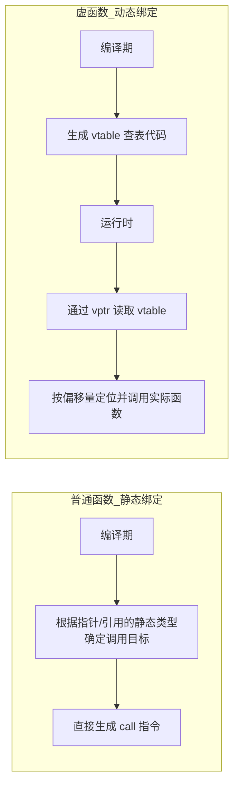
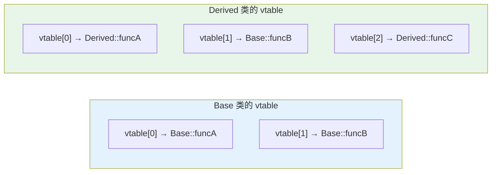
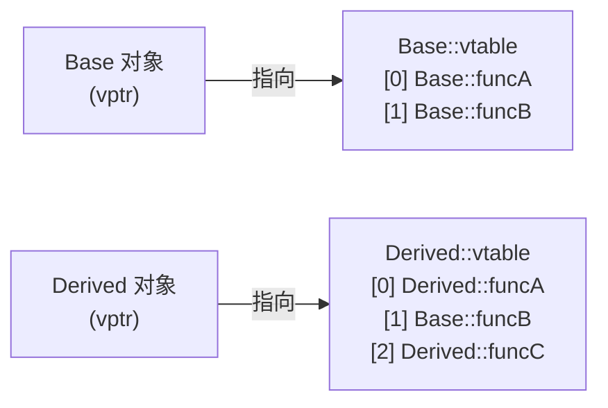
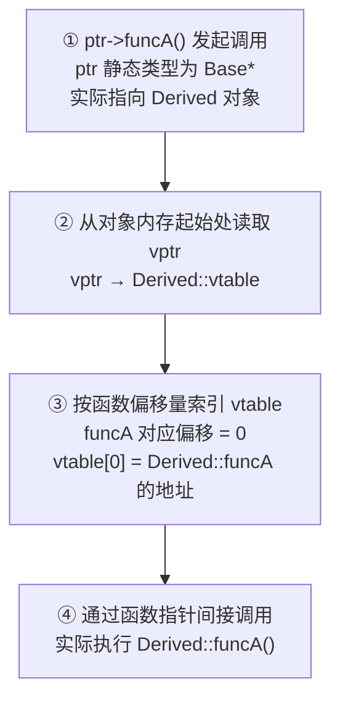
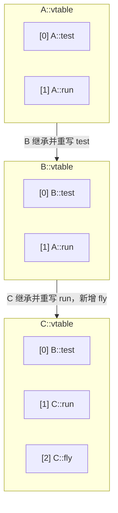
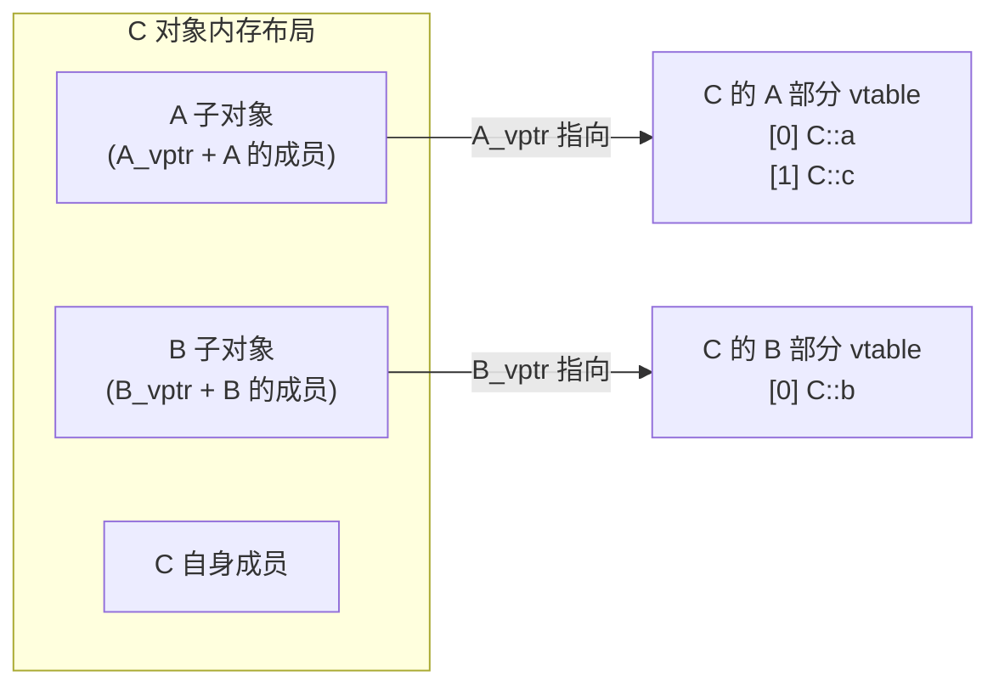

# 1. 虚函数基础

## 1.1 核心概念

> [!abstract] 定义
> **虚函数（Virtual Function）** 是 C++ 中用于实现**运行时多态**的机制。在基类中使用 `virtual` 关键字声明的成员函数，允许派生类重写（Override）该函数，从而根据**对象的实际类型**（而非指针/引用的静态类型）调用正确的函数版本。

### 1.1.1 关键特性

| 特性      | 说明                                                      |
| ------- | ------------------------------------------------------- |
| 🔹 声明位置 | 仅需在**首次声明**的基类中使用 `virtual` 关键字                         |
| 🔹 继承传递 | 一旦声明为虚函数，在**整个继承链**中始终保持虚函数性质                           |
| 🔹 重写规则 | 派生类重写时需保持**参数列表与 const 限定符完全一致**，返回类型支持**协变**（见 §4.1.2） |
| 🔹 动态绑定 | 调用目标推迟到**运行时**，通过虚函数表（vtable）查表确定                       |

### 1.1.2 基本语法与 override 关键字

```cpp
class Base {
public:
    virtual void show() { std::cout << "Base::show\n"; }  // ✅ 声明为虚函数
    virtual ~Base() = default;  // ✅ 虚析构（详见 §3.2）
};

class Derived : public Base {
public:
    // ✅ override：让编译器验证签名是否与基类匹配，并明确重写意图
    void show() override { std::cout << "Derived::show\n"; }
    // ⚠️ 即使不写 virtual，show() 在继承链中仍是虚函数
};
```

> [!note] `override` 关键字
> 在派生类中重写虚函数时，**强烈建议**显式使用 `override` 关键字：
> - ✅ **可读性**：明确表达"这是有意重写"的设计意图
> - ✅ **安全性**：签名不匹配时编译器立即报错，防止意外创建同名的隐藏（hide）函数
> ```cpp
> void show() override;  // ✅ 推荐：编译器验证重写的正确性
> void show();           // ⚠️ 可行但危险：拼写错误会静默创建隐藏函数，多态失效
> ```

## 1.2 虚函数与普通函数的区别

### 1.2.1 绑定时机对比



### 1.2.2 代码行为对比实验

- 场景 1：普通函数（静态绑定）

```cpp
class Base {
public:
    void show() { std::cout << "Base\n"; }
};
class Derived : public Base {
public:
    void show() { std::cout << "Derived\n"; }  // 隐藏（hide）基类函数，而非重写
};

Base* ptr = new Derived();
ptr->show();  // 输出: Base ❌ 绑定依据是 ptr 的静态类型 Base*
```

- 场景 2：虚函数（动态绑定）

```cpp
class Base {
public:
    virtual void show() { std::cout << "Base\n"; }
};
class Derived : public Base {
public:
    void show() override { std::cout << "Derived\n"; }
};

Base* ptr = new Derived();
ptr->show();  // 输出: Derived ✅ 绑定依据是对象的实际类型 Derived
```

> [!warning] 核心差异
> - **普通函数（隐藏）**：绑定依据是**指针/引用的静态类型**，编译期确定，无法实现多态
> - **虚函数（重写）**：绑定依据是**对象的运行时实际类型**，通过 vtable 动态查表

---

# 2. 虚函数底层机制

## 2.1 vtable(虚函数表)

> [!abstract] vtable 定义
> **虚函数表（Virtual Table，vtable）** 是编译器为**每个包含虚函数的类**生成的**函数指针数组**，存储该类所有虚函数的地址。==vtable 是类级别的结构（每个类只有一份，由所有对象共享），在编译期生成，存储于程序的只读数据段。==

以下示例展示了 `Base` 与 `Derived` 类各自的 vtable 布局：

```cpp
class Base {
public:
    virtual void funcA();  // vtable[0]
    virtual void funcB();  // vtable[1]
    void normalFunc();     // 普通函数，不进入 vtable
};

class Derived : public Base {
public:
    void funcA() override; // 重写：Derived::vtable[0] 更新为 Derived::funcA
    // funcB 未重写：Derived::vtable[1] 继承 Base::funcB
    virtual void funcC();  // 新增虚函数：Derived::vtable[2]
};
```



> Base 类的 vtable 由所有 Base 对象共享；Derived 类的 vtable 由所有 Derived 对象共享。

## 2.2 vptr(虚函数表指针)

> [!abstract] vptr 定义
> **虚函数表指针（Virtual Table Pointer，vptr）** 是编译器在**每个含虚函数的类对象**内隐式插入的指针，指向该对象所属类的 vtable。==vptr 是对象级别的结构（每个对象各自独立持有），在构造函数中自动初始化。==

| 特性 | 说明 |
|------|------|
| 📍 存储位置 | 每个对象的内存布局中（通常位于**对象起始处**，与具体实现相关） |
| 🔗 指向目标 | 对象所属类的 vtable |
| 🔄 初始化时机 | 在**构造函数执行期间**，按基类→派生类的顺序依次设置 |
| 💾 内存开销 | 4 字节（32 位系统）或 8 字节（64 位系统），每个对象一份 |

```cpp
// 对象内存布局示意（简化，以 64 位系统为例）
class Base {
    // [隐式] vptr：8 字节，指向 Base::vtable
    int data;   // 4 字节
    // 4 字节 padding（内存对齐）
};
// sizeof(Base) = 16 字节：[vptr(8B)][data(4B)][padding(4B)]
```

> [!note] vtable 与 vptr 的本质区别
> - **vtable**：类级别，整个程序中每个类只有一份，**编译期静态生成**，存于只读数据段。
> - **vptr**：对象级别，每个对象实例各有一份，**运行时**由构造函数动态初始化。

## 2.3 虚函数调用的运行时执行流程

以 [vtable(虚函数表)](##\ 2.1\ vtable(虚函数表)) 中的 `Base`/`Derived` 为例，分析 `ptr->funcA()` 的完整执行过程：

```cpp
Base* ptr = new Derived();
ptr->funcA();  // 静态类型 Base*，实际指向 Derived 对象 → 动态绑定至 Derived::funcA
```

**对象实例通过 vptr 与各自所属类的 vtable 的指向关系：**



**调用步骤解析**：



> [!question] 为什么需要查表？
> 编译期编译器只知道 `ptr` 的静态类型是 `Base*`，无法预知运行时它指向的是 `Base` 还是 `Derived` 对象。vtable 机制将"调用哪个函数"的决策推迟到运行时，实现**多态**。

## 2.4 继承链中虚函数表的演化规律

```cpp
class A {
public:
    virtual void test() { /* A::test */ }  // vtable[0]
    virtual void run()  { /* A::run  */ }  // vtable[1]
};

class B : public A {
public:
    void test() override { /* B::test */ }  // 重写：vtable[0] 更新为 B::test
    // run() 未重写：vtable[1] 继承 A::run
};

class C : public B {
public:
    void run()  override { /* C::run  */ }  // 重写：vtable[1] 更新为 C::run
    virtual void fly()   { /* C::fly  */ }  // 新增虚函数：vtable[2]
};
```



> [!tip] 运行时 vtable 查找的本质
> 虚函数调用并不存在"向上逐层搜索"的过程。编译器在编译期已将继承链各层的覆盖关系完整地填入每个类的 vtable，运行时只需**按偏移量直接取值**：
> ```cpp
> A* ptr = new C();
> ptr->test();  // 取 C::vtable[0] = B::test → 调用 B::test（C 未再次重写）
> ptr->run();   // 取 C::vtable[1] = C::run  → 调用 C::run（C 重写了）
> ```

---

# 3. 应用场景

## 3.1 多态接口设计

### 3.1.1 统一接口，多样实现

```cpp
// 抽象基类：定义接口规范
class Shape {
public:
    virtual double area() const = 0;  // 纯虚函数，强制派生类实现（详见 §3.3）
    virtual void draw() const {
        std::cout << "Drawing shape\n";
    }
    virtual ~Shape() = default;  // ✅ 虚析构（详见 §3.2）
};

// 具体实现 1
class Circle : public Shape {
public:
    explicit Circle(double r) : radius(r) {}
    double area() const override { return 3.14159 * radius * radius; }
private:
    double radius;
};

// 具体实现 2
class Rectangle : public Shape {
public:
    Rectangle(double w, double h) : width(w), height(h) {}
    double area() const override { return width * height; }
private:
    double width, height;
};

// 多态调用：同一接口，不同行为，动态绑定
void printArea(const Shape& s) {
    std::cout << "Area: " << s.area() << "\n";  // ✅ 运行时动态绑定
}

printArea(Circle(5.0));      // 输出: Area: 78.539...
printArea(Rectangle(4, 6));  // 输出: Area: 24
```

### 3.1.2 容器中的多态对象管理

```cpp
// ✅ 正确：存储基类智能指针，而非对象本身
std::vector<std::unique_ptr<Shape>> shapes;
shapes.push_back(std::make_unique<Circle>(3.0));
shapes.push_back(std::make_unique<Rectangle>(2, 8));

for (const auto& shape : shapes) {
    shape->draw();  // ✅ 动态绑定：按实际类型分发调用
}
```

> [!warning] 常见错误：对象切片（Object Slicing）
> ```cpp
> std::vector<Shape> shapes;           // ❌ 存储对象本身
> shapes.push_back(Circle(3.0));       // Circle 特有成员（radius）被截断
> // shapes[0].area() 调用的是 Shape 的版本，多态完全失效
> ```
> **根本原因**：将派生类对象赋值给基类对象时，派生类特有的成员数据被"切掉"，vptr 也被替换为基类的 vptr，多态语义完全丢失。

## 3.2 虚析构函数：资源安全释放

### 3.2.1 典型问题示例

非虚析构导致的资源泄漏：

```cpp
class Base {
public:
    Base()  { data = new int[1000]; }
    ~Base() { delete[] data; }   // ❌ 非虚析构
protected:
    int* data;
};

class Derived : public Base {
public:
    Derived()   { extra = new double[500]; }
    ~Derived()  { delete[] extra; }  // ✅ 存在，但在多态场景下永远不会被调用
private:
    double* extra;
};

int main() {
    Base* ptr = new Derived();
    delete ptr;  // ❌ 静态绑定：仅调用 ~Base()，Derived::extra 内存泄漏
}
```

### 3.2.2 解决方案

将基类析构函数声明为 virtual：

```cpp
class Base {
public:
    Base()          { data = new int[1000]; }
    virtual ~Base() { delete[] data; }  // ✅ 虚析构：触发动态绑定
protected:
    int* data;
};

class Derived : public Base {
public:
    Derived()           { extra = new double[500]; }
    ~Derived() override { delete[] extra; }  // ✅ 自动成为虚析构函数
private:
    double* extra;
};

int main() {
    Base* ptr = new Derived();
    delete ptr;
    // ✅ 动态绑定：先调用 ~Derived()，再自动调用 ~Base()
}
// 析构顺序（若加 cout 输出）：
// ~Derived()
// ~Base()
```

### 3.2.3 构造与析构期间的虚函数行为

> [!note] 特殊规则：构造/析构期间虚函数退化为静态绑定（虚函数**不会**多态）
> 在**构造函数或析构函数**执行期间调用虚函数，调用会**退化为静态绑定**，绑定到当前正在执行的构造/析构函数所属的类。

```cpp
class Base {
public:
    virtual void log() { std::cout << "Base::log\n"; }
    virtual ~Base() {
        log();  // ⚠️ 此处始终调用 Base::log，即使对象实际类型是 Derived
    }
};

class Derived : public Base {
public:
    void log() override { std::cout << "Derived::log\n"; }
    ~Derived() override {
        log();  // ✅ 此处仍调用 Derived::log（Derived 部分尚未销毁）
    }
};

// delete（ptr 指向 Derived 对象）的析构执行顺序：
// 1. ~Derived() 执行 → log() → Derived::log（输出 "Derived::log"）
// 2. ~Base()    执行 → log() → Base::log   （输出 "Base::log"）
```

> [!note] 静态绑定的原因
> C++ 标准要求析构按**派生类→基类**的顺序执行。当 `Base::~Base()` 开始执行时，编译器已将对象的 vptr **重置为指向 `Base::vtable`**（因为 `Derived` 部分已析构完毕），此时虚函数调用通过 vptr 只能找到 `Base` 的实现，等价于静态绑定。

### 3.2.4 虚析构函数使用准则

| 场景 | 是否需要虚析构 | 原因 |
|------|:------------:|------|
| ✅ 类中存在任意虚函数 | **必须** | 该类有多态使用场景，必须支持通过基类指针安全删除派生类对象 |
| ✅ 通过基类指针管理派生类对象 | **必须** | 避免派生类资源泄漏 |
| ❌ 类声明为 `final`（不可继承） | 可选 | 无派生类，无多态删除场景 |
| ❌ 纯值语义使用（不通过指针/引用多态） | 可选 | 无多态删除需求 |

> [!success] 黄金法则
> ==只要类中声明了任意虚函数，立即将析构函数也声明为 `virtual`。== 这是 C++ Core Guidelines 的强制建议（C.35）。

## 3.3 纯虚函数与抽象类

### 3.3.1 纯虚函数的语法与语义

```cpp
class Interface {
public:
    virtual void requiredMethod() = 0;  // ✅ 纯虚函数：= 0 表示无默认实现
    virtual ~Interface() = default;
};
```

| 特性 | 说明 |
|------|------|
| 🔹 声明语法 | `virtual 返回类型 函数名(参数列表) = 0;` |
| 🔹 强制重写 | 派生类**必须重写所有**纯虚函数，否则自身也成为抽象类，无法实例化 |
| 🔹 可有定义 | 纯虚函数**允许提供函数体**（须在类外定义），作为默认实现供派生类显式调用 |

```cpp
// 纯虚函数的函数体必须在类外定义
class Base {
public:
    virtual void init() = 0;
};

void Base::init() {  // ✅ 提供默认实现（类外定义）
    std::cout << "Base 初始化逻辑\n";
}

class Derived : public Base {
public:
    void init() override {
        Base::init();  // ✅ 显式调用纯虚基类的实现（语法：基类名::函数名）
        std::cout << "Derived 扩展逻辑\n";
    }
};
```

### 3.3.2 抽象类

> [!abstract] 定义
> **包含至少一个纯虚函数的类称为抽象类（Abstract Class）**，具有以下特性：
> - ❌ **不能直接实例化**：`AbstractClass obj;` → 编译错误
> - ✅ **可作为指针/引用类型**：`AbstractClass* ptr;` → 合法
> - ✅ **强制接口规范**：所有派生类必须实现全部纯虚函数，否则仍是抽象类

```cpp
class Device {
public:
    virtual void connect()    = 0;
    virtual void disconnect() = 0;
    virtual ~Device() = default;
};

// ✅ 完整实现：可以实例化
class USBDevice : public Device {
public:
    void connect()    override { /* USB 连接逻辑 */ }
    void disconnect() override { /* USB 断开逻辑 */ }
};

// ❌ 不完整实现：仍是抽象类，无法实例化
class PartialDevice : public Device {
public:
    void connect() override { /* 只实现了 connect */ }
    // disconnect() 未实现 → PartialDevice 仍是抽象类
};

// Device d;           // ❌ 编译错误：不能实例化抽象类
// PartialDevice pd;   // ❌ 编译错误：不能实例化抽象类
Device* dev = new USBDevice();  // ✅ 通过基类指针使用具体实现类
```

---

# 4. override 与 final

## 4.1 override 关键字：安全重写的保障

### 4.1.1 override 的核心作用

```cpp
class Base {
public:
    virtual void process(int x);
    virtual void update(float dt) const;
};

class Derived : public Base {
public:
    void process(int x) override;        // ✅ 正确：参数类型与 const 限定符完全匹配
    void update(float dt) override;      // ❌ 编译错误：缺少 const 限定符，与基类签名不符
    void process(double x) override;     // ❌ 编译错误：参数类型不匹配（double ≠ int）
};
```

> [!success] override 的三大价值
> 1. 🔍 **编译期验证**：签名不匹配立即报错，拦截静默隐藏错误
> 2. 📖 **代码自文档化**：明确表达"这是有意重写基类函数"的设计意图
> 3. 🛡️ **重构安全**：修改基类函数签名时，所有 `override` 标注处自动触发编译错误

### 4.1.2 协变返回类型

```cpp
class Base {
public:
    virtual Base* clone() const;
};

class Derived : public Base {
public:
    // ✅ 协变返回类型（Covariant Return Type）：
    //    返回类型从 Base* 替换为 Derived*（派生类指针替换基类指针），合法
    Derived* clone() const override;
};
```

> [!note] 协变规则
> 重写函数的返回类型可以是**原返回类型的派生类指针或引用**，这被称为"协变返回类型"。编译器在必要时自动处理类型转换，满足里氏替换原则（LSP）。

## 4.2 final 关键字：锁定设计边界

### 4.2.1 final 用于类：禁止继承

```cpp
class Utility final {  // ✅ 整个类标记为 final，禁止被继承
public:
    static void helper();
};

class Extended : public Utility {  // ❌ 编译错误：不能继承 final 类
};
```

**适用场景：**
- 🔒 工具类、单例类等设计为不可扩展的类
- ⚡ 性能优化：编译器可对 `final` 类/函数的调用进行**去虚拟化（devirtualization）**，将动态绑定优化为直接调用
- 🛡️ 安全约束：防止意外继承导致的行为变更

### 4.2.2 final 用于虚函数：禁止重写

```cpp
class Base {
public:
    virtual void critical();
};

class Derived : public Base {
public:
    void critical() override final;  // ✅ 在 Derived 中重写，同时声明为最终版本
};

class Further : public Derived {
public:
    void critical() override;  // ❌ 编译错误：不能重写 final 函数
};
```

**适用场景：**
- 🔐 保护核心算法：确保关键逻辑不被派生类修改
- 📦 锁定框架扩展点：明确声明"此版本为最终实现"
- ⚙️ 性能关键路径：允许编译器对该函数去虚拟化

### 4.2.3 override 与 final 的组合顺序

```cpp
class Base {
public:
    virtual void process();
};

class Derived : public Base {
public:
    void process() override final;  // ✅ 推荐顺序：先 override，再 final
    // void process() final override; // ✅ 语法合法，但语义顺序欠佳
};

class Further : public Derived {
public:
    void process() override;  // ❌ 编译错误：试图重写 final 函数
};
```

> [!tip] 书写顺序建议
> **`override final`** 比 `final override` 更符合认知顺序：
> 1. **override**：先确认"这是对基类函数的重写"
> 2. **final**：再声明"这是继承链中的最终版本，禁止进一步重写"

---

# 5. 虚函数的性能开销

## 5.1 开销来源分析

| 开销类型 | 说明 | 影响程度 |
|---------|------|---------|
| 📏 空间开销 | 每个对象增加 vptr（4/8 字节），每个类生成一份 vtable | 小对象场景下内存占比较高 |
| ⏱️ 时间开销 | 虚函数调用需额外 1~2 次内存间接寻址（读 vptr → 读 vtable） | 现代 CPU 预测命中时影响极小；预测失败时代价较大 |
| 🔍 编译器优化限制 | 动态绑定阻碍**内联**、**常量传播**等静态优化 | 在热点循环中影响较为显著 |

## 5.2 性能敏感场景的优化策略

```cpp
// ❌ 避免：热点循环中对异构容器频繁虚调用
for (auto& obj : objects) {
    obj->update();  // 每次均需 vptr → vtable 查表，阻碍内联
}

// ✅ 策略 1：按类型分组存储，减少动态分发
std::vector<Circle*>    circles;
std::vector<Rectangle*> rects;
// ... 分类插入元素
for (auto* c : circles) c->update();  // 编译器可能去虚拟化，允许内联
for (auto* r : rects)   r->update();

// ✅ 策略 2：CRTP（奇异递归模板模式）实现编译期静态多态
template<typename Derived>
class ShapeCRTP {
public:
    // 编译期分发：无虚函数，无 vtable 查表，可完全内联
    double area() const {
        return static_cast<const Derived*>(this)->areaImpl();
    }
};

class CircleCRTP : public ShapeCRTP<CircleCRTP> {
public:
    explicit CircleCRTP(double r) : radius(r) {}
    double areaImpl() const { return 3.14159 * radius * radius; }
private:
    double radius;
};

class RectangleCRTP : public ShapeCRTP<RectangleCRTP> {
public:
    RectangleCRTP(double w, double h) : width(w), height(h) {}
    double areaImpl() const { return width * height; }
private:
    double width, height;
};

// 使用示例：类型在编译期确定，areaImpl 可被完全内联展开
CircleCRTP    c(5.0);
RectangleCRTP r(4.0, 6.0);
std::cout << c.area() << "\n";  // 编译期可展开为 3.14159 * 5.0 * 5.0
std::cout << r.area() << "\n";  // 编译期可展开为 4.0 * 6.0
```

> [!note] 何时无需担心虚函数开销
> - 🎯 **非热点路径**：初始化、事件回调、配置加载等低频调用
> - 🧩 **接口抽象**：多态带来的设计灵活性收益通常远大于微小性能损耗
> - 🔧 **现代处理器**：分支预测 + 缓存预热后，虚函数调用开销通常可忽略不计

---

# 6. 时间建议

## 6.1 设计原则清单

> [!check] 虚函数使用准则
> 1. ✅ **最小化虚函数**：仅将真正需要多态行为的函数声明为 `virtual`
> 2. ✅ **析构函数必虚**：类中存在任意虚函数时，析构函数必须声明为 `virtual`
> 3. ✅ **文档化扩展点**：用注释说明哪些虚函数是预期的扩展点，哪些是实现细节
> 4. ✅ **全面使用 override**：所有重写函数显式标注 `override`，不依赖隐式继承
> 5. ✅ **合理使用 final**：明确设计边界，但避免过度限制合理的扩展需求

## 6.2 常见陷阱与规避方案

### 陷阱 1：在构造/析构函数中调用虚函数

```cpp
class Base {
public:
    Base() {
        init();  // ⚠️ 调用的是 Base::init，而非 Derived::init
    }
    virtual void init() { std::cout << "Base::init\n"; }
};

class Derived : public Base {
    int* resource;
public:
    Derived() : resource(nullptr) {
        // Base() 先于 Derived() 体执行，此时 resource 尚未初始化
    }
    void init() override {
        resource = new int[100];  // 在 Base 构造期间不会被调用！
    }
};

Derived d;  // 仅调用 Base::init，resource 始终为 nullptr
```

> [!warning] 原理
> 构造函数执行期间，编译器将 vptr 设置为**当前正在构造的类**的 vtable（而非最终派生类）。因此虚函数调用绑定到当前类的实现。析构期间同理（vptr 被逐步重置回基类 vtable）。

✅ **规避方案：**
- 将资源初始化移至构造完成后的**显式 `init()` 调用**（两段式初始化模式）
- 使用**工厂函数**封装对象完整构建过程，确保所有初始化在构造后执行

### 陷阱 2：虚函数与默认参数的混用

```cpp
class Base {
public:
    virtual void process(int x = 10);
};

class Derived : public Base {
public:
    void process(int x = 20) override;  // ⚠️ 默认参数值与基类不同
};

Base* ptr = new Derived();
ptr->process();
// ❌ 实际调用 Derived::process（动态绑定），但默认参数值使用 10（Base 的静态类型决定）
```

> [!warning] 根本原因
> **默认参数在编译期由指针/引用的静态类型决定**，而虚函数的实际实现在运行时才确定。二者的决策时机不同，导致"调用的是 Derived 的实现，却使用 Base 的默认参数值"。

✅ **规避方案：**
- 虚函数**避免使用默认参数**，改用函数重载区分不同调用场景
- 或确保基类与所有派生类的默认参数值完全一致（维护成本高，不推荐）

### 陷阱 3：多重继承中的 vtable 布局

```cpp
class A { public: virtual void a(); };
class B { public: virtual void b(); };

class C : public A, public B {
public:
    void a() override;  // 重写 A::a
    void b() override;  // 重写 B::b
    virtual void c();   // C 自身新增虚函数
};

C obj;
A* ptrA = &obj;  // 指向 obj 中 A 子对象的起始地址
B* ptrB = &obj;  // 指向 obj 中 B 子对象的起始地址（偏移后，地址不同！）
// ptrA != ptrB，尽管它们都指向同一个 C 对象
```



> [!note] 指针调整（Pointer Adjustment）
> 多重继承时，将 `C*` 转换为 `B*` 需要编译器自动插入**偏移调整代码（thunk）**。开发者通常无需手动处理，但需了解 `ptrA != ptrB` 是正常现象，且应使用 `dynamic_cast` 在多重继承的基类指针间安全转换。

## 6.3 与智能指针的协同使用

### 6.3.1 安全的多态资源管理

```cpp
class Base {
public:
    virtual ~Base() = default;  // ✅ 虚析构
    virtual void execute() = 0;
};

class Derived : public Base {
public:
    void execute() override { std::cout << "Derived::execute\n"; }
};

// ✅ 推荐：unique_ptr 管理生命周期
std::unique_ptr<Base> task = std::make_unique<Derived>();
task->execute();  // ✅ 动态绑定 → Derived::execute
// 作用域结束，unique_ptr 析构：先调用 Derived::~Derived，再调用 Base::~Base
```

### 6.3.2 使用 shared_ptr 时的注意事项

```cpp
// ❌ 危险：同一裸指针构造多个 shared_ptr → 双重释放（未定义行为）
Base* raw = new Derived();
std::shared_ptr<Base> p1(raw);
std::shared_ptr<Base> p2(raw);  // ❌ p1 和 p2 各自持有独立的引用计数，析构时双重释放

// ✅ 正确：通过 make_shared 统一构造
auto p = std::make_shared<Derived>();
std::shared_ptr<Base> alias = p;  // ✅ 共享同一引用计数块，安全
```

> [!tip] 智能指针与多态的最佳实践组合
> 1. 基类析构函数声明 `virtual`（或 `virtual ~Base() = default`）
> 2. 使用 `make_unique` / `make_shared` 创建派生类对象
> 3. 通过基类指针/引用存储与传递
> 4. 依赖 RAII 和智能指针自动管理对象生命周期，无需手动 `delete`
