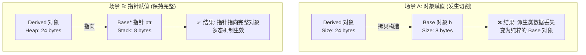

# 1. C++ 多态实现中指针的必要性分析

> [!abstract] 在 C++ 面向对象编程中，多态的实现往往依赖于指针或引用。直接使用对象进行赋值或传参会导致预期之外的行为。本文将从内存布局、对象切割机制以及底层编译原理三个维度，层层递进地剖析为何指针是实现多态的关键。

---

# 2. 核心障碍：对象切割与内存布局

> 直接使用对象而非指针实现多态时，面临的首要问题是“对象切割”。

## 2.1 对象大小的不确定性

在继承体系中，派生类通常会在基类的基础上扩展新的数据成员，这导致派生类的大小往往大于基类。

- **编译期静态分配**：当在栈上声明一个对象变量（如 `Base b`）时，编译器必须在编译阶段确定该变量在栈帧上的大小。
- **内存空间冲突**：如果将一个派生类对象赋值给基类变量，编译器仅会按照基类的大小分配内存空间。

## 2.2 对象切割现象

当把一个较大的派生类对象赋值给一个较小的基类对象时，会发生“切割”。

- **机制**：派生类对象中属于基类的部分被复制，而新增的数据成员被直接“切掉”丢弃。
- **后果**：赋值后的对象彻底变成了一个纯粹的基类实例，它丢失了所有派生类的特征和行为特征。

> [!danger] 警告：切片导致的类型丢失
> 对象切割不仅是数据的丢失，更是类型信息的丢失。被切割后的对象，其虚函数表指针也会被替换为基类的 vptr，导致后续无法再调用派生类的重写函数。

```cpp
// 错误示范：对象赋值导致的切割
Base b = Derived(); // 发生切割：Derived 特有部分被丢弃
b.virtual_func();   // 调用的是 Base::virtual_func，多态失效
```

## 2.3 内存布局可视化对比

通过内存模型对比可以更直观地理解指针与对象的区别：



---

# 3. 解决方案：指针的间接寻址特性

> 指针之所以能解决上述问题，核心在于其“间接性”和“大小统一性”。

## 3.1 指针大小的统一性

指针变量存储的是内存地址，而非对象本身。

- **固定大小**：无论指向的对象是 `Animal`（4字节）还是 `Dragon`（400字节），指针变量本身的大小在 64 位系统中固定为 8 字节。
- **绕过内存限制**：使用指针，编译器无需在编译期确定对象的具体大小，只需分配存储一个地址的空间。

## 3.2 保持对象完整性

通过指针访问对象，实际上是通过地址“远程”访问堆或栈上的完整对象内存块。

- 指针仅仅记录了对象的起始地址。
- 在访问成员或调用方法时，程序通过该地址跳转到对象实际的内存位置进行操作。
- 这确保了派生类的所有数据成员和类型信息都被完整保留。

```cpp
// 正确示范：指针实现多态
Animal* ptr = new Dog(); // ptr 大小固定，指向堆上完整的 Dog 对象
ptr->speak();            // 运行时通过 ptr 找到 Dog 的 vtable，调用 Dog::speak
```

---

# 4. 底层机制：动态绑定与虚函数表

解决了内存存储问题后，还需要从编译原理的角度理解多态是如何发生的。C++ 的多态依赖于虚函数表机制。

## 4.1 虚函数表

每个包含虚函数的类都有一个静态的虚函数表，每个对象实例内部都包含一个指向该表的指针。

- **vptr (虚表指针)**：对象的隐式成员，指向类的 vtable。
- **vtable**：存储类中所有虚函数的函数指针数组。

## 4.2 静态绑定与动态绑定

直接对象调用与指针调用的底层逻辑截然不同。

1.  **直接对象调用 (静态绑定)**
    - 编译器在编译期根据对象的**声明类型**确定调用哪个函数。
    - 例如 `Base b; b.func();`，编译器直接生成调用 `Base::func` 的汇编指令（硬编码地址）。即使发生了切割，逻辑依然如此。

2.  **指针调用 (动态绑定)**
    - 编译器生成的代码逻辑是：“解引用指针 -> 找到对象内存 -> 读取 vptr -> 查表 -> 跳转执行”。
    - 程序在运行时检查指针指向的实际对象的 vptr。因为 `Base* ptr` 指向的是 `Derived` 对象，该对象的 vptr 指向 `Derived` 的 vtable，因此会调用 `Derived::func`。

> [!tip] 编译器视角
> 编译器看到 `ptr->func()` 时，并不知道 `ptr` 指向的是基类还是派生类。它只知道必须生成代码去查 vtable。这个“查表”动作就是多态的代价和本质。

---

# 5. 模型类比与应用场景

为了更直观地理解，可以将指针比作通用的遥控器。

## 5.1 遥控器类比

- **基类指针** = **通用遥控器**。面板上只有基础按钮（基类定义的接口）。
- **派生类对象** = **具体的电器**（电视机、音响、空调）。
- **操作逻辑**：
    - 你可以使用同一个遥控器控制不同的电器，只要这些电器遵循了遥控器的协议（继承基类）。
    - 如果你没有遥控器（指针），而是试图把“电视机”强行塞进“收音机”的壳子里（对象赋值），那么电视机的屏幕（派生类特有功能）就会被物理拆除（对象切割）。

## 5.2 实际应用示例

在实际开发（如游戏循环）中，通常使用容器存储基类指针来管理各类派生对象。

```cpp
#include <vector>
#include <memory>

// 游戏循环中的多态应用
void updateGame() {
    std::vector<std::unique_ptr<SpriteAnim>> sprites;
    
    // 存入不同类型的派生类对象
    sprites.push_back(std::make_unique<Player>());
    sprites.push_back(std::make_unique<Enemy>());
    sprites.push_back(std::make_unique<NPC>());

    // 统一处理：多态调用
    for (const auto& sprite : sprites) {
        sprite->update(); // 分别调用 Player::update, Enemy::update...
    }
}
```

---

# 6. 总结

C++ 必须使用指针（或引用）来实现多态，其深层原因可归纳为以下三点：

1.  **保持对象完整性**：指针避免了对象赋值时的数据切割，保留了派生类的完整内存布局和类型信息。
2.  **实现间接寻址**：利用指针大小固定的特性，解耦了编译期内存分配与运行期对象大小，允许通过统一接口访问不同大小的对象。
3.  **触发动态绑定**：通过指针访问虚函数，迫使编译器生成查表代码，从而在运行时根据实际对象类型调用正确的函数实现。