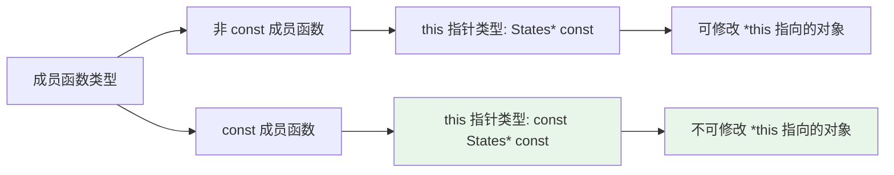
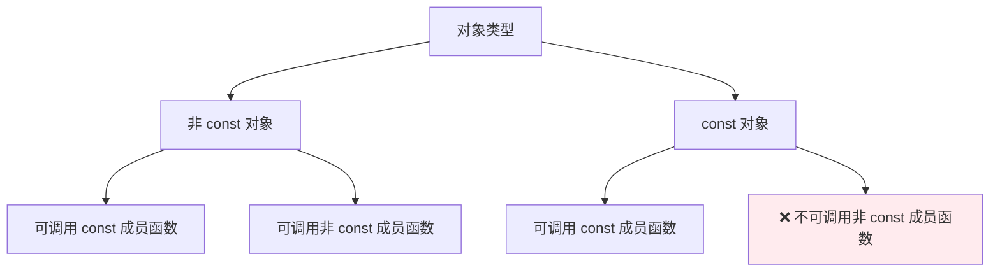
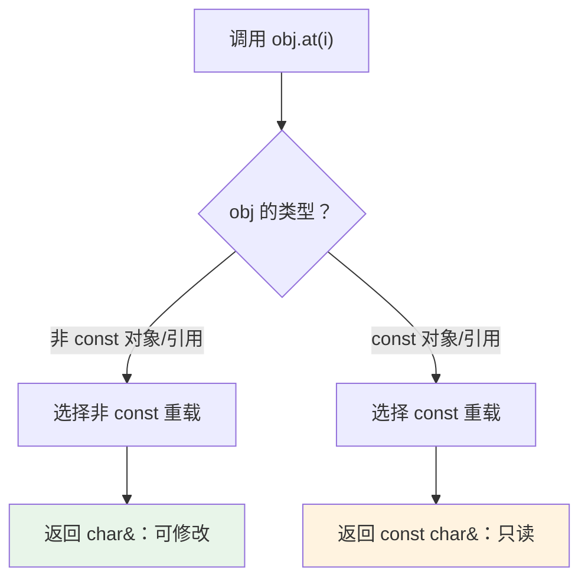
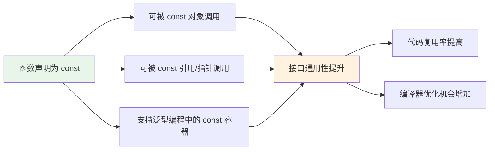
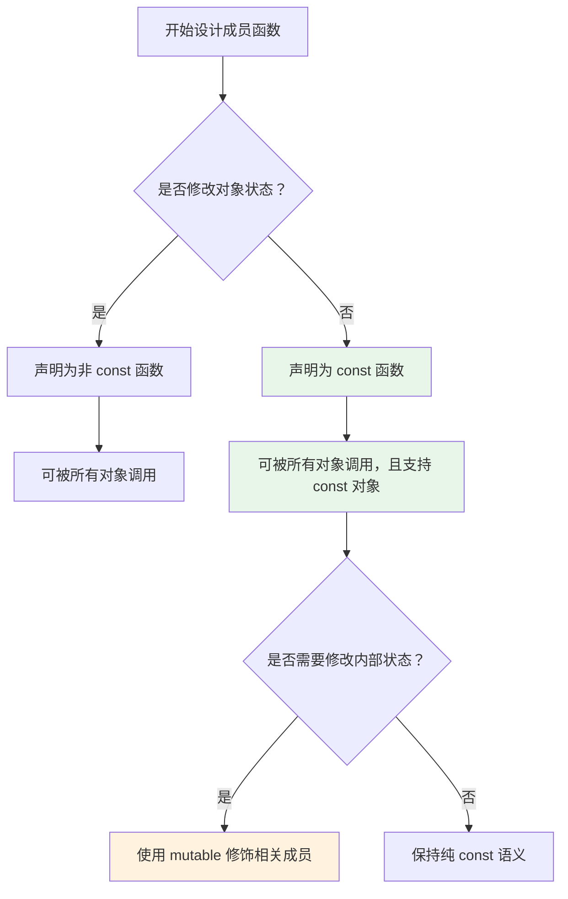

> [!abstract] const 成员函数核心机制
> 本笔记系统梳理 C++ 中 `const` 成员函数的语法规则、调用权限、内部约束及设计实践。通过对比分析对象类型与函数签名的交互关系，建立对 `const` 正确性（const-correctness）的深刻理解。

# 1. 基本概念与语法定义

`const` 成员函数是在函数声明末尾添加 `const` 限定符的成员函数，其核心语义是**承诺不修改调用对象的逻辑状态**。

```cpp
class States {
public:
    // const 成员函数：末尾的 const 是函数签名的一部分
    float getHealth() const { return m_health; }
    
    // 非 const 成员函数：无 const 限定，可修改对象状态
    void setHealth(float health) { m_health = health; }
    
private:
    float m_health;
};
```

> [!note] 语法位置
> `const` 限定符必须位于参数列表之后、函数体或纯虚标记 `= 0` 之前。若函数有引用限定符（`&` / `&&`），`const` 应位于其前：
> ```cpp
> void func() const &;    // const 左值引用限定
> void func() const &&;   // const 右值引用限定
> ```

## 1.1 this 指针的类型变化

`const` 限定符本质改变了成员函数内部 `this` 指针的类型，这是理解其行为的关键。



| 函数类型 | `this` 指针类型 | 可修改成员变量 |
| :--- | :--- | :--- |
| 非 `const` 成员函数 | `States* const` | ✅ 所有非 `mutable` 成员 |
| `const` 成员函数 | `const States* const` | ❌ 仅 `mutable` 成员 |

> [!tip] 双重 const 解析
> `const States* const` 中：
> - 右侧 `const`：`this` 指针本身不可变（所有成员函数共性）
> - 左侧 `const`：`this` 指向的对象不可修改（`const` 成员函数特有）

## 1.2 const 承诺的语义解释

`const` 成员函数的"不修改"承诺包含两个层面：

### 1.2.1 逻辑常量性（Logical Constness）

```cpp
class DataCache {
public:
    // 逻辑上只读：外部观察者无法感知 m_cacheHit 的变化
    int query(int key) const {
        if (auto it = m_cache.find(key); it != m_cache.end()) {
            m_cacheHit++;  // ✅ mutable 允许修改，不影响逻辑状态
            return it->second;
        }
        return -1;
    }
    
private:
    std::map<int, int> m_cache;
    mutable int m_cacheHit = 0;  // mutable：物理可改，逻辑只读
};
```

### 1.2.2 物理常量性（Physical Constness）

```cpp
class States {
public:
    float getHealth() const {
        // ❌ 违反物理常量性：直接修改普通成员变量
        // m_health = 100.0f;  // 编译错误
        
        // ✅ 符合物理常量性：仅读取成员变量
        return m_health;
    }
    
private:
    float m_health;
};
```

> [!warning] const_cast 风险
> 在 `const` 成员函数内使用 `const_cast` 移除 `const` 并修改对象，若原对象本身是 `const`，则行为未定义：
> ```cpp
> void unsafe() const {
>     const_cast<States*>(this)->m_health = 100;  // ⚠️ 若 this 指向 const 对象，行为未定义
> }
> ```

---

# 2. 调用权限规则与对象类型

## 2.1 对象类型分类与调用权限

调用权限由**对象本身的 const 属性**决定，而非函数签名。



**调用权限速查表**：

| 对象声明 | 对象类型 | 可调用 `const` 函数 | 可调用非 `const` 函数 |
| :--- | :--- | :---: | :---: |
| `States s;` | 非 `const` | ✅ | ✅ |
| `const States s;` | `const` | ✅ | ❌ |
| `States& ref = s;` | 非 `const` 引用 | ✅ | ✅ |
| `const States& ref = s;` | `const` 引用 | ✅ | ❌ |
| `States* ptr = &s;` | 非 `const` 指针 | ✅ | ✅ |
| `const States* ptr = &s;` | `const` 指针 | ✅ | ❌ |

## 2.2 代码示例与编译行为验证

```cpp
#include <iostream>

class States {
public:
    float getHealth() const { 
        std::cout << "getHealth() called\n";
        return m_health; 
    }
    
    void setHealth(float health) { 
        std::cout << "setHealth() called\n";
        m_health = health; 
    }
    
private:
    float m_health = 100.0f;
};

int main() {
    States s1;                    // 非 const 对象
    const States s2;              // const 对象
    
    // 非 const 对象：调用权限完整
    s1.getHealth();               // ✅ 调用 const 函数
    s1.setHealth(50.0f);          // ✅ 调用非 const 函数
    
    // const 对象：仅允许 const 函数
    s2.getHealth();               // ✅ 调用 const 函数
    // s2.setHealth(50.0f);       // ❌ 编译错误：discards qualifiers
    
    // const 引用参数：接口通用性关键
    const States& ref = s1;       // 非 const 对象绑定到 const 引用
    ref.getHealth();              // ✅ 可调用
    // ref.setHealth(30.0f);      // ❌ 编译错误
    
    return 0;
}
```

## 2.3 const 成员函数的内部约束

`const` 成员函数内部同样受 `const` 语义约束：

```cpp
class States {
public:
    // ❌ 错误：尝试修改普通成员变量
    float getHealth() const {
        m_health = 100.0f;  // 编译错误：assignment of member 'States::m_health' in read-only object
        return m_health;
    }
    
    // ✅ 正确：仅读取成员变量
    float getHealth() const {
        return m_health;  // 只读访问允许
    }
    
    // ✅ 正确：调用其他 const 成员函数
    float getDoubleHealth() const {
        return getHealth() * 2;  // const 函数可调用其他 const 函数
    }
    
    // ❌ 错误：调用非 const 成员函数
    float getAndReset() const {
        // return setHealth(0);  // 编译错误：无法在 const 函数内调用非 const 函数
        return 0;
    }
    
private:
    float m_health;
    void setHealth(float h);  // 非 const 成员函数声明
};
```

> [!note] 链式调用约束
> `const` 成员函数只能调用其他 `const` 成员函数，形成"只读调用链"。若需调用非 `const` 函数，需通过 `const_cast`（谨慎使用）或重新设计接口。

---

# 3. mutable 关键字与例外机制

## 3.1 mutable 的语义与使用场景

`mutable` 修饰的成员变量**突破 `const` 限制**，允许在 `const` 成员函数内修改。适用于"物理可改但逻辑只读"的内部状态。

**典型应用场景**：

| 场景 | 说明 | 示例变量 |
| :--- | :--- | :--- |
| **缓存统计** | 记录访问次数，不影响外部可观察状态 | `mutable int m_accessCount;` |
| **懒加载缓存** | 首次访问时计算并缓存结果 | `mutable std::optional<T> m_cachedValue;` |
| **线程同步** | `const` 查询操作仍需加锁保护 | `mutable std::mutex m_mutex;` |
| **调试标记** | 内部调试信息，不影响业务逻辑 | `mutable bool m_debugLogged;` |

## 3.2 代码示例：缓存计数与线程安全

```cpp
#include <mutex>
#include <optional>
#include <string>

class UserProfile {
public:
    // const 查询接口：外部视为只读，内部可更新缓存
    const std::string& getName() const {
        std::lock_guard<std::mutex> lock(m_mutex);  // ✅ mutable mutex 可在 const 函数中加锁
        
        if (!m_nameCache.has_value()) {
            m_nameCache = loadFromDatabase();  // ✅ mutable optional 可写入缓存
            m_accessCount++;                    // ✅ mutable 计数器可递增
        }
        
        return *m_nameCache;
    }
    
    // 非 const 修改接口
    void setName(const std::string& name) {
        std::lock_guard<std::mutex> lock(m_mutex);
        m_nameCache = name;
        m_accessCount = 0;  // 重置缓存统计
    }
    
private:
    std::string loadFromDatabase() const;  // 模拟数据库加载
    
    mutable std::mutex m_mutex;                    // 线程同步
    mutable std::optional<std::string> m_nameCache; // 懒加载缓存
    mutable int m_accessCount = 0;                  // 访问统计
};
```

> [!warning] mutable 使用原则
> 1. 仅用于**不影响对象逻辑状态**的内部字段
> 2. 避免滥用：若多个 `mutable` 字段需协同修改，可能暗示设计需重构
> 3. 文档标注：在注释中说明 `mutable` 字段的用途，便于维护

---

# 4. const 重载与函数选择

## 4.1 const 与非 const 版本共存

同一函数名可提供 `const` 与非 `const` 两个重载版本，编译器根据对象类型自动选择。

```cpp
class Buffer {
public:
    // const 版本：返回 const 引用，禁止修改
    const char& at(std::size_t index) const {
        return m_data[index];
    }
    
    // 非 const 版本：返回非 const 引用，允许修改
    char& at(std::size_t index) {
        return m_data[index];
    }
    
private:
    std::vector<char> m_data;
};
```

## 4.2 编译器选择规则与返回值差异



```cpp
int main() {
    Buffer buf;
    const Buffer cbuf;
    
    // 非 const 对象：调用非 const 版本，返回值可修改
    buf.at(0) = 'A';        // ✅ char& 允许赋值
    
    // const 对象：调用 const 版本，返回值只读
    // cbuf.at(0) = 'B';    // ❌ 编译错误：const char& 不允许赋值
    
    // const 引用绑定非 const 对象：仍调用 const 版本
    const Buffer& ref = buf;
    // ref.at(0) = 'C';     // ❌ 编译错误：通过 const 引用只能调用 const 函数
    
    return 0;
}
```

> [!tip] 返回值优化技巧
> 对于返回内置类型（如 `int`、`double`）的 `const` 函数，直接按值返回即可，无需返回 `const T`：
> ```cpp
> int getCount() const { return m_count; }  // ✅ 按值返回
> // const int getCount() const;            // ❌ 无意义：const 限定对返回值无影响
> ```

---

# 5. 设计实践与常见误区

## 5.1 只读接口声明为 const 的最佳实践

**核心原则**：所有不修改对象逻辑状态的成员函数，均应声明为 `const`。

```cpp
// ✅ 推荐：getter 声明为 const
class Player {
public:
    float getHealth() const { return m_health; }
    bool isAlive() const { return m_health > 0; }
    std::string getName() const { return m_name; }
    
private:
    float m_health;
    std::string m_name;
};

// ❌ 避免：只读函数遗漏 const，限制接口通用性
class PlayerBad {
public:
    float getHealth() { return m_health; }  // 遗漏 const！
    // 导致 const Player& 参数无法调用此函数
};
```

**接口通用性收益**：

```cpp
// 通用打印函数：接受 const 引用，可处理所有对象
void printPlayer(const Player& p) {
    std::cout << p.getName() << ": " << p.getHealth() << "\n";  // 要求函数为 const
}

// 若 getHealth() 非 const，则上述代码编译失败
```

## 5.2 常见误区澄清

| 误区 | 正确理解 | 验证代码 |
| :--- | :--- | :--- |
| "`const` 函数只有 `const` 对象能调用" | ❌ 所有对象均可调用 `const` 函数；限制的是 `const` 对象只能调用 `const` 函数 | `States s; s.getHealth(); // ✅` |
| "`const` 函数内完全不能修改任何内容" | ❌ `mutable` 成员、静态成员、外部资源均可修改 | `mutable int counter;` 在 `const` 函数中可递增 |
| "返回指针/引用时 `const` 无关紧要" | ❌ 返回类型也需 `const` 限定以维持封装性 | `const T& get() const` vs `T& get() const` |
| "`const` 仅用于 getter" | ❌ 任何不修改状态的函数都应 `const`，如 `size()`、`empty()`、`find()` | `bool contains(Key) const;` |

## 5.3 const 正确性对接口通用性的影响



**实际收益示例**：

```cpp
// 泛型算法：要求元素类型支持 const 访问
template<typename Container>
void printAll(const Container& c) {
    for (const auto& item : c) {  // 范围 for 使用 const 引用
        std::cout << item.getHealth() << " ";  // 要求 getHealth() 为 const
    }
}

// 若 getHealth() 非 const，则无法用于 const 容器或 const 引用遍历
```

---

# 6. 高级话题与注意事项

## 6.1 const_cast 的使用场景与风险

`const_cast` 可移除 `const` 限定，但需谨慎使用：

```cpp
class LegacyAdapter {
public:
    // 适配遗留非 const 接口
    int query(int key) const {
        // ⚠️ 仅当确定原对象非 const 时安全
        return const_cast<LegacyAdapter*>(this)->legacyQuery(key);
    }
    
private:
    int legacyQuery(int key);  // 遗留非 const 接口
};
```

> [!danger] 安全使用前提
> 仅当满足以下**全部条件**时可使用 `const_cast`：
> 1. 原对象本身**非 `const`**（如通过非 `const` 指针/引用传入）
> 2. 被调用的非 `const` 函数**实际未修改对象**，或修改不影响逻辑状态
> 3. 无其他 `const` 正确性保证可替代此方案

## 6.2 const 与指针/引用的组合

理解 `const` 在指针/引用声明中的位置差异：

```cpp
// 指针的 const 限定
int* p1;                    // 指向非常量 int 的指针
const int* p2;             // 指向常量 int 的指针（指针可变，目标不可变）
int* const p3 = &x;        // 常量指针，指向非常量 int（指针不可变，目标可变）
const int* const p4 = &x;  // 常量指针，指向常量 int（均不可变）

// 成员函数中的 this 指针
void func() const;         // this 类型为: const ClassName* const
```

**成员函数调用中的指针语义**：

```cpp
class Example {
public:
    void modify() { m_val = 1; }      // this: Example* const
    void inspect() const { /*...*/ }  // this: const Example* const
    
private:
    int m_val;
};

int main() {
    Example* ptr = new Example();
    const Example* cptr = ptr;
    
    ptr->modify();    // ✅ 非 const 指针调用非 const 函数
    ptr->inspect();   // ✅ 非 const 指针调用 const 函数
    
    // cptr->modify(); // ❌ const 指针调用非 const 函数：编译错误
    cptr->inspect();  // ✅ const 指针调用 const 函数
    
    delete ptr;
    return 0;
}
```

## 6.3 复习要点速查

| 核心概念 | 关键结论 | 代码验证 |
| :--- | :--- | :--- |
| **`const` 成员函数** | 承诺不修改对象，`this` 类型为 `const T* const` | `float get() const { return val; }` |
| **调用权限** | `const` 对象仅能调用 `const` 函数 | `const States s; s.get(); // ✅` |
| **`mutable` 例外** | 允许在 `const` 函数内修改，用于内部状态 | `mutable int cacheHit;` |
| **`const` 重载** | 编译器按对象类型自动选择版本 | `T& get(); const T& get() const;` |
| **接口设计** | 只读函数声明 `const` 提升通用性 | `void print(const T& obj);` |
| **`const_cast`** | 仅当原对象非 `const` 时安全使用 | `const_cast<T*>(this)->legacy();` |

> [!tip] 记忆口诀
> - **对象定权限**：`const` 对象只能调 `const` 函数
> - **函数守承诺**：`const` 函数不改普通成员
> - **`mutable` 开例外**：内部状态可物理修改
> - **重载看类型**：编译器按对象 `const` 属性选版本
> - **接口求通用**：只读函数加 `const`，引用参数加 `const`

## 6.4 调试与验证技巧

```cpp
// 技巧1：使用 static_assert 验证函数签名
class States {
public:
    float getHealth() const;
};

// 验证 getHealth 是否为 const 成员函数
static_assert(
    std::is_const<std::remove_pointer_t<
        decltype(&States::getHealth)
    >::value>, 
    "getHealth should be a const member function"
);

// 技巧2：编译器错误信息解读
// 错误: passing 'const States' as 'this' argument discards qualifiers
// 解读：尝试在 const 对象上调用非 const 成员函数

// 技巧3：IDE 提示利用
// 现代 IDE 会在调用处提示：
// - const 对象调用非 const 函数：红色波浪线 + "candidate function not viable"
// - const 函数内修改成员：红色波浪线 + "read-only variable"
```



> [!note] 学习建议
> 1. 编写新类时，先为所有 getter 添加 `const`，再逐步验证其他函数
> 2. 使用 `clang-tidy` 的 `readability-convert-member-functions-to-const` 检查遗漏
> 3. 在 `const` 函数内尝试修改成员，观察编译器错误信息加深理解
> 4. 阅读 STL 源码（如 `std::vector::size() const`）学习工业级 `const` 正确性实践

