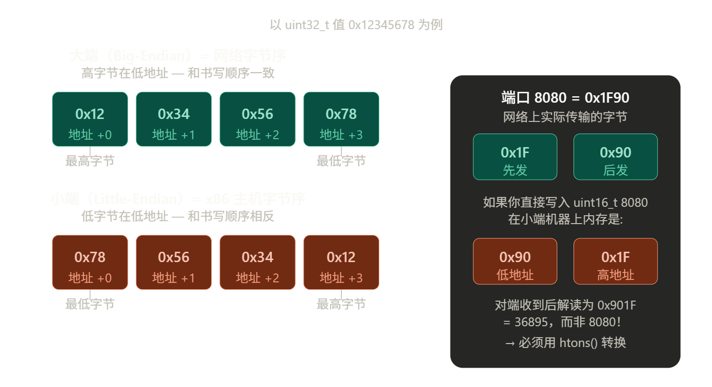
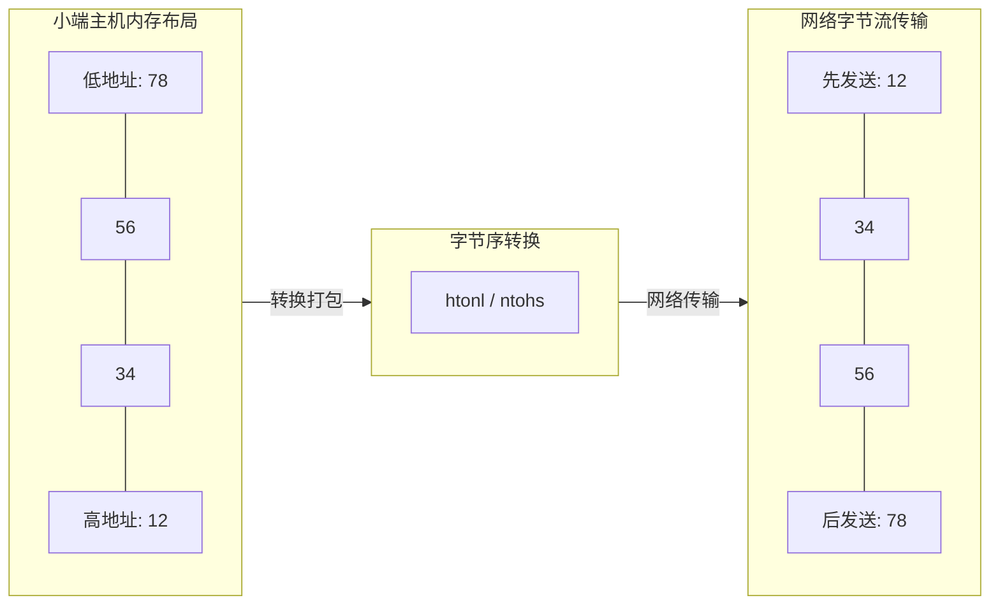
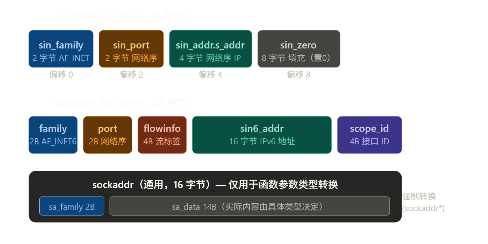
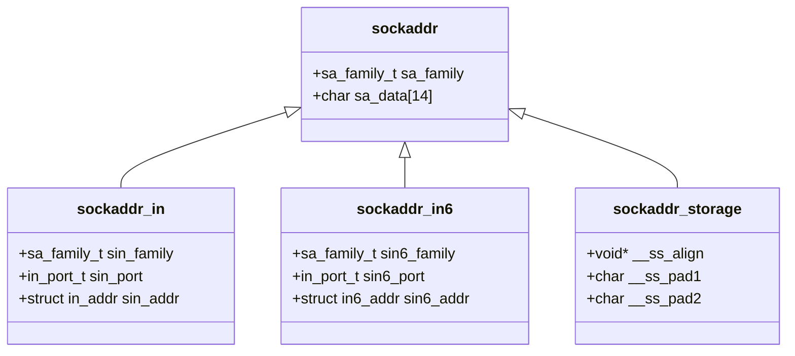

# 1. 主机字节序与网络字节序

网络编程的底层交互建立在精确的内存布局之上。多字节数据在主机内存中的排列顺序与网络传输协议规定的顺序存在差异，理解并正确处理字节序是构建跨平台网络通信的基石。

## 1.1 字节序问题的物理基础

多字节整数（如 16 位端口号、32 位 IPv4 地址）在内存中的存储顺序由 CPU 架构决定，主要分为两种模式：
- **大端字节序（Big-Endian）**：**高位字节**存储在**低地址**，**低位字节**存储在**高地址**。**符合人类阅读习惯**（如 `0x12345678` 在内存中按 `12 34 56 78` 排列）。常见于网络协议标准、部分 RISC 架构及 Java 虚拟机。
- **小端字节序（Little-Endian）**：**低位字节**存储在**低地址**，**高位字节**存储在**高地址**（如 `0x12345678` 在内存中按 `78 56 34 12` 排列）。x86/x64 及 ARM 架构默认采用此模式。

> [!example] 示例
> 假设一个整数（十六进制表示）：12345678H
> 1. 大端方式：低字节存放在高地址处（适合人看的）
> 
> ```
> 地址： 0x00    0x01    0x02    0x03
> 内容：  12      34      56      78
> ```
> 
> 1. 小端方式：低字节存放在低地址处（适合机器看的）
> 
> ```
> 地址： 0x00    0x01    0x02    0x03
> 内容：  78      56      34      12
> ```



## 1.2 网络传输的强制约定

TCP/IP 协议栈明确规定，所有在**网络**线路上传输的多字节整数**必须采用大端字节序**（Network Byte Order）。
当小端架构的主机与网络交互时，必须在发送前将主机字节序转换为网络字节序，接收后再转换回主机字节序。忽略此步骤将导致端口号解析错误、IP 地址错乱等严重通信故障。

## 1.3 标准化转换函数族

由于网络上的设备可能使用不同的 CPU 架构，为了统一通信，POSIX 标准提供了一组专用宏/函数进行字节序转换。函数命名严格遵循 `方向+数据类型` 规则：`h`=host（主机）, `n`=network（网络）, `s`=short（16位）, `l`=long（32位）。

- **`htons()`** (Host to Network Short)：将 **16** 位主机序转换为网络序（常用于端口号 `port`）。
- **`htonl()`** (Host to Network Long)：将 **32** 位主机序转换为网络序（常用于 IPv4 地址）。
- **`ntohs()` / `ntohl()`**：反向操作，将网络接收到的数据转换回本地主机的字节序。

包含的头文件：

> 下面的代码要启用 C++ 23 或以上，才能使用 `std::println`，否则使用 `printf("port 8080 in network order: 0x%04X\n", port_net);`。

```cpp
#include <arpa/inet.h>  // htonl, htons, ntohl, ntohs, inet_pton, inet_ntop
#include <cstdint>
#include <cstdio>
#include <print>
```

大端转小端——端口转换：

```cpp
uint16_t port_host = 8080;             // 十六进制为 0x1F90（大端）
uint16_t port_net = htons(port_host);  // host → network (16位)

std::println("- port 8080 in host order: 0x{:04X}", port_host);    // 在大端机器上输出: 0x1F90
std::println("- port 8080 in network order: 0x{:04X}", port_net);  // 在小端机器上输出: 0x901F
```

大端转小端——IPV4 地址转换：

```cpp
uint32_t addr_host = 0xC0A80101;       // 192.168.1.1
uint32_t addr_net = htonl(addr_host);  // host → network (32位)
```

小端转大端——反向转换（接收数据后使用）：

```cpp
uint16_t port_back = ntohs(port_net);
uint32_t addr_back = ntohl(addr_net);
```

> [!tip] 检测当前机器字节序
> ```cpp
> union {
>   uint32_t i;
>   uint8_t c[4];
> } u = {0x01020304};
> 
> if (u.c[0] == 0x04) {
>   std::println("- This machine is Little-Endian (x86/ARM)");
> } else {
>   std::println("- This machine is Big-Endian");
> }
> ```

**性能优化提示**：在大端机器上，`htons`/`ntohs` 等函数通常被实现为**空操作（No-Op）**，编译器会在编译期将其优化掉。在小端机器上，则通过内联汇编或字节交换指令高效执行，对性能影响可忽略不计。



---

# 2. 地址结构体：`sockaddr` 家族

Linux 的 Socket API 设计于 C 语言早期，为了兼容性，使用了一个通用的 `struct sockaddr` 作为所有地址结构的基类。实际编程中，我们使用具体的 `sockaddr_in` (IPv4) 或 `sockaddr_in6` (IPv6)。



## 2.1 结构体层级关系



---

# 3. 填写 `sockaddr_in`

当我们要让程序连接到一个服务器（如 `192.168.1.100:8080`）时，操作系统内核**不认字符串**，它只认**二进制结构体**：

```
人类可读格式          内核需要的格式
"192.168.1.100:8080"  →  struct sockaddr_in { ... }
```

`sockaddr_in` 结构体（IPV4 简化版）：

```cpp
struct in_addr {
    uint32_t s_addr; // 真正的 4 字节二进制 IP 地址就在这
};

struct sockaddr_in {
    sa_family_t    sin_family;  // 2 字节：地址族（AF_INET=2）
    in_port_t      sin_port;    // 2 字节：端口号（网络序）
    struct in_addr sin_addr;    // 4 字节：IP 地址（网络序）
    char           sin_zero[8]; // 8 字节：填充，对齐到 16 字节
};
// 总大小：16 字节
```

结构体中各个成员说明：
1. **`sin_family` (2 字节)**
	- **含义**：地址族（Address Family）。
	- **作用**：告诉操作系统这个地址属于哪个协议族。对于 IPv4，必须填 `AF_INET`。
	- **注意**：在 Linux 系统中，`AF_INET` 的值通常是 `2`。
  
2. **`sin_port` (2 字节)**
	- **含义**：端口号。
	- **作用**：标识进程。有效范围是 `0 - 65535`。
	- **关键点**：它必须存储为**网络字节序（大端序）**。例如，如果你想使用端口 `80` (十六进制 `0x0050`)，在内存中必须以 `50 00` 的形式排列。这就是为什么要强制调用 `htons(80)`。

3. **`sin_addr` (4 字节)**
	- **含义**：IPv4 地址。
	- **作用**：标识主机。
	- **内部构造**：`in_addr` 其实是一个内部只有一个 `uint32_t` 成员的结构体。
	- **关键点**：同样必须是**网络字节序**。例如 `127.0.0.1` 转换后在内存中是 `7F 00 00 01`。

4. **`char sin_zero[8]` (8 字节)**
	- **含义**：填充字节。
	- **作用**：这是一个“历史遗留”的对齐策略。
	- **为什么存在？**：通用的套接字地址结构 `struct sockaddr` 总大小是 **16 字节**。为了让 IPv4 专用的 `sockaddr_in` 能够通过类型转换（Casting）与通用结构对齐，即便前面的成员加起来只有 8 字节，也必须补上 8 字节的零。

## 3.1 地址构造

- 需要用到的头文件：

```cpp
#include <netinet/in.h>  // sockaddr_in, sockaddr_in6, IPPROTO_TCP
#include <arpa/inet.h>   // htons, htonl, inet_pton, inet_ntop
#include <cstring>       // memset
#include <stdexcept>
#include <print>
```

- IPv4 地址结构填写：

```cpp
sockaddr_in make_ipv4_addr(const char *ip_str, uint16_t port) {
  sockaddr_in addr;
  std::memset(&addr, 0, sizeof(addr));  // 1. 清零，包括 sin_zero 填充字节

  addr.sin_family = AF_INET;    // 2. 指定地址族：AF_INET = 2，是用于 IPv4 协议的标准地址族
  addr.sin_port = htons(port);  // 3. 端口转换：主机序 -> 网络序

  // 4. IP 转换：点分十进制 -> 网络序二进制
  // 注意：inet_pton 的 target 是 &addr.sin_addr，不是 &addr
  if (inet_pton(AF_INET, ip_str, &addr.sin_addr) <= 0) {
    // inet_pton 返回 1 成功，0 格式错误，-1 系统错误
    throw std::runtime_error("invalid IPv4 address");
  }

  return addr;
}

// 监听所有接口（服务器常用）
sockaddr_in make_any_addr(uint16_t port) {
  sockaddr_in addr;
  memset(&addr, 0, sizeof(addr));
  addr.sin_family = AF_INET;
  addr.sin_port = htons(port);
  addr.sin_addr.s_addr = htonl(INADDR_ANY);  // 0.0.0.0
  // 或者 addr.sin_addr.s_addr = INADDR_ANY;  // INADDR_ANY 本身就是 0，大小端无关
  return addr;
}

// 回环地址（本机测试常用）
sockaddr_in make_loopback_addr(uint16_t port) {
  sockaddr_in addr;
  memset(&addr, 0, sizeof(addr));
  addr.sin_family = AF_INET;
  addr.sin_port = htons(port);
  addr.sin_addr.s_addr = htonl(INADDR_LOOPBACK);  // 127.0.0.1
  return addr;
}
```

> [!question] `inet_pton` 做了什么？（以 `"192.168.1.100"` 为例）
> 
> | 步骤 | 操作 | 结果 |
> |------|------|------|
> | 1. 按 `.` 分割字符串 | `["192", "168", "1", "100"]` | 4 个十进制数 |
> | 2. 每个数转 1 字节 | `192→0xC0`, `168→0xA8`, `1→0x01`, `100→0x64` | 4 字节 |
> | 3. 按顺序存入 `sin_addr.s_addr` | `C0 A8 01 64` | 网络序（大端） |

`inet_pton` 返回值含义：

| 返回值 | 含义 | 本例处理 |
|--------|------|----------|
| `1` | 转换成功 | 继续执行 |
| `0` | 输入格式错误（如 `"256.1.1.1"`） | 抛异常 |
| `-1` | 系统错误（如 `AF_INET` 不支持） | 抛异常 |

- IPv6 地址结构填写：

```cpp
sockaddr_in6 make_ipv6_addr(const char *ip6, uint16_t port) {
  sockaddr_in6 addr;
  memset(&addr, 0, sizeof(addr));
  addr.sin6_family = AF_INET6;
  addr.sin6_port = htons(port);
  if (inet_pton(AF_INET6, ip6, &addr.sin6_addr) <= 0) {
    throw std::runtime_error("invalid IPv6 address");
  }
  return addr;
}
```

> [!tip] 特殊地址宏
> - `INADDR_ANY` (0.0.0.0)：绑定所有网卡（服务器监听常用）。
> - `INADDR_LOOPBACK` (127.0.0.1)：本地回环。
> - 使用宏时：`addr.sin_addr.s_addr = htonl(INADDR_ANY);` (注：`INADDR_ANY` 本身为 0，其实不转换也行，但为了代码一致性建议转换)。

## 3.3 IPV4 和 IPV6 的差异

|**比较维度**|**IPv4 (sockaddr_in)**|**IPv6 (sockaddr_in6)**|
|---|---|---|
|**结构体类型**|`struct sockaddr_in`|`struct sockaddr_in6`|
|**地址族常量**|`AF_INET`|`AF_INET6`|
|**字段命名前缀**|`sin_` (e.g., `sin_port`)|`sin6_` (e.g., `sin6_port`)|
|**地址字段名**|`sin_addr`|`sin6_addr`|
|**地址内部类型**|`struct in_addr` (4 字节)|`struct in6_addr` (16 字节)|
|**`inet_pton` 参数**|`AF_INET`|`AF_INET6`|
|**地址字符串示例**|`"192.168.1.1"`|`"2001:db8::1"`|
|**特有成员**|无|`sin6_flowinfo`, `sin6_scope_id`|
|**结构体总大小**|16 字节|28 字节|

### 3.3.1 技术差异解析

#### 地址存储空间的巨大飞跃

- **IPv4** 使用 32 位地址，存放在 `in_addr` 结构体中，本质是一个 `uint32_t`。
- **IPv6** 使用 128 位地址，存放在 `in6_addr` 结构体中。它通常被定义为一个包含 16 个字节的数组（`uint8_t s6_addr[16]`）。

#### 字段命名规范

为了防止在同一个程序中混淆，IPv6 的成员变量名多了一个 **`6`**：
- 端口：`sin_port` vs `sin6_port`
- 族：`sin_family` vs `sin6_family`

#### IPv6 特有的扩展字段

在 `sockaddr_in6` 中，除了你代码中提到的部分，还存在两个 IPv4 没有的字段：
- **`sin6_flowinfo`**：用于流量优先级和标签。
- **`sin6_scope_id`**：用于标识地址的作用域（例如在链路本地地址 `fe80::` 中，用来指定具体是哪个网卡接口）。

#### 转换函数的复用性

虽然函数名相同，但传入的参数决定了内核的解析逻辑：
- 调用 `inet_pton(AF_INET, ...)` 时，内核按 **点分十进制** 解析。
- 调用 `inet_pton(AF_INET6, ...)` 时，内核按 **十六进制冒号分隔** 解析，并支持 `::` 缩写。

### 3.3.2 总结

从代码逻辑上看，IPv4 和 IPv6 的构造逻辑高度相似（清零 -> 设族 -> 换端口 -> 换 IP），但在底层，IPv6 处理的是更宽的数据位（128-bit）和更复杂的地址表示形式。在编写跨协议代码时，通常建议使用更现代的 `getaddrinfo` 接口，它可以自动根据输入判断是 IPv4 还是 IPv6，从而避免手动编写这些不同的构造函数。

---

# 4. 地址与字符串互转

直接操作 `in_addr` 结构体中的整数是反人类的，我们需要在“人可读字符串”和“机器可读二进制”之间转换。

## 4.1 `inet_pton` 与 `inet_ntop`

这两个函数是当前的标准推荐，同时支持 IPv4 和 IPv6，且线程安全。

- **`inet_pton` (Presentation to Numeric)**：字符串 `->` 二进制结构。
- **`inet_ntop` (Numeric to Presentation)**：二进制结构 `->` 字符串。

> `p` = presentation（人可读的点分形式），`n` = numeric（网络序二进制）

```cpp
#include <arpa/inet.h>
#include <cstdio>
#include <print>

void addr_conversion_demo() {
  // ---- 字符串 → 二进制（inet_pton）----

  // IPv4
  struct in_addr ipv4_bin;
  const char *ipv4_str = "192.168.1.100";
  if (inet_pton(AF_INET, ipv4_str, &ipv4_bin) == 1) {
    // ipv4_bin.s_addr 现在是网络字节序的 uint32_t
    std::println("IPv4 binary (hex): 0x{:08X}", ntohl(ipv4_bin.s_addr));
    // 输出: 0xC0A80164 = 192.168.1.100
  }

  // IPv6
  struct in6_addr ipv6_bin;
  const char *ipv6_str = "2001:db8::1";
  inet_pton(AF_INET6, ipv6_str, &ipv6_bin);
  // ipv6_bin.s6_addr 是 16 字节数组，已是网络字节序
  // 输出: 0x2001db80000000000000000000000001 = 2001:db8::1

  // ---- 二进制 → 字符串（inet_ntop）----

  char ipv4_buf[INET_ADDRSTRLEN];   // INET_ADDRSTRLEN = 16，足够放 "255.255.255.255"
  char ipv6_buf[INET6_ADDRSTRLEN];  // INET6_ADDRSTRLEN = 46

  inet_ntop(AF_INET, &ipv4_bin, ipv4_buf, sizeof(ipv4_buf));
  inet_ntop(AF_INET6, &ipv6_bin, ipv6_buf, sizeof(ipv6_buf));

  std::println("IPv4: {}", ipv4_buf);  // 192.168.1.100
  std::println("IPv6: {}", ipv6_buf);  // 2001:db8::1

  // 从 accept() 拿到对端地址后打印（服务器日志常见写法）
  sockaddr_in peer_addr;
  socklen_t peer_len = sizeof(peer_addr);
  // int conn_fd = accept(listen_fd, (sockaddr*)&peer_addr, &peer_len);

  char peer_ip[INET_ADDRSTRLEN];
  inet_ntop(AF_INET, &peer_addr.sin_addr, peer_ip, sizeof(peer_ip));
  uint16_t peer_port = ntohs(peer_addr.sin_port);  // 网络序 → 主机序
  std::println("client: {}:{}", peer_ip, peer_port);
}
```

这里的 `struct in_addr` 就是前面 **[3. 填写 `sockaddr_in`](#\ 3.\ 填写\ `sockaddr_in`)** 中，`struct sockaddr_in` 结构体中嵌套的 `struct in_addr sin_addr;` 这部分。

> [!danger] 废弃函数警告
> - **不要使用 `inet_addr`**：它返回 `-1` (INADDR_NONE) 表示错误，但这和 IP `255.255.255.255` 的值冲突。
> - **不要使用 `inet_ntoa`**：它返回一个静态缓冲区的指针，**不是线程安全**的，连续两次调用会覆盖上一次的结果。

**错误示例**：

```cpp
// 常见错误示范（绝对不要这样写）：
void wrong_examples() {
  sockaddr_in addr;
  // 错误1：端口忘记 htons
  // 8080 -> 0x1F90（原十六进制） -> 0x901F (host 以小端序表示) -> 36895（❌ 实际绑定到端口）
  addr.sin_port = 8080;

  // 错误2：使用已废弃的 inet_addr（不能表示 255.255.255.255，出错返回 -1 但类型是 uint32_t）
  addr.sin_addr.s_addr = inet_addr("192.168.1.1");  // ❌ 不检查错误

  // 错误3：inet_ntoa 返回静态缓冲区，多线程不安全，已废弃
  // char* ip = inet_ntoa(addr.sin_addr);  // ❌
}
```

---

# 5. 现代地址解析：`getaddrinfo`

在实际项目中，我们很少手动填充 `sockaddr_in`，因为我们需要处理域名解析（DNS）、IPv4/IPv6 兼容等复杂问题。`getaddrinfo` 是现代 Socket 编程的瑞士军刀，通常配合 `struct addrinfo` 使用。

**函数原型与头文件**：

```cpp
#include <netdb.h>  // getaddrinfo 声明所在

struct addrinfo {
  int ai_flags;             // 输入标志
  int ai_family;            // 协议族 (AF_INET, AF_INET6, AF_UNSPEC)
  int ai_socktype;          // 套接字类型 (SOCK_STREAM, SOCK_DGRAM)
  int ai_protocol;          // 协议 (通常为0，让系统自动选择)
  socklen_t ai_addrlen;     // 地址长度
  struct sockaddr *ai_addr; // 套接字地址指针，实际指向 sockaddr_in 或 sockaddr_in6
  char *ai_canonname;       // DNS解析后的规范域名（如 www.example.com → example.com）
  struct addrinfo *ai_next; // 链表指针，一个域名可能对应多个 IP 地址
};  // ai_ 前缀表示 address info

extern int getaddrinfo (
    const char *__restrict __name,      // 主机名或 IP 地址（可为 nullptr）
    const char *__restrict __service,   // 服务名或端口号（如 "http", "80"）
    const struct addrinfo *__restrict __req,  // 输入提示（过滤结果）
    struct addrinfo **__restrict __pai  // 输出：addrinfo 链表头指针
);
```

- **参数**:
  - `__name`: 主机名（如 `"localhost"`）或数值 IP 地址（如 `"192.168.1.1"`）。若为 `nullptr`，在服务器场景下表示通配地址（`0.0.0.0` 或 `::`）。
  - `__service`: 服务名（如 `"http"`）或端口号字符串（如 `"80"`）。
  - `__req`: 指向 `struct addrinfo` 的指针，用于指定期望的地址族（IPv4/IPv6）、套接字类型等。
  - `__pai`: 输出参数，指向结果链表的指针。
- **副作用**:
  - 动态分配内存（通过 `malloc`），必须用 `freeaddrinfo()` 释放。
  - 是**取消点**（cancellation point），可能被线程取消中断。
- **错误处理**: 错误码应使用 `gai_strerror()` 转换为可读字符串，**不能**使用 `strerror(errno)`。

| 返回值 | 含义 |
|--------|------|
| `0` | ✅ 解析成功，`*res` 指向有效链表 |
| `非 0` | ❌ 解析失败，返回错误码（用 `gai_strerror` 转译） |

常见错误码（`gai_strerror` 输出）

| 错误码 | 含义 | 可能原因 |
|--------|------|----------|
| `EAI_NONAME` | 主机或服务名未知 | 域名拼写错误、DNS 不可达 |
| `EAI_SERVICE` | 服务名不支持 | 端口号非法、服务名未在 `/etc/services` 中定义 |
| `EAI_AGAIN` | 临时解析失败 | DNS 超时，可重试 |

## 5.1 核心优势

1.  **协议无关**：自动处理 IPv4 和 IPv6。
2.  **域名解析**：可以直接传入 `www.google.com`。
3.  **自动填充**：根据 `socktype` (SOCK_STREAM/SOCK_DGRAM) 自动填充协议字段。

```
输入: host="example.com", service="80"
          │
          ▼
┌─────────────────────────┐
│ 1. DNS 解析（自动）     │
│    ├─ A 记录 → IPv4     │
│    └─ AAAA 记录 → IPv6  │
└────────┬────────────────┘
         │
         ▼
┌─────────────────────────┐
│ 2. 返回地址链表         │
│    [IPv4:93.184.216.34] │
│    [IPv6:2606:2800:...] │
└────────┬────────────────┘
         │
         ▼
┌─────────────────────────┐
│ 3. 逐个尝试 connect()   │
│    ├─ IPv4 成功 → 返回  │
│    └─ 失败 → 试 IPv6    │
└────────┬────────────────┘
         │
         ▼
✅ 返回已连接的 socket fd
```

> **总结**：`getaddrinfo` 把「域名→地址→连接」的复杂流程封装成**一次调用**，并自动处理协议族、字节序、多地址重试。

## 5.2 客户端连接示例

```cpp
#include <sys/types.h>
#include <sys/socket.h>
#include <netdb.h>  // getaddrinfo, freeaddrinfo, gai_strerror
#include <arpa/inet.h>
#include <unistd.h>
#include <cstring>
#include <print>

/**
 * @brief 创建一个已连接的客户端 socket（IPv4/IPv6 均支持）
 *
 * - @param host 主机名或 IP 地址（如 "example.com" 或 "192.168.1.1"）
 * - @param service 服务名或端口号（如 "http" 或 "80"）
 * - @return int 已连接的 socket 描述符，失败返回 -1
 */
int connect_to(const char *host, const char *service) {
  addrinfo hints;  // 告诉 getaddrinfo 我们想要什么类型的地址
  memset(&hints, 0, sizeof(hints));
  hints.ai_family = AF_UNSPEC;      // 同时支持 IPv4 和 IPv6
  hints.ai_socktype = SOCK_STREAM;  // TCP 流式套接字
  // hints.ai_flags = AI_PASSIVE;      // ❌ 客户端不用加（服务器 bind 时才用）

  addrinfo *result = nullptr;
  int err = getaddrinfo(host, service, &hints, &result);
  if (err != 0) {
    // getaddrinfo 的错误不用 strerror，用 gai_strerror
    std::println(stderr, "getaddrinfo: {}", gai_strerror(err));
    return -1;
  }

  int sockfd = -1;
  // getaddrinfo 返回链表（可能有多个地址），逐个尝试连接
  for (addrinfo *p = result; p != nullptr; p = p->ai_next) {
    // socket(...)：创建 socket，成功时返回一个非负整数（文件描述符），失败时返回 -1
    sockfd = socket(p->ai_family, p->ai_socktype, p->ai_protocol);
    if (sockfd < 0)
      continue;

    // 客户端：host 可能有多个 IP，需要逐个尝试
    if (connect(sockfd, p->ai_addr, p->ai_addrlen) == 0) {
      // 打印实际连接到的地址（IPv4 或 IPv6）
      char ip_str[INET6_ADDRSTRLEN];
      uint16_t port;
      if (p->ai_family == AF_INET) {
        // IPv4 地址结构
        auto *addr4 = (sockaddr_in *)p->ai_addr;
        inet_ntop(AF_INET, &addr4->sin_addr, ip_str, sizeof(ip_str));
        port = ntohs(addr4->sin_port);
      } else {
        // IPv6 地址结构
        auto *addr6 = (sockaddr_in6 *)p->ai_addr;
        inet_ntop(AF_INET6, &addr6->sin6_addr, ip_str, sizeof(ip_str));
        port = ntohs(addr6->sin6_port);
      }
      std::println("connected to [{}]:{}", ip_str, port);
      break;
    }

    // 连接失败，关闭当前 fd，继续循环
    close(sockfd);
    sockfd = -1;
  }

  freeaddrinfo(result);  // 必须释放，否则内存泄漏
  return sockfd;
}

/**
 * @brief 创建一个监听 socket（服务器端）
 *
 * - @param port 监听的端口号（如 "8080"）
 * - @param backlog 最大等待连接队列长度
 * - @return int 监听 socket 描述符，失败返回 -1
 */
int create_listener(const char *port, int backlog = 128) {
  addrinfo hints;
  memset(&hints, 0, sizeof(hints));
  hints.ai_family = AF_INET6;  // 用 IPv6 socket（可同时接受 IPv4 连接）
  hints.ai_socktype = SOCK_STREAM;
  hints.ai_flags = AI_PASSIVE;  // 监听模式：地址填 0.0.0.0 或 ::

  addrinfo *result = nullptr;
  if (getaddrinfo(nullptr, port, &hints, &result) != 0)
    return -1;

  // 服务器：绑定 0.0.0.0:8080 或 [::]:8080，一个 socket 就够了
  int fd = socket(result->ai_family, result->ai_socktype, result->ai_protocol);
  if (fd < 0) {
    freeaddrinfo(result);
    return -1;
  }

  // SO_REUSEADDR：允许服务器重启后立即绑定同一端口（第10课详解）
  int opt = 1;
  setsockopt(fd, SOL_SOCKET, SO_REUSEADDR, &opt, sizeof(opt));

  bind(fd, result->ai_addr, result->ai_addrlen);
  listen(fd, backlog);
  freeaddrinfo(result);
  return fd;
}

int main() {
  // 用域名也可以，getaddrinfo 会做 DNS 解析
  int fd = connect_to("example.com", "80");
  if (fd >= 0) {
    std::println("Connected successfully");
    close(fd);
  }

  // 服务器：监听 8080
  int lfd = create_listener("8080");
  if (lfd >= 0) {
    std::println("Listening on port 8080");
    close(lfd);
  }
  return 0;
}
```

端口号告诉服务器客户端要访问**哪个服务**：

| 端口号 | 协议 / 服务名称 | 说明 |
|---|---|---|
| 22 | SSH | 远程登录服务（安全外壳） |
| 25 | SMTP | 简单邮件传输协议（发送邮件） |
| 53 | DNS | 域名解析服务（网址转 IP） |
| 80 | HTTP | 超文本传输协议（普通网页访问） |
| 443 | HTTPS | 安全超文本传输协议（加密网页访问） |

---

# 6. 通用地址缓冲区：`sockaddr_storage`

当编写服务器（如 `accept` 接收连接）时，你不知道客户端会用 IPv4 还是 IPv6 连接。`sockaddr_storage` 专门为此设计：它足够大，且内存对齐，能容纳任何类型的地址结构。

```cpp
#include <sys/socket.h>

void handle_new_connection(int listen_fd) {
    struct sockaddr_storage client_addr;
    socklen_t addr_len = sizeof(client_addr);

    int conn_fd = accept(listen_fd, (struct sockaddr*)&client_addr, &addr_len);
    
    if (conn_fd == -1) {
        perror("accept");
        return;
    }

    // 根据 ss_family 判断具体类型并读取
    char ip_str[INET6_ADDRSTRLEN];
    void* addr_ptr;
    in_port_t port;

    if (client_addr.ss_family == AF_INET) {
        // IPv4
        struct sockaddr_in* ipv4 = (struct sockaddr_in*)&client_addr;
        addr_ptr = &(ipv4->sin_addr);
        port = ipv4->sin_port;
    } else {
        // IPv6
        struct sockaddr_in6* ipv6 = (struct sockaddr_in6*)&client_addr;
        addr_ptr = &(ipv6->sin6_addr);
        port = ipv6->sin_port;
    }

    // 转换为字符串
    inet_ntop(client_addr.ss_family, addr_ptr, ip_str, sizeof(ip_str));
    printf("New connection from %s:%d\n", ip_str, ntohs(port));

    close(conn_fd);
}
```

---

# 7. 综合练习：地址工具类

为了在实际开发中不重复造轮子，我们将上述逻辑封装为 C++ 工具类。

```cpp
// net_addr.hpp
#pragma once
#include <arpa/inet.h>
#include <netdb.h>
#include <sys/socket.h>
#include <cstring>
#include <string>
#include <stdexcept>

class NetAddr {
public:
    // 构造：从字符串 "192.168.1.1:8080" 或 "[::1]:8080"
    static sockaddr_in  ipv4(const char* ip, uint16_t port) {
        sockaddr_in a{};
        a.sin_family = AF_INET;
        a.sin_port   = htons(port);
        if (inet_pton(AF_INET, ip, &a.sin_addr) != 1)
            throw std::invalid_argument(std::string("bad IPv4: ") + ip);
        return a;
    }

    static sockaddr_in6 ipv6(const char* ip, uint16_t port) {
        sockaddr_in6 a{};
        a.sin6_family = AF_INET6;
        a.sin6_port   = htons(port);
        if (inet_pton(AF_INET6, ip, &a.sin6_addr) != 1)
            throw std::invalid_argument(std::string("bad IPv6: ") + ip);
        return a;
    }

    // 从 sockaddr_storage 提取人可读字符串
    static std::string to_string(const sockaddr_storage& ss) {
        char buf[INET6_ADDRSTRLEN] = {};
        if (ss.ss_family == AF_INET) {
            auto* a = (const sockaddr_in*)&ss;
            inet_ntop(AF_INET, &a->sin_addr, buf, sizeof(buf));
            return std::string(buf) + ":" + std::to_string(ntohs(a->sin_port));
        }
        if (ss.ss_family == AF_INET6) {
            auto* a = (const sockaddr_in6*)&ss;
            inet_ntop(AF_INET6, &a->sin6_addr, buf, sizeof(buf));
            return "[" + std::string(buf) + "]:" + std::to_string(ntohs(a->sin6_port));
        }
        return "(unknown family)";
    }

    // 检测本机字节序
    static bool is_little_endian() {
        union { uint32_t i; uint8_t c; } u = {1};
        return u.c == 1;
    }
};

// 使用示例
int main() {
    auto addr = NetAddr::ipv4("127.0.0.1", 8080);
    printf("family=%d port_net=0x%04X\n",
           addr.sin_family, addr.sin_port);
    // family=2, port_net=0x901F（小端机器上）

    printf("machine is %s\n",
           NetAddr::is_little_endian() ? "little-endian" : "big-endian");
    return 0;
}
```

---

# 8. 本节要点速查表

| 操作目标 | 旧/错误方式 | **正确/推荐方式** |
| :--- | :--- | :--- |
| **设置端口** | `addr.sin_port = 80;` | `addr.sin_port = htons(80);` |
| **设置 IP** | `addr.sin_addr.s_addr = inet_addr(...);` | `inet_pton(AF_INET, "1.2.3.4", &addr.sin_addr);` |
| **读取 IP** | `char* ip = inet_ntoa(addr.sin_addr);` | `inet_ntop(AF_INET, &addr.sin_addr, buf, len);` |
| **创建监听** | 手动填充 `sockaddr_in` | `getaddrinfo(NULL, "8080", &hints, &res);` |
| **接收连接** | 使用 `sockaddr_in` | 使用 `sockaddr_storage` 以兼容 IPv6 |
| **错误处理** | `strerror(errno)` | `gai_strerror(err)` (针对 getaddrinfo) |

